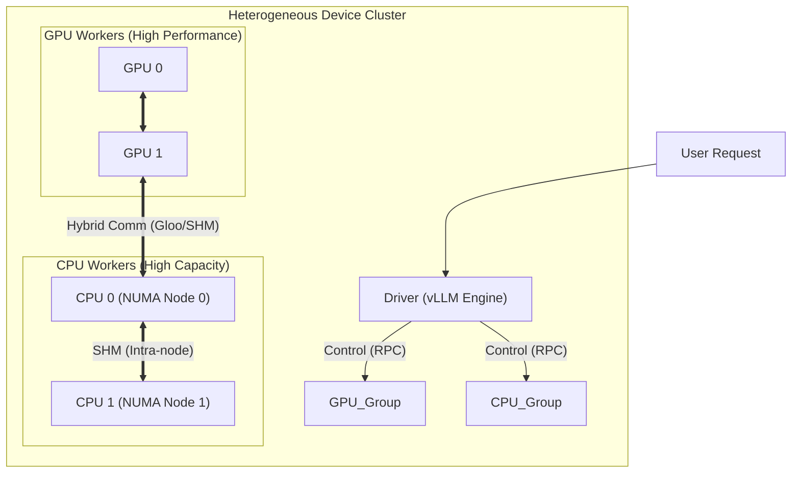

# vLLM Hybrid: Heterogeneous Pipeline Parallelism

[](https://www.python.org/downloads/)
[](https://opensource.org/licenses/Apache-2.0)
[]()

**vLLM Hybrid**는 고성능 LLM 추론 엔진인 [vLLM](https://github.com/vllm-project/vllm)을 확장하여, GPU와 CPU를 결합한 **이형(Heterogeneous) 파이프라인 병렬 처리**를 지원하는 프로젝트입니다.

GPU 메모리가 부족한 상황에서도 CPU의 방대한 RAM을 활용하여 거대 언어 모델을 로드하고 추론할 수 있도록 설계되었습니다.

## 문서 (Documentation)

이 프로젝트는 복잡한 하이브리드 아키텍처를 이해하기 위해 상세한 분석 문서를 제공합니다.

- **[System Overview (아키텍처 개요)](./analysis/overview.md)**: 전체 시스템의 구조와 동작 원리를 설명합니다.
- **[Heterogeneous Platform (플랫폼)](./analysis/platform.md)**: 동적 위임과 하이브리드 리소스 할당의 핵심 구현을 다룹니다.
- **[CPU Worker (CPU 워커)](./analysis/worker.md)**: CPU 상에서의 추론을 위한 스레드 바인딩과 최적화 기법을 분석합니다.
- **[Communication (통신 레이어)](./analysis/communication.md)**: GPU-CPU 간의 데이터 교환 및 통신 프로토콜을 설명합니다.

---

## Architecture (아키텍처)

vLLM Hybrid는 기존 GPU 클러스터 구조에 유연한 **CPU 워커**를 통합하였습니다. 자세한 내용은 **[System Overview](./analysis/overview.md)** 문서를 참고하세요.



### 핵심 기능 (Key Features)

| Feature | Description |
| :--- | :--- |
| **Dynamic Delegation** | `HeterogeneousPlatform`을 통해 요청의 종류와 대상에 따라 CUDA 또는 CPU 백엔드로 로직을 동적으로 위임합니다. |
| **Hybrid Pipeline** | GPU 전용 레이어와 CPU 오프로드 레이어를 하나의 파이프라인으로 구성하여 추론을 수행합니다. |
| **Optimized Backend** | GPU는 `FlashAttention`, CPU는 `Torch SDPA` 등 각 하드웨어에 최적화된 커널을 자동으로 선택합니다. |
| **Shared Memory** | 동일 노드 내 CPU 간 통신 시 `Shared Memory (SHM)`를 사용하여 오버헤드를 최소화합니다. |

## Getting Started

### Prerequisites

- NVIDIA GPU (CUDA 12.1+)
- Linux OS (with NUMA support recommended)
- Python 3.10+

### Installation (Developer Mode)

본 프로젝트는 `uv`를 사용한 빌드 및 설치를 권장합니다. 아래 절차를 따라 개발 환경을 구축하세요.

#### 1. Clone & Environment Setup

```bash
git clone git@github.com:mystous/vllm_hybrid.git
uv venv vllm_dev_prj --python 3.12 --seed
source vllm_dev_prj/bin/activate
cd vllm_hybrid
```

#### 2. Install Dependencies

```bash
VLLM_USE_PRECOMPILED=1 uv pip install -U -e . --torch-backend=auto
uv pip install -r requirements/build.txt --torch-backend=auto
```

#### 3. Build Configuration (CMake Fix)

Build Configuration을 생성하고, 최신 CUDA Toolkit과의 호환성 문제(NVTX 헤더)를 해결하기 위해 `CMakeLists.txt`를 수정해야 합니다.

```bash
python tools/generate_cmake_presets.py
```

`CMakeLists.txt` 파일의 약 73번째 줄(주석 `Import torch cmake configuration` 근처)에 다음 코드를 추가합니다.

```cmake
# Workaround for PyTorch NVTX headers issue with newer CUDA Toolkits
# Assumes find_package(CUDAToolkit) was already done
message(STATUS "Applying custom PyTorch NVTX headers workaround...")
if(NOT TARGET CUDA::nvToolsExt)    
    message(STATUS "--> nvToolsExt Not found, looking for nvtx3.")
    if (NOT TARGET CUDA::nvtx3)
        message(STATUS "--> nvtx3 not found, adding library.")
        add_library(CUDA::nvtx3 INTERFACE IMPORTED)
        target_include_directories(CUDA::nvtx3 SYSTEM INTERFACE "${CUDAToolkit_INCLUDE_DIRS}")
        target_link_libraries(CUDA::nvtx3 INTERFACE ${CMAKE_DL_LIBS})
    endif()
    if (TARGET CUDA::nvtx3)
     add_library(CUDA::nvToolsExt INTERFACE IMPORTED)
     target_compile_definitions(
         CUDA::nvToolsExt INTERFACE
         TORCH_CUDA_USE_NVTX3
     )
     target_link_libraries(CUDA::nvToolsExt INTERFACE CUDA::nvtx3)
     message(STATUS "--> Workaround applied. Created CUDA::nvToolsExt target linked to CUDA::nvtx3.")
    else()
     message(STATUS "--> nvtx3 not found.")
    endif()
else()
    message(STATUS "--> Workaround not needed or conditions not met.")
endif()
```

#### 4. Build & Install

```bash
cmake --preset release
# (Optional) Verify presets in CMakeUserPresets.json if needed
cmake --build --preset release --target install
```

### Usage

하이브리드 모드를 활성화하려면 `VLLM_HETEROGENEOUS_PLATFORM=1` 환경 변수를 설정하고 실행해야 합니다.

```bash
# Example: 1 GPU + 1 CPU Worker (Pipeline Parallelism = 2)
export VLLM_HETEROGENEOUS_PLATFORM=1

python -m vllm.entrypoints.openai.api_server \
    --model <YOUR_MODEL> \
    --pipeline-parallel-size 2 \
    --device-type heterogeneous
```

### Benchmarking

서버가 실행 중인 상태에서 다음 명령어로 추론 성능을 측정할 수 있습니다.

```bash
python benchmarks/benchmark_serving.py \
    --backend openai \
    --base-url http://localhost:8000 \
    --model <YOUR_MODEL> \
    --dataset-name random \
    --num-prompts 500 \
    --random-input-len 128 \
    --random-output-len 128 \
    --no-stream
```

## Limitations & Known Issues

- **P2P Communication**: 현재 파이프라인 간 텐서 전송(P2P)은 안전성을 위해 `Gloo` 백엔드(TCP)로 폴백(Fallback)되어 동작합니다. 추후 SHM 적용 예정입니다.
- **CPU Performance**: CPU 추론은 GPU에 비해 현저히 느리며, 메모리 대역폭에 민감합니다. NUMA 설정이 올바르지 않으면 성능 저하가 발생할 수 있습니다.
- **Torch Compile**: CPU 워커에서는 `torch.compile`이 비활성화(Eager Mode)됩니다.

## License

This project is licensed under the Apache 2.0 License - see the [LICENSE](LICENSE) file for details.
