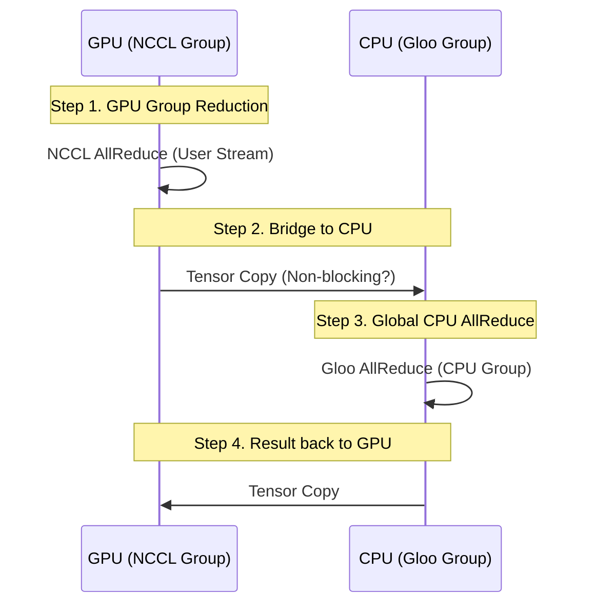
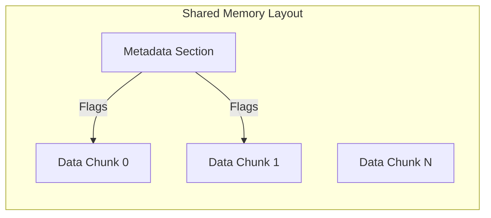

# vLLM Hybrid 통신 레이어 분석

[← Overview로 돌아가기](./overview.md)

이 문서는 `vllm_hybrid`에서 GPU와 CPU 간의 효율적인 데이터 교환을 위해 구축된 통신 레이어(Communication Layer)를 심층 분석합니다.

## 1. 개요

이형(Heterogeneous) 환경에서 가장 큰 병목은 디바이스 간 통신 속도 차이입니다. GPU 간 통신(NVLink/PCIe + NCCL)은 매우 빠르지만, GPU와 CPU 간, 혹은 CPU 간 통신(PCIe/RAM + Gloo)은 상대적으로 느립니다. 이를 극복하기 위해 `vllm_hybrid`는 다음과 같은 전략을 사용합니다.

1. **계층적 통신**: 가능한 한 고속 통신(GPU 끼리)을 우선 수행하고, 필요한 최소한의 데이터만 저속 구간(GPU-CPU)을 통과하게 합니다.
2. **공유 메모리(Shared Memory) 최적화**: 동일 노드 내 CPU 간 통신 시, 느린 네트워크 스택(TCP/IP loopback) 대신 공유 메모리(`shm`)를 사용하여 복사 오버헤드를 줄입니다.

## 2. HeterogeneousDeviceCommunicator 구조

`vllm/platforms/heterogeneous.py`에 정의된 `HeterogeneousDeviceCommunicator`는 GPU와 CPU를 아우르는 통신을 조율합니다.

### 2.1. AllReduce 동작 흐름

AllReduce 연산은 다음 4단계로 이루어집니다.

- **코드 구현 (`vllm/distributed/parallel_state.py`)**:
    - `_all_reduce_out_place` 함수 내에서 `_is_heterogeneous_environment()` 체크.
    - 리더 GPU(Rank 0 등)만 데이터를 CPU로 내려서 CPU 그룹 통신에 참여시키는 최적화가 있는지는 코드상(`input_.cpu()`) 명확지 않으나, 기본적으로 GPU 텐서를 CPU로 옮겨서(`input_.cpu()`) Gloo 통신을 태우는 구조입니다.

### 2.2. 통신 방식 선택 (SHM vs Gloo)

현재 코드베이스는 연산 종류에 따라 통신 방식을 다르게 적용합니다.

- **집합 통신 (Collectives)**: `all_reduce`, `all_gather`는 `HeterogeneousDeviceCommunicator`가 `_CPUSHMDistributed`를 통해 **Shared Memory (SHM)**를 사용합니다.
- **P2P 통신 (Pipeline)**: `send`, `recv` 및 `send_tensor_dict`는 SHM 경로가 연결되지 않아 **Gloo (TCP Loopback)**를 사용합니다.
    - 특히 파이프라인 병렬 처리 시, GPU 텐서는 CPU로 복사된 후 `cpu_group`(Gloo)을 통해 전송됩니다.

### 2.3. Fallback 로직 (Parallel State)

`vllm/distributed/parallel_state.py`는 이형 환경일 때 자동으로 Fallback 로직을 수행합니다.

- **GPU 랭크**: `device_group`(NCCL)이 존재하므로 1차 감축 후 CPU로 이동.
- **CPU 랭크**: `device_group`이 `None`이므로 바로 CPU 그룹 `all_reduce`에 참여.

## 3. Shared Memory (SHM) Broadcast

`vllm/distributed/device_communicators/shm_broadcast.py`는 CPU 워커 간의 통신을 가속화하기 위해 구현되었습니다. 주로 모델 가중치 방송(Broadcast)이나 제어 신호 전달에 사용됩니다.

### 3.1. Ring Buffer 구조

SHM 버퍼는 **링 버퍼(Ring Buffer)** 형태로 관리되며, 메타데이터 영역과 데이터 영역으로 나뉩니다.

- **Metadata**: 각 청크(Chunk)의 상태(Written, Read by Reader N)를 관리하는 플래그 비트맵.
- **Data**: 실제 직렬화된 데이터가 저장되는 청크들.

### 3.2. 동작 방식 (Writer & Reader)

- **Writer (Broadcaster)**:
  1. `acquire_write`로 쓰기 가능한 청크를 찾음 (모든 Reader가 읽은 청크).
  2. 데이터를 직렬화(`pickle`)하여 버퍼에 쓰고, Written 플래그를 세팅.
  3. `XPUB` 소켓을 통해 "데이터 준비됨" 신호(혹은 큰 데이터의 경우 직접 전송)를 보낼 수도 있음.

- **Reader (Receiver)**:
  1. `acquire_read`로 읽기 가능한 청크를 대기 (Written 플래그가 1이고, 아직 내가 안 읽은 청크).
  2. `SpinTimer`를 사용하여 CPU 사용률을 조절하며 대기(Busy Wait -> Sleep).
  3. 데이터를 읽고 역직렬화한 뒤, Read 플래그를 세팅하여 Writer에게 반환.

## 4. 통신 그룹 초기화 (Initialization)

`parallel_state.py`의 `GroupCoordinator`는 `Heterogeneous` 모드일 때 다음과 같이 그룹을 쪼갭니다.

| 그룹 종류 | 포함되는 랭크 | 백엔드 | 용도 |
| :--- | :--- | :--- | :--- |
| **Device Group** | GPU 랭크들 (예: 0~7) | **NCCL** | Tensor Parallelism, 고속 연산 |
| **CPU Group** | 모든 랭크 (GPU + CPU) | **Gloo** | **GPU-CPU 통신**, 제어 신호, Pipeline 경계 |

**주의사항**: CPU 워커를 NCCL 그룹에 포함시키면 초기화 시점에서 데드락이 발생하므로, `cpu_group`은 별도로 관리되어야 합니다.

[← Overview로 돌아가기](./overview.md)
