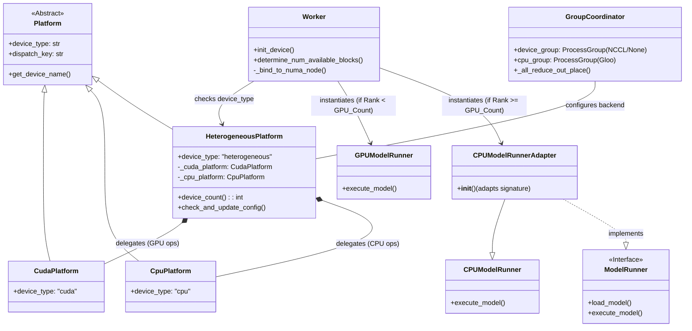

# 이기종(Heterogeneous) 플랫폼 아키텍처

이 문서는 vLLM 이기종 플랫폼 지원의 아키텍처와 실행 흐름을 시각화합니다. (UML 다이어그램은 영어로 표기됩니다.)

## 1. 클래스 다이어그램 (Class Diagram)

이 다이어그램은 새로운 `HeterogeneousPlatform`, `Worker`, `ModelRunner` 컴포넌트 간의 구조적 관계를 보여줍니다.

## 2. 실행 시퀀스 다이어그램 (8 GPU + 2 CPU)

이 시퀀스 다이어그램은 8개의 GPU 워커(Rank 0-7)와 2개의 CPU 워커(Rank 8-9)가 있는 시스템의 초기화 및 실행 흐름을 보여줍니다.

```mermaid
sequenceDiagram
    autonumber
    participant Main as Engine/Entrypoint
    participant P_Het as HeterogeneousPlatform
    participant W_GPU as Worker (Rank 0-7)
    participant W_CPU as Worker (Rank 8-9)
    participant PS as ParallelState (GroupCoordinator)

    Note over Main: User starts with --device=heterogeneous

    Main->>P_Het: Initialize Plugin (Env Var Set)
    
    par Worker Initialization
        Main->>W_GPU: __init__(rank=0..7)
        W_GPU->>P_Het: Check device type
        W_GPU->>W_GPU: init_device() -> CUDA Init
        W_GPU->>W_GPU: Select GPUModelRunner
        
        Main->>W_CPU: __init__(rank=8..9)
        W_CPU->>P_Het: Check device type
        W_CPU->>W_CPU: init_device() -> CPU Init
        W_CPU->>W_CPU: _bind_to_numa_node(0 or 1)
        W_CPU->>W_CPU: Select CPUModelRunnerAdapter
    end

    Note over PS: Distributed Environment Setup

    par Group Creation
        W_GPU->>PS: Create GroupCoordinator
        PS->>PS: device_group = NCCL (Ranks 0-7)
        PS->>PS: cpu_group = Gloo (Ranks 0-9)
        
        W_CPU->>PS: Create GroupCoordinator
        PS->>PS: device_group = None
        PS->>PS: cpu_group = Gloo (Ranks 0-9)
    end

    Note over W_GPU, W_CPU: Memory Allocation

    W_GPU->>W_GPU: determine_num_available_blocks() -> Alloc GPU Cache
    W_CPU->>W_CPU: determine_num_available_blocks() -> Force 0 GPU Blocks

    Note over W_GPU, W_CPU: Execution Loop (Tensor Parallel AllReduce)

    Main->>W_GPU: execute_model()
    Main->>W_CPU: execute_model()

    W_GPU->>PS: all_reduce(input_tensor)
    W_CPU->>PS: all_reduce(input_tensor)

    rect rgb(20, 20, 40)
        Note right of PS: Hierarchical AllReduce Logic
        
        PS->>PS: [GPU Only] NCCL AllReduce (device_group)
        Note right of W_GPU: GPUs agree on partial sum
        
        PS->>PS: [Rank 0] Copy Result to CPU
        PS->>PS: [Rank 1-7] Zero out CPU Buffer
        
        PS->>PS: [All Ranks] Gloo AllReduce (cpu_group)
        Note right of PS: Integrates GPU Sum + CPU Rank Results
        
        PS->>PS: [GPU Ranks] Copy Final Result to Device
    end

    PS-->>W_GPU: Return Final Tensor
    PS-->>W_CPU: Return Final Tensor
```

