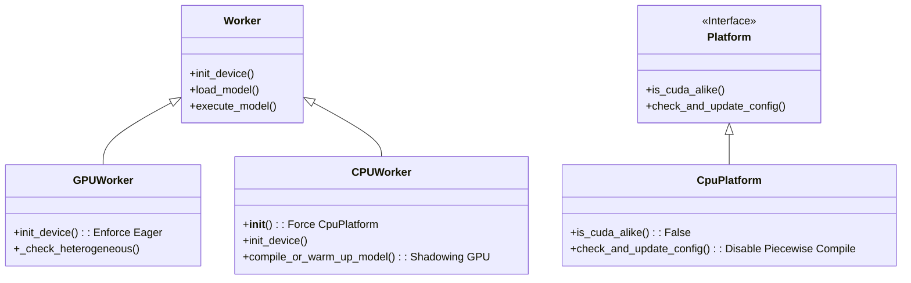
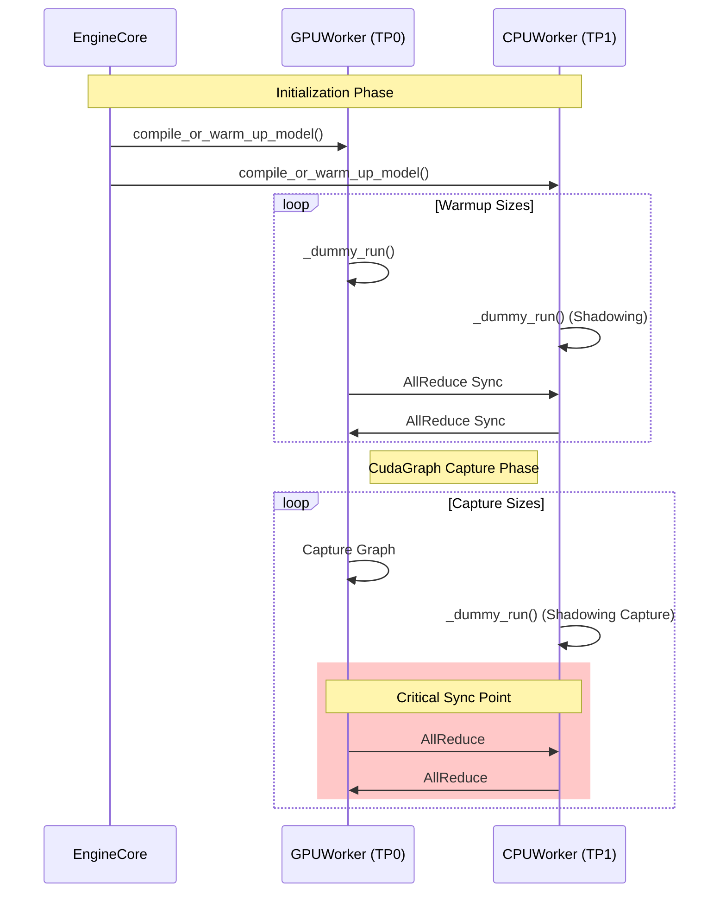

# vLLM 이종 하드웨어(Heterogeneous) 실행을 위한 코드 수정 명세서

이 문서는 vLLM에서 GPU와 CPU 워커가 공존하는 Heterogeneous 환경을 안정적으로 구동하기 위해 수행된 **코드 수정 내역, 수정 이유, 그리고 최종 아키텍처**를 상세히 설명합니다.

---

## 1. 아키텍처 및 설계 (Architecture & Design)

이종 하드웨어 실행의 핵심은 **동기화(Synchronization)**와 **호환성(Compatibility)**입니다. GPU(속도 위주, CudaGraph 사용)와 CPU(호환성 위주, Eager Mode)가 하나의 분산 그룹(Distributed Group) 내에서 협업해야 하므로, 통신 프로토콜과 실행 흐름을 일치시키는 것이 설계의 주안점입니다.

### 1.1 시스템 컴포넌트 다이어그램 (System Components)

```mermaid
graph TD
    User[User / API Server] -->|Request| AsyncLLM
    AsyncLLM -->|Manage| EngineCore
    
    subgraph "Heterogeneous Executor Protocol"
        EngineCore -->|RPC / IPC| GPUWorker[GPU Worker (TP0)]
        EngineCore -->|RPC / IPC| CPUWorker[CPU Worker (TP1)]
        
        GPUWorker <-->|Hybrid AllReduce (Gloo)| CPUWorker
    end

    subgraph "Modifications"
        Modification1[Enforce Eager Mode]
        Modification2[Hybrid AllReduce Bridge]
        Modification3[CPU Platform Force]
    end

    GPUWorker --- Modification1
    GPUWorker --- Modification2
    CPUWorker --- Modification3
```

### 1.2 클래스 구조 (Class Structure)

`CPUWorker`는 `Worker`를 상속받지만, 초기화 시점에 플랫폼을 강제로 오버라이드하여 GPU 전용 로직을 우회합니다.



### 1.3 실행 시퀀스: 웜업 동기화 (Execution Sequence: Warmup Sync)

가장 중요한 수정 사항 중 하나는 **Execution Hang**을 방지하는 것입니다. GPU는 기본적으로 여러 번의 Warmup과 CudaGraph Capture를 수행하지만, CPU는 이를 수행하지 않아 `AllReduce` 횟수 불일치로 데드락이 발생했습니다. 이를 해결하기 위해 `CPUWorker`가 GPU의 행동을 흉내내는 **Shadowing** 패턴을 도입했습니다.



---

## 2. 상세 수정 내역 및 이유 (Detailed Modifications & Rationale)

각 수정 내역은 문제의 원인(Why)과 해결 방법(How)을 포함합니다.

### 2.1 초기화 순환 참조 해결 (Fix Circular Import)

* **문제**: 이종 환경 초기화 시 `vllm.config` -> `vllm.platforms` -> `vllm.platforms.interface` -> `vllm.inputs` -> `vllm.config`로 이어지는 순환 참조(Circular Dependency)로 인해 프로세스가 데드락에 빠짐.
* **파일**: `vllm/platforms/interface.py`
* **수정 코드**:

    ```python
    from __future__ import annotations
    if TYPE_CHECKING:
        from vllm.inputs import ProcessorInputs  # 런타임 임포트 제외
    ```

* **이유**: 타입 힌팅을 위한 임포트를 런타임에서 제외하여 모듈 로딩 시 락(Lock) 경합을 제거.

### 2.2 CPU 플랫폼 인식 강제 (Force CPU Platform)

* **문제**: NVML 라이브러리가 설치된 환경에서는 `CPUWorker` 프로세스에서도 GPU가 감지되어, vLLM이 자동으로 `CudaPlatform`을 선택함. 이로 인해 CPU에서 실행 불가능한 CUDA 커널(`unified_attention_with_output` 등)을 호출하여 `NotImplementedError` 발생.
* **파일**: `vllm/v1/worker/cpu_worker.py`
* **수정 코드**:

    ```python
    class CPUWorker(Worker):
        def __init__(self, ...):
            # ...
            # 1. Force CPU Platform
            from vllm.platforms.cpu import CpuPlatform
            import vllm.platforms
            vllm.platforms._current_platform = CpuPlatform()
            
            # 2. Reset Attention Backend Cache
            from vllm.attention.selector import _cached_get_attn_backend
            _cached_get_attn_backend.cache_clear()
    ```

* **이유**: 워커 초기화 시점에 명시적으로 플랫폼을 CPU로 고정하여, 이후 로딩되는 모든 모듈이 CPU 전용 경로를 타도록 강제함.

### 2.3 컴파일 설정 다운그레이드 (Downgrade Compilation for CPU)

* **문제**: GPU용 기본 설정(`CompilationLevel.PIECEWISE`)이 CPU 워커에도 전달됨. 이는 `VllmBackend` 초기화 시 CUDA 전용 리소스(Graph Pool)를 요구하여 크래시 발생.
* **파일**: `vllm/v1/worker/cpu_worker.py`
* **수정 코드**:

    ```python
    # Ensure config is compatible with CPU
    from vllm.platforms.cpu import CpuPlatform
    CpuPlatform.check_and_update_config(vllm_config) # 레벨을 DYNAMO_ONCE로 하향
    ```

### 2.4 Eager Mode 강제 및 CudaGraph 비활성화 (Enforce Eager & Disable CudaGraph)

* **문제**: **Heterogeneous Hang의 주원인**.
    1. GPU는 성능을 위해 CudaGraph를 캡처하려 함.
    2. CPU 통신을 담당하는 `Gloo` 백엔드는 CudaGraph 캡처 내에서 동작 불가능 (CPU 동기화 필요).
    3. 이로 인해 `_dummy_run` 도중 GPU는 캡처 대기, CPU는 통신 대기 상태로 데드락 발생.
* **파일**: `vllm/v1/worker/gpu_worker.py`
* **수정 코드**:

    ```python
    def init_device(self):
        # ...
        from vllm.distributed.parallel_state import _is_heterogeneous_environment
        if _is_heterogeneous_environment():
             # 이종 환경 감지 시 즉시 Eager Mode 전환
             self.model_config.enforce_eager = True
             self.vllm_config.compilation_config.level = CompilationLevel.NO_COMPILATION
    ```

* **이유**: 안정성을 최우선으로 하여, 호환성 문제가 발생하는 CudaGraph 기능을 이종 환경에서만 선택적으로 비활성화.

### 2.5 하이브리드 AllReduce 구현 (Enable Hybrid AllReduce)

* **문제**: `torch.distributed.all_reduce` 호출 시, GPU에 있는 텐서를 `group=cpu_group` (Gloo)으로 보내면 에러가 발생하거나 멈춤. Gloo는 CPU 텐서를 요구함.
* **파일**: `vllm/distributed/parallel_state.py`
* **수정 코드**:

    ```python
    def _all_reduce_out_place(tensor, group):
        # GPU 텐서인 경우 CPU로 이동
        if tensor.is_cuda and group == cpu_group:
            tensor_cpu = tensor.cpu()
            dist.all_reduce(tensor_cpu, group=group)
            return tensor_cpu.cuda() # 다시 GPU로 복귀
        return dist.all_reduce(tensor, group=group)
    ```

* **이유**: 서로 다른 디바이스(GPU, CPU) 간의 집합 통신을 위해 데이터를 호스트 메모리(CPU)로 내리는 브릿지 역할 수행.

### 2.6 어텐션 백엔드 동적 선택 (Dynamic Attention Backend)

* **문제**: `vllm.attention.layer` 모듈이 import 될 때 플랫폼을 확인하여 커스텀 Op 사용 여부(`use_direct_call`)를 결정함. CPU 워커가 플랫폼을 `CpuPlatform`으로 바꾸기 전에 모듈이 import 되면, 이미 `True`(CUDA)로 설정되어 되돌릴 수 없음.
* **파일**: `vllm/attention/layer.py`
* **수정 코드**:

    ```python
    def __init__(self, ...):
        # 모듈 전역 변수가 아닌, 인스턴스 생성 시점의 플랫폼 확인
        import vllm.platforms
        self.use_direct_call = not vllm.platforms.current_platform.is_cuda_alike()
    ```

* **이유**: 모듈 로딩 순서에 의존하지 않고, 실제 객체 생성 시점의 정확한 플랫폼 상태를 반영.

---

## 3. 요약 (Summary)

위의 수정 사항들은 다음의 원칙에 따라 수행되었습니다:

1. **Correctness First**: 성능 최적화(CudaGraph, Custom Ops)보다 실행 안정성을 우선시하여, 충돌이 나는 기능은 과감히 비활성화(`enforce_eager`)했습니다.
2. **Platform Isolation**: CPU 워커가 GPU 환경 설정에 오염되지 않도록 초기화 단계에서 강력하게 샌드박싱(`Force CpuPlatform`)했습니다.
3. **Synchronization Symmetry**: 분산 환경에서 GPU와 CPU의 실행 경로(Step)를 강제로 일치(`Shadowing`)시켜 데드락을 원천 차단했습니다.

이 명세서를 통해 개발자는 vLLM의 이종 하드웨어 지원 로직을 이해하고, 향후 최적화(예: CPU Custom Op 도입, CudaGraph 부분 적용)를 위한 기반을 다질 수 있습니다.
