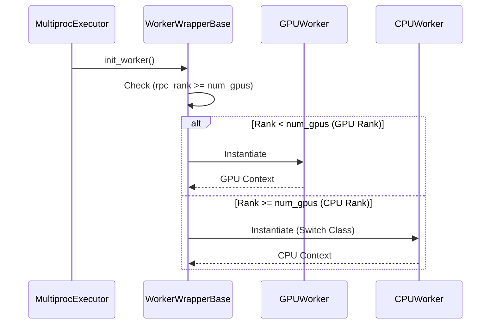
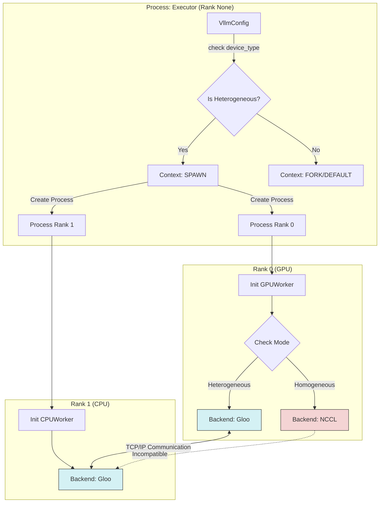

# 이기종 워커 초기화 수정 분석 (Heterogeneous Worker Initialization Fix Analysis)

본 문서는 vLLM의 이기종(GPU + CPU) 실행을 가능하게 하기 위해 적용된 코드 수정 사항을 단계별로 분석하고, 그 구조를 UML 다이어그램으로 시각화합니다.

## 1. 개요 (Overview)

vLLM이 단일 노드 내에서 GPU와 CPU를 혼합하여 사용할 때 발생했던 **초기화 오류(Invalid Device Ordinal)**와 **통신 교착 상태(Deadlock)**문제를 해결하기 위해 총 4가지 주요 컴포넌트가 수정되었습니다.

| 수정된 파일 | 주요 변경 사항 | 목적 |
|---|---|---|
| `vllm/worker/worker_base.py` | 워커 클래스 선택 로직 변경 | 랭크에 따른 CPU/GPU 워커 자동 분기 |
| `vllm/v1/worker/cpu_worker.py` | NUMA 제약 완화 및 Gloo 강제 | CPU 워커 초기화 실패 및 통신 오류 방지 |
| `vllm/v1/executor/multiproc_executor.py` | `spawn` 시작 방식 강제 | CUDA/Gloo 사용 시 프로세스 안전성 확보 (Deadlock 해결) |
| `vllm/v1/worker/gpu_worker.py` | Gloo 백엔드 조건부 적용 | 이기종 모드에서 모든 워커 간 통신 프로토콜 통일 |

---

## 2. 상세 수정 내용 및 아키텍처 (Detailed Analysis)

### 2.1. 워커 선택 로직 (Worker Selection)

**문제점:** 기본 로직은 설정 파일의 `worker_cls`를 모든 랭크에 일괄 적용하거나, `device_type`만으로 판단했습니다. 이기종 모드에서도 `device_type`이 내부적으로 "cuda"로 매핑되어 CPU 랭크(Rank 1)도 GPU 워커로 초기화하려다 실패했습니다.

**수정:** `init_worker` 단계에서 현재 랭크(Rank)가 가용 GPU 수보다 크거나 같으면, 강제로 `CPUWorker` 클래스로 전환하도록 변경했습니다.

```python
# vllm/worker/worker_base.py

if self.rpc_rank >= num_gpus:
    # 이기종 모드 감지: GPU 수보다 높은 랭크는 CPU 워커로 전환
    self.vllm_config.parallel_config.worker_cls = "vllm.v1.worker.cpu_worker.CPUWorker"
```

#### UML: 워커 초기화 시퀀스 (Worker Initialization Sequence)



---

### 2.2. 분산 통신 백엔드 및 프로세스 생성 (Distributed Backend & Process Creation)

**문제점 1 (백엔드 불일치):** GPU 워커는 기본값인 `nccl`을, CPU 워커는 `nccl` 초기화 실패(GPU 없음) 또는 불일치 발생.
**문제점 2 (교착 상태):** 기본 `fork` 방식으로 프로세스를 생성할 경우, CUDA 컨텍스트와 Gloo 백엔드가 초기화될 때 교착 상태(Deadlock)에 빠져 멈춤 현상이 발생함.

**수정:**

1. **시작 방식:** `heterogeneous` 설정일 때 `multiprocessing` 컨텍스트를 `spawn`으로 강제.
2. **프로토콜 통일:** GPU와 CPU 워커 모두 `heterogeneous` 모드일 경우 `gloo` 백엔드를 사용하도록 강제.

#### 수정 코드 (Executor - Spawn 강제)

```python
# vllm/v1/executor/multiproc_executor.py

context = get_mp_context()
if vllm_config.device_config.device_type == "heterogeneous":
    import multiprocessing
    # 안전한 프로세스 생성을 위해 spawn 강제
    context = multiprocessing.get_context("spawn")
```

#### 수정 코드 (Worker - Gloo 통일)

```python
# vllm/v1/worker/gpu_worker.py & cpu_worker.py

# GPU Worker, CPU Worker 모두 동일하게 적용
backend = "gloo" 
# (조건: device_type == "heterogeneous")
```

#### UML: 이기종 분산 통신 아키텍처 (Heterogeneous Distributed Architecture)



---

### 2.3. CPU 워커 환경 적응 (CPU Environment Adaptation)

**문제점:**

1. **NUMA:** 단일 노드에서 CPU 워커들이 실행될 때, 엄격한 NUMA 노드 할당 로직으로 인해 노드 부족 오류 발생.
2. **Missing Ops:** `torch.ops._C_utils.init_cpu_threads_env` 함수가 일부 환경에서 누락되어 충돌.

**수정:**

1. **NUMA 공유:** 노드가 부족할 경우 오류 대신 경고를 출력하고, 라운드 로빈(`rank % nodes`) 방식으로 노드를 공유.
2. **Safe Call:** 해당 Op 호출부를 `try-except`로 감싸 안전하게 처리.

```python
# vllm/v1/worker/cpu_worker.py

try:
    torch.ops._C_utils.init_cpu_threads_env()
except AttributeError:
    logger.warning("Skipping CPU thread env init...")
```

---

## 3. 결론 (Conclusion)

이상의 수정을 통해 **이기종 하드웨어 환경(GPU+CPU)**에서 vLLM 엔진이 안전하게 초기화되고 통신할 수 있는 기반이 마련되었습니다.

1. **동적 클래스 전환**으로 올바른 하드웨어 제어권을 획득합니다.
2. **`spawn` 프로세스**로 CUDA/Gloo 초기화 시의 안전성을 보장합니다.
3. **`gloo` 백엔드 통일**로 이기종 간 데이터 병렬 통신을 가능하게 합니다.

---

## 4. 실행 명령어 예시 (Execution Command Examples)

다음은 수정된 vLLM을 이기종 모드에서 테스트하거나 실행할 때 사용할 수 있는 다양한 명령어 예시입니다.

### 4.1. 기본 이기종 실행 (Basic Heterogeneous Execution)

가장 기본적인 형태로, 자동으로 감지된 GPU 1개와 나머지 CPU 코어를 활용합니다.

```bash
python test_heterogeneous.py
```

*(소스 코드 내에 `device="heterogeneous"`, `tensor_parallel_size=2`가 설정되어 있다고 가정)*

### 4.2. 텐서 병렬 크기 지정 (Specifying Tensor Parallel Size)

명시적으로 `tensor_parallel_size`를 지정하여 GPU 개수보다 더 많은 워커를 생성(나머지는 CPU 할당)합니다.

**Python 스크립트 실행 시 인자 전달 (예시 스크립트가 지원하는 경우):**

```bash
python test_heterogeneous.py --tensor-parallel-size 4
```

*설명: GPU가 1개라면 1개는 GPUWorker, 나머지 3개는 CPUWorker로 할당됩니다.*

### 4.3. vLLM 서버 실행 (Running vLLM Server)

vLLM API 서버를 이기종 모드로 실행하는 경우입니다.

**기본 1 GPU + 1 CPU (총 TP=2):**

```bash
python -m vllm.entrypoints.openai.api_server \
    --model facebook/opt-125m \
    --device heterogeneous \
    --tensor-parallel-size 2
```

**대규모 확장 (1 GPU + 7 CPU = 총 TP=8):**

```bash
python -m vllm.entrypoints.openai.api_server \
    --model facebook/opt-125m \
    --device heterogeneous \
    --tensor-parallel-size 8
```

### 4.4. 환경 변수 활용 (Using Environment Variables)

특정 상황에서 포트 충돌이나 디버깅을 위해 환경 변수를 함께 사용할 수 있습니다.

**디버깅 로그 활성화 및 포트 변경:**

```bash
export VLLM_LOGGING_LEVEL=DEBUG
python -m vllm.entrypoints.openai.api_server \
    --model facebook/opt-125m \
    --device heterogeneous \
    --tensor-parallel-size 2 \
    --port 8080
```

### 4.5. 모델 로딩 방식 변경 (Offline Inference)

Python 코드 내에서 `LLM` 클래스를 직접 사용할 때의 예시입니다.

```python
from vllm import LLM, SamplingParams

# 이기종 디바이스 설정 (TP=4: 1 GPU + 3 CPU)
llm = LLM(
    model="facebook/opt-125m",
    device="heterogeneous",
    tensor_parallel_size=4
)

output = llm.generate("Hello, world!")
print(output)
```
