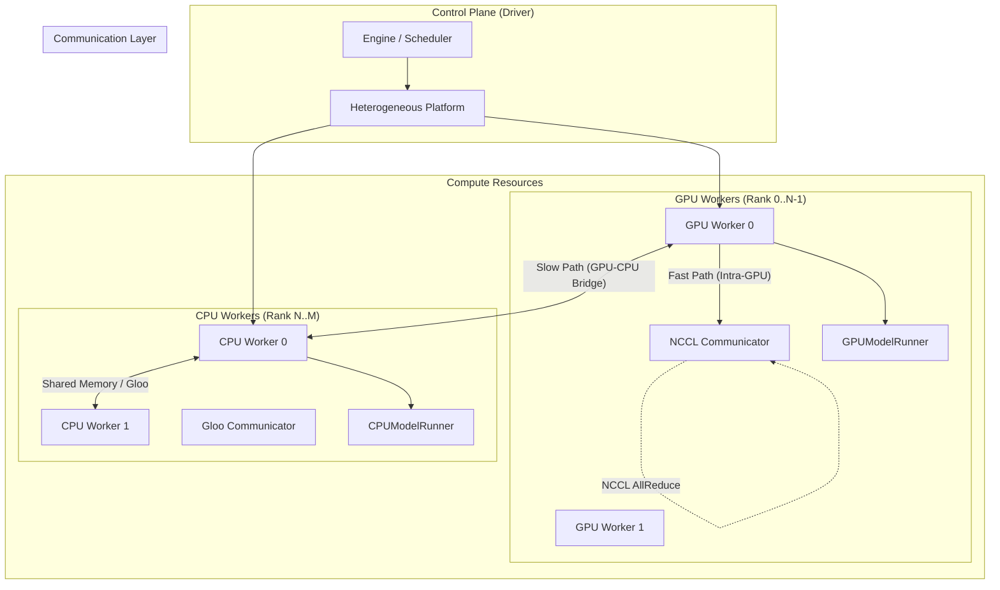

# vLLM Hybrid 아키텍처 분석 개요

이 문서는 `vllm_hybrid` 프로젝트가 원본 `vllm`과 비교하여 어떻게 변경되었는지, 그리고 GPU와 CPU를 혼합하여 추론을 수행하기 위해 어떤 아키텍처를 사용하는지 상세히 분석합니다.

## 1. 프로젝트 개요

**vLLM Hybrid**는 제한된 GPU 자원을 보완하기 위해 CPU 자원을 적극적으로 활용하는 **이형 컴퓨팅(Heterogeneous Computing)** 기반의 추론 엔진입니다. 주로 Pipeline Parallelism(PP)을 확장하여, 모델의 일부 레이어를 CPU 메모리에 할당하고 CPU 연산 자원으로 처리함으로써 전체 모델 수용 능력을 높이거나 처리량을 개선하는 것을 목표로 합니다.

## 2. 핵심 아키텍처 (Core Architecture)

이 프로젝트의 핵심은 **`HeterogeneousPlatform`**의 도입과 그에 따른 **통신(Communication) 레이어의 변화**입니다.

### 아키텍처 다이어그램 (System Overview)

### 주요 변경 컴포넌트

| 컴포넌트 | 파일 위치 | 주요 역할 |
| :--- | :--- | :--- |
| **HeterogeneousPlatform** | `vllm/platforms/heterogeneous.py` | GPU+CPU 혼합 환경 정의, 디바이스 카운트 관리, Worker 할당 로직. |
| **HeterogeneousDeviceCommunicator** | `vllm/platforms/heterogeneous.py` | CPU-GPU 간 통신 브리지. NCCL(GPU)과 Gloo(CPU) 간의 데이터 이동 및 동기화 처리. |
| **CPUWorker** | `vllm/v1/worker/cpu_worker.py` | CPU 전용 워커 구현. `CpuPlatform` 강제 설정, 스레드 바인딩 관리. |
| **CPUModelRunner** | `vllm/v1/worker/cpu_model_runner.py` | **(Hetero Runner)** 실제 CPU 상에서 모델 연산을 수행하는 러너. `GPUModelRunner`를 상속받아 CPU 백엔드에 맞게 동작 수정(Eager Mode, Metadata Broadcast). |
| **Shared Memory Broadcast** | `shm_broadcast.py` | 동일 노드 내 CPU 워커 간 통신 최적화를 위한 공유 메모리(Shared Memory) 기반 데이터 전송. |

## 3. 상세 동작 원리

### 3.1. 플랫폼 초기화 (Platform Initialization)

`vllm`은 시작 시 플랫폼을 감지합니다. `vllm_hybrid`는 `HeterogeneousPlatform`을 기본 플랫폼 중 하나로 등록(또는 강제 설정)하여, 시스템이 GPU만 있는 것이 아니라 추가적인 CPU 워커(가상 디바이스)가 있음을 인식하게 합니다.

- **[플랫폼 상세 분석 (Platform)](./platform.md)**: Heterogeneous 플랫폼의 내부 동작 원리 상세.
- **가상 디바이스 확장**: `device_count()`는 `torch.cuda.device_count() + 2`와 같이 물리적 GPU 개수에 CPU 워커 수를 더하여 리턴합니다. Ray 또는 MP Spawner가 이 숫자를 보고 랭크를 할당합니다.
- **동적 위임(Dynamic Delegation)**: 상황에 따라 `CudaPlatform` 또는 `CpuPlatform`으로 메서드 호출을 위임하여, 단일 인터페이스로 이종 하드웨어를 제어합니다.

### 3.2. 통신 그룹 형성 (Communication Groups)

`vllm/distributed/parallel_state.py`에서 통신 그룹을 초기화할 때 획기적인 변화가 있습니다.

- **Device Group (NCCL)**: 오직 **GPU 랭크**들만 포함됩니다. CPU 워커가 NCCL 그룹에 끼면 초기화 시 행(Hang)이 걸리거나 에러가 발생하므로 철저히 분리합니다.
- **CPU Group (Gloo)**: **모든 랭크(GPU + CPU)**가 포함됩니다. GPU 워커와 CPU 워커가 서로 데이터를 주고받아야 할 때(예: 파이프라인 경계) 이 그룹을 사용합니다.
- **계층적 집합 통신(Hierarchical Collectives)**: `all_reduce` 같은 연산 수행 시, GPU들은 먼저 자기들끼리 NCCL로 고속 연산을 하고, 그 결과를 CPU로 내려서(Copy) CPU 워커들과 Gloo로 최종 결과를 합칩니다.

### 3.3. CPU 워커 실행 (CPU Worker Execution)

`CPUWorker`는 `GPUWorker`를 상속받지만 많은 부분을 오버라이드합니다.

- **Compilation 비활성화**: `torch.compile`이나 CUDA Graph는 CPU에서 불안정하거나 효과가 적으므로 `enforce_eager=True`로 강제합니다.
- **Thread Binding**: CPU 성능을 위해 `vllm/utils`의 스레드 바인딩 로직을 활용하여 각 워커가 특정 CPU 코어들에 바인딩되도록 합니다.
- **SHM 최적화**: 로컬 노드 내에서의 통신은 `SharedMemory` 링 버퍼를 사용하여 직렬화/역직렬화 오버헤드를 줄이고 대역폭을 확보합니다.
- **CPUAttention**: `CPUModelRunner`는 CPU에 특화된 Attention 백엔드(`TorchSDPAMetadataBuilderV1` 등)를 사용하여 연산 효율을 높입니다.

## 4. 분석 상세 문서 링크

- **[통신 레이어 상세 분석 (Communication)](./communication.md)**: `parallel_state.py`와 `HeterogeneousDeviceCommunicator`의 `all_reduce`, `send/recv` 로직 심층 분석.
- **[CPU 워커 상세 분석 (Worker)](./worker.md)**: `CPUWorker`의 초기화 과정, 메모리 관리, `CPUModelRunner`의 동작 방식.
- **[Heterogeneous 플랫폼 분석 (Platform)](./platform.md)**: `HeterogeneousPlatform`의 아키텍처 및 위임 로직 분석.
