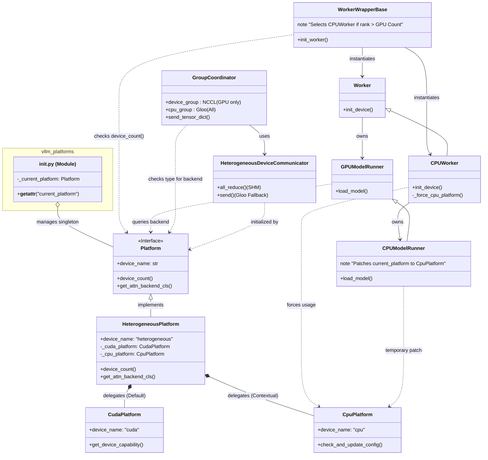
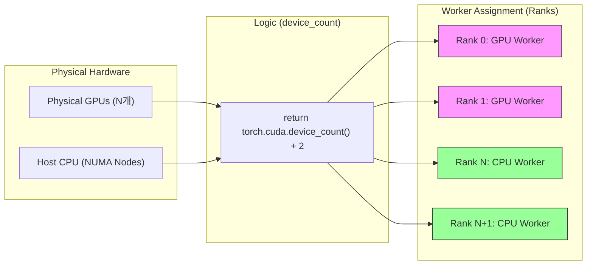
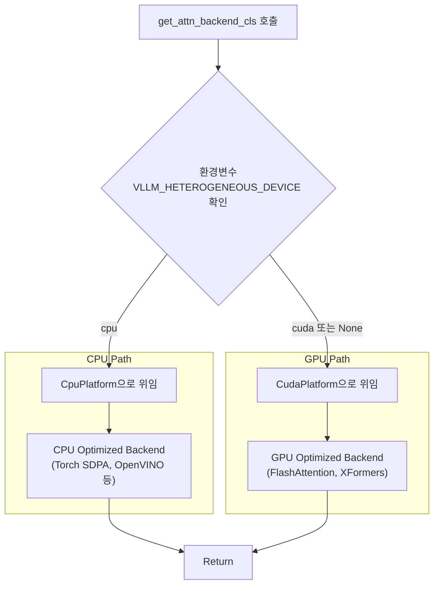

# vLLM Hybrid Heterogeneous Platform 분석

[← Overview로 돌아가기](./overview.md)

이 문서는 `vllm_hybrid`의 핵심 기반인 `HeterogeneousPlatform` 클래스(`vllm/platforms/heterogeneous.py`)를 분석합니다. 소스 코드 나열보다는 **아키텍처 설계 의도**와 **동작 흐름**을 시각적으로 이해하는 데 초점을 맞춥니다.

## 1. 아키텍처 컨셉: 동적 위임 (Dynamic Delegation)

`HeterogeneousPlatform`은 직접 하드웨어를 제어하는 로직을 거의 가지고 있지 않습니다. 대신, 상황에 따라 **CUDA 플랫폼**과 **CPU 플랫폼** 중 적절한 곳으로 요청을 토스(Toss)하는 **프록시(Proxy) 역할**을 수행합니다.

### 1.1. 클래스 구조 및 상호작용 (System Class Diagram)

다음 다이어그램은 `vllm.platforms` 모듈이 어떻게 `HeterogeneousPlatform`을 관리하며, **Worker**, **ModelRunner**, **Coordinator** 등 주요 컴포넌트들이 어떻게 플랫폼을 활용하는지 보여줍니다.

- **기본 동작**: 대부분의 메서드 호출은 `CudaPlatform`으로 전달됩니다. 이는 드라이버(Driver) 로직이 GPU를 기준으로 작성되어 있기 때문입니다.
- **예외 동작**: CPU 워커임을 식별할 수 있는 컨텍스트(환경변수 `VLLM_HETEROGENEOUS_DEVICE="cpu"` 등)에서는 `CpuPlatform`을 호출합니다.

## 2. 하이브리드 리소스 할당 (Resource Allocation)

하이브리드 모드의 가장 큰 특징은 물리적인 디바이스 개수보다 더 많은 '가상 디바이스(Rank)'를 생성한다는 점입니다.

### 2.1. 디바이스 카운팅 및 랭크 매핑

GPU가 $N$개일 때, 시스템은 $N + M$개의 디바이스가 있는 것처럼 행동합니다.

- **코드 로직**: `device_count()` 메서드는 단순히 `cuda.device_count()`만 리턴하는 것이 아니라, 추가로 사용할 CPU 워커의 개수(예: 2개)를 더해서 리턴합니다.
- **결과**: Ray나 Multiprocessing 스포너(Spawner)는 이 숫자를 보고 프로세스를 그만큼 띄우게 되며, `WorkerWrapper` 초기화 시점에 랭크 번호를 확인하여 GPU 범위를 벗어나면 `CPUWorker`로 전환합니다.

## 3. 핵심 로직: Attention Backend 결정 흐름

추론 성능의 핵심인 Attention 연산(FlashAttention vs Torch SDPA 등)을 결정하는 과정입니다.

이 로직 덕분에 코드 수정 없이 하나의 `vllm` 인스턴스 내에서 **고속 GPU 연산**과 **CPU 오프로딩 연산**이 공존할 수 있습니다.

## 4. 통신 클래스 지정 (Communicator)

플랫폼은 자신이 사용할 `DeviceCommunicator` 클래스를 지정합니다.

- **기존**: `CudaPlatform` -> `CudaCommunicator` (NCCL 전용)
- **Heterogeneous**: `HeterogeneousPlatform` -> `HeterogeneousDeviceCommunicator`

`HeterogeneousDeviceCommunicator`는 **NCCL(GPU 그룹)**과 **Gloo(CPU 그룹)**을 모두 들고 있으면서, 데이터가 어느 디바이스에 있느냐에 따라 적절한 통신 방식을 선택하는 브리지 역할을 합니다. (상세 내용은 [Communication 문서](./communication.md) 참조)

[← Overview로 돌아가기](./overview.md)
