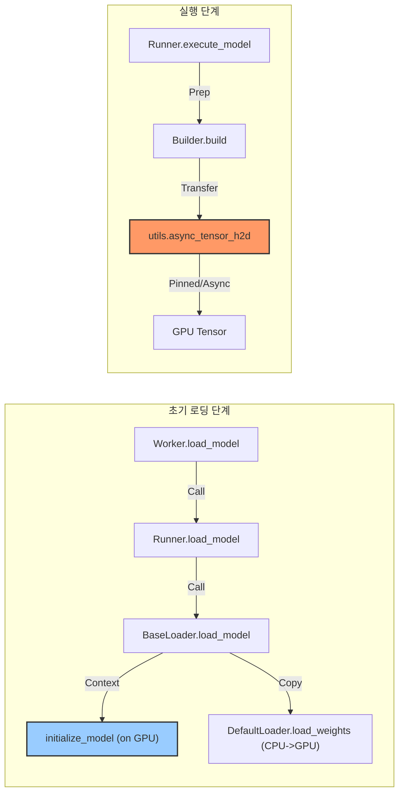

# vLLM CPU-GPU 통신 및 모델 로딩 분석 (Source Code Mapping)

이 문서는 vLLM의 GPU 모델 로딩 과정과 CPU-GPU 간의 통신 구조를 분석하고, 각 단계가 **어떤 소스 코드**에서 실행되는지 매핑한 자료입니다.

## 1. 모델 로딩 과정 (Model Loading Process)

### [단계 1] 로딩 시작 (Worker)
*   **설명**: 워커가 모델 로딩을 시작합니다.
*   **파일**: `vllm/worker/worker.py`
*   **함수**: `load_model`
```python
# vllm/worker/worker.py

def load_model(self):
    # ...
    # 모델 러너에게 로딩 위임
    self.model_runner.load_model()
```

### [단계 2] 모델 초기화 및 GPU 할당 (Runner & Loader)
*   **설명**: 모델의 뼈대를 **GPU 메모리에 직접 생성**합니다. CPU를 거치지 않아 효율적입니다.
*   **파일**: `vllm/model_executor/model_loader/base_loader.py`
*   **함수**: `BaseModelLoader.load_model`
```python
# vllm/model_executor/model_loader/base_loader.py

def load_model(self, ...):
    # 타겟 디바이스(GPU) 설정
    target_device = torch.device(load_device)
    
    # [핵심] GPU 컨텍스트 안에서 모델을 초기화하여 바로 GPU 메모리에 할당
    with target_device:
        model = initialize_model(vllm_config=vllm_config, ...)
        
    # 가중치 로딩 (아래 단계)
    self.load_weights(model, model_config)
```

### [단계 3] 가중치 복사 (CPU -> GPU)
*   **설명**: 디스크에 있는 가중치(Weights)를 CPU로 읽은 후, GPU에 있는 모델로 복사합니다.
*   **파일**: `vllm/model_executor/model_loader/default_loader.py`
*   **함수**: `DefaultModelLoader.load_weights`
```python
# vllm/model_executor/model_loader/default_loader.py

def load_weights(self, model, ...):
    # 가중치 파일 순회
    for name, param in model.named_parameters():
        # 1. 디스크 -> CPU 로딩 (iterator)
        data = get_weight_from_disk(...)
        
        # 2. CPU -> GPU 복사
        # PyTorch의 param.data.copy_ 등을 통해 GPU 메모리로 전송됨
        param.data.copy_(data)
```

---

## 2. 입력 데이터 전송 (Input Execution)

### [단계 1] 입력 텐서 준비 (Builder)
*   **설명**: 사용자 입력을 받아 GPU로 보낼 텐서(Token IDs, Positions)를 준비하고 평탄화(Flatten)합니다.
*   **파일**: `vllm/worker/model_runner.py`
*   **함수**: `ModelInputForGPUBuilder.build`
```python
# vllm/worker/model_runner.py

def build(self) -> ModelInputForGPU:
    # ... 토큰 리스트 합치기 (Flatten) ...
    input_tokens = list[int]()
    # ...
    
    # [핵심] CPU 리스트를 GPU 텐서로 비동기 전송
    input_tokens_tensor = async_tensor_h2d(
        input_tokens, 
        torch.long,
        self.runner.device,
        self.runner.pin_memory # Pinned Memory 사용 여부
    )
```

### [단계 2] 고속 비동기 전송 (H2D Transfer)
*   **설명**: **Pinned Memory**와 **Non-blocking** 전송을 사용하여 CPU에서 GPU로 데이터를 매우 빠르게 보냅니다.
*   **파일**: `vllm/utils/__init__.py`
*   **함수**: `async_tensor_h2d`
```python
# vllm/utils/__init__.py

def async_tensor_h2d(data: list, dtype, target_device, pin_memory: bool):
    # 1. CPU 텐서 생성 (pin_memory=True이면 고정 메모리 할당)
    t = torch.tensor(data, dtype=dtype, pin_memory=pin_memory, device="cpu")
    
    # 2. 비동기 전송 (non_blocking=True)
    # CPU는 전송 완료를 기다리지 않고 바로 리턴 (Overlap)
    return t.to(device=target_device, non_blocking=True)
```

## 3. 요약 다이어그램 (Source Map)


