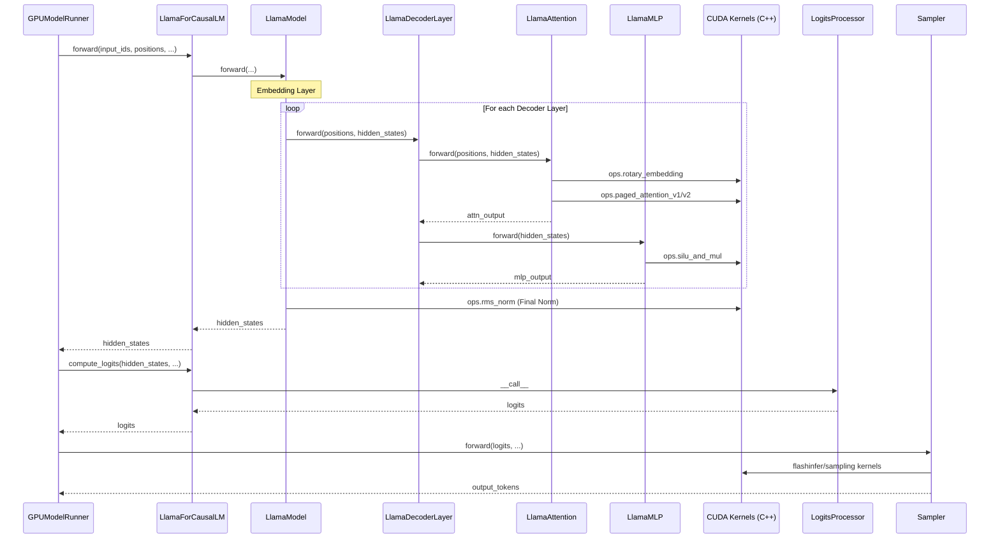
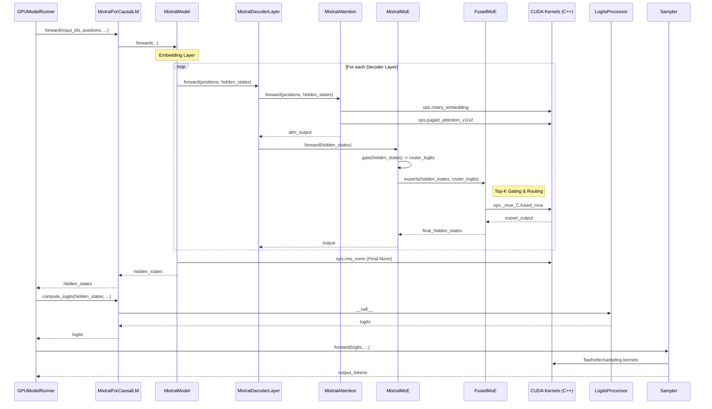

# vLLM Model Execution Flows

This document contains Mermaid sequence diagrams illustrating the execution flow for Llama (Dense) and Mixtral (MoE) models in vLLM.

## 1. Llama (Dense Model) Execution Flow

## 2. Mixtral (MoE Model) Execution Flow

