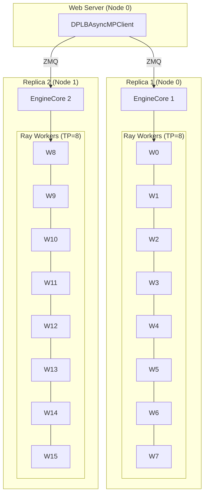
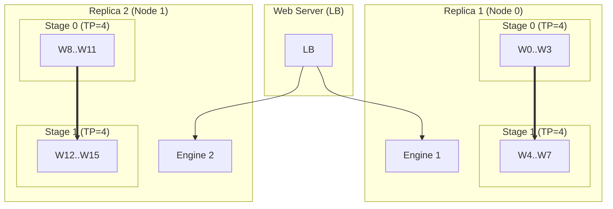
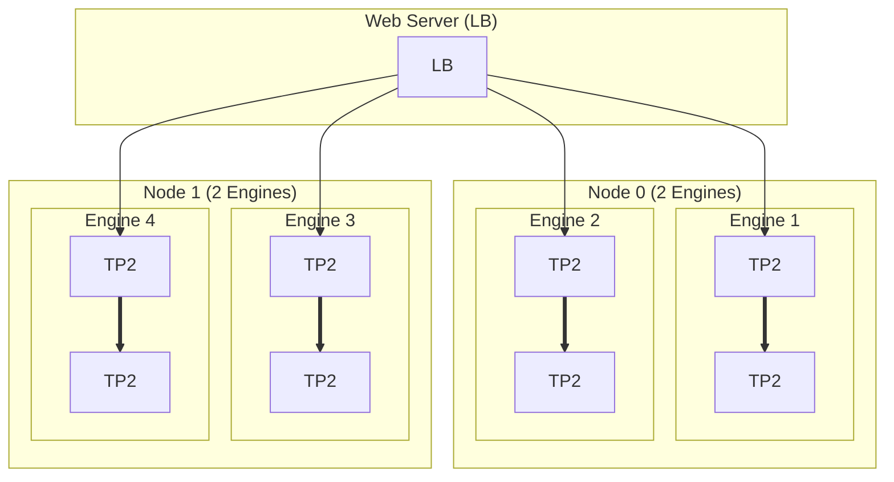
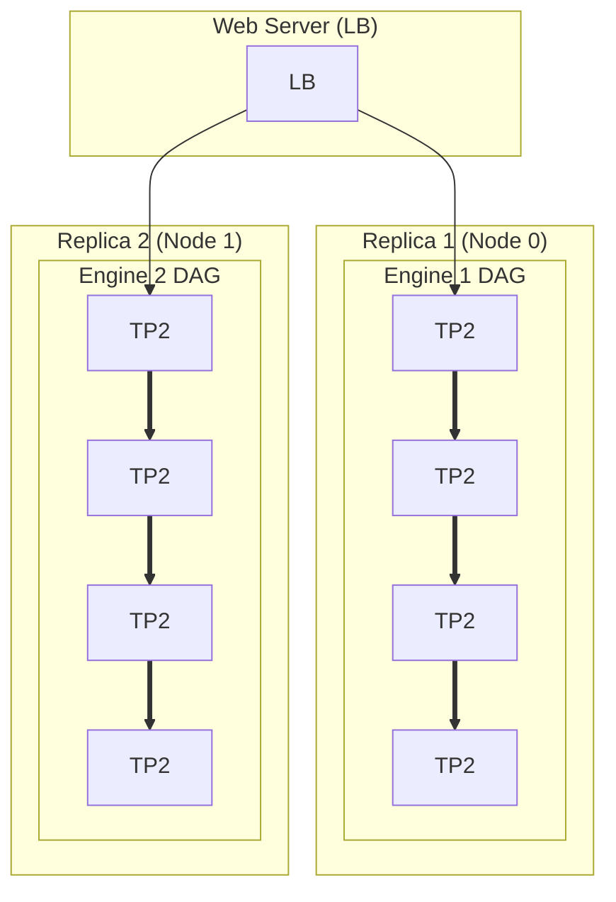
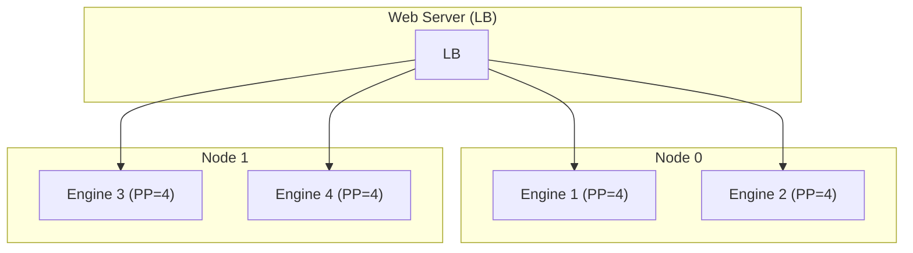
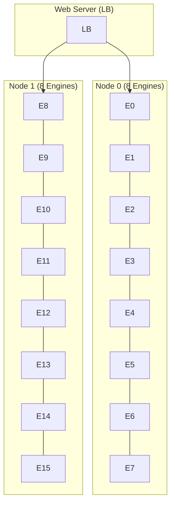
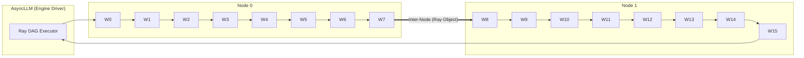

# vLLM 멀티 노드 프로세스 토폴로지 비교 (2 Nodes, 16 GPUs) - Code Based

이 문서는 vLLM V1 코드(`RayDistributedExecutor`) 논리에 부합하는 효율적인 멀티 노드 토폴로지 7가지 케이스를 시각화합니다.
(`TP`가 노드 경계를 넘는 비효율적인 케이스는 제외했습니다.)

> **Code Context (Ray)**
> *   **Execution**: Multi-Node 환경에서는 `RayDistributedExecutor`가 필수적으로 사용됩니다.
> *   **Placement**: Ray가 Actor(Worker)를 노드별 자원(GPU)에 맞춰 배치합니다.
> *   **Communication**:
>     *   **Intra-Node (TP/PP)**: NVLink / Shared Memory 최적화.
>     *   **Inter-Node (PP/DP)**: Ray Object Store (TCP/IP or RDMA)를 통한 데이터 전달.

---

## Case 1: TP=8, DP=2, PP=1 (노드 단위 데이터 병렬화 - Recommended)

*   **구조**: **2개의 Engine** (DP Rank 0, 1). 각 엔진이 노드 1개를 온전히 점유.
*   **특징**: 노드 간 통신(Inter-Node Communication)이 전혀 없어 가장 효율적입니다.
*   **Logic**: `DPLBAsyncMPClient`가 2개의 `EngineCore`를 관리하고, 각 엔진은 로컬 노드의 8개 GPU로 `RayDistributedExecutor(TP=8)`를 실행.

---

## Case 2: TP=4, DP=2, PP=2 (노드 내 파이프라인)

*   **구조**: 2개의 엔진. 각 엔진은 노드 내부에서 [TP4 -> TP4] 파이프라인 구성.
*   **특징**: TP 통신 범위를 8에서 4로 줄여 `AllReduce` 비용을 감소시킵니다.
*   **Logic**: `pipeline_parallel_size=2` 설정 시 Ray가 Stage를 분할하여 배치.

---

## Case 3: TP=2, DP=4, PP=2 (고밀도 복합 구성)

*   **구조**: **4개의 엔진**. 노드 하나에 2개의 작은 엔진(각 4 GPU)이 올라감.
*   **특징**: 작은 모델(TP=2 충분)이면서 레이어는 깊은(PP=2 유리) 경우 사용.

---

## Case 4: TP=2, DP=2, PP=4 (깊은 파이프라인)

*   **구조**: 2개의 엔진. 각 엔진은 4-Stage 파이프라인(TP=2)으로 8개 GPU 사용.
*   **특징**: 노드 하나를 Full Pipeline으로 사용.
*   **Logic**: Ray DAG가 4단계의 `Future` 체인을 생성하여 실행.

---

## Case 5: TP=1, DP=4, PP=4 (순수 파이프라인 병렬화)

*   **구조**: 4개의 엔진. 각 엔진은 4-Stage PP (TP=1).
*   **특징**: TP 통신 오버헤드 제거. P2P 통신 위주.

---

## Case 6: TP=1, DP=16, PP=1 (최대 처리량)

*   **구조**: **16개의 독립 엔진**. GPU당 1개.
*   **특징**: Multi-LoRA 혹은 매우 가벼운 모델 서빙용.
*   **Logic**: 16개의 `RayDistributedExecutor` 인스턴스 생성. 각자 독립 실행.

---

## Case 7: TP=1, DP=1, PP=16 (멀티 노드 파이프라인)

*   **구조**: 1개 엔진. 16개 GPU가 16-Stage 파이프라인 (2 Node Spanning).
*   **특징**: 레이어가 극도로 많은 단일 모델.
*   **Logic**: Ray가 Node 0와 Node 1에 걸쳐 Actor를 배치하고, Node 경계에서 Ray Object Store를 통해 텐서를 전달합니다. (Latency 주의)

