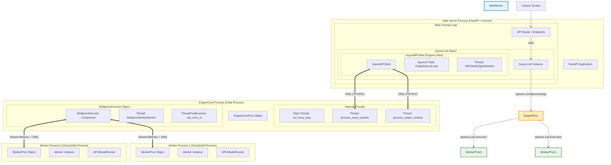

# vLLM V1 프로세스 및 쓰레드 계층 구조 (Process & Thread Hierarchy)

이 다이어그램은 vLLM V1 아키텍처(특히 `MultiprocExecutor`를 사용하는 `AsyncLLM`)의 프로세스, 쓰레드, 그리고 핵심 컴포넌트 간의 포함 관계를 보여줍니다.

## 핵심 계층 구조 설명

1.  **Web Server Process (Main)**: 사용자가 실행하는 메인 OS 프로세스입니다 (`vllm serve` 등). **FastAPI** 애플리케이션과 **Uvicorn** 비동기 이벤트 루프가 여기서 실행됩니다.
    *   **AsyncLLM**: 이 프로세스 내에 파이썬 객체로 존재합니다.
    *   **API Router**: HTTP 요청을 받아 `AsyncLLM.generate()`를 호출합니다.
2.  **EngineCore Process (Child)**: 무거운 연산 로직(`busy_loop`, 스케줄링, 모델 실행 조율)을 담당합니다. 웹 서버의 HTTP 처리와 격리하기 위해 별도 프로세스로 생성됩니다.
3.  **Worker Processes (Grandchild)**: **EngineCore 프로세스의 자식 프로세스** (Web Server의 손자)입니다. 각 워커는 GPU를 관리하며, 빠른 속도를 위해 Shared Memory를 통해 EngineCore와 통신합니다.
4.  **Threads (쓰레드)**:
    *   **Web Server**: 요청 처리와 I/O를 위해 비동기 태스크(AsyncIO Task, 예: `OutputQueueLoop`)를 사용하며, EngineCore 상태 감시를 위한 별도 백그라운드 쓰레드(`MPClientEngineMonitor`)를 하나 둡니다.
    *   **EngineCore**: 메인 연산 루프(`run_busy_loop`)가 멈추지 않도록, ZMQ 통신(입/출력)을 위한 별도 쓰레드들과 워커 감시용 쓰레드를 사용합니다.
