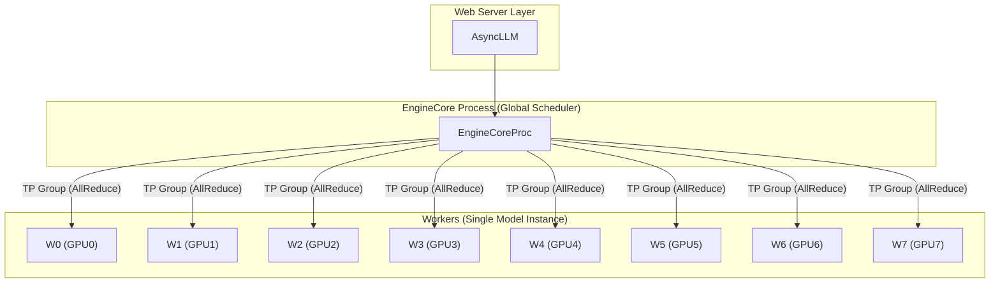
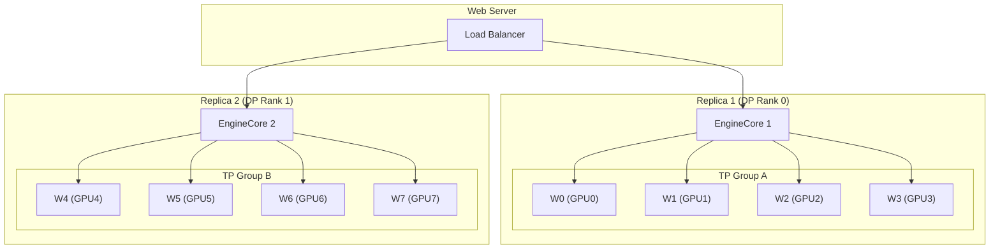
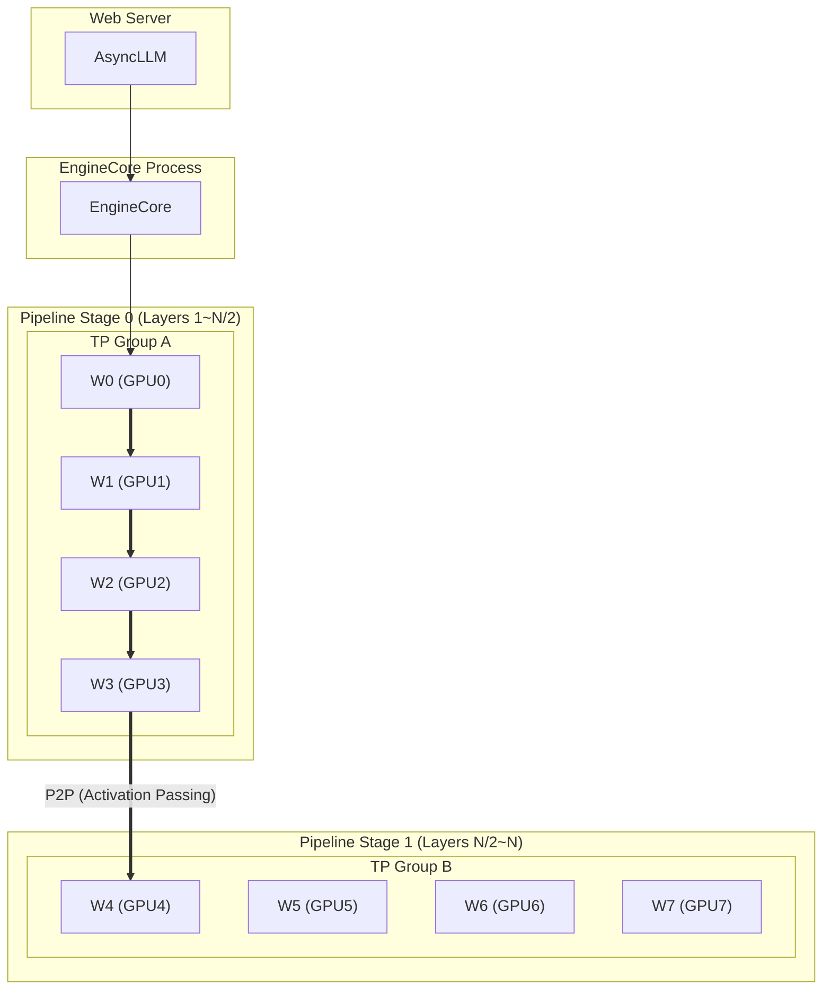
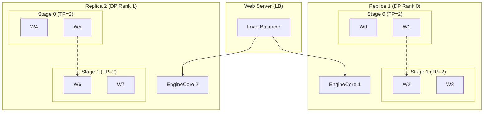
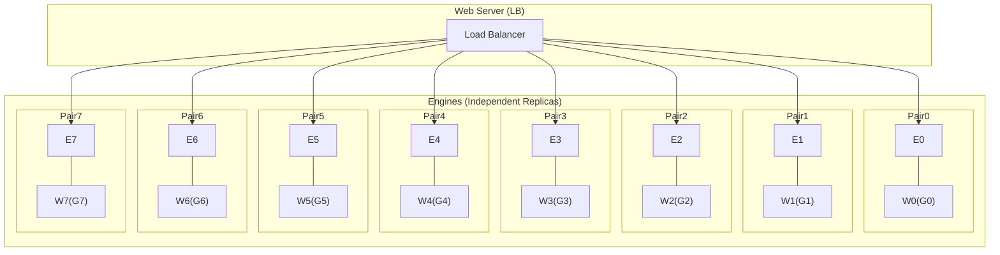
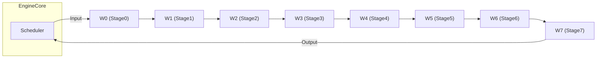

# vLLM 프로세스 토폴로지 비교 (Single Node, 8 GPUs)

이 문서는 8-GPU 단일 노드 스펙에서 가능한 6가지 핵심 구성(TP, DP, PP 조합)에 따른 런타임 구조 변화를 시각화합니다.

> **용어 정리**
> *   **TP (Tensor Parallelism)**: 레이어(Layer)를 쪼개어 병렬 연산 (단일 오퍼레이션 가속).
> *   **DP (Data Parallelism)**: 모델 전체를 복제하여 처리량 증대 (배치 병렬 처리, 여러 EngineCore 생성).
> *   **PP (Pipeline Parallelism)**: 레이어(Layer)를 그룹(Stage)으로 나누어 순차 처리 (메모리 분산, 초대형 모델 수용).

---

## Case 1: TP=8, DP=1, PP=1 (초대형 모델 가속)

*   **구조**: 1개 엔진, 8개 워커가 하나의 거대한 모델 인스턴스 구동.
*   **특징**: 모델이 너무 커서 GPU 1개에 안 들어갈 때 사용. 워커들이 좌우로 배치되어 하나의 그룹을 형성.

---

## Case 2: TP=4, DP=2, PP=1 (밸런스형)

*   **구조**: **2개의 독립 엔진**. 각 엔진은 4개 GPU를 사용하여 모델 1개를 돌림.
*   **특징**: `AsyncLLM`이 들어오는 요청을 두 엔진으로 로드 밸런싱. 각 엔진 내 워커들은 좌우로 배치.

---

## Case 3: TP=4, DP=1, PP=2 (파이프라인 + 텐서 혼합)

*   **구조**: 1개 엔진. 모델을 앞부분(Stage 0)과 뒷부분(Stage 1)으로 나눔. 각 Stage는 4개 GPU로 TP 구동.
*   **특징**: 각 Stage의 TP 그룹은 좌우로 배치. Stage 0의 출력이 Stage 1로 전달됨.

---

## Case 4: TP=2, DP=2, PP=2 (복합 구성)

*   **구조**: **2개의 독립 엔진**. 각 엔진은 2-Stage 파이프라인(각 Stage는 TP=2)을 가짐.
*   **특징**: TP 그룹 내부 워커들이 좌우로 배치됨.

---

## Case 5: TP=1, DP=8, PP=1 (처리량 극대화)

*   **구조**: **8개의 독립 엔진**. 각각 GPU 1개씩 사용.
*   **특징**: 8개의 (엔진-워커) 쌍이 좌우로 나란히 배치되어 독립적으로 동작함을 나타냄.

---

## Case 6: TP=1, DP=1, PP=8 (순수 파이프라인)

*   **구조**: 1개 엔진. 8개 GPU가 길게 직렬 연결.
*   **특징**: 좌우(Left-to-Right)로 순차 연결된 파이프라인 흐름.

