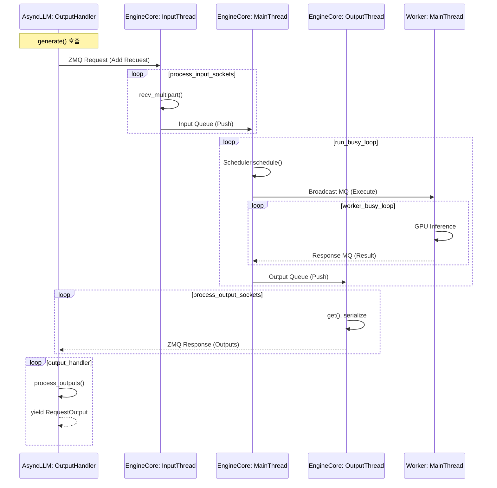
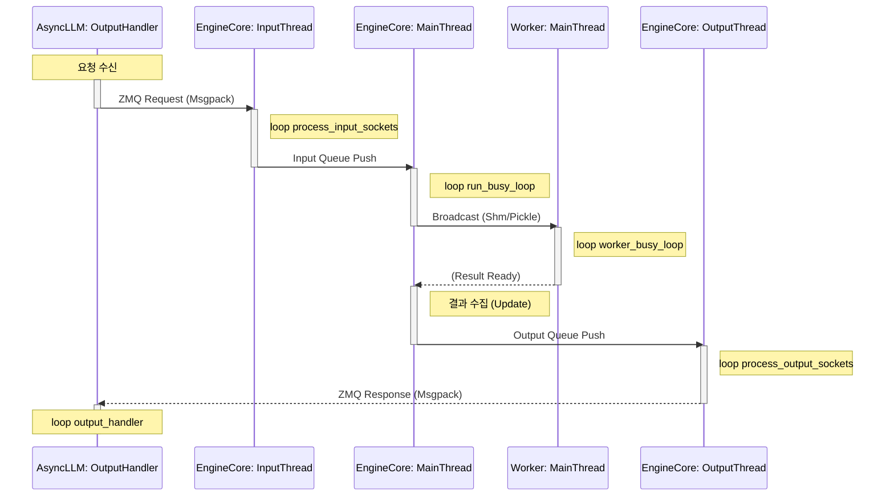
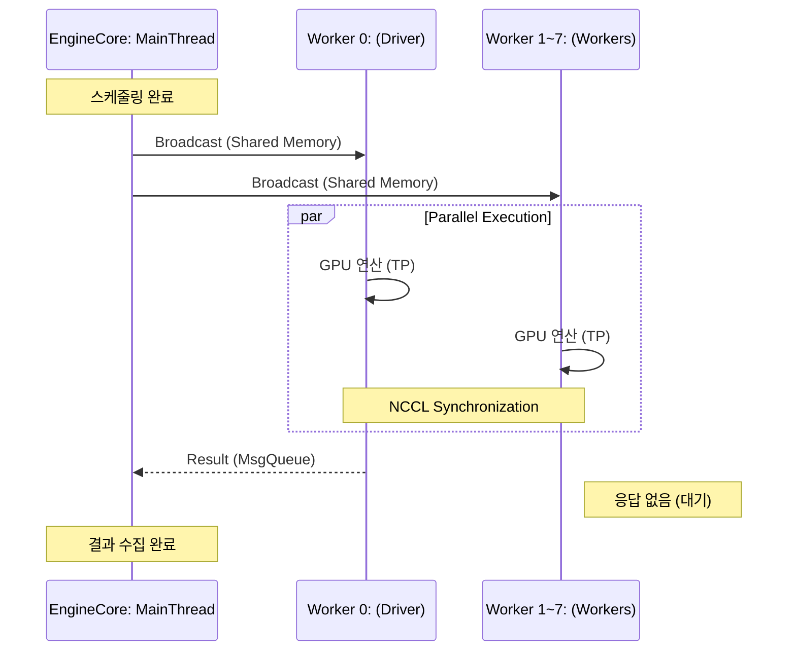

# vLLM V1 아키텍처 데이터 흐름 및 무한 루프 분석 (Deep Dive)

vLLM V1은 크게 **Frontend (AsyncLLM)**, **Engine Core (Service)**, **Executor (Workers)** 세 부분으로 분리되어 있으며, 각 컴포넌트는 독립적인 프로세스나 스레드에서 '무한 루프(Busy Loop)'를 돌며 데이터를 처리합니다.

이 문서는 `generate()` 요청이 들어왔을 때 데이터가 어떻게 흐르고 처리되는지, 각 루프의 역할과 통신 채널을 중심으로 상세히 설명합니다.

## 1. 전체 아키텍처 및 루프 요약

데이터는 세 가지 주요 루프를 거쳐 이동합니다.

| 컴포넌트 | 루프/함수 (역할) | 통신 채널 (Input -> Output) | 데이터 변환 |
| :--- | :--- | :--- | :--- |
| **Frontend** | `output_handler` (결과 수신) | ZMQ (Remote) -> `AsyncStream` (Queue) | `EngineCoreOutputs` -> `RequestOutput` |
| **EngineCore** | `process_input_sockets` (IO 스레드) | ZMQ Socket -> `input_queue` (Queue) | Bytes -> `EngineCoreRequest` |
| **EngineCore** | `run_busy_loop` (메인 루프) | `input_queue` -> `output_queue` | Request -> Scheduler -> Model Output |
| **EngineCore** | `process_output_sockets` (IO 스레드) | `output_queue` -> ZMQ Socket | `EngineCoreOutputs` -> Bytes |
| **Worker** | `worker_busy_loop` (GPU 연산) | `rpc_broadcast_mq` -> `worker_response_mq` | Broadcast Input -> Model Tensor Output |

---

## 2. 단계별 데이터 흐름 상세 (Detailed Data Flow)

### Step 1: Frontend (Client) - 요청 전송
사용자가 `generate()`를 호출하면 `AsyncLLM`은 내부적으로 `RPC`를 통해 Engine Core로 요청을 보냅니다.

*   **위치**: `vllm/v1/engine/async_llm.py`
*   **동작**:
    1.  `add_request()`가 호출됩니다.
    2.  `self.engine_core.add_request_async()`를 통해 요청을 직렬화하여 ZMQ 소켓으로 전송합니다.
    3.  동시에 별도의 `output_handler` 루프가 실행됩니다.

### Step 2: EngineCore - 입력 처리 (Input Loop)
Engine Core는 별도의 스레드에서 소켓 입력을 감시합니다.

*   **함수**: `process_input_sockets` (in `vllm/v1/engine/core.py`)
*   **통신 채널**: **ZMQ Socket (DEALER/ROUTER)** -> **`self.input_queue` (Python Queue)**
*   **무한 루프 로직**:
    ```python
    while True:
        # 1. ZMQ 폴링 (Non-blocking)
        for input_socket, _ in poller.poll():
             # 2. 데이터 수신 (Bytes)
            type_frame, *data_frames = input_socket.recv_multipart()
            
            # 3. 역직렬화 (msgspec 사용)
            if ADD_REQUEST:
                request = add_request_decoder.decode(data_frames)
            
            # 4. 내부 큐(Input Queue)에 삽입
            self.input_queue.put_nowait((request_type, request))
    ```
    *   **데이터 변화**: `ZMQ Bytes` -> `EngineCoreRequest` 객체

### Step 3: EngineCore - 메인 로직 (Core Busy Loop)
엔진 코어의 핵심 로직인 `run_busy_loop`는 메인 프로세스에서 실행됩니다.

*   **함수**: `run_busy_loop` (in `vllm/v1/engine/core.py`)
*   **통신 채널**: **`input_queue`** -> **`output_queue`**
*   **무한 루프 로직**:
    ```python
    while True:
        # 1. 입력 큐 확인 및 처리
        self._process_input_queue() 
        # -> 큐에서 꺼내서 Scheduler에 add_request() 함
        
        # 2. 스케줄링 및 모델 실행 (Step)
        outputs, model_executed = self.step_fn()
        # -> Scheduler.schedule()
        # -> ModelExecutor.execute_model() **(Workers에게 RPC 전송)**
        
        # 3. 결과 큐(Output Queue)에 삽입
        for output in outputs.items():
            self.output_queue.put_nowait(output)
    ```
    *   **데이터 변화**: `EngineCoreRequest` -> (Scheduling) -> `SchedulerOutput` -> (Inference) -> `EngineCoreOutputs`

### Step 4: Worker - 모델 연산 (Worker Loop)
EngineCore가 `execute_model()`을 호출하면, `MultiprocExecutor`는 IPC(Broadcast MQ)를 통해 워커들을 깨웁니다.

*   **함수**: `worker_busy_loop` (in `vllm/v1/executor/multiproc_executor.py`)
*   **통신 채널**: **`rpc_broadcast_mq` (Input)** -> **`worker_response_mq` (Output)**
*   **무한 루프 로직**:
    ```python
    while True:
        # 1. 브로드캐스트 큐 대기 (Blocking)
        method, args, kwargs, ... = self.rpc_broadcast_mq.dequeue()
        
        # 2. 모델 실행 (GPU 연산)
        # GPUModelRunner.execute_model() 실행됨
        output = func(*args, **kwargs)
        
        # 3. 결과 큐에 전송 (EngineCore가 수집)
        self.worker_response_mq.enqueue(output)
    ```
    *   **데이터 변화**: `SchedulerOutput` (메타데이터) -> `ModelRunnerOutput` (샘플링된 토큰/Logits)

### Step 5: EngineCore - 출력 전송 (Output Loop)
Engine Core는 결과를 Frontend로 돌려주기 위해 별도의 스레드를 사용합니다.

*   **함수**: `process_output_sockets` (in `vllm/v1/engine/core.py`)
*   **통신 채널**: **`output_queue`** -> **ZMQ Socket**
*   **무한 루프 로직**:
    ```python
    while True:
        # 1. 출력 큐에서 가져오기
        output = self.output_queue.get()
        
        # 2. 직렬화 (msgspec)
        buffers = encoder.encode_into(outputs, buffer)
        
        # 3. ZMQ 전송
        socket.send_multipart(buffers, copy=False)
    ```
    *   **데이터 변화**: `EngineCoreOutputs` 객체 -> `Msgpack Bytes`

### Step 6: Frontend - 결과 핸들링 (Handler Loop)
마지막으로, 클라이언트 측의 백그라운드 태스크가 결과를 받아 사용자에게 전달합니다.

*   **함수**: `output_handler` (in `vllm/v1/engine/async_llm.py`)
*   **통신 채널**: **Remote RPC** -> **Request Output Queue**
*   **무한 루프 로직**:
    ```python
    while True:
        # 1. Engine Core로부터 비동기 결과 수신
        outputs = await engine_core.get_output_async()
        
        # 2. 결과 처리 (OutputProcessor)
        processed_outputs = output_processor.process_outputs(outputs)
        
        # 3. 각 요청별 개별 큐(Output Queue)에 삽입
        # -> generate() 함수가 이 큐를 yield 함
    ```

---

## 3. 데이터 흐름 다이어그램 (Mermaid)




## 4. 요약

vLLM V1은 **비동기성**과 **병렬성**을 극대화하기 위해 각 단계를 분리했습니다.
*   **입력(Input)**과 **출력(Output)** 처리는 별도의 스레드(`process_input/output_sockets`)로 분리하여 메인 루프가 블로킹되지 않도록 합니다.
*   **메인 로직(`run_busy_loop`)**은 오직 스케줄링과 워커 관리, 큐 관리에만 집중합니다.
*   **워커(`worker_busy_loop`)**는 오직 GPU 연산에만 집중하며, `rpc_broadcast_mq`를 통해 매우 낮은 지연시간으로 명령을 받습니다.

## 5. 컴포넌트 활성화 타이밍 (Activation Diagram)

아래 다이어그램은 각 컴포넌트가 실제로 데이터를 처리하며 **활성화(Active)** 되는 구간을 시각화한 것입니다.

*   `AsyncLLM: OutputHandler`: 사용자 요청 결과를 수신하고 처리하는 백그라운드 태스크입니다.
*   `EngineCore: InputThread`: ZMQ 소켓 입력을 담당하는 스레드입니다 (`process_input_sockets`).
*   `EngineCore: MainThread`: 스케줄링 및 전체 로직을 관장하는 메인 루프입니다 (`run_busy_loop`).
*   `Worker: MainThread`: 실제 GPU 연산을 수행하는 워커 프로세스의 메인 루프입니다 (`worker_busy_loop`).




## 6. RPC 통신 프로토콜 상세 (RPC Protocols)

vLLM은 성능 최적화를 위해 두 가지 다른 RPC 메커니즘을 혼합하여 사용합니다.

### 1) EngineCore ↔ Worker (Broadcasting RPC)
*   **목적**: EngineCore가 여러 GPU Worker에게 동시에 모델 실행 명령을 내릴 때 사용 (초저지연 필수).
*   **구현체**: `MessageQueue` + (`Shared Memory` or `ZMQ XPUB/SUB`)
*   **작동 방식**:
    *   **Local (같은 노드)**: **Shared Memory Ring Buffer**를 통해 메모리를 직접 공유하여 복사 비용을 최소화합니다.
    *   **Remote (다른 노드)**: **ZeroMQ (ZMQ)**의 `XPUB/SUB` 패턴을 사용합니다.
*   **직렬화**: `pickle` (Cloudpickle) 사용.

### 2) Client ↔ EngineCore (Service RPC)
*   **목적**: Frontend(AsyncLLM)가 EngineCore에게 비동기로 요청을 보낼 때 사용.
*   **구현체**: **ZeroMQ (ZMQ)** 소켓 (`DEALER` / `ROUTER` 패턴).
*   **작동 방식**: 비동기 큐와 소켓 폴링을 통해 요청을 주고받습니다.
*   **직렬화**: **`msgspec` (Msgpack)**을 사용하여 JSON보다 빠르고 가볍게 처리합니다.

## 7. 8-GPU 환경에서의 데이터 흐름 (Multi-GPU Data Flow)

8개의 GPU(Tensor Parallelism = 8)를 사용하는 경우, 데이터 흐름은 **'Broadcast Input & Single Output'** 패턴을 따릅니다.

1.  **Broadcast (1 -> N)**: `EngineCore`는 Shared Memory를 통해 8개의 모든 Worker에게 동시에 `execute_model` 명령을 보냅니다. (복사는 한 번만 일어남)
2.  **Execution & Sync (N <-> N)**: 8개의 Worker는 각자의 GPU에서 모델을 실행하며, 이 과정에서 **NCCL**을 통해 서로 통신하고 동기화합니다.
3.  **Collection (1 -> 1)**: 실행이 완료되면, 오직 **Rank 0 (Driver Worker)**만이 결과를 `EngineCore`에게 반환합니다. 나머지 Worker들은 결과를 보내지 않고 다음 명령을 대기합니다(`unique_reply_rank=0` 설정).


