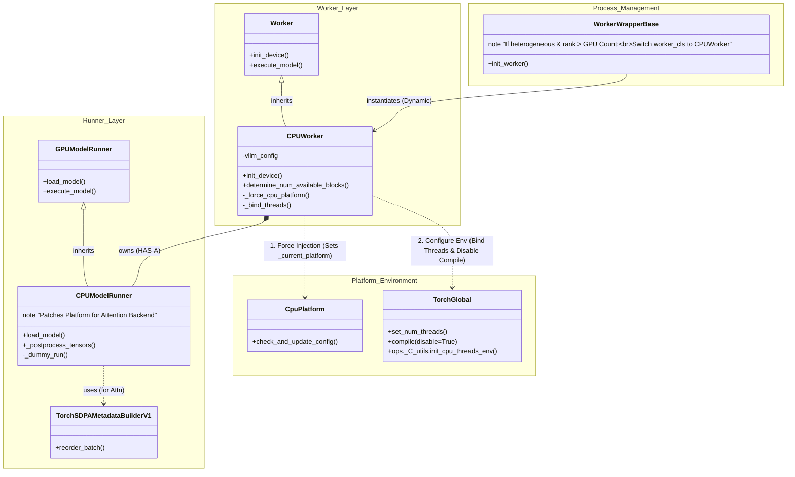
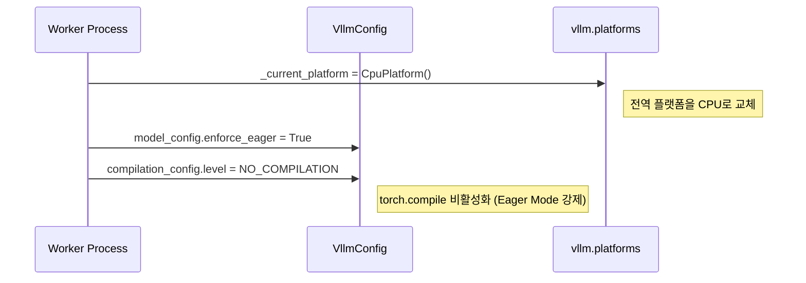
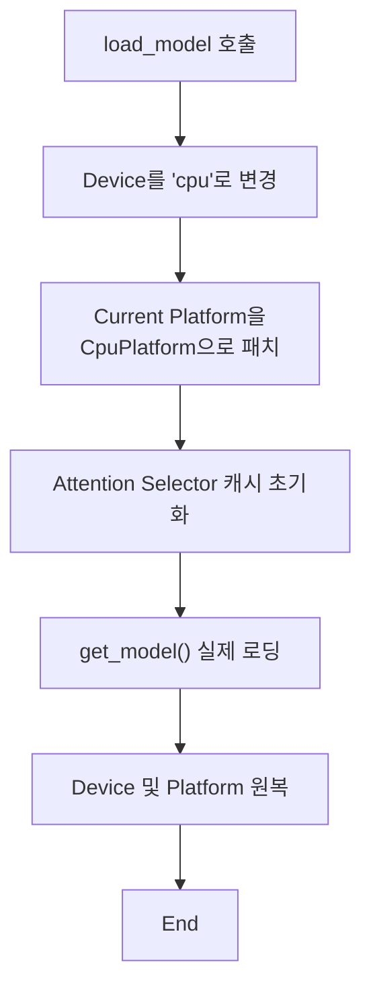

# vLLM Hybrid CPU Worker 분석

[← Overview로 돌아가기](./overview.md)

이 문서는 GPU가 아닌 CPU 상에서 LLM 추론을 수행하기 위해 구현된 `CPUWorker`와 `CPUModelRunner`의 구조와 동작 방식을 심층 분석합니다.

## 1. 아키텍처 및 상속 구조

`CPUWorker`와 `CPUModelRunner`는 기존 GPU 기반 구현을 상속받아 재정의하는 형태로 구현되었습니다.

## 2. CPUWorker: 초기화 및 환경 설정

`CPUWorker`(`vllm/v1/worker/cpu_worker.py`)는 프로세스가 시작될 때 자신이 CPU 환경임을 시스템에 강제로 인식시키고, 하드웨어 자원을 최적화합니다.

### 2.1. 플랫폼 강제 주입 (Platform Forcing)

vLLM은 기본적으로 전역 변수 `_current_platform`을 통해 백엔드를 결정합니다. `CPUWorker`는 생성자에서 이를 하이재킹합니다.

- **이유**: `torch.compile` (Inductor)이 CPU에서 불안정하거나 오버헤드가 클 수 있어 **Eager Mode**를 강제합니다.
- **결과**: 이후 호출되는 모든 vLLM 내부 로직은 `CpuPlatform`의 메서드를 타게 됩니다.

### 2.2. 스레드 바인딩 (Thread Binding & NUMA)

CPU 추론 성능은 **캐시 지역성(Cache Locality)**과 **컨텍스트 스위칭 최소화**에 달려 있습니다. `init_device` 메서드는 정교한 스레드 바인딩을 수행합니다.

1. **NUMA 노드 감지**: `CpuPlatform.get_allowed_cpu_memory_node_list()`를 통해 사용할 NUMA 노드를 파악합니다.
2. **코어 할당**: 자신의 `rank`에 해당하는 NUMA 노드의 물리 코어들을 선별합니다.
3. **OpenMP 설정**: `torch.ops._C_utils.init_cpu_threads_env`를 호출하여 저수준에서 스레드를 코어에 고정(Pinning)합니다.
4. **스레드 수 조정**: `torch.set_num_threads`를 통해 물리 코어 수(또는 설정값)만큼만 스레드를 생성하여 과도한 경쟁을 방지합니다.

## 3. CPUModelRunner: 모델 실행 및 트릭

`CPUModelRunner`(`vllm/v1/worker/cpu_model_runner.py`)는 실제 모델 가중치를 로드하고 연산을 수행합니다.

### 3.1. 모델 로딩과 Attention Backend 선택

모델 로딩 시점에는 일시적으로 설정을 조작하여 CPU 호환성을 확보합니다.

이 트릭(Trick)을 통해 `get_model` 내부에서 Attention 레이어를 초기화할 때, `CpuPlatform`의 `get_attn_backend_cls`가 호출되어 **Torch SDPA** 등 CPU에 최적화된 백엔드가 선택됩니다.

### 3.2. 텐서 후처리 (_postprocess_tensors)

일부 GPU 로직을 재사용하다 보면 텐서 이름이 `_cpu`로 끝나거나 디바이스 위치가 모호한 경우가 발생합니다. `_postprocess_tensors` 메서드는 이를 정리하여 올바른 어트리뷰트에 할당합니다.

### 3.3. Dummy Run (Shadowing)

파이프라인 병렬 처리에서 다른 GPU 워커들이 컴파일(Warmup)을 수행하는 동안, CPU 워커가 놀고 있으면 타임아웃(Timeout)이 발생할 수 있습니다. 이를 방지하기 위해 CPU 워커도 동일한 횟수만큼 **더미 실행(Dummy Run)**을 수행하여 보조를 맞춥니다.

## 4. 메모리 및 캐시 관리

### 4.1. KV Cache 블록 계산

GPU 워커는 가용 VRAM을 프로파일링하여 블록 수를 계산하지만, CPU 워커는 시스템 메모리를 공유하므로 방식이 다릅니다.

- **`determine_num_available_blocks`**: 항상 `(0, num_cpu_blocks)`를 반환합니다.
    - 첫 번째 값(0): GPU 블록 수 (CPU 워커이므로 0)
    - 두 번째 값: `vllm_config`에 설정된 CPU 블록 수 (Swap Space 개념이 아닌, 실제 메인 메모리 캐시 공간)

### 4.2. Determine Available Memory

GPU와 달리 `torch.cuda.mem_get_info()`를 사용할 수 없습니다. 따라서 `cache_config.cpu_kvcache_space_bytes` 설정값을 그대로 신뢰하여 리턴합니다. 또한, 이 시점에 `profile_run`을 호출하여 GPU 워커들과의 동기화 포인트(Barrier) 역할을 수행합니다.

---
[← Overview로 돌아가기](./overview.md)
