# vLLM Vanilla V1 vs Hybrid v1.5 (NEO Asymmetric) 아키텍처 비교

> **브랜치**: `feat/ide006-tsk019-neo-performance-max`
> **기준 버전**: vLLM V1 Engine (upstream) vs NEO Asymmetric v1.5 (본 포크)
> **작성일**: 2026-05-12

---

## 목차

1. [개요](#1-개요)
2. [최상위 구조 비교](#2-최상위-구조-비교)
3. [스케줄러 구조 차이](#3-스케줄러-구조-차이)
4. [KV Cache 관리 방식 차이](#4-kv-cache-관리-방식-차이)
5. [Forward Pass 실행 구조](#5-forward-pass-실행-구조)
6. [레이어 오프셋 파이프라이닝](#6-레이어-오프셋-파이프라이닝)
7. [요청 처리 흐름 비교](#7-요청-처리-흐름-비교)
8. [SubBatch 구성](#8-subbatch-구성)
9. [구성 요소 비교](#9-구성-요소-비교)
10. [구조 차이 요약](#10-구조-차이-요약)

---

## 1. 개요

| 항목 | Vanilla V1 | NEO Asymmetric v1.5 |
|------|-----------|---------------------|
| 프로세스 구조 | 동일 (GPU Engine 단일 프로세스) | **동일** (프로세스 추가 없음) |
| 스케줄러 | `Scheduler` (단일 GPU 큐) | `NeoSchedulerAdapter` (3-큐: waiting / gpu_decoding / cpu_decoding) |
| 배치 구성 | 1개 배치 per step | 1개 (sequential) 또는 **2개 SubBatch** (pipelined) |
| CPU 활용 방식 | 없음 | **동일 forward pass 내에서 cold-KV attention 계산** |
| KV 위치 | 항상 GPU HBM | GPU HBM (hot) + CPU DDR5 (cold, swap-out) |
| Forward 구조 | 레이어 순차 실행 | 레이어 오프셋 ping-pong (GPU linear ↔ CPU attention 중첩) |
| 활성화 조건 | (기본) | `--enable-neo-asymmetric` + `kv_cache_policy=exclusive` |

**핵심**: NEO는 별도 CPU inference engine process를 추가하는 것이 아니다. 동일한 GPU 엔진 프로세스 내에서 스케줄러가 cold-KV 요청을 CPU-decode 큐로 분리하고, forward pass 중 GPU linear 연산과 CPU attention 연산을 **레이어 단위로 중첩**시킨다.

---

## 2. 최상위 구조 비교

### Vanilla V1

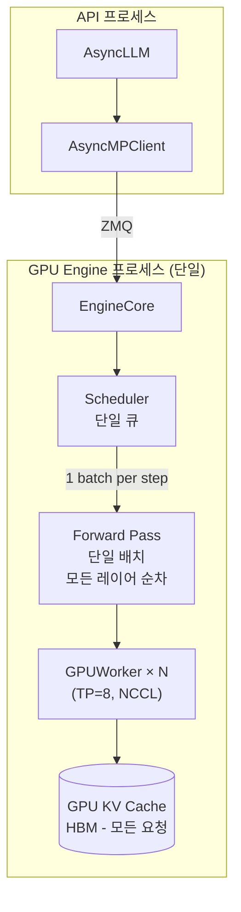

### NEO Asymmetric v1.5

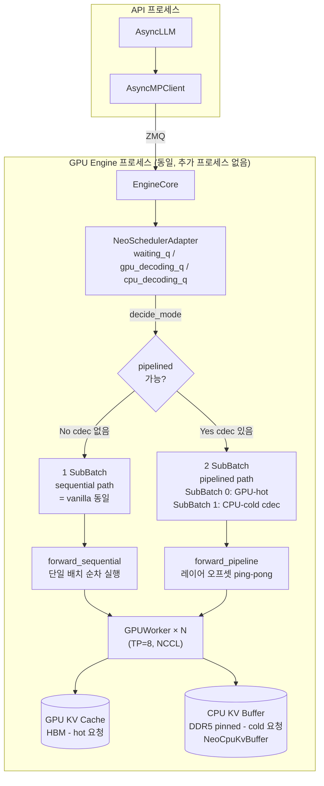

---

## 3. 스케줄러 구조 차이

### Vanilla V1 Scheduler

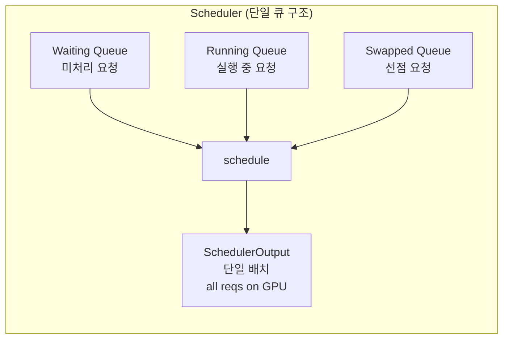

모든 실행 중 요청의 KV는 GPU HBM에 위치. swap은 GPU→CPU가 아닌 GPU HBM→GPU HBM 내 선점(preemption).

### NEO v1.5 NeoSchedulerAdapter

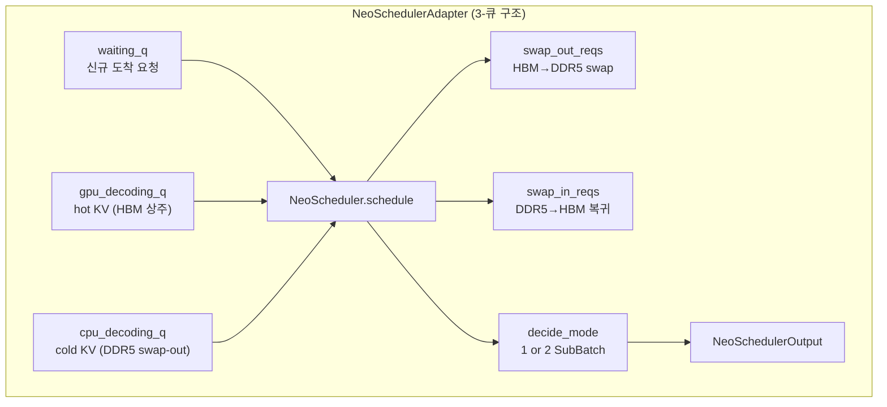

**3-큐 분류 기준**:
- `gpu_decoding_q`: KV block이 GPU HBM에 있는 decode 중 요청 (hot)
- `cpu_decoding_q`: KV block이 CPU DDR5로 swap-out된 요청 (cold)
- `waiting_q`: prefill 대기 요청

**`decide_mode()` 결정 기준** (NEO 6-step 알고리즘):

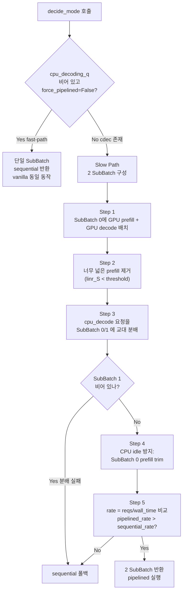

**스케줄러 활성화**: `vllm/config/scheduler.py:get_scheduler_cls()`

```python
def get_scheduler_cls(self):
    if self.enable_neo_asymmetric:
        return NeoSchedulerAdapter  # NEO 경로
    if self.async_scheduling:
        return AsyncScheduler       # vanilla async
    return Scheduler                # vanilla 기본
```

---

## 4. KV Cache 관리 방식 차이

### Vanilla V1 KV Cache

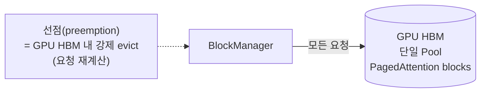

### NEO v1.5 KV Cache (kv_cache_policy = "exclusive")

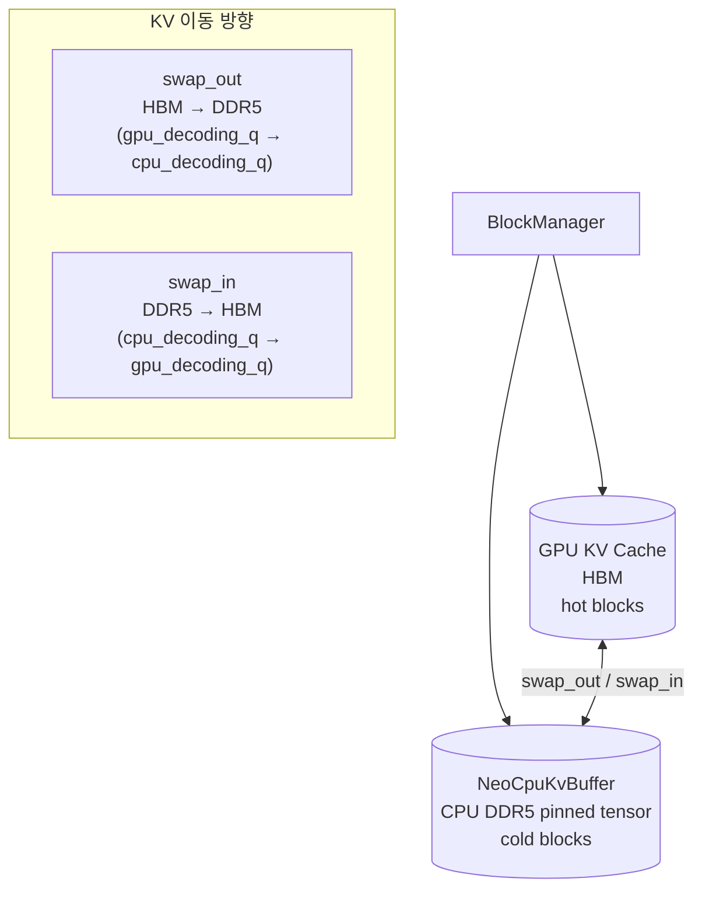

**NeoCpuKvBuffer 구조** (`vllm/v1/core/sched/neo_cpu_kv_buffer.py`):

```
K_cpu: (num_layers, num_cpu_blocks, num_kv_heads, block_size, head_dim)  ← pinned CPU tensor
V_cpu: (num_layers, num_cpu_blocks, num_kv_heads, block_size, head_dim)  ← pinned CPU tensor

free_block_ids: list[int]  ← 사용 가능한 CPU block slot
_alloc: dict[req_id → _PerReqAllocation]  ← 요청별 CPU block 위치 인덱스
```

**KV swap 발생 시점**:
- `swap_out`: GPU HBM 사용률이 threshold(95%) 초과 → 가장 최근 GPU decode 요청을 cold로 내림
- `swap_in`: GPU HBM에 여유가 생기면 (≤95%) cold 요청을 hot으로 올림

---

## 5. Forward Pass 실행 구조

### Vanilla V1 Forward Pass

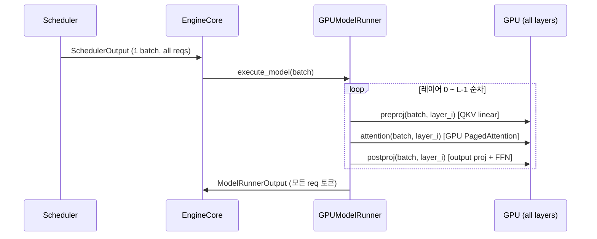

### NEO v1.5 Forward Pass (pipelined 모드)

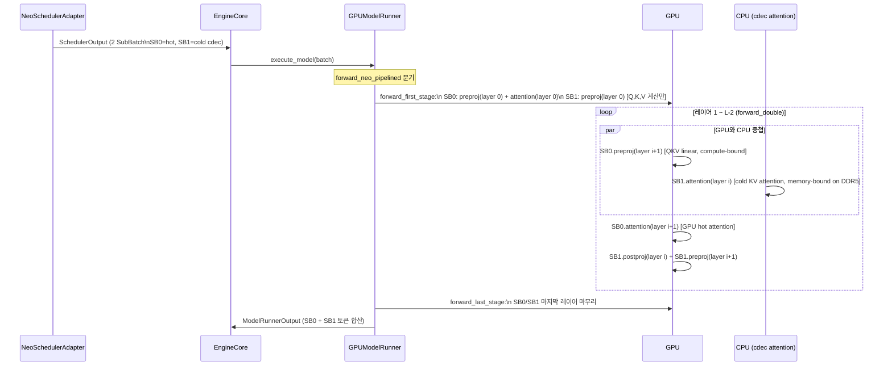

**중첩의 핵심**: GPU linear(preproj)은 weight 행렬 × hidden 벡터의 matmul로 **compute-bound**. CPU의 cold-KV attention은 DDR5 메모리에서 KV block을 읽는 **memory-bound** 연산. 두 연산은 서로 다른 리소스를 사용하므로 겹칠 수 있다.

---

## 6. 레이어 오프셋 파이프라이닝

`vllm/v1/worker/sub_batch_executor.py:SubBatchPipelineExecutor`

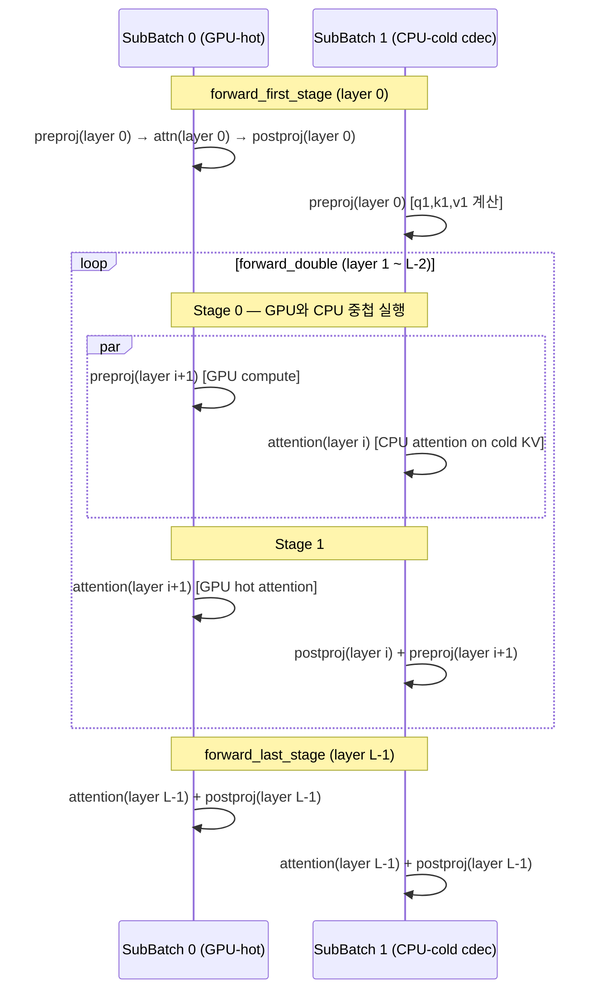

**레이어 오프셋 원리**: SubBatch 1은 항상 SubBatch 0보다 **1레이어 뒤처져** 있다. SubBatch 0이 layer i+1의 선형 연산(preproj)을 할 때, SubBatch 1은 layer i의 attention을 CPU에서 수행한다.

이로써 `SubBatch 0`의 GPU linear 시간과 `SubBatch 1`의 CPU attention 시간이 중첩되어:

```
T_hybrid ≈ max(T_GPU_linear, T_CPU_cdec_attention) + T_GPU_attention
         < T_sequential = T_GPU_linear + T_GPU_attention + T_CPU_cdec_attention
```

---

## 7. 요청 처리 흐름 비교

### Vanilla V1

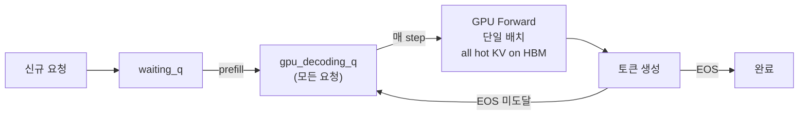

### NEO v1.5

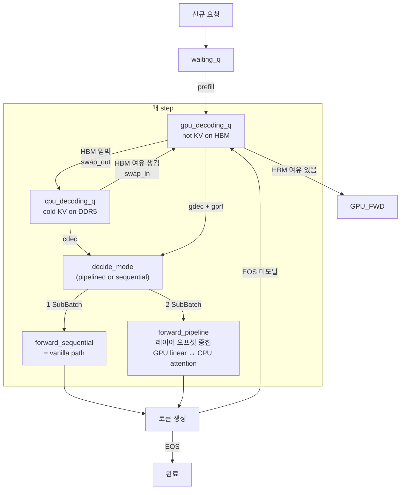

---

## 8. SubBatch 구성

`vllm/v1/core/sched/sub_batch.py:SubBatch`

각 SubBatch는 4종 요청 그룹을 보유한다:

| 필드 | 타입 | 의미 |
|------|------|------|
| `gprf_reqs` | list | GPU prefill 요청 (KV 생성 중, HBM) |
| `cprf_reqs` | list | CPU prefill 요청 (드문 케이스) |
| `gdec_reqs` | list | GPU decode 요청 (hot KV, HBM) |
| `cdec_reqs` | list | CPU decode 요청 (cold KV, DDR5) |

**pipelined 모드의 SubBatch 구성**:

```
SubBatch 0 (GPU-side):  gprf_reqs + gdec_reqs  → GPU forward
SubBatch 1 (CPU-side):  cdec_reqs              → CPU attention (cold KV)
```

**BatchPerfData**: 각 SubBatch는 `PerfPredictor` 기반 시간 예측값을 누적한다:

| 예측값 | 의미 |
|--------|------|
| `linr_T` | Linear(preproj/postproj) 예측 시간 |
| `pref_T` | Prefill attention 예측 시간 |
| `gdec_T` | GPU decode attention 예측 시간 |
| `cdec_T` | CPU decode attention 예측 시간 |

`decide_mode()`는 이 예측값으로 `remains[j] = linr_T + pref_T + gdec_T - cdec_T`를 계산해 CPU가 임계 경로(critical path)가 되는지 판단한다.

---

## 9. 구성 요소 비교

### 추가된 파일 (NEO v1.5 신규)

| 파일 | 역할 |
|------|------|
| `vllm/v1/core/sched/neo_scheduler.py` | 3-큐 NeoScheduler, 6-step 알고리즘 |
| `vllm/v1/core/sched/neo_scheduler_adapter.py` | vLLM SchedulerInterface adapter, AsyncScheduler 상속 |
| `vllm/v1/core/sched/neo_block_manager.py` | NEO KV block 관리 (hot/cold 분리) |
| `vllm/v1/core/sched/mode_selector.py` | `decide_mode()` — pipelined vs sequential 결정 |
| `vllm/v1/core/sched/sub_batch.py` | SubBatch + BatchPerfData 추상화 |
| `vllm/v1/core/sched/perfpredictor.py` | PerfPredictor (linr/pref/gdec/cdec 시간 예측) |
| `vllm/v1/core/sched/neo_perfpredictor_cache.py` | PerfPredictor 프로파일 디스크 캐시 |
| `vllm/v1/core/sched/neo_cpu_kv_buffer.py` | NeoCpuKvBuffer — pinned CPU KV tensor |
| `vllm/v1/worker/sub_batch_executor.py` | SubBatchPipelineExecutor — forward_sequential / forward_pipeline |

### 수정된 파일

| 파일 | 수정 내용 |
|------|-----------|
| `vllm/config/scheduler.py` | `enable_neo_asymmetric` 플래그, `get_scheduler_cls()` 분기 |
| `vllm/v1/worker/gpu_model_runner.py` | `forward_neo_pipelined` 분기, cdec slice 메타데이터, `_neo_cpu_kv_buffer` |
| `vllm/v1/core/sched/scheduler.py` | (기본 scheduler 유지, NeoSchedulerAdapter가 상속) |

### 변경되지 않은 파일

| 파일 | 이유 |
|------|------|
| `vllm/v1/engine/core.py` | EngineCore 로직 무수정 |
| `vllm/v1/engine/core_client.py` | 클라이언트 레이어 무수정 |
| `vllm/v1/executor/` | Executor 무수정 (GPU engine 단일 프로세스 유지) |
| `vllm/v1/worker/gpu_worker.py` | GPUWorker 무수정 |

---

## 10. 구조 차이 요약

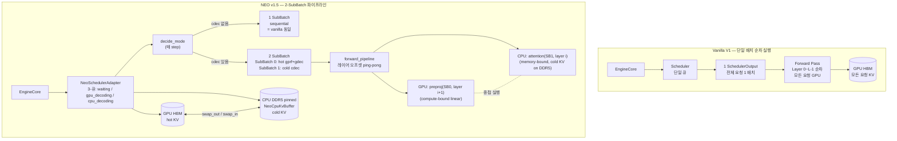

### 핵심 차이 대조표

| 항목 | Vanilla V1 | NEO Asymmetric v1.5 |
|------|-----------|---------------------|
| **프로세스 추가** | 없음 | **없음** (동일 GPU Engine 프로세스) |
| **스케줄러** | `Scheduler` (단일 큐) | `NeoSchedulerAdapter` (3-큐 + NeoScheduler 내장) |
| **step당 배치 수** | 1개 (항상) | 1개 (sequential) 또는 **2개** (pipelined) |
| **CPU 역할** | 없음 | **cold-KV attention 계산** (GPU linear과 레이어 단위 중첩) |
| **KV 위치** | 항상 GPU HBM | GPU HBM (hot) + CPU DDR5 (cold, NeoCpuKvBuffer) |
| **KV swap** | 선점 재계산 | HBM↔DDR5 swap (gpu_decoding_q ↔ cpu_decoding_q) |
| **Forward 패턴** | `forward_sequential` | `forward_sequential` (cdec 없음) 또는 `forward_pipeline` (cdec 있음) |
| **레이어 오프셋** | 없음 | SB1이 SB0보다 1레이어 뒤처짐 — GPU linear ↔ CPU attention 중첩 |
| **성능 목표** | `T_GPU` | `T_hybrid < T_sequential` (GPU linear time 내에 CPU attention 흡수) |
| **활성화 조건** | 기본 | `--enable-neo-asymmetric` + `kv_cache_policy=exclusive` |

---

> **설계의 단일 진실 공급원**: `docs/paper/main.tex` (IEEE 논문 draft)
>
> **핵심 관련 코드**:
> - `vllm/v1/core/sched/neo_scheduler_adapter.py` — NeoSchedulerAdapter, 스케줄러 진입점
> - `vllm/v1/core/sched/mode_selector.py` — `decide_mode()`, pipelined/sequential 결정
> - `vllm/v1/core/sched/sub_batch.py` — SubBatch, BatchPerfData
> - `vllm/v1/core/sched/neo_cpu_kv_buffer.py` — NeoCpuKvBuffer, cold KV 저장소
> - `vllm/v1/worker/sub_batch_executor.py` — SubBatchPipelineExecutor, 레이어 오프셋 파이프라인
> - `vllm/v1/worker/gpu_model_runner.py` — `forward_neo_pipelined` 분기
