# vLLM Vanilla V1 vs Hybrid v1.5 아키텍처 비교

> **브랜치**: `feat/ide006-tsk019-neo-performance-max`
> **기준 버전**: vLLM V1 Engine (upstream) vs Hybrid v1.5 (본 포크)
> **작성일**: 2026-05-12

---

## 목차

1. [개요](#1-개요)
2. [최상위 구조 비교](#2-최상위-구조-비교)
3. [요청 처리 흐름](#3-요청-처리-흐름)
4. [프로세스 격리 구조](#4-프로세스-격리-구조)
5. [ZMQ 통신 아키텍처](#5-zmq-통신-아키텍처)
6. [라우팅 계층: CapacityAwareRouter](#6-라우팅-계층-capacityawarerouter)
7. [스케줄러 구조 차이](#7-스케줄러-구조-차이)
8. [실행자(Executor) 및 워커 구조](#8-실행자executor-및-워커-구조)
9. [KV Cache 관리](#9-kv-cache-관리)
10. [CPU 최적화 스택](#10-cpu-최적화-스택)
11. [빌드 구조 차이](#11-빌드-구조-차이)
12. [설정 및 파라미터 자동 감지](#12-설정-및-파라미터-자동-감지)
13. [성능 모델](#13-성능-모델)
14. [구조 차이 요약](#14-구조-차이-요약)

---

## 1. 개요

| 항목 | Vanilla V1 | Hybrid v1.5 |
|------|-----------|-------------|
| 추론 장치 | GPU 전용 | GPU + CPU 동시 병렬 |
| 프로세스 수 | 1 + TP Worker N | 1 (API) + 1 (GPU Engine) + M (CPU Engine) |
| 라우팅 | 없음 (단일 경로) | CapacityAwareRouter (5가지 전략) |
| KV Cache | GPU HBM | GPU HBM + CPU DDR5 (분리) |
| 스케줄러 | 1개 (GPU Engine 내) | GPU용 1개 + CPU Engine 당 1개 |
| 목표 처리량 | `T_GPU` | `T_hybrid = T_GPU + α·T_CPU` |

**핵심 설계 목표**: GPU가 포화 상태일 때 CPU를 **병렬 독립 프로세스**로 활용하여 유휴 CPU 자원을 추론에 투입. GPU 처리량을 감소시키지 않으면서 CPU 처리량을 추가 획득.

---

## 2. 최상위 구조 비교

### Vanilla V1

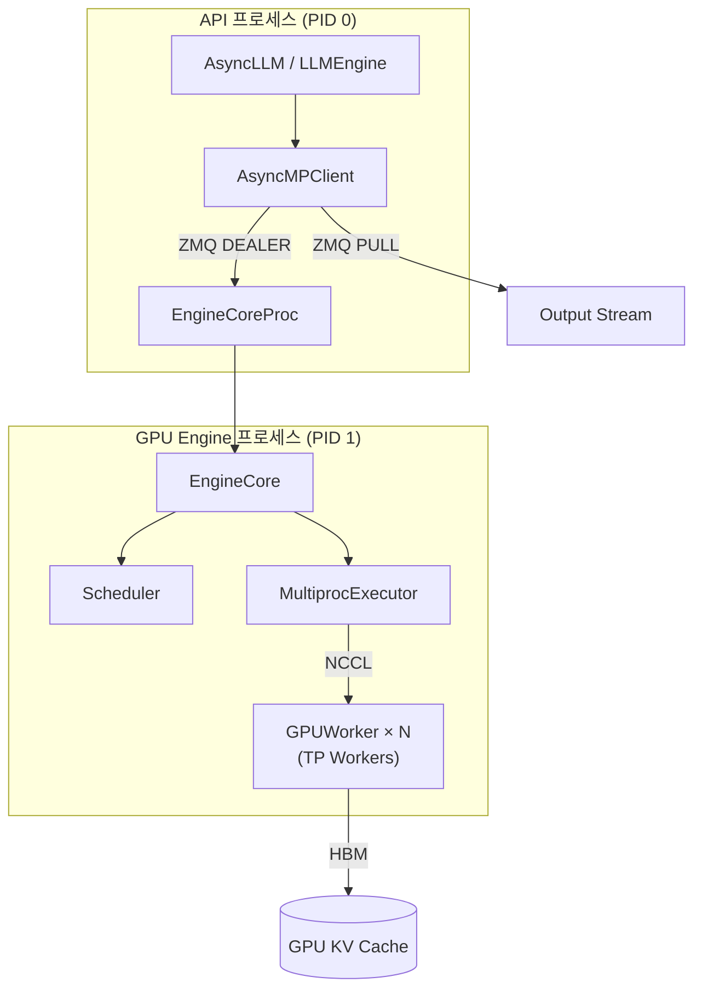
```mermaid
graph TD
    subgraph "API 프로세스 (PID 0)"
        A[AsyncLLM / LLMEngine] --> B[AsyncMPClient]
        B -->|ZMQ DEALER| C[EngineCoreProc]
    end

    subgraph "GPU Engine 프로세스 (PID 1)"
        C --> D[EngineCore]
        D --> E[Scheduler]
        D --> F[MultiprocExecutor]
        F -->|NCCL| G["GPUWorker × N\n(TP Workers)"]
    end

    G -->|HBM| H[(GPU KV Cache)]
    B -->|ZMQ PULL| I[Output Stream]
```

### Hybrid v1.5

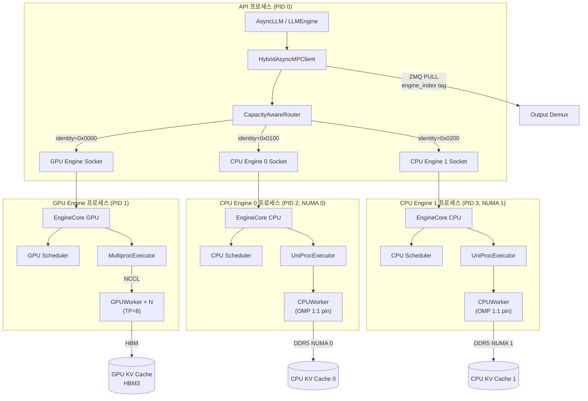
```mermaid
graph TD
    subgraph "API 프로세스 (PID 0)"
        A[AsyncLLM / LLMEngine] --> B[HybridAsyncMPClient]
        B --> R[CapacityAwareRouter]
        R -->|identity=0x0000| C0[GPU Engine Socket]
        R -->|identity=0x0100| C1[CPU Engine 0 Socket]
        R -->|identity=0x0200| C2[CPU Engine 1 Socket]
    end

    subgraph "GPU Engine 프로세스 (PID 1)"
        C0 --> D0[EngineCore GPU]
        D0 --> E0[GPU Scheduler]
        D0 --> F0[MultiprocExecutor]
        F0 -->|NCCL| G0["GPUWorker × N\n(TP=8)"]
    end

    subgraph "CPU Engine 0 프로세스 (PID 2, NUMA 0)"
        C1 --> D1[EngineCore CPU]
        D1 --> E1[CPU Scheduler]
        D1 --> F1[UniProcExecutor]
        F1 --> G1["CPUWorker\n(OMP 1:1 pin)"]
    end

    subgraph "CPU Engine 1 프로세스 (PID 3, NUMA 1)"
        C2 --> D2[EngineCore CPU]
        D2 --> E2[CPU Scheduler]
        D2 --> F2[UniProcExecutor]
        F2 --> G2["CPUWorker\n(OMP 1:1 pin)"]
    end

    G0 -->|HBM| H0[(GPU KV Cache\nHBM3)]
    G1 -->|DDR5 NUMA 0| H1[(CPU KV Cache 0)]
    G2 -->|DDR5 NUMA 1| H2[(CPU KV Cache 1)]

    B -->|ZMQ PULL\nengine_index tag| I[Output Demux]
```

---

## 3. 요청 처리 흐름

### Vanilla V1 요청 흐름

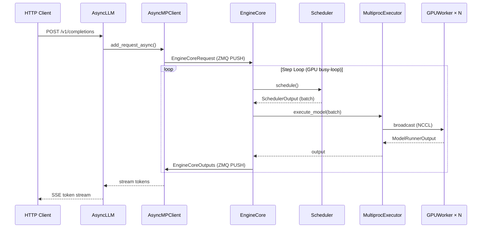
```mermaid
sequenceDiagram
    participant Client as HTTP Client
    participant API as AsyncLLM
    participant MP as AsyncMPClient
    participant EC as EngineCore
    participant Sch as Scheduler
    participant Ex as MultiprocExecutor
    participant W as GPUWorker × N

    Client->>API: POST /v1/completions
    API->>MP: add_request_async()
    MP->>EC: EngineCoreRequest (ZMQ PUSH)
    loop Step Loop (GPU busy-loop)
        EC->>Sch: schedule()
        Sch-->>EC: SchedulerOutput (batch)
        EC->>Ex: execute_model(batch)
        Ex->>W: broadcast (NCCL)
        W-->>Ex: ModelRunnerOutput
        Ex-->>EC: output
        EC->>MP: EngineCoreOutputs (ZMQ PUSH)
    end
    MP-->>API: stream tokens
    API-->>Client: SSE token stream
```

### Hybrid v1.5 요청 흐름

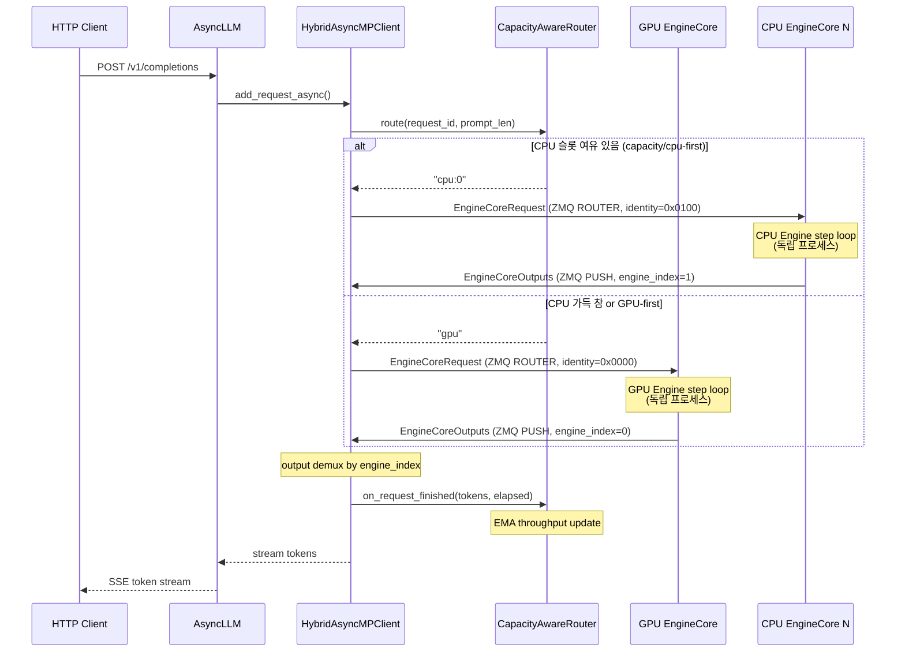
```mermaid
sequenceDiagram
    participant Client as HTTP Client
    participant API as AsyncLLM
    participant H as HybridAsyncMPClient
    participant R as CapacityAwareRouter
    participant GE as GPU EngineCore
    participant CE as CPU EngineCore N

    Client->>API: POST /v1/completions
    API->>H: add_request_async()
    H->>R: route(request_id, prompt_len)

    alt CPU 슬롯 여유 있음 (capacity/cpu-first)
        R-->>H: "cpu:0"
        H->>CE: EngineCoreRequest (ZMQ ROUTER, identity=0x0100)
        Note over CE: CPU Engine step loop<br/>(독립 프로세스)
        CE->>H: EngineCoreOutputs (ZMQ PUSH, engine_index=1)
    else CPU 가득 참 or GPU-first
        R-->>H: "gpu"
        H->>GE: EngineCoreRequest (ZMQ ROUTER, identity=0x0000)
        Note over GE: GPU Engine step loop<br/>(독립 프로세스)
        GE->>H: EngineCoreOutputs (ZMQ PUSH, engine_index=0)
    end

    Note over H: output demux by engine_index
    H->>R: on_request_finished(tokens, elapsed)
    Note over R: EMA throughput update
    H-->>API: stream tokens
    API-->>Client: SSE token stream
```

**핵심 차이**: Hybrid에서 GPU Engine과 CPU Engine은 **서로를 기다리지 않고 동시에** 독립적으로 step loop를 실행한다. 각 engine은 자체 스케줄러와 KV cache를 가지며, 출력은 `engine_index` 태그로 클라이언트에서 구분한다.

---

## 4. 프로세스 격리 구조

### Vanilla V1

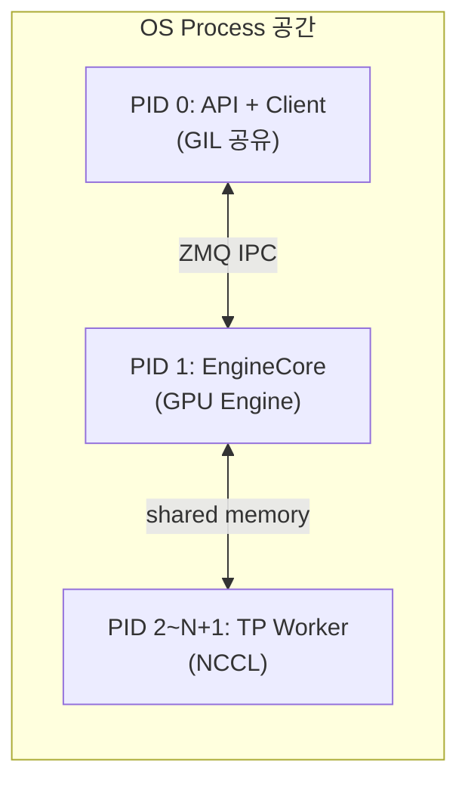
```mermaid
graph LR
    subgraph "OS Process 공간"
        P0["PID 0: API + Client\n(GIL 공유)"]
        P1["PID 1: EngineCore\n(GPU Engine)"]
        P2["PID 2~N+1: TP Worker\n(NCCL)"]
    end
    P0 <-->|ZMQ IPC| P1
    P1 <-->|shared memory| P2
```

### Hybrid v1.5

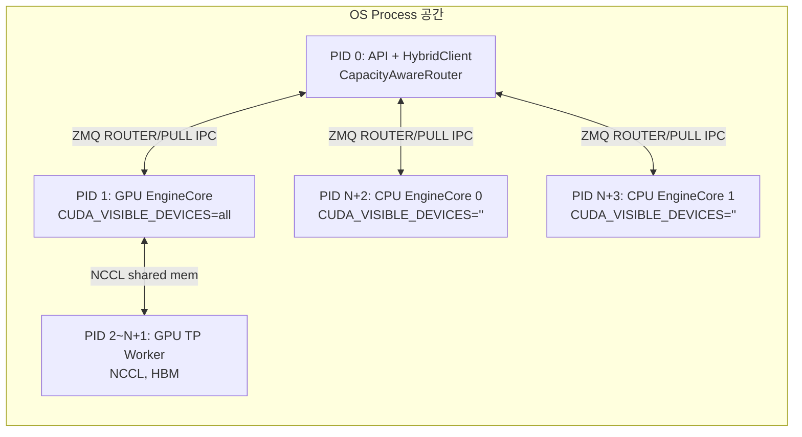
```mermaid
graph LR
    subgraph "OS Process 공간"
        P0["PID 0: API + HybridClient\nCapacityAwareRouter"]
        P1["PID 1: GPU EngineCore\nCUDA_VISIBLE_DEVICES=all"]
        P2["PID 2~N+1: GPU TP Worker\nNCCL, HBM"]
        P3["PID N+2: CPU EngineCore 0\nCUDA_VISIBLE_DEVICES=''"]
        P4["PID N+3: CPU EngineCore 1\nCUDA_VISIBLE_DEVICES=''"]
    end

    P0 <-->|ZMQ ROUTER/PULL IPC| P1
    P0 <-->|ZMQ ROUTER/PULL IPC| P3
    P0 <-->|ZMQ ROUTER/PULL IPC| P4
    P1 <-->|NCCL shared mem| P2
```

**프로세스 격리의 핵심**:

| 격리 항목 | Vanilla | Hybrid |
|-----------|---------|--------|
| GIL (Python) | GPU Engine과 API 공유 안 함 (별도 proc) | GPU/CPU 각 독립 GIL |
| 주소공간 | GPU Engine 격리 | GPU Engine + 각 CPU Engine 모두 격리 |
| GPU 가시성 | GPU Engine 프로세스에서 접근 | CPU Engine: `CUDA_VISIBLE_DEVICES=""` 로 GPU 격리 |
| NUMA 메모리 | 없음 | CPU Engine: `numa_set_membind` strict bind |
| CPU 스케줄러 | 없음 | CPU Engine: `sched_setaffinity` OMP 1:1 pin |
| 장애 격리 | GPU Engine 장애 → 전체 중단 | GPU Engine 장애 ≠ CPU Engine 영향 (ZMQ reconnect 가능) |

---

## 5. ZMQ 통신 아키텍처

### Vanilla V1 ZMQ 패턴

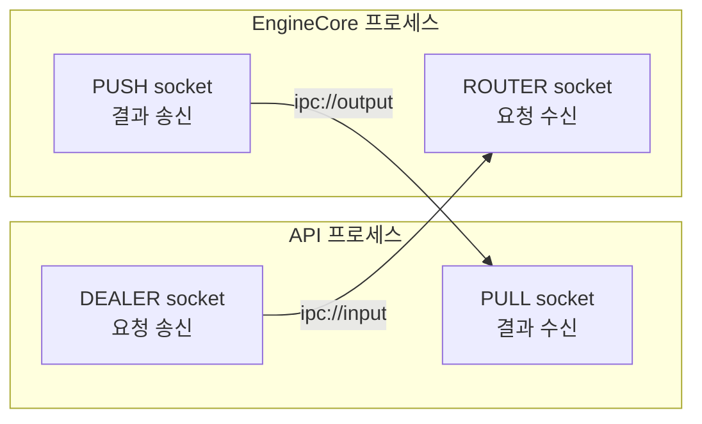
```mermaid
graph LR
    subgraph "API 프로세스"
        D[DEALER socket\n요청 송신]
        PL[PULL socket\n결과 수신]
    end

    subgraph "EngineCore 프로세스"
        RO[ROUTER socket\n요청 수신]
        PH[PUSH socket\n결과 송신]
    end

    D -->|ipc://input| RO
    PH -->|ipc://output| PL
```

### Hybrid v1.5 ZMQ 패턴

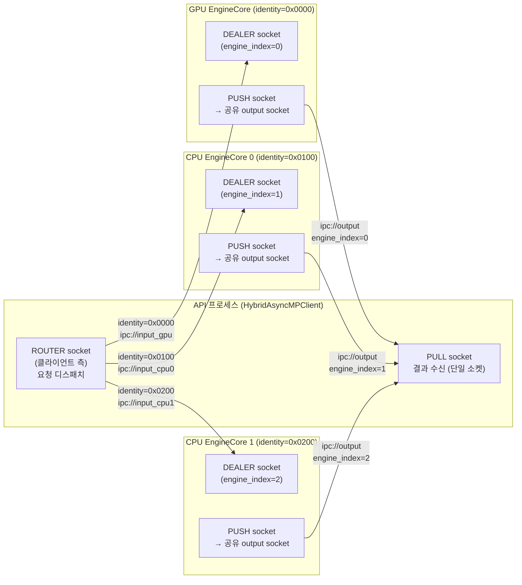
```mermaid
graph LR
    subgraph "API 프로세스 (HybridAsyncMPClient)"
        RO_C["ROUTER socket\n(클라이언트 측)\n요청 디스패치"]
        PL["PULL socket\n결과 수신 (단일 소켓)"]
    end

    subgraph "GPU EngineCore (identity=0x0000)"
        DE_G["DEALER socket\n(engine_index=0)"]
        PH_G["PUSH socket\n→ 공유 output socket"]
    end

    subgraph "CPU EngineCore 0 (identity=0x0100)"
        DE_C0["DEALER socket\n(engine_index=1)"]
        PH_C0["PUSH socket\n→ 공유 output socket"]
    end

    subgraph "CPU EngineCore 1 (identity=0x0200)"
        DE_C1["DEALER socket\n(engine_index=2)"]
        PH_C1["PUSH socket\n→ 공유 output socket"]
    end

    RO_C -->|identity=0x0000\nipc://input_gpu| DE_G
    RO_C -->|identity=0x0100\nipc://input_cpu0| DE_C0
    RO_C -->|identity=0x0200\nipc://input_cpu1| DE_C1

    PH_G -->|ipc://output\nengine_index=0| PL
    PH_C0 -->|ipc://output\nengine_index=1| PL
    PH_C1 -->|ipc://output\nengine_index=2| PL
```

**핵심 차이**:
- **Vanilla**: 단일 DEALER→ROUTER 쌍. 요청이 하나의 Engine으로만 감.
- **Hybrid**: ROUTER에서 `identity` 기반으로 다중 Engine에 dispatch. 모든 Engine의 output은 **단일 PULL 소켓**으로 수렴. `engine_index` 태그로 demux.
- Output socket을 공유함으로써 클라이언트가 GPU/CPU 결과를 동일한 polling loop에서 처리 가능.

---

## 6. 라우팅 계층: CapacityAwareRouter

Vanilla에는 존재하지 않는 계층. Hybrid v1.5의 핵심 신규 컴포넌트.

### 라우팅 전략 흐름

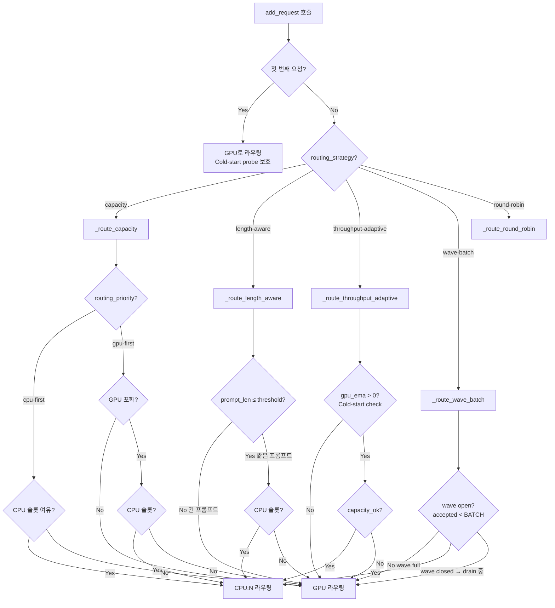
```mermaid
flowchart TD
    A[add_request 호출] --> B{첫 번째 요청?}
    B -->|Yes| GPU_COLD[GPU로 라우팅\nCold-start probe 보호]
    B -->|No| C{routing_strategy?}

    C -->|capacity| D[_route_capacity]
    C -->|length-aware| E[_route_length_aware]
    C -->|throughput-adaptive| F[_route_throughput_adaptive]
    C -->|wave-batch| G[_route_wave_batch]
    C -->|round-robin| H[_route_round_robin]

    D --> D1{routing_priority?}
    D1 -->|cpu-first| D2{CPU 슬롯 여유?}
    D2 -->|Yes| CPU[CPU:N 라우팅]
    D2 -->|No| GPU[GPU 라우팅]
    D1 -->|gpu-first| D3{GPU 포화?}
    D3 -->|No| GPU
    D3 -->|Yes| D4{CPU 슬롯?}
    D4 -->|Yes| CPU
    D4 -->|No| GPU

    E --> E1{prompt_len ≤ threshold?}
    E1 -->|No 긴 프롬프트| GPU
    E1 -->|Yes 짧은 프롬프트| E2{CPU 슬롯?}
    E2 -->|Yes| CPU
    E2 -->|No| GPU

    F --> F1{gpu_ema > 0?\nCold-start check}
    F1 -->|No| GPU
    F1 -->|Yes| F2{capacity_ok?}
    F2 -->|Yes| CPU
    F2 -->|No| GPU

    G --> G1{wave open?\naccepted < BATCH}
    G1 -->|No wave full| GPU
    G1 -->|Yes| CPU
    G1 -->|wave closed → drain 중| GPU
```

### 라우팅 전략 비교

| 전략 | 핵심 기준 | 특징 | 용도 |
|------|----------|------|------|
| `capacity` | CPU in-flight 슬롯 수 | 단순하고 예측 가능 | 기본값 |
| `length-aware` | prompt 토큰 수 | 짧은 요청만 CPU로 (CPU는 긴 prefill에 약함) | Mixed-length 워크로드 |
| `throughput-adaptive` | EMA 처리량 비교 | 워밍업 후 실측 기반 동적 슬롯 조정 | 자동 튜닝 필요 시 |
| `wave-batch` | BATCH 단위 closed wave | CPU matmul batch amortization 측정용 | 배치 효율 실험 |
| `round-robin` | 교대 분배 | CPU 슬롯과 무관하게 1:1 분배 | A/B 비교 실험 |

### CapacityAwareRouter 내부 상태

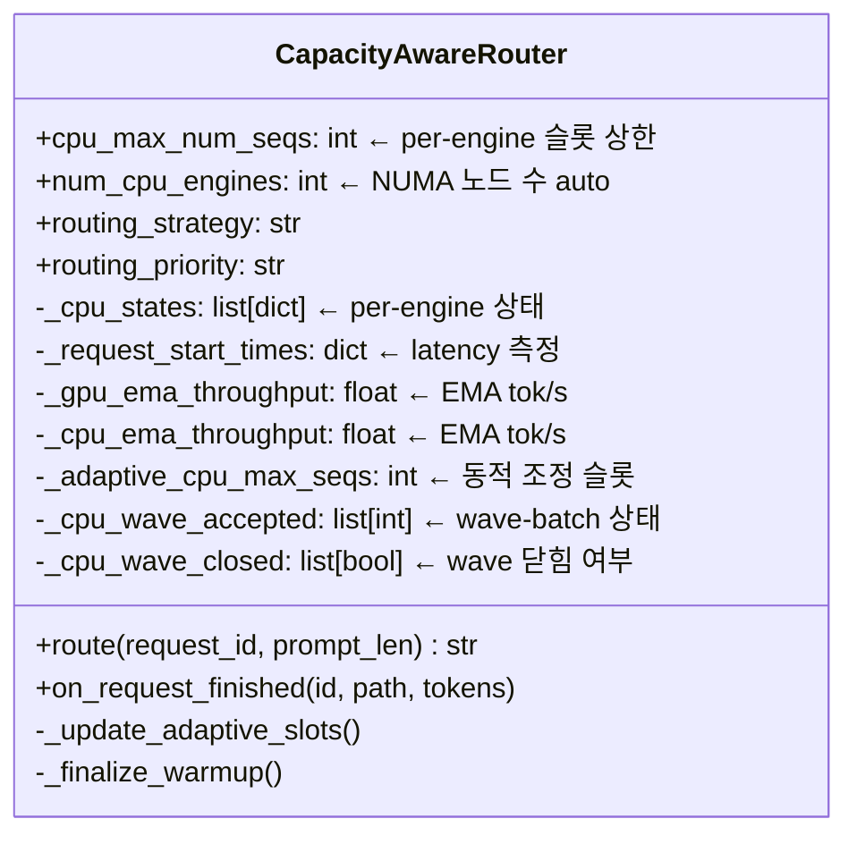
```mermaid
classDiagram
    class CapacityAwareRouter {
        +cpu_max_num_seqs: int       ← per-engine 슬롯 상한
        +num_cpu_engines: int        ← NUMA 노드 수 auto
        +routing_strategy: str
        +routing_priority: str
        -_cpu_states: list[dict]     ← per-engine 상태
        -_request_start_times: dict  ← latency 측정
        -_gpu_ema_throughput: float  ← EMA tok/s
        -_cpu_ema_throughput: float  ← EMA tok/s
        -_adaptive_cpu_max_seqs: int ← 동적 조정 슬롯
        -_cpu_wave_accepted: list[int]  ← wave-batch 상태
        -_cpu_wave_closed: list[bool]   ← wave 닫힘 여부
        +route(request_id, prompt_len) str
        +on_request_finished(id, path, tokens)
        -_update_adaptive_slots()
        -_finalize_warmup()
    }
```

**Cold-start Gate**: 첫 번째 요청은 strategy/priority와 무관하게 항상 GPU로 보낸다. `benchmark_serving.py`의 initial probe 요청이 CPU로 라우팅되면 16K+16K 워크로드에서 45분+ stall이 발생하는 것을 방지.

---

## 7. 스케줄러 구조 차이

### Vanilla V1 스케줄러

```mermaid
graph TD
    subgraph "단일 Scheduler (GPU Engine)"
        S[SchedulerInterface] --> W[Running Queue]
        S --> WQ[Waiting Queue]
        S --> SQ[Swapped Queue]
        S -->|schedule()| O[SchedulerOutput\nBatch 결정]
        O -->|max_num_seqs GPU| E[ExecutorModel]
    end
```

### Hybrid v1.5 스케줄러

```mermaid
graph TD
    subgraph "GPU EngineCore (PID 1)"
        SG[GPU Scheduler] --> WG[Running Queue GPU]
        SG -->|schedule()| OG[GPU Batch\nmax_num_seqs = GPU default]
        OG --> EG[GPU Executor\nTP=8, MultiprocExecutor]
    end

    subgraph "CPU EngineCore 0 (PID 2)"
        SC0[CPU Scheduler 0] --> WC0[Running Queue CPU 0]
        SC0 -->|schedule()| OC0[CPU Batch\nmax_num_seqs = 1 고정\nchunked_prefill = False]
        OC0 --> EC0[CPU Executor 0\nTP=1, UniProcExecutor]
    end

    subgraph "CPU EngineCore 1 (PID 3)"
        SC1[CPU Scheduler 1] --> WC1[Running Queue CPU 1]
        SC1 -->|schedule()| OC1[CPU Batch\nmax_num_seqs = 1 고정]
        OC1 --> EC1[CPU Executor 1\nTP=1, UniProcExecutor]
    end

    R[CapacityAwareRouter\nAPI 프로세스] -->|request dispatch| SG
    R -->|request dispatch| SC0
    R -->|request dispatch| SC1
```

**스케줄러 설정 차이**:

| 설정 | GPU Scheduler | CPU Scheduler |
|------|--------------|---------------|
| `max_num_seqs` | 원본 (수백) | **1 고정** (auto 시) |
| `chunked_prefill` | True (기본) | **False 강제** |
| `max_num_batched_tokens` | 원본 | `max_seqs × 256` |
| `max_model_len` | 원본 | `min(원본, cpu_max_num_batched_tokens, 2048+)` |
| Prefix Caching | 활성 가능 | 비활성 (CPU hash 느림) |
| Speculative Decode | 활성 가능 | 비활성 |

`cpu_max_num_seqs = 1`의 의미: 1개의 시퀀스가 해당 NUMA 노드의 **모든 물리 코어**를 OMP + BLAS matmul 병렬로 점유. Batch를 만들지 않고 단일 시퀀스에 모든 CPU 연산 자원을 집중.

---

## 8. 실행자(Executor) 및 워커 구조

### Vanilla V1

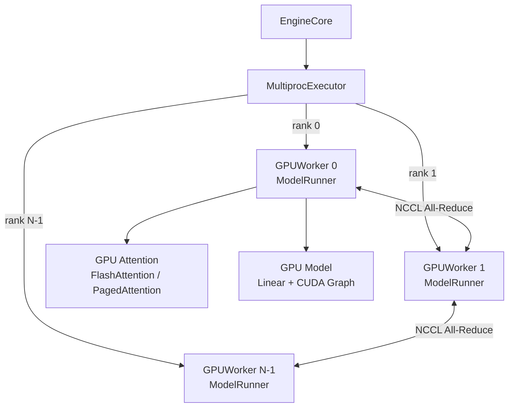
```mermaid
graph TD
    EC[EngineCore] --> ME[MultiprocExecutor]
    ME -->|rank 0| W0[GPUWorker 0\nModelRunner]
    ME -->|rank 1| W1[GPUWorker 1\nModelRunner]
    ME -->|rank N-1| WN[GPUWorker N-1\nModelRunner]
    W0 <-->|NCCL All-Reduce| W1
    W1 <-->|NCCL All-Reduce| WN
    W0 --> A0[GPU Attention\nFlashAttention / PagedAttention]
    W0 --> M0[GPU Model\nLinear + CUDA Graph]
```

### Hybrid v1.5 CPU 경로

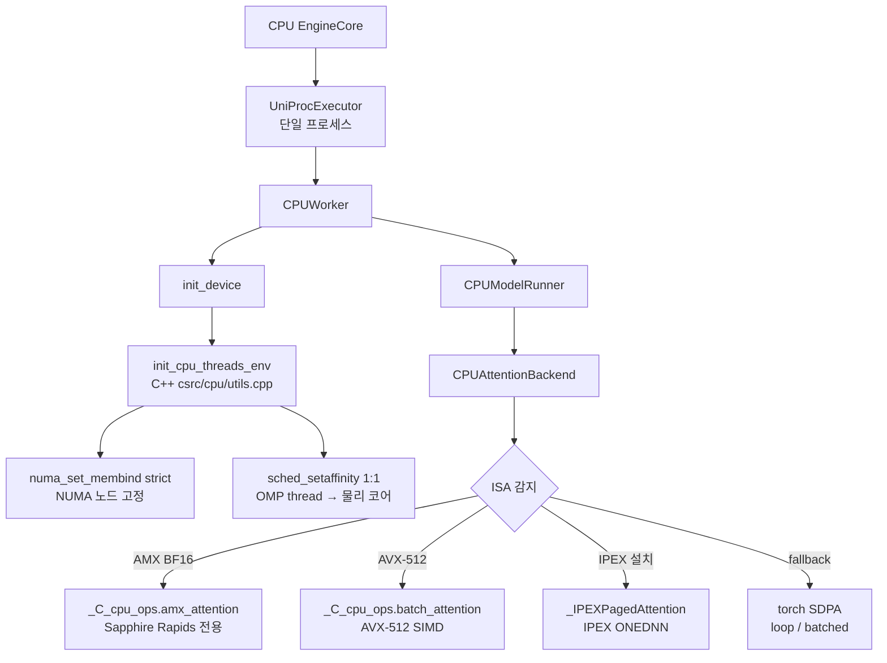
```mermaid
graph TD
    CE[CPU EngineCore] --> UE[UniProcExecutor\n단일 프로세스]
    UE --> CW[CPUWorker]

    CW --> INIT[init_device]
    INIT --> CI[init_cpu_threads_env\nC++ csrc/cpu/utils.cpp]
    CI --> NA[numa_set_membind strict\nNUMA 노드 고정]
    CI --> SA["sched_setaffinity 1:1\nOMP thread → 물리 코어"]

    CW --> MR[CPUModelRunner]
    MR --> CA[CPUAttentionBackend]

    CA --> ISA{ISA 감지}
    ISA -->|AMX BF16| AMX[_C_cpu_ops.amx_attention\nSapphire Rapids 전용]
    ISA -->|AVX-512| AVX[_C_cpu_ops.batch_attention\nAVX-512 SIMD]
    ISA -->|IPEX 설치| IPEX[_IPEXPagedAttention\nIPEX ONEDNN]
    ISA -->|fallback| SDPA[torch SDPA\nloop / batched]
```

**GPU Worker vs CPU Worker 차이**:

| 항목 | GPUWorker | CPUWorker |
|------|-----------|-----------|
| 실행자 | `MultiprocExecutor` (N 프로세스) | `UniProcExecutor` (1 프로세스) |
| 통신 | NCCL All-Reduce | 없음 (단일 프로세스) |
| 디바이스 | CUDA, HBM | CPU, DDR5 |
| 병렬화 | TP=8 (Tensor Parallel) | OMP (OpenMP 코어 내 병렬) |
| 어텐션 | FlashAttention / vLLM PagedAttention | CPUAttentionBackend (IPEX/AVX-512) |
| CUDA Graph | 사용 | 사용 안 함 (`enforce_eager=True`) |
| 컴파일 | `compilation_config.level` 설정대로 | `level=0` (NO_COMPILATION) |
| 커스텀 ops | `rms_norm`, `silu_and_mul` 등 CUDA ops | PyTorch native (CUDA ops 비활성화) |
| NUMA | 해당 없음 | `numa_set_membind` strict bind |

---

## 9. KV Cache 관리

### Vanilla V1

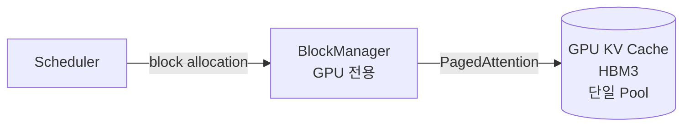
```mermaid
graph LR
    S[Scheduler] -->|block allocation| BC[BlockManager\nGPU 전용]
    BC -->|PagedAttention| KV[(GPU KV Cache\nHBM3\n단일 Pool)]
```

### Hybrid v1.5

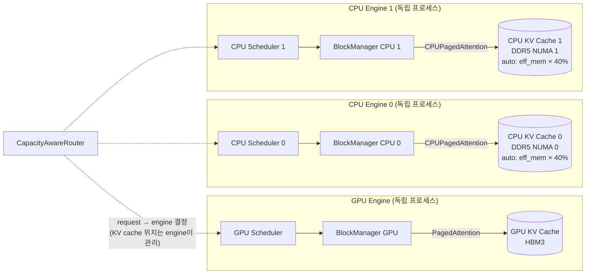
```mermaid
graph LR
    subgraph "GPU Engine (독립 프로세스)"
        SG[GPU Scheduler] --> BCG[BlockManager GPU]
        BCG -->|PagedAttention| KVG[(GPU KV Cache\nHBM3)]
    end

    subgraph "CPU Engine 0 (독립 프로세스)"
        SC0[CPU Scheduler 0] --> BCC0[BlockManager CPU 0]
        BCC0 -->|CPUPagedAttention| KVC0[(CPU KV Cache 0\nDDR5 NUMA 0\nauto: eff_mem × 40%)]
    end

    subgraph "CPU Engine 1 (독립 프로세스)"
        SC1[CPU Scheduler 1] --> BCC1[BlockManager CPU 1]
        BCC1 -->|CPUPagedAttention| KVC1[(CPU KV Cache 1\nDDR5 NUMA 1\nauto: eff_mem × 40%)]
    end

    R[CapacityAwareRouter] -.->|"request → engine 결정\n(KV cache 위치는 engine이 관리)"| SG
    R -.-> SC0
    R -.-> SC1
```

**핵심 차이**:
- Vanilla: 단일 BlockManager가 GPU HBM 전체를 관리.
- Hybrid: GPU/CPU BlockManager가 **완전히 독립**. KV block을 공유하거나 이동하지 않음.
- 요청이 CPU로 라우팅되면 해당 요청의 KV cache 전체가 CPU DDR5에 위치.
- **CPU KV cache 크기 자동 결정**: `clamp(effective_mem × 0.4, 32GB, 512GB)`. NUMA 바인딩 시 해당 노드의 메모리만 기준으로 계산.

---

## 10. CPU 최적화 스택

Vanilla에는 존재하지 않는 계층. Hybrid v1.5의 CPU 성능을 결정하는 핵심.

### ISA 감지 및 폴백 체인

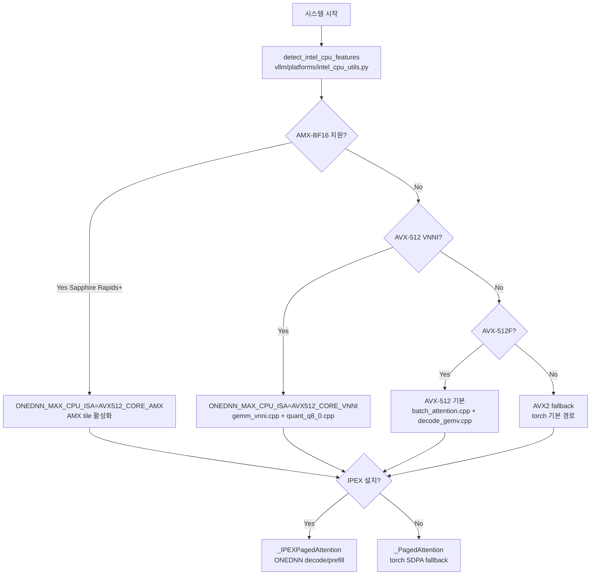
```mermaid
flowchart TD
    A[시스템 시작] --> B[detect_intel_cpu_features\nvllm/platforms/intel_cpu_utils.py]
    B --> C{AMX-BF16 지원?}
    C -->|Yes Sapphire Rapids+| D[ONEDNN_MAX_CPU_ISA=AVX512_CORE_AMX\nAMX tile 활성화]
    C -->|No| E{AVX-512 VNNI?}
    E -->|Yes| F[ONEDNN_MAX_CPU_ISA=AVX512_CORE_VNNI\ngemm_vnni.cpp + quant_q8_0.cpp]
    E -->|No| G{AVX-512F?}
    G -->|Yes| H[AVX-512 기본\nbatch_attention.cpp + decode_gemv.cpp]
    G -->|No| I[AVX2 fallback\ntorch 기본 경로]

    D --> J{IPEX 설치?}
    F --> J
    H --> J
    I --> J
    J -->|Yes| K[_IPEXPagedAttention\nONEDNN decode/prefill]
    J -->|No| L[_PagedAttention\ntorch SDPA fallback]
```

### CPU 어텐션 디스패치 경로

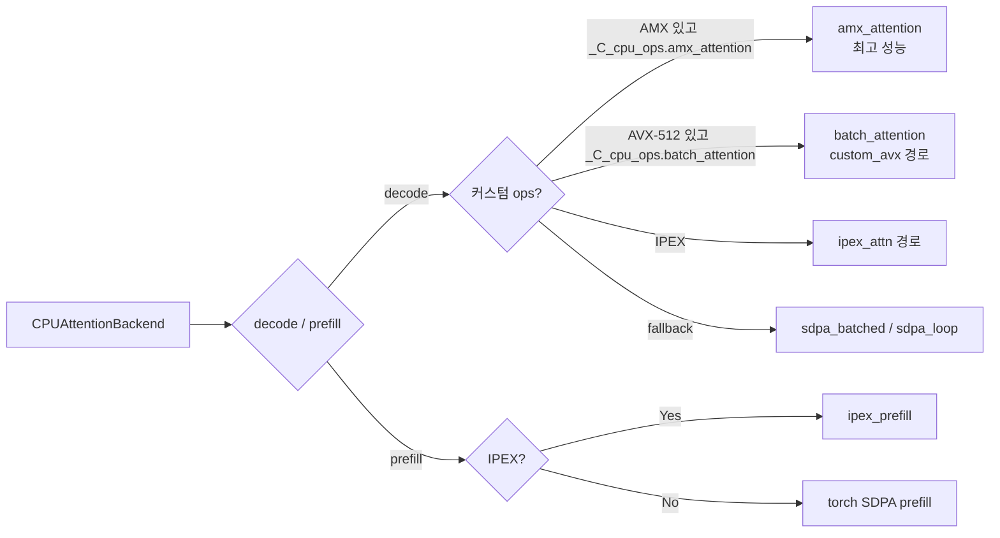
```mermaid
flowchart LR
    A[CPUAttentionBackend] --> B{decode / prefill}

    B -->|decode| C{커스텀 ops?}
    C -->|AMX 있고 _C_cpu_ops.amx_attention| D[amx_attention\n최고 성능]
    C -->|AVX-512 있고 _C_cpu_ops.batch_attention| E[batch_attention\ncustom_avx 경로]
    C -->|IPEX| F[ipex_attn 경로]
    C -->|fallback| G[sdpa_batched / sdpa_loop]

    B -->|prefill| H{IPEX?}
    H -->|Yes| I[ipex_prefill]
    H -->|No| J[torch SDPA prefill]
```

### OMP Thread 1:1 Pinning (핵심 성능 원리)

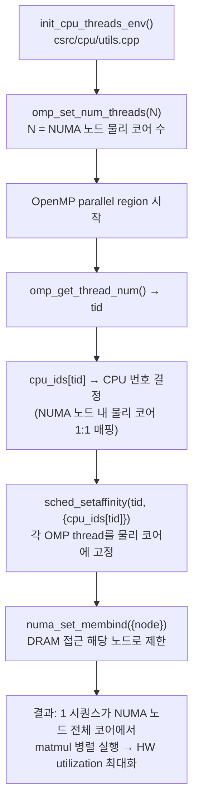
```mermaid
graph TD
    A["init_cpu_threads_env()\ncsrc/cpu/utils.cpp"] --> B["omp_set_num_threads(N)\nN = NUMA 노드 물리 코어 수"]
    B --> C["OpenMP parallel region 시작"]
    C --> D["omp_get_thread_num() → tid"]
    D --> E["cpu_ids[tid] → CPU 번호 결정\n(NUMA 노드 내 물리 코어 1:1 매핑)"]
    E --> F["sched_setaffinity(tid, {cpu_ids[tid]})\n각 OMP thread를 물리 코어에 고정"]
    F --> G["numa_set_membind({node})\nDRAM 접근 해당 노드로 제한"]

    G --> H[결과: 1 시퀀스가 NUMA 노드 전체 코어에서\nmatmul 병렬 실행 → HW utilization 최대화]
```

### C++ 확장 모듈 구조

| 모듈 | 파일 | 빌드 조건 | 역할 |
|------|------|-----------|------|
| `_C.abi3.so` | `csrc/` (원본) | 항상 | CUDA 메인 extension |
| `_C_utils.abi3.so` | `csrc/cpu/utils.cpp` | x86_64 + OpenMP | `init_cpu_threads_env` (NUMA+OMP pin) |
| `_C_cpu_ops.abi3.so` | `csrc/cpu/batch_attention.cpp` 등 | AVX-512F 필수 | CPU 추론 커널 (decode GEMV, batch attn) |

**`_C_utils` 핵심 함수**:
- `init_cpu_threads_env(cpu_ids, numa_node)`: OMP thread 1:1 pin + NUMA strict membind
- `compute_slot_mapping_kernel_impl(...)`: KV 슬롯 매핑 (OpenMP 병렬화)

---

## 11. 빌드 구조 차이

### Vanilla V1

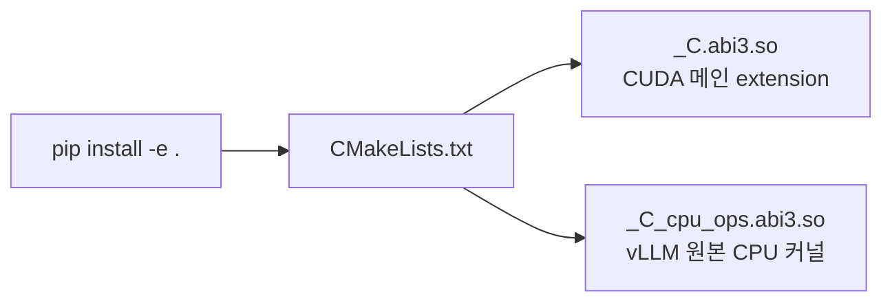
```mermaid
graph LR
    A[pip install -e .] --> B[CMakeLists.txt]
    B --> C[_C.abi3.so\nCUDA 메인 extension]
    B --> D[_C_cpu_ops.abi3.so\nvLLM 원본 CPU 커널]
```

### Hybrid v1.5

```mermaid
graph LR
    A["pip install -e .\n--config-settings=cmake.args=-DVLLM_TARGET_DEVICE=cuda"] --> B[CMakeLists.txt]
    B --> C[_C.abi3.so\nCUDA 메인 extension\n원본 무수정]
    B --> D["_C_utils.abi3.so\ncpu_utils_extension.cmake\nOpenMP + libnuma 전용\n항상 빌드 (AVX 불필요)"]
    B --> E["_C_cpu_ops.abi3.so\ncpu_hybrid_extension.cmake\nAVX-512F 필수\nVNNI 있으면 gemm/quant 추가"]
```

**cmake 분리 원칙**:
- `_C_utils`: SIMD 의존 없음. x86_64 어디서나 빌드. `init_cpu_threads_env` 하나의 역할만.
- `_C_cpu_ops`: AVX-512 필수. 개발 머신에서 빌드 실패 시 graceful skip (Python fallback 사용).

---

## 12. 설정 및 파라미터 자동 감지

### Vanilla V1 설정

```mermaid
graph LR
    A[vllm serve] --> B[VllmConfig]
    B --> C[ParallelConfig\nTP, PP 명시]
    B --> D[CacheConfig\ngpu_memory_utilization]
    B --> E[SchedulerConfig\nmax_num_seqs]
```

### Hybrid v1.5 설정

```mermaid
graph LR
    A["vllm serve\n--hybrid-mode parallel-batch"] --> B[VllmConfig]
    B --> HC[HybridConfig\nmode / num_cpu_engines=0 auto\ncpu_max_num_seqs=0 auto\ncpu_kvcache_space_gb=0 auto\ncpu_num_threads=0 auto]

    HC --> R1["_resolve_num_cpu_engines()\n→ NUMAAllocator.num_nodes"]
    HC --> R2["_resolve_cpu_params()\n→ NUMA topology 기반 자동 결정"]

    R1 --> NE[num_cpu_engines = NUMA node 수]
    R2 --> P1[cpu_num_threads = NUMA 노드 물리 코어]
    R2 --> P2["cpu_max_num_seqs = 1 고정\n(auto sentinel)"]
    R2 --> P3["cpu_kvcache_space_gb\n= clamp(eff_mem×0.4, 32, 512)"]

    subgraph "CPU Engine 별 VllmConfig 파생"
        P1 --> CPUConf["_create_cpu_vllm_config()\nDeviceConfig=cpu\nParallelConfig TP=1\nCompilationConfig level=0\nHybridConfig mode=none"]
    end
```

**Auto-resolve 계층 (우선순위 순)**:

| 파라미터 | 사용자 명시 | auto(0) |
|----------|------------|---------|
| `num_cpu_engines` | 명시 값 사용 + 경고 | `NUMAAllocator.num_nodes` |
| `cpu_max_num_seqs` | 명시 값 사용 + 경고 (`≠1` 시) | **1 고정** (논문 원칙) |
| `cpu_num_threads` | 명시 값 사용 | NUMA 노드 물리 코어 수 |
| `cpu_kvcache_space_gb` | 명시 값 사용 | `eff_mem × 40%`, 32~512GB |
| `cpu_max_num_batched_tokens` | 명시 값 사용 | `max_seqs × 256` |

---

## 13. 성능 모델

### Vanilla V1 처리량 모델

```
T_total = T_GPU
       = requests_per_sec × avg_tokens_per_request
```

GPU 포화 상태에서 처리량은 GPU 단독 성능에 의해 결정됨.

### Hybrid v1.5 처리량 모델

```
T_hybrid = T_GPU + α · T_CPU

α = T_CPU / (T_GPU + T_CPU)  ← 실측 기반 자동 계산 가능

여기서:
  T_GPU = GPU EngineCore 처리량 (tok/s)
  T_CPU = Σ T_CPU_engine_i  (NUMA 노드별 CPU 처리량 합)
  α     = CPU 기여 비율 (CapacityAwareRouter가 자동 조정)
```

**현재 실측 성과** (Qwen2.5-32B, H100×8, TP=8, 500 req, 128/128):

| 구성 | 처리량 | GPU only 대비 |
|------|--------|--------------|
| GPU only | 11,523 tok/s | 100% (baseline) |
| Hybrid (cpu_max_num_seqs=1) | 12,719 tok/s | +10.4% |

**현재 한계**: `cpu_max_num_seqs > 1` 시 오히려 처리량 감소 (seqs=8 → 272 tok/s). CPU 커널의 M>1 batch amortization 미달성이 원인 (TODO.md §현재 병목).

---

## 14. 구조 차이 요약

```mermaid
graph TD
    subgraph "Vanilla V1 — 단일 경로"
        V_A[HTTP Request] --> V_B[AsyncLLM]
        V_B --> V_C[AsyncMPClient]
        V_C -->|ZMQ| V_D[EngineCore\nGPU Scheduler]
        V_D -->|NCCL| V_E["GPUWorker × N"]
        V_E --> V_F[(GPU KV Cache)]
        V_F -->|token output| V_G[Response]
    end

    subgraph "Hybrid v1.5 — 분기 병렬 경로"
        H_A[HTTP Request] --> H_B[AsyncLLM]
        H_B --> H_C[HybridAsyncMPClient]
        H_C --> H_R[CapacityAwareRouter\n5가지 전략]

        H_R -->|GPU path| H_D0[GPU EngineCore\nGPU Scheduler]
        H_D0 -->|NCCL| H_E0["GPUWorker × N"]
        H_E0 --> H_F0[(GPU KV Cache\nHBM3)]

        H_R -->|CPU path 0| H_D1[CPU EngineCore 0\nNUMA 0]
        H_D1 --> H_E1[CPUWorker 0\nOMP 1:1 pin]
        H_E1 --> H_F1[(CPU KV Cache 0\nDDR5 NUMA 0)]

        H_R -->|CPU path 1| H_D2[CPU EngineCore 1\nNUMA 1]
        H_D2 --> H_E2[CPUWorker 1\nOMP 1:1 pin]
        H_E2 --> H_F2[(CPU KV Cache 1\nDDR5 NUMA 1)]

        H_F0 -->|engine_index=0| H_G[Output Demux\nZMQ PULL]
        H_F1 -->|engine_index=1| H_G
        H_F2 -->|engine_index=2| H_G
        H_G --> H_H[Response]
    end
```

### 핵심 설계 원칙 대조표

| 원칙 | Vanilla V1 | Hybrid v1.5 |
|------|-----------|-------------|
| **추론 장치** | GPU 단독 | GPU + CPU 병렬 |
| **프로세스 격리** | EngineCore 1개 별도 프로세스 | GPU Engine + CPU Engine × NUMA 수 |
| **요청 라우팅** | 없음 (단일 큐) | CapacityAwareRouter (5 전략) |
| **스케줄러** | 단일 (GPU Engine 내) | 독립적 (GPU Engine + 각 CPU Engine) |
| **KV Cache** | GPU HBM 단일 | GPU HBM + CPU DDR5 (NUMA별 분리) |
| **실행자** | MultiprocExecutor (TP=N) | GPU: MultiprocExecutor / CPU: UniProcExecutor (TP=1) |
| **병렬화 방식** | Tensor Parallel (NCCL) | GPU: NCCL / CPU: OpenMP (OMP 1:1 pin) |
| **NUMA 활용** | 없음 | strict membind + sched_setaffinity |
| **C++ 확장** | `_C.abi3.so` (CUDA) | + `_C_utils.abi3.so` + `_C_cpu_ops.abi3.so` |
| **core.py 수정** | 원본 | **무수정** (Hybrid 코드는 별도 파일에만 존재) |
| **CPU 최적화** | 없음 | IPEX→ONEDNN→AMX/AVX-512→AVX2 폴백 체인 |
| **처리량 목표** | `T_GPU` | `T_GPU + α·T_CPU` |

---

> **설계의 단일 진실 공급원**: `docs/paper/main.tex` (IEEE 논문 draft)
>
> **관련 코드 파일**:
> - `vllm/v1/engine/hybrid_core.py` — CapacityAwareRouter, _resolve_cpu_params, launch_hybrid_engines
> - `vllm/v1/engine/core_client.py` — HybridAsyncMPClient, HybridSyncMPClient
> - `vllm/v1/worker/cpu_worker.py` — CPUWorker, init_device, NUMA binding
> - `vllm/v1/attention/backends/cpu_attn.py` — CPUAttentionBackend, ISA dispatch
> - `vllm/platforms/intel_cpu_utils.py` — Intel CPU 감지, NUMA, IPEX 설정
> - `csrc/cpu/utils.cpp` — init_cpu_threads_env (C++ OMP pin + NUMA membind)
