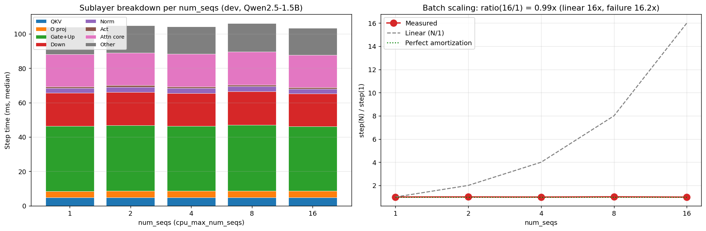
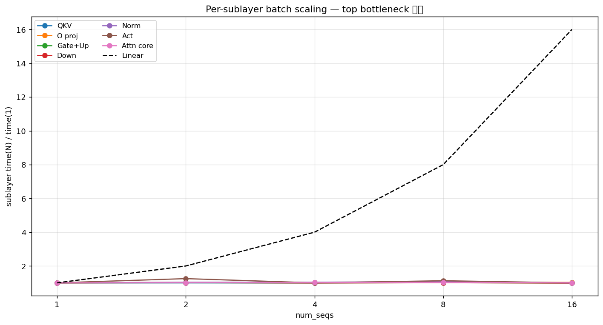
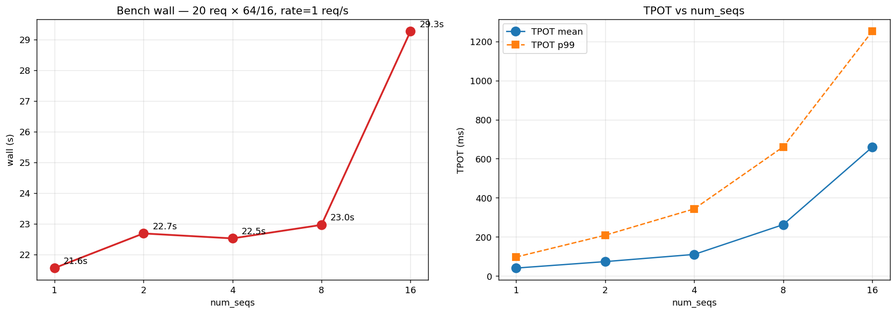

# G0 Analysis — dev (RTX3090 + i9-12900KF) baseline

**Date**: 2026-04-15 KST
**Model**: Qwen2.5-1.5B-Instruct
**Workload**: 20 req × 64/16 tokens, capacity + cpu-first, rate=1 req/s
**Profile mode**: `VLLM_HYBRID_PROFILE=1 VLLM_HYBRID_PROFILE_SUBLAYER=1 VLLM_HYBRID_PROFILE_EVERY=1`

## Sublayer breakdown (median ms)

|   seqs |   total_med |   qkv_med |   o_med |   gate_up_med |   down_med |   norm_med |   act_med |   attn_core_med |   other_med |   scaling_ratio |
|-------:|------------:|----------:|--------:|--------------:|-----------:|-----------:|----------:|----------------:|------------:|----------------:|
|      1 |       93.4  |       4.8 |     3.7 |          37.9 |       19.2 |        2.8 |       0.8 |           18.8  |       16    |        1        |
|      2 |       94    |       4.8 |     3.8 |          38.1 |       19.4 |        2.9 |       1   |           18.9  |       16    |        1.00642  |
|      4 |       93    |       4.8 |     3.8 |          37.8 |       19.1 |        2.9 |       0.8 |           19    |       15.9  |        0.995717 |
|      8 |       94.75 |       4.9 |     3.8 |          38.3 |       19.4 |        3   |       0.9 |           19.35 |       16.35 |        1.01445  |
|     16 |       92.5  |       4.8 |     3.8 |          37.6 |       19   |        2.8 |       0.8 |           18.8  |       15.8  |        0.990364 |

## Bench metrics

|   seqs |   wall_s |   req_tps |   out_tps |   tpot_mean |   tpot_p99 |   ttft_mean |   ttft_p99 |
|-------:|---------:|----------:|----------:|------------:|-----------:|------------:|-----------:|
|      1 |  21.5614 |  0.927585 |  13.45    |     40.5499 |     97.118 |     582.205 |    2110.95 |
|      2 |  22.6889 |  0.88149  |  12.7816  |     73.5936 |    208.697 |     959.224 |    2868.53 |
|      4 |  22.5274 |  0.887808 |  12.8732  |    110.339  |    343.3   |    1026.1   |    2849.79 |
|      8 |  22.9669 |  0.870817 |  12.6268  |    262.77   |    660.706 |    1362.21  |    3267.8  |
|     16 |  29.2685 |  0.68333  |   9.90828 |    659.21   |   1251.73  |    3425.31  |    6926.65 |

## Key findings

- **scaling_ratio(4/1)  = 1.00x** **G2 pass**
- **scaling_ratio(16/1) = 0.99x** (linear expects 16x)
- Top bottleneck @ seqs=1:

  1. Gate+Up: 37.90ms (40.6%)
  1. Down: 19.20ms (20.6%)
  1. Attn core: 18.80ms (20.1%)

## Plots

