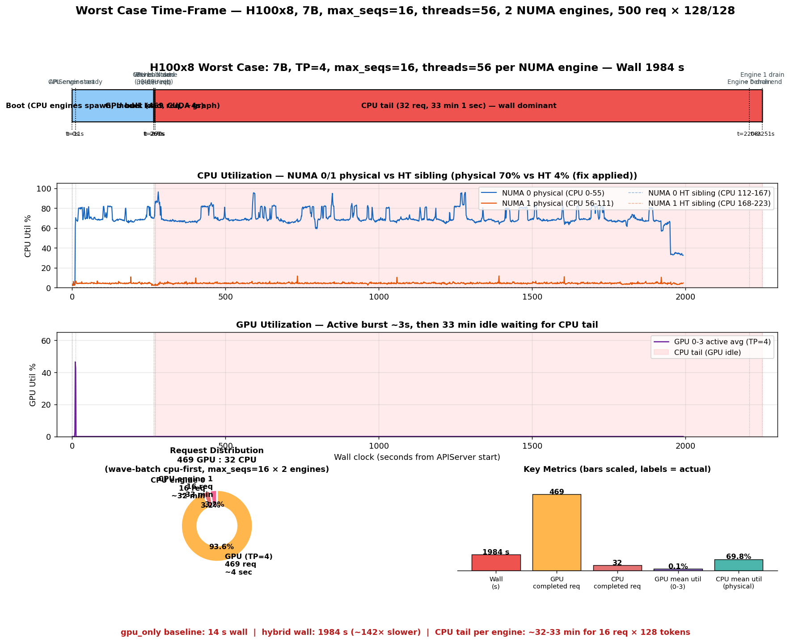

# Worst Case Time-Frame — H100x8, 7B, max_seqs=16, threads=56

**Run**: `20260415_031045_H_C_H100_80GB_HBM3_x8_Qwen2.5-7B-Instruct`
**날짜**: 2026-04-15 03:10 KST
**시각화**: 

---

## 1. 구성

| 항목 | 값 |
|------|----|
| 모델 | Qwen2.5-7B-Instruct (BF16) |
| GPU | H100 80GB HBM3 × 8, TP=4 (GPU 0-3 사용, 4-7 idle) |
| CPU | Xeon 8480+ 2 socket × 56 physical = 112 physical / 224 logical |
| NUMA | 2 node, `num_cpu_engines=2` |
| CPU engine 0 | NUMA 0, CPUs 0-55 (physical primary), max_seqs=16, threads=56 |
| CPU engine 1 | NUMA 1, CPUs 56-111 (physical primary), max_seqs=16, threads=56 |
| Bench | 500 req × 128 in / 128 out, random |
| 라우팅 | capacity wave-batch + cpu-first |

---

## 2. Time-frame (wall seconds from APIServer start)

| t (s) | wall clock (KST) | 이벤트 |
|------:|------------------|--------|
| 0     | 03:06:32 | APIServer 시작 |
| 11    | 03:06:43 | CPU engine 2개 ready (post-init) |
| 266   | 03:10:58 | Bench 시작 (ROUTER-INIT) |
| 267   | 03:10:59 | Wave closed — engine0/1 각 16 req 수용, 이후 GPU fallback |
| 270   | 03:11:02 | GPU 469 req 배치 처리 완료 (~4s) |
| 2208  | 03:43:20 | Engine 0 drain (16 req, 32 min 21 s) |
| 2251  | 03:44:03 | Engine 1 drain → **bench end (wall 1984 s)** |

**Bench wall: 1984 s** (gpu_only baseline 14 s 대비 **142×** slower)

---

## 3. Phase 해석

### Phase A — Boot (t=0 ~ 266 s)
- GPU CUDA graph 캡처 + 모델 load + CPU engine 2개 fork 및 KV cache 할당
- 벤치 시작 전이므로 wall 에는 영향 없음

### Phase B — GPU bulk (t=266 ~ 270 s, **~4 s**)
- Router: CPU wave 16×2=32 req 먼저 받음, 이후 GPU 로 fallback
- GPU TP=4 가 469 req 를 continuous batching 으로 처리
- TPOT median 24.8 ms, 최대 burst util 44~56%

### Phase C — CPU tail (t=270 ~ 2251 s, **~33 min = wall 의 99.2%**)
- 32 req 가 CPU engine 2개에서 병렬 소진
- per-engine: 16 req × 128 token = **32분 소요**
- CPU physical core util 70% (NUMA 0/1 모두), HT sibling 4% — pinning 정상
- GPU 0-3 idle (0.1% avg), GPU 4-7 75W baseline
- **wall 을 혼자 지배**

---

## 4. 이용률 요약

| 리소스 | 평균 util | 비고 |
|--------|----------:|------|
| GPU 0-3 (TP=4 active) | 0.1% | 4 s burst 후 33 min idle |
| GPU 4-7 (idle) | 0% | TP=4 이므로 unused |
| NUMA 0 physical (CPU 0-55) | 69.4% | CPU tail 구간 ~100% |
| NUMA 1 physical (CPU 56-111) | 70.2% | 동일 |
| NUMA 0 HT (CPU 112-167) | ~4% | physical primary pinning 정상 작동 |
| NUMA 1 HT (CPU 168-223) | ~4% | 동일 |

Latency:
- TTFT median 860 ms / p99 **62 427 ms** (CPU prefill 직렬화)
- TPOT median 24.8 ms (GPU) / mean 992 ms / p99 **15 220 ms** (CPU batch=16 per-step)

---

## 5. 왜 Worst Case 인가

1. **max_seqs=16**: wave 당 32 req 가 CPU 에 묶임. max_seqs=1 이면 2 req 만 묶였을 것
2. **threads=56 (all physical)**: CPU 최대 성능 활용하도록 했으나, 여전히 16-req batch matmul 에서 per-step 수백 ms 소요
3. **cpu-first + wave-batch**: 라우터가 의도적으로 CPU 를 먼저 채움 — 부하가 가벼우면 GPU idle 화
4. **7B > 1.5B**: 모델 크기가 커서 CPU per-token cost 가 1.5B 의 4-5 배

**구조적 결론**: `T_hybrid = T_GPU + α·T_CPU` 에서 α 가 거의 1. GPU 4 s + CPU 1980 s = **CPU tail 이 wall 을 독점**. wave-batch 는 현재 구현에서 "CPU 가 GPU 만큼 빠르다" 전제 없이는 failure amplifier.

---

## 6. 개선 방향 (참조)

- Ninja Gap plan: `ideation/20260415_094130_claude_ninja_gap_comprehensive_plan.md`
- 핵심: CPU per-req cost 를 28× 단축하거나, CPU 역할을 spec decode / prefill-only 로 재정의
- batch scaling: 현재 `num_seqs↑` 가 per-req cost 를 낮추지 못함 — AMX BF16 batched GEMM + T-MAC LUT + IPEX FD 통합 필요
