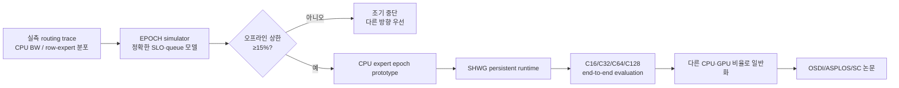
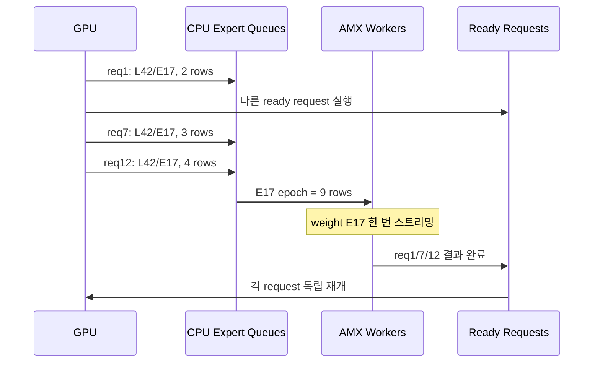
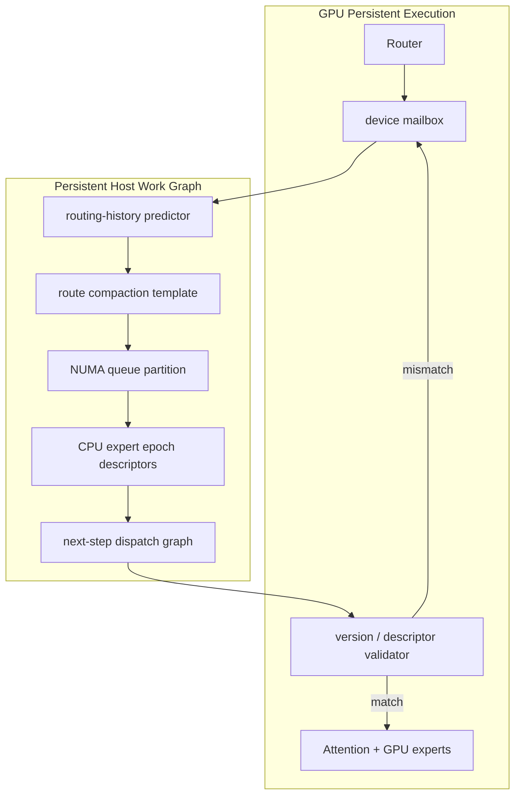
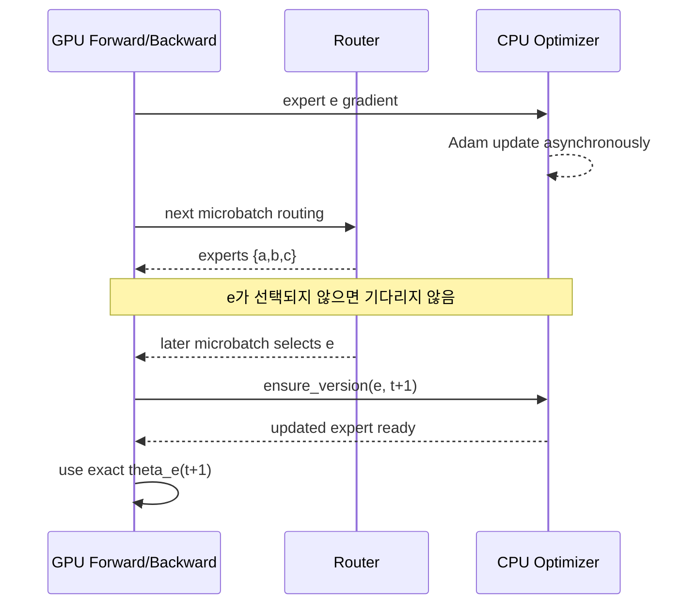
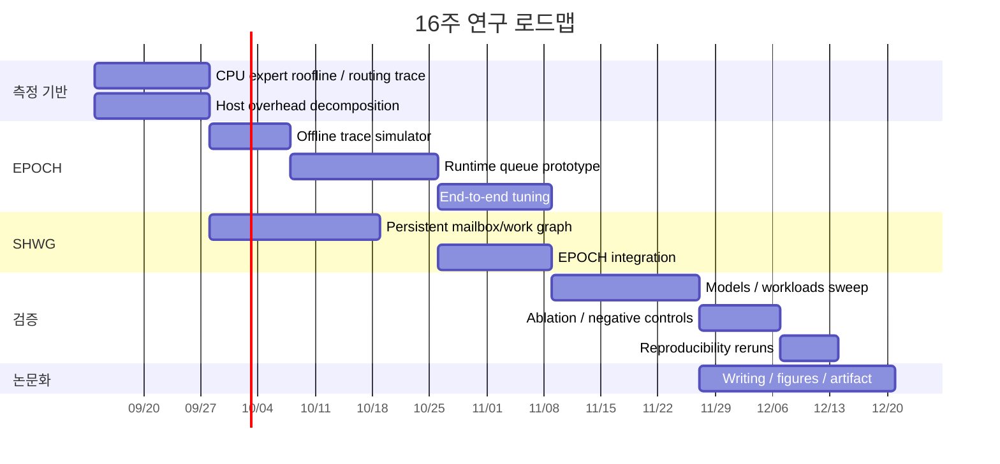
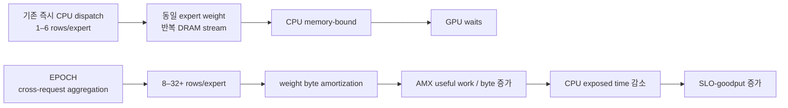

# CPU–GPU 동시 활용 LLM 학습·추론 시스템: 선행연구 지도, 실패 메커니즘, 그리고 출판 가능한 신규 연구 방향

## 집행 요약

### 핵심 결론

업로드된 실험 이력과 2026년 9월 9일까지의 최신 문헌을 함께 보면, **“GPU가 바쁜 동안 남는 CPU에 GPU와 똑같은 연산을 조금 나눠 준다”는 전략은 일반적으로 성공하기 어렵다.** 사용자 실험에서도 CPU partial attention은 GPU hot attention과 겹칠 수 있는 의존성 창이 없었고, 최종적으로 vanilla 대비 약 2.6–4배 느려졌으며 CPU 결과가 실제 병합된 비율은 0%였다. 반면 480B급 MoE 모델처럼 GPU 메모리에 전체 모델이 들어가지 않는 경우에는 CPU가 INT4 expert를 직접 계산함으로써 **서빙 자체를 0에서 가능하게 만들었고**, 이후 hot-expert GPU 배치, callback 제거, phase-aware placement 등을 통해 C32 기준 약 56.3→572 tok/s, 즉 약 10.2배까지 개선되었다. 현재 CPU expert 경로는 계산보다 **DRAM weight streaming이 지배적이며**, expert당 입력 행은 약 1.5–6개에 불과하고 관측 대역폭은 약 332 GB/s였다. 이것이 다음 연구의 가장 중요한 출발점이다. fileciteturn0file0

이 관찰은 외부 문헌과도 일치한다. PowerInfer와 Kairox는 hot/cold neuron을 GPU와 CPU에 불균등하게 배치하며, KTransformers와 HybriMoE는 MoE expert를 CPU에서 적극 계산한다. FlexGen은 GPU·CPU·disk 전체를 하나의 자원 풀로 취급하고, ZeRO-Offload와 ZeRO-Infinity는 학습 중 CPU 계산 및 메모리를 적극 활용한다. 최근 FreeToken은 아예 CPU 계산과 GPU expert caching 사이를 하드웨어 대역폭에 따라 동적으로 나누는 방향까지 확장했다. citeturn15search0turn16academia48turn18search7turn18search0turn18search5turn15academia19

따라서 다음 논문의 질문은 **“CPU를 더 많이 쓰는가?”가 아니라 “CPU가 한 번 읽은 바이트와 한 번 수행한 동기화가 더 많은 유효 GPU 진행을 만들어내도록 할 수 있는가?”**로 잡는 것이 좋다. 사용자의 목표인 CPU 적극 활용을 유지하면서도, 성능 관점에서 CPU utilization 자체가 아닌 **CPU 작업의 amortization과 critical-path exposure**를 최적화해야 한다.

본 조사에서 가장 유망한 네 가지 연구 방향은 다음과 같다. 아래의 “신규성”은 2026년 9월 9일 기준 검색으로 확인한 **novelty hypothesis**이며, 최종 투고 전에는 다시 citation/semantic-scholar 수준의 신규성 검증이 필요하다. 특히 FreeToken이 2026년 8월, Cache-Aware Joint Router Adaptation이 2026년 9월 4일 공개될 정도로 이 분야의 출판 속도가 매우 빠르다. citeturn15academia19turn14academia42

| 제안 | 핵심 아이디어 | CPU의 실질적 역할 | 가장 직접적인 선행연구와의 차이 | 연구성 판단 |
|---|---|---|---|---|
| **EPOCH: Deadline-Bounded Expert Epoch Scheduling** | 여러 독립 request의 서로 다른 decode step을 동일 CPU expert별로 짧게 모아 **weight를 한 번 읽고 여러 row를 계산** | AMX expert GEMM + deadline scheduler | CoX-MoE의 batch coalescing보다 온라인 SLO와 per-request token clock을 분리하며, CPU weight reuse를 직접 목적함 | **가장 유망** |
| **SHWG: Speculative Host Work Graph** | CPU가 다음 GPU 실행에 필요한 dispatch/layout/NUMA plan을 persistent하게 선계산하고 GPU가 version check만 수행 | route compaction, CPU expert dispatch, layout generation, scheduling | FlashMoE의 CPU 제거와 반대 접근; hybrid 시스템에서 불가피한 CPU 작업을 speculative하게 critical path 밖으로 밀어냄 | 매우 유망 |
| **TriX: Tri-Path Coherent Expert Execution** | expert를 HBM-GPU / CPU-memory zero-copy GPU / AMX-CPU 세 경로 중 실시간 선택 | cold expert 직접 계산 및 자원 경쟁 조정 | DirectKV의 coherent-memory zero-copy를 **expert computation**으로 확장하고 CPU compute와 동시 사용 | GH200/GB200에서 강한 시스템 논문 |
| **JIT-EO: Just-in-Time Expert Optimizer** | MoE 학습에서 CPU optimizer update를 global barrier가 아니라 **해당 expert의 다음 실제 사용 시점까지만** 완료 | Adam/optimizer state update | ZeRO-Offload의 전역 CPU update, ZenFlow의 bounded staleness와 달리 parameter-local dependency를 이용해 **정확한 synchronous semantics** 목표 | 학습 트랙으로 매우 흥미로움 |

특히 **EPOCH + SHWG의 결합**이 현재 보유한 480B 코드베이스와 실측 병목에 가장 직접 연결된다. 이미 사용자 실험이 “CPU queue는 거의 항상 바쁜데 expert 한 번 읽을 때 계산할 row가 너무 적다”는 문제와 “callback-free가 의미 있는 개선을 준다”는 두 가지 강한 증거를 제공하기 때문이다. fileciteturn0file0

연구 전략은 다음 순서를 권한다.



핵심적인 **go/no-go 기준**은 단순 CPU 사용률이 아니다. EPOCH은 동일 expert weight load당 처리 row 수, SHWG는 exposed host overhead, TriX는 HBM/host-memory/C2C의 동시 유효 대역폭, JIT-EO는 optimizer update의 GPU critical-path 노출 시간을 각각 줄여야 한다. 이 기준을 만족하지 못하면 CPU utilization이 높아져도 실패로 판정해야 한다.

## 체계적 선행연구 검토와 연구 공간

### 업로드 실험이 제공하는 가장 강한 증거

업로드 기록은 논문 아이디어를 고르는 데 상당히 가치 있는 **negative-result corpus**다. 단순한 “CPU offload를 해보았다” 수준이 아니라, 어떤 종류의 CPU 일이 물리적으로 숨겨질 수 없는지까지 보여준다. fileciteturn0file0

첫째, **CPU attention의 핵심 문제는 연산 최적화보다 의존성이다.** Cold-KV partial attention의 입력 Q는 그 층의 QKV projection 이후에야 확정된다. 실측 CPU partial attention은 약 6.4 ms, GPU hot attention window는 약 0.6 ms였고, 실제 CPU 결과 merge 비율이 0%였다. 따라서 CPU 커널을 2배 빠르게 만들어도 구조적 문제는 남는다. 같은 이유로 “다음 층을 미리 계산하자”는 교차-layer 접근도 실제 Q가 생성되는 시점을 넘을 수 없다. fileciteturn0file0

흥미롭게도 이후 ScoutAttention은 layer-ahead CPU precomputation과 sparse attention을 조합해 이 문제를 다시 공격했고, HGCA 역시 GPU의 recent dense attention과 CPU의 salient sparse attention을 병렬화한다. 즉 CPU attention 자체가 불가능한 것은 아니지만, **CPU가 계산할 attention을 강하게 sparsify하거나 진짜 Q 의존성을 우회할 구조가 있어야 한다.** 사용자 이력의 full-ish partial-attention 방식과는 조건이 다르다. citeturn17academia29turn13academia45

둘째, **MoE는 CPU가 실제 model FLOP을 맡을 수 있는 가장 자연스러운 현재 영역**이다. 사용자의 Qwen3-Coder-480B에서는 GPU-only 구성이 불가능한 반면 CPU expert execution으로 모델을 성립시켰다. 그러나 전 expert CPU 실행은 56.3 tok/s 수준이었고, hot experts를 GPU로 옮길수록 152.6, 324, 490.9 tok/s로 올라갔다. 즉 “CPU가 많이 일해서 빨라진 것”이 아니라 **CPU가 GPU 메모리 용량의 압력 밸브로 일하고, CPU의 나쁜 일을 줄이면서 성능이 올라간 것**이다. fileciteturn0file0

이 패턴은 KTransformers, HybriMoE, Kairox, 최근 FreeToken이 공유한다. Kairox는 runtime activation에 따라 neuron을 CPU와 GPU 사이에서 재균형하고, HybriMoE는 CPU/GPU intra-layer scheduling·prefetch·cache를 결합한다. FreeToken은 miss expert를 GPU로 가져올지 CPU에서 직접 계산할지를 시스템의 PCIe와 host 처리 능력에 따라 선택한다. citeturn15search0turn16academia48turn15academia19

셋째, 사용자 시스템의 CPU expert는 **AMX compute-bound가 아니라 host-memory-bandwidth-bound**다. 실측에서는 expert weight streaming이 CPU 작업의 대부분을 차지하고, 관측 bandwidth가 약 332 GB/s였으며 expert당 row가 1.5–6 정도라 AMX가 충분한 matrix dimension을 받지 못했다. CPU layer의 비용도 대략 고정비와 활성 cold-expert 수에 비례하는 형태로 관측되었다. 이것이 EPOCH을 제안하는 직접적 근거다. fileciteturn0file0

넷째, **host orchestration도 더 이상 무시할 수 없는 상수항**이다. callback-free handoff, 빈 immediate work 제거, CPU core 배치 개선으로 약 505→600 tok/s가 되었고, 최종적으로 callback-free 경로에도 layer당 약 77 μs의 고정 오버헤드가 관측됐다. CPU 전문가가 빨라질수록 이 상수항의 상대적 비중은 더 커진다. fileciteturn0file0

### 외부 문헌의 계보

초기 heterogeneous training의 중요한 기준점은 **BytePS와 ZeRO 계열**이다. BytePS는 분산 GPU 학습에서 CPU의 여유 compute와 bandwidth를 gradient summation에 적극 활용했으며, AVX CPU summation과 GPU optimizer를 분리해 최대 256-GPU 실험에서 기존 all-reduce 및 parameter-server 대비 개선을 보고했다. ZeRO-Offload는 optimizer-related data와 계산을 CPU로 이동하면서 CPU–GPU 데이터 이동을 최소화했고, 단일 V100에서 13B 이상 모델 학습을 가능하게 했다. ZeRO-Infinity는 이를 CPU와 NVMe까지 확장했다. citeturn18search9turn18search0turn18search5

추론에서는 **FlexGen**이 GPU·CPU·disk의 memory와 compute placement를 선형계획으로 함께 최적화해 제한된 GPU 메모리에서 대형 모델을 처리하는 대표적 기반을 만들었다. OPT-175B를 16GB GPU에서 effective batch 144로 실행한 결과는 heterogeneous-memory inference가 throughput-oriented workload에서 유효함을 보였다. citeturn18search7

**PowerInfer**는 activation locality를 이용해 hot neuron을 GPU, cold neuron을 CPU에서 처리하는 방향을 정립했고, 이후 **Kairox**는 static partition의 문제를 online neuron balancing, next-layer activation prediction, temporal activation caching으로 보완했다. Kairox는 OSDI 2026에서 llama.cpp 및 여러 sparse CPU/GPU baseline보다 상당한 속도 향상을 보고했다. citeturn3search2turn15search0

MoE에서는 **KTransformers**가 AMX/VNNI 계열 CPU kernel과 CPU/GPU hybrid expert execution을 실용적인 수준으로 끌어올렸고, **HybriMoE**가 dynamic intra-layer schedule, prefetch, cache management를 추가했다. **CoX-MoE**는 특히 사용자 실험과 매우 관련이 깊다. CoX-MoE 역시 작은 microbatch로 인해 expert arithmetic intensity가 낮아지는 문제를 지적하고, ordinary-batch 기반 expert coalescing과 AMX CPU/GPU co-execution을 제안한다. 따라서 단순히 “같은 expert row를 합친다”만으로는 신규성이 없다. EPOCH은 **온라인 request별 latency deadline을 지키면서 서로 다른 token clock을 가진 request들을 CPU expert epoch에서만 일시적으로 합친다**는 더 강한 문제 정의가 필요하다. citeturn3search0turn16academia48turn16academia49

2026년에는 이 연구 공간이 더욱 빠르게 채워지고 있다. **FreeToken**은 elastic GPU expert cache와 CPU execution을 함께 다루고, **FluxMoE**는 expert residency를 transient하게 만들어 KV cache에 HBM을 더 배분한다. 따라서 단순 “KV와 expert 사이에서 GPU 메모리를 동적으로 나누기”도 이미 상당 부분 선점되었다. citeturn15academia19turn15academia18

긴 context 쪽에서는 한국 연구진의 기여도 중요하다. 서울대의 **InfiniGen**은 다음 attention에 필요한 KV를 current-layer 정보로 미리 추정하여 host KV traffic을 줄였고, 서울대의 **DecDEC**은 low-bit GPU weight의 residual을 CPU에 저장하고 activation outlier에 해당하는 부분만 동적으로 가져와 quantization error를 교정한다. 두 연구 모두 “CPU가 GPU의 느린 복제판으로 일하지 않고, GPU가 수행하기 비싼/저장하기 비싼 일부 정보만 선택적으로 맡아야 한다”는 원칙을 보여준다. citeturn19search15turn19search5

OSDI 2026의 **DirectKV**는 GH200/GB200의 NVLink-C2C를 이용해 GPU가 CPU-resident KV를 staging buffer 없이 직접 읽도록 만들었다. 이 시스템은 CPU memory를 단순한 PCIe 뒤의 느린 저장소가 아니라 coherent GPU address space의 확장으로 본다는 점에서 TriX의 직접적인 기반이다. DirectKV는 GH200에서 transfer volume과 GPU memory use를 줄이고 end-to-end 개선을 보고했다. citeturn19search14turn19search17

또한 **CoPilotIO**는 CPU가 GPU I/O completion polling과 동기화를 대신함으로써 GPU SM을 실제 계산에 돌려주는 모델을 보여준다. CPU가 model GEMM을 수행하지 않더라도, **GPU가 하기에 비싼 orchestration을 적극 수행한다면 실질적인 co-processing**이 될 수 있다는 중요한 사례다. citeturn15search1

반대로 **FlashMoE**는 CPU-managed scheduling, host communication, 잦은 launch가 MoE 성능 저하의 원인이라고 보고 전체 MoE execution을 persistent GPU kernel로 이동한다. 이는 SHWG에 중요한 반증 조건을 준다. 즉 “CPU scheduler가 필요하다”를 전제로 해서는 안 되고, **CPU expert computation이 이미 존재하기 때문에 host가 불가피한 시스템에서조차 CPU work를 speculative/persistent하게 만들면 GPU-only control보다 유리한가**를 증명해야 한다. citeturn16search5

학습에서는 ZeRO 이후 CPU optimizer overlap이 활발하다. 최신 ZenFlow는 일부 update를 CPU에서 비동기 수행하고 bounded staleness를 허용하여 GPU stall을 줄이는 방향을 채택한다. SOtrain 역시 CPU–GPU asynchronous optimizer pipeline을 사용한다. 따라서 JIT-EO의 신규성은 단순한 async optimizer가 아니라 **MoE sparsity를 이용해 “next-use-before-completion”이라는 parameter-local exact dependency를 정의하고, global staleness 없이 optimizer barrier를 해체하는 것**에 있어야 한다. citeturn17search6turn17search0

### 선행연구 비교

| 시스템 | 분야 | CPU가 하는 일 | 핵심 성공 조건 | 본 연구에서 피해야 할 단순 재제안 |
|---|---|---|---|---|
| BytePS, OSDI 2020 | 학습 | gradient summation | CPU/network spare capacity | CPU reduction service만 재제안 citeturn18search9 |
| ZeRO-Offload, ATC 2021 | 학습 | optimizer 계산·state | GPU HBM 절감 + transfer 최소화 | optimizer 전체 CPU 이동 citeturn18search0 |
| ZeRO-Infinity, SC 2021 | 학습 | CPU/NVMe tier | massive memory hierarchy | 단순 3-tier offload citeturn18search5 |
| FlexGen, ICML 2023 | 추론 | 일부 compute/storage | 큰 batch, latency-insensitive | LP-based coarse placement citeturn18search7 |
| PowerInfer, SOSP 2024 | 추론 | cold neuron compute | activation locality | static hot/cold neuron split citeturn3search2 |
| InfiniGen, OSDI 2024, SNU | 추론 | host KV 관리/선택 지원 | KV sparsity/predictability | generic KV prefetch citeturn19search15 |
| DecDEC, OSDI 2025, SNU | 추론 | selected residual 지원 | activation outlier sparsity | CPU residual correction citeturn19search5 |
| Kairox, OSDI 2026 | 추론 | dynamic cold-neuron compute | online activation adaptation | dynamic neuron balancing citeturn15search0 |
| CoX-MoE, 2026 | MoE 추론 | AMX expert compute | expert row coalescing | 단순 expert batching citeturn16academia49 |
| HybriMoE, 2025 | MoE 추론 | CPU expert compute | dynamic schedule/cache | generic CPU/GPU expert split citeturn16academia48 |
| FreeToken, 2026 | MoE 추론 | CPU expert + dynamic split | device bandwidth adaptation | CPU-vs-GPU miss 선택만 재제안 citeturn15academia19 |
| DirectKV, OSDI 2026 | 긴-context | coherent host KV | NVLink-C2C | zero-copy KV 자체 citeturn19search14 |
| CoPilotIO, OSDI 2026 | I/O | completion/polling orchestration | GPU I/O polling이 expensive | CPU polling만 재제안 citeturn15search1 |
| Cloud-grade local MoE, OSDI 2026 | MoE | AVX/CPU expert + overlap | fine-grained parallelism | dual-batch overlap만 재제안 citeturn15search5 |
| FlashMoE, NeurIPS 2025 | MoE | CPU를 steady-state에서 제거 | GPU persistent execution | “host orchestration은 무조건 좋다” 주장 citeturn16search5 |

전체 문헌에서 도출되는 공통 법칙은 다음과 같이 요약된다.

> **CPU와 GPU의 동일 연산을 단순 분할하는 것보다, 각 장치의 비대칭성—HBM 용량, DDR 용량, 메모리 bandwidth, launch latency, matrix shape, coherency, sparsity—를 이용해 서로 다른 형태의 일을 배정할 때 성공 확률이 높다.**

## 병목 및 실패 모드의 분류

### 계산과 메모리의 roofline 불일치

H100 SXM의 공식 사양은 80GB HBM과 약 3.35 TB/s HBM bandwidth를 제공하고, BF16 Tensor Core peak는 sparsity 조건에서 1,979 TFLOPS로 표기된다. 반면 Xeon Platinum 8480+는 socket당 56 cores, 8 DDR5 channels, 2.0GHz base clock을 갖는다. 절대 peak 숫자를 직접 비교하는 것보다 중요한 것은 **decode의 작은-M GEMM에서 CPU가 weight bytes를 반복 스트리밍하는 동안 AMX가 충분한 row reuse를 얻지 못한다는 것**이다. citeturn20search2turn20search8

사용자 환경에서는 바로 이 현상이 나타났고, 전 expert CPU 실행은 GPU에 들어가는 30B 모델에서 GPU-only보다 약 15배 느렸다. 235B처럼 GPU-only가 가능한 경우에도 hybrid가 약 16–24% 뒤졌다. 따라서 CPU compute를 논문 기여로 삼으려면 **GPU 메모리 부족으로 CPU 경로가 필수인 영역** 또는 CPU weight bytes를 여러 token에 amortize하는 새로운 execution regime를 노리는 것이 안전하다. fileciteturn0file0

CPU expert 한 번의 비용을 단순화하면

\[
T_e(m)
\approx
\underbrace{\frac{W_e}{B_{\mathrm{DRAM}}}}_{\text{weight stream}}
+
\underbrace{\frac{F_e m}{P_{\mathrm{CPU}}}}_{\text{AMX compute}}
+
T_{\mathrm{dispatch}},
\]

여기서 \(m\)은 해당 expert로 들어오는 row 수다. 현재 \(m\)이 매우 작으면 첫 항이 지배적이다. 따라서 EPOCH의 목표는 \(W_e\)를 줄이는 것이 아니라 **동일 \(W_e\)를 읽을 때의 \(m\)을 증가시키는 것**이다.

### 의존성과 overlap의 착시

CPU–GPU overlap은 두 작업이 시간상 동시에 실행될 수 있다는 것만으로 성립하지 않는다. CPU task의 입력이 GPU task 후반에 생성되고 CPU 결과가 다음 GPU 작업의 선행조건이라면, 그 CPU 작업은 본질적으로 critical path다.

업로드 실험의 cold-KV CPU attention은 정확히 이 문제를 보였다. Q를 얻기 전에 CPU attention을 시작할 수 없고, Q를 얻은 뒤에는 GPU가 기다려야 했다. fileciteturn0file0

따라서 새 아이디어에 대해서는 항상 다음 세 시간을 먼저 그려야 한다.

\[
t_\text{ready}
\rightarrow
t_\text{CPU-start}
\rightarrow
t_\text{CPU-done}
\rightarrow
t_\text{GPU-consume}.
\]

유효 overlap window는

\[
W_\text{overlap}
=
t_\text{GPU-consume}-t_\text{ready},
\]

이고 필요한 CPU 시간이 \(T_\text{CPU}>W_\text{overlap}\)이면 커널 최적화보다 구조 변경이 우선이다.

### 인터커넥트의 유형별 문제

PCIe offload에서는 large weight transfer가 곧 critical path가 되기 쉽고, 그래서 FreeToken·KTransformers 계열은 아예 CPU에서 expert를 계산하거나 hot set만 GPU에 둔다. 반면 GH200/GB200 같은 coherent CPU–GPU 시스템은 NVLink-C2C를 통해 전통적인 PCIe보다 훨씬 강한 shared-memory 경로를 제공하며, DirectKV가 이를 CPU-resident KV에 활용한다. citeturn15academia19turn19search14

GPU–GPU NVLink와 CPU–GPU 경로 역시 구분해야 한다. NVIDIA의 H100 사양에 기재된 NVLink 900 GB/s는 GPU interconnect 성능이며, 일반 Xeon-H100 시스템의 CPU-host memory가 그 bandwidth로 연결된다는 의미가 아니다. citeturn20search2

따라서 실험에서는 “PCIe/NVLink bandwidth” 하나의 숫자로 분석하면 안 되고 최소한

\[
B_{\mathrm{HBM}},\quad
B_{\mathrm{DRAM-local}},\quad
B_{\mathrm{UPI}},\quad
B_{\mathrm{H2D}},\quad
B_{\mathrm{P2P/NVLink}},\quad
B_{\mathrm{C2C}}
\]

를 별도로 측정해야 한다.

### synchronization·scheduling·data layout

사용자 기록에서는 kt-kernel의 core-0 absolute pinning 문제로 동시 실행이 약 115배까지 붕괴했고, NUMA/threadpool 불일치나 host callback도 상당한 영향을 주었다. 즉 hybrid runtime에서는 알고리즘보다 **thread placement와 queue topology가 먼저 결과를 무효화할 수 있다.** fileciteturn0file0

또한 dual microbatch의 simultaneous replay가 collective spin 문제로 살아남지 못했고 sequential interleave는 성능이 오히려 약 20% 하락했다. “두 batch를 두면 overlap된다”는 직관은 communication group, progress engine, CPU spinning까지 포함한 전체 execution graph에서는 성립하지 않을 수 있다. fileciteturn0file0

FlashMoE와 CoPilotIO가 서로 반대 방향에서 같은 문제를 보여준다. FlashMoE는 CPU launch/control을 제거하고 GPU persistent kernel로 옮겼으며, CoPilotIO는 반대로 GPU가 하던 I/O polling을 CPU에 맡겼다. 핵심은 “CPU냐 GPU냐”가 아니라 **어떤 장치가 그 orchestration을 맡을 때 더 비싼 자원의 critical path가 짧아지는가**다. citeturn16search5turn15search1

### 병렬화 종류별 failure taxonomy

| 축 | 전형적 병목 | CPU+GPU에서 특히 발생하는 실패 | 검증 microbenchmark | 설계 원칙 |
|---|---|---|---|---|
| Tensor Parallel | collective latency, 작은 GEMM | CPU path 때문에 rank straggler 발생 | layer별 TP collective + CPU wait | CPU 결과가 TP barrier 전에 반드시 필요한지 확인 |
| Expert Parallel | expert imbalance, All-to-All | cold CPU expert가 전체 layer barrier 결정 | expert별 row·service-time CDF | barrier 대신 expert/request readiness로 쪼갤 것 |
| Pipeline Parallel | bubble, stage imbalance | CPU stage가 긴 tail stage가 됨 | stage occupancy timeline | CPU stage를 독립 request와 겹치기 |
| Data Parallel | reduction | CPU reduction이 PCIe traffic 증가 | gradient chunk sweep | BytePS처럼 CPU bandwidth가 실제 spare인지 확인 |
| KV offload | H2D/latency | CPU attention이 Q-dependency로 critical | context-length sweep | prediction/sparsity/coherent access 필요 |
| Expert offload | DDR weight stream | 작은 M 때문에 AMX idle | M=1…128 GEMM roofline | 동일 weight read당 row 수 확대 |
| Speculative decode | draft overhead | CPU draft가 target 이득보다 비쌈 | acceptance×draft-cost surface | acceptance가 아니라 net critical-path savings로 평가 |
| CUDA Graph | dynamic shapes/control | CPU/GPU 상태 변경이 capture를 깨뜨림 | graph/eager paired replay | stable address + mailbox/state versioning |
| NUMA | UPI traffic | remote weight fetch, pinning 오류 | local/remote BW + core sweep | socket-local weight/work queues |
| Scheduling | queueing jitter | CPU batching이 TPOT P99 악화 | arrival trace replay | throughput가 아닌 goodput/SLO를 목적함 |

## 신규 연구 기법과 알고리즘

### EPOCH: Deadline-Bounded Expert Epoch Scheduling

#### 문제 정의

현재 CPU expert 실행은 본질적으로 다음과 같이 동작한다.

```text
GPU batch step
  -> router
  -> cold expert IDs
  -> CPU expert A: 2 rows, read A's entire weights
  -> CPU expert B: 1 row, read B's entire weights
  -> ...
  -> wait
  -> GPU continues
```

이 구조에서는 expert weight \(W_e\)가 매 step 다시 DRAM에서 흘러오는데, 각 load에 붙는 row가 1–6개뿐이다. 업로드 기록의 332 GB/s streaming과 낮은 AMX 행 수는 바로 이 패턴이다. fileciteturn0file0

EPOCH은 **request마다 token generation clock이 반드시 동일해야 한다는 가정을 버리되, 각 request 내부의 autoregressive dependency는 그대로 유지한다.**

CPU에 `(layer, expert)`별 queue를 만들고, 서로 다른 request가 동일 expert에 도달하면 짧은 **expert epoch** 동안 모은다. GPU는 CPU 결과를 기다리는 request만 잠시 parked 상태로 두고, 다른 ready request의 attention/dense work를 진행한다.



dispatch 조건은 다음과 같이 둘 수 있다.

\[
\text{dispatch}(e)
\iff
m_e\ge m_e^\star
\quad\lor\quad
\min_{r\in Q_e} slack_r \le \delta.
\]

즉 row 수가 CPU roofline상 충분해지거나, 가장 오래 기다린 request의 TPOT deadline이 가까워지면 즉시 실행한다.

더 정교하게는 expert \(e\)를 지금 dispatch했을 때의 이득을

\[
U_e =
\frac{
\text{weight bytes amortized}
}{
T_e(m_e)
}
-
\lambda\cdot
\text{deadline-risk}(Q_e)
\]

로 두고 최대 utility expert부터 실행할 수 있다.

**CoX-MoE와의 차별점이 논문의 생명선이다.** CoX-MoE 역시 expert coalescing을 수행하므로 “expert batching” 자체는 신규가 아니다. citeturn16academia49 EPOCH은 다음 세 조건을 모두 보여주어야 한다.

첫째, offline/ordinary batch가 아니라 **continuous online serving에서 request token clocks를 분리**한다. 둘째, GPU microbatch boundary와 CPU expert batch boundary가 다르다. 셋째, CPU batch size가 아니라 **SLO-constrained weight-read amortization**을 목적함수로 사용한다.

#### 기대 효과와 복잡도

이 기법은 model output을 변경하지 않는다. 서로 독립인 request 간 execution order만 바꾸기 때문이다. 단, stochastic sampling의 RNG stream 관리가 request-local이어야 bitwise reproducibility까지 유지할 수 있다.

scheduler complexity는 expert queue에 단순 deadline heap을 쓸 경우 assignment당 대략 \(O(\log E)\) 수준으로 유지할 수 있고, expert 수가 수백 개 정도라면 bucketed deadline queue로 사실상 상수 시간 구현도 가능하다.

성능 목표는 **C32/C64에서 CPU expert당 median rows를 현재 대비 최소 2–4배 높이고, CPU DDR bytes/token을 감소시키며, TPOT P99 증가를 5% 이내로 제한하면서 end-to-end throughput을 15% 이상 개선**하는 것이다. 이 숫자는 기존 결과가 아니라 논문의 사전등록 target이다.

낮은 concurrency에서는 합칠 request가 없으므로 효과가 사라진다. 따라서 scheduler는 `epoch_window=0`인 기존 즉시 실행 모드로 자동 퇴화해야 한다.

### SHWG: Speculative Host Work Graph

EPOCH이 CPU의 **weight bytes**를 줄인다면 SHWG는 CPU의 **동기화 노출 시간**을 줄인다.

사용자 시스템은 callback-free까지 적용한 뒤에도 hybrid layer당 약 77 μs의 고정비를 관측했다. fileciteturn0file0 CPU expert kernel 자체가 빨라질수록 이 비용은 더 큰 비율을 차지한다.

SHWG의 구조는 다음과 같다.



핵심은 GPU router 결과가 나온 뒤 CPU에서 Python/C++ callback chain을 새로 시작하지 않는 것이다. CPU worker들은 항상 살아 있고 shared pinned ring/mailbox를 읽는다. 더 나아가 다음 실행의 route/layout을 **speculative version**으로 만들어 둔다.

GPU가 실제 router IDs를 생성하면 다음 둘 중 하나다.

\[
\text{actual route signature}
=
\text{predicted signature}
\]

이면 이미 만든 descriptor를 바로 사용하고,

\[
\neq
\]

이면 lightweight patch 또는 fallback descriptor를 사용한다.

중요한 점은 **prediction이 틀려도 모델 수치 결과는 바뀌지 않는다.** 예측은 execution metadata만 위한 것이기 때문이다.

간단한 core loop는 다음과 같다.

```cpp
while (!shutdown) {
    Mailbox msg = gpu_mailbox.consume();

    // CPU가 실제 모델 계산을 맡는 expert 작업까지 하나의 work graph로 생성.
    WorkGraph g = planner.build_or_patch(
        msg.route_ids,
        msg.request_deadlines,
        numa_topology,
        expert_epoch_queues);

    g.version = msg.version;

    // GPU는 version이 맞는 graph만 소비.
    ready_ring.publish(g);
}
```

CoPilotIO가 CPU를 I/O completion co-pilot으로 활용해 GPU stall을 줄인 것처럼, SHWG는 hybrid LLM의 routing·dispatch를 CPU co-pilot task로 만든다. citeturn15search1 반면 FlashMoE는 동일 문제를 CPU 자체를 없애는 방식으로 푼다. citeturn16search5 따라서 반드시 **GPU-only route-compaction/persistent-kernel baseline도 포함**해야 한다.

이 기법의 강한 논문 결과는 “host callback 30% 감소”가 아니다. **CPU expert execution이 존재하는 heterogeneous runtime에서 GPU-side orchestration보다 적은 GPU resource를 쓰면서도 host dependency를 완전히 critical path 밖으로 밀어낸다**는 결과여야 한다.

### TriX: Tri-Path Coherent Expert Execution

현재 일반적인 hybrid MoE는 cold expert miss에 대해 크게 둘 중 하나를 선택한다.

\[
\text{CPU에서 계산}
\quad\text{vs.}\quad
\text{GPU로 weight를 복사해 계산}.
\]

FreeToken은 이 split 자체를 bandwidth-aware하게 결정한다. citeturn15academia19

GH200/GB200처럼 CPU memory와 GPU가 NVLink-C2C coherency로 연결되면 세 번째 경로가 가능하다.

\[
\boxed{
\text{CPU memory의 weight를 GPU가 직접 읽어서 계산}
}
\]

DirectKV는 이 방식을 KV cache에 적용했지만 expert GEMM에는 다른 trade-off가 생긴다. KV attention은 random/streaming memory access 중심이고, expert GEMM은 weight stream과 tensor-core reuse의 관계가 핵심이기 때문이다. citeturn19search14

TriX는 expert마다 다음 세 경로를 선택한다.

| 경로 | weight 위치 | 계산 | 적합 영역 |
|---|---|---|---|
| HBM path | GPU HBM | GPU Tensor Core | hot, high reuse |
| C2C zero-copy path | CPU memory | GPU Tensor Core가 직접 load | warm, medium row count |
| AMX path | CPU DRAM | CPU AMX | cold, CPU batchable |

runtime은 각 expert batch의 row 수 \(m\)에 대해

\[
T_\mathrm{HBM}(m),
\qquad
T_\mathrm{C2C}(m),
\qquad
T_\mathrm{CPU}(m)
\]

를 online calibration table에서 조회하고, shared resource contention을 고려해 배정한다.

단순 `argmin`으로 끝내면 안 된다. CPU AMX와 zero-copy GPU가 모두 CPU DRAM을 읽을 수 있으므로 실제 문제는

\[
\min_{x_e\in \{H,Z,C\}}
\max
\left(
T_\mathrm{GPU},
T_\mathrm{CPU},
T_\mathrm{DRAM},
T_\mathrm{C2C}
\right)
\]

형태의 multi-resource scheduling이다.

예를 들어 C2C path를 너무 많이 쓰면 CPU AMX path와 memory-controller bandwidth를 서로 뺏을 수 있다. 따라서 hardware counters로 memory pressure를 feedback해야 한다.

TriX의 장점은 **GPU HBM을 소비하지 않으면서도 CPU보다 강한 tensor-core compute를 사용할 수 있다는 가능성**이다. 단점은 hardware dependency가 매우 강하다는 점이다. 일반 Xeon+H100 PCIe 시스템에서는 zero-copy expert GEMM이 거의 이득이 없을 가능성이 있으므로 GH200/GB200가 필수 실험군이다.

이 방향이 성공하면 OSDI뿐 아니라 ASPLOS·ISCA·SC 스타일의 heterogeneous-memory paper로도 적합하다.

### JIT-EO: Just-in-Time Expert Optimizer

학습 쪽에서는 가장 흥미로운 질문이 다음이다.

> “MoE의 모든 expert optimizer update가 다음 iteration 시작 전에 끝나야 하는가?”

일반 dense model에서는 대부분의 parameter가 다음 iteration에서 다시 사용되므로 global optimizer barrier를 제거하기 어렵다. 그러나 MoE에서는 한 expert가 다음 microbatch에서 사용되지 않을 수 있다.

step \(t\)에서 expert \(e\)의 gradient \(g_e^t\)가 계산되고 optimizer update가

\[
\theta_e^{t+1}
=
\operatorname{Adam}
(\theta_e^t,g_e^t,m_e^t,v_e^t)
\]

라고 하자.

standard implementation은 모든 \(e\)에 대해 update가 끝난 뒤 step \(t+1\)을 시작한다.

JIT-EO는

\[
\theta_e^{t+1}
\text{가 실제로 다음에 읽히기 전}
\]

까지만 CPU update가 완료되면 충분하다는 점을 이용한다.



이 방식의 중요한 이론적 포인트는 **bounded-stale training을 필요로 하지 않을 수 있다는 것**이다.

optimizer update가 parameter-local이고, global gradient norm이나 loss-scaling 같은 필요한 global scalar가 먼저 확정되었다고 하자. 그러면 expert \(e\)가 update 완료 전에 한 번도 read되지 않는다면 update를 물리적으로 늦게 수행해도 관측되는 \(\theta_e\)의 sequence는 eager synchronous execution과 동일하다.

즉 제안하는 lemma는 다음과 같다.

> **Next-Use Equivalence.** 서로 다른 expert parameter의 optimizer update가 서로 독립인 경우, 각 update를 해당 parameter의 다음 read 직전까지 지연해도 모든 model forward에서 관찰하는 parameter value는 synchronous optimizer와 동일하다.

이 lemma를 엄밀하게 기술하면 JIT-EO는 ZenFlow와 명확히 구분된다. ZenFlow는 CPU update를 비동기화하고 bounded staleness를 활용하는 방향이며, JIT-EO는 **routing sparsity를 이용해 stale read 자체를 없애는 것**을 목표로 한다. citeturn17search6

CPU는 Adam moments와 master weights를 DRAM에 보유하고 AVX/AMX/vectorized optimizer update를 수행한다. GPU는 dense/shared expert와 imminently-needed hot experts만 update한다.

가장 큰 위험은 routing이 dense할 경우 CPU update를 숨길 window가 거의 없다는 것이다. 따라서 다음-use distance 분포가 가장 먼저 측정해야 할 quantity다.

## 실험 설계와 구현 로드맵

### 대표 하드웨어

첫 번째 주 실험 플랫폼은 이미 확보된 환경을 그대로 사용하는 것이 가장 좋다.

**Server-A**는 사용자 환경의 dual Xeon Platinum 8480+ + H100 ×8 + 2TB DDR5다. Intel 공식 사양상 8480+는 socket당 56 cores, 112 threads, 8 DDR5 channels, PCIe 5.0 80 lanes를 제공하며, NVIDIA H100 SXM은 80GB HBM과 약 3.35 TB/s HBM bandwidth를 제공한다. fileciteturn0file0 citeturn20search8turn20search2

TriX를 위해서는 **Server-B: GH200/GB200 계열 coherent CPU–GPU node**를 추가한다. DirectKV가 바로 이 유형의 NVLink-C2C 플랫폼에서 CPU-resident GPU-direct access를 검증했다. citeturn19search14

일반화 실험으로는 CPU/GPU ratio가 다른 **Server-C: 단일 또는 dual consumer GPU + 32–64 CPU cores + 256–512GB DRAM**을 두는 것이 좋다. FreeToken과 Kairox가 consumer/edge hardware에서 강한 결과를 보여주므로, datacenter H100에서만 성립하는 결과인지 확인할 필요가 있다. citeturn15academia19turn15search0

### EPOCH 평가

**모델.** 가장 중요한 모델은 Qwen3-Coder-480B이며, GPU-only가 가능한 235B급 모델을 negative control로 둔다. 추가로 공개 재현성이 높은 Qwen 계열 MoE와 DeepSeek 계열 중 품질 경로가 정상인 모델을 선택한다. 사용자 실험에서 DeepSeek-R1 변환/품질 이슈가 있었으므로 그것을 주 논문의 correctness baseline으로 삼아서는 안 된다. fileciteturn0file0

**workload.** ShareGPT류 길이 분포, coding prompt, synthetic fixed 512/128, 4K/512, long-context, burst arrival를 함께 사용한다. 성능뿐 아니라 concurrency \(C=1,8,16,32,64,128\)을 sweep한다.

**주 metric.**

\[
\text{tok/s},\;
TTFT_{p50,p99},\;
TPOT_{p50,p99},\;
SLO\ goodput,
\]

에 더해 EPOCH만의 핵심 metric으로

\[
\text{rows / CPU expert weight read},
\]

\[
\text{CPU DRAM bytes / generated token},
\]

\[
\text{expert epoch waiting time},
\]

\[
\text{AMX utilization / DDR utilization}
\]

을 기록한다.

baseline은 현재 IDE_035 lossless configuration, KTransformers 즉시 expert dispatch, static batching, 가능한 경우 CoX-MoE 스타일 coalescing이다. CoX-MoE가 직접적인 경쟁자다. citeturn16academia49

첫 microbenchmark는 실모델 없이 `(expert weight size, row count)`만 sweep한다.

```text
rows = [1, 2, 4, 8, 16, 32, 64, 128]
threads = [28, 56, 84, 112]
NUMA = [local, cross-socket, replicated]
precision = [INT4, INT8, BF16]
```

각 점에서 GB/s, AMX occupancy, LLC miss, memory-controller BW, joules/token-equivalent를 측정한다.

그다음 실제 routing trace를 replay해 “scheduler overhead를 무시한 oracle EPOCH”의 upper bound를 먼저 구한다. **oracle조차 10–15% 개선이 없으면 implementation 전에 연구를 중단**하는 것이 좋다.

prototype은 다음 단계로 진행한다.

```python
def enqueue_cpu_expert(req, layer, expert, rows, deadline):
    q = expert_queues[layer][expert]
    q.push(req, rows, deadline)

    if q.num_rows >= roofline_threshold[expert]:
        dispatch_epoch(q)
    elif q.oldest_slack() <= safety_margin:
        dispatch_epoch(q)

def dispatch_epoch(q):
    batch = q.take_deadline_safe_batch()
    # 한 expert의 weight를 한 번 streaming하면서
    # 여러 독립 request row를 AMX GEMM으로 처리한다.
    result = amx_expert_kernel(batch.rows, q.weight)
    for req, out in scatter_by_request(result, batch):
        ready_queue.push(req, out)
```

예상 구현 노력은 기존 SGLang/KTransformers fork가 있다는 전제에서 **6–9 person-weeks**가 현실적이다. trace simulator와 microbenchmark 1–2주, queue/state-machine 2주, AMX batched kernel integration 1–2주, end-to-end/debug 2–3주 정도로 배분한다.

### SHWG 평가

SHWG의 핵심 baseline은 세 개다.

`host callback eager`, 현재 `callback-free`, 그리고 가능한 범위의 `GPU-side/persistent control`이다.

NVTX/CUPTI와 Linux `perf`, Intel PCM, CUDA events를 이용해 다음을 분해한다.

\[
T_{\text{route}},
T_{\text{mailbox}},
T_{\text{CPU-plan}},
T_{\text{queue}},
T_{\text{launch}},
T_{\text{GPU-wait}}.
\]

특히 평균 latency가 아니라 **GPU timeline에서 실제로 비어 있는 exposed gap**을 측정해야 한다.

microbenchmark는 모델 계산을 dummy kernel로 고정한 뒤 layer count를 16→32→64→96으로 늘리며 host fixed cost가 선형인지 측정한다. 사용자가 이미 77 μs/layer의 하한을 발견했으므로 이 값을 재현한 뒤 구성 요소별로 분해하는 것이 첫 artifact다. fileciteturn0file0

예상 구현 노력은 **5–8 person-weeks**다. 가장 위험한 부분은 CUDA Graph/persistent kernel과 host shared-memory state의 correctness race다.

### TriX 평가

TriX는 네 가지 microbenchmark가 필수다.

1. GPU HBM resident expert GEMM
2. CPU AMX resident expert GEMM
3. CPU-memory mapped zero-copy GPU expert GEMM
4. CPU AMX와 zero-copy GPU GEMM 동시 실행

여기서 `(row count, weight precision, expert dimension, CPU memory placement)`를 sweep한다.

핵심 결과는 다음과 같은 **phase diagram**이어야 한다.

```text
                 rows/expert 증가 →
CPU AMX       |███████
Zero-copy GPU |      █████████
HBM GPU       |               █████████████
              +---------------------------
                cold      warm       hot
```

논문의 주장은 특정 mode가 항상 최고라는 것이 아니라 **세 mode의 crossover를 실제 hardware counter 기반 controller가 추적한다**는 것이어야 한다.

DirectKV는 host memory direct access의 가능성을 KV에서 보여주지만, expert GEMM의 weight reuse와 tensor-core execution은 다른 kernel 특성을 갖는다. 이것이 TriX의 실험적 신규성이다. citeturn19search14

baseline에는 FreeToken의 CPU-vs-GPU split, KTransformers CPU compute, GPU cache/prefetch 방식을 포함한다. citeturn15academia19turn3search0

예상 구현 노력은 **8–12 person-weeks**이며, custom CUDA kernel과 coherent-memory profiling 경험이 필요하다.

### JIT-EO 평가

먼저 실제 MoE training trace에서 expert별 **next-use distance**를 측정한다.

\[
d_e(t)=
\min \{k>0:e\text{ is used at }t+k\}.
\]

그리고 CPU optimizer service time \(U_e\)와 비교해

\[
P(d_e\cdot T_\text{microbatch}>U_e)
\]

를 계산하면 CPU update가 완전히 숨겨질 확률을 얻을 수 있다.

training 모델은 작은 correctness 검증에서는 Mixtral/Qwen MoE 1–7B급, 시스템 scale 검증에서는 30B–100B+ MoE를 사용한다. 학습 데이터는 C4/RedPajama류로 충분하고, downstream convergence는 held-out perplexity와 표준 language modeling loss curve로 비교한다.

baseline은 GPU Adam, ZeRO-Offload, ZeRO-Infinity, ZenFlow이며, 정확성 검증에서는 동일 seed로 parameter tensor의 max error까지 비교한다. ZeRO-Offload와 ZeRO-Infinity가 CPU optimizer/offload의 주요 기반이고, ZenFlow가 최신 비동기 CPU update 비교군이다. citeturn18search0turn18search5turn17search6

prototype scheduler는 다음과 같다.

```python
def finish_backward(expert_id, grad, step):
    cpu_optimizer.enqueue(expert_id, grad, target_version=step + 1)

def before_expert_forward(expert_id, required_version):
    # global optimizer barrier 대신 해당 expert에만 dependency를 건다.
    cpu_optimizer.ensure_ready(expert_id, required_version)
    launch_expert(expert_id)

# dense/router/shared parameters는 기존 synchronous path 유지
```

예상 구현 노력은 **8–10 person-weeks**다. 단, full distributed training까지 확장하면 추가 4–8주가 필요할 수 있다.

### 실험 매트릭스 요약

| 기법 | 1차 성공 metric | 핵심 baseline | 핵심 sweep | correctness | 조기중단 조건 | 예상 노력 |
|---|---|---|---|---|---:|---:|
| EPOCH | SLO-goodput, rows/weight-read | 현재 hybrid, KTransformers, CoX형 batching | C, deadline, epoch rows | token/logprob 동일 | oracle <10–15% | 6–9 PW |
| SHWG | exposed GPU idle gap | callback, callback-free, GPU control | layer 수, route entropy | bitwise output | fixed cost <2% e2e | 5–8 PW |
| TriX | TPOT/throughput + HBM saving | CPU-only hybrid, cache/prefetch, FreeToken | rows, C2C BW, precision | exact output | zero-copy crossover 없음 | 8–12 PW |
| JIT-EO | step time + exact convergence | GPU Adam, ZeRO-Offload, ZenFlow | routing locality, CPU threads | parameter/version equality | next-use slack 부족 | 8–10 PW |

`PW`는 person-week의 연구·구현 추정치다.

### 연구 일정



TriX와 JIT-EO는 메인 EPOCH 논문과 병렬로 exploratory track에서 microbenchmark만 먼저 진행하는 편이 좋다. 네 기법을 한 논문에 억지로 넣으면 contribution이 흐려진다.

## 리스크, 반증 실험, 신규성 방어

### 기술적 리스크

| 리스크 | 가능성 | 영향 | 가장 빠른 반증 방법 | 완화책 |
|---|---:|---:|---|---|
| EPOCH에서 expert locality가 충분하지 않음 | 중 | 매우 큼 | trace oracle | C64+만 대상 또는 요청 admission과 결합 |
| batching queue가 TPOT tail을 악화 | 높음 | 큼 | fixed-deadline simulator | EDF/deadline forced dispatch |
| row 증가에도 DDR BW만 그대로이고 compute 개선 미미 | 중 | 큼 | row sweep roofline | expert kernel layout 재설계 또는 중단 |
| SHWG prediction hit가 낮음 | 중 | 중 | route signature trace | full prediction 대신 descriptor skeleton+patch |
| SHWG가 FlashMoE식 GPU control보다 느림 | 중 | 매우 큼 | 동일 microbenchmark | CPU expert가 있는 hybrid 영역으로 claim 제한 |
| TriX zero-copy expert가 memory latency에 압도됨 | 높음 | 매우 큼 | GH200 kernel microbench | warm-expert crossover가 없으면 논문 중단 |
| CPU와 zero-copy GPU가 DRAM을 서로 방해 | 높음 | 큼 | concurrent BW matrix | resource-pressure controller |
| JIT-EO next-use distance가 너무 짧음 | 중 | 매우 큼 | training route trace | CPU/GPU optimizer adaptive placement |
| JIT-EO optimizer가 cross-parameter state에 의존 | 중 | 중 | optimizer taxonomy | AdamW 등 separable optimizer에 범위 한정 |
| 시스템 버그가 성능 향상처럼 보임 | 높음 | 매우 큼 | paired deterministic replay | 사용자 이력처럼 preregistration+동일 부하 반복 |

특히 마지막 항은 업로드 실험에서 이미 매우 중요한 교훈이다. core pinning 하나가 100배 이상의 붕괴를 만들었고, 부하 불일치 때문에 잘못된 +37% 결론이 나왔다가 정정된 사례도 있었다. 새 논문에서는 **모든 주장마다 same-trace paired run, warm-up, seed, routing trace checksum을 보존**하는 것이 바람직하다. fileciteturn0file0

### 신규성 리스크

EPOCH의 가장 큰 prior-art 위험은 CoX-MoE다. CoX-MoE는 microbatch fragmentation을 해결하기 위해 coalesced expert execution을 사용한다. citeturn16academia49 따라서 논문 제목부터 “expert coalescing”을 기여로 내세우면 약하다.

논문의 신규성은 다음의 **세 가지 결합**이어야 한다.

\[
\text{per-request asynchronous token clocks}
+
\text{CPU-only expert epochs}
+
\text{deadline-constrained weight reuse}.
\]

또한 EPOCH은 request routing 자체를 바꾸지 않아야 Sem-MoE/ELDR류의 expert-aware request routing과 구분하기 쉽다. **“어떤 expert를 선택할지”가 아니라 “선택된 동일 expert의 정확한 계산을 언제 함께 수행할지”**가 핵심이어야 한다.

SHWG 역시 단순 callback removal은 이미 사용자 자체 결과이고 신규성이 약하다. fileciteturn0file0 핵심은 **optimistic/versioned host work graph**와 **GPU validation/fallback**이다. 이것이 없으면 engineering optimization으로 평가될 가능성이 높다.

TriX는 FreeToken 때문에 “CPU compute vs GPU compute 선택” 자체가 신규가 아니다. citeturn15academia19 반드시 **coherent CPU-memory에서 GPU가 expert weight를 direct-load해 계산하는 제3 실행 mode**가 핵심이어야 한다.

JIT-EO는 async optimizer 자체가 신규가 아니다. ZeRO-Offload, ZenFlow, SOtrain 등이 이미 넓은 공간을 차지한다. citeturn18search0turn17search6turn17search0 가장 강한 차별점은 **staleness가 아니라 exact next-use equivalence**다.

### 논문 기여로 인정받기 위한 최소 기준

기존 결과를 보면 “GPU-only가 OOM인 모델을 돌렸다”만으로는 2026년 기준 충분하지 않다. KTransformers, FreeToken, Kairox, HybriMoE 등 이미 CPU/GPU hybrid inference 자체가 활발하기 때문이다. citeturn3search0turn15academia19turn15search0turn16academia48

따라서 EPOCH 논문의 최소 결과는 다음 정도가 바람직하다.

**성능:** 튜닝된 hybrid baseline 대비 여러 workload의 geometric mean 기준 유의미한 improvement, 특히 CPU-heavy regime에서 최소 두 자릿수 개선.

**일반성:** 적어도 2개 CPU/GPU ratio 또는 2개 MoE architecture.

**SLO:** throughput뿐 아니라 TPOT p99와 SLO-goodput까지 우세.

**기전:** `rows / weight read → DDR bytes/token → CPU exposed time → end-to-end goodput`의 인과 사슬을 ablation으로 증명.

**정확성:** routing이나 expert output을 바꾸지 않는 exact execution임을 logit/token equality로 검증.

**반례:** low concurrency와 GPU-fit 모델에서 EPOCH이 이득이 없거나 꺼져야 한다. 사용자 이력의 235B negative control은 오히려 논문 신뢰도를 높이는 좋은 반례다. fileciteturn0file0

## 최우선 논문 제안: EPOCH

### 가제

**EPOCH: SLO-Aware Cross-Request Expert Epochs for CPU–GPU Hybrid MoE Serving**

또는 시스템 성격을 더 강조하려면:

**Breaking the One-Step Barrier: Weight-Reuse Scheduling for CPU–GPU Hybrid MoE Inference**

### 초록 초안

대규모 Mixture-of-Experts 모델을 제한된 GPU 메모리에서 서빙하기 위해 최근 시스템들은 cold expert를 CPU에서 직접 실행한다. 그러나 autoregressive decode에서는 각 expert로 전달되는 token 수가 작아 CPU matrix acceleration의 계산 능력이 충분히 활용되지 않으며, expert weight를 매 decode step마다 host DRAM에서 반복적으로 읽는 비용이 성능을 지배한다. 기존 hybrid systems는 GPU batch boundary와 CPU expert execution boundary를 대체로 결합하여 이 weight-streaming 비용을 충분히 amortize하지 못한다. 본 연구는 **EPOCH**, 온라인 LLM serving을 위한 SLO-aware heterogeneous scheduler를 제안한다. EPOCH은 각 request의 autoregressive dependency는 보존하면서 request 간 token clock을 분리하고, 동일 `(layer, expert)`에 도달한 서로 다른 request를 짧은 CPU expert epoch으로 묶어 하나의 host-weight stream으로 처리한다. Deadline-aware dispatch는 CPU operational intensity와 tail latency 사이의 trade-off를 제어하며, callback-free persistent host work graph는 GPU가 다른 ready request를 실행하는 동안 expert epoch을 비동기로 진행한다. EPOCH은 model routing이나 numerical computation을 변경하지 않으므로 원 모델과 동일한 inference semantics를 보존한다. [향후 실험] 대형 Qwen/DeepSeek MoE 모델과 서로 다른 CPU/GPU 플랫폼에서 EPOCH을 평가하여 expert당 row 수, DRAM traffic, GPU stall, throughput, TTFT/TPOT 및 SLO-goodput을 측정하고, 기존 KTransformers 및 coalesced-expert baselines와 비교한다.

이 초록에서 숫자는 실제 실험 후에만 삽입해야 한다.

### 주장할 기여

첫 번째 기여는 **새 scheduling abstraction**이다. GPU decode batch와 CPU expert batch를 분리하고, CPU 측의 `(layer, expert)` 실행을 deadline-bounded epoch으로 정의한다.

두 번째 기여는 **performance model**이다. 사용자가 이미 만든 IDE_031 모델을 확장하여 CPU expert cost를 단순 expert count가 아니라

\[
T_\text{CPU}
=
\sum_e
\left[
\frac{W_e}{B(m_e)}
+
C_e(m_e)
\right]
+
T_\text{handoff}
\]

로 만들고, \(m_e\) 증가에 따른 bandwidth/computation transition을 모델링한다. 기존 모델이 실제 routing trace에서 configuration ranking을 잘 맞춘 경험은 좋은 출발점이다. fileciteturn0file0

세 번째 기여는 **SLO-aware online algorithm**이다. 단순 max-batch가 아니라 expert weight reuse와 per-request deadline을 함께 최적화한다.

네 번째 기여는 **persistent heterogeneous runtime**이다. CPU AMX worker, NUMA-local expert queue, GPU request scheduler를 callback 없이 연결한다.

다섯 번째 기여는 **negative regime characterization**이다. 언제 CPU co-execution이 이기는지와 언제 GPU-only가 이기는지를 명시적인 phase diagram으로 보여준다.

### 방법론

EPOCH runtime의 상태는 request \(r\)에 대해

\[
S_r=(token_r,layer_r,deadline_r,status_r)
\]

이고, CPU expert queue는

\[
Q_{l,e}
=
\{(r,x_r,d_r)\}
\]

다.

각 scheduling decision에서 다음 문제를 근사한다.

\[
\max
\sum_{e}
G_e(m_e)
-
\lambda
\sum_r
P(\text{deadline violation}_r),
\]

여기서

\[
G_e(m)
=
T_e(1)\cdot m - T_e(m)
\]

은 row를 각각 실행하지 않고 하나의 expert epoch으로 실행할 때 절약되는 host cost다.

실제 online heuristic은 훨씬 단순하게 구현한다.

```python
for expert_queue in active_queues:
    m = expert_queue.rows
    slack = expert_queue.minimum_deadline_slack()

    gain = predicted_serial_cost(expert_queue) \
           - predicted_batched_cost(expert_queue)

    if m >= target_rows[expert_queue.expert]:
        dispatch(expert_queue)

    elif slack <= safety_margin:
        dispatch(expert_queue)

    elif gain / max(slack, eps) >= gain_threshold:
        dispatch(expert_queue)
```

CPU worker 선택에는 NUMA locality를 강제한다.

```python
socket = weight_home_node[layer][expert]
worker = socket_worker_pool[socket].pick()
worker.submit(epoch)
```

UPI remote memory가 발생하면 해당 epoch의 수치를 별도로 기록하여 NUMA-locality 효과를 통제한다. Xeon 8480+가 2-socket 확장을 지원하고 각 socket에 8개 memory channel을 갖기 때문에 socket-local placement는 실험 변수로 다룰 가치가 있다. citeturn20search8

### 논문의 핵심 그림

가장 중요한 Figure는 throughput bar chart가 아니라 다음의 **원인-결과 그래프**여야 한다.



이 causal chain의 각 화살표마다 하나의 실측 metric을 대응시키면 논문 설득력이 매우 높아진다.

### 실험 장 구성

**Characterization.** 기존 CPU expert path의 rows/expert, bytes/token, DDR BW, AMX utilization, layer fixed overhead를 보여준다. 여기서 사용자 기존 480B 결과를 재현한다. fileciteturn0file0

**Microbenchmarks.** row 증가가 AMX kernel의 GB/s, arithmetic intensity, latency를 어떻게 변화시키는지 보여준다.

**Scheduler quality.** oracle batching, fixed window, fixed target rows, EPOCH deadline-aware를 비교한다.

**End-to-end.** C1–C128, realistic arrival trace, prompt/output length variation.

**Tail latency.** throughput 개선이 TPOT p99를 희생하지 않는지 확인한다.

**Ablation.** epoch batching only, async request clock only, SHWG only, full EPOCH.

**Generalization.** CPU/GPU ratio가 다른 2개 시스템.

**Negative cases.** GPU-fit model, low concurrency, low route locality.

**Accuracy.** token sequence, logprob, GSM/코딩 benchmark 동일성.

### 기대 결과와 사전등록 기준

가장 좋은 논문 서사는 다음 결과가 나올 때 성립한다. 이는 **예측·목표값이지 현재 측정된 결과가 아니다.**

| 가설 | 성공 판정 |
|---|---|
| H1: 작은 row 수가 CPU expert 병목의 원인 | row 증가 시 weight bytes/row가 크게 감소하고 AMX 유효 throughput 상승 |
| H2: 실제 online workload에 동일 expert aggregation 기회가 존재 | C32 이상에서 median epoch rows가 immediate 대비 ≥2× |
| H3: GPU가 다른 request를 진행해 CPU 기다림을 숨길 수 있음 | CPU busy 증가와 동시에 GPU idle 감소 |
| H4: latency-aware batching이 tail을 제어함 | TPOT p99 ≤ baseline +5% |
| H5: e2e 이득이 단순 kernel 개선이 아님 | tuned baseline 대비 SLO-goodput ≥15% 목표 |
| H6: GPU-fit 영역에서는 자동으로 CPU를 덜 사용해야 함 | 235B negative control에서 baseline과 동등 또는 EPOCH disable |

마지막 가설은 특히 중요하다. 사용자 기존 결과가 이미 “235B에서는 GPU-only가 hybrid보다 16–24% 빠르다”는 반례를 갖고 있기 때문이다. 이를 숨기기보다 **phase boundary의 증거로 논문화하는 편이 더 강하다.** fileciteturn0file0

### 최종 연구 우선순위

현 시점의 기대값을 종합하면 다음과 같다.

| 순위 | 방향 | 신규성 잠재력 | 현재 코드 재사용 | 실험 비용 | 실패 시 얻는 가치 | 권장 venue 성격 |
|---|---|---:|---:|---:|---:|---|
| **최우선** | **EPOCH** | 높음, 단 CoX 차별화 필수 | 매우 높음 | 중 | CPU MoE roofline 연구 자체가 남음 | OSDI / ASPLOS |
| **차순위** | **SHWG** | 중~높음 | 매우 높음 | 중 | callback/runtime characterization | OSDI / ASPLOS |
| **탐색** | **JIT-EO** | 높을 가능성 | 낮음 | 중~높음 | exact async optimizer lemma/trace | OSDI / MLSys / SC |
| **하드웨어 확장** | **TriX** | 높음 | 중 | 높음 | coherent expert roofline | ASPLOS / ISCA / SC |

가장 합리적인 프로젝트 전략은 **EPOCH을 메인 트랙으로 즉시 시작하고, SHWG를 EPOCH의 runtime mechanism으로 통합하되 독립 ablation을 유지하는 것**이다. 동시에 JIT-EO는 코드 구현보다 먼저 routing trace와 next-use-distance 분석만 수행하면 적은 비용으로 feasibility를 판별할 수 있다. TriX는 GH200/GB200 접근성이 확보되는 경우에만 진행하는 것이 좋다.

현재 실험 기록이 이미 보여준 가장 중요한 교훈은 분명하다. CPU를 GPU보다 느린 “추가 accelerator”로 취급하면 CPU attention과 all-expert execution처럼 실패하기 쉽다. 반대로 CPU를 **대용량 weight store이자, 동일 weight를 여러 sparse token에 재사용하는 AMX engine, 그리고 GPU critical path를 준비하는 independent execution domain**으로 취급하면 아직 논문으로 발전시킬 여지가 있다. Kairox, KTransformers, FreeToken과 같은 최신 연구가 CPU/GPU hybrid 자체를 이미 선점한 상황에서, 다음 출판 가능한 단계는 “CPU도 쓴다”가 아니라 **CPU와 GPU가 서로 다른 시간축에서 진행하도록 만들어 CPU의 한 번의 DRAM access와 한 번의 orchestration이 더 많은 유효 token을 만들어내는 것**이다. citeturn15search0turn3search0turn15academia19