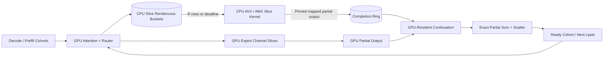
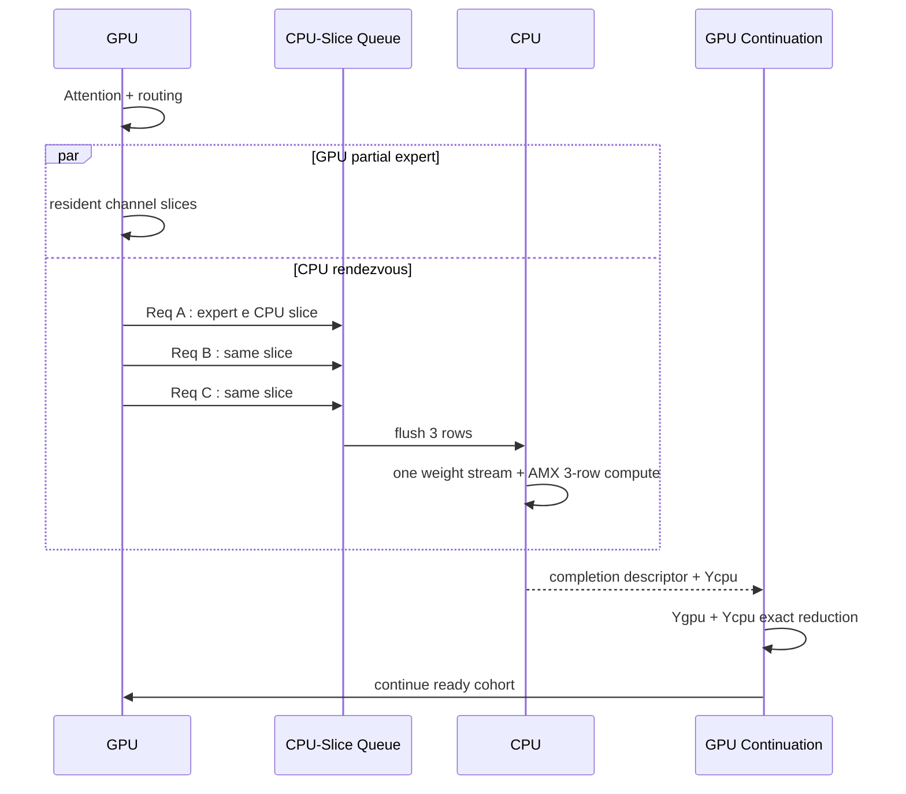
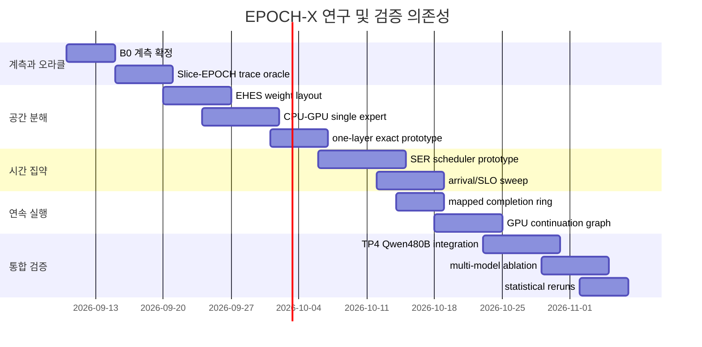

# EPOCH-X: CPU를 실제 연산자로 만드는 CPU·GPU 동시 실행 연구 설계

## 핵심 결론

업로드한 EPOCH 실험 이력과 최종 성능 기록을 다시 해석하면, 지금까지의 실패는 단순히 **“CPU가 GPU보다 느리기 때문”**이 아니다. 더 정확하게는 **현재 CPU에 주어진 연산의 단위가 CPU에 맞지 않았고, CPU가 유용한 계산을 많이 할수록 오히려 동일한 expert weight를 DRAM에서 반복 스트리밍하며 임계 경로를 늘리는 구조**였기 때문이다. Qwen3-Coder-480B 환경에서 decode CPU 시간의 약 88%가 cold expert weight streaming이고, 소켓당 실측 약 214 GB/s로 이미 DRAM 대역폭의 상당 부분을 소비한다. 반면 expert당 행 수는 대개 매우 작아서 AMX 계산 자원 자체는 충분히 활용되지 않는다. 전역 AMX 전환이 1–2행 타일 패딩 때문에 오히려 약 7% 손해였고, 행 수 기반 AMX/AVX 선택은 C96에서 약 8% 이득을 냈다는 결과가 이 현상을 직접 보여준다. fileciteturn0file0

특히 중요한 점은 현재 최고 성능인 **C224 1,110.3 tok/s**가 캠페인 시작점 56.3 tok/s의 19.7배에 달하지만, 이 개선의 대부분은 CPU에 더 많은 연산을 시켜 얻은 것이 아니라 hot expert를 GPU로 옮기고, KV를 줄여 concurrency를 확대하고, CPU가 읽어야 할 cold bytes와 동기화 비용을 줄이며 얻은 것이다. CPU queue는 거의 항상 바쁘지만 작업의 대부분이 weight streaming이고, AMX가 원하는 “한 weight read로 여러 행을 계산하는 상황”은 충분히 만들어지지 않았다. fileciteturn0file0 fileciteturn0file1

따라서 다음 논문의 연구 질문은 **“CPU utilization을 어떻게 더 높일까?”가 아니라 “CPU가 DRAM에서 expert weight를 한 번 읽을 때 몇 개의 유용한 행을 계산하게 하고, 그 계산을 GPU의 임계 경로와 어떻게 정확하게 겹칠까?”**여야 한다. KTransformers 자체도 CPU의 AMX 최적화와 비동기 CPU–GPU scheduling, Expert Deferral을 통해 성능을 높였고, SOSP 2025 논문에서 CPU–GPU synchronization과 CPU computation을 핵심 병목으로 규정했다. citeturn12search6 최근 CoX-MoE 역시 작은 micro-batch로 expert 실행을 쪼개면 operational intensity가 떨어져 memory-bound가 된다는 같은 문제를 지적하고, batch 전체의 expert 요청을 coalesce하는 방향을 택했다. citeturn11academia46turn19search5

제가 권하는 논문의 중심 아이디어는 다음과 같다.

> **EPOCH-X: expert를 더 이상 “한 CPU 또는 한 GPU가 전부 계산하는 원자적 객체”로 취급하지 않고, SwiGLU intermediate channel을 정확하게 분할하여 CPU와 GPU가 같은 expert를 동시에 계산한다. CPU 쪽 slice만 여러 독립 요청에 걸쳐 짧게 rendezvous하여 한 번의 DRAM weight stream으로 여러 행을 처리하고, 완료 신호는 GPU-resident continuation graph가 직접 소비한다.**

즉 세 가지 축이다.

| 핵심 기법 | CPU가 실제 수행하는 연산 | 해결하려는 EPOCH 병목 | 예상 독립 효과* | 신규성 위험 |
|---|---|---|---:|---|
| **Exact Heterogeneous Expert Slicing, EHES** | 같은 expert의 SwiGLU channel 일부를 CPU INT4 AVX/AMX로 계산 | all-or-nothing hot/cold placement, CPU weight bytes, CPU/GPU makespan 불균형 | +5~18% | 낮음~중간 |
| **Slice-EPOCH Rendezvous, SER** | CPU slice의 여러 요청 행을 모아 동일 weight로 GEMM/GEMV | rows/read 1.34, 1–2행 AMX 비효율 | +7~20% | 중간 |
| **GPU-Resident Continuation, GRC** | CPU 결과가 도착하면 GPU가 host round-trip 없이 merge/후속 실행 | 층당 약 130 µs의 잔여 고정비, barrier | +3~7% | 중간 |
| 통합 **EPOCH-X** | CPU slice를 지속적으로 계산하면서 GPU가 나머지 slice와 dense path 수행 | 세 병목을 동시에 제거 | **+15~30% 목표** | 논문 핵심 |

\*이 수치는 측정 결과가 아니라 **현재 EPOCH profile을 이용해 정한 연구 가설 및 실험 목표**다. 현 C224 1,098~1,110 tok/s에서 +15~30%라면 약 **1,260~1,440 tok/s**가 1차 논문 목표 구간이다. TPOT를 악화시켜 throughput만 올리는 방식은 이미 EPOCH 고동시성 실험에서 한계가 드러났으므로, 기본 게이트는 **동일 정확도, 동일 메모리 예산, TPOT p99 증가 ≤5%**로 두는 것이 바람직하다. fileciteturn0file0

중요한 신규성 판단도 미리 명확히 해야 한다. **단순 expert coalescing, asynchronous layer scheduling, CPU/GPU expert assignment, neuron-level placement는 이미 선행연구가 강하다.** CoX-MoE는 batch 단위 expert coalescing을 사용하고, AMoE/AEP는 layer별 queue와 adaptive re-batching으로 barrier를 없애며, Kairox는 neuron 단위의 동적 CPU/GPU balancing을 한다. citeturn11academia46turn18academia14turn11search3 따라서 논문의 신규성은 **“같은 expert의 정확한 channel-wise CPU/GPU 동시 계산 + CPU slice만을 위한 weight-stationary temporal rendezvous + CPU 완료를 GPU-side continuation으로 직접 연결”**이라는 결합에 두어야 한다. 2026년 9월 1일 공개된 PCoMoE도 whole-expert abstraction을 깨고 path-level composition을 제안했기 때문에, 단순히 “expert를 쪼갠다”라는 주장으로는 부족하다. citeturn16academia17

## EPOCH 실험에서 확인된 실패 구조와 병목

지금까지의 로그를 보면 실패 사례들이 서로 달라 보이지만, 실제로는 거의 모두 **계산 단위, 데이터 이동 단위, 동기화 단위가 맞지 않는 문제**로 환원된다.

**CPU attention 계열의 실패는 의존성 문제였다.** IDE_006/NEO 이식에서 cold KV에 대한 CPU partial attention은 CPU가 실제 수치 연산을 했지만, 필요한 Q가 해당 layer의 QKV projection 이후에야 생기므로 약 6.4 ms CPU partial attention을 약 0.6 ms GPU hot-attention window에 숨길 수 없었다. 실제 통합 검증에서는 CPU 계산 결과의 merge 활용률이 0%였고 vanilla보다 2.1~4.1배 느렸다. 즉 계산량을 CPU에 줬지만 **CPU 연산이 GPU보다 먼저 시작할 수 없고 GPU가 CPU 결과를 기다려야 한다면, CPU utilization 증가는 곧 critical-path 증가**가 된다. fileciteturn0file1 NEO 자체는 일부 decode attention과 KV를 CPU로 옮기고 GPU와 비대칭 pipeline을 만들어 T4/A10G/H100에서 이득을 보고했지만, 그 효과는 GPU 메모리 압박과 CPU/GPU 상대 속도에 크게 의존한다. citeturn20academia24 HGCA와 HybridGen도 CPU가 long-context attention을 직접 계산하는 방향을 발전시켰지만 sparse attention 또는 CXL을 포함한 다른 계산·메모리 조건을 사용한다. citeturn20academia25turn20academia26

**MoE CPU expert 연산은 계산 자체가 아니라 weight stream이 병목이다.** IDE_023 이후 CPU는 INT4 expert를 자기 DRAM에서 읽어 AMX/AVX로 직접 계산하고 있으므로 사용자가 요구한 “CPU가 적극적 연산자”라는 조건에는 정확히 부합한다. 문제는 decode에서 한 expert가 대개 1~수 행밖에 받지 않아, 많은 수의 weight bytes를 읽어 놓고 적은 MAC만 수행한다는 것이다. 최종 profile에서 cold expert 24개의 1행 decode 시 CPU expert 구간의 약 88%가 streaming이고 소위상은 약 11%였다. AVX register blocking과 prefetch로 1행 expert를 75→66 µs로 줄였지만 e2e 개선 폭은 제한적이었다. fileciteturn0file0 Fiddler 역시 weight 전체를 PCIe로 GPU에 보내기보다 activation을 CPU에 보내고 CPU에서 expert를 계산하는 것이 작은 batch에서는 유리할 수 있음을 보였고, KTransformers는 이를 훨씬 고성능 AMX kernel과 asynchronous scheduling으로 발전시켰다. citeturn15academia48turn12search6

이를 간단한 모델로 쓰면 현재 CPU cold-expert 시간은 대략

\[
T_{\mathrm{CPU}}
\simeq
T_{\mathrm{fixed}}
+
\frac{B_{\mathrm{weight}}}{BW_{\mathrm{DDR}}}
+
\frac{F_{\mathrm{expert}}}{P_{\mathrm{CPU}}}.
\]

현재 decode에서는 두 번째 항이 지배적이다. 따라서 AMX peak FLOPS를 더 끌어올리는 것보다 먼저 줄여야 하는 것은 \(B_{\mathrm{weight}}/\text{useful row}\)이다. EPOCH가 원래 세웠던 **“한 weight read당 2~4행”** 목표는 이 의미에서 매우 올바른 목표였다. 다만 기존 방식은 자기회귀 의존성 때문에 동일 요청의 미래 token을 미리 묶을 수 없었다. 실제 trace oracle에서 읽기당 행 중앙값이 1에 가깝고, 현실화된 고동시성 버전에서도 평균적 지표가 약 1.1→1.34 정도만 증가했다. fileciteturn0file0

**투기 디코딩은 “행을 늘리면 빨라진다”는 충분조건이 아니라는 것을 보여줬다.** EAGLE3는 verifier 쪽 행을 약 4배 만들 수 있었지만, cold slot이 서로 다른 expert에 흩어져 C160에서 27%, C64에서 38%가량 성능이 하락했다. 즉 batch size가 아니라 **동일 `(layer, expert, weight block)`에 모인 유효 행 수**가 중요한 변수다. fileciteturn0file0 이것은 CoX-MoE가 micro-batch fragmentation 때문에 expert execution의 operational intensity가 낮아진다고 보고한 관찰과 일치한다. citeturn11academia46

**all-or-nothing expert placement도 현재 구조의 중요한 제한이다.** hot-64→80→96으로 갈수록 CPU가 스트리밍해야 할 cold bytes가 크게 줄며 성능이 올랐지만, hot-88/80으로 GPU expert 수를 줄이고 KV/cache 여유를 늘려 C192/C256을 시도했을 때는 CPU bytes 증가가 concurrency 이득을 상쇄했다. GPU 메모리도 최종 구성에서 약 78.9/80 GB까지 사용하고 있어 hot expert와 KV/cache 사이의 배분이 사실상 discrete한 cliff를 만든다. fileciteturn0file0 HybriMoE와 CoX-MoE는 CPU/GPU expert assignment 및 workload allocation을 동적으로 또는 정적으로 최적화하지만 기본 단위는 여전히 주로 expert이다. citeturn12academia48turn11academia46

**동기화 비용은 이미 무시할 수준이 아니다.** callback-free handoff와 빈 immediate 제거, 비-worker core 재배치로 층당 고정비가 126→77 µs까지 줄었고, gather+quantization fusion으로 C224에서 추가 약 3%를 얻었지만 최종 profile에는 여전히 약 130 µs/layer, 전체의 약 8%에 해당하는 고정 비용이 남아 있다. fileciteturn0file0 이 8%를 전부 제거한다고 가정한 Amdahl-style 상한은

\[
S_{\max}=\frac{1}{1-0.08}\approx 1.087,
\]

즉 약 **8.7%**다. 따라서 host handoff 개선만으로는 논문의 주 기여가 되기 어렵지만, 새로운 CPU 연산 알고리즘의 이득이 다시 barrier에 묻히지 않게 하는 필수 보조 기법은 될 수 있다.

병목을 시스템 차원에서 정리하면 다음과 같다.

| 병목 | EPOCH에서 관찰된 증거 | 현재 해석 | 새 설계에 요구되는 조건 |
|---|---|---|---|
| CPU compute | 1–2행에서 전역 AMX 전환 −7%, 행 기반 선택 +8% | AMX 성능 부족보다 **행 수 부족** | CPU batch를 AMX-friendly shape로 만들 것 |
| DRAM bandwidth | decode expert 시간의 약 88% streaming, 소켓당 약 214 GB/s | 주 병목 | weight read당 유용 행 증가 또는 CPU weight bytes 감소 |
| PCIe | TriX pageable 경로 약 7.3 GB/s, 약 800 µs/expert | 현재 측정은 pageable staging이라 upper bound가 아님 | pinned microbench는 필요하지만 weight 이동형 설계는 피할 것 |
| GPU memory | 최종 약 78.9/80 GB | expert/KV 사이 discrete trade-off | expert를 fractional하게 배치 |
| synchronization | callback-free 후에도 약 77~130 µs/layer급 고정비 | e2e의 수%~8% | CPU 완료를 host global barrier 없이 소비 |
| kernel launch | CUDA graph bucket 축소가 C192/C224 가능하게 함 | 일반 launch는 이미 상당 부분 최적화됨 | 새로운 scheduler가 graphability를 파괴하면 안 됨 |
| scheduling | 기존 EPOCH 동일-request 병합 불가 | autoregression 자체는 우회 불가 | **독립 요청**과 **독립 channel slice**를 이용 |
| NUMA | 잘못된 pinning이 과거 최대 115× 붕괴를 초래 | 성능과 correctness에 가까운 1급 변수 | GPU↔socket locality를 scheduler 상태에 포함 |
| cache/TLB | huge page는 e2e 효과 0, AMX B-cache도 serving 효과 미미 | cache-only 연구는 약함 | cache가 아니라 DRAM traffic 자체를 줄여야 함 |

이 표의 실험 수치는 업로드된 기록에 근거한다. fileciteturn0file0 fileciteturn0file1 하드웨어 측면에서도 Xeon Platinum 8480+는 소켓당 56코어, 8개 메모리 채널, 2DPC에서 DDR5-4400을 지원하고 2소켓 구성을 지원하므로, 현재 장비의 병목을 “코어 수 부족”보다 메모리 경로와 NUMA locality 관점에서 보는 것이 타당하다. citeturn13search3 H100은 모델에 따라 GPU HBM bandwidth가 TB/s 급인 반면 CPU DRAM은 훨씬 낮으므로, 동일한 low-arithmetic-intensity operator를 단순 반분하는 방식은 구조적으로 CPU 쪽을 critical path로 만들기 쉽다. NVIDIA의 H100 SXM 공식 사양은 80 GB 메모리와 3.35 TB/s GPU memory bandwidth를 명시한다. citeturn13search0

PCIe/NVLink에 대해서도 중요한 경계가 있다. DirectKV는 OSDI 2026에서 GH200/GB200의 NVLink-C2C를 이용해 GPU가 CPU-resident KV를 직접 읽도록 하여 GPU staging buffer와 전송량을 줄였고, GH200에서 최대 1.2배 e2e 향상을 보고했다. 그러나 논문 자체가 고대역폭 NVLink-C2C를 전제로 하고 있으므로, 현재의 PCIe 기반 H100 host 경로에 그 결과를 그대로 적용해서는 안 된다. citeturn14search0 따라서 TriX는 논문 주축보다는 **“PCIe와 C2C에서 제안 시스템의 적용 경계가 어디인가”를 밝히는 보조 실험**으로 두는 것이 더 가치 있다.

## 선행 연구와 신규성 경계

2026년 9월 9일 기준으로 CPU와 GPU가 동시에 LLM 계산에 참여하는 연구 공간은 이미 상당히 붐비고 있다. 특히 “CPU도 expert를 계산한다”, “hot expert를 GPU에 둔다”, “dynamic CPU/GPU assignment를 한다”, “small expert batches를 합친다” 정도로는 신규성 주장이 어렵다.

| 연구 계열 | 대표 연구 | CPU의 역할 | 본 연구가 그대로 하면 중복되는 부분 |
|---|---|---|---|
| **whole-expert CPU compute** | Fiddler | GPU에 없는 expert를 CPU가 직접 계산 | activation만 이동하고 CPU에서 expert 계산하는 발상 자체 citeturn15academia48 |
| | KTransformers, SOSP 2025 | AMX expert kernel, async CPU/GPU scheduler, Expert Deferral | AMX/AVX kernel, deferral, 일반 비동기 scheduling citeturn12search6 |
| | HybriMoE, DAC 2025 | dynamic intra-layer CPU/GPU expert scheduling, prefetch/cache | expert-level dynamic assignment citeturn12academia48 |
| | CoX-MoE, DAC 2026 | AMX CPU/GPU co-execution, batch expert coalescing, static stratification | whole-batch expert coalescing, hot/cold expert stratification citeturn11academia46 |
| **neuron/fine-grained placement** | PowerInfer | hot neuron GPU, cold neuron CPU | 단순 neuron-level CPU/GPU 분배 citeturn13academia48 |
| | Kairox, OSDI 2026 | online neuron balancing, live prefetch/cache | dynamic fine-grained placement만 하는 방법 citeturn11search3 |
| **expert 내부 분해** | MoEShard | expert matrix를 row/column-wise GPU shard로 분해 | “expert도 tensor-shard할 수 있다”는 사실 자체 citeturn17search2 |
| | PCoMoE, 2026-09 | expert를 path-level로 재구성·prune | whole-expert abstraction을 깨는 일반 주장 citeturn16academia17 |
| **temporal/module batching** | MoE-Gen | module별로 token을 모아 큰 GPU batch 실행 | 단순 module batching citeturn17academia45 |
| | AMoE/AEP | layer별 μ-queue, adaptive re-batching, barrier 제거 | 일반 asynchronous layer queue/rebatch citeturn18academia14 |
| **CPU attention** | NEO | decode attention과 KV를 CPU에서 직접 계산 | CPU attention offload/pipeline 자체 citeturn20academia24 |
| | HGCA / HybridGen | GPU dense + CPU sparse/collaborative attention | CPU/GPU attention split 자체 citeturn20academia25turn20academia26 |
| **CPU의 다른 적극적 연산** | Toppings, ATC 2025 | GPU가 LoRA adapter를 load하는 동안 CPU가 LoRA 계산 | “GPU 대기 중 CPU가 다른 수치 연산 수행”이라는 일반 overlap 개념 citeturn11search0 |
| **memory/I/O 중심** | FlexGen, MoE-Lightning | CPU/DRAM/disk memory 계층 및 pipeline 활용 | 단순 offload/prefetch/LP planner citeturn15search3turn15academia47 |
| | DirectKV, OSDI 2026 | CPU DRAM에 KV 저장, GPU가 C2C로 직접 접근 | CPU memory를 GPU 확장 메모리로 쓰는 것; 사용자가 원하는 active CPU compute와는 다름 citeturn14search0 |

이 지형에서 **단순 “expert-friendly admission”, “같은 expert를 모아서 AMX로 계산”, “layer를 비동기화한다”는 단독 제안은 논문 핵심으로 사용하면 위험하다.** CoX-MoE가 이미 ordinary batch 단위의 coalesced expert execution을 하고 있고, AMoE는 layer-specific queue에서 token을 다시 batch하며, MoE-Gen은 module-specific batching을 한다. citeturn11academia46turn18academia14turn17academia45

반면 제가 조사한 범위에서 상대적으로 비어 있는 공간은 다음 조합이다.

**첫째, 하나의 SwiGLU expert를 intermediate channel 차원으로 분해하여 CPU와 GPU가 정확히 동시에 계산하고, 같은 expert invocation의 output을 합치는 구조.** MoEShard가 유사한 수학적 분할을 GPU들 사이에서 수행하고 있고 PCoMoE가 더 미세한 path composition을 제시했기 때문에 “matrix sharding” 자체가 신규성은 아니다. citeturn17search2turn16academia17 그러나 현재 조사한 KTransformers, HybriMoE, CoX-MoE의 핵심 설명은 CPU/GPU 사이에서 expert/workload를 배치·스케줄링하는 것이며, **현재 EPOCH처럼 CPU DRAM bandwidth가 임계인 시스템에서 하나의 expert 내부 channel을 CPU/GPU로 fractional하게 나누어 CPU weight bytes와 GPU VRAM을 연속적인 최적화 변수로 만드는 것**은 논문 기여 후보가 된다. citeturn12search6turn12academia48turn11academia46

**둘째, temporal batching을 whole expert가 아니라 “CPU에 배치된 channel slice”에만 적용하는 구조다.** GPU slice는 현재 요청에 대해 즉시 실행하되 CPU slice만 `(layer, expert, slice)` queue에 짧게 모으고, 충분한 rows 또는 deadline에서 한 번에 AMX로 계산한다. 이는 AMoE의 general layer asynchrony 및 CoX-MoE의 ordinary-batch expert coalescing과 명백히 비교해야 하지만, CPU DRAM weight stream과 AMX tile occupancy를 직접 최적화한다는 목적 함수가 다르다. citeturn18academia14turn11academia46

**셋째, 이 CPU partial output을 host가 다시 global batch barrier로 수거하는 대신 GPU-side continuation으로 연결하는 것이다.** 최신 CUDA는 device-launchable graphs와 device-side conditional graph nodes를 지원하며, graph의 memcpy는 pinned device-mapped host memory를 사용할 수 있다. 따라서 적어도 API 관점에서는 CPU completion ring과 GPU-side control flow를 결합하는 것이 가능한 설계 공간이다. 다만 device graph와 conditional node에는 single-device, node type, concurrent launch 등 여러 제약이 있으므로 TP=4에서는 rank별 graph + 기존 collective 구조를 보존해야 한다. citeturn12search0

따라서 논문의 신규성 문장은 **“CPU와 GPU를 동시에 썼다”가 아니라 “heterogeneous MoE execution의 scheduling atom을 expert에서 exact channel slice로 낮추고, 그 slice에 temporal aggregation과 device-resident continuation을 결합했다”**가 되어야 한다.

다만 이것은 **2026년 9월 9일 현재 수행한 문헌 검색에 근거한 provisional novelty assessment**이지, 절대적인 선행연구 부재 증명은 아니다. 특히 2026년 9월 1일 공개된 PCoMoE처럼 매우 최근 논문이 계속 추가되고 있으므로 submission 직전에는 “intra-expert CPU-GPU”, “heterogeneous tensor sharding”, “channel-wise MoE co-execution”, “partial expert serving” 키워드에 대한 최종 신규성 sweep이 필요하다. PCoMoE의 공개 시점과 내용상 이 검사는 특히 중요하다. citeturn16academia17

## 제안하는 EPOCH-X 알고리즘

**제안 A — Exact Heterogeneous Expert Slicing, EHES**

현재 expert placement는 본질적으로 이산적이다. 어떤 expert \(e\)는 GPU에 완전히 들어가고, 나머지는 CPU에 완전히 남는다. EHES에서는 SwiGLU의 intermediate dimension \(h\)를 channel block 단위로 나눈다.

일반적인 SwiGLU expert를

\[
u=xW_u,\qquad
g=\mathrm{SiLU}(xW_g),\qquad
z=u\odot g,\qquad
y=zW_d
\]

라고 하자. intermediate channel index를 서로 겹치지 않는 \(J_G\)와 \(J_C\)로 분리하면

\[
z=[z_{J_G},z_{J_C}]
\]

이고 down projection의 선형성 때문에

\[
y
=
z_{J_G}W_{d,J_G}
+
z_{J_C}W_{d,J_C}
=
y_G+y_C.
\]

따라서 GPU에는 \(W_u[:,J_G]\), \(W_g[:,J_G]\), \(W_d[J_G,:]\)를 두고 CPU에는 complement를 둔다. GPU와 CPU가 **같은 token의 같은 expert를 동시에 계산**하고 마지막에 두 partial output을 더하면 된다.

이는 approximation이 아니다. 같은 quantized logical weights를 양쪽에서 사용하는 한 수학적으로 원래 expert와 동일하다. 다만 CPU와 GPU의 accumulation order가 달라 bitwise equality까지 자동으로 보장되지는 않으므로, 논문에서는 정확성을 “동일 quantized weights + numerical/logprob equivalence”로 검증해야 한다. 현재 실험에서도 kernel patch의 bit equality, per-token logprob/PPL 비교를 이미 수행해왔으므로 그 검증 방법을 그대로 확장할 수 있다. fileciteturn0file0

이 방식의 핵심은 CPU/GPU 비율 \(\rho_e\)가 이제 0 또는 1이 아니라

\[
0\le \rho_e\le1
\]

가 된다는 것이다. GPU에 expert \(e\)의 \(\rho_e\) 비율 channel을 둔다면 CPU가 읽는 expert bytes는 대략 \((1-\rho_e)\)배로 줄어든다. GPU expert memory budget은

\[
\sum_e \rho_e |W_e| \le M_{\mathrm{expert,GPU}}
\]

로 제한한다.

현재 최적화 문제는 “어떤 96개 expert를 GPU에 둘 것인가?”인데, EHES에서는

\[
\min_{\rho}
\sum_l
\max \left[
T^{(l)}_G(\rho,\mathbf m),
T^{(l)}_C(1-\rho,\mathbf m)
\right]
+
T_{\mathrm{merge}}
\]

로 바뀐다. 여기서 \(\mathbf m\)은 routing trace에서 관찰된 expert별 row count다. 목표가 평균 CPU utilization이 아니라 **CPU와 GPU 중 더 늦게 끝나는 쪽의 makespan을 줄이는 것**이라는 점이 중요하다.

현재 hot-96에서 GPU memory가 거의 꽉 차더라도 EHES는 추가 메모리를 요구하는 아이디어가 아니다. 예를 들어 “96개 full expert”에 쓰던 동일한 총 VRAM을 “80개 full + 나머지 인기 expert의 일부 channel”로 재분배할 수 있다. 기존 hot-88/80+C256 실험에서 CPU cold bytes 증가가 KV 증가의 이점을 상쇄한 이산적 cliff를 fractional placement가 완화하는 것이 첫 번째 검증 가설이다. fileciteturn0file0

```text
Algorithm EHES_Placement(trace, gpu_budget, block_size):

    for each layer l and expert e:
        estimate route histogram m[l,e]
        benchmark:
            cpu_time[l,e,b](rows)    # b = channel block
            gpu_time[l,e,b](rows)
            merge_time[rows]

    candidate_blocks = all (l, e, b)

    initialize all blocks on CPU
    remaining_gpu_memory = gpu_budget

    while remaining_gpu_memory >= one_block:
        for each CPU block b:
            benefit[b] =
                predicted_global_makespan_without_b
                - predicted_global_makespan_if_b_on_GPU

        b_star = argmax benefit[b] / bytes[b]

        if benefit[b_star] <= 0:
            break

        replicate_or_move b_star to GPU
        remaining_gpu_memory -= bytes[b_star]

    return per-expert GPU channel masks rho[l,e]
```

runtime은 더 단순하다.

```text
for each routed expert e with row batch X:

    parallel:
        GPU:
            Yg = SwiGLU_slice(X, Wg[e, gpu_channels])

        CPU:
            Yc = SwiGLU_slice(X, Wc[e, cpu_channels])

    Y = Yg + transfer(Yc)
    scatter_and_weight(Y)
```

원래 expert의 계산 복잡도가 \(O(md h)\)라면 EHES도 총 FLOPs는 \(O(md h)\)로 동일하다. 추가 연산은 partial output 합산 \(O(md)\)뿐이다. GPU VRAM은 선택한 channel fraction만큼 소비하고, CPU DRAM에는 안전하게 full copy를 유지해도 현재 2 TB 환경에서는 capacity 문제가 크지 않다. CPU→GPU로 되돌리는 값도 weight가 아니라 \(m\times d\) partial activation이므로 Fiddler/KTransformers가 활용하는 “weight 대신 activation 이동”의 장점을 유지한다. CPU에서 expert를 계산해 weight PCIe transfer를 피하는 것이 Fiddler의 핵심 발상이기도 하다. citeturn15academia48

가장 큰 실패 모드는 GPU slice 계산이 dense/attention GPU work와 경쟁하여 CPU 절감보다 GPU critical path를 더 늘리는 경우다. 또 INT4 CPU layout을 arbitrary channel slice로 나누면 AMX packing 효율이 떨어질 수 있다. 따라서 channel block은 128/256/512 단위의 tile-aligned block으로 제한하고, GPU에서도 동일한 quantized logical weight를 계산할 수 있는 slice-friendly kernel을 먼저 microbenchmark해야 한다.

**EHES의 연구 성공 기준**은 단일 expert microbenchmark에서 동일 VRAM budget하에 all-or-nothing placement 대비 예측 makespan을 15% 이상 줄이고, e2e C64~C160에서 최소 8~10%가량의 gain을 보여주는 것이다. C224에서는 GPU 부하가 더 높으므로 예상 효과를 5~12% 정도로 더 보수적으로 둔다. 이 범위는 현재 profile로부터 세우는 가설이며 측정값이 아니다. fileciteturn0file0

**제안 B — Slice-EPOCH Rendezvous, SER**

EHES만으로 CPU bytes는 줄지만, CPU에 남은 slice는 여전히 1–2행씩 읽히면 memory-bound다. SER의 목적은 EPOCH의 원래 목표였던 **weight read당 row 수 증가**를 자기회귀 의존성을 깨뜨리지 않고 달성하는 것이다.

기존 EPOCH는 동일 요청의 다음 decode token을 미리 얻을 수 없으므로 시간축으로 merge할 수 없었다. SER에서는 **미래 token을 예측하지 않는다.** 서로 독립인 현재 inflight request/cohort에서 동일 `(layer, expert, CPU-slice)`를 요구하는 activation만 rendezvous한다. 한 request 내 의존성은 그대로 유지하므로 결과는 정확하다.

더 중요한 차이는 whole expert를 기다리지 않는다는 것이다. GPU slice \(J_G\)는 즉시 실행하고, CPU slice \(J_C\)만 짧은 deadline queue로 들어간다. 이렇게 하면 CPU의 expensive weight stream만 aggregation 대상으로 삼을 수 있다.

```text
state Bucket[l][e][slice]:
    rows
    request_ids
    arrival_times
    deadline

on_route(req, layer l, expert e, x):

    launch_gpu_slice(req, l, e, x)

    for each CPU slice s of e:
        Bucket[l][e][s].append(req, x)

        R = adaptive_row_target(l, e, s)

        if Bucket.rows >= R:
            flush(Bucket)
        else if oldest_wait(Bucket) >= W_max:
            flush(Bucket)
        else if request_deadline_near(req):
            flush(Bucket)

flush(B):

    m = B.rows

    if m >= AMX_THRESHOLD:
        Ycpu = AMX_INT4_slice(B.X)
    else:
        Ycpu = AVX512_INT4_slice(B.X)

    publish_completion(B.request_ids, Ycpu)
```

현재 실험에서는 1–2행에서 AMX tile padding이 손해였고, 행 기반 AMX/AVX 선택이 이득이었다. 따라서 초기 설정은 **\(R=3\)** 을 우선 실험하는 것이 논리적이다. 즉 SER는 단순 batching이 아니라 **“CPU weight stream을 한 번 시작할 거라면 최소한 AMX가 유리해지는 수준의 행을 확보한다”**는 실행 정책이 된다. fileciteturn0file0

SER의 중요한 scheduling state는 다음 세 값이다.

\[
R_{l,e}: \text{목표 행 수}, \qquad
W_{l,e}: \text{최대 rendezvous wait}, \qquad
S: \text{허용 cohort/layer skew}.
\]

저부하에서는 같은 expert 요청이 잘 모이지 않으므로 \(W\to0\)로 내려 즉시 실행해야 한다. 부하가 높고 routing collision이 많을수록 \(R=3,4,8\)까지 높여 AMX execution을 사용한다. 현재 이미 구축한 IDE_031 성능 모델이 실측 trace를 넣었을 때 configuration ranking을 잘 맞춘 기록이 있으므로, 완전히 새로운 RL scheduler보다는 그 모델을 online controller의 초기 cost model로 재사용하는 것이 구현 위험이 작다. fileciteturn0file1

CPU slice의 한 flush에서 \(m\)행을 계산한다면 weight traffic 관점의 arithmetic intensity는 대략

\[
AI_{\mathrm{CPU}}
\propto
\frac{m\cdot \text{FLOPs/row}}
{|W_{\mathrm{slice}}|}.
\]

즉 현재 rows/read 1.34에서 2.0이면 약 1.49배, 2.5면 약 1.87배만큼 weight byte당 useful work가 증가한다. 이는 CPU의 peak AMX 성능을 새로 만드는 것이 아니라 **현재 놀고 있는 계산 성능을 이미 지불 중인 DRAM stream에 얹는 것**이다.

SER가 반드시 비교해야 할 강력한 선행연구가 AMoE와 CoX-MoE다. AMoE는 layer별 μ-queue를 두고 token을 adaptive re-batching하여 barrier를 제거하며 최대 2.7배의 throughput 개선을 보고했다. citeturn18academia14 CoX-MoE는 micro-batch 단위 expert 실행 대신 batch 전체 요청을 coalesce하여 weight reuse와 operational intensity를 높인다. citeturn11academia46 따라서 논문에서 SER의 차별점은 **“re-batching 자체”가 아니라 GPU와 CPU가 같은 expert를 slice로 나눈 상태에서 CPU-resident slice만 weight-stationary epoch로 rendezvous하며, GPU partial은 즉시 실행하고 request-level SLO deadline을 유지하는 것**이어야 한다.

실패 모드는 명확하다. 저부하에서는 queue wait가 TPOT만 올린다. routing entropy가 높으면 같은 slice collision이 거의 없어 이득이 사라진다. layer-skew로 GPU cohort가 너무 작아지면 CUDA graph 및 grouped kernel 효율을 잃는다. 따라서 SER는 항상 `W=0` 즉시-flush fallback을 가져야 하고, offline trace oracle에서 **TPOT p99 +5% 이내라는 조건으로 rows/read가 최소 1.7~2.0까지 오르지 않으면 구현을 중단**하는 것이 좋다.

**제안 C — GPU-Resident Continuation, GRC**

EHES와 SER가 성공하면 기존 구조보다 CPU completion event가 더 fine-grained해진다. 이를 매번 Python/C++ host scheduler가 수거하고 CUDA work를 재-launch하면 기존 SHWG에서 확인한 고정비가 다시 커진다. 따라서 세 번째 기법은 CPU computation이 완료된 이후의 control path를 GPU 쪽으로 밀어 넣는 것이다.

구조는 pinned, device-mapped completion ring을 사용한다.

```text
CPU:
    compute Ycpu for one slice epoch
    write Ycpu into pinned output buffer
    store_release(completion_ring[slot].ready = 1)

GPU persistent continuation:
    while active:
        slot = probe_completion_ring()

        if slot.ready:
            acquire(slot)
            reduce(Ygpu[slot], Ycpu[slot])
            scatter_route_weight(slot)
            mark_request_cohort_ready(slot)

            if next graph bucket is ready:
                device_launch(next_graph)
```

CUDA의 현재 Programming Guide는 device graph launch를 지원하며, conditional graph node는 조건에 따라 graph body를 device에서 선택할 수 있다. 또한 device-launchable/conditional graph의 memcpy는 device memory와 pinned device-mapped host memory를 사용할 수 있다. 다만 graph structure는 사전에 고정되어야 하고 single-device 제약 및 device launch의 동시 실행 제한이 있으므로, TP=4 전체를 하나의 거대한 device graph로 만드는 것보다 **rank-local continuation graph + 기존 TP collective boundary**로 설계해야 한다. citeturn12search0



GRC는 CPU를 대체하는 기법이 아니다. CPU는 여전히 실제 expert numerical computation을 수행하고, GRC는 **CPU가 계산한 partial result를 GPU가 가능한 한 빨리 소비하게 하는 synchronization substrate**다.

현재 약 8%가 residual fixed overhead라면 완전 제거의 이론적 상한은 약 +8.7%이고, 실제 목표는 +3~7%가 현실적이다. fileciteturn0file0 persistent polling이 SM 자원을 잡아먹거나 PCIe read transaction을 과도하게 발생시키면 오히려 느려질 수 있으므로, `1/2/4 persistent blocks`, completion batching, exponential backoff를 microbenchmark해야 한다.

세 기법을 하나로 합치면 execution timeline은 다음처럼 된다.



이 그림이 논문의 핵심 주장이다. **기존 시스템은 “token을 expert에 보내 CPU 또는 GPU가 계산”한다. EPOCH-X는 “한 expert를 공간적으로 CPU/GPU slice로 분해하고, CPU slice는 시간적으로 여러 독립 요청을 coalesce하며, 완료는 다시 host barrier로 돌아가지 않는다.”**

세 기법의 위험과 기대효과를 보다 보수적으로 정리하면 다음과 같다.

| 기법 | 구현 난이도 | 기대 효과 | 가장 중요한 mechanism metric | 즉시 기각 조건 |
|---|---:|---:|---|---|
| EHES | 높음 | C64~160 +8~18%, C224 +5~12% 가설 | CPU expert bytes/token, CPU/GPU makespan | split microbench가 best atomic보다 <5% 개선 |
| SER | 중~높음 | 추가 +7~20% 가설 | rows/weight-read, AMX-eligible rows | TPOT +5% 조건에서 rows/read <1.7 |
| GRC | 중~높음 | +3~7% 가설 | handoff µs/layer, host wakeups | handoff 30 µs 이상 감소 실패 또는 GPU loss >1% |
| 통합 | 매우 높음 | **+15~30%** 연구 목표 | e2e throughput/SLO goodput | 현재 최강 baseline 대비 <10% |

## 검증 실험 설계

**기본 하드웨어 가정.** 주 실험기는 업로드된 환경 그대로 **H100 80 GB ×4, TP=4, Xeon Platinum 8480+ ×2, 96 CPU worker threads, dual NUMA socket, DDR5-4400, CPU–GPU host path는 NVLink-C2C가 없는 PCIe 계열**로 둔다. fileciteturn0file0 Intel 공식 사양상 8480+는 소켓당 56코어·112스레드, 8 memory channels, DDR5-4400 2DPC를 지원한다. citeturn13search3 GPU-GPU NVLink topology는 노드 구성에 따라 달라질 수 있으므로 실험 metadata에 실제 topology를 기록해야 하며, CPU–GPU C2C가 있다는 가정은 하지 않는다. NVIDIA H100 공식 제품군은 SXM에서 80 GB와 900 GB/s GPU-GPU NVLink, PCIe Gen5 인터페이스를 제공하지만 이 수치를 현재 host CPU↔GPU 실효 대역폭으로 간주해서는 안 된다. citeturn13search0

**주 모델과 baseline.** 논문에서 가장 중요한 baseline은 캠페인 시작의 56.3 tok/s가 아니라 **현재 최종 lossless best**다.

| Baseline | 목적 |
|---|---|
| **B0: Current-best EPOCH** | hot-96 + callback-free + τ=.25 + AVX RB/prefetch + fused gather/quant + FP8 KV + graph224, **1098~1110 tok/s C224** fileciteturn0file0 |
| B1: B0 − 각 새 기법 | clean ablation |
| B2: upstream/patched KTransformers | 시스템 수준 비교; KTransformers는 SOSP 2025 CPU/GPU hybrid 기준선 citeturn12search6 |
| B3: HybriMoE / CoX-MoE 가능한 부분 재현 | CPU/GPU scheduling 및 coalescing 선행기법과 직접 비교 citeturn12academia48turn11academia46 |
| B4: GPU-only | Qwen3-30B/235B처럼 GPU에 들어가는 모델에서 hybrid가 손해가 되는 경계 확인 |
| B5: Atomic expert + AMoE-style temporal batching | SER가 단순 asynchronous batching 이상의 가치가 있는지 분리 citeturn18academia14 |

Qwen3-Coder-480B는 현재 연구의 주 모델이어야 한다. 여기에서 GPU-only가 현실적 baseline이 되지 않는 capacity regime이고 CPU가 이미 실질적인 연산자이기 때문이다. 반면 Qwen3-235B에서는 기존 측정상 GPU-only가 hybrid보다 약 16~24% 우세했고, 30B에서도 GPU-fit regime에서 CPU full-expert가 크게 불리했다. 이들은 **제안법이 언제 사용되어서는 안 되는지 보여주는 중요한 negative-control model**이다. fileciteturn0file1

모델 구성은 최소 다음처럼 하는 것이 좋다.

| 모델 | 역할 |
|---|---|
| Qwen3-Coder-480B-A35B | 주 실험, GPU capacity 부족 regime |
| Qwen3-235B 계열 | GPU-only와 hybrid의 crossover |
| Qwen3-30B-A3B | 작은 MoE, 1–4 GPU scaling 및 선행연구 비교 |
| Mixtral-8x7B 또는 유사 공개 MoE | Fiddler/CoX 계열과 비교 가능한 reference model |
| DeepSeek-V3/R1 계열 | 기존 변환/정확도 문제가 완전히 해결된 경우에만 보조 실험 |

Fiddler는 CPU에서 expert computation을 수행하는 대표적 선행 기준이고, CoX-MoE는 Mixtral, DeepSeek 계열과 Qwen3-30B-A3B를 포함해 CPU/GPU co-execution을 평가하므로 작은 모델 실험은 문헌 비교의 접점을 제공한다. citeturn15academia48turn11academia46

**첫 단계는 e2e 구현이 아니라 trace oracle이어야 한다.** 이미 EPOCH scheduler가 자기회귀 때문에 실패한 전례가 있으므로, SER를 코드에 넣기 전에 기존 routing trace로 achievable rows/read를 계산해야 한다.

Trace replay parameter는 다음 범위를 권한다.

| 변수 | 값 |
|---|---|
| concurrency | C32, 64, 96, 128, 160, 192, 224 |
| CPU rendezvous target \(R\) | 1, 2, 3, 4, 8 |
| max wait \(W\) | 0, 25, 50, 100, 200, 500 µs |
| cohort/layer skew \(S\) | 0, 1, 2, 4 |
| channel block | 128, 256, 512 intermediate channels |
| GPU fraction \(\rho_e\) | 0, 1/8, 2/8, …, 1 |
| routing | 실제 EPOCH trace + expert-skew synthetic traces |
| arrival regime | 기존 burst + Poisson rate 5/7/9 + saturation sweep |

기존 Poisson rate 5/7/9와 burst C224 데이터가 이미 있으므로 새 scheduler의 latency 효과를 동일 trace와 비교할 수 있다. 현재 mixed-forward가 저부하/과부하 TTFT를 크게 줄이면서 burst throughput에는 약간의 비용을 냈다는 결과도 있으므로, throughput 단일 수치가 아니라 arrival-regime별 SLO goodput을 반드시 봐야 한다. fileciteturn0file0

**microbenchmark는 세 종류를 독립 수행한다.**

첫째는 CPU slice kernel이다. `m={1,2,3,4,8,16}` 행에 대해 AVX-512와 AMX를 비교하고, channel block 크기별로 cycles, GB/s, useful FLOPs/weight-byte를 측정한다. 특히 현재 `rows>=3` 근처에서 AMX/AVX crossover가 관찰되는지 재측정해야 한다. 기존 기록에서 전역 AMX 정책이 1–2행에서 손해였고 shape-aware 선택이 이득을 냈으므로 이것이 SER의 기전 검증이다. fileciteturn0file0

둘째는 EHES single-expert co-execution이다. \(\rho=0,1/8,\dots,1\)에 대해 `CPU-only`, `GPU-only`, `serial split`, `concurrent split` 네 경로를 비교한다. 측정값은 CPU time, GPU time, overlap percentage, partial-output transfer, reduce time, end-to-end expert latency다. **`concurrent split < min(CPU-only, atomic-placement prediction)`이 되는 \(\rho\) 영역이 존재하지 않으면 EHES 전체 아이디어를 조기 기각**해야 한다.

셋째는 handoff microbenchmark다. `host callback`, `callback-free current`, `pinned ring`, `mapped ring + GPU poll`, `mapped ring + graph continuation`을 같은 payload 크기로 비교한다. CUDA graph는 device-side launch와 pinned device-mapped host memory를 지원하지만 제약이 있으므로 full model integration 전에 primitive 자체를 검증해야 한다. citeturn12search0

**NUMA는 별도 ablation이 아니라 모든 run의 통제 변수**로 둬야 한다. 과거 kt absolute pinning과 threadpool/NUMA mismatch가 수십 배 이상의 잘못된 결과를 만든 전력이 있기 때문이다. fileciteturn0file1 각 run에는 CPU worker→socket, GPU→PCIe root/NUMA node, activation buffer NUMA node, remote-memory bytes, UPI traffic을 기록한다. 다음 세 조건을 최소 비교한다.

| NUMA 조건 | 의미 |
|---|---|
| local weight + local worker + nearest GPU | 정상 |
| local weight + remote worker | CPU DRAM/UPI penalty |
| local worker + remote/pinned activation buffer | PCIe/activation locality penalty |

**e2e workload**는 현재 sonnet 512-input/128-output benchmark를 그대로 핵심 회귀 benchmark로 유지해야 한다. 그래야 지금까지의 56.3→1110.3 계보와 직접 연결된다. fileciteturn0file0 여기에 prompt 512/4K/16K/32K와 output 128/512/1024의 factorial subset을 추가해 prefill-heavy, balanced, decode-heavy 조건을 분리한다. online serving은 기존 Poisson trace와 burst를 모두 유지한다.

성능 metric은 tok/s 하나로 부족하다.

| 계층 | 반드시 기록할 metric |
|---|---|
| 사용자 | request throughput, output tok/s, TTFT p50/p95/p99, TPOT p50/p95/p99, SLO goodput |
| EPOCH mechanism | **rows/weight-read p50/p90**, CPU expert bytes/token, AMX execution fraction |
| CPU | socket별 DRAM read GB/s, IPC, cycles, AVX/AMX kernel time, LLC miss, remote NUMA/UPI bytes |
| GPU | SM utilization, HBM BW, GPU slice time, attention/dense time, graph idle gaps |
| CPU↔GPU | H2D/D2H bytes, effective bandwidth, completion latency |
| overlap | \(1-(T_G+T_C-T_{wall})/\min(T_G,T_C)\) 형태의 overlap efficiency |
| synchronization | layer당 host wakeup, completion events, fixed µs/layer |
| energy | 가능하면 RAPL + GPU power로 J/output-token |

TriX는 이 과정에서 **pinned host memory**로 한 번은 재측정해야 한다. 현재 결과는 pageable staging 7.3 GB/s이므로 PCIe 자체의 상한을 측정한 것이 아니다. CUDA에서 pageable host memory를 사용하는 비동기 전송은 내부적으로 staging/synchronization이 개입할 수 있어 pinned-memory 실험과 구분해야 한다. 그러나 DirectKV가 보여주듯 C2C에서 성공한 zero-copy 결과를 일반 PCIe H100에 그대로 외삽하는 것도 부적절하다. citeturn14search0 따라서 이 실험은 EPOCH-X의 중심이 아니라 “왜 weight/large tensor zero-copy가 현재 노드에서 주 경로가 아닌가”를 입증하는 boundary experiment다.

**정확성은 성능과 동일한 1급 metric으로 둔다.** EHES/SER/GRC는 원칙적으로 routing이나 expert 결과를 버리는 approximation이 아니므로 EPOCH의 τ-deferral처럼 품질 trade-off를 이용해서는 안 된다. 매 변경마다 동일 prompt/seed에서 per-token logprob max/mean abs difference, PPL relative difference, greedy output equality를 측정하고, GSM8K N=100 이상을 유지한다. 현재 최종 구성에서 GSM100 97/100, kernel patch bit-equality 및 logprob noise baseline이 이미 있으므로 이 수치를 acceptance envelope의 기준으로 사용할 수 있다. fileciteturn0file0

**통계 검증**은 deterministic benchmark를 한 번씩 재는 방식에서 벗어나야 한다. 각 configuration은 동일 arrival trace와 seed에 대해 최소 10회 독립 실행하고 warm-up은 제외한다. 평균만 보고하지 말고 median과 bootstrap 95% confidence interval을 함께 보고한다. 동일 trace를 쓰는 두 configuration의 throughput/latency 비교는 paired permutation test를 기본으로 하고, latency 분포가 크게 비정규적인 경우 Wilcoxon signed-rank를 보조로 사용한다. 여러 \(R,W,\rho\) 조합을 동시에 검정할 때는 Holm correction을 적용해 cherry-picking 비판을 줄이는 것이 좋다.

논문 통과 gate는 처음부터 사전 등록할 것을 권한다.

| Gate | 최소 목표 |
|---|---|
| 성능 | **현재 B0 대비 ≥15% e2e throughput** 또는 ≥15% SLO goodput |
| latency | 동일 operating point에서 TPOT p99 증가 ≤5% |
| 정확도 | baseline quantized model 대비 통계적으로 의미 있는 저하 없음 |
| EPOCH 기전 | rows/read ≥2.0 또는 CPU expert bytes/token ≥25% 감소 |
| CPU 역할 | 전체 expert useful FLOPs 중 CPU 비율과 CPU 결과 사용률 명시; “CPU를 덜 써서 빨라짐”만으로 통과 금지 |
| 일반성 | 최소 2개 MoE model, GPU-fit / GPU-unfit 양쪽 regime |
| ablation | EHES / SER / GRC 각각 mechanism→e2e causal chain 입증 |

이 gate가 중요한 이유는 기존 캠페인에서 “처리량은 올랐지만 사실 CPU의 일을 GPU로 더 옮겼다”는 사례가 많았기 때문이다. 새 논문에서는 **CPU가 수행한 useful expert FLOPs와 그 결과가 실제 최종 forward에 사용된 비율**을 명시적으로 추가해야 한다. IDE_006에서 CPU result merge율이 0%였던 실패를 다시 반복하지 않기 위한 metric이다. fileciteturn0file1

## 구현 로드맵과 논문화 전략

가장 먼저 해야 할 일은 full serving stack을 수정하는 것이 아니다. **기존 EPOCH routing trace를 이용해 EHES+SER가 물리적으로 이길 수 있는지 oracle simulation으로 검증하는 것**이다. 기존 EPOCH가 이 단계를 통해 자기회귀 병합의 한계를 발견했듯, 새 아이디어도 코드를 크게 쓰기 전에 죽일 수 있어야 한다. fileciteturn0file0

권장 구현 순서는 다음과 같다.

| 단계 | 코드 변경 범위 | 산출물 | 계속 진행 조건 |
|---|---|---|---|
| 계측 강화 | kt scheduler/kernel instrumentation | `(layer,expert,slice)` rows, bytes, timestamps, NUMA counters | 현재 B0 오버헤드 <1% |
| trace oracle | 별도 Python/C++ simulator | \(R,W,S,\rho\) frontier | TPOT budget에서 rows/read≥1.7 |
| EHES microkernel | kt-kernel weight converter + CPU/GPU slice kernel | single expert exact co-exec | best atomic 대비 ≥10~15% expert latency 감소 |
| one-layer prototype | SGLang MoE wrapper 한 layer | numerical equivalence, overlap | logprob/activation tolerance 통과 |
| SER scheduler | cold-slice queue + deadline flush | rows/read, AMX batch 증가 | C64/128에서 ≥5% e2e |
| GRC prototype | pinned mapped ring + CUDA graph helper | hostless completion latency | layer handoff 의미 있게 감소 |
| TP4 통합 | rank-local graph + existing collectives | Qwen480B e2e | B0 대비 ≥10% |
| controller | 기존 perf model 확장 | adaptive \(\rho,R,W\) | fixed best 이상, workload 변화에 안정 |
| multi-model | 30B/235B/Mixtral | boundary/generalization | 최소 두 model에서 기전 재현 |

**Minimal Reproducible Prototype는 full Qwen480B server가 아니라 single expert부터 시작해야 한다.** recorded EPOCH activation tensor \(X\)와 실제 quantized expert weight 하나를 저장하고, 다음 네 함수를 가진 작은 executable을 만든다.

```text
cpu_full(X, W)
gpu_full(X, W)
split_serial(X, W, rho)
split_concurrent(X, W, rho)
```

출력에서는 다음만 기록하면 된다.

```text
rows
rho
cpu_ms
gpu_ms
wall_ms
h2d_bytes
d2h_bytes
cpu_dram_GBps
max_abs_error
relative_error
```

이 prototype에서

\[
T_{\mathrm{split,concurrent}}
<
T_{\mathrm{best\ atomic}}
\]

인 영역을 발견한 뒤에만 SGLang에 넣는다. 이 순서를 지키면 kernel/layout 문제와 scheduler 문제를 분리할 수 있다.

그 다음 minimal SER prototype은 model을 실제 생성하지 않고 EPOCH routing trace만 replay한다. 각 request를 virtual time으로 진행시키면서 `(l,e,slice)` bucket에 넣어 다음 네 값을 계산하면 충분하다.

\[
\text{rows/read},\quad
\text{added wait},\quad
\text{AMX eligible fraction},\quad
\text{predicted CPU bytes/token}.
\]

즉 **“코드를 먼저 만들고 느린 이유를 찾는 방식”에서 “oracle이 이긴 영역만 코드로 옮기는 방식”으로 연구 방법을 바꾸는 것**이 중요하다. 업로드된 이력에서 많은 실패가 구현 이후에 구조적 한계를 발견한 것이었고, 반대로 IDE_031의 trace 기반 성능 모델은 configuration ranking에서 유용성을 보였다. fileciteturn0file1

제안된 연구 일정은 다음과 같이 구성할 수 있다. 이는 작업 완료를 약속하는 일정이 아니라, 논문 실험 dependency를 나타내는 연구 계획이다.



엔지니어링 비용과 논문 가치는 다음처럼 평가된다.

| 항목 | 예상 엔지니어링 부담 | 실패 가능성 | 성공 시 논문 가치 | 우선순위 |
|---|---:|---:|---:|---:|
| EHES exact channel split | 매우 높음 | 중간 | **매우 높음** | **최우선** |
| SER slice rendezvous | 높음 | 중~높음 | 높음, 단독 신규성은 제한 | **최우선** |
| GRC continuation | 높음 | 중간 | 중간, 통합 시 높음 | 높음 |
| NUMA adaptive tuning | 중간 | 낮음 | 낮음~중간 | 필수 engineering |
| AVX/AMX 추가 microkernel 최적화 | 중간 | 중간 | 낮음 단독 | 보조 |
| TriX pinned 재측정 | 낮음 | 높음 | 낮음, boundary evidence | 짧게 수행 |
| CPU attention 재시도 | 매우 높음 | 매우 높음 | 낮음 | **권장하지 않음** |
| CPU drafter/spec decode | 높음 | 높음 | 선행·실패 위험 높음 | **권장하지 않음** |

특히 CPU attention을 다시 중심 아이디어로 삼는 것은 추천하지 않는다. 사용자의 IDE_006은 Q-dependency와 H100/CPU 상대 성능 때문에 명확히 실패했고, 이후 NEO, HGCA, HybridGen, ScoutAttention 등 CPU/GPU collaborative attention 연구가 이미 빠르게 진행되었다. fileciteturn0file1 citeturn20academia24turn20academia25turn20academia26turn20academia27 이 방향에서 새 논문을 쓰려면 기존 실패를 뒤집을 특별한 새로운 dependency-breaking mechanism이 필요한데, 현재 EPOCH의 가장 강한 실측 신호는 attention이 아니라 **MoE expert의 DRAM stream**에 있다.

CPU drafter/speculative decoding도 주축으로 재선정할 이유가 약하다. 기존 EAGLE3 실험에서 verifier의 행 수는 늘었지만 cold experts가 흩어져 성능이 악화되었고, 사용자 이력에서도 CPU-draft/GPU-verify 방향은 선행연구와 부분 기각을 경험했다. fileciteturn0file0 따라서 투기성으로 “가짜 행”을 늘리는 대신 **실제로 필요한 독립 요청의 동일 expert slice 행만 모으는 것**이 훨씬 강한 논리다.

논문의 가제는 다음과 같이 잡는 것이 좋다.

> **EPOCH-X: Breaking Expert Atomicity for Exact CPU–GPU Concurrent MoE Serving**

또는 더 공격적으로는

> **Beyond Expert Offloading: Spatial-Temporal Co-Execution of MoE Experts across CPUs and GPUs**

논문의 central thesis는 한 문장으로 정리된다.

> **CPU–GPU hybrid MoE inference가 느린 이유는 CPU가 부족해서가 아니라, expert가 원자적 scheduling unit이어서 CPU가 낮은 arithmetic intensity의 singleton weight streams를 처리하기 때문이다. Expert를 정확한 channel slices로 공간 분해하고 CPU slices를 시간 집약하며 completion barrier를 제거하면 CPU를 실제 연산자로 쓰면서도 시스템 throughput을 높일 수 있다.**

논문 기여도 세 가지로 고정하는 것이 좋다.

첫 번째 기여는 **characterization**이다. CPU active computation의 실패를 단순 “CPU is slow”로 설명하지 않고, EPOCH의 수개월 데이터로 **CPU useful compute / weight-byte / dependency window / synchronization** 네 변수로 분해한다. IDE_006의 0% useful merge, global AMX의 −7%, expert별 AMX 정책의 +8%, rows/read 1.34, CPU expert streaming 88%, 77~130 µs handoff floor, hot-96 memory cliff가 하나의 설명 모델로 연결된다. fileciteturn0file0 fileciteturn0file1

두 번째 기여는 **spatial de-atomization**이다. EHES가 whole expert를 CPU 또는 GPU 중 하나에 할당하는 기존 hybrid execution을 continuous fractional allocation 문제로 바꾼다. 이는 Fiddler/KTransformers/HybriMoE/CoX-MoE와의 가장 중요한 차별점이 된다. citeturn15academia48turn12search6turn12academia48turn11academia46 다만 MoEShard와 PCoMoE가 각각 expert tensor sharding과 intra-expert path decomposition을 이미 다루므로, 논문에서는 이들과의 수학적·시스템적 차이를 정면 비교해야 한다. citeturn17search2turn16academia17

세 번째 기여는 **spatio-temporal execution protocol**이다. SER+GRC가 CPU slice를 weight-stationary epoch로 만들고 그 결과를 GPU-resident continuation으로 연결한다. AMoE의 asynchronous re-batching과 CoX-MoE의 coalescing을 baseline으로 놓고도, **동일 VRAM·동일 모델 정확도에서 CPU bytes/token 감소와 CPU useful FLOPs 증가가 동시에 일어난다는 것**을 입증해야 한다. citeturn18academia14turn11academia46

학술적 포지셔닝 면에서는 시스템 완성도에 따라 목표가 달라진다. KTransformers가 SOSP 2025에서 CPU/GPU hybrid MoE inference를 시스템 주제로 출판했고, Kairox와 DirectKV가 OSDI 2026에서 각각 adaptive CPU/GPU inference와 heterogeneous memory path를 시스템 기여로 다루었으며, Toppings는 USENIX ATC 2025에서 CPU-assisted computation을 실제 serving SLO와 결합했다. 즉 **CPU가 GPU 옆에서 실질적인 numerical work를 하도록 만드는 주제 자체는 충분히 시스템 학술 가치가 있지만, 단순 engineering optimization이 아니라 새로운 execution abstraction과 causal mechanism을 보여줘야 한다.** citeturn12search6turn11search3turn14search0turn11search0

최종적으로 가장 중요한 판정은 다음과 같다.

**현재까지의 연구를 버리고 완전히 새로운 operator를 CPU로 옮길 필요는 없다. 오히려 현재 이미 성립해 있는 CPU expert computation을 “expert 단위”에서 “channel-slice 단위”로 바꾸는 것이 가장 가능성이 높다.** 현재 시스템에서는 CPU가 이미 99% 가까이 바쁘고 weight stream이 decode의 주 병목이기 때문에, 더 많은 unrelated CPU 일을 만드는 것이 아니라 **한 번 읽은 CPU weight가 더 많은 실제 token을 계산하도록 만들고, GPU가 그 CPU 계산과 같은 expert를 동시에 계산하도록 구조를 바꾸는 것**이 EPOCH 데이터에서 가장 직접적으로 도출되는 다음 연구 문제다. fileciteturn0file0 fileciteturn0file1

성공적인 결과의 가장 강한 형태는 “CPU utilization이 상승했다”가 아니다. **C224 현 최고 1,110 tok/s보다 15~30% 빠르면서, CPU가 실제 expert FLOPs의 유의미한 비율을 계속 담당하고, CPU expert bytes/token은 25% 이상 감소하고, rows/weight-read는 2 이상으로 올라가며, TPOT p99와 정확도는 유지되는 것**이다. 이 결과가 Qwen3-Coder-480B뿐 아니라 적어도 하나의 추가 MoE에서 재현된다면, 기존의 “CPU offload” 논문들과 구별되는 **exact fine-grained heterogeneous co-execution**이라는 명확한 논문 서사를 만들 수 있다. 반대로 EHES single-expert microbenchmark와 SER trace oracle 단계에서 이 메커니즘 지표가 움직이지 않는다면 full-system 구현 전에 기각하는 것이 맞다. 그렇게 해야 이번 연구가 지금까지의 “CPU를 더 써봤지만 결국 CPU 일을 줄여서 빨라진” 연속선에서 벗어나, **CPU가 더 많은 유용한 수치 연산을 수행했기 때문에 전체 CPU+GPU 시스템이 빨라졌다는 학술적 결과**가 된다.