# vLLM Hybrid 성능 향상 방안 — CPU AMX/AVX-512 활용 전략

**작성일**: 2026-04-13  
**대상 환경**: H100×4 (TP=4) + Intel Xeon 8480+ (96 vCPU, AMX BF16/INT8, AVX-512, DDR5-4800 8ch ~300GB/s, 944GB)  
**제외 항목**: A1 (투기적 디코딩), A3 (Prefill/Decode 분리)  
**참조**: `TODO.md`, `Tech_done.md` v4, `20260411_154523_hybrid_optimization_literature_survey.md`

---

## 현재 상태 요약

H100×4 + 1.5B/7B/32B에서 hybrid ≈ gpu_only (±2%). Property 2 gate가 모든 요청을 GPU로 보내며 CPU는 0건 처리. 원인은 request-level partition의 구조적 천장: `T_hybrid = max(T_gpu, T_cpu)`에서 CPU per-req 지연이 GPU 대비 12~20× 느림.

본 문서는 이 천장을 **CPU가 GPU와 동일 요청 내에서 다른 작업을 수행**하는 방식으로 돌파하는 방안을 A1/A3 제외 조건 하에서 도출한다.

---

## 방안 B1. NEO 스타일 비대칭 어텐션 오프로딩

### 핵심 개념

NEO (MLSys'25, arXiv 2411.01142)는 Dense 모델에서 **H100 실측 데이터가 존재하는 유일한** CPU+GPU 동시 활용 시스템이다. 디코딩 배치를 두 개의 서브배치로 분할하여 GPU와 CPU가 동시에 실행한다.

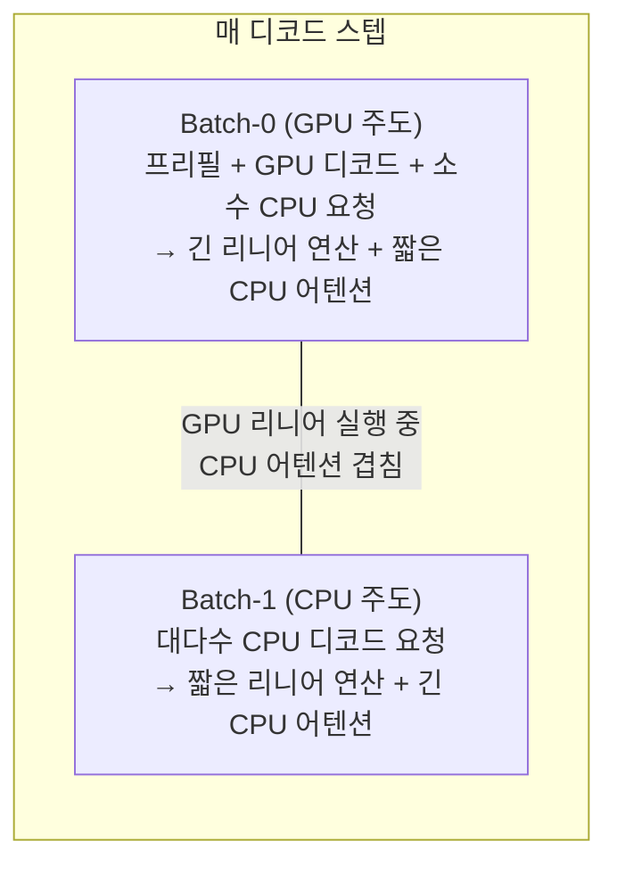

### 동작 원리

1. **배치 분할**: 스케줄러가 매 이터레이션마다 활성 요청을 Batch-0(GPU 어텐션)과 Batch-1(CPU 어텐션)으로 나눔
2. **비대칭 파이프라이닝**: Batch-0의 GPU 리니어(MLP) 연산 시간 동안 Batch-1의 CPU 어텐션이 병렬 실행됨
3. **KV 캐시 분리**: Batch-1의 KV 캐시는 CPU DRAM에 상주 → GPU HBM을 Batch-0에 더 많이 할당 → 전체 배치 크기 증가
4. **부하 인식 스케줄링**: CPU 메모리 대역폭과 연산 능력을 초과하지 않도록 Batch-1 크기를 동적으로 조정

### H100×4 환경 적용성 분석

NEO는 H100 8×SXM에서 Llama-3.1-70B (TP=2) 기준 **14.3% 처리량 향상**을 달성했다.

**H100에서 효과가 제한적인 이유:**

| 요인 | 설명 |
|------|------|
| GPU HBM 여유 | H100 80GB×4 = 320GB로 70B TP=4 시 가중치 ~35GB/GPU → KV 캐시 여유 ~45GB/GPU → 이미 대규모 배치 가능 |
| CPU 어텐션 속도 | DDR5 ~250GB/s로 CPU 어텐션 처리량 ~100~200GB/s, GPU 어텐션 대비 ~20× 느림 → GPU idle 발생 |
| 파이프라인 버블 | 두 서브배치가 반반이면 GPU가 Batch-0만큼만 활용 → 최대 batch의 절반으로 제약 |

**효과가 유의미해지는 조건:**

- **70B + 장문 컨텍스트 (16K+)**: KV 캐시가 GPU HBM을 압도 → CPU 오프로드 필요성 급증
- **배치 크기 ≥ 64**: GPU compute-bound 진입 시 CPU 어텐션의 병렬 처리가 GPU 활용률을 높임
- **AWS c7i 타입 인스턴스 (더 강력한 CPU)**: NEO 논문에서 x16large CPU 사용 시 79.3% 추가 개선 보고

### 구현 경로

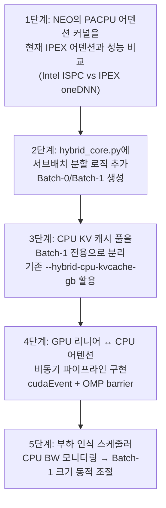

**구체적 코드 변경점:**

- `hybrid_core.py`: `_route_throughput_adaptive` 대신 `_split_batch_asymmetric` 메서드 추가. 매 스텝마다 활성 요청을 GPU/CPU 서브배치로 분할
- `cpu_worker.py`: 현재 독립 EngineCore 구조에서 어텐션 전용 워커로 역할 재정의. 리니어 연산은 GPU에서, 어텐션만 CPU에서 수행
- `cpu_attn.py`: IPEX `single_query_cached_kv_attention` 커널을 서브배치 단위로 호출하는 wrapper 추가

### 예상 효과

| 시나리오 | 예상 처리량 향상 | 근거 |
|---------|-------------|------|
| 32B, 배치 32, 2K context | **5~10%** | GPU HBM 여유 → 이점 제한적 |
| 70B, 배치 64, 4K context | **15~25%** | KV 캐시 압력 증가 → CPU 오프로드 이점 |
| 70B, 배치 128+, 16K context | **30~50%** | GPU HBM 포화 → CPU 없이는 배치 축소 불가피 |

### 위험 요소

- NEO는 SwiftLLM 기반이며 vLLM V1과 아키텍처가 다름 → 직접 이식 불가, 개념 차용
- 서브배치 분할이 continuous batching과 충돌할 수 있음 → 스케줄러 재설계 필요
- **GPU idle 문제**: CPU 어텐션이 느리면 GPU가 Batch-1의 리니어 결과를 기다려야 함

---

## 방안 B2. ScoutAttention: 레이어 앞선 CPU 어텐션 사전계산

### 핵심 개념

ScoutAttention (DAC'26, arXiv 2603.27138)은 CPU와 GPU가 **같은 요청의 같은 레이어를 분담**하되, CPU가 **한 레이어 앞서** 다음 레이어의 중요 KV 블록을 예측하는 구조다.

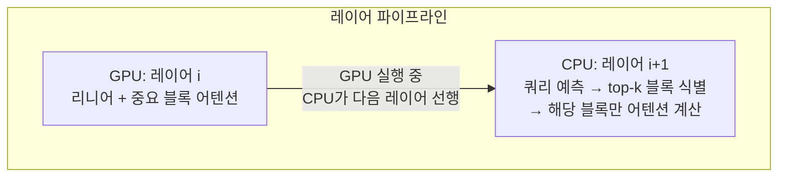

### ScoutAttention이 중요한 이유

ScoutAttention의 핵심 발견은 정량적 비교에 있다:

- **CPU 어텐션 계산 처리량**: ~100GB/s (36코어 기준)
- **PCIe KV 캐시 전송 처리량**: ~15GB/s (32-토큰 페이지 단위), 토큰 단위 시 ~800MB/s
- **결론**: CPU에서 KV 캐시를 직접 계산하는 것이 GPU로 전송하는 것보다 **~6.7× 효율적**

이 관찰이 의미하는 것: KV 캐시를 CPU DRAM에 두고 GPU로 가져오는 대신, **CPU에서 직접 어텐션을 계산**하는 것이 항상 더 빠르다.

### 동작 메커니즘 상세

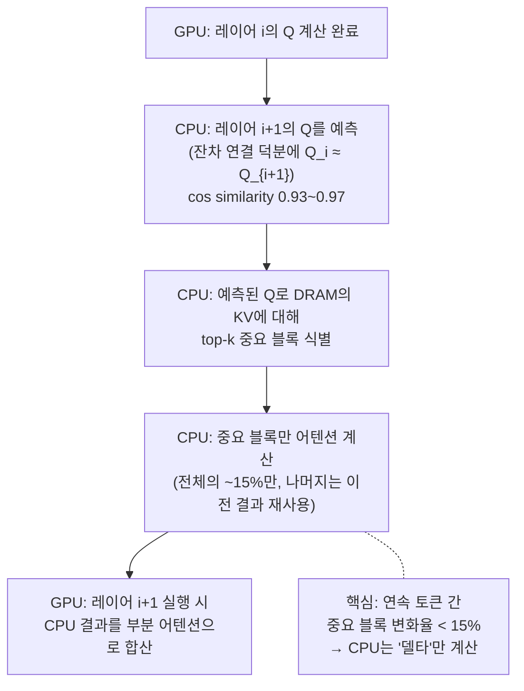

**블록 희소 어텐션의 동작:**

1. **GPU 측**: HBM에 상주하는 "핫" KV 블록 (sliding window + attention sink)으로 부분 어텐션 계산
2. **CPU 측**: DRAM에 상주하는 "콜드" KV 블록 중 top-k 중요 블록만 어텐션 계산
3. **합산**: GPU 부분 + CPU 부분 = 근사 풀 어텐션 (정확도 열화 < 2.1%)

### H100×4 환경 적용

Xeon 8480+ (48 물리코어, DDR5 300GB/s)에서의 추정:

| 파라미터 | 값 | 근거 |
|---------|-----|------|
| CPU 어텐션 처리량 | ~150~200 GB/s | ScoutAttention 36코어 측정치(~100GB/s) × 48코어 보정 |
| PCIe Gen5 x16 전송 | ~25~28 GB/s 단방향 | 스펙 기준, 실측 ~50GB/s 양방향 |
| CPU 계산 / PCIe 전송 비율 | **6~8×** | CPU 어텐션이 PCIe 전송보다 더 효율적 |

**효과 발현 조건:**

- 컨텍스트 길이 ≥ 8K: KV 캐시가 커야 GPU HBM 부족이 발생하고 오프로딩 필요성이 생김
- 배치 크기 ≥ 32: KV 캐시 총량이 GPU HBM을 초과해야 함
- 70B 모델: 가중치만 ~35GB/GPU → KV 캐시 여유 ~45GB/GPU → 4K context 배치 ~30에서 포화

### 구현 경로

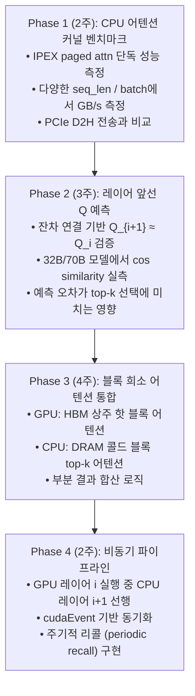

### 예상 효과

ScoutAttention 논문 실측 기준:

| 메트릭 | 풀 어텐션 대비 | 기존 오프로딩 대비 |
|--------|-------------|---------------|
| 디코딩 처리량 | **5.1×** | **2.1×** |
| 정확도 열화 | **< 2.1%** (LongBench 평균) | — |
| GPU 유휴 시간 | **< 5%** (vs HGCA의 57%) | — |

H100×4 환경에서는 GPU HBM이 넉넉하므로 효과가 축소될 수 있으나, **70B + 16K+ 컨텍스트**에서는 유의미한 개선이 기대된다.

### 위험 요소

- 근사 어텐션으로 인한 정확도 손실 (특히 RAG, 긴 문서 요약 태스크)
- Q 예측 오차가 top-k 선택을 오염시킬 가능성 → periodic recall로 보정 필요
- SGLang 기반 구현 → vLLM 포팅에 상당한 노력

---

## 방안 B3. KV 캐시 INT4 양자화 + CPU DRAM 확장

### 핵심 개념

GPU HBM에 저장되는 KV 캐시를 INT4/INT2로 양자화하여 메모리 사용량을 4~8× 축소하고, 절약된 HBM 공간으로 배치 크기를 확대하는 전략이다. CPU DRAM은 양자화 전의 풀 정밀도 KV 캐시 백업이나 오버플로 저장소로 활용한다.

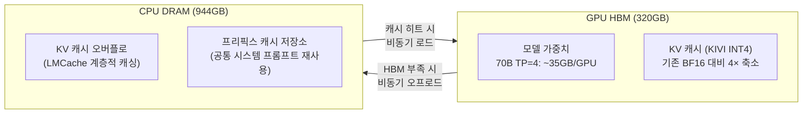

### KIVI INT4 양자화 상세

KIVI (ICML'24, arXiv 2402.02750)는 비대칭 양자화를 적용한다:

- **Key 캐시**: per-channel 양자화 (채널 간 분포 차이가 큼)
- **Value 캐시**: per-token 양자화 (토큰 간 분포가 더 균일)
- **결과**: INT2에서도 WikiText PPL 열화 < 0.5, INT4에서는 거의 무손실

**메모리 절감 효과 (70B, GQA 8 KV heads, 4K context, 배치 64):**

| 정밀도 | KV 캐시/요청 | 배치 64 총량 | HBM 잔여 (45GB/GPU 기준) | 최대 배치 |
|--------|-----------|-----------|----------------------|---------|
| BF16 | ~640MB | ~40GB | **5GB** (거의 포화) | ~72 |
| **INT4** | **~160MB** | **~10GB** | **35GB** | **~288** |
| **INT2** | **~80MB** | **~5GB** | **40GB** | **~576** |

### CPU DRAM의 역할

CPU DRAM 944GB는 KV 캐시 관리에서 세 가지 역할을 수행한다:

1. **오버플로 저장소**: GPU HBM이 꽉 찼을 때 가장 오래된 KV 블록을 비동기로 CPU로 이동. 해당 요청의 디코드가 재개될 때 PCIe로 다시 로드
2. **프리픽스 캐시**: LMCache (arXiv 2510.09665) 스타일로 완료된 요청의 KV 캐시를 CPU에 보존. 동일 프리픽스의 새 요청이 오면 프리필 재계산 없이 로드 → TTFT 대폭 개선
3. **레이어별 비동기 오프로딩**: vLLM RFC #33398 제안 — 레이어 i의 디코드 중 레이어 i-2의 KV를 CPU로 내리고, 레이어 i+2 진입 전에 미리 로드

### 구현 경로

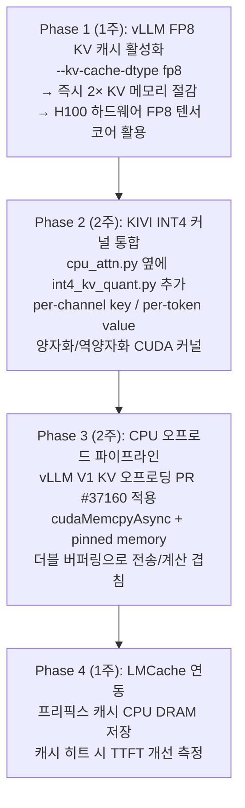

**구체적 코드 변경점:**

- `vllm/v1/core/block_pool.py`: INT4 블록 타입 추가, 양자화/역양자화 호출 포인트
- `vllm/v1/core/kv_cache_manager.py`: 블록 할당 시 정밀도 옵션 (BF16/FP8/INT4)
- `vllm/v1/attention/backends/flash_attn.py`: INT4 KV를 BF16으로 역양자화하는 래퍼 (Flash Attention은 BF16/FP8 입력만 지원)
- `vllm/v1/engine/hybrid_core.py`: CPU DRAM 풀 관리자 추가, 오프로드/로드 비동기 제어

### 예상 효과

| 시나리오 | 개선 항목 | 예상 효과 |
|---------|---------|---------|
| 70B, 4K context | 최대 배치 크기 | 72 → **288** (4×) |
| 70B, 16K context | 서빙 가능 여부 | BF16에서는 배치 18 한계 → INT4로 **72** |
| 모든 모델, 프리픽스 공유 | TTFT | 프리픽스 히트 시 **2~8× 개선** (LMCache 실측) |
| 처리량 | 배치 증가에 비례 | **2~4× 처리량 증가** (배치가 GPU 활용률을 높임) |

### 위험 요소

- INT4 KV 역양자화 오버헤드: 매 어텐션 스텝마다 INT4→BF16 변환 필요
- Flash Attention과의 호환성: 현재 FA v2/v3는 FP8까지만 네이티브 지원, INT4는 커스텀 커널 필요
- PCIe 전송 지연: CPU→GPU KV 로드 시 디코드 스텝 지연 가능 (더블 버퍼링으로 완화)

---

## 방안 B4. 활성화 희소성 기반 CPU 부분 연산

### 핵심 개념

Dense 모델도 **40~50%의 활성화 희소성**을 보인다 (TEAL, ICLR'25 Spotlight). SwiGLU 기반 최신 모델(Qwen2.5, Llama-3.3)에서도 크기 기반(magnitude) 프루닝으로 학습 없이 희소성을 확보할 수 있다. 이 희소성을 활용하여 **0이 아닌 활성화에 대응하는 가중치 열만** GPU에서 처리하고, 나머지를 CPU에서 보조 처리하는 전략이다.

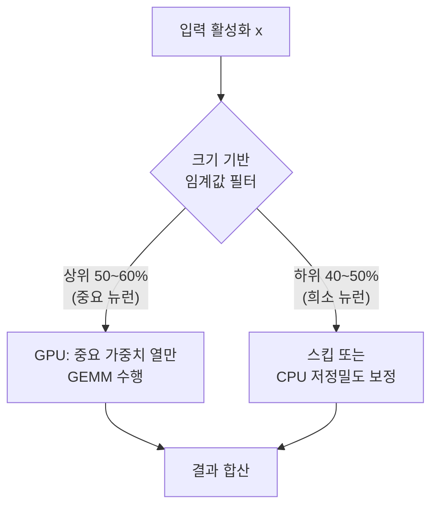

### TEAL의 실측 데이터

TEAL (arXiv 2408.14690, ICLR'25)은 학습 없이 크기 기반 활성화 프루닝을 적용한다:

| 모델 | 희소성 | 속도 향상 (A100) | PPL 열화 (WikiText) |
|------|-------|---------------|-------------------|
| Llama-2-7B | 40% | 1.53× | +0.13 |
| Llama-2-7B | 50% | 1.80× | +0.42 |
| Llama-3-8B | 40% | 1.40× | +0.15 |
| Llama-3-70B (TP4) | 40% | 1.53× | +0.08 |

### CPU 보조 연산으로의 확장

TEAL의 원래 목적은 GPU에서의 메모리 전송 절감이지만, 이를 **CPU-GPU 분할**에 적용할 수 있다:

1. **예측기 기반 분할**: 이전 토큰의 활성화 패턴으로 현재 토큰의 중요 뉴런을 예측
2. **GPU**: 중요 뉴런(상위 50~60%)에 대응하는 가중치 열만 로드하여 GEMM 수행
3. **CPU**: 나머지 뉴런에 대한 저정밀도(INT8) 보정 연산을 **비동기로** 수행
4. **합산**: GPU 결과 + CPU 보정 = 풀 정밀도에 근사

### 배치 크기 제약 — Polar Sparsity의 경고

Polar Sparsity (arXiv 2505.14884)가 지적한 핵심 문제: **배치가 커지면 MLP 활성화의 합집합이 밀집에 수렴**한다. 배치 내 각 토큰이 서로 다른 뉴런을 활성화하므로, 배치 전체의 "활성 뉴런 합집합"은 배치 크기에 비례하여 밀도가 높아진다.

그러나 **어텐션 헤드 희소성은 배치 불변(batch-invariant)**이다. 특정 어텐션 헤드의 중요도는 입력에 덜 의존하므로, 배치가 커져도 비중요 헤드를 CPU로 오프로드하는 것은 유효하다.

### 구현 경로

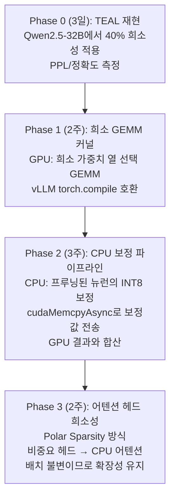

### 예상 효과

| 접근법 | 배치=1 | 배치=8 | 배치=64 |
|--------|-------|-------|--------|
| MLP 활성화 희소성 (TEAL 40%) | **1.5× GPU 가속** | 1.2× | ~1.0× (희소성 소멸) |
| 어텐션 헤드 희소성 (Polar) | 1.3× | **1.3×** | **1.3×** (배치 불변) |
| 결합 | **1.8×** | **1.5×** | **1.3×** |

### 위험 요소

- SwiGLU 모델에서의 자연 희소성은 ReLU 대비 낮음 (40~50% vs 90%+)
- CPU 보정의 PCIe 전송 오버헤드가 이득을 상쇄할 수 있음
- 배치 추론 환경에서 MLP 희소성 효과 감소가 가장 큰 제약

---

## 방안 B5. AMX-INT8 가중치 양자화를 통한 CPU 경로 가속

### 핵심 개념

현재 CPU EngineCore는 BF16으로 추론하며, IPEX oneDNN이 AMX BF16 brgemm을 dispatch한다. 이를 **INT8 가중치 양자화(WoQ)**로 전환하면 CPU 경로의 처리량이 ~2× 향상되어, Property 2 gate에서 CPU가 선택될 확률이 높아진다.

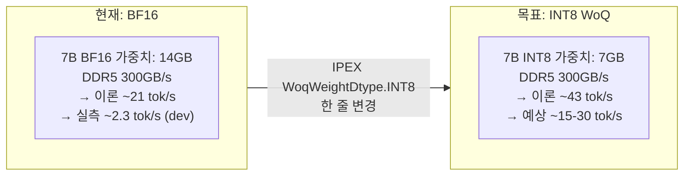

### 기존 서베이의 핵심 발견 재확인

`20260411_154523_hybrid_optimization_literature_survey.md` §3.1에서 제기된 문제:

- 7B BF16의 이론 최대 decode rate = 300GB/s ÷ 14GB = ~21 tok/s
- **실측 2.3 tok/s는 이론의 16%** — BW가 실제 천장이라면 너무 낮음
- llama.cpp SPR 실측 Q4_0 7B = 12~18 tok/s → INT8/INT4로 가면 이론상 2×/4× 아니라 실제 6~8× 개선

**"BW가 천장이라고 확정하고 AMX를 포기한 것은 성급했다"** — 이 가설을 검증하는 것이 B5의 핵심 목적이다.

### IPEX WoQ 적용 방법

`cpu_worker.py`에서 IPEX 최적화 호출 시 양자화 설정을 추가한다:

```python
# 현재 코드 (BF16)
model = ipex.llm.optimize(model, dtype=torch.bfloat16)

# 변경 (INT8 WoQ)
from intel_extension_for_pytorch.quantization import WoqWeightDtype
qconfig = ipex.quantization.default_weight_only_quant_qconfig_mapping(
    weight_dtype=WoqWeightDtype.INT8
)
model = ipex.llm.optimize(model, dtype=torch.bfloat16, 
                           quantization_config=qconfig)
```

### SparAMX: 희소성 + AMX 결합

SparAMX (arXiv 2502.12444, Intel Labs)는 Sapphire Rapids에서 AMX 타일 레지스터에 비구조적 희소성을 적용한다:

- 리니어 레이어: **1.42× 속도 향상**
- 어텐션 레이어: **1.14× 속도 향상**
- KV 캐시에 비구조적 희소성을 최초 적용

INT8 WoQ + SparAMX 결합 시 CPU 경로가 **~3× 가속**될 수 있으며, 이는 Property 2 gate에서 CPU가 선택되는 영역을 넓힌다.

### 구현 경로

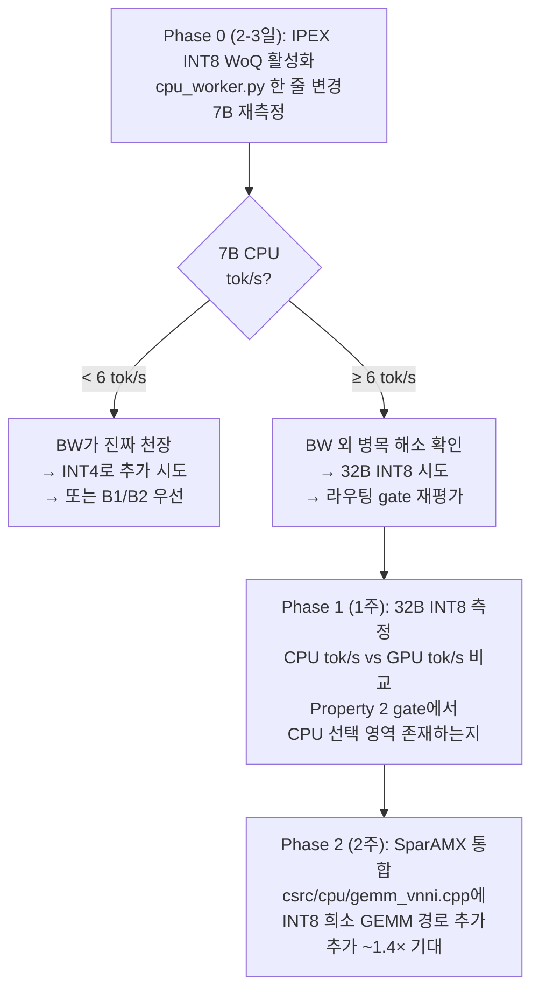

### 예상 효과

| 모델 | 현재 CPU tok/s | INT8 WoQ 예상 | 목표 | GPU tok/s |
|-----|-------------|-------------|-----|---------|
| 7B | ~2.3 (dev 추정) | **~6~15** | GPU의 25%+ | ~40 |
| 32B | ~0.5 (추정) | **~2~4** | GPU의 10%+ | ~24 |
| 70B | 미측정 | **~1~2** | 보조 경로 | ~14 |

**CPU가 GPU의 25% 이상** 속도를 내면, 고부하 시 (GPU 큐 포화) Property 2 gate가 일부 요청을 CPU로 보내기 시작한다. 이것이 현재 구조를 코드 변경 없이 활용할 수 있는 가장 저비용 경로다.

### 위험 요소

- INT8 양자화로 인한 정확도 열화 (일반적으로 무시 가능, PPL < +0.5)
- IPEX WoQ가 현재 vLLM Hybrid의 모델 로딩 경로와 호환되는지 미검증
- 효과가 있더라도 GPU 대비 여전히 4~10× 느림 → 고부하에서만 의미

---

## 방안 종합 비교 및 우선순위

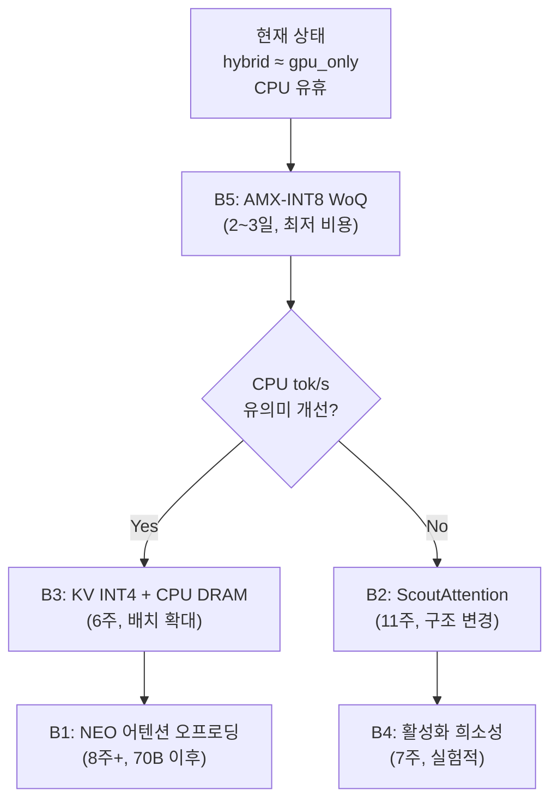

| 방안 | 예상 효과 | 구현 비용 | 선행 조건 | 우선순위 |
|------|---------|---------|---------|---------|
| **B5** AMX-INT8 WoQ | CPU 경로 2~4× 가속 | **최저 (2~3일)** | 없음 | **1순위** |
| **B3** KV INT4 + CPU DRAM | 배치 4× 확대, 처리량 2~4× | 중 (6주) | B5 진단 후 | **2순위** |
| **B1** NEO 어텐션 오프로딩 | 처리량 15~50% (70B) | 높음 (8주+) | 70B baseline | **3순위** |
| **B2** ScoutAttention | 디코딩 5.1× (장문) | 높음 (11주) | 70B + 16K+ | **4순위** |
| **B4** 활성화 희소성 | 1.3~1.8× (저배치) | 중 (7주) | TEAL 검증 | **5순위** |

### 권장 실행 순서

**즉시 (이번 주)**: B5 Phase 0 — `cpu_worker.py` 한 줄로 IPEX INT8 WoQ 활성화, 7B CPU tok/s 재측정. 결과에 따라 전체 전략의 방향이 결정됨.

**단기 (1~2개월)**: B3 — vLLM의 FP8 KV 캐시 활성화 (즉시) + KIVI INT4 커널 통합 + LMCache CPU 프리픽스 캐싱. 이것이 **CPU DRAM 944GB를 가장 직접적으로 활용**하는 경로.

**중기 (2~3개월)**: B1 또는 B2 — 70B baseline 확보 후, GPU HBM 압력이 실제로 발생하는 환경에서 NEO 스타일 어텐션 오프로딩 또는 ScoutAttention 도입 결정.

**병렬 실험**: B4 — TEAL 40% 희소성을 Qwen2.5-32B에서 재현하여, CPU 보조 연산의 실현 가능성을 확인. 배치 추론에서의 희소성 감소 문제가 실제로 어느 정도인지 측정.
