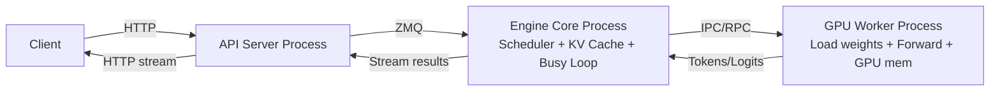
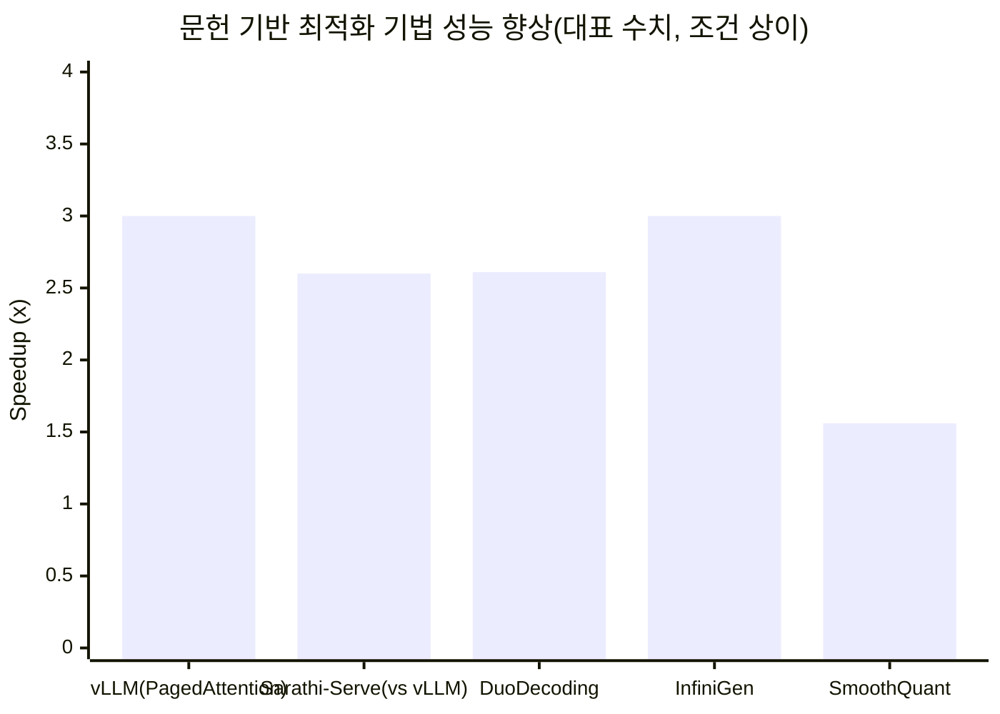
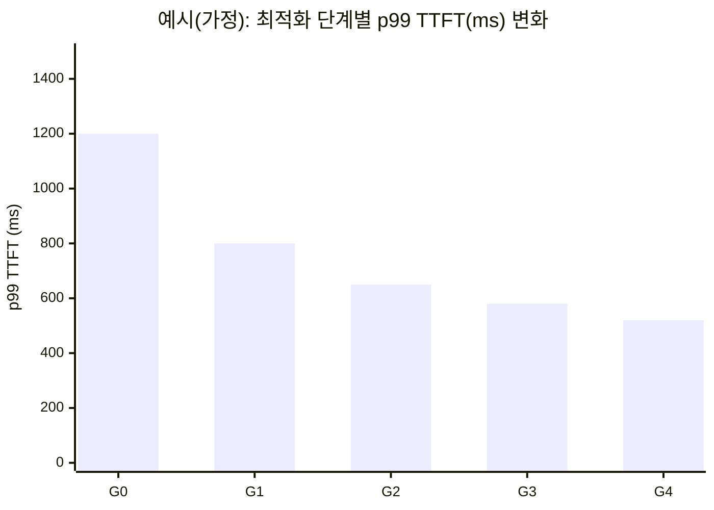

# CPU(AVX-512/AMX/AVX2)와 GPU를 동시에 활용해 vLLM 추론 성능을 극대화하는 최적화 방안 심층 리서치 보고서

## Executive Summary

본 보고서는 **범용 Transformer(디코더/인코더-디코더 포함) 계열 모델**을 **GPU 중심(vLLM) 서빙**으로 운영할 때, **CPU의 고성능 ISA(AVX-512/AMX/AVX2)·NUMA·런타임 스레딩**을 적극 활용하여 **GPU가 놀지 않도록(=CPU starvation 제거)** 하고, 동시에 **메모리·I/O 병목**까지 포함해 **엔드투엔드 지연(TTFT/TPOT/p95/p99)과 처리량(tokens/s)** 을 끌어올리는 **분석적·실증적 최적화 청사진**을 제시한다. vLLM은 V1 기준으로 **API 서버(토큰화/입력 처리/스트리밍)–엔진 코어(스케줄러·KV 캐시 관리·busy loop)–GPU 워커(포워드/메모리 관리)** 의 멀티프로세스 구조를 가지며, 특히 **엔진 코어 busy loop는 CPU 기아(코어 경쟁)에 매우 민감**하다. citeturn8view1turn14search1turn10view0 이 점 때문에 **GPU 연산 자체를 더 최적화(예: 더 빠른 attention kernel)** 했더라도, CPU가 스케줄링·입력 준비·스트리밍을 제때 수행하지 못하면 **GPU utilization이 낮아지거나 tail latency(p99)가 급등**할 수 있다. citeturn10view0turn14search1

핵심 결론은 다음과 같다.

- **“CPU는 부가 처리”가 아니라 vLLM 성능 상한을 결정하는 병목 후보**다. 특히 작은 모델+빠른 GPU(예: H100)에서는 GPU 포워드가 수 ms 수준으로 내려가 CPU 오버헤드가 두드러진다. citeturn10view0  
- 최우선 레버는 (1) **CPU 코어·스레드·NUMA 바인딩을 vLLM 프로세스 구조에 맞춰 설계**, (2) **vLLM 스케줄러 파라미터(특히 `max_num_batched_tokens`/chunked prefill)로 prefill·decode 혼합 배치를 안정화**, (3) **KV 캐시·메모리 정책(핀드 메모리/풀/오프로딩·프리페치)로 페이지 폴트·전송 병목 최소화**, (4) **필요 시 CPU↔GPU 작업 분할(특히 CPU draft + GPU verify speculative decoding)로 병렬화**이다. citeturn14search1turn8view0turn7search1turn21search8  
- **AVX-512/AMX는 “GPU 대체”가 아니라 “CPU 측 병목을 제거해 GPU를 100% 굴리는 수단”**으로 적용하는 것이 현실적이다(토큰화/입력 전처리/후처리/로그잇 페널티/CPU draft 모델/오프로딩된 KV/가중치 처리를 포함). vLLM 문서는 CPU 리소스 부족 시 성능이 크게 악화됨을 명시하고 최소 코어 수(2+N GPUs) 가이드를 제공한다. citeturn14search1  
- 실증 근거(문헌)로는 (a) PagedAttention 기반 vLLM이 기존 대비 **2–4× 처리량 향상**(동일 지연 수준)을 보고했고, citeturn12academia41 (b) Sarathi-Serve는 스케줄링(Chunked prefill/ stall-free)으로 vLLM 대비 단일 A100에서 **2.6× serving capacity**를 보고했으며, citeturn7search0 (c) DuoDecoding은 **draft를 CPU, target을 GPU에 배치**해 **최대 2.61× 지연 개선**과 TTFT 개선을 보고했다. citeturn7search1turn7search5  
- 본 보고서는 **vLLM 버전·모델·클러스터 규모가 ‘미지정’**인 전제에서 작성되므로, 기능 지원(예: speculative decoding의 특정 method, full CUDA graphs 조건)은 **버전별 차이 가능**을 명시하고, 재현 절차는 **가정 하드웨어(예: 1×A100 80GB + 64코어 AVX-512/AMX + 512GB RAM + NVMe)** 로 제시한다.

## 연구 목적과 범위

**목적**: vLLM 기반 GPU 서빙 환경에서 CPU(AVX-512/AMX/AVX2)와 GPU를 “동시에” 활용하여, (1) GPU 포워드 시간뿐 아니라 (2) CPU 스케줄링/입력 준비/스트리밍/토큰화 등 **호스트 병목**을 제거하고, (3) 메모리·I/O·네트워킹 병목까지 포함한 **엔드투엔드 성능 최적화** 전략을 제시한다. vLLM V1 문서는 CPU 리소스 sizing이 중요하며, 엔진 코어 busy loop가 CPU starvation에 민감하다고 명시한다. citeturn14search1turn8view1

### 미지정 항목 표

아래 항목들은 요청자 지정이 없으므로 **문서 내에서 “미지정”으로 유지**하고, 필요한 경우 별도 “가정”으로 분리한다.

| 구분 | 항목 | 값 | 본 보고서 처리 방식 |
|---|---|---:|---|
| 소프트웨어 | vLLM 버전 | 미지정 | 최신 공식 문서(stable/latest) 기준으로 구조/옵션을 기술하되, 버전별 차이를 “제약”에 명시 citeturn8view1turn8view0turn13search0 |
| 모델 | 모델 아키텍처/크기(예: 7B/70B) | 미지정 | 실험 설계에서 대표적인 7B/70B/긴 컨텍스트 시나리오만 가정(표로 분리) |
| 운영 | 노드 수 / 멀티 GPU 구성 | 미지정 | 단일 노드 1GPU를 기본 가정, 확장 시 CPU 코어 최소치(2+N) 및 NUMA 바인딩을 설명 citeturn14search1turn14search3 |
| 기능 | speculative decoding 지원 여부 | 미지정 | 기능 자체는 vLLM 문서에 존재하나, method·버전별 지원 편차 가능성을 언급 citeturn8view2turn0search32 |
| 하드웨어 | GPU 모델/VRAM | 미지정 | 실험 설계에서 A100 80GB를 예시 가정으로 사용 |
| 하드웨어 | CPU/ISA(AVX-512/AMX 등) | 미지정 | 실험 설계에서 AMX 지원(예: Sapphire Rapids급)을 예시 가정 |
| OS/커널 | 배포판/커널 | 미지정 | AMX 권한/arch_prctl 요구사항 등 커널 인터페이스 기반으로 기술 citeturn1search2turn20search15 |

### 명시적 가정 표

요청 조건에 따라 **재현 가능한 실험 설계**를 위해 아래를 “예시 가정”으로 둔다(실제 환경에 맞게 치환).

| 범주 | 가정(예시) | 근거/의미 |
|---|---|---|
| GPU | NVIDIA A100 80GB × 1 | 단일 GPU 장기 컨텍스트·대형 배치 실험에 널리 쓰이는 표준급 가정(요청 예시) |
| CPU | 64 physical cores, AVX-512 + AMX 지원(예: Sapphire Rapids급) | AMX는 타일 기반 행렬 연산(AMX-BF16/INT8)을 제공하며, 사용은 OS 지원 및 타일 상태 enable이 필요 citeturn6search4turn1search2turn6search0 |
| 메모리 | DDR RAM 512GB | KV/가중치 오프로딩·긴 컨텍스트·캐시 실험에 필요(요청 예시) |
| 스토리지 | 로컬 NVMe SSD(≥ 3.5GB/s) | 모델 로딩 및 offload(I/O) 병목 최소화; vLLM도 로컬 디스크 권장 citeturn14search22 |
| OS | Linux (컨테이너 가능) | vLLM은 Linux 중심; AMX/CPU 바인딩/numactl/io_uring 등 최적화 레버가 Linux에 집중 citeturn5search2turn5search0turn11search0 |

## vLLM 아키텍처와 성능 모델

### vLLM V1 프로세스 구성과 병목 지점

vLLM V1의 공식 아키텍처 문서는 멀티프로세스 분리를 강조한다. 핵심은 다음이다. citeturn8view1

- **API Server 프로세스**: HTTP 요청 처리, **토큰화**, 멀티모달 입력 로딩, 결과 스트리밍. 엔진 코어와 **ZMQ**로 통신. `--api-server-count`로 조정 가능. citeturn8view1  
- **Engine Core 프로세스**: 스케줄러 실행, **KV 캐시 관리**, GPU 워커에게 작업 디스패치. **busy loop**로 동작하며 CPU starvation에 민감. citeturn8view1turn14search1  
- **GPU Worker 프로세스**: 각 GPU당 1개 워커. 모델 가중치 로드, 포워드 실행, GPU 메모리 관리. citeturn8view1  

vLLM 최적화 문서는 “CPU 코어가 프로세스 수보다 부족하면 contention으로 throughput/latency가 크게 악화되고, 엔진 코어 busy loop는 특히 민감”하며, 최소 요구를 **`2 + N(GPU 수)` physical cores**로 제시한다. citeturn14search1

아키텍처를 도식화하면 아래와 같다(개념도).



### PagedAttention과 KV 캐시의 역할

vLLM은 KV 캐시 관리에서 **PagedAttention**을 제안하고, 이를 통해 **fragmentation/duplication에 의한 KV 메모리 낭비를 줄여 batch size를 키우고 throughput을 높인다**고 보고한다. PagedAttention 논문은 vLLM이 기존 시스템 대비 **2–4× throughput 향상(동일 latency 수준)** 을 보고한다. citeturn12academia41

vLLM 문서(설계/성능)에서도 KV 캐시를 블록 단위로 관리해 메모리 낭비를 줄이는 방향을 설명한다. citeturn14search30turn11search23

### vLLM 스케줄링 관점: prefill·decode·chunked prefill

vLLM은 요청을 **prefill(프롬프트 처리)** 과 **decode(토큰 1개씩 생성)** 로 이해할 수 있으며, 두 단계는 계산/메모리 특성이 다르다. Sarathi-Serve 논문은 prefill은 병렬성이 커 GPU 계산을 잘 채우지만 지연이 크고, decode는 토큰 단위라 계산 활용률이 낮아 batching이 중요하다고 정리한다. citeturn7search0

vLLM의 **chunked prefill**은 큰 prefill을 작은 chunk로 쪼개 decode와 같은 배치에 섞어 **throughput과 latency를 동시에 개선**하려는 전략이며, V1에서는 가능한 경우 기본 활성화라고 문서에 명시되어 있다. 또한 `max_num_batched_tokens`를 통해 ITL/TTFT/trade-off를 조정할 수 있다. citeturn8view0turn8view3

## CPU↔GPU 역할 분담과 연산 분할 최적화

이 절은 “CPU와 GPU를 동시에 활용”한다는 요구를 **실제 vLLM 구조(프로세스 분리)** 와 **Transformer 연산 특성(GEMM/attention/softmax 등)** 을 결합해, “어디를 CPU로 돌리고 어디를 GPU로 두는가”를 **옵션/구현 난이도/정확도 리스크** 관점으로 정리한다.

### 기본 역할 분담: vLLM 구조가 이미 강제하는 분업

vLLM V1 공식 문서에 따르면 **토큰화/입력 처리/스트리밍은 API 서버(=CPU)**, 스케줄링·KV 캐시는 엔진 코어(=CPU), 모델 포워드는 GPU 워커(=GPU)로 분리된다. citeturn8view1turn10view0 따라서 “CPU를 함께 쓴다”는 것은 기본적으로 **CPU 측 파이프라인을 최적화하여 GPU를 idle 없이 돌리는 것**이 1차 목표가 된다. vLLM V1 발표 글은 GPU가 빨라질수록 CPU 오버헤드(스케줄링, 입력 준비, detokenize, 스트리밍)가 더 두드러진다고 지적한다. citeturn10view0

### CPU에서 벡터화/AMX로 실효가 큰 후보 작업 목록

vLLM의 주요 GPU 연산(대형 attention/FFN GEMM)은 GPU에서 수행하되, 다음은 CPU 측에서 수행되거나(기본), 혹은 CPU로 옮겨 병렬화/오프로딩할 때 실효가 큰 후보들이다.

- **토큰화/디토큰화 및 텍스트 전처리**: vLLM API 서버에서 수행. 토큰화는 TTFT 측정에도 포함되며(“arrival_time이 tokenization 시작 시점”), CPU 최적화가 직접 TTFT에 영향을 준다. citeturn8view1turn13search2  
- **스케줄링·배치 구성·KV 캐시 메타데이터 처리**: 엔진 코어 busy loop가 수행. CPU starvation 시 성능 급락. citeturn14search1turn8view1  
- **로그잇 후처리(금지 토큰, 페널티, 샘플링 정책)**: vLLM V1은 “sampler”를 핵심 구성요소로 재아키텍처링했다고 밝히며, CPU 오버헤드 최소화를 목표로 한다. citeturn10view0 (구현 위치는 버전/백엔드에 따라 달라질 수 있으므로 “미지정” 환경에서는 프로파일링으로 확인 필요)  
- **CPU draft + GPU verify speculative decoding**: DuoDecoding은 draft 모델을 CPU, target 모델을 GPU에 배치해 draft/verify를 병렬로 수행하고, idle time을 최소화하는 “hardware-aware draft budget”로 **최대 2.61× 지연 개선**을 보고한다. citeturn7search1turn7search5  
- **오프로딩 시 host-side KV/weight 압축·복원, 선택적 prefetch**: InfiniGen은 오프로딩 기반 시스템에서 KV 캐시 prefetch를 “필수 토큰만” 가져오는 방식으로 병목을 줄여 **최대 3× 성능 개선**을 보고한다. citeturn7search2turn7search10  

여기서 AVX-512/AMX는 **CPU가 수행하는 (또는 오프로딩으로 CPU에 옮긴) 행렬/벡터 연산**을 가속한다. AMX는 타일 기반 행렬 연산을 제공하고, 인스트린식/라이브러리(oneDNN 등)에서 활용된다. citeturn6search4turn6search0

### 레이어/연산별 오프로딩 패턴과 trade-off

vLLM 자체는 기본적으로 “GPU에서 모델 포워드”를 전제로 하지만, 연구/시스템 관점에서 CPU↔GPU 분할은 다음 패턴으로 분류할 수 있다(일부는 vLLM 외부 컴포넌트 결합 필요).

| 전략 | CPU 담당 | GPU 담당 | 장점 | 단점/리스크 | 적합 상황 |
|---|---|---|---|---|---|
| CPU-파이프라인 최적화(기본) | 토큰화·스케줄링·입력 준비·스트리밍 | 전체 포워드(attn/FFN) | vLLM 구조에 부합, 구현 난이도 낮음 | CPU 최적화 실패 시 GPU idle, p99 악화 citeturn14search1turn10view0 | 대부분의 GPU vLLM 운영 |
| CPU draft + GPU verify(이종 speculative) | draft 모델 생성(경량 모델) | target 모델 검증 | CPU/GPU 동시 사용으로 병렬화, 지연 개선(최대 2.61×) citeturn7search1turn7search5 | draft 품질·동기화·구현 복잡도; vLLM의 spec decoding method 선택/호환 고려 citeturn8view2 | 중·저 QPS, latency 중심, CPU 여유 있음 |
| KV/가중치 오프로딩(메모리 계층 활용) | KV/가중치 일부를 CPU 메모리/디스크에 보관, I/O 관리 | GPU는 유효 working set로 계산 | GPU 메모리 한계 완화, 큰 모델/긴 컨텍스트 가능 citeturn7search3turn7search7 | 전송/페이지 폴트 병목, tail latency 위험; 정교한 prefetch 필요 citeturn15search1turn15search2 | VRAM 제약, 배치 처리(throughput 중심) |
| 스케줄링 혁신(Chunked prefill 등) | 스케줄 정책·배치 구성 | GPU 실행 | throughput-latency trade-off 완화; Sarathi-Serve 2.6× capacity citeturn7search0turn8view0 | 파라미터 튜닝 복잡, 워크로드 의존 | 혼합 QPS/긴 컨텍스트 |
| 양자화/혼합정밀 | (가능 시) CPU 측 전처리/양자화 준비 | GPU에서 FP16/BF16/FP8/INT4 실행 | 메모리 감소, 처리량/수용량↑ (문헌: SmoothQuant 최대 1.56×) citeturn11search3 | 정확도/재현성 리스크, 커널/백엔드 제약 | VRAM/throughput 압박 |

### mixed-precision·quantization을 “CPU↔GPU 협업” 관점에서 사용하는 법

- vLLM은 다양한 quantization 옵션을 CLI 인자로 제공하며(예: AWQ/GPTQ/FP8 등), 배포 환경(커널/백엔드)에 따라 가용성이 달라진다. citeturn8view4turn11search23  
- SmoothQuant은 W8A8(INT8) PTQ를 통해 **최대 1.56× speedup**과 **2× 메모리 절감**을 보고한다. citeturn11search3  
- AWQ는 weight-only 저비트(INT3/4 등) 양자화로 정확도 손실을 줄이고 on-device 가속을 목표로 한다. citeturn11search2  
- CPU 측에서는 IPEX(oneDNN graph 기반) 등이 INT8/양자화+cast fusion을 제공한다고 vLLM RFC 이슈에서 설명한다. citeturn11search13  
- 단, **정확도/일관성(샘플링 분포)** 은 speculative decoding·mixed precision에서 민감할 수 있다. vLLM 문서는 speculative decoding이 이론적으로 lossless(수치 정밀도 한계 내)임을 설명한다. citeturn8view2

문헌 기반 speedup(대표 수치)을 시각화하면 다음과 같다(서로 다른 실험 조건의 “대표값”이므로 상대 비교는 참고용).



- vLLM(PagedAttention): 2–4× → 대표값 3.0으로 표기 citeturn12academia41  
- Sarathi-Serve: 단일 A100에서 vLLM 대비 2.6× capacity citeturn7search0  
- DuoDecoding: 최대 2.61× 지연 speedup citeturn7search1turn7search5  
- InfiniGen: 최대 3.00× 성능 개선 citeturn7search2turn7search10  
- SmoothQuant: 최대 1.56× speedup citeturn11search3  

## 컴파일·런타임·OS/드라이버·라이브러리 설정

### oneDNN/AMX 디스패치: ONEDNN_MAX_CPU_ISA, ONEDNN_VERBOSE로 “실제로 AMX를 쓰는지” 확인

oneDNN은 런타임 CPU 디스패치를 제공하며, `ONEDNN_MAX_CPU_ISA`로 사용 ISA 상한을 조정할 수 있다. 최신 릴리즈 노트는 AMX/AVX10.2 관련 디스패치가 기본적으로 opt-in일 수 있음을 명시한다. citeturn1search0turn1search1  
성능 검증(“AMX가 켜졌는지”)은 oneDNN verbose 로그를 통해 확인 가능하며, 환경변수로 활성화한다. PyTorch 한국어 튜토리얼은 `ONEDNN_VERBOSE=1`로 ISA 문자열(예: `avx512_core_amx_bf16`)을 확인하는 방법을 안내한다. citeturn1search1turn1search0

권장 절차(개념):

1) `ONEDNN_VERBOSE=1`로 어떤 커널/ISA가 선택되는지 로깅. citeturn1search1  
2) `ONEDNN_MAX_CPU_ISA=AVX512_CORE_AMX` 등으로 강제 상향/하향 후 결과 비교. citeturn1search0  
3) 성능/정확도 회귀가 없는지 벤치마크(TTFT/TPOT/p99)와 모델 출력 비교로 검증. citeturn13search1turn13search2

### AMX 사용을 위한 OS 권한/커널 요구사항(arch_prctl)

Linux에서 AMX 타일 상태는 **arch_prctl을 통한 동적 권한 부여**가 필요하며, 커널 문서는 XFEATURE permission을 요청/관리하는 인터페이스를 설명한다. citeturn1search2  
Intel AMX 인스트린식 예제는 `_tile_loadconfig()`로 타일 config를 로드하는 과정을 보여준다. citeturn6search0  
가상화 환경에서는 하이퍼바이저가 AMX를 게스트에 노출해야 하며(예: VMware ESXi에서 AMX 사용 가이드), 기능 미노출 시 AMX 최적화가 무력화될 수 있다. citeturn6search8

### 컴파일러별 권장 플래그(ICC/oneAPI/clang/GCC)

vLLM 자체는 Python 중심이지만, (a) CPU 확장 모듈, (b) 커스텀 전처리/후처리, (c) draft 모델 엔진(예: C++/ISPC) 등을 작성할 경우 컴파일 플래그가 중요해진다.

- **GCC**: x86 타깃 ISA 플래그(`-mavx512bf16`, `-mamx-int8`, `-mamx-bf16` 등)를 제공한다. citeturn2search2  
- **Clang/oneAPI icx/icpx**: oneAPI 컴파일러는 Linux에서 `icx/icpx`가 권장 기본 드라이버이며 “Clang-style” 옵션 체계를 사용한다. citeturn17search6turn17search4  
- **이식성 주의**: `-march=native`는 로컬 CPU 기능에 맞춘 코드를 생성하므로 다른 머신에서 실행 불가/성능 저하 위험이 있다. GCC 문서는 `-march`/`-mtune` 등 x86 옵션 체계를 제공한다. citeturn2search2  
- **Classic ICC(icc/icpc)**: 일부 환경에서 legacy로 존재하나, LLVM 기반 icx/icpx로 전환되는 추세가 안내된다(전환기/중단 공지). citeturn17search9turn17search6  

실무 권장(“안전한 기본값”):

- 공통: `-O3 -fno-omit-frame-pointer`(프로파일링 용이), 필요한 경우 `-fopenmp`(OpenMP 병렬)  
- ISA: 배포 타깃이 확실하면 `-march=<sapphirerapids 등>` 또는 `-mavx512* -mamx-*`를 명시(테스트 필수) citeturn2search2turn6search5  

### OpenMP/스레딩 런타임(OMP/MKL/oneDNN/IPEX) 설정: 성능과 p99의 핵심 레버

vLLM은 CPU 오버헤드가 성능을 좌우할 수 있으므로, CPU 스레딩을 “과잉”으로 두면 오히려 엔진 코어/OS 스케줄링을 방해할 수 있다. vLLM CPU 문서는 온라인 서빙 시 framework용 코어 1–2개를 남겨 oversubscription을 피하라고 권장한다. citeturn14search0turn14search1

- **KMP_AFFINITY**: Intel OpenMP는 스레드 바인딩을 위한 `KMP_AFFINITY`를 제공하며, “compact/scatter, granularity=fine” 등 설정 사례를 문서로 제공한다. citeturn16search0turn16search8  
- **KMP_BLOCKTIME**: OpenMP 스레드가 병렬 구간 사이에 spin/sleep하는 정책으로, IPEX 튜닝 가이드는 CNN 계열에서 0 또는 1 권장을 제시한다(워크로드별 상이). citeturn16search17turn16search21  
- **메모리 할당기(jemalloc/tcmalloc)**: PyTorch 튜닝 가이드는 딥러닝 워크로드에서 jemalloc/tcmalloc이 기본 malloc 대비 유리할 수 있다고 언급하며, `LD_PRELOAD`로 대체 가능함을 안내한다. citeturn16search15turn16search32  

## 메모리·I/O·네트워킹 최적화

### 호스트↔디바이스 메모리: pinned memory, 페이지 폴트, 메모리 풀

- **Pinned(Page-locked) host memory**: CUDA 문서는 page-locked host memory가 비동기 복사에 필요하며 성능을 개선한다고 설명한다. citeturn21search8turn21search0  
- **Unified Memory(Managed memory)와 페이지 폴트 위험**: CUDA 프로그래밍 가이드는 unified/managed memory, `cudaMemAdvise`/`cudaMemPrefetchAsync` 등 성능 힌트를 제공한다. citeturn15search2turn15search5 NVIDIA는 oversubscription 성능 특성과 페이지 폴트 트래픽의 영향을 “Improving GPU Memory Oversubscription Performance”에서 다룬다. citeturn15search1  
- **ROCm/HIP의 unified memory**도 on-demand page migration과 page-fault 과정을 문서화한다(오프로딩/oversubscription 시 tail latency 리스크를 시사). citeturn15search20turn15search3  
- **GPU 메모리 풀/할당기**: CUDA는 stream-ordered allocator(`cudaMallocAsync`) 및 mempool 개념을 제공한다. citeturn3search1 PyTorch는 CUDA allocator backend를 `PYTORCH_CUDA_ALLOC_CONF`로 제어할 수 있음을 문서화한다. citeturn21search10turn21search6 (단, backend 전환은 파편화/메트릭 의미 변화 등 부작용 가능)

**실무적 권장(요지)**: vLLM 운영에서는 “통제되지 않은 Unified Memory oversubscription”은 **p99 악화**로 이어질 가능성이 커서, offload가 필요하다면 **명시적 계층(Host RAM/NVMe) + prefetch 정책**을 갖춘 설계(FlexGen/InfiniGen류)를 참고하는 편이 안전하다. citeturn7search3turn7search2turn15search1

### NUMA: GPU-PCIe 토폴로지와 CPU 바인딩의 결합

- `numactl`은 CPU/메모리 바인딩을 제공하고, Red Hat 문서는 `--cpunodebind`, `--membind` 등을 설명한다. citeturn5search13turn5search2  
- `taskset`은 CPU affinity를 설정하지만 **로컬 메모리 할당을 보장하지 않으므로** NUMA 최적화에는 `numactl`을 권장한다는 Red Hat 문서가 있다. citeturn5search33  
- vLLM은 엔진 args에서 `--numa-bind-nodes/--numa-bind-cpus`를 제공하고, 내부적으로 `numactl` 옵션에 값을 전달한다고 문서화한다. citeturn14search3  

### I/O·네트워킹: NVMe, GPUDirect, RDMA, io_uring

- **로컬 디스크 권장**: vLLM 트러블슈팅 문서는 큰 모델 로딩 시 공유 파일시스템이 느릴 수 있어 **로컬 디스크가 낫다**고 언급한다. citeturn14search22  
- **GPUDirect RDMA**: GPU 메모리로의 직접 데이터 경로를 위한 기술로, RDMA 기반 네트워크(InfiniBand 등)에서 CPU bounce를 줄일 수 있다. (개념/설계는 NVIDIA 공식 문서군에서 다룸) citeturn4search1  
- **RDMA verbs(libibverbs)**: rdma-core는 사용자 공간 verbs 라이브러리를 제공한다. citeturn4search3  
- **io_uring**: Linux 비동기 I/O 인터페이스로, 유저/커널 공유 링 버퍼 기반의 효율적인 비동기 I/O를 제공한다. citeturn5search0turn5search32  
- **GPUDirect Storage(GDS)**: NVMe→GPU direct 경로를 통해 CPU/시스템 메모리 경유를 줄이는 방향(하드웨어/드라이버 제약 큼). citeturn4search1turn4news32  

## 스케줄링·동시성·프로파일링·벤치마크 및 실험 설계

### vLLM 스케줄링/동시성 레버: 프로세스·스레드·async·RPC·affinity

- vLLM V1은 멀티프로세스(많은-to-많은 ZMQ) 구조이며, `--api-server-count`로 API 서버 프로세스 수를 조정할 수 있다. citeturn8view1  
- CPU 코어 sizing은 vLLM 문서에서 최소 `2 + N` physical cores로 제시되며, CPU contention은 throughput/latency를 크게 악화시킨다. citeturn14search1  
- `max_num_batched_tokens`는 “iteration당 처리 가능한 토큰 수” 예산이며, chunked prefill과 결합해 TTFT/ITL/throughput을 조정한다. vLLM 최적화 문서는 작은 값은 ITL 개선, 큰 값은 TTFT/throughput 개선 방향을 제시한다. citeturn8view0turn13search0  
- vLLM CPU 문서는 `--max-num-batched-tokens`가 first token 성능(TTFT)에, `--max-num-seqs`가 output token 성능(TPOT)에 더 영향이 있다고 설명한다. citeturn13search24  

### 프로파일링/벤치마크 지표 정의와 측정 원칙

vLLM 공식 metrics 설계 문서는 핵심 지표를 정의한다.

- **TTFT**(Time To First Token): 요청 수신부터 첫 토큰까지. vLLM은 tokenization 시작 시점을 `arrival_time`으로 잡아 입력 처리 시간이 TTFT에 포함될 수 있음을 명시한다. citeturn13search2  
- **TPOT**(Time Per Output Token): output 토큰 간 간격(ITL) 계열 지표. citeturn13search2  
- **p95/p99**: vLLM 벤치 CLI는 percentile 선택을 지원(기본 p99). citeturn13search1  
- **Prometheus/Grafana**: vLLM은 `/metrics` endpoint로 Prometheus 포맷 metrics를 노출하며, Grafana로 시각화 가능. citeturn13search3turn13search7  

권장 도구(대표):

- **NVIDIA Nsight Systems(nsys)**: CPU+GPU 타임라인, 커널/전송/CPU 병렬성 시각화. CLI 사용 가능. citeturn19search1turn19search30  
- **NVIDIA Nsight Compute(ncu)**: 커널 단위 GPU 메트릭/병목 분석. citeturn19search2turn19search13  
- **DCGM/dcgmi, dcgm-exporter**: 데이터센터 GPU 메트릭 수집/Prometheus 연동. citeturn19search0turn19search6  
- **oneDNN verbose**: ISA/커널 선택 확인. citeturn1search1turn1search0  

### 실험 설계: 워크로드 시나리오와 실험군 매트릭스

Sarathi-Serve는 워크로드를 prefill/decode로 나누고, chunked prefill과 stall-free scheduling으로 tail latency 제약 하에서 capacity를 끌어올렸다. citeturn7search0turn8view0 이 관점을 vLLM 운영 실험에 적용하면, 최소 3가지 시나리오가 필요하다.

- **저지연 시나리오**: 짧은 프롬프트(예: 128–512 tokens), 작은 출력(예: 64–256 tokens), 낮은 동시성. TTFT/p99 중심.  
- **고처리량 시나리오**: 중간 프롬프트, 긴 출력, 높은 동시성. tokens/s 중심.  
- **긴 컨텍스트 시나리오**: 긴 프롬프트(수천~수만 tokens), KV 캐시 압박 및 오프로딩/스왑 위험 관찰.  

실험군 매트릭스(요약 예시):

| 실험군 | 변경 레버 | 기대 효과 | 관측 지표 |
|---|---|---|---|
| G0 Baseline | 기본 설정 | 기준선 | TTFT/TPOT/p95/p99, GPU/CPU util |
| G1 CPU 코어 분리 | 엔진 코어/워커/토큰화 스레드 affinity·NUMA | CPU starvation 제거, p99↓ | CPU run queue, GPU idle time |
| G2 스케줄러 튜닝 | `max_num_batched_tokens`, chunked prefill 관련 | TTFT↔ITL trade-off 조정 | TTFT/TPOT 분해 |
| G3 pinned/mempool | pinned host mem, allocator 설정 | H2D 병목↓, 변동성↓ | H2D time, page fault |
| G4 speculative(이종) | CPU draft + GPU verify | TPOT/지연↓ | TTFT/TPOT, acceptance |

**예시 결과 차트(가정 기반 placeholder)** — 실제 환경에서는 측정값으로 교체해야 한다.



## 병목 매핑, 위험·제약, 구현 체크리스트와 재현 절차, 참고문헌

### 증상→원인→진단→해결 매핑 표

vLLM 공식 문서는 CPU starvation이 throughput/latency를 심각히 악화시킨다고 경고한다. citeturn14search1 이를 운영 관점 “증상 기반 트러블슈팅”으로 재정리한다.

| 증상 | 유력 원인 | 1차 진단 | 해결책(우선순위) |
|---|---|---|---|
| GPU util 낮고 p99 급등 | 엔진 코어 busy loop CPU starvation | CPU run queue, `top`, nsys timeline에서 GPU idle 확인 citeturn19search1turn14search1 | (1) 코어 증설/isolcpus (2) `--numa-bind-cpus`/numactl로 격리 citeturn14search3turn5search2 |
| TTFT 높음 | 토큰화/입력 처리 병목 | TTFT가 tokenization 포함인지 확인 citeturn13search2 | (1) API 서버 코어 확보 (2) tokenizer 병렬성 설정(TOKENIZERS_PARALLELISM) citeturn12search0turn8view1 |
| TPOT(ITL) 나쁨 | decode batching 부족 / scheduler budget 낮음 | vLLM metrics·bench로 TPOT/queue 확인 citeturn13search1turn13search3 | `max_num_batched_tokens`↑, chunked prefill 조정 citeturn8view0turn13search0 |
| 긴 컨텍스트에서 급격한 지연 | KV 캐시 압박/오프로딩·페이지 폴트 | GPU 메모리/전송, UM page fault 이벤트 관찰 citeturn15search2turn15search1 | (1) KV 정책/quantization (2) 오프로딩 prefetch(InfiniGen류) 검토 citeturn7search2 |
| CPU util 100% “idle에서도” | busy loop 설계/프로세스 분리 | vLLM 엔진 코어 busy loop 특성 확인 citeturn8view1turn14search1 | 코어 격리·cgroup·nice, 다른 워크로드와 분리 |

### 위험·제약

- **정확도/일관성**: mixed precision/quantization은 정확도 리스크가 있고, speculative decoding은 이론적 lossless를 지향하나 수치 오차·구현 차이로 분포 차이가 생길 수 있음을 vLLM 문서가 언급한다. citeturn8view2turn11search3  
- **운영 복잡도**: NUMA/affinity/allocator/드라이버/컨테이너 설정이 많아질수록 재현성이 떨어질 수 있다. vLLM 자체가 CPU 코어 sizing 실패 시 성능 급락을 경고하므로 “환경 고정”이 중요하다. citeturn14search1  
- **AMX 권한/가상화 이슈**: AMX는 OS enable이 필요하며, 가상화에서 기능이 노출되지 않으면 성능 이득이 사라진다. citeturn1search2turn6search8  
- **비용**: CPU 코어·메모리 증설, RDMA/GDS 같은 인프라는 비용이 크며, 효과는 워크로드(긴 컨텍스트 vs 짧은 대화형)에 따라 다르다. citeturn7search0turn4news32  

### 구현 단계별 우선순위 체크리스트

아래 체크리스트는 “가장 큰 효과/가장 낮은 리스크” 순으로 정렬했다(실무 우선순위).

1) **CPU 리소스 확보/격리**
- 물리 코어 최소치 `2 + N(GPUs)` 충족 확인. citeturn14search1  
- API 서버/엔진 코어/워커가 서로 코어 contention을 일으키지 않도록 `--numa-bind-cpus` 또는 numactl 정책 수립. citeturn14search3turn5search2  

2) **vLLM 스케줄러 튜닝**
- chunked prefill 활성 상태 확인, `max_num_batched_tokens`를 워크로드에 맞게 sweep. citeturn8view0turn8view3  
- vLLM bench로 p95/p99 포함 반복 측정. citeturn13search1  

3) **토큰화/입력 처리 병목 제거**
- TTFT 정의가 tokenization 포함임을 감안해 tokenizer 병렬성/프로세스 fork 이슈를 통제(TOKENIZERS_PARALLELISM). citeturn13search2turn12search0  

4) **메모리/전송 최적화**
- page-locked(pinned) host memory, batch 전송으로 H2D 병목 최소화(CUDA 문서). citeturn21search8turn21search0  
- UM/오프로딩 사용 시 page fault/프리페치 정책으로 tail latency 방어. citeturn15search2turn15search1  

5) **CPU ISA(AVX-512/AMX) 실효화**
- oneDNN verbose로 실제 ISA 사용 확인, 필요 시 `ONEDNN_MAX_CPU_ISA` 조정. citeturn1search1turn1search0  
- AMX enable/가상화 지원 여부 확인. citeturn1search2turn6search8  

6) **고급 병렬화: 이종 speculative decoding**
- CPU draft + GPU verify(예: DuoDecoding 개념) 적용 검토: CPU 여유가 있고 latency 개선 목표일 때. citeturn7search1turn8view2  

### 재현 가능한 실험 절차(명령어/스크립트 예시)

아래는 **예시(가정 환경)** 용 스크립트이며, vLLM 버전/모델/경로는 실제 값으로 치환해야 한다(미지정 항목).

#### 환경 고정 스크립트(예시)

```bash
#!/usr/bin/env bash
set -euo pipefail

# (1) CPU 스레드/바인딩: 예시 값(환경에 맞게 조정)
export OMP_NUM_THREADS=16
export MKL_NUM_THREADS=16
export KMP_AFFINITY=granularity=fine,compact,1,0
export KMP_BLOCKTIME=1

# (2) oneDNN 디스패치/검증(성능 실험 시에만 verbose)
export ONEDNN_MAX_CPU_ISA=AVX512_CORE_AMX
export ONEDNN_VERBOSE=0

# (3) Tokenizers fork 경고/데드락 회피
export TOKENIZERS_PARALLELISM=false

# (4) vLLM V1 사용 여부(미지정 환경이므로 실험군으로만 on/off)
export VLLM_USE_V1=1
```

- `KMP_AFFINITY`/`KMP_BLOCKTIME`는 Intel OpenMP 문서와 IPEX 튜닝 가이드에 근거한다. citeturn16search0turn16search17turn16search21  
- `TOKENIZERS_PARALLELISM`은 Hugging Face tokenizers fork 경고를 명시적으로 제어하는 방식으로 제시된다. citeturn12search0turn12search1  

#### NUMA 바인딩 + vLLM 서버 실행(예시)

```bash
#!/usr/bin/env bash
set -euo pipefail

MODEL="meta-llama/Llama-3.1-8B-Instruct"  # 예시(치환)
HOST=0.0.0.0
PORT=8000

# vLLM serve 옵션은 버전별 상이할 수 있으므로 docs 기준으로 확인
# --max-num-batched-tokens는 iteration당 토큰 예산이며, 실서비스에서는 반드시 튜닝 대상
vllm serve "$MODEL" \
  --host "$HOST" --port "$PORT" \
  --max-num-batched-tokens 16384 \
  --max-num-seqs 256
```

- `--max-num-batched-tokens` 정의와 의미는 vLLM CLI 문서에 명시되어 있다. citeturn13search0turn13search16  

#### 벤치마크 실행(예시)

```bash
#!/usr/bin/env bash
set -euo pipefail

MODEL="meta-llama/Llama-3.1-8B-Instruct"

# vLLM 벤치 CLI는 TTFT/TPOT 및 percentile(p99 기본)을 보고한다.
vllm bench serve \
  --model "$MODEL" \
  --backend openai \
  --base-url "http://127.0.0.1:8000" \
  --num-prompts 200 \
  --metric-percentiles p95 p99 \
  --output-json results.json
```

- 벤치 CLI는 TTFT+decode time 기반 E2E latency를 보고하며, percentile 선택이 가능하다. citeturn13search1  

#### 프로파일링(예시)

- **nsys**(타임라인) citeturn19search1turn19search30  

```bash
nsys profile --trace=cuda,nvtx,osrt -o nsys_vllm \
  python -c 'print("attach to server workload generator or client here")'
```

- **ncu**(커널 메트릭) citeturn19search2turn19search13  

```bash
ncu --target-processes all -o ncu_report --set full \
  python your_client_or_workload.py
```

- **DCGM(dcgmi dmon)**: GPU 메트릭 스트리밍 citeturn19search0turn19search6  

```bash
dcgmi dmon -i 0
```

### 권장 도구·오픈소스·라이브러리 비교 표

| 범주 | 구성요소 | 특징 | 비고 |
|---|---|---|---|
| LLM 서빙 엔진 | vLLM | 멀티프로세스(V1), PagedAttention 기반 KV 메모리 효율, chunked prefill/벤치/metrics 제공 citeturn8view1turn12academia41turn8view0turn13search3 | 버전 미지정 → 옵션/기능 차이 가능 |
| CPU 딥러닝 커널 | oneDNN | CPU ISA 디스패치, AMX/AVX-512 활용 가능, verbose로 확인 citeturn1search0turn1search1 | PyTorch/런타임 연동 중요 |
| Intel 가속 | IPEX | oneDNN/graph 기반 최적화·양자화/퓨전, OpenMP 튜닝 가이드 제공 citeturn11search13turn16search17 | CPU/XPU 범위 확장 |
| AMD CPU 라이브러리 | ZenDNN | AMD EPYC CPU 추론 최적화에 초점(LLM 포함 언급) citeturn11search20 | oneDNN과 사용 영역 겹칠 수 있음 |
| ARM 최적화 | Arm Compute Library | Arm Cortex-A/Neoverse/Mali 최적화 커널 컬렉션 citeturn20search4turn20search8 | ARM 서버/엣지 |
| GPU 프로파일링 | Nsight Systems/Compute | 시스템 타임라인/커널 메트릭 citeturn19search1turn19search2 | NVIDIA GPU |
| GPU 모니터링 | DCGM + exporter | Prometheus/Grafana 연동, 클러스터 메트릭 citeturn19search6turn19search0 | K8s에 유용 |
| I/O | io_uring | Linux 비동기 I/O API(링 버퍼) citeturn5search0turn5search32 | 스토리지/네트워크 모두 |

### 참고문헌(우선 공식 문서·원논문, 일부 한국어 자료 포함)

- vLLM 아키텍처/최적화/CLI/metrics/Prometheus  
  - vLLM V1 Process Architecture(Architecture Overview) citeturn8view1  
  - Optimization and Tuning(Chunked Prefill, `max_num_batched_tokens`) citeturn8view0  
  - vLLM Metrics 정의(TTFT/TPOT, tokenization 포함) citeturn13search2  
  - vLLM Benchmark CLI citeturn13search1  
  - Prometheus/Grafana(/metrics) citeturn13search3turn13search7  
  - CPU resources sizing(2+N cores, busy loop starvation) citeturn14search1  

- 핵심 논문/시스템  
  - PagedAttention/vLLM throughput 2–4× citeturn12academia41  
  - Sarathi-Serve(Chunked prefills, stall-free scheduling; 2.6× capacity vs vLLM) citeturn7search0  
  - DuoDecoding(CPU draft + GPU target; 최대 2.61×) citeturn7search1turn7search5  
  - FlexGen(GPU/CPU/Disk 오프로딩) citeturn7search3turn7search7  
  - InfiniGen(KV 캐시 동적 관리, 최대 3×) citeturn7search2turn7search10  

- CPU ISA/AMX/oneDNN/OpenMP  
  - Intel Intrinsics Guide(AMX 포함 ISA 목록) citeturn6search4  
  - Intel AMX intrinsics 예제(_tile_loadconfig 등) citeturn6search0  
  - Linux arch_prctl 기반 AMX 권한 문서 citeturn1search2  
  - oneDNN dispatch/verbose/ONEDNN_MAX_CPU_ISA, ONEDNN_VERBOSE citeturn1search0turn1search1  
  - Intel OpenMP KMP_AFFINITY 문서 citeturn16search0  
  - IPEX 튜닝 가이드(KMP_BLOCKTIME 권장 등) citeturn16search17  

- CUDA/ROCm/메모리/핀드 메모리/UM  
  - CUDA pinned host memory(비동기 복사/성능) citeturn21search8turn21search0  
  - CUDA Unified Memory, prefetch/advise citeturn15search2turn15search5  
  - Improving GPU Memory Oversubscription Performance citeturn15search1  
  - HIP unified memory(page fault migration) citeturn15search20turn15search3  
  - ROCm HIP env variables citeturn9search0  
  - CUDA_VISIBLE_DEVICES(NVIDIA CUDA Programming Guide) citeturn9search2  

- I/O/NUMA/io_uring/RDMA  
  - numactl(8) / taskset(1) man page 및 Red Hat 가이드 citeturn5search2turn5search3turn5search13turn5search33  
  - io_uring(7) man page 및 io_uring 소개(PDF) citeturn5search0turn5search32  
  - libibverbs/rma-core citeturn4search3  

- 한국어 자료(실무 이해 보조)  
  - TOKENIZERS_PARALLELISM 경고 설명(한글) citeturn12search1  
  - vLLM 지표(TTFT/토큰당 생성 시간) 설명(한글) citeturn13search10