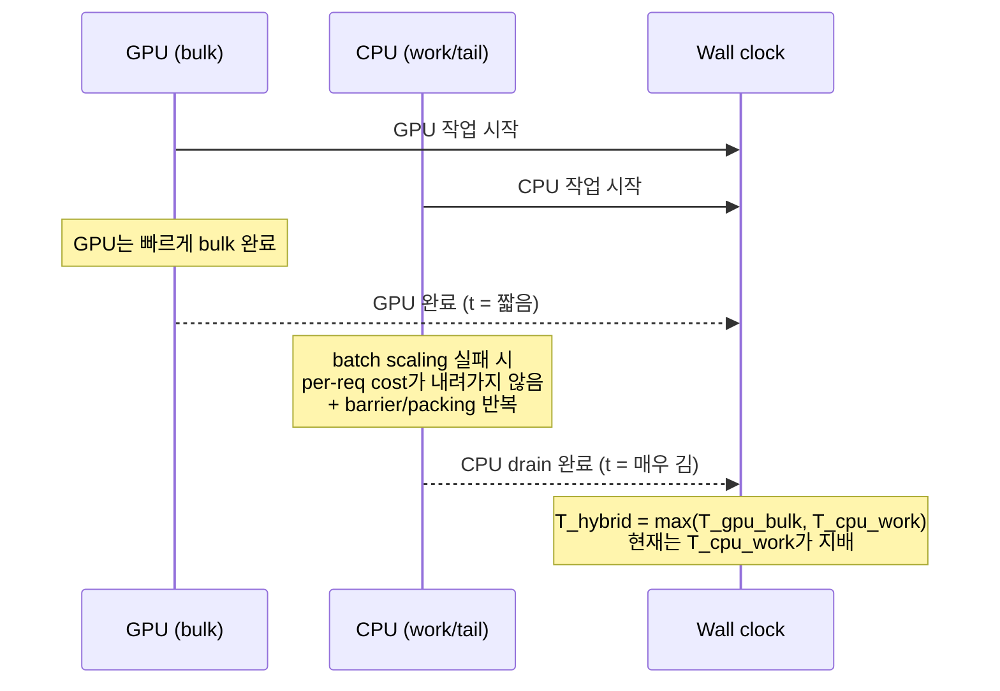

# Ninja Gap 달성을 위한 CPU/GPU Hybrid 성능개선 통합 보고서

## 요약

현재 목표인 **Ninja Gap**(Hybrid가 GPU-only보다 빠름)은, 단순히 CPU 단일 요청(latency)을 조금 줄이는 수준으로는 도달하기 어렵습니다. H100×8 환경에서 **GPU-only wall ≈ 14초** 대비, request-level hybrid가 **seq=1에서도 수백 초**, seq=16에서는 **수천 초**로 악화되는 관측이 문서에 정리되어 있으며, 이는 “CPU가 느리다”라는 일반론보다 더 구체적으로 **CPU batch scaling 실패가 tail을 폭증시키는 구조적 실패**로 진단됩니다. fileciteturn0file1

두 입력 문서는 같은 결론을 공유합니다. **(a) routing/`cpu_max_num_seqs` 확대는 배치를 ‘진짜 배치’로 만들기 전에는 실패**이며, **(b) 본선은 CPU hot path의 kernel·dataflow 재설계로 batch scaling을 만드는 것**입니다. 다만 한 문서는 “가능한 최적화 카탈로그+이론 상한”에 강점이 있고, 다른 문서는 “이미 구현된 것 제외, 계측→PR→Stop/Go의 실행 규율”에 강점이 있습니다. 본 통합본은 **실행 규율(Playbook)을 본문 메인라인으로 채택**하고, **카탈로그(Comprehensive Plan)는 후보 기술의 분류·의존성·리스크 레지스터로 흡수**하여 중복을 제거했습니다. fileciteturn0file0turn0file1

외부 1차 자료(논문·공식 문서) 관점에서, LUT 기반 저비트 mpGEMM을 제시하는 T‑MAC과 NPU 쪽 3‑stage pipeline 설계를 제시하는 T‑MAN은 “저비트 및 load/vector/matrix 파이프라이닝”이라는 큰 설계 방향을 뒷받침합니다. citeturn0search0turn0search1 CPU‑draft/GPU‑verify speculative decoding을 제안하는 DuoDecoding은 “역할 재정의(경로 2)”를 병행 트랙으로 두는 근거가 됩니다. citeturn0search2 또한 KTransformers와 NEO는 CPU/GPU 협업에서 **ISA/커널·coordination·overlap**이 성능을 좌우한다는 경험적 근거를 제공합니다. citeturn1search3turn1search1turn7view0

통합 결론은 다음 한 문장으로 요약됩니다: **Ninja Gap은 ‘CPU에 더 많이 태우는’ 문제가 아니라, ‘많이 태웠을 때 비용이 실제로 싸지는’ CPU 배치 커널을 만드는 순간에 열린다.** fileciteturn0file1

```mermaid
flowchart LR
A[목표: Ninja Gap<br/>Hybrid wall &lt; GPU-only wall] --> B[G0: 계측으로 실패 원인 확정]
B --> C[G1: Hot path 연결/VNNI·pre-pack·dispatch 기록]
C --> D[G2: Batch scaling 커널<br/>Head folding·batch-aware attn·fusion·barrier 감소]
D --> E[G3: Big wins<br/>저비트(LUT/WOQ)·AVX/AMX 파이프라인]
E --> F[Routing 재평가<br/>cpu_max_num_seqs 확대는 여기서만]
B --> P[병행 트랙: CPU drafter spec decode 설계]
P -->|조건 충족 시| E
```

## 통합된 완성 문서

### 서론

본 문서는 entity["organization","vLLM","open-source llm inference engine"] 기반 **request-level CPU/GPU Hybrid**에서, “CPU를 섞었더니 더 빨라진다”는 상태(= Ninja Gap)를 달성하기 위한 **통합 마스터 플랜**입니다. 통합 대상은 (1) “기술 카탈로그/이론 상한과 단계 로드맵” 성격의 문서와, (2) “구현 상태를 반영한 실행 플레이북(+Stop/Go 규칙)” 성격의 문서 2종입니다. fileciteturn0file0turn0file1

본 통합본의 기본 가정은 두 문서와 동일합니다.

- **request-level hybrid 유지**(한 request를 CPU 또는 GPU에 배정하는 구조를 당장 폐기하지 않음). fileciteturn0file1  
- 목표는 “CPU가 더 많은 request를 처리하면서도 total wall time을 줄이는 것”이며, 성패는 routing 최적화가 아니라 **CPU batch scaling을 만드는 커널·데이터플로 설계**에 달려 있습니다. fileciteturn0file1turn0file0

### 본론

#### 목표 정의와 성능 모델

**Ninja Gap**은 “Hybrid가 GPU-only보다 빠름”으로 정의됩니다. 즉,

- Hybrid 총 wall time `T_hybrid`가
- GPU-only 총 wall time `T_gpu_only`보다 작아야 합니다. fileciteturn0file0

문서에서 제시된 기본 모델은 다음과 같습니다. (표기만 통일)

```
T_hybrid = max(T_gpu_bulk, T_cpu_work)
```

- `T_gpu_bulk`: GPU가 맡은 request들의 완료 시간(배치/오버헤드 포함)
- `T_cpu_work`: CPU가 맡은 request들의 완료 시간(= tail이 되기 쉬움) fileciteturn0file0turn0file1

따라서 Ninja Gap 조건은 **CPU가 가져간 work가 GPU-only 대비 ‘줄여준 시간’보다 더 크지 않아야** 성립합니다. 두 문서가 공통으로 강조하는 논점은, 현재 실패는 “CPU가 느림”이 아니라 **batch가 커질수록 per-request cost가 내려가지 않는 구조(= batch scaling 붕괴)**라는 점입니다. fileciteturn0file1turn0file0

#### 현 상태의 관측치 요약

H100×8 기준, 문서는 GPU-only와 hybrid의 wall 차이가 매우 크며, 특히 `cpu_max_num_seqs`를 키우면 tail이 증폭된다고 정리합니다. 예시로 Playbook은 GPU-only **14.01s** 대비 hybrid가 **seq=1에서 364–418s**, **seq=16에서 1994–2003s** 범위로 악화된 표를 제시합니다. fileciteturn0file1  
또 다른 문서는 GPU-only **14s** 대비 hybrid best가 **394s** 수준으로, 대략 **수십 배 격차**를 언급합니다. fileciteturn0file0

이 상이한 수치는 “결론이 다르다”기보다 **런/설정/로그 컷 기준 차이로 추정되는 동일 현상(= GPU는 짧게 끝나는데 CPU tail이 wall을 지배)**을 가리킵니다. 따라서 통합본에서는 **Playbook의 표를 ‘기준선(ground truth 후보)’로 채택**하되, **G0 계측 단계에서 숫자 재확정**을 필수로 둡니다. fileciteturn0file1turn0file0

#### 실패 구조의 통합 진단

두 문서의 진단을 하나로 합치면 다음 3단 구조로 정리됩니다.

- **표면 현상**: CPU가 request를 조금만 가져가도 wall time이 분 단위로 늘어나며, `cpu_max_num_seqs` 확대는 throughput 개선이 아니라 **tail amplification**으로 나타남. fileciteturn0file1  
- **직접 원인**: scheduler가 여러 request를 “한 batch”로 잡아도, hot path가 이를 GPU처럼 효율적인 large‑M 연산/재사용으로 바꾸지 못해, **메모리 트래픽·packing·barrier 비용이 request 수만큼 반복**됨. fileciteturn0file1  
- **근본 원인 후보(카탈로그 기반)**: (a) batch scaling 제로(캐시/타일/DDR 왕복), (b) ISA 경직(AMX/AVX 전환 부재 또는 비용), (c) dataflow 미설계(서브레이어별 독립 커널로 DDR 왕복 누적). fileciteturn0file0

이 진단은 외부 사례와도 방향이 일치합니다. entity["organization","KTransformers","cpu-gpu hybrid inference system"]는 CPU/GPU hybrid에서 **AMX 특화 커널, AVX‑512/AMX 동적 전환, coordination 오버헤드 감소, overlap(Expert Deferral 등)**가 성능을 좌우한다고 정리합니다. citeturn1search3turn7view0 entity["organization","OpenReview","research paper platform"]에 공개된 NEO 역시 CPU offload 기반 hybrid에서 **asymmetric GPU‑CPU pipelining과 load‑aware scheduling**을 핵심으로 제시합니다. citeturn1search1



#### 통합 설계 원칙

통합본은 Playbook의 “실행 규율”을 기준으로, 다음 원칙을 명시합니다.

- **이미 구현된 것**은 “향상분”으로 재계산하지 않는다(중복 성과 산정 금지). fileciteturn0file1  
- **계측(G0)이 먼저**이며, 계측이 끝나기 전에는 routing 확대, `cpu_max_num_seqs` 확대를 기본 전략으로 채택하지 않는다. fileciteturn0file1turn0file0  
- 외부 논문의 speedup을 “곱셈”으로 약속하지 않는다. 다만 “어떤 설계 방향이 가능성이 있는지”에 대한 **구조적 근거**로 사용한다. fileciteturn0file1turn0file0

#### 통합 실행 계획

통합본은 “Gate(G0~G3) + Tier(계측→hot path→batch scaling→big wins→routing)”를 하나의 메인라인으로 묶고, “역할 재정의(경로 2)는 병행 트랙”으로 유지합니다. fileciteturn0file1turn0file0

**G0: 기준선 분해(계측 재정의)**  
- `num_seqs=1/2/4/8/16` sweep을 고정하고 CPU-only와 hybrid CPU 엔진을 동일 schema로 저장. fileciteturn0file1  
- attn/mlp coarse hook을 QKV/O/Gate/Up/SiLU/Down/Norm 수준으로 확장, barrier/sync·packing·memory wait marker 추가. fileciteturn0file1  
- 산출물: `batch_scaling_ratio`, `per_req_cost`, sublayer top bottleneck, num_seqs 증가 시 폭증 sublayer. fileciteturn0file1  

**G1: Mainline hot path 연결(‘존재’가 아니라 ‘사용’ 확인)**  
- VNNI/ISA 토대를 실제 decode hot path에 연결하고, load-time pre-pack 및 shape별 dispatch 로그를 남김. fileciteturn0file1  
- 성공 조건: “hot path가 바뀌었다”는 로그/marker + `num_seqs=4`에서 per‑request cost 감소. fileciteturn0file1  

**G2: 진짜 batch scaling 커널/dataflow**  
- Head folding / batch-aware decode attention / QKV·Gate-Up fusion / barrier 감소를 profiler 우선순위대로 착수. fileciteturn0file1turn0file0  
- 성공 기준의 핵심은 “CPU handled req 증가”가 아니라, **request 증가가 data reuse와 larger‑M 효율로 변환**되는지 여부. fileciteturn0file1  

**G3: Big wins(저비트·파이프라인) + routing 재평가**  
- LUT 기반 저비트 path(예: T‑MAC류) 및 AVX/AMX 파이프라인형 설계(cascade)를 prototype으로 검증. fileciteturn0file0turn0file1  
- 이 구간은 외부 근거가 있으나 환경 이식성이 불확실하므로, **강한 가설**로 리스크 관리합니다. LUT 기반 mpGEMM이 저비트에서 dequantize overhead를 줄이고 throughput을 올린다는 점은 T‑MAC이 1차로 주장합니다. citeturn0search0turn0search4 load/vector/matrix를 겹치는 3‑stage pipeline 설계는 T‑MAN이 NPU 환경에서 제시합니다. citeturn0search1turn0search9

**병행 트랙: 역할 재정의(경로 2) — CPU drafter speculative decoding**  
- Playbook은 mainline과 분리하여 병행 트랙으로 두며, Comprehensive Plan은 “Stage C 결과가 부족할 경우 가장 현실적인 2차 레버”로 둡니다. fileciteturn0file1turn0file0  
- CPU draft/GPU verify를 병렬화하는 DuoDecoding은 generation latency 개선과 TTFT 감소를 보고합니다. citeturn0search2  
- 단, vLLM의 speculative decoding은 기능적으로 존재하지만(문서화), 현재 구현이 곧바로 “CPU drafter + GPU verifier” 구성인지, 또는 proposer/engine 분리 수준이 충분한지는 코드·아키텍처 점검이 필요합니다. citeturn2search14turn2search2turn2search6

### 결론

Ninja Gap 달성의 핵심은 “CPU에 할당을 더 늘리는 라우팅”이 아니라, **CPU가 여러 request를 함께 잡았을 때 per‑request cost가 실제로 내려가는 커널/데이터플로를 만드는 것**입니다. 따라서 본 통합본은 (1) 계측으로 병목을 확정(G0), (2) hot path가 진짜로 바뀌는 연결(G1), (3) batch-aware attention·head folding·fusion·barrier 감소로 scaling을 생성(G2), (4) 저비트 및 파이프라이닝의 big wins와 함께 routing을 재평가(G3)라는 순서를 메인라인으로 고정합니다. fileciteturn0file1turn0file0

동시에, 경로 1의 수렴 속도가 기대에 못 미칠 가능성을 대비해, CPU drafter speculative decoding을 **설계 차원에서 병행**합니다. DuoDecoding이 제시하는 CPU‑draft/GPU‑verify의 효과는 “역할 재정의로 `T_cpu_work`의 의미를 바꿔 tail을 약화시키는” 방향의 근거가 됩니다. citeturn0search2

## 파일별 요약 및 비교 표

요청은 “입력 파일 수/형식 불특정”을 전제로 하나, **현재 대화에 제공된 입력은 2개(.md)**뿐입니다. PDF·DOCX·이미지 스캔 등 다른 형식의 원문이 있다면, 본 통합은 그만큼의 정보가 누락된 상태로 수행된 것입니다(불확실성 목록에 반영). fileciteturn0file0turn0file1

| 파일명 | 형식 | 스타일·어조·목적 | 핵심 주장(thesis) | 주요 근거·증거 | 데이터/수치 | 인용·출처 | 중복 내용 | 모순/긴장 | 권장 처리 |
|---|---|---|---|---|---|---|---|---|---|
| 20260415_094130_claude_ninja_gap_comprehensive_plan.md | .md | 기술 기획서/설계 제안서(카탈로그+이론 상한+단계 로드맵) | Ninja Gap은 **경로 1(CPU 자체 가속)**과 **경로 2(역할 재정의, spec decode 등)**의 누적으로 달성 가능하며, 특히 **batch scaling 선행이 필수** | H100×8 실측을 기반으로 실패 모델(3겹 실패) 제시, 기법별 구현 상태 audit, 누적 이득의 이론 상한 계산 | GPU-only 14s, hybrid_best 394s, seq=16 wall 2098s, batch=1/16 step ms 비교 등 | T‑MAC, T‑MAN, DuoDecoding, KTransformers, SparAMX, NEO 등(웹 링크 포함) | Ninja Gap 정의, batch scaling 우선, staging/Stop-Go, spec decode 병행 | (a) baseline 수치가 Playbook과 다름, (b) 외부 speedup을 누적 곱으로 제시하는 서술이 “보장”처럼 읽힐 위험 | Playbook 규율 아래 **‘후보 기술 카탈로그+리스크 레지스터’로 흡수**, 이론 상한은 “가설”로 격하하고 G0/G1 실측 기반으로 갱신 fileciteturn0file0 |
| 20260415_094148_codex_ninja_gap_modification_playbook.md | .md | 실행 플레이북/PR 계획/Stop-Go 규칙(구현 상태 반영) | 목표 달성의 본선은 routing이 아니라 **CPU batch scaling을 만드는 hot path 변경**이며, **이미 구현된 것 제외**, **계측→hot path 연결→batch scaling kernel→routing 재평가** 순으로 진행 | H100×8 GPU-only vs hybrid 악화 표, “실패 구조” 정의, Gate(G0~G3), PR 순서, Stop/Go case 정의 | GPU-only 14.01s, hybrid seq=1 364–418s, seq=16 1994–2003s 등 | KTransformers, T‑MAC/T‑MAN, SparAMX, NEO, DuoDecoding 등(근거 사용 원칙 포함) | Ninja Gap 정의, batch scaling 우선, spec decode 병행은 분리 | Claude 문서의 일부 수치/게이트를 “확정이 아닌 방향성”으로 재해석 | **통합본의 메인라인(규율)으로 채택**, Claude 문서는 보조 근거와 후보군으로 편입 fileciteturn0file1 |

## 중복·모순 해결 원칙과 결정

통합에서의 가장 큰 중복은 “문제 정의/성공 지표/단계 순서”이며, 가장 큰 모순은 “기준선 수치”와 “예상 gain 산정 방식”입니다. fileciteturn0file0turn0file1

통합 결정은 다음과 같습니다.

첫째, **기준선 수치**는 더 최근에 “best/worst 범위”로 정리된 Playbook의 표를 기준으로 삼되, 두 문서의 차이는 오류로 단정하지 않고 **G0에서 동일 harness로 재확정해야 할 ‘측정 불확실성’**으로 취급합니다. fileciteturn0file1turn0file0

둘째, **외부 논문 speedup의 누적 곱**은 로드맵 우선순위를 정하는 참고로만 남기고, 통합본에서 “도달 가능/불가능”을 단정하는 근거로 쓰지 않습니다. 이는 Playbook이 명시한 “외부 수치를 우리 구현의 보장으로 환산하지 않는다” 원칙을 채택한 결과입니다. fileciteturn0file1

셋째, “경로 2(역할 재정의)”는 두 문서 모두 중요성을 인정하지만, 메인라인을 대체하지 않는다는 점도 공통입니다. 따라서 통합본은 **설계·아키텍처 검토는 병행하되, 구현 리소스 집중은 G2/G3의 실측 신호 후**로 둡니다. fileciteturn0file1turn0file0

넷째, “Tier 0(예: Huge Pages, WOQ)”는 low-risk 실험으로 분리하되, Linux 1GB HugeTLB는 부팅 설정/운영 제약을 동반하므로(공식 가이드에 커널 파라미터 설정 절차가 제시됨) 배포 환경에서의 실현 가능성을 G0와 별도로 확인합니다. citeturn2search3

## 주요 변경·삭제 문장 비교표

아래 표는 통합 과정에서 “중복 제거/모순 해소/표현 엄밀화”를 위해 변경된 핵심 문장만 선별한 것입니다. 원문은 길이 제한을 위해 **짧은 발췌**로 제시합니다. fileciteturn0file0turn0file1

| 출처 | 원문(발췌) | 통합본 표준문장 | 처리 | 이유 |
|---|---|---|---|---|
| Claude 계획 | “Ninja Gap: `T_hybrid < T_gpu_only`” fileciteturn0file0 | “Ninja Gap은 Hybrid wall이 GPU-only wall보다 작아지는 상태이며, 실제 조건은 `T_hybrid=max(T_gpu_bulk,T_cpu_work)`에서 `T_cpu_work`가 wall을 지배하지 않아야 한다.” fileciteturn0file0turn0file1 | 수정 | 정의는 유지하되, Playbook의 ‘tail 지배’ 관점을 포함해 판정 기준을 운영 가능하게 보강 |
| Codex 플레이북 | “CPU가 `2 req`만 가져가도 wall time이 `~6분`으로 늘어난다” fileciteturn0file1 | “CPU가 소수 request만 가져가도 wall이 분 단위로 악화되는 관측이 있으며, 이는 `cpu_max_num_seqs` 확대 시 tail amplification으로 확대된다.” fileciteturn0file1 | 유지(완화) | 수치 자체는 표로 유지하되, 통합 서술에서는 ‘관측’임을 명시해 재현성(G0) 필요성을 남김 |
| Claude 계획 | “현재 구조적 방정식… 두 가지 경로” fileciteturn0file0 | “메인라인은 경로 1(배치 커널/데이터플로)이며, 경로 2(spec decode 등)은 병행 트랙으로 설계부터 준비한다.” fileciteturn0file1turn0file0 | 수정 | 두 문서의 합의점(병행 필요, 그러나 메인라인 대체 불가)을 한 문장으로 정합 |
| Claude 계획 | “× … = ~60× → ~50ms/step” fileciteturn0file0 | “외부/추정 speedup의 누적 곱은 ‘우선순위 가설’로만 사용하며, G0/G1에서 hot path 실측으로 갱신한다.” fileciteturn0file1turn0file0 | 삭제/대체 | Playbook 원칙(외부 수치의 직접 환산 금지)을 반영해, ‘보장’처럼 읽힐 수 있는 누적 곱 서술을 통합본 본문에서 제외 |
| Codex 플레이북 | “클로드 문서의 G1/G2/G3 숫자는… 확정 수치가 아니다” fileciteturn0file1 | “Gate 임계값은 실험 통과 기준으로 쓰되, 기준선과 함께 G0에서 재보정한다.” fileciteturn0file1 | 수정 | 원문 취지를 유지하면서, 실제 운영 규칙(재보정)을 명문화 |
| Claude 계획 | “Tier 0 Huge Pages 1GB … 0.5일” fileciteturn0file0 | “HugeTLB 1GB는 low-risk 성격이지만 부팅/권한 제약이 있으므로, 실험환경 feasibility를 먼저 확인한 뒤 적용한다.” citeturn2search3 | 수정 | 공식 가이드(커널 파라미터/GRUB)를 근거로, ‘가능’과 ‘운영 가능’을 구분 |
| Codex 플레이북 | “이미 구현된 항목… gain 계산 제외” fileciteturn0file1 | “통합본은 ‘이미 구현됨/부분 구현/미구현’을 구분하고, 이미 구현된 항목은 개선 항목의 성과로 재산정하지 않는다.” fileciteturn0file1turn0file0 | 유지(확장) | Claude의 audit 표를 흡수해 상태 표기를 일관화 |
| Claude 계획 | “Spec Decode CPU Drafter … 6주” fileciteturn0file0 | “CPU drafter spec decode는 병행 트랙으로 설계하되, CPU drafter throughput·accept rate 조건을 G2/G3 신호로 확인 후 본격 구현한다(근거: DuoDecoding).” citeturn0search2turn2search14 | 수정 | spec decode의 ‘balance 조건’ 불확실성을 더 엄밀히 반영 |
| Codex 플레이북 | “Case 3. 단일 req만 빨라지고 batch scaling 없음 = 실패” fileciteturn0file1 | “성공 판정은 최소 4축(handled req↑, batch tok/s↑, tail↓, wall ratio↓) 동시 개선이며, 단일 req 최적화는 Ninja Gap 관점에서 성공으로 간주하지 않는다.” fileciteturn0file1turn0file0 | 유지 | 두 문서가 공통으로 강조하는 ‘batch scaling 우선’을 판정 규칙에 고정 |

## 남은 불확실성 및 추가 확인 필요

다음 항목은 통합 과정에서 “파일 부재/측정 불확실/외부 이식성” 때문에 **남겨둘 수밖에 없는 불확실성**입니다. 통합본은 이를 숨기지 않고, 각 항목에 대해 “확정 실험/확인 루트”를 함께 제시합니다. fileciteturn0file0turn0file1

첫째, **근거로 언급된 내부 참조 문서/노트북이 현재 입력에 없음**: 두 파일은 `HPC_breakthrough_principles v4`, `integrated_rewrite`, `analysis_h100.ipynb`, `TODO.md` 등 추가 자료를 전제합니다. 이들이 없으면 “이미 구현됨” 판정이나 특정 병목의 재현이 제한됩니다(특히 notebook 기반의 수치/그래프). fileciteturn0file1turn0file0

둘째, **기준선 수치의 단일화 필요**: 14s 대비 364–418s(Playbook)와 394s(Comprehensive Plan)의 차이는, run 설정/로그 필터링/오버헤드 포함 여부 차이일 수 있습니다. 통합본에서는 Playbook 표를 채택했지만, **G0 harness로 “동일 조건 재측정”이 완료되기 전**에는 어떤 개선도 %로 단정할 수 없습니다. fileciteturn0file1turn0file0

셋째, **WOQ(Weight-Only Quantization)·IPEX 경로의 실제 호환성**: IPEX는 WOQ qconfig 매핑 API를 제공하며, `ipex.llm.optimize`에 `quantization_config`를 넘기는 사용 예가 문서/이슈에 존재합니다. citeturn1search12turn1search20 그러나 vLLM hybrid CPU worker의 로딩/그래프/연산자 치환이 해당 경로와 충돌할지, 그리고 “성능 향상”이 아니라 “hot path가 실제로 해당 kernel로 치환되었는지”는 G1에서 로그로 증명해야 합니다. fileciteturn0file1turn0file0  
또한 GitHub 상에서 intel-extension-for-pytorch 리포지토리가 2026-03-30에 archived로 표시되는 사례가 있어, 장기 유지보수 리스크도 확인이 필요합니다. citeturn1search8

넷째, **HugeTLB 1GB의 운영 제약**: 공식 가이드는 1GB hugepage를 위해 GRUB 커널 파라미터 설정을 안내하며, 이는 컨테이너/클러스터 환경에서 권한·재부팅·메모리 조각화 문제를 동반할 수 있습니다. citeturn2search3 따라서 “0.5일 작업”은 개발 머신에서는 성립할 수 있지만, 운영 환경에서는 별도 승인/런북이 필요할 수 있습니다.

다섯째, **저비트 LUT 기반 GEMV/AVX‑AMX cascade의 이식성**: T‑MAC은 LUT 기반 mpGEMM으로 저비트 LLM에서 throughput 향상/에너지 절감을 보고하지만, 대상이 주로 edge CPU이며, Xeon+AMX+현재 vLLM hybrid 형태에 그대로 재현된다는 보장은 없습니다. citeturn0search0turn0search4 T‑MAN의 3‑stage pipeline은 NPU 환경의 DMA/vector/matrix 파이프라인이므로, x86에서 “cache-fit staging”이 실패하면 오히려 DDR 왕복이 늘 수 있다는 경고가 문서 내 가설로 남아 있습니다. citeturn0search1turn0search9 fileciteturn0file1turn0file0

여섯째, **batch-aware attention/Head folding의 적용 범위와 모델 의존성**: 예를 들어 head folding은 특정 attention 구조(예: MLA 등)에서 head 축을 GEMM으로 접어 연산 강도를 높이는 접근이 소개되지만, 통합본의 대상 모델(Qwen 계열, GQA 등)에 동일하게 적용되는지는 구현 전 검증이 필요합니다. citeturn3search1turn3search3

일곱째, **Speculative decoding의 “CPU drafter + GPU verifier” 연결 난이도**: vLLM은 speculative decoding 문서와 proposer 관련 논의가 존재하지만, 실제로 CPU 엔진을 drafter로 분리하고 GPU를 verifier로 두는 설계는 엔진 경계/동기화/accept‑reject 로직/throughput balance를 요구합니다. citeturn2search14turn2search6turn0search2

### 참고문헌

- AbouElhamayed, A. F., Dotzel, J., Akhauri, Y., Chang, C.-C., Gobriel, S., Muñoz, J. P., Chua, V. S., Jain, N., & Abdelfattah, M. S. (2025). *SparAMX: Accelerating Compressed LLMs Token Generation on AMX-powered CPUs* (arXiv:2502.12444). arXiv. citeturn0search3turn0search7  
- Jiang, X., et al. (2025). *NEO: Saving GPU Memory Crisis with CPU Offloading for Online LLM Inference*. OpenReview. citeturn1search1  
- Lv, K., Guo, H., Guo, Q., & Qiu, X. (2025). *DuoDecoding: Hardware-aware Heterogeneous Speculative Decoding with Dynamic Multi-Sequence Drafting* (arXiv:2503.00784). arXiv. citeturn0search2turn0search6  
- Red Hat. (n.d.). *HugeTLB Huge Pages 구성* (Red Hat Enterprise Linux 7 Performance Tuning Guide). citeturn2search3  
- Wei, J., Cao, S., Cao, T., Ma, L., Wang, L., Zhang, Y., & Yang, M. (2024). *T‑MAC: CPU Renaissance via Table Lookup for Low‑Bit LLM Deployment on Edge* (arXiv:2407.00088). arXiv. citeturn0search0turn0search4  
- Wei, J., Li, Q., Cao, S., Ma, L., Hao, Z., Zhang, Y., Hu, X., & Cao, T. (2025). *T‑MAN: Enabling End‑to‑End Low‑Bit LLM Inference on NPUs via Unified Table Lookup* (arXiv:2511.11248). arXiv. citeturn0search1turn0search9  
- Chen, H., et al. (2025). *KTransformers: Unleashing the Full Potential of CPU/GPU Hybrid Inference for MoE Models*. SOSP ’25. citeturn1search3turn1search17  
- KVCache.AI & Approaching AI. (2025, October 22). *Accelerating Hybrid Inference in SGLang with KTransformers CPU Kernels*. LMSYS Org Blog. citeturn7view0  
- Intel. (n.d.). *Intel Extension for PyTorch: Weight-only quantization qconfig mapping API documentation*. citeturn1search12  
- vLLM Project. (2026). *Speculative Decoding documentation* (including N‑gram speculation). citeturn2search14turn2search2  
- Claude. (2026-04-15). *Ninja Gap 달성을 위한 종합 수정 방안* [내부 문서]. fileciteturn0file0  
- Codex. (2026-04-15). *Ninja Gap Modification Playbook — 구현 상태 반영 재작성본* [내부 문서]. fileciteturn0file1