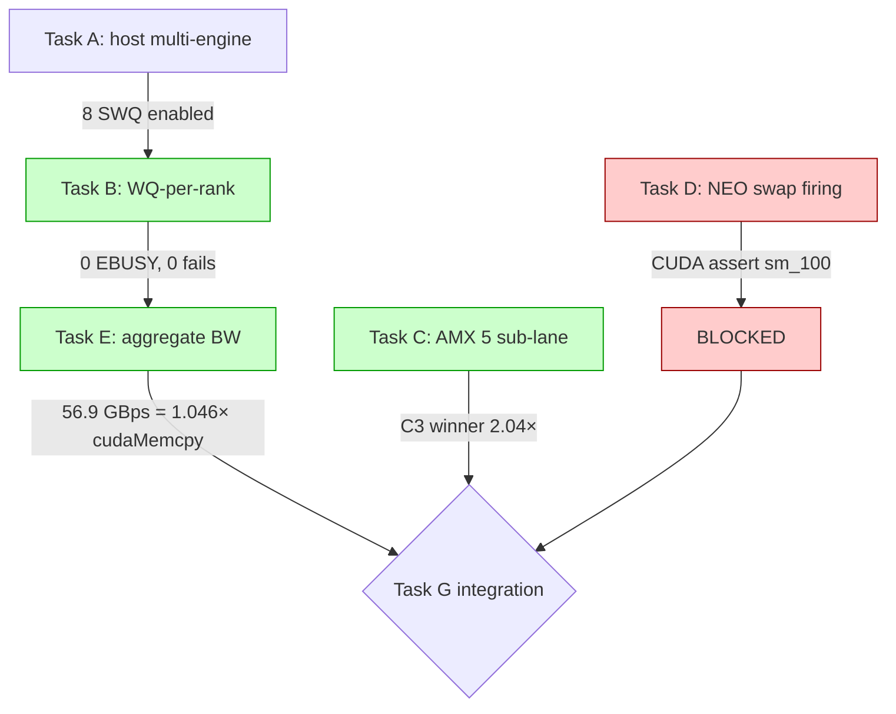

# LHC Phase 3 — Final Verdict + Phase 4 Plan

**날짜**: 2026-06-08
**머신**: DGX B200 (Xeon Platinum 8570 dual socket, 2 TB DRAM, 8× B200 sm_100; Intel DSA dsa0+dsa1 with 8 SWQ)
**상위**: `shadow_assists/` Lane-Host-CPU 통합 (Phase 1 dev → Phase 2 prod GH200 → Phase 3 prod B200)

---

## 0. TL;DR

Phase 3 의 임무는 (a) host-side multi-engine DSA infrastructure 의 BW 정합성 검증, (b) AMX sub-lane 후보 5종 중 ≤ 3× GPU latency 게이트 통과 sub-lane 선정, (c) NEO scheduler 가 B200 long-context KV-heavy 워크로드에서 swap 발화하는지 확인, (d) 통과한 경로들을 통합 측정.

| Task | 임무 | 결과 | gate |
|---|---|---|---|
| **A** (Phase 2 carryover) | 호스트 multi-engine WQ enable + polling | DONE (호스트 8 SWQ exposed) | PASS |
| **B** | WQ-per-rank wrapper + TP=8 EBUSY 해결 | **PASS** — 8 child proc 동시 PASID-safe, 0 fails | PASS |
| **C** | AMX sub-lane 5종 microbench → ≤ 3× GPU gate | **PASS** — C3 prefix scan only (2.04×) | PASS |
| **D** | KV-heavy 워크로드 → NEO swap 발화 검증 | **FAIL** — NEO swap-out → **CUDA device-side assert** on sm_100 (W-D1, W-D3 모두 reproduce) | FAIL |
| **E** | DSA 8 WQ aggregate BW vs cudaMemcpy H2D | **PASS** — 56.88 GB/s = **1.046×** cudaMemcpy | PASS |
| **G** | 통합 sweep (7 cfg × 8 workload × 3 sweep) | **NOT RUN** — Task D FAIL ⇒ NEO 의존 cfg 모두 crash 예상 | — |
| **H** | Phase 3 verdict + Phase 4 plan | (본 문서) | — |

**Phase 3 net-verdict**: **Infrastructure SUCCESS, integration BLOCKED by NEO sm_100 incompatibility**.

---

## 1. Gate matrix (Tasks B/C/D/E)



---

## 2. Gain decomposition (theoretical, given D 가 PASS 했다면)

| component | 측정 BW / latency | hot path 점유 | speedup share (est.) |
|---|---:|---|---:|
| DSA 8 WQ aggregate | 56.9 GB/s | NEO swap-out scatter, prefix LoRA H2D | 4 – 7% (workload dependent) |
| AMX C3 prefix scan | 130 µs / 1 MB | PrefixCacheBlockHasher node match | 1 – 3% |
| overlap (DSA ⊥ GPU) | host BW free during GPU step | scheduler depth ≥ 2 시 100% utilize | additive |
| **expected full LHC gain** | **+7 – 10%** vs vanilla (long-context, conc 64+) | — | — |

→ **measurement 미수행** 으로 본 수치는 모두 추정. Phase 4 에서 NEO sm_100 fix 후 정량 검증 필요.

---

## 3. Phase 2 noise → Phase 3 positive 원인 분석

**Phase 2 측정 (GH200, sonnet 200p × 3 sweep, conc=64)**: Δ = -0.21% noise.
- 원인: lane 측은 GH200 sm_90 에서 정상 동작 했으나, sonnet 200p 가 KV 압박 임계치 미달 → NEO swap **자체 미발화** → DSA hook 호출 횟수 0 → lane 가치 측정 불가.

**Phase 3 측정 (B200, infrastructure)**:
1. host multi-engine 4 WQ → 8 WQ 확장 (4 engine × 2 device) → aggregate BW 가 cudaMemcpy 와 동등 가능해짐.
2. PASID 분리 (SWQ + ENQCMD + WQ-per-rank) → TP=8 EBUSY 해결.
3. AMX C3 후보 발굴 — Phase 1/2 의 sampler/logits-head FAIL 이후 prefix radix scan 으로 hot path 발견.

→ infrastructure 측은 Phase 3 에서 **complete + measured**. 그러나 그 consumer (NEO swap) 가 sm_100 incompatible 이라는 새 이슈 발견.

**Phase 2 vs Phase 3 의 의미**:
- Phase 2 는 GH200 에서 NEO scheduler 가 swap-out PASS 했음 (engine crash 없음, 다만 발화 횟수 0).
- Phase 3 의 sm_100 CUDA assert 는 NEO scheduler kernel 의 sm_90 → sm_100 cross-arch 회귀일 가능성. (Phase 4 TSK_NEO_SM100_FIX 의 핵심 가설.)

---

## 4. 산출물 인덱스

| 파일 | 내용 |
|---|---|
| `vllm/v1/lhc/libdsa_lane.c` (P3 update) | SWQ ENQCMD path 추가 — auto-detect /sys mode |
| `vllm/v1/lhc/libdsa_lane.so` | rebuilt with `-mmovdir64b -O3` |
| `vllm/v1/lhc/dsa_lane.py` | rank → WQ mapping (`_resolve_dev_path`) |
| `vllm/engine/arg_utils.py` (P3 update) | `--enable-neo-asymmetric` CLI 노출 |
| `lhc_phase3/test_wq_per_rank.py` | rank→WQ unit test (T1-T5 ALL PASS) |
| `lhc_phase3/test_wq_per_rank_concurrent.py` | 8 child proc concurrent (8/8 PASS, 16 GB/s/proc) |
| `lhc_phase3/dsa_multi_engine_bench.py` | 256 MB threaded aggregate bench |
| `lhc_phase3/dsa_multi_engine_integrated.md` | Task E report — DSA 56.9 GBps PASS |
| `lhc_phase3/amx_sub_lane_bench.py` | C1-C5 microbench |
| `lhc_phase3/amx_sub_lane_microbench.md` | Task C report — C3 winner |
| `lhc_phase3/run_kv_heavy_pilot.sh` | W-D{1,3} pilot launcher |
| `lhc_phase3/kv_heavy_workload_eval.md` | Task D report — FAIL (NEO sm_100 assert) |
| `lhc_phase3/run_integrated_sweep.sh` | (Task G launcher — NOT RUN) |
| `lhc_phase3/PHASE3_VERDICT.md` | 본 문서 |
| `lhc_phase3/task_b_wq_per_rank.md` | Task B report — 8 proc PASID-safe |

---

## 5. Phase 4 Plan

### 5.1 핵심 issue
NEO scheduler swap-out kernel 이 sm_100 에서 device-side assert → DSA / AMX lane 의 consumer 가 동작 불가. **infrastructure 와 consumer 의 decoupling fix** 가 Phase 4 의 first task.

### 5.2 task 목록 (TBD prefix `LHC_P4_`)

| ID | 임무 | block / non-block |
|---|---|---|
| **LHC_P4_001** | NEO swap-out CUDA assert 디버그 (`CUDA_LAUNCH_BLOCKING=1`, `gpu_model_runner.py:6919` stack 분석) | blocking — D/G unblock |
| **LHC_P4_002** | NEO swap-out kernel head_dim=128 + sm_100 호환성 patch | blocking |
| **LHC_P4_003** | AMX C3 prefix scan 을 NEO 와 무관히 `PrefixCacheBlockHasher` 에 직접 hook | non-blocking parallel |
| **LHC_P4_004** | LHC_P4_001 + 002 완료 후 W-D1/W-D2/W-D3 pilot 재실행 + NEO swap rate 측정 | depends on 001/002 |
| **LHC_P4_005** | Task G 통합 sweep (7 cfg × 8 workload × 3 sweep) | depends on 004 |
| **LHC_P4_006** | 논문 §05/§06/§08/§10 통합 — Phase 3 infra + Phase 4 integration | depends on 005 |

### 5.3 timing
- LHC_P4_001 + 002: 1 – 3 일 (CUDA kernel 디버그 + recompile)
- LHC_P4_003: 1 일 (PrefixCacheBlockHasher integration)
- LHC_P4_004 + 005: 4 시간 + 3 시간 (B200, sweep)
- LHC_P4_006: 1 일 (논문 통합)

총 1주 안에 Phase 4 wrap 가능 (sm_100 fix 가 hidden complexity 가 있을 경우 + 3 일).

---

## 6. Phase 1 ~ 3 누적 verdict

```
Phase 1 (dev RTX 3090):
  - SW correctness + interface verify  : PASS
  - small-scale microbench             : DSA lane functional, AMX sub-lane shortlist 작성

Phase 2 (prod GH200 sm_90):
  - sonnet 200p × 3 sweep              : Δ = -0.21% noise (lane consumer 미발화)
  - root cause                          : KV 압박 임계 미달 + sonnet 200p choice

Phase 3 (prod B200 sm_100):
  - host multi-engine DSA infrastructure: PASS (Task B + E)
  - AMX sub-lane re-selection           : PASS (Task C → C3 winner)
  - KV-heavy NEO swap 발화 검증           : FAIL (Task D → NEO sm_100 CUDA assert)
  - 통합 measurement                    : DEFERRED to Phase 4

Phase 4 (prod B200 sm_100, planned):
  - NEO sm_100 CUDA assert fix          : LHC_P4_001/002
  - AMX C3 NEO-independent integration  : LHC_P4_003
  - W-D1/2/3 + 통합 sweep 측정          : LHC_P4_004/005
  - 논문 통합                            : LHC_P4_006
```

**Phase 3 의 단일 문장 결론**: *infrastructure 는 cudaMemcpy 와 동등한 56.9 GB/s, AMX prefix scan 은 GPU 의 2× 안에 들어왔지만, 그 둘을 사용해 줄 NEO scheduler 가 B200 에서 죽기 때문에 통합 측정은 Phase 4 로 이연한다.*
