# CPU Shadow Assists — New Idea 통합 설계

> ★ **production-ready entry point**: [`/spec_decoding/README.md`](../spec_decoding/README.md) — **Trident core** (SuffixDecoding + cudagraph PIECEWISE + gmu=0.80, always-on) / **AGSD** (Trident core + workload/model-size gating) 의 활성화 코드 + Llama-70B 6-workload all-fair benchmark (sonnet +52.1% / chat +68.9% / code +18.8% / mix +45.6~+62.8%, SUB_093 2026-05-25 KST). 본 문서는 ideation / SUB 계보 / Mermaid trace 의 단일 출처.

## Part I · 왜 이 문서가 다시 필요한가

세 번의 기각이 쌓였다. X (CPU async executor) 는 same-req 중복 compute 로 sync 대비 절반 throughput, B2 (heavy workload CPU decode shadow) 는 -96%, B3 (Meta-scheduling Gateway) 는 우리 포크의 차별점과 직교, B1 (Inverted Control Plane) 은 Blink 논문의 재구성에 가까워 독자 기여가 얇았다. 네 시도의 공통 실패 원인은 "가설이 크지만 우리만의 고유 지점이 없었다" 는 것이다.

`super_power/ideation/cpu_idle_acceleration_ideation_20260421.md` 를 다시 읽으면 이 문제의 해결 단서가 §2 (새 아이디어 8가지) 와 §4 (논문 지형의 빈 공간 4가지) 에 이미 놓여 있다. 이 문서는 그 8가지를 한 곳에 묶되, **직접 대응 논문이 없어 우리만의 독자 기여가 되는 것**과 **기존 연구의 적용·조합·역전으로 가치가 나는 것** 두 축으로 분리해 정리한다. 어느 쪽이 옳은지는 지금 판정할 수 없다. 각 축의 성격이 다르고, 추진 순서도 다르다.

독창 쪽은 **돌파 가치가 크나 근거가 얇다**. 선행 연구 적용 쪽은 **이득 범위가 알려져 있으나 우리 포크에서 고유성이 낮다**. 두 축을 동시에 운영하되, 공통 전제인 profile (현재 workload 에서 어느 CPU 유휴 구간이 실재하는지) 을 먼저 확정한 뒤 각 아이디어의 진입/기각이 결정된다.

## Part II · 독창 축 — 직접 대응 논문 없음

### 2.1 · CPU-assisted 동적 배치 planner (`IDE_001`)

vLLM scheduler 는 GPU 주 프로세스의 Python thread 에서 돈다. 매 step `scheduler.schedule` + metadata 조립 (position ids, attention mask, rope cache) 이 GPU forward 의 앞에 걸린다. 유휴 상태의 **CPU 측 연산 자원** (worker-side CPU compute path) 이 **다음 step 의 batch 구성과 metadata** 를 미리 만들어 GPU 에 건네면 scheduler 비용을 hide 한다. 방향은 Blink 와 같지만, **scheduler 오프로드 타깃을 본 포크의 worker-side CPU compute path 로 특정**한다는 점이 차별점.

- 이론적 근거 — [vLLM anatomy blog (2025-09-05)](https://blog.vllm.ai/2025/09/05/anatomy-of-vllm.html) 의 "CPU-bound output processing" 지적, [APEX (arXiv 2506.03296)](https://arxiv.org/abs/2506.03296) async overlap 원리
- 리스크 — X 의 실패 패턴 (lookahead 중복 dispatch) 을 반복하지 않으려면 정확성 계약 선행
- 진입 조건 — baseline 동기 profile 의 step total 에서 scheduler+metadata 구간이 ≥ 10% 확인

### 2.2 · CPU prefill-assist for medium context (`IDE_002`)

128 토큰 단문에선 GPU prefill 이 빠르다. 그러나 512~2K 중간 구간에선 GPU 가 prefill-compute-bound 가 되고 CPU 는 유휴로 남는다. 이 구간에 CPU 가 **초기 1~2 layer embedding / position encoding / rope table** 을 미리 준비해 GPU prefill TTFT 를 단축한다. prefill disaggregation 자체는 [DistServe (arXiv 2401.09670)](https://arxiv.org/abs/2401.09670) 에 있지만 GPU-GPU 분리만 다루고, **CPU 가 GPU prefill 을 보조하는 구조는 공개 연구에 직접 대응이 없다**.

- 리스크 — 근거 등급 D. 실측 전에는 이득 크기 불명
- 진입 조건 — medium context workload (512~2K) 에서 GPU prefill 이 실제로 compute-bound 이고 CPU 가 유휴임을 프로파일로 확인

### 2.3 · CPU Background Compiler (`IDE_003`)

§06 의 load-time Q8_0 변환은 이미 있지만, runtime 중에도 CPU 는 대부분 유휴다. 이 유휴 시간에 다음 layer 의 weight layout 을 **AMX-friendly tile packing** 하거나, activation 범위 통계를 계속 수집해 **다음 batch 의 동적 quantization scale** 을 업데이트한다. 공개 연구의 quantization 파이프라인은 "offline pre-pack" 이거나 "일회성 calibration" 이며, **runtime 중 CPU 가 지속적으로 다음 단계를 준비하는 online incremental 구조는 직접 대응이 없다**.

- 이론적 근거 — [APEX](https://arxiv.org/abs/2506.03296), [Async KV Prefetch (arXiv 2504.06319)](https://arxiv.org/abs/2504.06319) 의 "PCIe prefetch" 원리를 compute 쪽으로 확장
- 리스크 — D. quantization 정합성 유지 비용이 이득을 초과할 수 있음

### 2.4 · GPU-idle-phase CPU Burst (`IDE_004`)

Decode step 내부에서 GPU 는 phase 를 번갈아 탄다. attention (memory-bound) 구간에선 GPU 연산기가 놀고, linear matmul (compute-bound) 구간에선 memory 가 논다. 이 **sublayer phase 에 맞춰 CPU 가 서로 다른 보조 작업** 을 수행한다.

| GPU phase | CPU 작업 후보 |
|---|---|
| attention (memory-bound) | 다음 step scheduling, detokenize, grammar update |
| linear (compute-bound) | KV prefetch/evict, speculative draft, logits post-process |

[NEO (arXiv 2411.01142)](https://arxiv.org/abs/2411.01142) 의 asymmetric pipeline 을 **sublayer phase 단위로 세분화** 하는 연구는 공개된 것이 없다.

- 리스크 — D. sublayer 수준 정확한 phase 경계 검출과 CPU 작업 스위칭 오버헤드 필요
- 진입 조건 — GPU phase timing 을 step 내부에서 안정적으로 감지 가능한지 프로파일로 확인

## Part III · 선행 연구 적용 축

### 3.1 · CPU drafter + GPU verifier (`IDE_005`)

[Dovetail (arXiv 2412.18934)](https://arxiv.org/abs/2412.18934) 은 약한 GPU + 강한 CPU 환경에서 "CPU=target / GPU=drafter" 로 갔다. 우리는 정반대 — 강한 GPU + 유휴 CPU. 동일 논리를 역전해 CPU 가 작은 drafter (예: Qwen2.5-0.5B Q8_0) 를 돌리고 GPU 가 32B verifier 를 돌린다. single-request 로 보면 CPU drafter 가 느려 이득 없다는 것이 기존 §18 NinjaGap 에서의 판정이었고, 여기서 새 각도는 **여러 request 를 큐로 다중화**해 CPU drafter 의 느림을 request 수로 상쇄한다.

- 선행 연구 — [Leviathan et al. (arXiv 2211.17192)](https://arxiv.org/abs/2211.17192) spec decode 원전, [EAGLE (arXiv 2401.15077)](https://arxiv.org/abs/2401.15077) / [Medusa (arXiv 2401.10774)](https://arxiv.org/abs/2401.10774) tree draft, [DuoDecoding (arXiv 2503.00784)](https://arxiv.org/abs/2503.00784)
- 리스크 — 근거 B. 본 포크 구조로 옮길 때 정확도 영향과 수락률이 측정 필요

### 3.2 · Cold-KV CPU Partial Attention (`IDE_006`)

**상세 설계·리스크·진입 조건·코드 연계 지점은 단일 출처 [`shadow_assists/features/IDE_006/README.md`](features/IDE_006/README.md) 가 담당한다**. 본 절은 상위 맥락에서의 요약만 둔다.

1 차 정의 "CPU-side Cold KV staging" 은 기각되었다. 인용했던 [InfiniGen (arXiv 2406.19707)](https://arxiv.org/abs/2406.19707) / [LMCache (arXiv 2510.09665)](https://arxiv.org/abs/2510.09665) / [Mooncake (arXiv 2407.00079)](https://arxiv.org/abs/2407.00079) 의 cold-KV 저장 기능은 이미 vLLM 업스트림에 들어와 본 포크에도 inherit 되어 있다 (`vllm/v1/kv_offload/`, `vllm/distributed/kv_transfer/kv_connector/v1/offloading_connector.py`, `vllm/distributed/kv_transfer/kv_connector/v1/lmcache_integration/` ≈ 수 kLOC). `--kv-transfer-config` 로 켜지는 **운영 결정** 수준이지 신규 구현 대상이 아니다.

2 차 정의는 **cold KV 블록 위에서 CPU partial-attention worker 가 partial attention 을 직접 수행**하는 구도다. LMCache / OffloadingConnector 가 cold KV 를 CPU DRAM 으로 내려 둔 상태를 활용하되, GPU 로 다시 끌어올리는 대신 **CPU 측에서 cold 블록에 대한 Q·Kᵀ softmax + V 가중합과 LSE 를 계산**해 `(partial_output, LSE)` 만 GPU 로 전송한다. GPU 는 hot KV 의 partial output·LSE 와 **online softmax** 로 합산한다. 합산은 vLLM 내부에 이미 존재하는 prefix/suffix attention merge 경로(`csrc/attention/merge_attn_states.cu`, `vllm/v1/attention/backends/flash_attn.py:967` 및 `:1214`) 를 재사용한다.

3 차 재정의 (2026-04-28) 는 worst case 보장을 추가한다 — CPU partial 결과가 deadline 안에 도착하지 못한 layer 는 GPU 가 cold 영역 포함 full attention 으로 fallback 하여 throughput 하한이 GPU only 와 *동등 이상* 으로 보장된다 (`TSK_011`).

> **prod 측정 사실 (2026-04-29)** — `TSK_009` fix v4 의 6 회차 통합 검증 결과 (`eval/results/20260429_043734_*_tsk009_validation/`, 100 prompts × Llama-3.3-70B + TP=8 × 3 시나리오 input_heavy/output_heavy/equal × B/C):
>
> - **invariant 1 (속도)**: C (cold-tier ON, IDE_006 ON) wall-time / B (cold-tier ON, IDE_006 OFF) = 1.078×~1.103× — partition path 가 baseline 보다 7~10% 느림 (잔여 cost = cold path setup 의 GPU sync 비용). 사용자 결정 acceptable.
> - **invariant 2 (CPU 활용)**: layer 별 `merged` (= partition merge 진입) / `dropped` (= CPU 결과 미도착 폐기) 비율이 **모든 시나리오에서 merged 0.00%**. 즉 *layer-안 partition path 만으로는 CPU partial 작업이 전혀 활용되지 못함*.
>
> 원인 = `partial = softmax(Q · Kᵀ_cold) · V_cold` 의 **Q dependency** — Q 는 그 layer 의 QKV projection 후 결정되므로 future submit ~ poll 시점이 layer-안 microsecond 단위. CPU partial (~6.4 ms) 이 GPU hot attention (~0.6 ms) 의 busy window 안에 *절대 fit 못 함*. fallback 으로 throughput 하한 동등은 보장되지만 *향상 자체는 0%*.
>
> 의미 있는 향상의 *진짜* 영역은 **`TSK_012` (decode-time cold-blocks GPU reload + 진짜 evict)** — vLLM 의 OffloadingConnector 가 *현재 mirror only* (cold blocks 가 GPU pool 에 그대로 잔류) 라 GPU 는 항상 paged FA full 가능. 즉 CPU partial 결과는 *어차피 GPU 가 자기 계산할 수 있는* 영역에서는 무용. **CPU partial 이 의미 있게 활용되는 *유일* 조건** = cold blocks 가 *진짜 GPU pool 에서 free* (evict) 되어 GPU 가 cold attention 을 *진짜로 못 함* + reload 필요. 그 시점에 CPU partial 결과가 *reload 의 대체* 로 가치. 이건 `TSK_012` (decode-time reload + 진짜 evict 정책 통합) 의 영역.
>
> `TSK_005` (cross-layer pipeline) 는 *기각* — layer N+1 의 cold partial 을 layer N 진행 동시에 시작해도 layer N+1 attention 진입 시점에 *진짜 Q 가 GPU 에 이미 있음* → GPU 가 paged FA full 가능 → CPU 결과 무용. `Q dependency + GPU 가 진짜 Q 가지면 CPU 결과 무용` 의 fundamental dilemma 는 layer-안이든 cross-layer 든 동일.

- 선행 연구 — [NEO (arXiv 2411.01142, OpenReview umgy9tWBLA)](https://openreview.net/forum?id=umgy9tWBLA) 가 가장 가깝다. [CachedAttention (USENIX ATC'24)](https://prongs1996.github.io/assets/pdf/CachedAttention.pdf) 다계층 KV reuse 도 인접 영역
- 독자 기여 (좁게) — **vLLM native cold-tier offloading (LMCache / OffloadingConnector) 에 이미 내려간 KV 를 GPU reload 없이 CPU 에서 partial attention 으로 소비하고, vLLM 내부 LSE merge 경로로 합산하는 구조** 는 공개 연구·상용 시스템에서 직접 대응이 확인되지 않았다
- 근거 등급 — C. 현재 workload (128/128) 기여 — 0 (cold KV 미발생). 가치 성격 — 장기 (long-context 전환 후) + 독자 기여
- 리스크·진입 조건·수정 범위·data flow — [IDE_006 README](features/IDE_006/README.md) §5·§6·§8·§9 참조. 핵심 변화점: (i) merge 커널은 재사용하되 **네 축 통합** 필요 — (1) scheduler / attention metadata, (2) flash_attn 호출부, (3) LSE-반환 CPU kernel, (4) OffloadingConnector worker scope lock, (ii) 기존 `cpu_attn.py:261-293` forward 는 LSE 미반환이라 as-is 재사용 불가, (iii) **mid-layer synchronization 의 fundamental 한계 — prod 측정 (`TSK_009` fix v4) 으로 발현 입증. cold blocks 가 GPU mirror 에 잔류하는 한 GPU 는 paged FA full 가능 → CPU partial 결과 무용. CPU partial 이 의미 있게 활용되는 영역은 cold blocks 가 *진짜 evict* 되는 시점 (`TSK_012`) 의 reload 대체로만**, (iv) 초기 scope lock (BF16/FP16, non-FP8, non-MLA, full attention, 단일 KV group) 과 overlap 가능성이 진입 조건에 명시

### 3.3 · CPU Speculative Logits Rerank (`IDE_007`)

GPU 가 top-k logits 를 출력하고 sampling 직전에, CPU 가 **양자화된 보조 모델의 last few layers** 만으로 logits 를 재평가. 두 결과가 합의하면 빠른 sampling, 불일치면 GPU 재확인. [EAGLE / Medusa](https://arxiv.org/abs/2401.15077) 계열 draft model 의 역방향.

- 리스크 — D. 정확도 영향 평가 필수. 근거 약함
- 우선순위 — 하위. 실측 전 진입 불가

### 3.4 · Constrained Decoding 전담 CPU Worker (`IDE_008`)

JSON mode / 함수 호출 / regex 제약 같은 **constrained decoding** 에서는 매 step grammar state update + token mask 계산이 CPU-bound 다. 본 포크의 **worker-side CPU compute path 1 개** 를 "grammar/constraint 전용 워커" 로 재정의하고 일반 요청은 GPU, constrained 요청은 CPU 가 mask 계산 + GPU 가 masked sampling 으로 처리.

- 선행 연구 — [XGrammar](https://blog.mlc.ai/2024/11/22/achieving-efficient-flexible-portable-structured-generation-with-xgrammar), [Guiding LLMs The Right Way (arXiv 2403.06988)](https://arxiv.org/abs/2403.06988), [llama.cpp grammar](https://github.com/ggml-org/llama.cpp)
- 한계 — workload 특이. 일반 텍스트 생성엔 기여 0
- 가치 성격 — 특정 워크로드 전용의 운영 기능

## Part IV · 우선순위 판단

| ID | 아이디어 | 축 | 근거 등급 | 현재 workload 기여 | 장기 가치 | 진입 조건 |
|---|---|---|:---:|:---:|:---:|---|
| `IDE_001` | 2.1 CPU-assisted planner | 독창 | C | 가능성 있음 | 중 | profile 에서 scheduler+metadata 비중 ≥ 10% |
| `IDE_002` | 2.2 CPU prefill-assist (medium) | 독창 | D | medium ctx 한정 | 중 | 512~2K 에서 GPU compute-bound 확인 |
| `IDE_003` | 2.3 CPU Background Compiler | 독창 | D | 불명 | 중 | quantization 정합성 유지 가능성 확인 |
| `IDE_004` | 2.4 Phase-aware CPU Burst | 독창 | D | 불명 | 높음 | sublayer phase 경계 감지 가능성 확인 |
| `IDE_005` | 3.1 CPU drafter + GPU verifier | 적용 | B | 가능성 있음 | 높음 (구조적) | 다중화 request 큐 가정 성립 확인 |
| `IDE_006` | 3.2 Cold-KV CPU Partial Attention | 적용 | C | 0 (128/128) | 높음 (long-ctx + 독자 기여) | **활성 (3차 재정의)** — TSK_001 완료 / TSK_002·003·004 활성 / **TSK_011 코드 land + sweep 결과 land 2026-04-28 — fallback throughput 하한 보장 입증, D-ii 봉합 한계 입증으로 TSK_012 (decode reload) 분리 발급**. 다음 게이트: TSK_012 land → TST_012 D-ii 정량 → TST_002 throughput sweep (상세: [`features/IDE_006/`](features/IDE_006/README.md)) |
| `IDE_007` | 3.3 Speculative logits rerank | 적용 | D | 불명 | 낮음 | 정확도 영향 측정 |
| `IDE_008` | 3.4 Constrained decoding worker | 적용 | B | workload 특이 | 중 (특수) | constrained workload 시점 |

두 축은 다른 순서로 진행한다. **독창 축은 profile 을 선행 관문으로 공유**한다 (2.1 의 scheduler 비중, 2.2 의 medium-ctx GPU compute 비중, 2.4 의 sublayer phase 감지 가능성). 한 번의 profile run 이 세 아이디어의 진입 여부를 동시에 판정한다. **선행 연구 적용 축은 workload 와 운영 요건에 따라 트리거**된다 — 3.1 은 spec decode 수락률 측정이, 3.2 는 long-context 전환이, 3.4 는 JSON/tool-calling 수요가 진입 조건이다.

## Part V · 경계선

- **기존 GPU 경로와 기존 vLLM 엔진은 무변경이 기본값**이다. worker-side CPU compute path 는 각 아이디어가 활성일 때만 개입한다. 여기의 어떤 아이디어도 활성화되지 않은 구성에서는 현재 바이너리·동작 그대로.
- **vLLM core.py 는 건드리지 않는다** (CLAUDE.md 원칙).
- 각 아이디어는 **숫자로 진입·기각**이 결정된다. D 급 근거는 profile 없이 진입하지 않는다.
- 기각된 과거 축 (X, B1, B2, B3) 의 교훈을 반복하지 않는다. 특히 X 의 "lookahead 중복 dispatch" 패턴이 2.1 에서 재발할 위험을 의식한다.

## Part VI · 지금 할 일

Phase 0 으로 **한 번의 profile run** 만 돌린다. 이 run 이 독창 축 4개의 진입 조건을 동시에 관측하도록 구성한다.

1. baseline 동기 모드에서 profile + sublayer breakdown 을 켜고 light / medium (512~2K) / heavy 세 workload 돌린다.
2. 수집 대상:
   - scheduler.schedule + metadata 조립의 step total 비중 (2.1 진입 조건)
   - medium context 에서 GPU prefill 의 compute vs memory 구간 구분 (2.2)
   - decode step 내 sublayer phase 경계 감지 가능성 (2.4)
   - CPU 측 idle 비중 — 어느 phase 에서 얼마나 유휴인지 (2.3 의 quantization preparation 에 쓸 시간 창 존재 확인)
3. 결과를 `01_phase0_profile.md` 로 기록하고 4개 독창 아이디어의 진입 여부를 동시에 판정한다.

Phase 0 이 끝난 뒤에야 이 디렉토리에 `02_*`, `03_*` 가 생긴다. 판정 결과에 따라 어떤 아이디어는 즉시 기각되고 어떤 아이디어는 설계 상세 문서가 따라 붙는다.

## Part VII · ID Trace

CLAUDE.md Ground RULE 에 따라 본 저장소에서 사용되는 모든 ID 를 이 섹션에서 추적한다. Tree 는 Mermaid 로 작성하며 위→아래 방향으로 깊이가 늘어난다. 새로운 ID 가 등장할 때마다 Legend 와 Tree 양쪽을 함께 갱신한다.

### Legend (prefix)

| Prefix | 의미 |
|---|---|
| `IDE` | Idea — 구현 후보 |
| `PLN` | Plan — PoC / microbench 플랜 |
| `TSK` | Task — feature 구현 작업 단위 |
| `SUB` | Sub-task — 단일 TSK 내 여러 가설/path/Diff 를 분리해서 추적하는 sub-단위. parent TSK 의 비고 컬럼에 `parent` 명시 |
| `TST` | Test — 정확도·throughput·통합성 검증 단위 |
| `FEA` | Feature — 본 코드 베이스 단위 기능 |

> 넘버링 규칙·할당 현황·상태값은 [`shadow_assists/id_registry.md`](id_registry.md) 가 단일 출처. 본 Legend 는 prefix 의미 요약일 뿐이며, 새 prefix 추가 시 양쪽을 함께 갱신한다.

### Trace Tree

```mermaid
flowchart TB
    ROOT["super_power/ideation/<br/>cpu_idle_acceleration_ideation_20260421.md"]

    ROOT --> AXIS_A["독창 축<br/>(직접 대응 논문 없음)"]
    ROOT --> AXIS_B["선행 연구 적용 축"]

    AXIS_A --> IDE_001["IDE_001<br/>CPU-assisted 동적 배치 planner"]
    AXIS_A --> IDE_002["IDE_002<br/>CPU prefill-assist (medium context)"]
    AXIS_A --> IDE_003["IDE_003<br/>CPU Background Compiler"]
    AXIS_A --> IDE_004["IDE_004<br/>GPU-idle-phase CPU Burst"]

    AXIS_B --> IDE_005["IDE_005<br/>CPU drafter + GPU verifier"]
    AXIS_B --> IDE_006["IDE_006<br/>Cold-KV CPU Partial Attention"]
    AXIS_B --> IDE_007["IDE_007<br/>CPU Speculative Logits Rerank"]
    AXIS_B --> IDE_008["IDE_008<br/>Constrained Decoding 전담 CPU Worker"]

    IDE_006 --> PLN_001["PLN_001<br/>Cold-KV CPU Partial Attention<br/>PoC 플랜"]

    PLN_001 --> TSK_001["TSK_001<br/>dev kernel<br/>(KVViewAdapter / Python ref<br/>/ portable C++ / wrapper)"]
    PLN_001 --> TSK_002["TSK_002<br/>scheduler / attention metadata<br/>hot/cold partition 통합"]
    PLN_001 --> TSK_003["TSK_003<br/>prod SIMD kernels<br/>(AVX-512 + AMX C++)"]
    PLN_001 --> TSK_004["TSK_004<br/>Cold-KV 경로 NUMA-aware 화<br/>(connector buffer + kernel)"]
    PLN_001 --> TSK_007["TSK_007<br/>GQA broadcast 옵션 결정"]
    PLN_001 --> TSK_008["TSK_008<br/>hot/cold 분할 정책"]
    PLN_001 --> TSK_009["TSK_009<br/>Reload prefetch"]
    PLN_001 --> TSK_010["TSK_010<br/>CPU 자원 확장<br/>(multi-OMP-team)"]
    PLN_001 --> TSK_011["TSK_011<br/>Speculative + GPU fallback<br/>(3차 재정의 코드화)"]
    PLN_001 --> TSK_012["TSK_012<br/>Decode-time cold→GPU reload<br/>(D-ii equivalence — TSK_011 sweep 발견)"]
    PLN_001 --> TSK_019["TSK_019<br/>swiftllm cdec dispatch<br/>divergence 식별 + surgery"]
    %% TSK_019 1차 frame — swiftllm cdec divergence (D1-D5 + D2.3)
    TSK_019 --> SUB_001["SUB_001<br/>D1 layer-offset<br/>✅ 검증 완료"]
    TSK_019 --> SUB_003["SUB_003<br/>D3 KV exclusive<br/>🟡 TSK_015 중복"]

    %% TSK_019 2차 frame — cdec kernel SIMD/AMX optimizations (Group A + B)
    TSK_019 --> SUB_007["SUB_007<br/>A1 qk_product outer-SIMD<br/>🟢 완료 (verify 2026-05-14)"]
    TSK_019 --> SUB_008["SUB_008<br/>A2 outer-scalar SIMD<br/>🟢 완료 (verify 2026-05-14)"]
    TSK_019 --> SUB_009["SUB_009<br/>A3 av_product SIMD<br/>🟢 완료 (verify 2026-05-14)"]
    TSK_019 --> SUB_010["SUB_010<br/>A4 softmax SIMD<br/>🟢 완료 (verify 2026-05-14)"]
    TSK_019 --> SUB_011["SUB_011<br/>A5 compiler scheduling<br/>🟢 완료 (verify 2026-05-14)"]
    TSK_019 --> SUB_012["SUB_012<br/>A6 OMP task 분배<br/>🟢 완료 (verify 2026-05-14)"]
    TSK_019 --> SUB_013["SUB_013<br/>A7 K_TILE_WIDTH unroll<br/>🟢 완료 (verify 2026-05-14)"]
    TSK_019 --> SUB_014["SUB_014<br/>B1 BF16 → FP16<br/>🟢 완료 (verify 2026-05-14)"]
    TSK_019 --> SUB_015["SUB_015<br/>B2 AMX 미사용<br/>⚪ 대기"]

    %% TSK_019 3차 frame — NEO 4-layer port (Layer i, ii, iii, iv)
    TSK_019 --> SUB_016["SUB_016<br/>Layer i: mode selection<br/>🟢 완료 (verify 2026-05-14)"]
    TSK_019 --> SUB_017["SUB_017<br/>Layer ii #1: stream + async H2D<br/>🟢 완료 (verify 2026-05-14)"]
    SUB_017 --> SUB_018["SUB_018<br/>Layer ii #2: 4-stage interleave<br/>🟢 완료 (verify 2026-05-14)"]
    SUB_018 --> SUB_019["SUB_019<br/>Layer ii #3: layer-offset split<br/>🟢 완료 (verify 2026-05-14)"]
    TSK_019 --> SUB_020["SUB_020<br/>Layer iii #1: swap path + hysteresis<br/>🟢 완료 (verify 2026-05-14)"]
    TSK_019 --> SUB_022["SUB_022<br/>Layer iv cdec #1: pinned 1회 alloc<br/>🟢 완료 (verify 2026-05-14)"]
    SUB_022 --> SUB_024["SUB_024<br/>Layer iv cdec #3: BF16 cast 위치<br/>🟢 완료 variant (verify 2026-05-14)"]

    %% async swap chain — 본 세션 (2026-05-13~14)
    SUB_017 --> SUB_025["SUB_025<br/>async swap_out + deadlock escape<br/>🟢 완료 (1,800 tps, +187%)"]
    SUB_025 --> SUB_026["SUB_026<br/>staging N=3 + KV size 가설<br/>🟢 완료 (1,766~1,978)"]
    SUB_026 --> SUB_027["SUB_027<br/>KV size sweep + 표준 (H5)<br/>🏆 winner (2,302 tps, 49.2%)"]
    SUB_025 --> SUB_028["SUB_028<br/>sync swap_out batched H2D<br/>🟢 완료 (-57% sync latency)"]

    %% TSK_019 closing boundary experiment — NEO + spec 결합 (기각)
    TSK_019 --> SUB_046["SUB_046<br/>NEO + spec=7 결합 (boundary 확인)<br/>❌ 기각 (schedule conflict crash)"]

    %% TSK_020 — Spec decode tuning + CPU+spec 결합 (2026-05-23 신설)
    %% NEW best (2026-05-25 SUB_093): Trident core (always-on) + AGSD framework (with gating)
    %% Trident core = suffix + cudagraph_mode=PIECEWISE + gmu=0.80
    %% AGSD = Trident core + workload/model-size gating
    %% production guide: /spec_decoding/README.md
    PLN_001 --> TSK_020["TSK_020<br/>Spec decode tuning + CPU+spec 결합<br/>🏆 Trident core (SUB_093 + SUB_089 canonical)<br/>sonnet 11,677 (fair +52.1%)<br/>chat 3,830 (fair +68.9%)<br/>code 7,981 (fair +18.8%)<br/>mix-sh 10,298 / mix-bal 9,514 / mix-ch 9,457<br/>AGSD = Trident core + gating"]
    TSK_020 --> SUB_044["SUB_044<br/>ngram spec=3/5/7/10 sweep<br/>🟢 첫 net-positive (10,778 tps, +130%)"]
    TSK_020 --> SUB_045["SUB_045<br/>spec=7 + CPU BG multi-workload<br/>🔵 background 측정 중"]
    SUB_044 --> SUB_047["SUB_047<br/>ngram numba thread cap 1→8<br/>🏆 canonical 3-run avg 10,956.5 (var 0.454%, +134.12%)"]
    SUB_047 --> SUB_049["SUB_049<br/>메인 vLLM + 별도 CPU LLM 동시<br/>🟢 완료 (3-scenario)"]

    %% SUB_050~064 — Objective 정합 lever 후보 (2026-05-23 plan)
    TSK_020 --> SUB_050["SUB_050<br/>Cat A: Eagle CPU draft head<br/>⚪ 대기 (★★ 우선)"]
    TSK_020 --> SUB_051["SUB_051<br/>Cat A: Medusa CPU heads<br/>⚪ 대기"]
    TSK_020 --> SUB_052["SUB_052<br/>Cat A: Lookahead (CPU Jacobi)<br/>⚪ 대기 (★★ 우선)"]
    TSK_020 --> SUB_053["SUB_053<br/>Cat A: SpecInfer tree<br/>⚪ 대기"]
    TSK_020 --> SUB_054["SUB_054<br/>Cat B: CPU embedding preprocessor<br/>⚪ 대기 (★★★ 우선)"]
    TSK_020 --> SUB_055["SUB_055<br/>Cat B: CPU re-ranker / safety<br/>⚪ 대기"]
    TSK_020 --> SUB_056["SUB_056<br/>Cat B: CPU prefill offload<br/>⚪ 대기 (위험)"]
    SUB_047 --> SUB_057["SUB_057<br/>Cat C: ngram tree expansion<br/>⚪ 대기 (★ SUB_047 확장)"]
    TSK_020 --> SUB_058["SUB_058<br/>Cat C: CPU radix prefix cache<br/>⚪ 대기"]
    TSK_020 --> SUB_059["SUB_059<br/>Cat C: CPU tokenizer parallel<br/>⚪ 대기 (★★ 우선)"]
    TSK_020 --> SUB_060["SUB_060<br/>Cat D: NUMA + hugepages 튜닝<br/>⚪ 대기 (★★★ 우선)"]
    TSK_020 --> SUB_061["SUB_061<br/>Cat D: isolcpus + cgroup<br/>🏁 ★★★ CPU 70-90% target"]
    TSK_020 --> SUB_062["SUB_062<br/>Cat D: GPU Direct + lockfree<br/>⚪ 대기"]
    TSK_020 --> SUB_063["SUB_063<br/>Cat E: CPU-load scheduler<br/>⚪ 대기"]
    TSK_020 --> SUB_064["SUB_064<br/>Cat E: Dynamic CPU/GPU migration<br/>⚪ 대기"]

    %% TSK_020 — bottleneck-driven SUB (2026-05-24) — 5/5 기각
    TSK_020 --> SUB_065["SUB_065<br/>B-4 threshold sweep<br/>🔴 기각 (-0.07~-1.69%)"]
    TSK_020 --> SUB_066["SUB_066<br/>B-2 ngram broadcast<br/>🔴 기각 (-1.30%)"]
    TSK_020 --> SUB_067["SUB_067<br/>C1 spec ngram precompute<br/>🔴 기각 (-3.77%)"]
    TSK_020 --> SUB_068["SUB_068<br/>D2/D4 stop+tokenizer parallel<br/>🔴 기각 (+0.03% noise)"]
    TSK_020 --> SUB_069["SUB_069<br/>F1 prompt sorting<br/>🔴 기각 (3-run -0.23%)"]
    TSK_020 --> SUB_070["SUB_070<br/>engine config sweep<br/>🟠 중단 (1/6 cell, A1 timeout)"]
    TSK_020 --> SUB_071["SUB_071<br/>chat/code large workload<br/>🟢 chat +37.5% / code -23.2%"]

    %% TSK_020 — idea backlog manager + IDE_009~014 (2026-05-24)
    TSK_020 --> SUB_072["SUB_072<br/>idea backlog manager<br/>🟢 6 idea (IDE_009~014) 신설"]
    SUB_072 --> IDE_009["IDE_009<br/>vanilla framing 정정<br/>✅ doc only (fork +1.65%)"]
    SUB_072 --> IDE_010["IDE_010<br/>SuffixDecoding<br/>🏆 code +32% vs ngram"]
    SUB_072 --> IDE_011["IDE_011<br/>acceptance 직접 측정<br/>🟢 R/K empirical (chat α=81%)"]
    SUB_072 --> IDE_012["IDE_012<br/>workload classifier<br/>🟢 accuracy 1.000"]
    SUB_072 --> IDE_013["IDE_013<br/>vLLM upstream PR<br/>🟠 draft 완료, submit 대기"]
    SUB_072 --> IDE_014["IDE_014<br/>Issue #16258 cross-validation<br/>🟢 small model 6/6 cell -48~-65%"]
    IDE_009 --> SUB_073["SUB_073<br/>framing 정정 실행<br/>🟢 완료"]
    IDE_010 --> SUB_074["SUB_074<br/>suffix 3 workload 측정<br/>🏆 code +32% vs ngram"]
    IDE_011 --> SUB_075["SUB_075<br/>3 workload acceptance<br/>🟢 chat K=6.69 surprise"]
    IDE_012 --> SUB_076["SUB_076<br/>classifier accuracy<br/>🟢 1.000"]
    IDE_013 --> SUB_077["SUB_077<br/>PR draft<br/>🟠 duplicate 통과, submit 대기"]
    IDE_014 --> SUB_078["SUB_078<br/>Qwen 0.5B/1.5B code<br/>🟢 -59~-62% 회귀"]
    IDE_014 --> SUB_079["SUB_079<br/>Qwen sonnet/chat 확장<br/>🟢 6/6 cell -48~-65%"]

    %% TSK_020 — 성능 향상 plan Phase 1~4 (2026-05-24)
    TSK_020 --> SUB_080["SUB_080<br/>Phase 1: gating analytical<br/>🟢 M2 +16% / M3 +26%"]
    SUB_074 --> SUB_081["SUB_081<br/>Phase 2: suffix cuda graph<br/>🟠 1 blocker 해소, 다음 blocker 노출"]
    SUB_080 --> SUB_082["SUB_082<br/>Phase 3: dual routing<br/>🟠 viability analytical viable"]
    SUB_057 --> SUB_083["SUB_083<br/>Phase 4: top-M tree verify<br/>🟠 design + expected +40-80 pp"]
    SUB_081 --> SUB_084["SUB_084<br/>Phase 2 follow-up<br/>🟠 2nd blocker (_is_v1_supported_oracle stub)"]

    %% TSK_020 — Phase 2 unblock + fair baseline + canonical (2026-05-25)
    SUB_084 --> SUB_085["SUB_085<br/>Phase 2 ★★ unblock<br/>🏆 suffix PIECEWISE 3 workload net positive"]
    TSK_020 --> SUB_086["SUB_086<br/>vanilla gmu=0.80 fair baseline<br/>🟢 wrapper-historical noise 발견"]
    SUB_086 --> SUB_087["SUB_087<br/>ngram + PIECEWISE + gmu=0.80<br/>🟢 all-fair table 확정"]
    SUB_085 --> SUB_088["SUB_088<br/>small model + suffix<br/>🟢 universal regression 확장"]
    SUB_085 --> SUB_089["SUB_089<br/>sonnet canonical 3-run<br/>🏆 avg 11,687.4 variance 0.20%"]
    SUB_087 --> SUB_090["SUB_090<br/>R/K model-size sweep<br/>🟢 boundary 7B↔70B (Qwen 7B ngram -17%)"]
    SUB_078 --> SUB_091["SUB_091<br/>issue #16258 precise reproduction<br/>🏆 opt-125m 2.13× 정확 일치"]
    SUB_080 --> SUB_092["SUB_092<br/>router HTTP server PoC<br/>🟢 0.26 ms/prompt, production-ready"]

    %% pending follow-ups
    PLN_001 --> TST_001["TST_001<br/>TSK_001 정확도<br/>(A · B(i) · C)"]
    PLN_001 --> TST_004["TST_004<br/>TSK_003 prod SIMD cross-check<br/>(B(ii) AVX-512 + B(iii) AMX)"]
    PLN_001 --> TST_003["TST_003<br/>e2e 통합 정확도<br/>(D-i + D-ii)"]
    PLN_001 --> TST_002["TST_002<br/>throughput / overlap profile"]
    PLN_001 --> TST_007["TST_007<br/>GQA microbench"]
    PLN_001 --> TST_008["TST_008<br/>분할 정책 측정"]
    PLN_001 --> TST_009["TST_009<br/>prefetch 동작 측정"]
    PLN_001 --> TST_010["TST_010<br/>CPU 자원 활용 측정"]
    PLN_001 --> TST_011["TST_011<br/>speculative + fallback 측정"]
    PLN_001 --> TST_012["TST_012<br/>decode reload D-ii 봉합 정량"]

    TSK_001 --> TSK_002
    TSK_001 --> TSK_003
    TSK_001 --> TSK_004
    TSK_002 --> TSK_004
    TSK_003 --> TSK_004
    TSK_002 --> TSK_009
    TSK_004 --> TSK_010

    TSK_001 -.검증.-> TST_001
    TSK_003 -.검증.-> TST_004
    TSK_002 -.검증.-> TST_003
    TSK_004 -.검증.-> TST_002
    TSK_007 -.검증.-> TST_007
    TSK_008 -.검증.-> TST_008
    TSK_009 -.검증.-> TST_009
    TSK_010 -.검증.-> TST_010
    TSK_011 -.검증.-> TST_011
    TSK_002 --> TSK_011
    TSK_012 -.검증.-> TST_012
    TSK_011 --> TSK_012
    TSK_009 --> TSK_012

    TST_001 --> TST_004
    TST_001 --> TST_003
    TST_004 --> TST_002
    TST_003 --> TST_002
```

> 축 노드(`독창 축`, `선행 연구 적용 축`)는 분류용 가상 노드이며 ID 를 가지지 않는다. 진입 판정 후 각 IDE 노드 아래로 후속 prefix(예: `FEA_###` → `TSK_###` → `TST_###`)가 매달리며 Tree 가 아래로 깊어진다.

### Status Icons (Tree 노드 표기 — id_registry 상태값 시각화)

| 아이콘 | 의미 | id_registry 매핑 |
|---|---|---|
| 🏆 | winner — 현재 표준 (production) | `완료` + 채택된 config |
| 🟢 | 완료 — 적재 완료, 효과 측정됨 | `완료` |
| ✅ | 검증 완료 — 다른 작업으로 해소, 추가 불필요 | `대기 (검증 완료)` |
| 🟡 | 중복 — 다른 ID 와 영역 중복 | `대기 (중복)` |
| 🟠 | 부분 — 일부만 적재 | `partial` |
| 🔴 | 기각 — 시도 후 revert / reject | `시도 후 revert / reject` |
| ⚪ | 대기 — 미진행 | `대기` |
