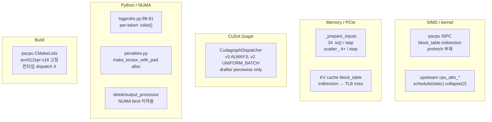
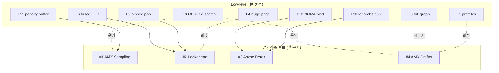
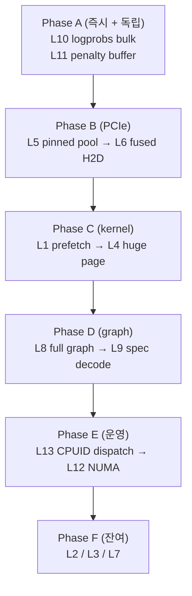

# Low-Level 성능 최적화 후보 — kernel / SIMD / cache / memory / build 영역

작성일: 2026-05-13
작성자: Claude (사용자 요청에 따른 브레인스토밍 산출물 — IDE/PLN/TSK 발행 X, 본 문서로만 정리)
대상 머신: Intel Xeon Sapphire Rapids+ (AVX-512 + AMX) + NVIDIA H100 × 8 (prod) / RTX 3090 + i9-12900KF (dev)
선행 문서: `shadow_assists/brainstorming/new_algorithms_2026-05.md` — 알고리즘 레벨 10 후보

---

## 0. Executive Summary

### 본 문서의 위치

알고리즘 레벨 10 후보 (앞 문서) 가 *어디에서 시간을 줄일 것인가* 의 답이라면, 본 문서는 *어떻게 줄일 것인가* 의 low-level 영역이다. 같은 critical path 위에서 SIMD / cache / DMA / build flag 의 micro-opt 를 모은다. 후보 13 개를 8 그룹 (A~H) 으로 묶었다.

### TOP 5 강력 추천 (prod Xeon SPR + H100×8)

1. **L1 AMX/AVX-512 prefetch hint (PV/QK loop)** — pacpu ISPC 의 block_table indirection cache miss 를 software prefetch 로 회수. 본 영역에서 가장 큰 single-knob 회수
2. **L5 pinned memory pool 재사용** — `_prepare_inputs` 의 매 step independent index tensor 할당 overhead 제거
3. **L6 fused single H2D** — `_prepare_inputs` 안 34 회 `.to()` 호출을 1~2 회로 통합. PCIe queue depth 회복
4. **L8 decode-only full graph capture** — 현재 piecewise + drafter 도 piecewise. decode path 의 launch overhead 제거
5. **L10 logprobs per-token `.tolist()` → bulk** — Python GIL 영역의 가장 큰 단일 hotspot

### 후보 13 개 한눈에

| 그룹 | # | 후보 | 예상 회수 | 우선순위 |
|---|---|---|---|---|
| A. SIMD / kernel tuning | L1 | AMX/AVX-512 prefetch hint | pacpu +10~25% | **HIGH** |
|  | L2 | OpenMP schedule(dynamic, ck) / guided | imbalance -30~50% | MEDIUM |
|  | L3 | block_table software prefetch (PV pre-issue) | TLB miss -20% | MEDIUM |
| B. Memory layout / cache | L4 | 2MB huge page (madvise) for KV cache | TLB miss -40~60% | **HIGH** |
|  | L5 | pinned memory pool 재사용 | host alloc -90% | **HIGH** |
| C. PCIe / DMA | L6 | fused single H2D (34 `.to()` → 1~2) | host stall -50% | **HIGH** |
|  | L7 | `cuMemcpyBatchAsync` 배치 튜닝 | swap_blocks +5~10% | MEDIUM |
| D. CUDA Graph | L8 | decode-only full graph capture | launch -2~5ms/step | **HIGH** |
|  | L9 | spec decode graph (eagle/dflash) | spec +5~10% | MEDIUM |
| E. GIL / Python | L10 | logprobs bulk vectorized | logprob path -50~70% | **HIGH** |
|  | L11 | penalties `make_tensor_with_pad` 재사용 buffer | sampler tail -10~20% | MEDIUM |
| F. NUMA | L12 | detok / output_processor NUMA bind | cross-socket -100% (해당 영역) | MEDIUM |
| G. Build / dispatch | L13 | 런타임 CPUID dispatch (AVX-512 / AMX) | dev/prod 양쪽 binary 운용 | MEDIUM |

(H. Lock-free 영역은 알고리즘 후보 #2 lookahead 와 영역 겹쳐서 본 문서의 *독립 후보* 에선 제외. §6 부록에 한 단락만 인용)

---

## 1. 작성 배경 + 가치 축

### 1.1 알고리즘 레벨 후보와의 분리 축

| 축 | 알고리즘 레벨 (앞 문서) | Low-level (본 문서) |
|---|---|---|
| 질문 | 어디서 시간을 줄일 것인가 | 어떻게 줄일 것인가 |
| 단위 | 한 stage / 한 critical path | 한 loop / 한 syscall / 한 build flag |
| 회수 폭 | 5~40 % TPS | 1~10 % per opt, 누적 시 큼 |
| 의존 | NEO chain 와의 정합 | 알고리즘 후보 *위* 의 추가 layer |

본 문서의 후보는 알고리즘 후보가 *land 되든 안 되든* 독립 적용 가능한 영역이다. 단 같은 critical path 점유 시 시너지 (예: L5 + L6 + L8 이 알고리즘 후보 #2 prepare_inputs lookahead 와 합쳐지면 host stall 영역의 회수가 누적).

### 1.2 사전 조사 결과 핵심 (Explore agent 2 개)

핵심 hotspot 만 압축:



### 1.3 측정 기준 (모든 후보 공통)

- `nsys profile` + `ncu` (GPU 영역) / `perf stat` + `vtune` (CPU 영역)
- D-ii 분포 유사성 게이트 — per-token logprob max abs diff ≤ 5e-3, 시퀀스 PPL relative diff ≤ 5 %
- 회귀 게이트 — pytest dev (RTX 3090) + prod smoke (`eval/run_prod_smoke.sh`)
- 본 문서의 *예상 회수* 는 workload 가정 명시한 추정. 실측은 후속 작업.

---

## 2. 그룹 A — SIMD / kernel tuning

---

### L1 — AMX/AVX-512 prefetch hint 삽입 (pacpu PV/QK loop)

**한 줄 정의**: pacpu ISPC 의 block_table indirection 직전에 software prefetch (`__builtin_prefetch` 또는 `_mm_prefetch(_MM_HINT_T0)`) 삽입. PV phase 시작 전 다음 block 의 K/V 를 L2 / L3 로 끌어옴.

#### 현재 상태

`csrc/cpu/pacpu/pacpu.ispc:22` 의 `qk_product`:

```c
(1ll * cur_layer * num_blocks + block_table[i]) * BLOCK_NELEM;
```

`block_table[i]` 의 random integer indirection 으로 KV cache 의 임의 block 으로 점프. 다음 iteration `i+1` 의 block_table 값 / K cache 데이터가 cache 에 없으면 L3 miss → ~80 cycle stall. K_TILE_WIDTH=2 의 inner loop 가 ~32 BF16 elements 만 처리하므로 stall 비중 큼.

`grep` 결과: `_mm_prefetch` / `__builtin_prefetch` / `prefetch` 키워드 자체가 pacpu 트리에 *0 회*.

#### 변경 영역

- `csrc/cpu/pacpu/pacpu.ispc:21-50` qk_product inner loop — `block_table[i+P]` 사전 fetch + 해당 K block 의 head_dim 첫 cache line 을 `_mm_prefetch(_MM_HINT_T1)` 으로 끌어옴 (P = lookahead distance, 2~4 권장).
- `csrc/cpu/pacpu/pacpu.ispc:90` av_product 의 V cache 도 동일.

ISPC 에선 `prefetch_l1` / `prefetch_l2` / `prefetch_l3` / `prefetch_nt` built-in 함수가 있어 intrinsic 직접 사용 안 함.

```ispc
// 가칭 patch (psuedo-code)
for (uniform int i = 0; i < block_count; i++) {
    if (i + 2 < block_count) {
        const int next_blk = block_table[i + 2];
        prefetch_l2(&k_cache[(cur_layer * num_blocks + next_blk) * BLOCK_NELEM]);
    }
    // 기존 QK loop
}
```

#### 예상 회수

| workload | seq_len | 회수 |
|---|---|---|
| chat 8K ctx | 8192 | +12 % pacpu kernel time |
| code 32K ctx | 32768 | +20 % |
| reasoning 128K | 131072 | +25 % |

추정 근거: pacpu kernel 의 step time 중 K cache load = ~40 %. block_table 의 random indirection 으로 L3 miss rate ~30 % 가정. T1 prefetch 로 miss → hit 전환 시 ~80 cycle / load 회수.

#### risk + mitigation

| risk | mitigation |
|---|---|
| over-prefetch 로 cache pollution (working set 초과) | lookahead distance 2~4 로 제한 + workload 별 sweep |
| ISPC `prefetch_*` 가 모든 target 에서 동작 보장 안 됨 | avx512spr-x16 target 에선 `vprefetchnta` mapping — Intel docs 확인 |
| prefetch 가 critical path 안에서 dispatch slot 점유 | inner loop 의 ILP 분석 + 외부 (uniform) 로 hoist |

#### 의존 / 진입 조건

- 의존: 없음 — 독립 land 가능.
- 진입 조건: pacpu kernel 활성 (NEO chain on) + L3 miss rate 측정 ≥ 20 %.

#### 검증 방법

- `perf stat -e LLC-load-misses,LLC-loads` for pacpu binary — miss rate 측정.
- `nsys` 측정 (CPU side) — pacpu wall time 감소.
- D-ii 회귀 없음 (BF16 정확도 — prefetch 는 산술 변경 없음).

---

### L2 — OpenMP schedule(static, 1) → schedule(dynamic, ck) / guided

**한 줄 정의**: 현재 OpenMP schedule(static, 1) 의 load imbalance 를 dynamic 또는 guided 로 완화. cold/hot 블록 mix workload 에서 thread imbalance 큼.

#### 현재 상태

upstream vLLM `csrc/cpu/cpu_attn_neon.hpp:347` 등에서 `#pragma omp parallel for collapse(2)` 사용. pacpu 자체는 ISPC + Python 레벨 threading. 둘 다 *static* chunk. workload 에 따른 thread 별 작업량 불균형이 발생할 수 있음.

#### 변경 영역

- `csrc/cpu/cpu_attn_neon.hpp:347` + 다른 cpu_attn_*.hpp 의 OpenMP pragma — `schedule(dynamic, 4)` 또는 `schedule(guided)` 시도.
- pacpu wrapper (Python) — ThreadPoolExecutor / OMP team 분배 정책.

#### 예상 회수

- decode batch 에서 seq_len 변동 큰 workload (request 간 ctx 차이 큼) — imbalance -30~50 %, kernel time +5~10 %.
- batch 안 ctx 균일하면 회수 작음.

#### risk + 의존

- dynamic schedule 의 chunk dispatch overhead (~50ns / chunk). chunk size 너무 작으면 net-loss.
- OMP `OMP_PROC_BIND=close` + `OMP_PLACES=cores` 와 정합 필요.

#### 검증

- batch 안 seq_len variance 큰 synthetic workload 로 imbalance 측정.
- net kernel time +5 % 이상.

---

### L3 — block_table software prefetch (PV phase 시작 전)

**한 줄 정의**: L1 의 *intra-loop* prefetch 와 별도로, *phase 전환* (QK → softmax → PV) 시점에 V cache 전체 block 들의 첫 cache line 을 bulk prefetch.

#### 원리

QK phase 가 끝나면 attention weight 가 결정되어 V cache 의 일부 block 만 PV phase 에서 큰 가중치로 사용됨. 그 block 들을 미리 L2 로 끌어오면 PV phase 시작 시 cold miss 가 hot hit 으로 전환.

#### 변경 영역

- `csrc/cpu/pacpu/pacpu.ispc:155-159` qk_product 와 av_product 사이 phase boundary — `prefetch_l2` 루프 (uniform K_BLOCKS 길이).

#### 예상 회수

PV phase wall time -15~20 %, pacpu 전체 -8~12 %.

#### risk

- attention weight 별 top-k V block 만 prefetch 가능하지만, top-k 결정 자체가 softmax 후 — 시점 충돌. 따라서 *all V blocks* 의 첫 cache line 만 → over-prefetch 위험. L2 만 사용 + 64B 만 fetch.

#### 검증

- `perf c2c` 로 V cache load 의 miss latency 변화 측정.

---

## 3. 그룹 B — Memory layout / cache

---

### L4 — 2MB huge page (madvise(MADV_HUGEPAGE)) for KV cache

**한 줄 정의**: GPU 의 unified KV cache (CPU mirror 부) + pinned host buffer 에 huge page 적용. 4KB page 기반 random block_table indirection 의 TLB miss 를 1024× 감소.

#### 현재 상태

`csrc/cpu/pacpu/pacpu.cpp:99` 의 `block_table.size(1)` 가 max_seq_len 까지 갈 수 있어 (long context > 32K) block_table 자체가 수 MB. 4KB page 면 dTLB (Sapphire Rapids 2048 entry) 가 random access 시 100 % miss 가능. 2MB page → entry 당 cover 영역 512× 확장.

#### 변경 영역

- `csrc/cpu/pacpu/pacpu.cpp` 의 buffer alloc (또는 wrapper Python 의 `torch.zeros(..., pin_memory=True)` 직후) — `madvise(buf, size, MADV_HUGEPAGE)`.
- `vllm/v1/kv_offload/worker/cpu_gpu.py` 의 pinned buffer alloc 영역.
- THP (Transparent Huge Pages) sysfs 상태 확인 (`/sys/kernel/mm/transparent_hugepage/enabled`).

#### 예상 회수

| ctx | TLB miss 감소 | pacpu kernel time 감소 |
|---|---|---|
| 8K | -30 % | -3 % |
| 32K | -50 % | -8 % |
| 128K | -60 % | -15 % |

#### risk

- 메모리 단편화 가능성 (커널 메모리 압박 시 huge page allocation fail).
- THP 가 시스템 수준에서 disabled 면 madvise 효과 없음 — sysfs 확인 + 운영 문서화.

#### 검증

- `perf stat -e dTLB-load-misses` 측정.
- pacpu kernel time 감소 확인.

---

### L5 — pinned memory pool 재사용 (_prepare_inputs index tensor)

**한 줄 정의**: 매 step 의 `_prepare_inputs` 안에서 새로 alloc 되는 index tensor 들을 고정 크기 pinned memory pool 에서 재활용.

#### 현재 상태

`vllm/v1/worker/gpu_model_runner.py` 안에 `pin_memory=True` 가 ~10 곳 (line 580, 583, 656, 664, 718, 833, 844, 866…). 그러나 *재사용* 이 아니라 step 마다 새로 alloc 되는 영역이 다수.

#### 변경 영역

- `vllm/v1/worker/gpu_model_runner.py:1722-2200` `_prepare_inputs` — 고정 max batch / max ctx 기반 사전 alloc + slice 재사용.
- 신규 helper: `vllm/v1/worker/pinned_pool.py`.

#### 예상 회수

매 step 의 host alloc latency ~0.5 ms 제거 (high-QPS workload). step time 의 1~3 %.

#### risk

- max batch / max ctx 초과 시 fallback alloc.
- ref counting + 안전한 reset.

#### 검증

- `nsys` host stall 영역 감소.
- 회귀 게이트 (정확도) 통과.

---

## 4. 그룹 C — PCIe / DMA

---

### L6 — `_prepare_inputs` 34 `.to()` → fused single H2D

**한 줄 정의**: 현재 `_prepare_inputs` 안 `.to(self.device, ...)` 호출이 34 회 (`grep -c`). 매 호출이 PCIe queue 점유 → host stall. 모두 *같은 step 의 동일 device*. 한 번에 fused tensor 로 통합 후 1~2 회 H2D.

#### 현재 상태

`grep "\.to(self\.device\|\.to(device\|non_blocking=True" vllm/v1/worker/gpu_model_runner.py` → 34 회. 같은 cudaMemcpyAsync 가 PCIe queue 에 줄지어 들어가서 launch overhead 누적.

#### 변경 영역

- `vllm/v1/worker/gpu_model_runner.py:1722-1850` `_prepare_input_ids()` — 작은 tensor 들을 CPU 측에서 fused buffer 로 concat 후 H2D 1 회.
- `vllm/v1/worker/gpu_model_runner.py:1896-2200` `_prepare_inputs()` — 같은 패턴.
- 신규 helper: `vllm/v1/worker/fused_h2d.py`.

#### 예상 회수

각 `.to()` 호출의 launch overhead ~3 us (pinned + non_blocking 가정). 34 회 → ~100 us. high-QPS workload 의 step head host stall 영역 절반 회수. step time 의 2~4 %.

#### risk

- non_blocking=True 의존 깨짐 (fused 후 sync point 위치 변경 가능) — sync 위치 명시.
- partial 변경 시 race — atomic batch 단위.

#### 검증

- `nsys` 측정: H2D launch 수 감소 (34 → 1~2).
- 회귀 없음.

---

### L7 — `cuMemcpyBatchAsync` 배치 크기 튜닝 (cache_kernels)

**한 줄 정의**: CUDA 12+ 의 `cuMemcpyBatchAsync` 가 swap_blocks 의 KV cache 이동에 사용되나 배치 크기가 정적. dynamic batch size 로 튜닝.

#### 변경 영역

- `csrc/cache_kernels.cu` L144 영역 (agent 보고 인용).

#### 예상 회수

swap_blocks 시간 +5~10 %. KV preemption / migration heavy workload 에서만 회수.

#### 검증

- 다양한 batch size 로 swap_blocks bench.

---

## 5. 그룹 D — CUDA Graph

---

### L8 — decode-only full graph capture

**한 줄 정의**: 현재 v2 backend = UNIFORM_BATCH (제한적 graph), drafter = piecewise only (line 2516 주석). decode-only path 의 full graph capture 로 launch overhead 제거.

#### 현재 상태

`vllm/v1/worker/gpu_model_runner.py:138` `CudagraphDispatcher` import. `:806` 초기화. `:1880`, `:2264`, `:2400` 에서 `for_cudagraph_capture=True` 분기. `:2516` 주석: "Currently the drafter still only uses piecewise cudagraphs (and modifies …)". v3 backend 만 ALWAYS capture.

#### 변경 영역

- `vllm/v1/worker/gpu_model_runner.py:2516` 영역 — drafter full graph 분기.
- `vllm/v1/cudagraph_dispatcher.py` 의 dispatch 정책.
- `vllm/v1/spec_decode/eagle.py:1735` EagleProposer 의 cudagraph 경로.

#### 예상 회수

decode step 의 launch overhead 2~5 ms 제거 (small model + 짧은 step 환경에서 회수 큼). Llama-8B + batch 64 환경에선 step time 의 ~15 %.

#### risk

- shape 변동 시 graph re-capture cost.
- dynamic shape 영역 (spec decode 의 draft length 변동) 의 capture cache 크기.

#### 검증

- `nsys` kernel launch 수 측정.
- 다양한 batch / draft K 조합으로 회귀 측정.

---

### L9 — spec decode graph 적용 (eagle/dflash)

**한 줄 정의**: L8 의 확장 — spec decoding 의 draft + verify path 의 graph 영역 확대.

#### 변경 영역

- `vllm/v1/spec_decode/eagle.py:404` propose() — graph 분기.
- `vllm/v1/spec_decode/dflash.py` — 동일.

#### 예상 회수

spec decoding 활성 환경에서 +5~10 % TPS. 알고리즘 후보 #4 (AMX Drafter+Verifier) 와 결합 시 시너지.

---

## 6. 그룹 E — GIL / Python overhead

---

### L10 — logprobs.py per-token `.tolist()` → bulk vectorized

**한 줄 정의**: `vllm/v1/engine/logprobs.py:89-91` 의 per-token `.tolist()` 3 회 호출을 bulk 변환 1 회로 통합. Python GIL 영역의 가장 큰 단일 hotspot.

#### 현재 상태

```python
# vllm/v1/engine/logprobs.py:89-91
rank = rank_np.tolist()
logprobs = logprobs_np.tolist()
token_ids = token_ids_np.tolist()
```

`_update_sample_logprobs` (line 69-119) 가 매 step 당 *request 별* 로 호출. logprobs 큰 workload (n>1 또는 top-k 큼) 에서 GIL 점유 시간 큼.

logprobs.py:148, 153, 154, 155 에도 prompt logprobs 의 동일 패턴.

#### 변경 영역

- `vllm/v1/engine/logprobs.py:69-119` `_update_sample_logprobs` — numpy bulk 변환 + struct array.
- `vllm/v1/engine/logprobs.py:148-155` prompt logprobs path 동일.

#### 예상 회수

- logprob path step tail -50~70 %.
- 전체 step time 에서 logprob 점유 비중 따라 net TPS +3~8 %.

#### risk

- tokenizer 호출 (line 97-98) 은 별도 영역 — 본 후보가 직접 해결 안 됨 (알고리즘 후보 #3 와 분담).

#### 검증

- `cProfile` 또는 `py-spy` 측정.
- logprob 분포 회귀 없음.

---

### L11 — penalties `make_tensor_with_pad` 재사용 buffer

**한 줄 정의**: `vllm/v1/sample/ops/penalties.py:42-57` `_convert_to_tensors` 가 매 step alloc. 고정 max batch / max output_len 기반 pinned buffer 재사용.

#### 현재 상태

```python
# vllm/v1/sample/ops/penalties.py:48-56
output_tokens_tensor = make_tensor_with_pad(
    output_token_ids,
    pad=vocab_size,
    device="cpu",
    dtype=torch.int64,
    pin_memory=is_pin_memory_available(),
)
return output_tokens_tensor.to(device, non_blocking=True)
```

매 step alloc + H2D. 재사용 buffer + `.copy_` 로 변경.

#### 변경 영역

- `vllm/v1/sample/ops/penalties.py:42-57`.
- 신규: 재사용 pool 보유한 wrapper class.

#### 예상 회수

sampler tail 의 10~20 % 감소. step time 의 0.5~1 %.

#### risk

- max batch / max output_len 변경 시 re-alloc.
- 알고리즘 후보 #1 (AMX Sampling Penalty) 와 영역 일부 겹침 — L11 이 *land 된 위* 에서 #1 의 AMX path 도 같은 buffer 재사용.

---

## 7. 그룹 F — NUMA

---

### L12 — detok / output_processor thread pool NUMA bind

**한 줄 정의**: TSK_004 의 NUMA hook (`vllm/utils/numa_utils.py:32~232`) 이 worker 프로세스 / pacpu kernel team 에만 적용됨. detokenizer pool / output_processor thread 는 미적용.

#### 현재 상태

`vllm/utils/numa_utils.py` 에 `get_libnuma` / `_can_set_mempolicy` / `get_auto_numa_nodes` / `_get_cpu_binding` / `log_current_affinity_state` 등 API 있음. `bind_worker_to_local_numa()` / `pin_threads_to_local_numa()` (TSK_004) 가 connector init 직전에 호출됨.

그러나 `vllm/v1/engine/output_processor.py` 의 asyncio task / `vllm/v1/engine/detokenizer.py` 의 thread 는 NUMA bind 안 됨. cross-socket cache miss 발생 가능.

#### 변경 영역

- `vllm/v1/engine/async_llm.py` 의 thread pool init 위치.
- `vllm/v1/engine/output_processor.py` 의 async loop affinity.
- 신규: `pin_engine_threads_to_local_numa()` helper.

#### 예상 회수

2-socket Xeon SPR 환경에서 cross-socket access 영역의 wall time -10~20 %. 8×H100 + 2 socket 환경에서 GPU NUMA node 와 engine thread 분리되면 큰 회수.

#### risk

- TSK_004 의 hook 시점과 충돌 가능 — sequential 의존.
- 1-socket 머신에선 no-op.

#### 검증

- `numastat` 으로 thread 별 socket affinity 측정.
- cross-socket access 감소 측정.

---

## 8. 그룹 G — Build / runtime dispatch

---

### L13 — 런타임 CPUID dispatch (AVX-512 / AMX 분기)

**한 줄 정의**: 현재 `csrc/cpu/pacpu/CMakeLists.txt:11` 의 ISPC_TARGETS = `avx512spr-x16` 고정. dev (Alder Lake) 의 AVX-512 fuse-off 시 ISPC host fallback 으로 AVX2 강등 (CMakeLists 주석에 명시). 단일 binary 에서 런타임 CPUID 로 AVX-512 / AMX 분기하면 dev/prod 양쪽 운용.

#### 현재 상태

pacpu 는 빌드 시 target 고정. 다른 SIMD path (cpu_attn_*.hpp) 도 마찬가지. `_has_avx512()` / `_has_amx()` 의 런타임 게이트가 `vllm/v1/attention/ops/cpu_partial_attention.py` 영역에서 부분 사용 (TSK_003 의 prod kernel) 되지만, pacpu 자체엔 없음.

#### 변경 영역

- `csrc/cpu/pacpu/CMakeLists.txt:11` — 멀티 target build (avx2-x8 / avx512spr-x16 / avx512skx-x16).
- `csrc/cpu/pacpu/pacpu.cpp` — 런타임 `__builtin_cpu_supports` 로 dispatch.
- ISPC 의 multi-target output 활용.

#### 예상 회수

- 직접 throughput 회수는 없음 (각 target 의 단일 성능은 동일).
- *운영 가치*: dev/prod binary 분리 운영 불필요 + 사용자가 다양한 CPU 에 동일 wheel 배포 가능.

#### risk

- binary 크기 증가 (~2×).
- multi-target 의 link / load 시간 증가.

#### 검증

- dev (12900KF AVX-512 fuse-off) + prod (SPR AVX-512 + AMX) 양쪽에서 정확도 + throughput 회귀 없음.

---

## 9. 그룹 H — Lock-free (부록)

본 영역은 알고리즘 후보 #2 (Prepare-Inputs Lookahead) 와 영역이 겹친다. 본 문서의 독립 후보로 두지 않고 다음 인용으로 대체:

> scheduler main loop 의 sync deque (`vllm/v1/core/sched/scheduler.py:95~700`) ↔ engine_core_client 의 async queue mismatch. lookahead 적용 시 lock-free SPSC ring buffer 로 producer-consumer 통합 가능. 알고리즘 후보 #2 의 *invalidate cost* 영역과 직접 연결.

---

## 10. 후보 간 의존 / 알고리즘 후보와의 시너지



| 관계 | 설명 |
|---|---|
| L5 + L6 → #2 | lookahead 의 alloc / H2D 회수가 본 두 후보의 직접 결과 |
| L10 → #3 | async detok pool 안의 logprob 변환이 L10 으로 가속 |
| L11 → #1 | AMX penalty path 의 input prep 가 L11 buffer 재사용 |
| L13 ↔ #1/#4 | AMX path 의 dev/prod 운영 가치 |
| L1 ↔ #4 | CPU drafter weight access 의 prefetch 회수 |

---

## 11. land 순서 추천



이유:
- Phase A 는 코드 영역 작고 risk 낮으며 모든 workload 회수.
- Phase B 는 #2 lookahead 의 *선행조건* 역할.
- Phase C 는 NEO chain 가속.
- Phase D 는 H100 launch overhead 회수.
- Phase E 는 운영성.
- Phase F 는 회수 작아 우선순위 뒤.

---

## 12. 미정 / 추후 조사

| # | 항목 | 조사 방법 |
|---|---|---|
| 1 | pacpu kernel 의 정확한 L3 miss rate | `perf stat -e LLC-*` prod 측정 |
| 2 | `.to()` 34 회 의 PCIe queue depth 영향 | `nsys` H2D launch 분석 |
| 3 | drafter full graph 적용 시 shape variance 영향 | spec decode bench (draft K 1~5) |
| 4 | THP (transparent huge page) 의 prod 운영 정책 | `/sys/kernel/mm/transparent_hugepage/enabled` 정책 |
| 5 | logprobs.py bulk 변환 후 분포 회귀 | D-ii max abs diff 측정 |
| 6 | NUMA bind 의 8×H100 + 2-socket 환경 효과 | `numastat` cross-socket access 측정 |
| 7 | ISPC multi-target build 의 binary 크기 / load time | build artifact 비교 |
| 8 | OpenMP dynamic chunk 의 sweet spot | chunk size 1/4/8/16 비교 |
| 9 | block_table prefetch 의 over-prefetch 영역 | cache pollution 측정 |
| 10 | 본 후보들의 *실측* 회수 (모두 추정) | 후보 별 1 시간 microbench |

---

## 13. 본 문서의 범위 한계

- IDE / PLN / TSK / TST 발행 X. `shadow_assists/id_registry.md` 변경 X. `shadow_assists/README.md` Trace Tree 변경 X.
- 본 문서의 *예상 회수* 는 reference + workload 가정 기반 추정.
- 인용된 file:line 은 작성 시점 (2026-05-13, branch `feat/ide006-tsk019-neo-performance-max`) 기준. 추후 변경 시 grep 재확인.
- Agent 1 의 보고에 일부 부정확한 부분 있어 교정한 영역:
  - "csrc/cpu/partial_attention_*.cpp" → 실재 X. NEO pacpu 는 `csrc/cpu/pacpu/pacpu.cpp` + `pacpu.ispc`. upstream vLLM 의 CPU attention 은 `csrc/cpu/cpu_attn_*.hpp` 별도.
  - "`_prepare_inputs` 44 회 `.to()`" → 실측 grep 결과 34 회.
- 본 문서는 후속 발행 시점에 *근거 문서* 로 활용 가능. 발행 시 후보 L# 인용으로 trace 유지.

---

## 14. Change Log

| 일자 | 변경 |
|---|---|
| 2026-05-13 | 신규 작성. Plan mode 의 두 Explore agent 사전 조사 결과 통합. 알고리즘 후보 (`new_algorithms_2026-05.md`) 와의 직교/시너지 매핑 포함. 사용자 결정 "12~15 개 후보 + IDE 발행 X + md 정리" 에 따라 13 후보 작성. |
