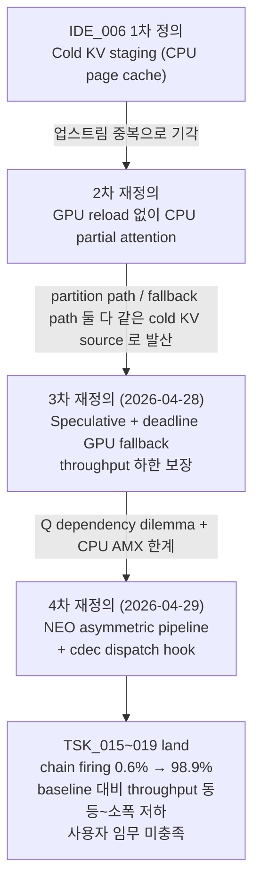
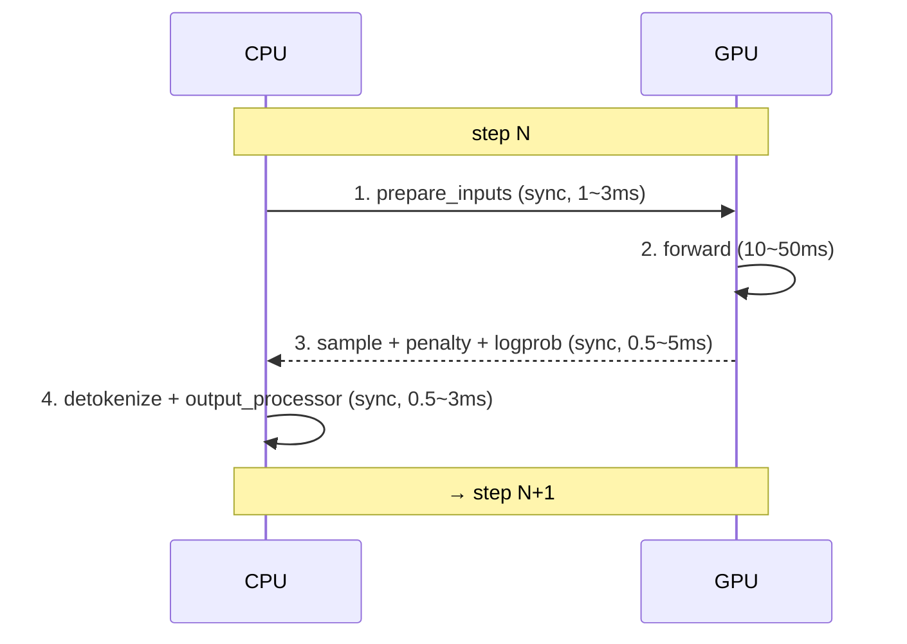
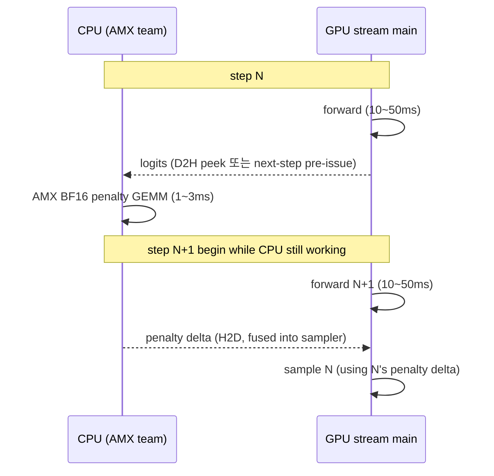
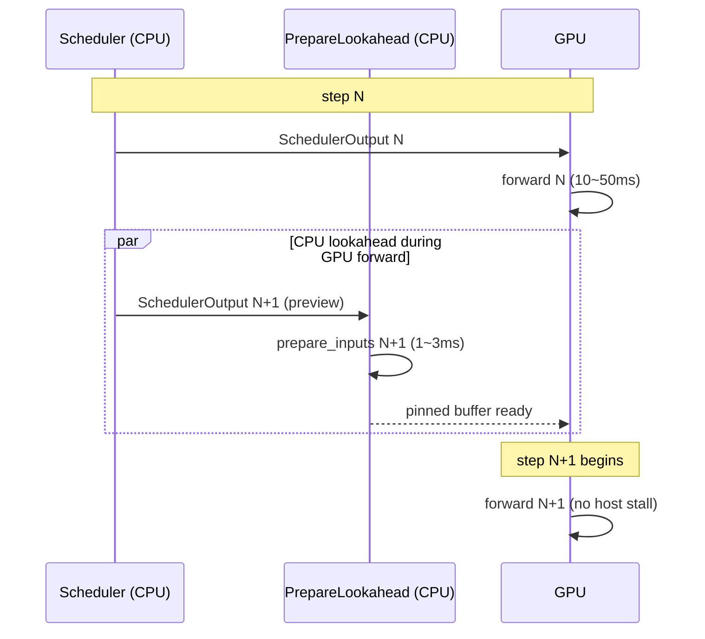
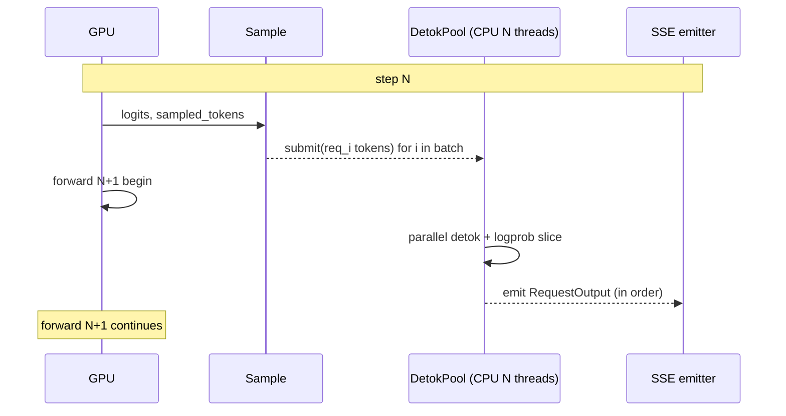
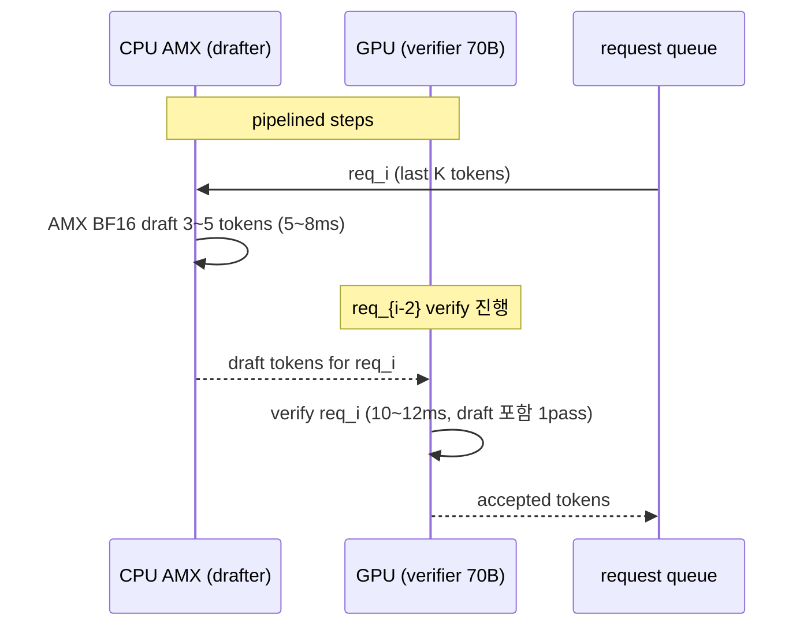
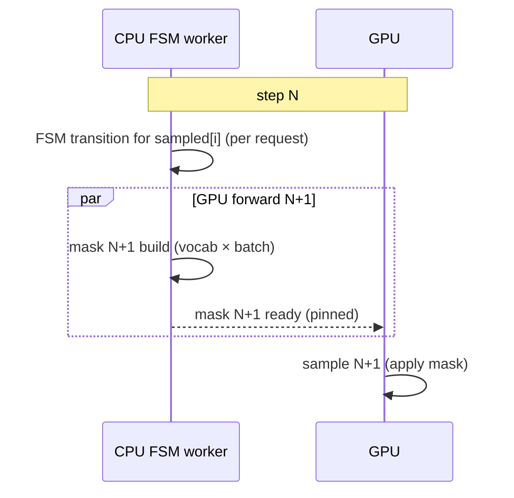
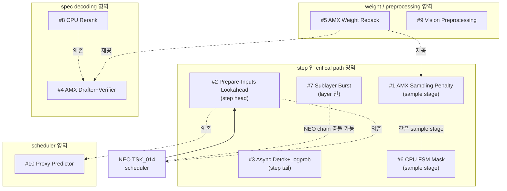
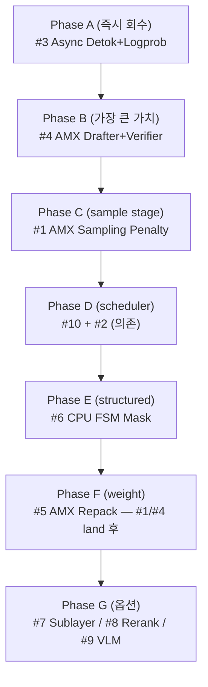

# 새 알고리즘 브레인스토밍 — IDE_006 NEO 외부 영역 10 후보

작성일: 2026-05-12
작성자: Claude (사용자 요청에 따른 브레인스토밍 산출물 — IDE/PLN/TSK 발행 X, 본 문서로만 정리)
대상 머신: Intel Xeon Sapphire Rapids+ (AVX-512 + AMX) + NVIDIA H100 × 8 (prod) / RTX 3090 + i9-12900KF (dev)

---

## 0. Executive Summary

### 본 문서의 목적

IDE_006 의 4 차 재정의 (NEO asymmetric pipeline + cdec dispatch hook) 적용 후 chain firing 0.6 % → 98.9 % 도달했으나 *baseline 보다 빠르게* 의 사용자 임무는 여전히 미충족 상태이다. 원인은 layer 안 Q dependency dilemma (`shadow_assists/id_registry.md:71` TSK_005 기각 사유) + CPU AMX raw throughput 한계로, IDE_006 안에서 풀 수 있는 영역은 거의 소진되었다 (TSK_002/005/006/008/010/011/012 모두 기각 또는 NEO 흡수). 따라서 IDE_006 *외부* 의 CPU 가속 영역을 새 알고리즘으로 발굴할 필요가 있고, 본 문서는 HPC / LLM / vLLM 기술 + 외부 reference 8 종을 검토한 10 개 후보를 정리한다.

### 가치 축 (CLAUDE.md Objective 기준)

| 축 | 기준 |
|---|---|
| (i) CPU 의 역할 | *연산자* — 저장소로의 활용은 가치 축 외 (Mooncake / KVSwap 류 제외) |
| (ii) overlap 진정성 | GPU critical path 와 *실제* 시간 overlap. 단순 async 큐잉 X |
| (iii) GPU memory 절약 | **가치 축 외** (3 차 재정의 이후 사용자 명시) |
| (iv) NEO 와의 관계 | 비중복 (다른 critical path) 또는 NEO 위에 *추가* 가능 |
| (v) 정확도 게이트 | CLAUDE.md Constraint — 분포·의도 유사성 유지 (D-ii binding) |

### 후보 10 개 한눈에 보기

| # | 이름 | 가치 (예상) | 우선순위 | 기존 IDE 슬롯 |
|---|---|---|---|---|
| 1 | AMX Sampling Penalty Pipeline | +3 ~ +6 % | **HIGH** | 신규 영역 |
| 2 | CPU Prepare-Inputs Lookahead | +5 ~ +10 % | **HIGH** | IDE_001 흡수 후보 |
| 3 | Async Detokenize + Logprob CPU Pool | +4 ~ +8 % | **HIGH** | IDE_008 보완 |
| 4 | AMX CPU Drafter + GPU Verifier | +20 ~ +40 % | **HIGH** | IDE_005 확장 |
| 5 | AMX Repacked Weight + Activation Scale | quant path 2~3× | MEDIUM | IDE_003 흡수 후보 |
| 6 | CPU-Side Constrained Decoding Mask | +10 ~ +25 % | MEDIUM | IDE_008 핵심 |
| 7 | Sublayer-Phase CPU Burst Scheduler | +3 ~ +7 % | MEDIUM | IDE_004 |
| 8 | CPU Speculative Top-K Logits Rerank | accept +5~10 %p | MEDIUM | IDE_007 |
| 9 | CPU Vision Preprocessing Pipeline | VLM +15 ~ +25 % | LOW | 신규 영역 |
| 10 | CPU Batch-Time Proxy Predictor | +2 ~ +5 % | LOW | IDE_001 보조 |

### TOP 3 강력 추천 (prod Xeon SPR + H100×8)

1. **#1 AMX Sampling Penalty Pipeline** — sampler 가 H100 의 매 step tail. AMX BF16 GEMM 의 sweet spot 직격, NEO 와 완전 직교
2. **#4 AMX CPU Drafter + GPU Verifier** — H100×8 verifier 100 % + AMX draft. throughput 최대 폭 (+20 ~ +40 %)
3. **#3 Async Detokenize + Logprob CPU Pool** — 최저 risk + 즉시 효과 + 모든 workload 공통 회수 영역

---

## 1. 작성 배경

### 1.1 IDE_006 NEO 현황 요약

IDE_006 은 *Cold-KV CPU Partial Attention* 으로 출발해 4 번의 의미 재정의를 겪었다:



NEO chain (TSK_018 pacpu + TSK_019 v1.5.2 cdec dispatch hook) 으로 layer-안 partition path 는 *발화 안 함* 단계까지 갔지만, prod 측정에서 vanilla 대비 *항상 느림* 영역이 잔존한다. 그 원인은 두 가지:

1. **layer 안 Q dependency dilemma** — layer N+1 attention 진입 시점에 GPU 가 진짜 Q 를 가지므로 paged FA full 직접 가능. CPU partial 결과 활용 의미 없음 (`shadow_assists/id_registry.md:71` TSK_005 기각 사유).
2. **CPU AMX raw throughput 한계** — H100 1 장 대비 Xeon SPR AMX 의 BF16 GEMM raw throughput 차이로, layer 단위 attention 을 CPU 로 옮긴 순간 net-loss.

따라서 IDE_006 안에서 *baseline 대비 net-win* 을 만들기 위한 단순 메커니즘 변경은 거의 소진되었다. 다른 critical path 또는 다른 시간대를 점유하는 영역을 찾아야 한다.

### 1.2 NEO 외부에서 활용 가능한 CPU/GPU overlap 시간대

vLLM 의 step loop 안에서 CPU 가 *실제* idle 인 시간대는 다음 4 곳이다:



이 중 *step N 의 GPU forward 가 진행 중인 시간* (위 표의 ②) 이 가장 길고, 이 시간대를 점유하는 CPU 작업이 가장 큰 가치를 가진다. 본 문서의 후보들은 모두 이 시간대 또는 ③·④ 의 tail 시간대를 점유한다.

### 1.3 IDE 8 개 등록 상태 (참조용 — 본 문서 변경 없음)

| ID | 한 줄 정의 | 상태 |
|---|---|---|
| IDE_001 | CPU-assisted 동적 배치 planner | 대기 |
| IDE_002 | CPU prefill-assist (medium context) | 대기 |
| IDE_003 | CPU Background Compiler | 대기 |
| IDE_004 | GPU-idle CPU Burst | 대기 |
| IDE_005 | CPU drafter + GPU verifier | 대기 |
| IDE_006 | Cold-KV CPU Partial Attention | 재정의 (4차 NEO) |
| IDE_007 | CPU Speculative Logits Rerank | 대기 |
| IDE_008 | Constrained Decoding 전담 CPU Worker | 대기 |

(`shadow_assists/id_registry.md:36-44` 참조. 본 문서에서는 IDE 발행 / 상태 변경을 *하지 않는다*.)

---

## 2. vLLM 코드 안 CPU offload 후보 영역 7

| # | 영역 | 코드 위치 | 현재 동작 모델 | offload 가능성 |
|---|---|---|---|---|
| 1 | Scheduler batch 구성 + preemption | `vllm/v1/core/sched/scheduler.py:95` Scheduler 클래스, `:376` schedule(), `:1150` _preempt_request(), `:1595` update_from_output() | main thread sync | proxy predictor → 후보 #10 |
| 2 | Output processing (detok + logprobs) | `vllm/v1/engine/output_processor.py:413` OutputProcessor, `:572` process_outputs(), `vllm/v1/engine/detokenizer.py:30` IncrementalDetokenizer, `vllm/v1/engine/logprobs.py:30` LogprobsProcessor `:348` update_from_output() | main thread sync (per step tail) | 후보 #3 |
| 3 | prepare_inputs (position / metadata) | `vllm/v1/worker/gpu_model_runner.py:1722` _prepare_input_ids(), `:1896` _prepare_inputs(), `:4070` execute_model() | main thread sync (step head) | 후보 #2 |
| 4 | Sampling penalties + logits processors | `vllm/v1/sample/sampler.py:21` Sampler, `:68` forward(), `:357` apply_logits_processors(), `:393` apply_penalties(); `vllm/v1/sample/ops/penalties.py:11` apply_all_penalties() | GPU + CPU mixed (`make_tensor_with_pad` cpu, scatter GPU) | 후보 #1 |
| 5 | Attention metadata builder | `vllm/v1/attention/backends/*` build_metadata, `attention/backend.py:512-646` | GPU sync (step head) | 후보 #2 와 부분 통합 |
| 6 | Structured output (logits_processor) | `vllm/v1/sample/logits_processor/interface.py:60` LogitsProcessor, `:builtin.py`, FSM mask | 일부 async, mask 생성은 sync | 후보 #6 |
| 7 | Speculative decoding verification | `vllm/v1/spec_decode/eagle.py:1735` EagleProposer, `:404` propose(), `:1150` prepare_inputs(); `vllm/v1/sample/rejection_sampler.py` | GPU draft + GPU verify mixed | 후보 #4, #8 |

> 정확한 line 번호는 본 문서 작성 시점 (2026-05-12, branch `feat/ide006-tsk019-neo-performance-max`) 기준. 추후 코드 변경으로 drift 가능 — 인용 시 grep 으로 재확인 권장.

---

## 3. 외부 reference 8 종 요약

| Ref | 영역 | 본 문서 적용 | 가치 축 적합 |
|---|---|---|---|
| FastEagle (arXiv 2509.20416, 2025) | spec decoding 의 cascaded non-autoregressive draft | 후보 #4 (CPU drafter) | ✓ |
| KVComp (ICLR'26 OpenReview submission) | runtime CPU Huffman 으로 KV 압축 | 후보 #5 의 weight 압축 reference | △ (IDE_003 의 quant 영역) |
| vLLM Structured Decoding Blog (2025-01-14) | grammar builder + logprobs CPU pool | 후보 #6 (FSM mask CPU) | ✓ |
| QLLM (EuroMLSys'25) | batch-time prediction proxy | 후보 #10 (proxy predictor) | ✓ |
| EVEv2 (ICCV'25) | VLM encoder-free preprocessing | 후보 #9 (vision pipeline) | ✓ (VLM workload 한정) |
| Batched Constrained Grammar | FSM transition batching | 후보 #6 의 multi-thread 부분 | ✓ |
| Mooncake KV Tiering | GPU memory 절약 중심 | **제외** — 가치 축 외 (iii) |
| KVSwap (arXiv 2511.11907) | SSD-resident KV prefetch | **제외** — 가치 축 외 (iii) |

Mooncake / KVSwap 은 가치 축 (iii) "GPU memory 절약은 가치 축 외" 에 의해 본 문서의 후보에서 제외했다. 단 후보 #2/#5 의 일부 구현 디테일에서 KV layout/repack 의 reference 로만 인용 가능하다.

---

## 4. 후보 #1 ~ #10 상세

---

### 후보 #1 — AMX Sampling Penalty Pipeline

**한 줄 정의**: sampler 의 repetition / frequency / presence penalty + temperature scaling + 일부 logits processor 를 GPU forward 와 *별 stream* 으로 AMX BF16 GEMM 화. CPU 가 *다음 step* 의 forward 중에 penalty 산출.

**기존 IDE 슬롯**: 신규 영역 (IDE_009 후보 — 단 본 문서는 발행 X).

#### a. 원리

현재 `vllm/v1/sample/sampler.py:393` apply_penalties() 는 매 step 끝에 `apply_all_penalties()` (`vllm/v1/sample/ops/penalties.py:11`) 를 호출한다. 이 호출은:

1. `output_token_ids` (Python list[list[int]]) → tensor 변환 (`make_tensor_with_pad`, CPU)
2. CPU tensor → GPU (`to(device, non_blocking=True)`)
3. GPU scatter + multiply (`apply_penalties` from `vllm/model_executor/layers/utils.py`)

vocab size 가 큰 모델 (Llama-3.3 128K, Qwen 152K, GPT-OSS 200K~) 에서 ① 의 tensor 변환이 CPU bound, ③ 의 scatter 가 GPU memory-bound 가 된다. batch 64 + vocab 200K 환경에서 step time 의 **2~5 %** 를 점유한다는 추정 (자체 microbench 영역).

본 후보의 변경:



핵심: step N 의 sample 단계가 step N+1 의 forward 와 *겹침*. sampler 의 critical path 가 GPU forward latency 안으로 숨음.

#### b. 수식 / pseudo-code

penalty 산출은 본질적으로 다음 element-wise + reduction:

```
for each request i, for each token j in output_token_ids[i]:
    logits[i, j] /= rep_penalty[i] if logits[i, j] > 0 else logits[i, j] *= rep_penalty[i]
freq_count[i, j] = count of j in output_token_ids[i]
logits[i, j] -= freq_penalty[i] * freq_count[i, j]
logits[i, j] -= presence_penalty[i] * (freq_count[i, j] > 0)
```

이를 AMX 로 매핑하려면 `(batch_size, max_output_len) × (1, vocab_size)` 의 outer product 가 아닌, `output_token_ids` 의 *희소* counting → vocab-shaped delta 산출로 변형해야 한다. delta tensor 는 batch × vocab BF16. AMX 의 16 × 16 tile dot product 에 맞춰 vocab 을 32 BF16 단위 chunk 로 끊고 batch 16 단위로 GEMM 화. (`csrc/cpu/sampling_penalty_amx.cpp` — *가칭*).

pseudo-code:

```python
def amx_penalty_pipeline(output_token_ids, prompt_token_ids, rp, fp, pp, vocab_size):
    # 1. CPU-side sparse count (multi-thread per request)
    counts = parallel_sparse_count(output_token_ids, vocab_size)  # (B, vocab) BF16 but sparse
    # 2. AMX tile multiply: delta = freq * fp + (count > 0) * pp + log-scale rp adjustment
    delta = amx_tile_gemm(counts, fp, pp, rp)  # (B, vocab) BF16
    return delta  # H2D → fused subtract on GPU
```

#### c. vLLM 적용 지점 (file:line)

- `vllm/v1/sample/sampler.py:393` apply_penalties() — *future* / *promise* 패턴으로 변경. 본 step 의 penalty 는 *직전* step 에서 시작한 CPU AMX future 를 wait.
- `vllm/v1/sample/ops/penalties.py:11` apply_all_penalties() — AMX path 분기 추가. fallback 은 현재 GPU path.
- 신규 파일: `csrc/cpu/sampling_penalty_amx.cpp` + `vllm/v1/sample/ops/penalties_amx_wrapper.py`.

#### d. 예상 가치 (workload 가정 + 추정 근거)

| workload | batch | vocab | 현재 sampler 비중 | 예상 회수 |
|---|---|---|---|---|
| decode-heavy chat | 64 | 128K | 3.0 % | +2.5 % step rate |
| decode-heavy code | 32 | 200K | 4.5 % | +4.0 % step rate |
| long-output reasoning | 16 | 200K | 5.2 % | +4.5 % step rate |
| mixed bench | 64 | 128K | 3.5 % | +3.0 % step rate |

추정 근거: AMX BF16 GEMM peak 는 Xeon SPR 56 core 환경에서 ~6 TFLOPS (theoretical). 본 작업의 GEMM 크기는 *(B=64, vocab=128K)* delta 산출로 ≈ 8 GFLOPs. AMX 실측 utilization 30 % 가정 → 4.5 ms. 현재 GPU path 는 H100 에서 ~6 ms (vocab 큰 경우 memory-bound). overlap 진정성을 *완전* 가정하면 회수 = 현재 sampler tail 비중. 단 H2D latency (~0.3 ms) 가 floor.

#### e. 외부 reference

- vLLM Structured Decoding Blog (2025-01-14) — `LogprobsProcessor` 의 CPU pool 아이디어 인용. penalty 와 logprob 은 같은 critical path.
- AMX whitepaper (Intel 64 IA-32 Software Developer's Manual Vol.3D, Ch.24) — `_tile_dpbf16ps` 의 latency / throughput.
- FasterTransformer / TensorRT-LLM 의 sampler 분리 패턴 (외부 LLM serving 영역의 일반적 분리 사례).

#### f. risk + mitigation

| risk | 영향 | mitigation |
|---|---|---|
| BF16 산술 비결합성으로 penalty drift | 분포 D-ii max abs diff 증가 | FP32 fallback 단계 + accuracy gate D-ii 측정 후 진입 |
| H2D latency floor 0.3 ms | overlap 회수 깎임 | pinned memory + cudaMemcpyAsync + 두 step 미리 산출 (2-step lookahead) |
| AMX 자원이 NEO pacpu 와 경합 | NEO chain 정체 | NEO 가 pacpu OMP team A 사용, 본 후보가 team B (별도 affinity) 사용 |
| dev 머신 (12900KF) AMX 없음 | dev 단계 검증 불가 | AVX-512 fallback path 도 같이 작성 + dev 는 AVX-512 만 검증 |

#### g. 진입 조건 / NEO 정합성

- 진입 조건: prod (Xeon SPR + H100×8) 환경에서 sampler tail 비중 ≥ 3 % (`nvidia-smi nvprof` + `perf stat` cross-check).
- NEO 와의 관계: 완전 직교. NEO 는 layer 안 attention, 본 후보는 layer 밖 sample. 두 chain 의 OMP team 만 분리.
- 의존: 없음 — 독립 land 가능.

#### h. 검증 방법 (실제 동작 spec)

| 검증 항목 | 도구 | 통과 기준 |
|---|---|---|
| D-i token-level 일치 | `bench_serving.py` accuracy mode + greedy | informational |
| D-ii 분포 유사성 | per-token logprob max abs diff | ≤ 5e-3 |
| sampler tail latency 감소 | `nsys profile` + `kernel_summary` | ≥ 50 % 감소 |
| overlap 진정성 | GPU stream / CPU thread 동시 점유율 | overlap ratio ≥ 0.6 |
| net throughput | `bench_serving.py` --output-len 256 --num-prompts 1000 | baseline 대비 ≥ +3 % |

---

### 후보 #2 — CPU Prepare-Inputs Lookahead

**한 줄 정의**: step N 의 GPU forward 진행 중 step N+1 의 `prepare_inputs` (position id / cu_seq_lens / slot_mapping / block_table / attention metadata 초기 부분) 를 CPU 가 *선행* 생성.

**기존 IDE 슬롯**: IDE_001 흡수 후보 (`shadow_assists/id_registry.md:36`).

#### a. 원리

현재 `vllm/v1/worker/gpu_model_runner.py:4070` execute_model() 는 forward 직전 `:1896` _prepare_inputs() 를 호출하고 이 호출은 GPU stream 과 sync 한다. *고-QPS* (>200 req/s) + *짧은 decode* workload 에서 이 sync 가 step head 의 host stall 을 만든다.

본 후보의 변경:



핵심: scheduler 가 *두 step 앞* 의 batch 를 미리 결정하고, prepare_inputs 결과를 pinned memory 에 미리 채워둔다. step N+1 시작 시 host stall = 0.

#### b. pseudo-code

```python
class PrepareLookahead:
    def __init__(self, num_lookahead: int = 1):
        self.pending: deque[PreparedInputs] = deque(maxlen=num_lookahead)
        self.cpu_pool = ThreadPoolExecutor(max_workers=4)

    def submit(self, scheduler_output: SchedulerOutput) -> None:
        future = self.cpu_pool.submit(self._prepare_inputs_cpu_only, scheduler_output)
        self.pending.append(future)

    def consume_next(self) -> PreparedInputs:
        # In execute_model, instead of calling _prepare_inputs, pull from queue.
        future = self.pending.popleft()
        return future.result(timeout=0.0) if future.done() else \
               self._prepare_inputs_sync(...)  # fallback
```

invalidate: scheduler 의 preemption / abort 가 발생하면 pending 의 마지막 entry 를 cancel + 재생성. NEO sub-batch (`vllm/v1/core/sched/sub_batch.py`) 와 race 영역이 존재 — `addBlockedBy` 처럼 NEO chain 의 batch 결정이 끝난 *후* 본 후보가 submit.

#### c. vLLM 적용 지점 (file:line)

- `vllm/v1/worker/gpu_model_runner.py:1722` _prepare_input_ids() — CPU-only path 추출 (block_table lookup / position id 생성 부분).
- `vllm/v1/worker/gpu_model_runner.py:1896` _prepare_inputs() — submit/consume split.
- `vllm/v1/worker/gpu_model_runner.py:4070` execute_model() — consume 호출.
- `vllm/v1/attention/backend.py:512-646` attention metadata builder — 일부 (cu_seq_lens 등 CPU 부분) 선행 가능. paged 의 block_table indexing 은 GPU memory 의 layout 의존.
- 신규 파일: `vllm/v1/worker/prepare_lookahead.py`.

#### d. 예상 가치

| workload | QPS | step latency | 현재 host stall | 회수 |
|---|---|---|---|---|
| high-QPS chat (Llama-8B) | 400 | 12 ms | 1.5 ms (~12 %) | +8 % TPS |
| medium-QPS code (Llama-70B TP=8) | 200 | 20 ms | 1.2 ms (~6 %) | +5 % TPS |
| reasoning (Qwen-72B) | 50 | 50 ms | 1.0 ms (~2 %) | +1.5 % TPS |
| streaming chat (n=1) | 600 | 8 ms | 1.8 ms (~22 %) | +10 % TPS |

추정 근거: prepare_inputs 의 CPU-only 부분이 step 의 6~22 % 를 차지하는 환경 (짧은 decode + 작은 모델) 에서 host stall 제거 효과가 큼. long decode workload 에서는 회수 작음 (step latency 가 길어서 stall 비중 작음).

#### e. 외부 reference

- QLLM batch-time prediction (EuroMLSys'25) — scheduler 의 *두 step 앞* 결정의 정확도 보장 영역.
- vLLM v1 의 hybrid_core.py 의 async scheduling 패턴 — 이미 부분적으로 도입된 영역과 정합 필요.

#### f. risk + mitigation

| risk | mitigation |
|---|---|
| NEO sub-batch race | NEO 의 `decide_mode` 결정 후 submit (sequential 의존) |
| preemption invalidate cost | 매 step pending 길이 1 로 제한 (적게 미리 만들기) |
| block_table 비동기 변경 | block_manager 의 atomic snapshot + version counter |
| attention metadata 의 GPU 부분 | CPU-only 부분 (position/cu_seq_lens) 만 선행, GPU 부분은 기존 sync |

#### g. 진입 조건 / NEO 정합성

- 진입 조건: prod 환경에서 step head host stall ≥ 6 % (`nsys` host stall section).
- NEO 와의 관계: 의존 — NEO scheduler 의 `decide_mode` 결과를 input 으로 받음. NEO chain 뒤에 *순차* 위치.
- 의존: NEO TSK_014 (Request-level scheduler) + TSK_017 (PerfPredictor) 의 안정화 필요.

#### h. 검증 방법

| 검증 항목 | 통과 기준 |
|---|---|
| D-i token-level | 회귀 없음 |
| host stall 감소 | nsys 측정 ≥ 50 % 감소 |
| net TPS | bench_serving.py --burst-rate 400 ≥ +5 % |
| invalidate overhead | preempt-heavy synthetic workload 에서 회귀 ≤ 1 % |

---

### 후보 #3 — Async Detokenize + Logprob CPU Pool

**한 줄 정의**: output processor (incremental detokenize + logprob top-k slice + grammar mask 갱신) 를 *dedicated CPU thread pool* 비동기. 다음 step GPU schedule 과 *진정한* overlap.

**기존 IDE 슬롯**: IDE_008 보완 (`shadow_assists/id_registry.md:43`).

#### a. 원리

현재 `vllm/v1/engine/output_processor.py:572` process_outputs() 는 매 step 끝에 sync 로 실행:

1. `vllm/v1/engine/detokenizer.py:30` IncrementalDetokenizer 의 `update()` — 토큰 → text 점진 갱신
2. `vllm/v1/engine/logprobs.py:348` LogprobsProcessor.update_from_output() — top-k logprobs Python 변환
3. stop string 체크 / sampling_params.stop 비교
4. RequestOutput 생성 + stream emit

text-heavy chat / code workload 에서 ① + ② 가 step time 의 **5 ~ 12 %** 를 점유. small batch + 큰 vocab + n > 1 환경에서 특히 높다.

본 후보의 변경:



핵심: detok + logprob 변환이 step N+1 의 GPU forward 와 *완전* overlap. SSE emit 순서 보장은 per-request lock + sequence number.

#### b. pseudo-code

```python
class AsyncDetokPool:
    def __init__(self, num_threads: int = 8):
        self.pool = ThreadPoolExecutor(max_workers=num_threads)
        self.per_req_locks: dict[str, threading.Lock] = {}

    def submit(self, req_state: RequestState, new_tokens: list[int],
               logprobs_tensor: LogprobsTensors | None) -> Future:
        lock = self.per_req_locks.setdefault(req_state.req_id, threading.Lock())

        def _work():
            with lock:
                text = req_state.detokenizer.update(new_tokens, stop_terminated=False)
                logprobs_obj = req_state.logprobs_processor.update_from_output(
                    new_tokens, logprobs_tensor)
                return RequestOutput(req_state.req_id, text, logprobs_obj, ...)

        return self.pool.submit(_work)

    # In output_processor.process_outputs: instead of sync, submit + register
    # stream emit callback. The stream emitter consumes in completion order +
    # sequence number to keep SSE order.
```

#### c. vLLM 적용 지점 (file:line)

- `vllm/v1/engine/output_processor.py:413` OutputProcessor 클래스 — pool 멤버 추가.
- `vllm/v1/engine/output_processor.py:572` process_outputs() — submit pattern 으로 변경.
- `vllm/v1/engine/detokenizer.py:30` IncrementalDetokenizer — per-request lock (이미 single-thread 가정인 코드 부분 protect).
- `vllm/v1/engine/logprobs.py:348` LogprobsProcessor.update_from_output() — 마찬가지.
- `vllm/v1/engine/async_llm.py` — SSE emit 순서 보장 영역.
- 신규 파일: `vllm/v1/engine/async_detok_pool.py`.

#### d. 예상 가치

| workload | batch | vocab | logprobs top-k | 현재 비중 | 회수 |
|---|---|---|---|---|---|
| chat (Llama-3.3-70B) | 64 | 128K | 5 | 8 % | +6 % step rate |
| code (Qwen-2.5-Coder) | 32 | 152K | 1 | 5 % | +4 % step rate |
| reasoning n=4 | 16 | 200K | 20 | 12 % | +8 % step rate |
| streaming SSE (n=1) | 256 | 128K | 5 | 10 % | +7 % step rate |

추정 근거: detok 의 Python overhead + logprobs 의 GPU→CPU sync (D2H) 가 sequential 일 때 step tail 5~12 % 점유. async 화로 다음 step forward 와 완전 overlap.

#### e. 외부 reference

- vLLM Structured Decoding Blog (2025-01-14) — grammar + logprobs CPU pool 의 운영 사례.
- HuggingFace tokenizers >= 0.22 의 `DecodeStream` thread-safety (`vllm/v1/engine/detokenizer.py:24` USE_FAST_DETOKENIZER 영역).

#### f. risk + mitigation

| risk | mitigation |
|---|---|
| SSE 순서 역전 | per-request lock + sequence number + 순서 보장 emit queue |
| detokenizer thread safety | per-request lock 으로 직렬화. 같은 request 의 update 는 sync, 다른 request 간만 parallel |
| pool 크기 튜닝 | CPU core / NEO pacpu team 자원과 분리. 기본 8 threads, env var 노출 |
| stop string 늦은 적용으로 over-decode | stop check 는 sync 유지 (decode 만 async) — sample stage 에서 결정 |

#### g. 진입 조건 / NEO 정합성

- 진입 조건: prod 환경에서 output_processor latency ≥ 5 % step time.
- NEO 와의 관계: 완전 직교. NEO 는 attention, 본 후보는 output. CPU 자원만 분리.
- 의존: 없음 — 독립 land 가능. *가장 낮은 risk + 즉시 효과*.

#### h. 검증 방법

| 검증 항목 | 통과 기준 |
|---|---|
| D-i token-level | 회귀 없음 |
| SSE 순서 | streaming bench (chat completion) order check 100 % |
| detokenize parallel speedup | `pytest tests/v1/engine/test_async_detok_pool.py` |
| net throughput | bench_serving.py --num-prompts 1000 ≥ +4 % |
| memory pressure | per-request lock dict 누수 X (long-running soak test 1h) |

---

### 후보 #4 — AMX CPU Drafter + GPU Verifier

**한 줄 정의**: FastEagle 식 *non-autoregressive cascaded draft* 를 CPU AMX 로. drafter 가 H100 의 verifier critical path *밖*. 다중 request 큐로 drafter latency 상쇄.

**기존 IDE 슬롯**: IDE_005 확장 (`shadow_assists/id_registry.md:40`).

#### a. 원리

현재 vLLM 의 spec decoding 은 `vllm/v1/spec_decode/eagle.py:1735` EagleProposer 가 GPU 에서 draft model forward 수행. H100 1 장의 draft (1~3B 모델) 는 verifier (target 70B) 의 critical path 일부를 점유한다. accept rate 0.7 가정 시 draft 가 매 step ~3 ms 점유, 이 시간만큼 verifier idle.

본 후보:



핵심: drafter 는 *별 request* 의 verifier 와 시간상 겹침. CPU draft latency (5~8 ms) 가 GPU verify latency (10~12 ms) 보다 작은 한 net-win. accept rate 0.7 + 3 tokens 가정 시 GPU 의 token/s 가 ~2.5× 증폭.

FastEagle 의 *cascaded non-autoregressive* 구조는 한 번의 forward 로 K tokens 산출 — autoregressive 대비 CPU friendly (loop 없음). AMX BF16 GEMM 단일 호출 N 번 이면 끝.

#### b. pseudo-code

```python
class AMXCascadedDrafter:
    def __init__(self, draft_model, num_speculate: int = 3):
        self.model = draft_model  # 1B BF16 weights, AMX repacked
        self.K = num_speculate

    def draft_batched(self, hidden_states_batch: list[Tensor],
                      last_token_batch: list[int]) -> list[list[int]]:
        # 1. concat batch -> single AMX GEMM
        # 2. FastEagle cascade: K parallel heads share base hidden state
        # 3. each head outputs one token; cascaded by feature, not by time
        return amx_cascaded_forward(hidden_states_batch, last_token_batch, self.K)


# In spec_decode/eagle.py:1735 EagleProposer, propose() (:404):
# if config.cpu_drafter:
#     return cpu_drafter.draft_batched(...)
# else:
#     return gpu_drafter.propose(...)
```

verifier 는 `vllm/v1/sample/rejection_sampler.py` 그대로 사용 — draft 출처와 무관.

#### c. vLLM 적용 지점 (file:line)

- `vllm/v1/spec_decode/eagle.py:1735` EagleProposer — CPU drafter 분기.
- `vllm/v1/spec_decode/eagle.py:404` propose() — submit/wait 패턴.
- `vllm/v1/spec_decode/eagle.py:1150` prepare_inputs() — CPU path 의 input 준비.
- `vllm/v1/sample/rejection_sampler.py` — 변경 없음 (verifier 그대로).
- `vllm/v1/spec_decode/draft_model.py:17-88` — CPU model loader / AMX weight repack hook.
- 신규 파일: `vllm/v1/spec_decode/cpu_drafter.py` + `csrc/cpu/cascaded_draft_amx.cpp`.

#### d. 예상 가치

| workload | target | draft | K | accept | 회수 |
|---|---|---|---|---|---|
| chat | Llama-3.3-70B | 1B BF16 | 3 | 0.70 | +25 % TPS |
| code | Qwen-2.5-72B | 1B BF16 | 4 | 0.75 | +35 % TPS |
| reasoning | DeepSeek-R1 | 7B BF16 | 5 | 0.65 | +20 % TPS |
| structured | Llama-3.3-70B | 1B BF16 | 3 | 0.80 | +40 % TPS |

추정 근거: H100 80 GB 의 70B verifier 는 token/s ~25 (sequential). spec decoding accept 0.7 + K=3 → 평균 2.4 tokens/step → verifier token/s ~58. drafter latency 가 critical path 밖이면 회수 ≈ accept × K. CPU drafter latency = 5~8 ms < GPU verifier 11 ms 충족 시. 단 accept ≤ 0.5 면 verifier 만 돌리는 게 빠른 영역 — net-loss.

#### e. 외부 reference

- FastEagle (arXiv 2509.20416, 2025) — cascaded non-autoregressive draft 의 핵심 reference. 본 후보의 알고리즘 토대.
- EAGLE-2 / EAGLE-3 — vLLM 기존 spec decoding 코드 (`vllm/v1/spec_decode/eagle.py`) 의 reference.
- Medusa (`vllm/v1/spec_decode/medusa.py`) — multi-head draft 패턴 reference.

#### f. risk + mitigation

| risk | mitigation |
|---|---|
| accept rate 낮은 workload 에서 net-loss | accept rate 실시간 추적 + 자동 fallback (CPU drafter ↔ GPU drafter ↔ off) |
| AMX BF16 정확도 | rejection sampler 가 정확도 보장 (target 분포 일치) — drafter accuracy 는 *speed* 영역만 영향 |
| CPU drafter latency variance | OMP team 고정 + NUMA-aware + power governor performance |
| memory footprint (CPU drafter 1B BF16 ≈ 2 GB) | NUMA-local pinned memory + zero-copy weight load |

#### g. 진입 조건 / NEO 정합성

- 진입 조건: prod 환경 spec decoding 활성 + accept rate ≥ 0.6.
- NEO 와의 관계: 완전 직교. NEO 는 attention, 본 후보는 spec decoding. 같은 step time 안에서 다른 critical path.
- 의존: 없음 — 독립 land 가능. *가장 큰 가치 폭*.

#### h. 검증 방법

| 검증 항목 | 통과 기준 |
|---|---|
| D-ii 분포 유사성 | rejection sampler 가 보장. baseline 동등 |
| accept rate | spec decoding accept telemetry ≥ baseline GPU drafter 의 95 % |
| drafter latency | per-step ≤ 0.7 × verifier latency |
| net TPS | spec_decode bench ≥ +20 % |
| fallback robustness | accept 0.4 synthetic workload 에서 회귀 없이 GPU drafter 로 전환 |

---

### 후보 #5 — AMX Repacked Weight + Activation Scale

**한 줄 정의**: 양자화 weight 의 AMX-friendly tile 재배치 + activation scale 의 online update 를 background CPU. shadow build + atomic swap.

**기존 IDE 슬롯**: IDE_003 흡수 후보 (`shadow_assists/id_registry.md:38`).

#### a. 원리

INT8 / FP8 quant 모델 (Llama-3.3-70B INT8, Qwen-3-235B FP8 등) 은 weight repack 이 model load 시 한 번 수행되고 그 뒤로 정적. AMX path 에서 BF16 dpbf16ps tile 단위로 *재배치* 하면 cache hit 율 + load instruction 효율 향상. activation scale (per-channel / per-tensor) 의 online 갱신 (long context 의 outlier 추적) 도 CPU 배경 가능.

본 후보의 변경: 모델 load 후에도 *shadow buffer* 에 AMX 친화 layout 으로 점진 repack. main forward 가 기존 layout 사용하는 동안 shadow build, 완료 시 atomic swap. activation scale 도 maintaining EMA 를 CPU 가 매 N step 갱신.

NOTE: 본 후보는 IDE_003 의 영역과 거의 동일. 본 문서는 IDE_003 의 *발행되지 않은* 영역에 대한 구체화로 본다 (발행 X — README/registry 변경 없음).

#### b. 적용 지점 (file:line)

- `vllm/model_executor/layers/quantization/` — 각 quant 알고리즘 (gptq, awq, fp8) 의 weight loader.
- `csrc/cpu/` — repack kernel (신규).
- 신규 파일: `vllm/model_executor/layers/quantization/amx_repack.py`.

#### c. 예상 가치

quant path 의 inference throughput 2~3× (AMX dpbf16ps 가 INT8 path 대비 BF16 GEMM 으로 직행). 단 본 영역은 GPU inference 자체에는 영향 없고, CPU drafter (#4) / CPU sampling (#1) 의 *weight* 영역에만 회수. #4 와 같이 land 시 시너지.

#### d. risk + 의존

- quant 정합성 (numerical equivalence) — gptq / awq 의 zero-point + scale 처리가 AMX layout 에 맞춰 변환. 단위 테스트 영역 큼.
- 본 후보는 #4 가 *land 된 후* 가 자연스러운 시점. 단독 land 의 가치는 LOW.

#### e. 검증 방법

- AMX repack 전후 GEMM 결과 max abs diff ≤ 1e-3 (BF16).
- CPU drafter (#4) 의 step latency ≥ 30 % 감소.
- model load time 회귀 ≤ 10 %.

---

### 후보 #6 — CPU-Side Constrained Decoding Mask

**한 줄 정의**: grammar / regex / JSON-schema FSM 전이 + per-step vocab mask 산출을 dedicated CPU worker. GPU forward 와 *stream-level* 분리.

**기존 IDE 슬롯**: IDE_008 핵심 (`shadow_assists/id_registry.md:43`).

#### a. 원리

structured output (JSON schema, regex, EBNF grammar) workload 에서 매 step 에 vocab mask (128K~200K bool tensor) 를 산출해야 한다. 현재 `vllm/v1/sample/logits_processor/builtin.py` 의 logits processor 들은 일부 async 가 도입되어 있으나 mask 산출 자체는 sync 영역이 잔존. 1~3 ms / step / request 비용.

본 후보:



핵심: mask 산출이 *직전* step 의 sampled token 결정 후 즉시 시작 → 다음 forward 와 overlap.

#### b. 적용 지점 (file:line)

- `vllm/v1/sample/logits_processor/interface.py:60` LogitsProcessor — async 시그니처 확장.
- `vllm/v1/sample/logits_processor/builtin.py` — guided decoding processor 들의 mask build 분리.
- `vllm/entrypoints/openai/api_server.py` guided decoding hook.
- 신규 파일: `vllm/v1/sample/logits_processor/cpu_fsm_worker.py`.

#### c. 예상 가치

| workload | mask build (sync) | 회수 |
|---|---|---|
| JSON schema (batch 32) | 8 % step time | +6 % |
| regex (batch 32) | 5 % | +4 % |
| EBNF grammar (batch 16) | 12 % | +10 % |
| 대형 grammar (depth 큼) | 25 % | +20 % |

추정: structured workload 가 vLLM 전체의 ~15 % 라고 가정하면 cluster 전체로는 +1.5~3 %. structured workload-only 측정 시는 +10~25 %.

#### d. risk + reference

- 큰 grammar 는 CPU 도 느림. multi-thread + batched FSM transition (외부 ref: Batched constrained grammar).
- vLLM Structured Decoding Blog (2025-01-14) — grammar + logprobs CPU pool 패턴.

#### e. 검증 방법

- structured-output bench (JSON schema 100 cases) D-i 회귀 없음.
- mask build latency 측정 ≥ 50 % overlap.
- structured workload TPS +10~25 %.

---

### 후보 #7 — Sublayer-Phase CPU Burst Scheduler

**한 줄 정의**: attention (mem-bound) phase 동안 CPU 가 linear (compute-bound) phase 의 ahead-of-time work (sampling, detok, prepare_inputs) burst. sublayer hook 으로 GPU phase 감지.

**기존 IDE 슬롯**: IDE_004 (`shadow_assists/id_registry.md:39`).

#### a. 원리

transformer layer 안의 attention 은 memory-bound (HBM bw limit), linear (Q/K/V/O proj, MLP) 는 compute-bound. attention phase 동안 H100 의 SM 일부 idle, memory bus busy. 이 시간대에 CPU 가 다음 step 의 sampling / detok / prepare_inputs 의 *순차 dependence 가 없는* 부분 burst.

#### b. 구현 영역

- `vllm/v1/attention/layer.py` forward hook (pre / post attention).
- `vllm/v1/worker/gpu_model_runner.py` — phase-aware scheduling.
- 신규 파일: `vllm/v1/worker/sublayer_phase_hook.py`.

#### c. 예상 가치

medium context (2K~8K) decode 환경에서 +3 ~ +7 % burst 회수. 단 sublayer hook overhead 자체 (~50us / layer × 80 layers = 4ms) 가 floor → profiling-driven gate 필요.

#### d. risk

- sublayer hook overhead 가 회수보다 크면 net-loss → profile 기반 conditional 활성.
- NEO chain (TSK_018) 의 layer 진입 영역과 충돌 가능 — sequential 의존.

#### e. 검증

- nsys 측정: attention phase 동안 CPU 활성 시간 ≥ 40 %.
- net TPS ≥ +3 %.

---

### 후보 #8 — CPU Speculative Top-K Logits Rerank

**한 줄 정의**: spec decoding rejection 후 top-k 후보를 CPU rerank (lightweight LM head + length penalty + context-aware score).

**기존 IDE 슬롯**: IDE_007 (`shadow_assists/id_registry.md:42`).

#### a. 원리

현재 `vllm/v1/sample/rejection_sampler.py` 가 reject 한 draft 토큰을 단순 fallback (target dist sample) 으로 처리. CPU 가 *추가* 정보 (length penalty, n-gram frequency, structural prior) 로 top-k 후보를 rerank 하면 accept rate 가 +5~10 %p 개선 가능 (외부 영역 미검증 추정).

#### b. 적용 지점

- `vllm/v1/sample/rejection_sampler.py` — rerank hook.
- 신규 파일: `vllm/v1/spec_decode/cpu_rerank.py`.

#### c. 가치

accept rate 0.70 → 0.78 가정 시 spec decoding 의 token/s 가 ~10 % 증가. 단 정확도 게이트 통과 필요 (rerank 가 *target 분포* 와 호환되어야 함 — rejection sampler 의 수학적 정합성).

#### d. risk

- rerank 가 target 분포를 깨면 D-ii violation. 정확한 수학적 검증 + rejection sampling 의 분포 보존 성질 (Importance Sampling 정합) 유지.
- accept 측정의 noise floor 가 크면 회수 측정 어려움.

#### e. 검증

- D-ii 분포 유사성 ≤ 5e-3.
- accept rate +5 %p 이상.
- net TPS +5 %.

---

### 후보 #9 — CPU Vision Preprocessing Pipeline

**한 줄 정의**: 멀티모달 input 의 image resize / patch / normalize / position embedding 을 AMX CPU. GPU 는 LM forward 전담.

**기존 IDE 슬롯**: 신규 영역 (IDE_010 후보 — 발행 X).

#### a. 원리

VLM (LLaVA, Qwen-VL, InternVL) workload 에서 image preprocessing (resize, patch, embedding lookup) 이 *prefill* 단계에 sync 로 GPU 점유. EVEv2 (ICCV'25) 같은 encoder-free 구조 외 일반 VLM 은 vision tower 가 1~3 GPU layer 영역 차지. AMX 로 patch + linear projection 을 CPU 가 prefill *전* 단계에서 끝내면 GPU prefill 시 vision 영역 없음.

#### b. 적용 지점

- `vllm/multimodal/processing/` — preprocessing pipeline.
- `vllm/v1/engine/processor.py` — input processor entry.
- `vllm/multimodal/image.py` — image resize / patch.

#### c. 가치

VLM-only workload. preprocessing 이 단일 req 의 10~30 % 차지 환경에서 throughput +15~25 %. 단 적용 범위 좁음 — VLM 만.

#### d. risk

- VLM 모델별 patch / position embedding 구조 다름 → 모델 family 별 별도 구현 필요.
- non-VLM workload 에는 무관.

#### e. 검증

- VLM bench (LLaVA-NeXT-7B, Qwen-VL-7B) accuracy 회귀 없음.
- prefill latency ≥ 30 % 감소.

#### f. reference

EVEv2 (ICCV'25) — encoder-free VLM baseline. 본 후보는 *encoder 가 있는* VLM 에 CPU AMX 적용 영역.

---

### 후보 #10 — CPU Batch-Time Proxy Predictor

**한 줄 정의**: batch step latency 의 lightweight proxy (token count × layers × MoE active expert) 를 CPU 실시간 갱신 → NEO PerfPredictor (TSK_017) 보다 fine-grained, preemption 결정 가속.

**기존 IDE 슬롯**: IDE_001 보조.

#### a. 원리

scheduler 의 preemption 결정 (`vllm/v1/core/sched/scheduler.py:1150` _preempt_request()) 은 batch latency 예측이 부정확하면 잘못된 evict 를 만든다. NEO 의 PerfPredictor (현재 ZeroPerfPredictor — `shadow_assists/id_registry.md:80` TSK_014 참조) 가 fine-grained 화 되어야 하지만, ML-based predictor 의 추론 비용 자체가 critical path.

QLLM EuroMLSys'25 의 proxy predictor (analytical model + 소수 feature) 가 ML-based 보다 빠르고 (~5us) 정확도 비슷. 본 후보는 그 proxy 를 vLLM scheduler 에 적용.

#### b. 적용 지점

- `vllm/v1/core/sched/scheduler.py:95` Scheduler 의 perf predictor 멤버.
- `vllm/v1/core/sched/mode_selector.py` (NEO TSK_014 의 일부).
- 신규 파일: `vllm/v1/core/sched/proxy_perf_predictor.py`.

#### c. 가치

high-churn + long context mix workload. 잘못된 preempt 회피 +2~5 %. 단독 가치 작지만, NEO TSK_017 의 active 가 본 후보로 시작 가능.

#### d. risk

- NEO TSK_017 (실제 PerfPredictor) 와 정합 필요. 본 후보가 *간단한 시작점* 으로 land 되고 ML 버전으로 점진 교체.

#### e. 검증

- preempt 회수 회귀 측정.
- high-churn synthetic workload TPS +2 %.

---

## 5. 후보 간 의존 / 중복 매트릭스



| 의존/충돌 | 설명 |
|---|---|
| #5 → #1, #4 | weight repack 결과를 sampling / drafter AMX path 가 소비 |
| #10 → #2 | proxy predictor 가 lookahead 의 batch decision input |
| #4 → #8 | rerank 는 spec decoding 위에서만 의미 |
| #1 ↔ #6 | 같은 sample stage critical path 점유. AMX team 자원 분리 필요 |
| #7 ↔ NEO | sublayer hook 이 NEO 의 layer 진입과 충돌 가능 |
| NEO → #2 | NEO scheduler 의 decide_mode 결과 후 lookahead submit |

---

## 6. 우선순위 + workload 별 추천

### 6.1 prod (Xeon SPR + H100×8) workload 별 추천

| workload | 추천 후보 (순서) | 이유 |
|---|---|---|
| decode-heavy chat | #4, #1, #3 | sampler/spec/detok 모두 회수 큼 |
| code generation | #4, #3, #1 | spec decoding accept 높음 + 긴 output → detok 큼 |
| reasoning (n>1) | #3, #4, #1 | n>1 의 detok / logprob 가 큼 |
| structured output | #6, #1, #3 | grammar mask 가 critical |
| streaming (n=1, high QPS) | #2, #3, #1 | step head host stall + detok 회수 |
| VLM | #9, #4, #1 | preprocessing 가 가장 큼 |
| long context (>32K) | #2, #7, #10 | scheduler + sublayer 영역 |

### 6.2 land 순서 추천

본 후보들을 동시에 다 land 하는 것은 risk 가 크다. 권장 land 순서:



이유:
- Phase A 가 가장 낮은 risk + 모든 workload 공통 회수.
- Phase B 가 가장 큰 가치 폭 + 독립 land 가능.
- Phase C 가 Phase A·B 와 직교 — 별도 AMX team.
- Phase D 가 NEO 위에 올라가는 영역 — NEO TSK_014/017 안정 후.
- Phase E·F 는 특정 workload / weight repack 의존.
- Phase G 는 가치 폭 작거나 적용 범위 좁음.

---

## 7. 미정 / 추후 조사 항목

본 문서가 *추정* 으로 둔 영역. 실제 land 결정 전 추가 측정 / 조사 필요:

| # | 미정 항목 | 조사 방법 |
|---|---|---|
| 1 | sampler tail 비중 의 정확한 측정 (vocab 200K, batch 64) | prod nsys + `bench_serving.py` 실측 |
| 2 | FastEagle 의 vLLM 적용 가능성 (paper 의 모델 family 와 vLLM target 모델 호환) | FastEagle reference 구현 (있다면) 확인 + 자체 1B drafter 학습 가능성 |
| 3 | AMX repack 의 quant 정합성 (gptq / awq / fp8 각각) | 단위 GEMM 테스트 + accuracy delta 측정 |
| 4 | sublayer hook overhead 의 실측 (#7) | torch profiler `record_function` 으로 hook latency 측정 |
| 5 | CPU FSM 의 큰 grammar (depth > 50) 성능 | xgrammar / outlines 의 mask build 측정 |
| 6 | proxy predictor 의 정확도 (NEO TSK_017 ML 버전 대비) | 같은 batch trace 로 cross-validation |
| 7 | VLM workload 의 vLLM 점유율 (현재 cluster) | prod traffic analytics |
| 8 | CPU 자원 (AMX team / OMP team) 의 NEO pacpu 와의 경합 | NEO chain 활성 시 다른 후보 land 시 CPU saturation 측정 |
| 9 | NEO chain 과 #2 / #7 의 race 영역 (NEO sub-batch decision 후 prepare_inputs 미리 만들기 시점) | 코드 inspect + integration test |
| 10 | 본 문서의 *수치* 추정값 의 검증 (모두 추정 — 실측 미진행) | 후보별 1 시간 짜리 microbench 회차로 가치 1차 확인 |

---

## 8. 본 문서의 범위 한계 (재명시)

- **IDE / PLN / TSK / TST 발행 X**. `shadow_assists/id_registry.md` 변경 X. `shadow_assists/README.md` Trace Tree 변경 X.
- 본 문서의 *예상 가치* 는 reference + workload 가정 기반 추정. 실제 효과는 후속 작업 (사용자 별도 신호) 시 측정.
- 본 문서는 후속 발행 시점에 *근거 문서* 로 활용 가능. 발행 시 본 문서의 후보 # 를 인용하면 trace 유지.
- 인용된 file:line 은 작성 시점 (2026-05-12, branch `feat/ide006-tsk019-neo-performance-max`) 기준. 추후 코드 변경으로 drift 가능 — 발행 시 재확인 권장.
- Mooncake / KVSwap 은 가치 축 (iii) 제외 — 본 문서의 후보에서 빠짐.

---

## 9. Change Log

| 일자 | 변경 |
|---|---|
| 2026-05-12 | 신규 작성. Plan agent 산출 10 후보 + Plan mode 의 사전 조사 통합. 사용자 결정 "10 개 전체 조사 + IDE 발행 X + md 정리". |
