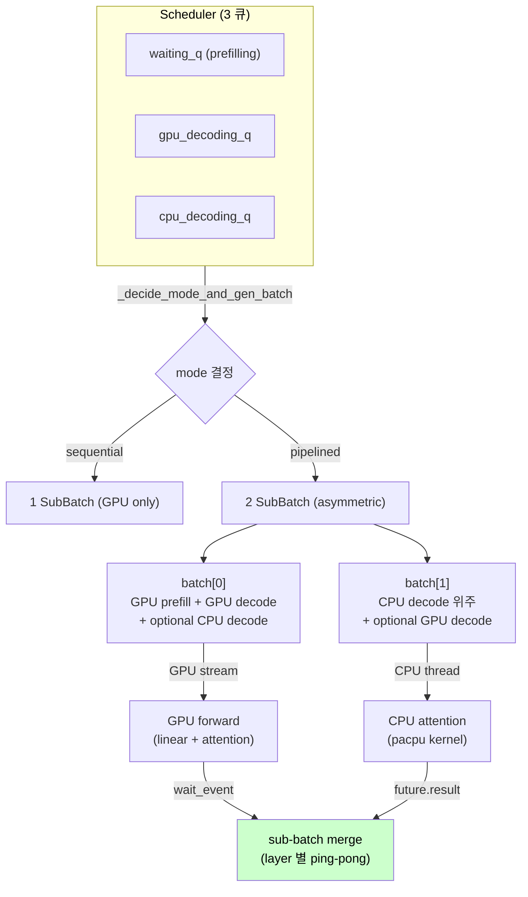

**↑ 부모**: [`README`](README.md) (IDE_006) · **↟ 조부**: [`shadow_assists/README.md`](../../README.md) · **연계**: [`NEO_redesign.md`](NEO_redesign.md), [`TSK_013`](TSK_013.md), [`PLN_001_TSK_013_neo_arch_survey.md`](PLN_001_TSK_013_neo_arch_survey.md)

---

# NEO Code Deep-dive — Asymmetric GPU/CPU Pipelining 의 알고리즘 분석 (논문용 reference)

| 항목 | 값 |
|---|---|
| 작성 일자 | 2026-04-29 |
| 출처 | [NEO-MLSys25/NEO](https://github.com/NEO-MLSys25/NEO) (clone @ `/workspace/neo_ref/`, --depth 1) |
| 논문 | NEO: Saving GPU Memory Crisis with CPU Offloading for Online LLM Inference, Liu et al., MLSys 2025 ([arXiv 2411.01142](https://arxiv.org/abs/2411.01142)) |
| 라이선스 | Apache License 2.0 |
| 목적 | 본 문서는 **NEO 의 알고리즘을 언어 중립으로 추출** 하여 (1) IDE_006 의 4 차 재정의 (NEO 식 architecture) 의 vLLM port 영역 명세, (2) 향후 논문 영역의 reference 자료로 사용. NEO 의 *코드를 직접 차용* 하지 않고 알고리즘만 재구현. |
| 차용 정책 | **알고리즘만 차용** — vLLM 위에 재구현. NEO 의 코드를 그대로 복사하지 않음. NEO 가 Apache 2.0 이라 차용 가능하나 attribution 명시 (본 문서 + 신규 TSK 본문 + 코드 주석). |

> **참고 문서**:
> - 4 차 재정의 결정 history: [`NEO_redesign.md`](NEO_redesign.md)
> - vLLM 적용 plan: [`PLN_001_TSK_013_neo_arch_survey.md`](PLN_001_TSK_013_neo_arch_survey.md)
> - 부모 TSK: [`TSK_013`](TSK_013.md) (Phase 0 분석 + 신규 TSK 발급)

---

## 1. Overview — NEO 의 architecture 한 그림

NEO 는 GPU memory 가 *batch size 의 병목* 이라는 fundamental 관찰에서 출발한다. GPU 메모리가 부족하면 GPU compute 자원이 *놀게* 되므로, KV cache 를 CPU 로 일부 옮겨 GPU batch size 를 확장하면 throughput 향상이 가능하다. 단순한 KV state offload 만으로는 reload PCIe 비용으로 손해이므로, NEO 는 **CPU 가 attention 을 직접 처리** + **두 sub-batch 를 동시 실행** + **request 단위 GPU/CPU exclusive ownership** 의 세 메커니즘을 결합한다.



**핵심 invariant**:

1. **request 단위 KV ownership** — 한 request 의 KV 는 GPU 또는 CPU 한 쪽에 *exclusive*. mirror 도 partial split 도 아님.
2. **CPU 가 attention 을 직접 수행** — Q 만 GPU → CPU 전송. KV 는 CPU 에 상주. attention 결과 (output) 만 CPU → GPU 전송.
3. **두 sub-batch 가 layer 단위 ping-pong** — batches[0] 의 GPU linear 가 진행되는 동안 batches[1] 의 CPU attention 이 진행. 매 layer 마다 두 batch 의 작업 교대.

---

## 2. `SubBatch` 추상 + `BatchPerfData` 모델

NEO 의 모든 메커니즘은 `SubBatch` 추상 위에 작동한다 (`swiftllm/structs.py:211`). 한 SubBatch 는 다음 4 종류의 request 를 담는다:

| 필드 | 의미 |
|---|---|
| `gprf_reqs` | GPU prefilling — 이 batch 에서 GPU 가 prefill 처리 |
| `cprf_reqs` | CPU prefilling — 이 batch 에서 CPU 가 prefill 처리 (드물게 사용) |
| `gdec_reqs` | GPU decoding — 이 batch 에서 GPU 가 decode attention |
| `cdec_reqs` | CPU decoding — 이 batch 에서 CPU 가 decode attention |

**`BatchPerfData`** (perf 예측 변수, `structs.py:148`):

```
BatchPerfData {
    x       : 총 request 수
    s       : 총 token 수 (iter width — linear / FFN / projection 의 입력 차원)
    n_g     : GPU decoding 의 총 KV token 수
    x_c     : CPU decoding request 수
    n_c     : CPU decoding 의 총 KV token 수
    pref_T  : GPU prefilling 시간 누적
    gdec_T  : GPU decoding 시간 (n_g 기반 한 번에 prediction)
    lnch_T  : kernel launch overhead (상수)

    @property linr_T  : predictor.get_linr_T(s)
    @property cdec_T  : predictor.get_cdec_T(x_c, n_c)
    @property gpu_time: linr_T + pref_T + gdec_T
    @property cpu_time: cdec_T + lnch_T
}
```

→ scheduler 는 `gpu_time` 과 `cpu_time` 을 기준으로 *두 sub-batch 의 GPU/CPU 시간이 매칭* 되도록 batch 구성.

**`SubBatch.set_model_forward_args(model_config)`** — forward pass 진입 시 SubBatch 를 *kernel-friendly* metadata 로 변환:

| 필드 | 용도 |
|---|---|
| `batch_size` (= x) | post-layer |
| `iter_width` (= s) | post-layer |
| `num_cprfs / num_gprfs / num_gdecs / num_cdecs` | layer 안 dispatch |
| `num_prefs = num_cprfs + num_gprfs` | prefill 슬라이스 |
| `num_prgds = num_prefs + num_gdecs` | GPU 처리 영역 (prefill + GPU decode) |
| `all_reqs = cprf + gprf + gdec + cdec` | 통합 request list (순서 = layout) |
| `seq_ids_list / seq_lens_list` | KV cache lookup |
| `sum_pref_toks / sum_prgd_toks / max_pref_toks` | attention kernel 의 input slicing |
| `seq_block_size / num_seq_blocks` | paged attention 의 자동 tile 결정 (max_gdec_toks 기반 dynamic adjustment) |

→ NEO 는 SubBatch 안의 request 순서 (`cprf → gprf → gdec → cdec`) 를 *attention kernel layout* 으로 그대로 사용. 이 layout 이 Asymmetric pipelining 의 ping-pong 에서 *어느 부분이 어디서 처리될지* 의 분리 단위.

---

## 3. Scheduler — 6 단계 batch 결정 알고리즘

`Scheduler._get_next_batch_new()` (scheduler.py:237) 가 한 iteration 의 batch 를 결정한다. 알고리즘 (언어 중립 의사 코드):

```
Input:
  budget = ScheduleBudget(max_batch_size, max_tokens_in_batch)
  swap_out_threshold = num_gpu_blocks
  swap_in_threshold  = round(swap_out_threshold * 0.95)
  cpu_threshold      = num_cpu_blocks - num_gpu_blocks

# Step 1: Reserve budget for existing GPU decoding
gpu_block_needed = sum(get_block_needed(r) for r in gpu_decoding_q)
budget -= len(gpu_decoding_q)

# Step 2: Swap-out — GPU 가 over-budget 면 last running 을 CPU 큐로 preempt
while budget.overspent or gpu_block_needed > swap_out_threshold:
    victim = gpu_decoding_q.pop()
    cpu_decoding_q.appendleft(victim)
    swpout_reqs.append(victim)
    gpu_block_needed -= get_block_needed(victim)
    budget.add(1)

# Step 3: Swap-in — CPU 큐의 head 를 GPU 로 옮길 여유 있으면 진행
while cpu_decoding_q:
    candidate = cpu_decoding_q[0]
    if gpu_block_needed + get_block_needed(candidate) > swap_in_threshold or
       not budget.check_and_substract(1):
        break
    gpu_block_needed += get_block_needed(candidate)
    swpin_reqs.append(candidate)
    cpu_decoding_q.popleft()
    gpu_decoding_q.append(candidate)

# Invariant: swap-in 과 swap-out 은 동시에 발생 안 함
assert not swpout_reqs or not swpin_reqs

# Step 4: 새 prefilling 후보 분류 — GPU 빈 자리 우선, 그 다음 CPU
itm_block_needed = 0
cpu_block_needed = sum(get_block_needed(r) for r in cpu_decoding_q)
for candidate in waiting_q:
    if not budget.check_and_substract(candidate.prompt_len): break
    if not pref_to_cpu and gpu_block_needed + need <= num_gpu_blocks:
        gpu_block_needed += need
        pref_to_gpu.append(candidate)
    else:
        cpu_block_needed += need
        itm_block_needed += need
        pref_to_cpu.append(candidate)

# Step 5: pipelined vs sequential 결정 (다음 절 참조)
batches = _decide_mode_and_gen_batch(pref_to_gpu, pref_to_cpu, budget)

# Step 6: 실제 prefilling launch — _decide 가 채택한 prefill 만 큐에서 빼옴
real_num_prefs = sum(b.get_num_prefs() for b in batches)
pref_to_gpu = pref_to_gpu[:real_num_prefs]
pref_to_cpu = pref_to_cpu[:real_num_prefs - len(pref_to_gpu)]
for _ in range(real_num_prefs):
    candidate = waiting_q.popleft()
    candidate.request_id = request_id_manager.get_id()

return batches, swpout_reqs, swpin_reqs
```

**핵심 invariant**:
- `swap-in` 과 `swap-out` 은 한 iteration 에 동시 발생 안 함.
- prefilling 의 GPU/CPU 분류는 *fairness* 영역 — 한번 CPU 로 간 prefill 이 있으면 *후속 prefill 도 CPU* 로 (FCFS 정합).

### 3.1 · `_decide_mode_and_gen_batch` — pipelined vs sequential 선택

5 단계 알고리즘 (scheduler.py:142):

```
Input:
  gpu_prefill_reqs, cpu_prefill_reqs, budget
  gpu_decoding_q, cpu_decoding_q (Scheduler 의 멤버)

# Step 1: 모든 prefill + GPU decode 를 batches[0] 와 gpu_only_batch 양쪽에 배치
batches = [SubBatch(predictor), SubBatch(predictor)]
gpu_only_batch = SubBatch(predictor)
for req in gpu_prefill_reqs:
    batches[0].add_pref(req, is_gpu=True)
    gpu_only_batch.add_pref(req, is_gpu=True)
for req in cpu_prefill_reqs:
    batches[0].add_pref(req, is_gpu=False)
    gpu_only_batch.add_pref(req, is_gpu=False)
for req in gpu_decoding_q:
    batches[0].add_gdec(req)
    gpu_only_batch.add_gdec(req)

# Step 2: gpu_only_batch 의 prefill 양을 줄임 (CPU prefill 은 linr_S_threshold=128 기준)
while gpu_only_batch.get_num_prefs():
    req, is_gpu = gpu_only_batch.pop_pref()
    if is_gpu or gpu_only_batch.perfdata.s < predictor.linr_S_threshold:
        gpu_only_batch.add_pref(req, is_gpu)  # restore
        break

# Step 3: CPU decoding 큐의 request 를 batches[0]/[1] 에 교대로 배치
#         remains[i] = 다른 batch 의 GPU 시간 - 현재 batch 의 CPU 시간
#         remains < 0 → CPU 가 GPU 보다 늦음 → 배치 중단
min_out_cpu_len = ∞
next_batch_idx = 1
for req in cpu_decoding_q:
    if not budget.check_and_substract(1): break
    if req.seq_len >= min_out_cpu_len: continue  # 길이 sweep skip 영역

    batches[next_batch_idx].add_cdec(req)
    remains = _get_remains(batches)
    # remains[j] = batches[j^1].linr_T + batches[j].pref_T + batches[j].gdec_T - batches[j].cpu_time
    if min(remains) < 0:
        min_out_cpu_len = req.seq_len   # 이 length 이상은 모두 skip
        batches[next_batch_idx].pop_cdec()
        continue
    next_batch_idx = (remains[1] > remains[0])  # CPU 가 더 idle 한 쪽으로

# Step 4: batches[0] 의 prefill 일부 줄임 (CPU 가 너무 idle 하지 않게)
while batches[0].get_num_prefs():
    req, is_gpu = batches[0].pop_pref()
    if is_gpu or batches[0].perfdata.s < predictor.linr_S_threshold or
       min(_get_remains(batches)) < 0:
        batches[0].add_pref(req, is_gpu)
        break

# Step 5: pipelined rate vs sequential rate 비교
seqential_time  = gpu_only_batch.gpu_time * num_layers
pipelined_time  = (batches[0].gpu_time + batches[1].gpu_time) * num_layers
seqential_rate  = len(gpu_only_batch) / seqential_time
pipelined_rate  = sum(len(b) for b in batches) / pipelined_time

return batches if pipelined_rate > seqential_rate else [gpu_only_batch]
```

### 3.2 · `_get_remains` — 두 batch 의 GPU/CPU 시간 매칭 측정자

```
remains[j] = batches[j^1].linr_T + batches[j].pref_T + batches[j].gdec_T - batches[j].cpu_time
```

**의미**:
- `batches[j^1].linr_T` = *다른 batch 의* linear 시간 (= GPU 가 다른 batch 처리 중인 시간)
- `batches[j].pref_T + batches[j].gdec_T` = *현재 batch 의* GPU 시간 (linear 외)
- `batches[j].cpu_time` = *현재 batch 의* CPU 시간

→ `remains[j] > 0` ⇔ GPU 가 더 길게 일함 (CPU 가 idle) ⇔ batch j 에 CPU decode 더 추가 가능.
→ `remains[j] < 0` ⇔ CPU 가 더 길게 일함 (GPU 가 idle) ⇔ batch j 에 더 추가 안 됨.

이 measure 가 NEO 의 *load-aware* 의 핵심 — *시간 매칭* 으로 GPU 와 CPU 둘 다 idle 안 되도록 조정.

---

## 4. Asymmetric Pipelining — `_forward_pipeline` 의 layer 단위 ping-pong

`LlamaModel._forward_pipeline(batches, embeddings)` (worker/model.py:278) 는 두 SubBatch 를 *동시* 실행한다. 핵심은 **layer 안에서 두 batch 의 작업이 교차** 한다는 것.

### 4.1 · 메인 loop 구조

```
def _forward_pipeline(batches[0..1], embeddings):
    # Stage 0 — 마지막 layer 의 first stage 만 실행 (= QKV projection of batches)
    q1, k1, v1 = transformer_layers[-1].forward_first_stage(embeddings, batches)

    # Layer ping-pong — N-1 회 반복
    for layer in transformer_layers[:-1]:
        q1, k1, v1 = layer.forward_double(q1, k1, v1, batches)
        # forward_double 안에서:
        #   - GPU 는 batches[0] 의 attention + linear + projection
        #   - CPU 는 batches[1] 의 attention (별도 thread)
        #   - 끝나면 q1/k1/v1 가 batches[1] 의 다음 step 데이터로 update

    # Last stage — 마지막 layer 의 attention + post
    embeddings = transformer_layers[-1].forward_last_stage(q1, k1, v1, batches)

    return embeddings
```

### 4.2 · Layer 단위 ping-pong 의 기하

각 layer 의 `forward_double` 안에서 (개념적):

```
Time →
GPU:  [batches[0] linear] → [batches[0] attention] → [batches[0] post-attn]
                                                  ↘ wait for CPU
CPU:                [batches[1] CPU attention (별도 thread)]
                                                  ↗ result merge

(다음 layer 진입 시 batch 역할 바뀜 가능)
```

**핵심 — 두 batch 가 같은 layer 의 *다른 단계* 를 동시에 수행**:
- batches[0] 이 layer N 의 attention + post 진행
- batches[1] 의 CPU 가 layer N 의 attention 진행
- 다음 layer 진입 시 batches[1] 도 GPU 가 사용할 수 있도록 q1/k1/v1 를 update

이 구조가 *왜 Q dependency dilemma 를 회피하는지*:
- IDE_006 의 hot/cold split = *같은 request 의 layer N 안에서* GPU 와 CPU 가 협력 → GPU 가 진짜 Q 를 가지면 CPU 결과 무용
- NEO 의 asymmetric pipeline = *서로 다른 request 가* 같은 layer N 의 다른 단계를 동시 처리 → GPU 의 Q 와 CPU 의 Q 는 *서로 다른 request* 이므로 충돌 안 함. CPU 결과는 *그 request 의 유일한* attention 결과.

### 4.3 · `forward_first_stage` / `forward_double` / `forward_last_stage` 의 분할

NEO 는 transformer layer 를 다음 stage 로 분할:

| Stage | GPU 작업 | CPU 작업 |
|---|---|---|
| `forward_first_stage` | input projection (Q/K/V) + RoPE | (없음) |
| `forward_double` (반복) | 한 batch 의 attention + post + 다음 batch 의 input projection | 다른 batch 의 CPU attention (background thread) |
| `forward_last_stage` | 마지막 layer 의 attention + output projection | (있을 수 있음) |

이 stage 분할 덕에 *first stage* 가 *next layer 의 input* 을 미리 준비 → 다음 layer 의 CPU 가 즉시 시작 가능 → pipeline depth 1.

---

## 5. BlockManager — 2 device + split-aware

`BlockManager` (block_manager.py:136) 는 GPU + CPU 두 `DeviceBlockManager` 를 통합 관리한다.

### 5.1 · `DeviceBlockManager` 의 핵심 자료구조

```
DeviceBlockManager(device_name='cuda' | 'cpu') {
    num_blocks         : 이 device 의 block 총 수
    block_size         : token / block
    nsplits            : 1 + extra_layer_for_cprf   # CPU prefill split 영역
    seq_num_blks       : tensor[max_seqs]           # seq_id → 현재 alloc 된 block 수
    block_table        : tensor[max_seqs, max_blocks_per_seq]  # (seq, idx) → block_id
    is_block_free      : list[tensor[num_blocks]]   # split_id → block_id → free?
    num_free_blocks    : list[int]                  # split_id → 자유 block 수
}
```

→ `nsplits = 2` 인 이유 = CPU prefill 의 *partial-attention 임시 layer* 영역을 별도 split 에 할당. 이게 NEO 의 *extra_layer_for_cprf* 정책.

### 5.2 · `alloc(reqs, split_point, omit_last)` 알고리즘

```
def alloc(reqs, split_point=0, omit_last=False):
    seq_lens = [r.seq_len for r in reqs] - int(omit_last)
    tgt_num_blks = (seq_lens - 1) // block_size + 1
    seq_num_blks = self.seq_num_blks[seq_ids]
    new_num_blks = tgt_num_blks - seq_num_blks   # request 별 추가 필요 block

    # split_point 기준으로 두 split 에 분할 할당
    new_blk_ids0 = _get_new_blk_ids(sum(new_num_blks[split_point:]), 0)
    new_blk_ids1 = _get_new_blk_ids(sum(new_num_blks[:split_point]), 1)
    # ... block_table 갱신
    return new_blk_vids, new_blk_pids
```

핵심 — `split_point` 가 *CPU prefill 영역* (split 1) 과 *GPU prefill / decode 영역* (split 0) 을 분리.

### 5.3 · `_initiate_swap(reqs, is_swap_out, use_itm, omit_last)` — exclusive 의 swap-in/out

```
def _initiate_swap(reqs, is_swap_out, ...):
    src_block_manager = gpu_block_manager if is_swap_out else cpu_block_manager
    dst_block_manager = cpu_block_manager if is_swap_out else gpu_block_manager
    src_blk_pids = src_block_manager.free(reqs, int(use_itm))     # source 의 block free
    dst_blk_vids, dst_blk_pids = dst_block_manager.alloc(reqs)    # dest 에 alloc
    return src_blk_pids, dst_blk_vids, dst_blk_pids
```

→ swap 은 *source 에서 free + dest 에 alloc* 의 atomic 영역. *exclusive ownership* 의 핵심 — 한 request 의 KV 가 *반드시 한 device 에만* 존재.

---

## 6. PerfPredictor — Table-based Linear Interpolation

`TablePerfPredictor` (perfpredictor.py:70) 는 4 종류의 perf time 을 table 기반 보간으로 prediction 한다:

| 함수 | 입력 | 출력 |
|---|---|---|
| `get_linr_T(S)` | iter_width S | linear (FFN/proj) 시간 |
| `get_pref_T(S)` | prefill total tokens S | GPU prefilling 시간 |
| `get_gdec_T(N)` | GPU decoding total KV tokens N | GPU decoding 시간 |
| `get_cdec_T(S, N)` | CPU batch S, total KV N | CPU decoding 시간 (bilinear) |
| `get_lnch_T()` | (없음) | kernel launch overhead (상수 0.8 ms) |

### 6.1 · Table 인덱스 — `_get_lb_idx_list`

table 의 x 값들 (`linr_S_list`, `pref_S_list`, etc.) 은 *2 의 거듭제곱 + 일부 보강 점* 으로 구성:

```
linr_S_list = [1, 2, ..., 511] + [512, 1024, 2048, ..., max_tokens_in_batch]
pref_S_list = [3·2^(i-2), 2^i for i in range(...)] + [max_tokens_in_batch]
gdec_N_list = [3·2^(i-2), 2^i for i in range(...)] + [max_gpu_tokens]
cdec_S_list = [2^i for i in range(0, ...)] + [max_batch_size]
cdec_N_lists[s] = [S·block_size, 2^i, ..., min(S·max_seq_len, max_cpu_tokens)]
```

`_get_lb_idx_list(input_list)` — input_list 의 *각 정수 x* 에 대해 `min{j : input_list[j] ≥ x}` 를 미리 계산해 array 로 저장. 이후 lookup O(1).

### 6.2 · 1D / 2D Linear Interpolation

```
def _interp(x, x0, x1, y0, y1):  # 두 점 사이 선형 보간
    return y0 + (y1 - y0) * (x - x0) / (x1 - x0)

def _interp_1d(x, xs, ys, x_lb_idx):  # 1D 보간
    if x == 0: return 0
    idx = x_lb_idx[x]
    if idx == 0 or x == xs[idx]: return ys[idx]
    return _interp(x, xs[idx-1], xs[idx], ys[idx-1], ys[idx])

def get_cdec_T(S, N):  # 2D (bilinear) 보간
    s_idx = cdec_S_lb_idx[S]
    if s_idx == 0 or S == cdec_S_list[s_idx]:
        return _interp_1d(N, cdec_N_list_agg, cdec_T_lists[s_idx], cdec_N_lb_idx)
    s0, s1 = cdec_S_list[s_idx-1], cdec_S_list[s_idx]
    ts0 = _interp_1d(N, ..., cdec_T_lists[s_idx-1], ...)
    ts1 = _interp_1d(N, ..., cdec_T_lists[s_idx],   ...)
    return _interp(S, s0, s1, ts0, ts1)
```

### 6.3 · Profile data 채우기

NEO 는 첫 startup 시 `ModelProfiler` (profiler.py) 가 **각 (S, N) 점에서 actual forward 측정** 을 수행하여 `*_T_list` 들을 채운다. 이후 scheduling 의 `BatchPerfData` 가 보간으로 prediction.

---

## 7. CPU Attention Kernel — `pacpu/`

NEO 의 CPU attention 은 Intel ISPC + C++ 로 구현 (`pacpu/`):

| 파일 | 내용 |
|---|---|
| `pacpu.ispc` | ISPC kernel (AVX2 SIMD) — `qk_product`, `softmax`, `wsum` |
| `pacpu.cpp` | C++ wrapper — torch::Tensor 를 ISPC 함수로 dispatch |
| `core.h` | inline reference (brute-force) 알고리즘 — `store_kv`, `qk_product` |
| `dtype.h` | data type (FP16 default) |
| `CMakeLists.txt` | model 별 빌드 (`-DModel=llama2_7b -DTP=1`) |

### 7.1 · 핵심 알고리즘 (`core.h:qk_product` reference)

```
def qk_product(cur_layer, num_blocks, seq_len, q, k_cache, block_table, a):
    for j in range(0, seq_len, BLOCK_SIZE):
        kp = k_cache[cur_layer * num_blocks + block_table[j / BLOCK_SIZE]]
        tlim = min(BLOCK_SIZE, seq_len - j)
        for h in range(NUM_KV_HEADS):
            for t in range(tlim):
                for d in range(HEAD_DIM):
                    for l in range(QH_PER_KVH):  # GQA broadcast
                        a[(h * QH_PER_KVH + l) * seq_len + (j + t)] += q[...] * kp[...]
```

이 알고리즘은 **IDE_006 의 portable C++ kernel (TSK_001) 과 동등**. NEO 는 ISPC 의 SIMD intrinsic 으로 *AVX2 가속* 만, IDE_006 은 AVX-512 + AMX 까지 가속. **prod target (Xeon SPR + AMX) 에서 IDE_006 의 AVX-512/AMX kernel 이 우위**.

### 7.2 · NEO kernel 의 한계 / IDE_006 우위

| 차원 | NEO `pacpu` | IDE_006 `partial_attention_*` |
|---|---|---|
| SIMD 폭 | AVX2 (256-bit) | AVX-512 (512-bit) + AMX tile 16 KB |
| 모델별 빌드 | 필수 (`build.sh <model> <tp>`) | 동적 dispatch (모델 무관) |
| GQA 처리 | inline broadcast | 옵션 A (compact + broadcast, TSK_007 채택) |
| NUMA-aware | 미적용 | TSK_004 적용 |
| Multi-OMP-team | 미적용 | TSK_010 인프라 |

→ **NEO 의 CPU kernel 영역은 IDE_006 가 그대로 사용** (TSK_001 + 003 + 004 + 007 + 010 의 코드를 NEO 식 architecture 의 CPU sub-batch attention path 에 통합).

---

## 8. NEO 의 fundamental 한계 / 본 IDE_006 적용 시 주의

| 한계 | 설명 | 대응 |
|---|---|---|
| TP=1 가정 (`SingleProcExecutor`) | NEO 의 단일 프로세스 path 는 TP=1. TP>1 은 `RayExecutor` 영역 | vLLM 의 기존 TP infra 위에 NEO 메커니즘 적재. IDE_006 의 prod target = TP=8 (Llama-70B + H100×8) |
| LLaMa 만 지원 | `LlamaModel` 만 구현 | vLLM 위 적재 시 `Qwen` / `Mistral` / 등 모델별 forward 통합 필요 |
| Profile cost | 첫 startup 시 ModelProfiler 가 각 (S, N) 점 측정 — 시간 소요 | IDE_006 적재 시 profile run 의 측정 점 줄이는 영역 가능 |
| `extra_layer_for_cprf` 의 의미 | CPU prefill 이 *임시 GPU layer* 영역 사용 — vLLM 의 KV cache layout 과 다름 | vLLM 위 적재 시 CPU prefill 영역 처리 정책 결정 필요 |

---

## 9. References

- 논문: [arXiv 2411.01142](https://arxiv.org/abs/2411.01142) (NEO: Saving GPU Memory Crisis with CPU Offloading for Online LLM Inference, MLSys 2025)
- 코드: [NEO-MLSys25/NEO](https://github.com/NEO-MLSys25/NEO) (Apache License 2.0)
- 본 분석 대상 파일들:
  - `swiftllm/server/scheduler.py` (17 KB, 410 lines)
  - `swiftllm/server/block_manager.py` (11.5 KB, ~270 lines)
  - `swiftllm/worker/model.py` (14.9 KB, 386 lines)
  - `swiftllm/structs.py:148~298` (BatchPerfData + SubBatch)
  - `swiftllm/perfpredictor.py` (6.7 KB, 197 lines)
  - `pacpu/core.h` + `pacpu/pacpu.ispc` (10 + 6.6 KB)
- IDE_006 내부 연계:
  - [`NEO_redesign.md`](NEO_redesign.md) — 4 차 재정의 결정 history
  - [`PLN_001_TSK_013_neo_arch_survey.md`](PLN_001_TSK_013_neo_arch_survey.md) — vLLM 매핑 plan
  - [`TSK_013`](TSK_013.md) — 본 문서의 부모 TSK

---

## 10. Change Log

| 날짜 | 변경 | 사유 |
|---|---|---|
| 2026-04-29 | NEO_code_deepdive.md 신규 발행 (본 문서) | 사용자 결정 (2026-04-29) — 깊은 코드 dive 결과를 향후 논문 영역의 reference 자료로 사용 가능하도록 *별도 md* 로 정리. NEO 의 코드를 *직접 차용* 하지 않고 *알고리즘만 재구현* 의 결정 (Apache 2.0 호환, attribution 명시) 에 따라 본 문서는 *언어 중립 의사 코드 + 알고리즘 분석* 으로 정리. §1 overview + §2 SubBatch / BatchPerfData + §3 Scheduler 6 단계 + §4 Asymmetric pipelining layer ping-pong + §5 BlockManager exclusive ownership + §6 PerfPredictor table-based interpolation + §7 CPU kernel pacpu (IDE_006 우위 영역) + §8 fundamental 한계. |

---

**↑ 부모**: [`README`](README.md) (IDE_006) · **↟ 조부**: [`shadow_assists/README.md`](../../README.md) · **연계**: [`NEO_redesign.md`](NEO_redesign.md), [`TSK_013`](TSK_013.md), [`PLN_001_TSK_013_neo_arch_survey.md`](PLN_001_TSK_013_neo_arch_survey.md)
