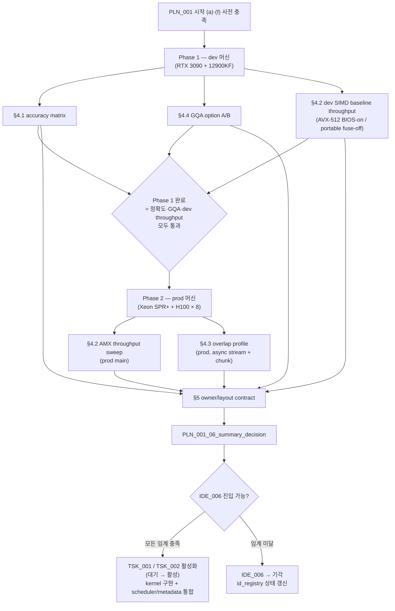

**↑ 부모**: [`IDE_006`](README.md)

---

# PLN_001 — Cold-KV CPU Partial Attention PoC 플랜

| 항목 | 값 |
|---|---|
| ID | `PLN_001` |
| 상태 | `활성` (Phase 1 — dev simulation 으로 진행 중. Phase 2 prod 는 운영 (a) 충족 후 사용자 직접 진행) |
| 부모 IDE | [`IDE_006`](README.md) (Cold-KV CPU Partial Attention) |
| 자식 TSK | [`TSK_001`](TSK_001.md) · [`TSK_002`](TSK_002.md) |
| 목적 | IDE_006 §9 진입 조건 **(b)(c)(d)(g)** 를 microbench 측정·결정해 이미 적재된 [`TSK_001`](TSK_001.md) / [`TSK_002`](TSK_002.md) 활성화 또는 `IDE_006` 기각 판정 |
| 비범위 | multi-GPU / TP > 1, MLA / Mamba / sliding window, production 통합, FlashMLA, FP8 KV (IDE_006 §9 (f) scope lock) |
| 산출물 | `PLN_001_01_*.md` ~ `PLN_001_06_summary_decision.md` (§7) |
| ID 넘버링 출처 | [`shadow_assists/id_registry.md`](../../id_registry.md) |

> **단계 주의**: 본 파일은 PoC/microbench 플랜 (pre-TSK). 실험 산출물은 §7 deliverables 명세에 따라 동일 `IDE_006/` 디렉토리에 `PLN_001_NN_*.md` 형태로 누적된다 (`PLN_001` prefix 로 다른 파생 ID 의 산출물과 namespace 충돌 회피).

---

## 1. TL;DR

PLN_001 은 IDE_006 의 정확도·throughput·overlap·GQA 를 한 번의 microbench 묶음으로 측정해 다음을 결정한다:

- **모든 임계 충족** → 이미 적재된 [`TSK_001`](TSK_001.md) (LSE-반환 CPU partial-attention kernel) / [`TSK_002`](TSK_002.md) (scheduler / metadata 통합) 활성화 (`대기` → `활성`)
- **임계 미달** → `IDE_006` 상태를 `기각` 으로 갱신, 후속 ID 발급 보류

PoC 코드는 **실 모델 통합 없이 microbench 만**. 단일 GPU + 단일 CPU 노드. BF16/FP16 KV, non-FP8, non-MLA, full attention, 단일 KV group (IDE_006 §9 (f)).

---

## 2. 진입 조건과의 매핑

PLN_001 은 IDE_006 §9 의 7 개 진입 조건 중 **(b)(c)(d)(g) 4 개를 직접 해결**한다.

| IDE_006 §9 조건 | 본 PLN 어디서 해결 | 판정 시점 |
|---|---|---|
| (a) long-context workload (≥ 8K) | dev: ≥8K prompt 합성으로 시뮬레이션 / prod: 운영 데이터 | **Phase 1 (dev) 는 (a) 운영 충족 없이 시작 가능** (≥8K 합성 prompt). **Phase 2 (prod) 진입은 (a) 운영 전환 게이트** |
| **(b)** CPU partial-attn worker throughput | §4.2 throughput sweep | PLN 종료 |
| **(c)** tolerance(rtol/atol) 내 GPU-only 결과 일치 | §4.1 accuracy matrix | PLN 종료 |
| **(d)** GQA (Q=32 / KV=4) head broadcast 동작 | §4.4 GQA option | PLN 종료 |
| (e) IDE_001/002/004 priority/conflict matrix | 설계 결정 (PLN 외부) | 별도 |
| (f) 초기 scope lock | PLN 시작 시점 고정 (본 README §3) | 사전 |
| **(g)** Q/partial transfer + CPU 연산이 GPU hot-attn 과 overlap | §4.3 overlap profile | PLN 종료 |

(e) priority/conflict matrix 는 IDE_006 §5.3 표가 이미 초안. (f) scope 는 본 PLN 시작 시점에 BF16/FP16, non-FP8, non-MLA, full attention, 단일 KV group 으로 잠금.

---

## 3. 사전 고정 (Scope Lock)

PLN 착수 전 다음을 고정 (IDE_006 §9 (f)):

| 차원 | 값 | 근거 |
|---|---|---|
| KV dtype | BF16, FP16 | `vllm/v1/attention/backends/cpu_attn.py:250-251` (FP8 미지원) |
| KV group | 단일 | `vllm/v1/kv_offload/worker/cpu_gpu.py:139` (`assert len(kv_cache_groups_data_refs) == 1`) |
| attention | full (non-sliding-window, non-Mamba/HMA) | OffloadingConnector 가 hybrid kv cache manager 를 끄는 vLLM 기본 동작과 정합 |
| attention 패밀리 | non-MLA | head_dim 호환성 단순화 |
| 모델 | Qwen2.5-7B-Instruct | GQA Q=32 / KV=4. eval baseline 과 정합 |
| 하드웨어 (Phase 1 — dev) | RTX 3090 (24 GB) + Intel Core i9-12900KF + 시스템 RAM | 정확도 / 인터페이스 / 빌드 검증, 소규모 microbench. AVX-512 BIOS 활성화 사전 확인 필요. AMX hardware 미지원 (Alder Lake) — AMX 는 cross-compile + 단위 테스트만 |
| 하드웨어 (Phase 2 — prod) | Intel Xeon Sapphire Rapids 이상 + NVIDIA H100 × 8 + 시스템 RAM | AVX-512 + AMX 둘 다 native. throughput sweep / overlap profile / 최종 net-win 판정의 기준 머신. PLN scope 의 **TP=1 microbench 는 본 머신의 단일 GPU 단위에서 측정**, multi-GPU 는 FEA 단계 |
| cold-tier | OffloadingConnector (vLLM 내장) | 외부 의존 없음. `eval/envs/ide006_cold_kv.env` 와 정합 |
| CPU 가속 경로 | **AVX-512 + AMX 둘 다 메인 경로** | AMX 는 prod 타깃의 native ISA. 어느 쪽도 후순위·deferred 가 아님 (CLAUDE.md `# Hardware Targets` 와 정합) |

---

## 4. 실험 매트릭스

### 4.1 · Accuracy matrix — 진입 조건 (c)

| 차원 | 값 |
|---|---|
| context length | 2K, 4K, 8K, 16K, 32K |
| cold ratio | 0.25, 0.5, 0.75 |
| batch size | 1, 2, 4 |
| dtype | BF16, FP16 |
| layout | dense (시뮬레이션) / GQA(Q=32, KV=4) |

각 셀에서 다음 **3-way 비교** (단일 query 토큰의 attention output):

- A. **GPU-only eager** (PyTorch reference)
- B. **GPU-only FlashAttention** (vLLM `flash_attn` backend, kv-transfer-config 비활성)
- C. **IDE_006 hot/cold split path** — hot KV 만 GPU 에서 partial attention → CPU 에서 cold KV partial attention (LSE 반환) → GPU 에서 `merge_attn_states` 로 합산

수치 비교: `(O_C - O_A)`, `(O_C - O_B)`, `(O_B - O_A)` 의 max abs / max rel 을 모두 기록.

**기각 기준**: 사전 합의된 `rtol`, `atol` 내에서 `(O_C ≈ O_A)` AND `(O_C ≈ O_B)` 가 성립하지 않으면 → `IDE_006` 기각. 사전 합의값은 본 PLN 의 `01_accuracy_matrix.md` §"tolerance 후보값" 에서 결정 (FlashAttention 의 자체 비결정성을 먼저 측정 후 그 이상을 허용).

### 4.2 · Throughput sweep — 진입 조건 (b)

CPU 측 partial attention kernel 의 단독 처리량 측정.

| 차원 | 값 |
|---|---|
| context length | 2K, 4K, 8K, 16K, 32K |
| cold ratio | 0.25, 0.5, 0.75 |
| CPU 코어 수 | 1, 2, 4, 8 (NUMA bind) |
| OMP threads | (코어 수와 동일) |
| 경로 | **AVX-512 + AMX 둘 다 메인** + **portable C++ fallback** (dev 정식 fallback). dev: AVX-512 BIOS 활성이면 AVX-512 직접 실행, fuse-off 면 portable C++ 로 자동 dispatch (둘 다 동일 cpuid wrapper 가 결정) / AMX 는 cross-compile + 단위 테스트만. prod: AMX 본격 sweep (BF16 native `Tdpbf16ps`) + AVX-512 cross-check. 자세한 dispatch 정책은 [`TSK_001`](TSK_001.md) §4.3 참조 |

지표: `tokens/s · per-core efficiency · L2/L3 hit ratio`.

**기각 기준**: 모든 시험 영역에서 `T_GPU_full_reload + T_GPU_full_attn > T_Q_transfer + T_CPU_partial + T_partial_transfer` 의 net-win 이 성립하지 않으면 → `IDE_006` 기각.

### 4.3 · Overlap profile — 진입 조건 (g)

GPU hot-attn 과 CPU partial 의 **wall-time overlap 가능성** 측정. 측정 분해:

| 구간 | 내용 |
|---|---|
| `T_Q_transfer` | GPU → CPU Q 텐서 송신 (D2H) |
| `T_CPU_partial` | CPU partial-attention kernel 실행 |
| `T_partial_transfer` | CPU → GPU `(O_cold, LSE_cold)` 송신 (H2D) |
| `T_GPU_hot_attn` | GPU 의 hot subset flash_attn forward |
| `T_merge` | `merge_attn_states` 합산 |

가설: **두 전용 CUDA stream + async H2D/D2H + Q 청크 파이프라이닝** 으로 다음을 충족 가능

```
T_Q_transfer + T_CPU_partial + T_partial_transfer  ≤  T_GPU_hot_attn + ε
```

ε 는 layer 당 허용 critical-path 추가시간 (예: 5%) — `01_accuracy_matrix.md` 와 함께 사전 합의.

**기각 기준**: 위 부등식이 어떤 chunk 크기에서도 성립하지 않으면 → `IDE_006` 기각 (mid-layer synchronization 비용이 이득을 초과).

### 4.4 · GQA option A/B — 진입 조건 (d)

| 옵션 | 설명 |
|---|---|
| A | K/V 를 KV-head 단위로 CPU 에 저장 (compact). CPU 에서 broadcast 후 연산 |
| B | CPU 에서 Q-head 단위로 미리 expand 된 버퍼 유지 (메모리 희생, 연산 단순) |

지표: throughput (tokens/s), 메모리 footprint (bytes/req), L2/L3 working set fit.

**선정 기준**: throughput 우위 + 메모리 합리성. PLN 종료 시점에 한 옵션 고정. 둘 다 성립 안 하면 → `IDE_006` 기각.

---

## 5. Owner / Layout 계약 초안

PLN 종료 시 IDE_006 §5.2 의 4 항목을 결정한다 (TSK 단계 입력으로 사용).

| 항목 | 결정 후보 |
|---|---|
| cold 블록 dtype | (a) 원본 BF16/FP16 그대로 / (b) Q8 등 양자화 |
| paged layout | (a) vLLM block 단위 그대로 / (b) CPU-friendly tile 재배열 |
| lifetime | (a) refcount / (b) lease / (c) copy-on-demand |
| head dim / num_kv_heads CPU 표현 | §4.4 결과에 종속 |

---

## 6. 의존성·일정



**Phase 1 (dev)** 는 정확도·인터페이스·GQA 동작·**dev SIMD baseline** (AVX-512 BIOS 활성 시 AVX-512 / fuse-off 시 portable C++ — wrapper 의 cpuid dispatch 결과에 따름) 까지 cover. **본 워크스테이션 (RTX 3090 + 12900KF) 에서 자동 iteration 으로 진행 (Claude / 자동화)**. 정확도가 깨지면 Phase 2 로 진입할 의미가 없음.

**Phase 2 (prod)** 는 AMX throughput · overlap · 최종 net-win 판정. **Xeon SPR+ + H100×8 머신에서 사용자가 직접 진행** (Phase 1 통과 + (a) 운영 충족 후). PLN 의 핵심 결과는 prod 머신에서 산출. dev/prod 결과는 같은 deliverable 파일에 두 set 으로 누적 (예: `PLN_001_02_throughput_sweep.md` 가 dev SIMD baseline (AVX-512 또는 portable) / prod AVX-512 / prod AMX 세 결과 포함).

순서 권장: **(c) accuracy → (d) GQA → (b) dev SIMD baseline (AVX-512 또는 portable) → prod 머신 확보 → (b) AMX prod + (g) overlap prod** — 정확도가 깨지면 나머지 보류.

---

## 7. 산출물 (Deliverables)

본 디렉토리에 다음 파일을 누적 생성한다.

| 파일 | 내용 | 매핑 §9 조건 |
|---|---|---|
| `PLN_001_01_accuracy_matrix.md` | accuracy 결과 + tolerance 결정 | (c) |
| `PLN_001_02_throughput_sweep.md` | throughput 결과 + net-win 영역 시각화. **dev SIMD baseline (AVX-512 BIOS-on 또는 portable fuse-off) / prod AVX-512 / prod AMX 세 set** 누적 | (b) |
| `PLN_001_03_overlap_profile.md` | overlap 측정 + 가능 여부 판정 | (g) |
| `PLN_001_04_gqa_option.md` | GQA 옵션 A/B 비교 + 선정 | (d) |
| `PLN_001_05_owner_layout_contract.md` | connector 계약 4 항목 결정 | §5 |
| `PLN_001_06_summary_decision.md` | IDE_006 진입/기각 최종 판정 + TSK 후속 분기 | 종합 |

각 파일은 측정 데이터 (CSV/JSON) 와 분석 (Markdown) 을 함께 포함. eval/results 와의 hardware tag 일치 권장. 모두 `IDE_006/` 디렉토리에 `PLN_001_` prefix 로 평탄 적재.

---

## 8. 판정 분기

| 결과 | 후속 작업 | id_registry 변경 |
|---|---|---|
| 4 개 임계 모두 충족 | 이미 적재된 [`TSK_001`](TSK_001.md), [`TSK_002`](TSK_002.md), [`TST_001`](TST_001.md), [`TST_002`](TST_002.md), [`TST_003`](TST_003.md) 의 상태를 `대기` → `활성` 으로 전환하고 구현 흐름 (TSK_001 → TST_001 → TSK_002 → TST_003 → TST_002) 순서로 진행. 이후 `FEA_###` (통합) 만 신규 발급 | `PLN_001` 상태 → `완료`. 5 개 자식 ID 활성화. `FEA_###` 만 신규 발급 |
| 4 개 중 1+ 미달 | `IDE_006` 기각. 본 PLN 도 `완료` 로 종결 (재정의 가능성 별도 판단) | `IDE_006` 상태 → `기각` (재사용 금지 룰 유지). `PLN_001` 상태 → `완료` |

---

## 9. Open Questions (carry-over from IDE_006 §12)

PLN 진행 중 결정해야 함:

1. `rtol / atol` 의 운영 후보값 — `01_accuracy_matrix.md` 에서 FlashAttention 자체 비결정성 측정 후 결정.
2. OffloadingConnector 의 CPU tensor 를 수정 없이 attention 입력으로 쓸 수 있는가, "view 어댑터" 가 필요한가 — `05_owner_layout_contract.md` 에서 결정.
3. GQA head broadcast 시 L2/L3 working set fit — `02_throughput_sweep.md` + `04_gqa_option.md` 에서 측정.
4. hot/cold 분할 추출 가능성 — `vllm/v1/kv_offload/abstract.py:94` 의 `OffloadingManager.lookup` (class 정의는 `:92`, docstring `:99-110`) 은 "**앞에서부터 연속으로 offloaded 된 block 수**" 만 반환 (즉 prefix-only contiguous count). 임의의 hot/cold 분할 set 을 즉시 얻기 어렵다. 추가 hook 또는 connector worker 내부 상태 노출이 필요한지, 또는 prefix-suffix 형태로 모델 (suffix 가 hot, prefix 가 cold) 로 한정해야 하는지를 `TSK_002` §4.1 partition API survey 가 결정한다.
5. `IDE_005` (CPU drafter) 와의 자원 경합 — IDE_005 자체가 미진입이므로 본 PLN 에서는 deferred. 만약 IDE_005 가 PLN_001 동안 진입한다면 별도 PLN 으로 conflict matrix 작성.
6. Q chunk 파이프라이닝 가능 chunk 크기 — `PLN_001_03_overlap_profile.md` 에서 측정.
7. **AMX BF16 (`Tdpbf16ps`) 적용 영역**: partial attention 의 `Q · Kᵀ` matmul 과 `P · V` matmul 중 어느 부분이 AMX tile (16×32 BF16) 친화적인지, head_dim=128 / num_kv_heads=4 (Qwen2.5-7B GQA) layout 이 tile 경계와 잘 맞는지 — `PLN_001_02_throughput_sweep.md` + `PLN_001_04_gqa_option.md` 에서 결정.
8. **dev↔prod 결과 보간**: dev 머신의 AVX-512 결과가 prod 머신의 AVX-512 결과와 추세상 일관되는지 (CPU 코어 수·캐시 크기·메모리 대역 차이 보정 후). 비일관 시 prod 결과만 final, dev 결과는 정확도/인터페이스 검증 한정으로 격하.
9. **AVX-512 dev 활성화 점검**: dev 머신 (12900KF) 에서 `cat /proc/cpuinfo | grep -o 'avx512[a-z_]*' | sort -u` 로 활성 ISA 확인. fuse-off 면 [`TSK_001`](TSK_001.md) §4.2c portable C++ kernel 이 자동 main path 가 되어 dev iteration 진행 가능 (Python reference 까지 떨어지지 않음).

---

## 10. References

### 부모·연계 문서

- 부모 IDE 상세: [`IDE_006`](README.md)
- 자식 TSK: [`TSK_001`](TSK_001.md), [`TSK_002`](TSK_002.md)
- 상위 통합 설계: [`shadow_assists/README.md`](../../README.md) (§3.2 요약)
- ID 넘버링 출처: [`shadow_assists/id_registry.md`](../../id_registry.md)
- eval baseline: [`eval/envs/vllm_original.env`](../../../eval/envs/vllm_original.env), [`eval/envs/ide006_cold_kv.env`](../../../eval/envs/ide006_cold_kv.env)

### 코드 인용 (IDE_006 README §6.1 동일)

- `vllm/v1/attention/backends/cpu_attn.py:250-251` (FP8 미지원), `:261-293` (forward LSE 미반환)
- `vllm/v1/kv_offload/worker/cpu_gpu.py:138-139` (single KV group assert)
- `vllm/v1/attention/backends/flash_attn.py:967`, `:1214` (merge 호출부)
- `vllm/v1/attention/ops/merge_attn_states.py` (Python wrapper, [arXiv 2501.01005 §2.2](https://arxiv.org/abs/2501.01005) 인용)
- `csrc/attention/merge_attn_states.cu` (CUDA 커널)
- `vllm/distributed/kv_transfer/kv_connector/v1/offloading_connector.py` (cold-tier connector)

---

## 11. Change Log

| 날짜 | 변경 | 사유 |
|---|---|---|
| 2026-04-25 | PLN_001 초안 작성 | IDE_006 §11 step 1 의 PLN 으로 적재. 진입 조건 (b)(c)(d)(g) 4 개 해결을 목표로 microbench 매트릭스·overlap profile·GQA 옵션·owner/layout 계약 초안을 정의. 산출물 `PLN_001_01_*.md` ~ `PLN_001_06_summary_decision.md`. |
| 2026-04-25 | 디렉토리 평탄화 | 별도 디렉토리 (`PLN_001/`) 제거하고 `IDE_006/PLN_001.md` 단일 파일로 이동. 산출물 prefix 를 `PLN_001_` 로 변경 (namespace 충돌 회피). 부모·자식·sibling 네비게이션을 최상단/최하단에 추가. |
| 2026-04-25 | 정합성 7 항목 보정 | (1+2) 상태 `활성` → `대기` (실험 착수 전, IDE_006 (a) 충족 게이트). (a) 매핑 표현도 갱신. (3) §4.3 H2D/D2H 방향 반대로 적힌 부분 정정 (GPU→CPU=D2H, CPU→GPU=H2D). (5/§9 Q4) hot/cold 분할 추출 단정 약화 — `kv_offload/abstract.py:92` `lookup()` 이 prefix-only contiguous count 만 반환하는 사실 명시, partition 책임을 `TSK_002` §4.1 survey 로 위임. (4/§8 분기) "TSK 신규 발급" 표현 → "이미 적재된 TSK_001/002 활성화" 로 수정. |
| 2026-04-25 | 자체 검증 잔여 보정 | 본 PLN 의 §1 메타헤더 / §1 TL;DR / §6 Mermaid 일정 그래프 종단 노드의 generic `TSK_###` 표기를 모두 구체적인 [`TSK_001`](TSK_001.md) / [`TSK_002`](TSK_002.md) 활성화 표현으로 통일. |
| 2026-04-25 | dev/prod 머신 분리 + AMX 메인 경로 격상 | CLAUDE.md 신규 `# Hardware Targets` 섹션과 정합. (1) §3 Scope Lock 에 하드웨어를 Phase 1 (dev — RTX 3090 + 12900KF, AVX-512 BIOS 점검 필요, AMX 미지원) / Phase 2 (prod — Xeon SPR+ + H100 × 8) 두 줄로 분리. "CPU 가속 경로" 행 신설하여 AVX-512 + AMX **둘 다 메인** 명시. (2) §4.2 throughput sweep 의 "경로" 차원을 (AVX-512 dev/prod) + (AMX prod, BF16 native) 로 확장 (이전 "AMX deferred" 표기 폐기). (3) §6 Mermaid 일정 그래프를 Phase 1 (dev) → Phase 2 (prod) 두 단계로 재구조화. (4) §7 deliverable `PLN_001_02_throughput_sweep.md` 에 dev/prod 세 set 결과 누적 명시. (5) §9 Open Questions 에 AMX 적용 영역 (Q·Kᵀ / P·V), dev↔prod 결과 보간, AVX-512 dev 활성화 점검 3 항목 추가. |
| 2026-04-25 | Portable C++ fallback 정합 | TSK_001 의 4.2c portable C++ fallback kernel 신설과 정합. (1) §4.2 throughput sweep 의 "경로" 차원에 dev AVX-512 fuse-off 시 portable C++ 자동 dispatch 명시. (2) §9 Q9 의 fallback 거동을 "Python reference 까지 떨어지지 않음 (portable C++ 가 main)" 으로 갱신. wrapper 의 4 단계 dispatch (AMX → AVX-512 → portable → Python reference) 는 [`TSK_001`](TSK_001.md) §4.3 단일 출처. |
| 2026-04-25 | 정밀화 (P1·P4) | (P1) `vllm/v1/kv_offload/abstract.py:92` 인용을 `:94` (실제 `def lookup` 시작) 로 정정. class 정의 `:92` / docstring `:99-110` 은 부연으로 명시. (P4) §6 Mermaid 일정 그래프의 엣지 정리 — A/D/B1 → `Phase 1 완료` 게이트 노드 → P2 로 모이게 재구조화. 모든 deliverable 노드 (A/D/B1/B2/C) → CL 의 fan-in 분리. 시각적 흐름 명확화. |
| 2026-04-25 | 후속 정밀화 (dev SIMD baseline 일반화) | TSK_001 wrapper dispatch (AMX → AVX-512 → portable → Py reference) 와 정합. (1) §6 본문 "AVX-512 baseline" 표현을 "**dev SIMD baseline** (AVX-512 BIOS-on / portable fuse-off — wrapper cpuid dispatch 결과)" 로 일반화. (2) §6 Mermaid B1 노드 라벨 동일 일반화. (3) §7 deliverable 표의 throughput sweep set 표기를 "dev AVX-512 / prod AVX-512 / prod AMX" → "**dev SIMD baseline (AVX-512 BIOS-on 또는 portable fuse-off) / prod AVX-512 / prod AMX**" 로 정정. fuse-off 시 portable 이 dev baseline 이 되는 경로를 그래프·본문·deliverable 모두에서 정합. |
| 2026-04-25 | TST_001 / TST_002 적재 반영 | (1) 자식 nav 에 `TST_001` / `TST_002` 추가. (2) §8 판정 분기 표 갱신 — "이후 `TST_###` 신규 발급" → "이미 적재된 `TST_001` / `TST_002` 활성화" 로 통일 (TSK 와 동일 패턴). 이제 `FEA_###` 만 신규 발급. |
| 2026-04-25 | dev/prod 역할 분담 + 상태 활성화 | (1) §9 (a) 의미 명확화 — "Phase 1 (dev) 는 ≥8K 합성 prompt 로 (a) 운영 충족 없이 시작 가능 / Phase 2 (prod) 는 (a) 운영 전환 게이트". (2) PLN_001 상태 `대기` → `활성 (Phase 1 dev simulation)`. (3) §6 본문에 "Phase 1 = 본 워크스테이션 자동 iteration / Phase 2 = 사용자 직접 진행" 역할 분담 명시. id_registry 의 PLN_001 / TSK_001 상태도 동일 갱신. |

---

**↑ 부모**: [`IDE_006`](README.md) · **↓ 자식**: [`TSK_001`](TSK_001.md) · [`TSK_002`](TSK_002.md) · [`TST_001`](TST_001.md) · [`TST_002`](TST_002.md) · [`TST_003`](TST_003.md)
