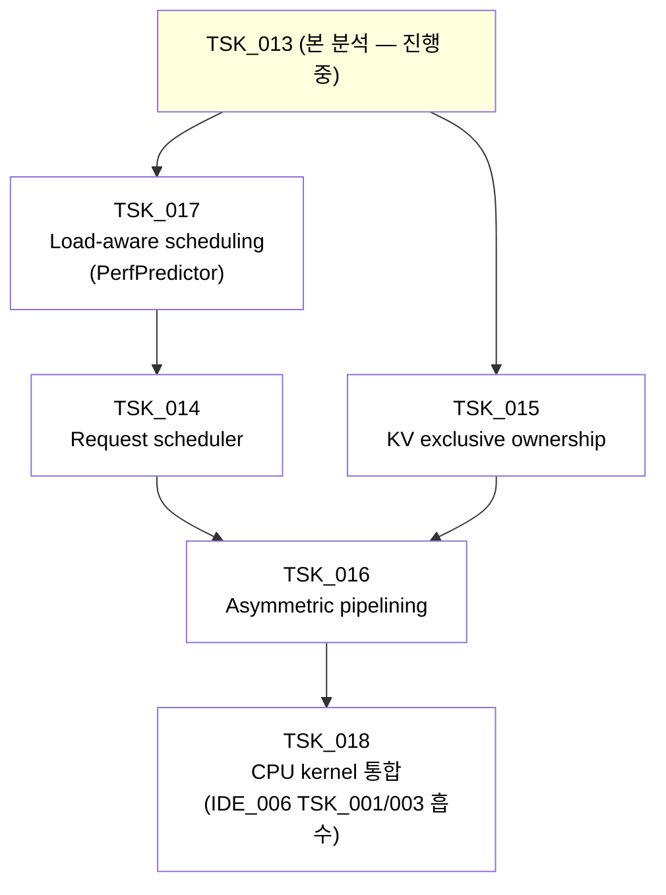

**↑ 부모 TSK**: [`TSK_013`](TSK_013.md) · **↟ 부모 PLN**: [`PLN_001`](PLN_001.md) · **↟↟ 조부 IDE**: [`IDE_006`](README.md)

---

# PLN_001 · TSK_013 PLN deliverable — NEO repo 핵심 모듈 분석 + vLLM 적용 plan (1차)

> **본 문서의 위치**: [`TSK_013`](TSK_013.md) §5.1 의 산출물. NEO repo (`/workspace/neo_ref/`) 의 핵심 모듈을 식별하고 vLLM 의 hook 위치와 매핑하여 신규 TSK 들의 변경 범위를 산출한다. 본 문서는 **1차 분석** — 깊은 코드 dive 는 다음 turn 들에서 점진적으로 보강.

---

## 1. NEO 의 핵심 추상 — `SubBatch`

NEO 의 모든 메커니즘은 `SubBatch` 추상 위에 작동한다 (`swiftllm/structs.py:211`):

```python
class SubBatch:
    def add_pref(self, req: Request, is_gpu: bool):  # prefilling — is_gpu 플래그
    def add_gdec(self, req: Request):                # GPU-decode
    def add_cdec(self, req: Request):                # CPU-decode
    def set_model_forward_args(self, model_config):  # forward 진입 시 metadata 변환
```

→ 한 SubBatch 안에 **prefill (GPU 또는 CPU) + GPU-decode + CPU-decode** 가 섞일 수 있음. asymmetric pipelining 의 두 sub-batch 는 *서로 다른 SubBatch instance*.

vLLM 에는 이 추상이 *없음*. vLLM 의 batch 는 단일 `Scheduler.schedule()` 결과로 GPU 가 일괄 처리. NEO 식 적재 = **신규 SubBatch 추상 도입 + 두 SubBatch 동시 실행**.

**vLLM 신규 위치**: `vllm/v1/core/sched/sub_batch.py` (가칭) 또는 기존 `SchedulerOutput` 확장.

---

## 2. NEO 의 5 개 핵심 모듈

### 2.1 · Scheduler — 3 큐 + load-aware mode selection

**파일**: `swiftllm/server/scheduler.py` (17 KB)

**핵심 클래스 / 메서드**:

| 클래스 | 메서드 | 역할 |
|---|---|---|
| `RequestIdManager` | `get_id` / `free_id` | request id pool 관리 |
| `ScheduleBudget` | `overspent` / `check_and_substract` / `add` | batch budget (max_batch_size, max_tokens_in_batch) tracking |
| `Scheduler` | `on_requests_arrival(reqs)` | 새 request 진입 |
| `Scheduler` | `_get_block_needed(req)` | request 의 KV block 수 계산 |
| `Scheduler` | `_decide_mode_and_gen_batch(...)` | **핵심 — load-aware mode selection** (어느 request 를 GPU/CPU 에 배정 + sub-batch 구성) |
| `Scheduler` | `_get_next_batch_new()` | 신규 batch 선택 알고리즘 |
| `Scheduler` | `_get_next_batch_old()` | 이전 batch 선택 알고리즘 (legacy) |
| `Scheduler` | `get_next_batch()` | 외부 진입점 — 두 SubBatch + swap-in/out list 반환 |
| `Scheduler` | `remove_finished_requests(reqs)` | iteration 종료 후 정리 |

**vLLM hook 매핑**:

| NEO 위치 | vLLM 매핑 |
|---|---|
| `Scheduler.get_next_batch()` | `vllm/v1/core/sched/scheduler.py` 의 `Scheduler.schedule()` 의 *반환 형식 확장* — 단일 `SchedulerOutput` 이 아닌 *두 SubBatch + swap list* |
| `Scheduler._decide_mode_and_gen_batch()` | 신규 — vLLM scheduler 안의 *mode selection* 메서드. PerfPredictor 의 prediction 입력으로 결정 |
| `RequestIdManager` | vLLM 의 기존 request id 관리와 통합 |
| `ScheduleBudget` | vLLM 의 기존 `_schedule_running` budget 과 통합 |

**난이도**: 중. vLLM scheduler 의 *반환 추상* 변경 + 3 큐 (waiting / GPU running / CPU running) 신규 도입.

### 2.2 · BlockManager — GPU/CPU exclusive ownership

**파일**: `swiftllm/server/block_manager.py` (11.5 KB)

**핵심 클래스 / 메서드**:

| 클래스 | 메서드 | 역할 |
|---|---|---|
| `DeviceBlockManager` | `alloc(reqs, split_point, omit_last)` | 한 device (GPU 또는 CPU) 의 block 할당 |
| `DeviceBlockManager` | `free(reqs, split_id)` | block 회수 |
| `DeviceBlockManager` | `_get_new_blk_ids(num_blocks, split_id)` | 새 block id 풀에서 가져옴 |
| `BlockManager` | `_alloc_blocks_for_batch(batch)` | 한 SubBatch 의 GPU + CPU 블록 통합 할당 |
| `BlockManager` | `_free_blocks_of_requests(reqs)` | request 종료 시 GPU + CPU 블록 회수 |
| `BlockManager` | `_initiate_swap(...)` | GPU ↔ CPU swap 트리거 |
| `BlockManager` | `prepare(...)` | iteration 진입 전 block 준비 |
| `BlockManager` | `update_and_free(batches, output_token_ids)` | iteration 종료 후 정리 |

**vLLM hook 매핑**:

| NEO 위치 | vLLM 매핑 |
|---|---|
| `DeviceBlockManager` | vLLM `KVCacheManager` 의 *device 별 분리* — 이미 `vllm/v1/kv_offload/` 에 비슷한 추상 있음. 단 vLLM 은 *mirror* 정책, NEO 는 *exclusive* — 정책 변경 |
| `BlockManager._initiate_swap` | vLLM `vllm/v1/kv_offload/worker/cpu_gpu.py` 의 `transfer_async` (이미 swap 메커니즘 있음) — *exclusive 의 swap-in/out 정책* 만 추가 |
| `BlockManager.prepare` / `update_and_free` | vLLM scheduler / kv_cache_manager 의 admission / eviction lifecycle |

**난이도**: **높음** — vLLM 의 mirror 정책 (cold blocks 가 GPU + CPU 양쪽 잔류) 을 *exclusive* (GPU 또는 CPU 한 쪽만) 로 fundamental 변경. `OffloadingConnector` 의 lifecycle 변경 영역.

### 2.3 · LlamaModel — Sub-batch 동시 실행 (Asymmetric Pipelining)

**파일**: `swiftllm/worker/model.py` (14.9 KB)

**핵심 클래스 / 메서드**:

| 클래스 | 메서드 | 역할 |
|---|---|---|
| `LlamaModel` | `_forward_sequential(batch, embeddings)` | 단일 SubBatch 의 forward (참조 path) |
| `LlamaModel` | `_forward_pipeline(batches, embeddings)` | **두 SubBatch 동시 실행 — asymmetric pipelining 의 코드** |
| `LlamaModel` | `_forward_batches(batches)` | 두 SubBatch 의 진입점 |
| `LlamaModel` | `do_one_iteration(...)` | iteration 진입점 (executor 가 호출) |
| `LlamaModel` | `_prepare_inputs(batches)` | input tensor 준비 (GPU + CPU 분리) |
| `LlamaModel` | `init_kvcache_and_swap(engine_config)` | KV cache + swap 메커니즘 초기화 |
| `RemoteLlamaModel` | (Ray executor 용) | tensor parallel 분산 |

**vLLM hook 매핑**:

| NEO 위치 | vLLM 매핑 |
|---|---|
| `LlamaModel._forward_pipeline` | **vLLM 에 없음** — 신규 도입 영역. `vllm/v1/worker/gpu_model_runner.py` 의 `execute_model` 위에 *두 SubBatch 동시 실행* hook 신규 |
| `LlamaModel._forward_sequential` | vLLM 의 기존 single-batch forward (= 현재 `gpu_model_runner.execute_model`) |
| `LlamaModel._prepare_inputs` | vLLM 의 input metadata 준비 (현재 `prepare_inputs`) |
| `LlamaModel.do_one_iteration` | vLLM 의 `execute_model` |

**난이도**: **높음** — sub-batch 두 개 동시 실행 hook 이 *attention layer 안* 에 들어감. 모델별 forward (`vllm/model_executor/models/llama.py` / `qwen.py` / etc.) 모두 변경 필요 가능성.

### 2.4 · PerfPredictor — Load-aware Scheduling

**파일**: `swiftllm/perfpredictor.py` (6.7 KB)

**핵심 클래스 / 메서드**:

| 클래스 | 메서드 | 역할 |
|---|---|---|
| `PerfPredictor` (abstract) | `get_linr_T(S)` | linear (FFN / projection) layer 시간 prediction |
| `PerfPredictor` | `get_pref_T(S)` | prefilling 시간 |
| `PerfPredictor` | `get_gdec_T(N)` | GPU decode 시간 (N = batch size) |
| `PerfPredictor` | `get_cdec_T(S, N)` | CPU decode 시간 (S = seq len, N = batch size) |
| `PerfPredictor` | `get_lnch_T()` | launch overhead |
| `ZeroPerfPredictor` | (모두 0 반환) | unit test 용 |
| `TablePerfPredictor` | (table-based interpolation) | **prod 용 — profiler 결과 table** |

**`TablePerfPredictor` 의 작동 방식**:
- `_get_lb_idx_list(input_list)` — lower bound index 검색
- `_interp(x, x0, x1, y0, y1)` — linear interpolation
- `_interp_1d(x, xs, ys, x_lb_idx)` — 1D interpolation
- 그 위에 `get_*_T` 가 input 을 받아 table lookup + interpolation

→ **scheduler 가 SubBatch 구성 시 각 request 의 GPU vs CPU 배정의 *총 시간*을 prediction 으로 비교**. 이게 load-aware scheduling 의 결정 heuristic 입력.

**vLLM hook 매핑**:

| NEO 위치 | vLLM 매핑 |
|---|---|
| `PerfPredictor` (abstract + Table) | **vLLM 에 없음** — 신규 모듈 `vllm/v1/core/sched/perfpredictor.py` (가칭) |
| profiler.py 의 `ModelProfiler` | 신규 — vLLM 위 첫 startup 시 profile run 으로 table 생성 |

**난이도**: 중. NEO 의 알고리즘 그대로 port. 단 *vLLM 의 layer 시간 측정* 인프라가 필요 (이미 `vllm/v1/metrics/` 등 있음).

### 2.5 · CPU Attention Kernel — `pacpu/`

**파일**:
- `pacpu/pacpu.cpp` (4.9 KB) — C++ wrapper
- `pacpu/pacpu.ispc` (6.6 KB) — Intel ISPC kernel (AVX2)
- `pacpu/core.h` (10 KB) — 핵심 알고리즘
- `pacpu/dtype.h` (1.3 KB) — 데이터 타입

**구조**: ISPC (Intel SPMD Program Compiler) 로 SIMD 병렬화 — *AVX2* 대상. 모델 별 빌드 (`build.sh <model-name> <tp>`).

**vLLM 매핑**:

| NEO 위치 | vLLM 매핑 |
|---|---|
| `pacpu.ispc` (AVX2) | **IDE_006 의 `csrc/cpu/partial_attention_avx512.cpp` (TSK_003) 와 비교 — IDE_006 의 AVX-512 / AMX kernel 이 더 발전된 영역** |
| `pacpu.cpp` (wrapper) | IDE_006 의 `vllm/v1/attention/ops/cpu_partial_attention.py` 와 동일 책임 |
| `pacpu/core.h` 알고리즘 | IDE_006 의 portable C++ kernel (TSK_001) 과 비교 |

**난이도**: 중. **IDE_006 의 AVX-512 + AMX kernel 이 NEO 의 AVX2 ISPC kernel 보다 prod target (Xeon SPR + AMX) 에서 우위**. NEO 의 ISPC 코드는 *알고리즘 reference* 로만 사용. 본 영역 = TSK_001 + TSK_003 의 코드를 NEO 식 architecture 에 *그대로 통합*.

---

## 3. NEO 의 부수 모듈

| NEO 파일 | 역할 | vLLM 매핑 |
|---|---|---|
| `swiftllm/server/engine.py` | main engine loop (Engine + AsyncEngine) | `vllm/v1/engine/llm_engine.py` — 진입점 변경 |
| `swiftllm/server/executor.py` | SingleProcExecutor / RayExecutor | `vllm/executor/` (이미 ray 있음) — sub-batch 동시 실행 hook 추가 |
| `swiftllm/server/profiler.py` | ModelProfiler — perf prediction table 생성 | 신규 `vllm/v1/metrics/profiler.py` (또는 기존 metrics 통합) |
| `swiftllm/server/api_server.py` | FastAPI server | vLLM 의 `vllm/entrypoints/api_server.py` 와 동등 — 변경 적음 |
| `swiftllm/server/tokenization_engine.py` | tokenizer wrapper | vLLM 의 tokenizer path 와 동등 |
| `swiftllm/worker/block_swapper.py` | GPU/CPU block swap 메커니즘 | `vllm/v1/kv_offload/worker/cpu_gpu.py` 의 `transfer_async` — 이미 swap 메커니즘 있음 |
| `swiftllm/worker/buffer.py` / `infer_state.py` | inference state buffer | vLLM 의 `vllm/v1/worker/` 의 동등 buffer |
| `swiftllm/worker/kernels/` | 자체 GPU kernel | **vLLM 의 paged FA + flash_attn 이 NEO kernel 보다 성숙 — 가져올 영역 적음** |
| `swiftllm/worker/layers/` | layer 구현 (RMSNorm, MLP, RoPE 등) | vLLM 의 `vllm/model_executor/layers/` 와 동등 — vLLM 우위 |
| `swiftllm/worker/weight.py` | weight loading | vLLM 의 weight loading 우위 |
| `swiftllm/worker/model.py` | LlamaModel forward | **§2.3** — sub-batch 동시 실행 hook 만 가져옴 |
| `swiftllm/structs.py` | Request / SubBatch / etc. | **§1** — SubBatch 추상 신규 도입 |
| `swiftllm/engine_config.py` / `model_config.py` | config | vLLM config 로 흡수 |
| `csrc/` | 보조 GPU operator | vLLM 의 `csrc/` 와 비교 — 가져올 영역 식별 필요 |

---

## 4. vLLM 위 적용 plan — 신규 TSK 5 개

(가칭 — 실제 ID 발급은 본 분석 + 사용자 승인 후)

### 4.1 · TSK_014 (가칭) — Request-level scheduler

**변경 범위**:
- `vllm/v1/core/sched/scheduler.py` — `schedule()` 의 반환을 *두 SubBatch + swap list* 로 확장
- `vllm/v1/core/sched/` 신규 — 3 큐 (waiting / GPU running / CPU running) 추가
- 신규 `vllm/v1/core/sched/mode_selector.py` — NEO 의 `_decide_mode_and_gen_batch` port (PerfPredictor 입력 사용)

**의존**: TSK_017 (PerfPredictor) 선행

**검증 영역** (TST 가칭): NEO 의 `Scheduler` 단위 테스트 port + vLLM 의 기존 scheduler 회귀

**회귀 영역**: vanilla GPU-only path (CPU running 큐 비어있을 때) 가 *현재 vLLM 과 동등* 동작 보장

### 4.2 · TSK_015 (가칭) — KV cache exclusive ownership

**변경 범위**:
- `vllm/v1/core/kv_cache_manager.py` — request 단위 GPU/CPU exclusive ownership 추가 (mirror 정책 → exclusive 정책 정책 옵션)
- `vllm/distributed/kv_transfer/kv_connector/v1/offloading_connector.py` — exclusive 의 swap-in/out lifecycle
- `vllm/v1/kv_offload/worker/cpu_gpu.py` — `transfer_async` 의 exclusive policy 옵션 추가

**의존**: 독립 (TSK_014 와 병렬 가능)

**검증 영역**: KV pool overflow 시 vanilla mirror vs exclusive 의 capacity 비교 + cold blocks 의 정확한 lifecycle

**회귀 영역**: 기존 mirror 정책 user 의 회귀 없음

### 4.3 · TSK_016 (가칭) — Asymmetric pipelining (sub-batch 동시 실행)

**변경 범위**:
- `vllm/v1/worker/gpu_model_runner.py` — `execute_model` 위에 두 SubBatch 동시 실행 hook
- 모델별 forward (`vllm/model_executor/models/llama.py` / `qwen.py` / 등) — sub-batch attention 의 GPU/CPU 분리 hook
- 신규 `vllm/v1/core/sched/sub_batch.py` (가칭) — SubBatch 추상

**의존**: TSK_014 (scheduler) + TSK_015 (KV exclusive) 선행

**검증 영역**: 두 sub-batch 의 *시간 매칭* (GPU prefilling ≈ CPU decoding attention) 측정 + 정확도 (attention 결과 동등)

**회귀 영역**: single sub-batch (= vanilla) path 무회귀

### 4.4 · TSK_017 (가칭) — Load-aware scheduling heuristic

**변경 범위**:
- 신규 `vllm/v1/core/sched/perfpredictor.py` — NEO 의 `PerfPredictor` + `TablePerfPredictor` port
- 신규 `vllm/v1/metrics/profiler.py` (또는 기존 metrics 확장) — startup 시 profile run + table 생성
- `vllm/v1/core/sched/scheduler.py` — PerfPredictor 통합 (TSK_014 와 결합 영역)

**의존**: 독립 (TSK_014 의 mode selection 입력으로 사용)

**검증 영역**: profile table 의 정확도 (predicted vs actual layer 시간 < 10% 오차) + scheduler 의 결정 정합성

**회귀 영역**: 없음 (신규 모듈)

### 4.5 · TSK_018 (가칭) — CPU attention kernel — IDE_006 통합

**변경 범위**:
- `vllm/v1/attention/ops/cpu_partial_attention.py` — IDE_006 TSK_001 의 LSE-반환 부분 제거 (NEO 는 LSE merge 안 함, attention 결과 통째 반환)
- `csrc/cpu/partial_attention_avx512.cpp` / `partial_attention_amx.cpp` — IDE_006 TSK_003 의 SIMD kernel 통합 (인터페이스 변경 — LSE 출력 제거)
- NUMA-aware (TSK_004) / sub-batching (TSK_010) 그대로 통합

**의존**: TSK_016 (asymmetric pipelining 의 CPU sub-batch attention 호출) 와 함께

**검증 영역**: NEO 의 ISPC kernel vs IDE_006 의 AVX-512/AMX kernel 의 throughput 비교 (Xeon SPR + Llama-70B + TP=8 환경) + 정확도 cross-check

**회귀 영역**: IDE_006 TSK_001/003/004/007/010 의 단위 테스트 회귀 없음 (LSE-반환 제거 외)

---

## 5. 우선순위 / 의존 관계



**진행 순서**:
1. TSK_013 (본 분석) 완료
2. TSK_015 (KV exclusive) + TSK_017 (PerfPredictor) — 병렬 가능
3. TSK_014 (Scheduler) — TSK_017 후
4. TSK_016 (Asymmetric pipelining) — TSK_014 + TSK_015 후
5. TSK_018 (CPU kernel 통합) — TSK_016 와 함께

---

## 6. 다음 단계 — 깊은 코드 dive 영역

> **2026-04-29 갱신** — 깊은 코드 dive 결과는 [`NEO_code_deepdive.md`](NEO_code_deepdive.md) (논문용 reference 별도 문서) 에 적재 완료. 본 §6 은 *분석 영역 list* 만 보존.

본 1차 분석 후 다음 코드 dive 가 필요한 영역:

| 우선순위 | 코드 dive 영역 | 산출물 |
|---|---|---|
| 1 | `swiftllm/server/scheduler.py:142` `_decide_mode_and_gen_batch` 의 정확한 알고리즘 | 본 문서 §2.1 보강 |
| 1 | `swiftllm/worker/model.py:278` `_forward_pipeline` 의 두 sub-batch 동시 실행 hook 위치 | 본 문서 §2.3 보강 |
| 2 | `swiftllm/server/block_manager.py` 의 admission / eviction lifecycle 정확한 흐름 | 본 문서 §2.2 보강 |
| 2 | `swiftllm/perfpredictor.py:70` `TablePerfPredictor` 의 profile data 형식 | 본 문서 §2.4 보강 |
| 3 | `pacpu/pacpu.ispc` 의 ISPC 알고리즘 vs IDE_006 의 AVX-512 비교 | 본 문서 §2.5 보강 |
| 3 | `swiftllm/structs.py:211` `SubBatch` 의 `set_model_forward_args` — vLLM 의 input metadata 와 어떻게 매핑 | 본 문서 §1 보강 |

---

## 7. References

- 부모 TSK: [`TSK_013`](TSK_013.md)
- 검증 게이트: [`TST_013`](TST_013.md)
- IDE_006 4 차 재정의: [`NEO_redesign.md`](NEO_redesign.md)
- NEO repo: `/workspace/neo_ref/` (clone)
- NEO 논문: [arXiv 2411.01142](https://arxiv.org/abs/2411.01142)

---

## 8. Change Log

| 날짜 | 변경 | 사유 |
|---|---|---|
| 2026-04-29 | 1차 분석 적재 | TSK_013 §5.1 산출물. NEO repo top-level 분석 + 핵심 5 개 모듈 (Scheduler / BlockManager / LlamaModel sub-batch / PerfPredictor / pacpu) 식별 + vLLM hook 매핑 + 신규 TSK 5 개 발급 plan + 우선순위 Mermaid + 깊은 코드 dive 영역 식별. 본 문서는 *1차* — 깊은 코드 dive 는 다음 turn 들에서 §6 우선순위에 따라 점진적으로 보강. |

---

**↑ 부모 TSK**: [`TSK_013`](TSK_013.md) · **↟ 부모 PLN**: [`PLN_001`](PLN_001.md) · **↟↟ 조부 IDE**: [`IDE_006`](README.md)
