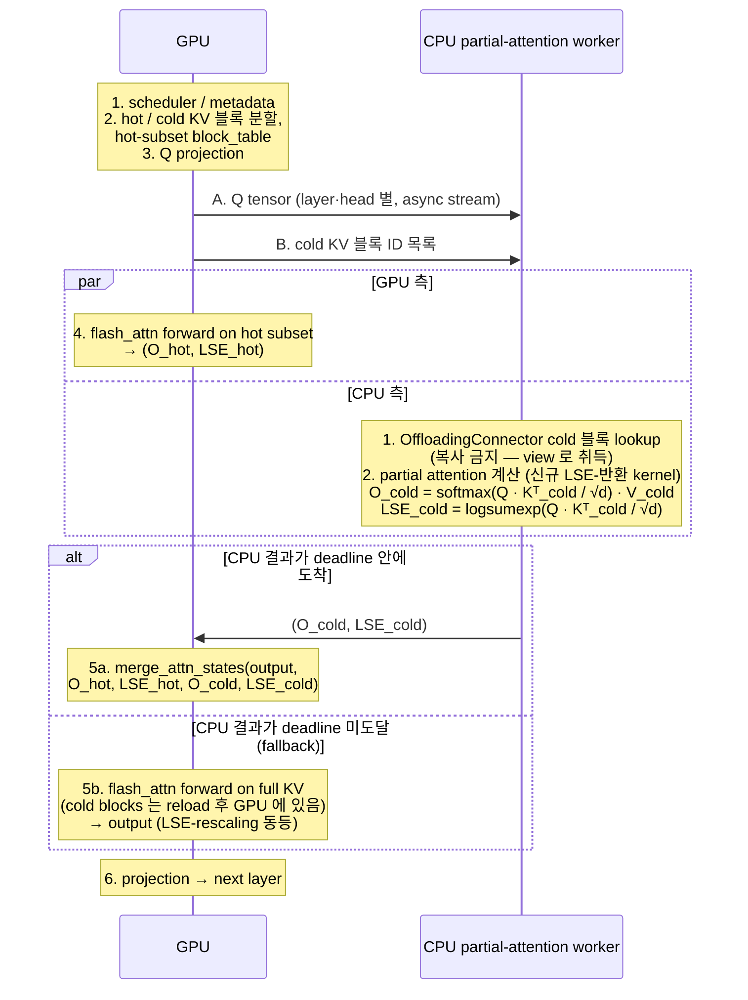
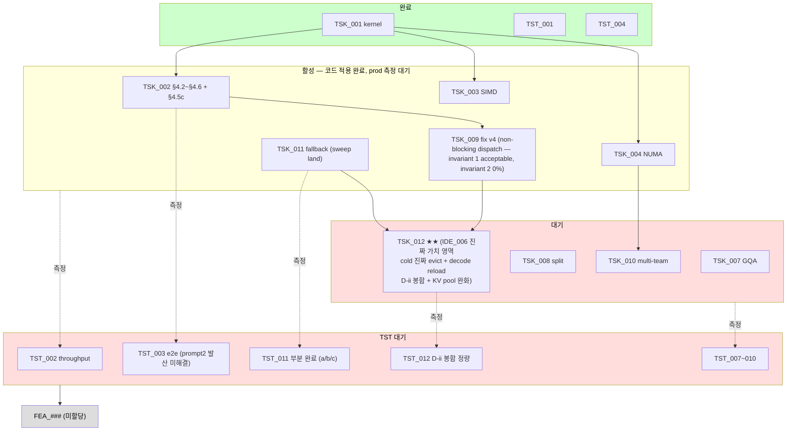

**↑ 부모**: [`shadow_assists/README.md`](../../README.md) · **↓ 자식**: [`PLN_001`](PLN_001.md) · [`NEO_redesign`](NEO_redesign.md) · [`TSK_001`](TSK_001.md) · [`TSK_002`](TSK_002.md) · [`TSK_003`](TSK_003.md) · [`TSK_004`](TSK_004.md) · [`TSK_007`](TSK_007.md) · [`TSK_008`](TSK_008.md) · [`TSK_009`](TSK_009.md) · [`TSK_010`](TSK_010.md) · [`TSK_011`](TSK_011.md) · [`TSK_012`](TSK_012.md) · [`TST_001`](TST_001.md) · [`TST_002`](TST_002.md) · [`TST_003`](TST_003.md) · [`TST_004`](TST_004.md) · [`TST_007`](TST_007.md) · [`TST_008`](TST_008.md) · [`TST_009`](TST_009.md) · [`TST_010`](TST_010.md) · [`TST_011`](TST_011.md) · [`TST_012`](TST_012.md)

---

# IDE_006 — Cold-KV CPU Partial Attention

> **🚨 4 차 재정의 검토 + 결정 (2026-04-29)** — 본 문서의 1/2/3 차 재정의는 *hot/cold split + LSE merge* 시도. TSK_009 fix v4 의 invariant 2 = 0% / TSK_005 기각의 Q dependency dilemma / TSK_012 단일 단계화 후 vanilla mirror 와의 비교 의문 후, **NEO 논문 ([arXiv 2411.01142](https://arxiv.org/abs/2411.01142)) 의 *request 단위 GPU/CPU exclusive ownership + asymmetric pipelining* 메커니즘으로 4 차 재정의 결정**. 검토 + 결정 history 는 [`NEO_redesign.md`](NEO_redesign.md). 새 branch `feat/ide006-neo-asymmetric` (main `a30d90dddb` 에서 fork) 에서 적재. 본 README 의 §1~§13 (1/2/3 차 정의 본문) 은 *history 보존* 으로 그대로 유지, §14 Change Log 에 4 차 결정 entry 추가.

| 항목 | 값 |
|---|---|
| ID | `IDE_006` |
| 상태 | `4 차 재정의 검토 + 결정 (2026-04-29) — NEO 식 asymmetric pipelining` (이전 3 차 재정의 본문은 history 로 보존, 코드 적재는 별도 branch 에서 진행). 자세한 검토는 [`NEO_redesign.md`](NEO_redesign.md) |
| 분류 | 선행 연구 적용 축 (독자 기여 지점 포함) |
| 근거 등급 | C |
| 현재 workload (128/128) 기여 | 0 (cold KV 자체가 발생하지 않음) |
| 장기 가치 성격 | long-context workload 전환 시 + vLLM CPU attention backend 위에 올릴 신규 partial-attention worker 와 cold-tier offloading 의 결합 |
| 상위 문서 | [`shadow_assists/README.md` §3.2](../../README.md) |
| ID 넘버링 출처 | [`shadow_assists/id_registry.md`](../../id_registry.md) |

> **용어 주의**: 본 문서는 **vLLM CPU attention backend (`vllm/v1/attention/backends/cpu_attn.py`)** 와 그 위에 올릴 **신규 CPU partial-attention worker / kernel** 조합을 전제로 한다. 별칭은 "worker-side CPU compute path". 이 외의 표기 (예: "CPU engine") 는 쓰지 않는다.

> **디렉토리 단계 주의**: 본 디렉토리 (`shadow_assists/features/IDE_006/`) 의 현 단계는 **IDE 상세 + PLN/TSK 명세 (pre-FEA)** 다. `README.md` (IDE_006 spec) 와 함께 `PLN_001.md`, `TSK_001.md`, `TSK_002.md` 가 **평탄 배치** (별도 하위 디렉토리 미사용). CLAUDE.md Method 가 정의한 feature 디렉토리 구조 (`CLAUDE.md` / `task.md` / `test.md` / test 코드) 는 **`FEA_###` 진입 시점에 별도 디렉토리로 보강** 한다.

---

## 1. TL;DR

- **무엇을 하는가**: cold KV 가 CPU DRAM 에 있는 동안, **CPU 측 신규 partial-attention worker 가 그 블록에 대한 partial attention 을 직접 계산** 하여 `(partial_output, LSE)` 만 GPU 로 올려 보낸다. GPU 는 hot KV 의 partial 결과와 CPU partial 결과를 **online softmax merge** 로 합산해 최종 attention output 을 만든다. **CPU 결과가 deadline 안에 도착하지 못하면 GPU 가 cold 영역까지 포함한 full attention 으로 fallback** 하여 layer 결과를 생성 — 이로써 IDE_006 활성 시의 throughput 하한이 GPU only 와 동등하거나 그 이상으로 보장된다 (3차 재정의 — 2026-04-28).
- **왜 이 포크에서 가능한가**: vLLM 의 **CPU attention backend** 경로 위에 **신규 LSE-반환 partial-attention kernel** 을 올리고, 업스트림에서 상속된 **cold-tier offload 경로 (LMCache / OffloadingConnector)** 와 결합한다. 이 **결합 지점** 이 독자 기여.
- **무엇이 아닌가 (1차 정의 기각 포인트)**: "CPU DRAM 을 KV 저장소로 쓰는 기능" 자체는 이미 vLLM 업스트림 + 본 포크에 들어와 있다. 그것의 신규 구현은 IDE_006 의 범위가 아니다.
- **무엇이 *목표 가 아닌가* (3차 재정의 명시)**: GPU memory 절약은 본 IDE 의 가치 축이 아니다. 본 IDE 의 단일 목표는 **시스템 전체 throughput 향상** — CPU 가 cold partial attention 을 계산하여 GPU 부하를 줄이는 best case + GPU fallback 으로 throughput 하한을 보장하는 worst case 의 결합.

---

## 2. 배경 — 왜 재정의되었는가

### 2.1 · 1차 정의 (기각)

1차 정의는 "CPU-side Cold KV staging" 이었다. InfiniGen / LMCache / Mooncake 를 인용하며 "hot KV 는 GPU, cold KV 는 CPU DRAM" 의 계층화를 신규 구현하자는 제안이었다.

문제는 본 포크의 실제 코드 상태를 확인한 결과 해당 기능이 이미 들어와 있었다는 것이다:

- `vllm/v1/kv_offload/` — CPU/worker/spec/medium 등 offload abstraction 을 이미 구비
- `vllm/distributed/kv_transfer/kv_connector/v1/offloading_connector.py` — cold-tier offloading connector 본체
- `vllm/distributed/kv_transfer/kv_connector/v1/lmcache_integration/` — LMCache 바인딩 (≈ 수 kLOC)
- 동 디렉토리의 `lmcache_connector.py`, `lmcache_mp_connector.py`, `mooncake/`, `flexkv_connector.py`, `simple_cpu_offload_connector.py` 등 cold-tier 연결 레이어 다수

기본값은 비활성이지만 `--kv-transfer-config` 로 켜지는 **운영 결정** 수준이지, 이 포크에서 "새로 구현할" 기능이 아니다. 업스트림과 중복되는 연구·구현은 본 포크의 차별점이 되지 못하므로 1차 정의는 기각.

### 2.2 · 2차 정의의 핵심 전환

> "CPU 를 KV **저장소**로 쓰는" 것은 이미 있다. 본 포크가 할 일은 CPU 를 KV **연산자**로 쓰는 것이다.

LMCache / OffloadingConnector 가 CPU DRAM 에 내려 둔 cold KV 블록 위에서, GPU 재적재 경로를 타지 않고 **vLLM CPU attention backend 상의 신규 partial-attention worker 가 직접 partial attention 을 계산**한 뒤 그 결과를 GPU 의 online softmax merge 에 합류시키는 구도로 재정의한다. `ideation_20260421.md` §2 의 "독자 기여 지점" 축에 부합하도록 좁게 잡았다.

---

## 3. 개념 정의

### 3.1 · 한 줄 정의 (3차 재정의 — 2026-04-28)

> **CPU DRAM 에 머무는 cold KV 블록에 대한 partial attention 을 CPU partial-attention worker 가 *opportunistic* 하게 계산하고, deadline 안에 도착한 결과는 vLLM 내부의 LSE merge 경로로 합산하며, 도착하지 못한 layer 는 GPU 가 full attention 으로 fallback 하여 layer 결과를 생성하는 구조 — 시스템 throughput 하한이 GPU only 와 동등하거나 그 이상으로 보장된다.**

본 정의는 2 차 정의 ("GPU 로 reload 없이 CPU 가 처리") 의 *worst case 무한 지연* 위험 (README §8 risk vii 의 "overlap 불가 시 IDE_006 기각") 을 닫기 위해 *fallback 정책* 을 정의에 통합한 형태. 사용자 결정 (2026-04-28): GPU memory 절약은 본 IDE 의 가치 축이 아니므로 cold blocks 가 GPU 에 reload 되어 fallback 가능한 상태인 것을 허용한다.

### 3.2 · 구성 요소와 역할

| 구성 요소 | 역할 | 구현 위치 (기존/신규) |
|---|---|---|
| LMCache / OffloadingConnector | cold KV 블록을 CPU DRAM 에 유지 + 필요 시 GPU 로 reload (fallback 위해) | **기존 (업스트림 상속)** + reload 정책 적용 (§4.5c) |
| GPU attention (flash_attn backend) | **(a) 정상 경로**: hot subset partial attention + LSE merge / **(b) fallback 경로**: cold 영역 포함 full attention (CPU 결과 deadline 미도달 시) | **기존 경로 재사용** (hot-subset 제한 + fallback 분기 신규 통합 — §6) |
| CPU partial-attention worker | cold KV 블록에 대한 partial attention (Q·Kᵀ softmax V + **LSE 산출**) — *deadline best-effort* | **신규 kernel + 신규 호출 경로**. 기존 `vllm/v1/attention/backends/cpu_attn.py` 의 `forward()` (`:261-293`) 는 output 만 채우고 **LSE 를 반환하지 않으므로 as-is 재사용 불가** |
| partial 결과 전송 채널 | GPU→CPU 로 Q, CPU→GPU 로 `(partial_output, LSE)` — non-blocking + deadline check | **신규** |
| merge / fallback dispatcher | merge 직전 cold 결과 ready 여부 검사 — ready 면 `merge_attn_states` 로 합산, 미도달이면 GPU full FA fallback | **신규** (3차 재정의로 추가) |

---

## 4. 수학적 근거 — Partial Attention 과 Online Softmax Merge

### 4.1 · 표준 attention 의 partition 정리

표준 softmax attention 은 key 집합을 임의로 분할(partition)해도 **LSE-rescaling** ([arXiv 2501.01005 §2.2](https://arxiv.org/abs/2501.01005); vLLM 내부 `merge_attn_states` 의 docstring 이 명시 인용하는 표준 출처) 으로 수치 동치 결과를 만들 수 있다. KV 블록 집합을 hot set `H` 와 cold set `C` 로 나누면:

```
s_H = Q · K_Hᵀ / √d,    P_H = softmax(s_H),    O_H = P_H · V_H,    m_H = max(s_H),    l_H = sum(exp(s_H - m_H))
s_C = Q · K_Cᵀ / √d,    P_C = softmax(s_C),    O_C = P_C · V_C,    m_C = max(s_C),    l_C = sum(exp(s_C - m_C))
```

최종 attention output 은 두 부분 결과의 LSE 기반 가중 평균으로 복원된다:

```
m  = max(m_H, m_C)
α_H = exp(m_H - m),   α_C = exp(m_C - m)
O  = (α_H · l_H · O_H + α_C · l_C · O_C) / (α_H · l_H + α_C · l_C)
LSE = m + log(α_H · l_H + α_C · l_C)
```

즉 GPU 와 CPU 가 각자 계산한 `(O_*, LSE_*)` 만 서로에게 넘기면 어느 쪽이든 final output 을 복원할 수 있다. 본 아이디어는 이 복원을 GPU 쪽에서 한다.

### 4.1.1 · Fallback 보정 (3차 재정의 — 2026-04-28)

CPU partial 결과 `(O_C, LSE_C)` 가 deadline 안에 도착하지 못한 layer 에 대해서는 위 partition 합산을 *포기* 하고 GPU 가 cold + hot 전체 KV 에 대한 full attention 을 다시 계산한다:

```
O = softmax(Q · K_full^T / √d) · V_full       # K_full = K_H ∪ K_C, V_full = V_H ∪ V_C
LSE = logsumexp(Q · K_full^T / √d)
```

GPU 가 K_full 을 read 하려면 cold blocks 가 *그 시점에 GPU 에 있어야* — 따라서 본 IDE 는 `OffloadingConnector` 의 reload 정책을 활용하여 cold blocks 가 GPU 에 reload 된 상태에서 운영된다 (§4.5c 의 prefill 정책이 decode 까지 확장).

수학적으로 fallback 결과는 *partition 합산 결과와 정확히 동일* (LSE-rescaling 의 정의에 의해). 따라서 어느 layer 에서 fallback 이 발동했는지와 무관하게 *전체 forward 의 수치 결과는 GPU only 와 분포 동등* (CLAUDE.md Constraint + IDE_006 §9 (c) 의 tolerance 안).

### 4.2 · vLLM 내부의 동일 경로 재사용

vLLM 은 이미 "prefix + suffix" 형태의 partial attention 합산을 내부 경로로 가지고 있다:

- `csrc/attention/merge_attn_states.cu` — CUDA 커널 본체
- `vllm/v1/attention/ops/merge_attn_states.py` — Python wrapper
- `vllm/v1/attention/backends/flash_attn.py:967` — context 와 query 의 partial attention 결과를 LSE merge 하는 호출부
- `vllm/v1/attention/backends/flash_attn.py:1214` — prefix / suffix partial 을 LSE merge 하는 호출부

본 아이디어의 "CPU partial" 은 위 경로의 "prefix partial" 과 **동일한 수학적 역할**을 한다. 따라서 **merge 커널을 새로 만들 필요는 없다**. 다만 hot/cold partition 을 scheduler · attention metadata 에 반영하는 통합 작업과 LSE 를 산출하는 CPU 측 신규 kernel 은 §6 에서 보는 대로 필요하다.

### 4.3 · GQA (Grouped-Query Attention) 처리

Qwen2.5-7B 등의 GQA 레이아웃은 Q head 수(예: 32) 와 KV head 수(예: 4) 가 다르다. cold 블록을 CPU 에서 attention 계산할 때 KV head broadcast 를 어느 시점에 수행하는지에 따라 CPU 메모리 대역폭·연산량이 크게 바뀐다.

- 옵션 A — K/V 를 KV-head 단위로 CPU 에 저장 (compact) + CPU 에서 broadcast 후 연산
- 옵션 B — CPU 에서 Q-head 단위로 미리 expand 된 버퍼를 유지 (메모리 희생, 연산 단순)

진입 조건 (d) 에서 GQA 동작 확인을 명시한 이유. PLN 단계에서 옵션 선택.

---

## 5. 시스템 구조

### 5.1 · Data Flow (decode step 1 회)



> 이 흐름은 **layer 단위 critical path 에 개입**한다. Q projection 후부터 merge 이전까지가 단일 layer 의 내부 구간이므로, CPU 측 왕복 전체 (Q 전송 + CPU partial + partial 결과 전송) 를 GPU hot attention 과 **얼마나 overlap 할 수 있는지가 본 아이디어의 net-win 을 좌우**한다. 단순 "CPU idle 활용" 이 아니라는 점을 §8 리스크 vii 에서 별도 항목으로 다룬다.

### 5.2 · Owner / Layout 계약 (미정 — PLN 에서 고정)

OffloadingConnector 가 내려 둔 CPU tensor 의 소유권·레이아웃은 attention 커널의 입력으로 바로 쓰일 수 있을 만큼 고정되어 있지 않다. 최소 다음이 PLN 단계에서 결정되어야 한다:

- cold 블록의 dtype (원본 vs Q8 등 양자화 포맷)
- paged layout 유지 여부 (vLLM block 단위 KV layout 과의 호환)
- lifetime — connector 가 swap-in/out 을 결정하는 동안 CPU partial-attention worker 가 view 를 안전하게 잡아 두는 방법 (refcount / lease / copy-on-demand)
- head dim 과 num_kv_heads 의 CPU 쪽 표현 (GQA §4.3 연계)

리스크 (iii) 로 명시.

### 5.3 · 자원 경합 매트릭스 (IDE_001/002/004 와의 충돌)

CPU partial-attention worker 가 수행할 연산과 동일 CPU 코어·메모리 대역을 놓고 다른 CPU 후보 작업들과 경합할 수 있다. 진입 조건 (e) — 다음 매트릭스의 결정이 있어야 함:

| CPU 작업 | phase (GPU 관점) | IDE_006 과의 관계 |
|---|---|---|
| scheduler + metadata (`IDE_001`) | step 경계 | 시간 분리. 동 step 내 동시 실행 없음 |
| prefill-assist (`IDE_002`) | prefill | decode 에서의 IDE_006 과 시간 분리 |
| background compile (`IDE_003`) | 임의 (저우선) | 선점 가능. IDE_006 우선 |
| sublayer burst (`IDE_004`) | attention vs linear | attention phase 의 CPU 작업 슬롯을 IDE_006 이 먼저 점유 |

---

## 6. vLLM 내부 연계 지점과 **필요한 신규 통합 작업**

### 6.1 · 확인된 경로

| 구성 | 경로 | 역할 |
|---|---|---|
| LSE merge kernel (CUDA) | `csrc/attention/merge_attn_states.cu` | partial output + LSE 합산 본체 |
| LSE merge (Python wrapper) | `vllm/v1/attention/ops/merge_attn_states.py` | 호출부에서 사용하는 wrapper |
| merge 호출 예 1 | `vllm/v1/attention/backends/flash_attn.py:967` | context / query partial 합산 |
| merge 호출 예 2 | `vllm/v1/attention/backends/flash_attn.py:1214` | prefix / suffix partial 합산 |
| 기존 CPU attention backend | `vllm/v1/attention/backends/cpu_attn.py:261-293` | `forward()` 가 output 만 반환, **LSE 미반환** |
| KV offload abstraction | `vllm/v1/kv_offload/` | cold-tier 계층 구조 (`cpu/`, `worker/`, `spec.py`, `reuse_manager.py` 등) |
| cold-tier connector | `vllm/distributed/kv_transfer/kv_connector/v1/offloading_connector.py` | CPU DRAM 으로의 블록 이동 주체 |
| offloading worker 단일 KV group assert | `vllm/v1/kv_offload/worker/cpu_gpu.py:138-139` | `assert len(kv_cache_groups_data_refs) == 1` — 초기 범위 제한 근거 |
| FP8 KV cache 미지원 (CPU backend) | `vllm/v1/attention/backends/cpu_attn.py:250-251` | `raise NotImplementedError("FP8 KV cache is unsupported in CPU_ATTN")` |
| LMCache 통합 | `vllm/distributed/kv_transfer/kv_connector/v1/lmcache_integration/` | LMCache 바인딩 |

### 6.2 · 수정 범위의 현실적 규모

> **merge 커널 (`merge_attn_states`) 은 재사용** 한다. 그러나 **hot/cold partition metadata 와 CPU partial attention 호출 경로는 신규 통합이 필요하다**. 구체적으로 다음 네 축의 변경이 들어간다:

1. **scheduler / attention metadata 측** — hot KV block 목록과 cold KV block 목록을 분리 전달. 기존 block_table 은 "어느 layer 가 어느 block 을 읽는가" 를 가정하고 있으므로, hot subset 으로 제한하는 block_table 또는 hot/cold 양쪽을 구별하는 metadata 확장이 필요.
2. **flash_attn backend 호출부** — 기존 호출은 "전체 KV" 를 전제로 한다. hot subset 전용 호출 경로를 추가하거나, 입력 block_table 을 hot subset 으로 한정하는 계약을 세워야 한다. prefix/suffix merge 는 이미 쓰이므로 호출 시그니처 자체는 친숙.
3. **CPU partial-attention kernel 신규 구현** — 기존 `cpu_attn.py` 의 `forward()` 는 `output` 만 채우고 LSE 를 반환하지 않는다 (`:261-293`). **LSE-반환 버전의 CPU partial-attention kernel 을 신규로 작성**해야 한다. AVX-512 / AMX 경로 선택은 PLN 단계.
4. **OffloadingConnector worker 경로의 초기 범위 한정** — `kv_offload/worker/cpu_gpu.py:138-139` 의 `assert len(kv_cache_groups_data_refs) == 1` 이 남아 있으므로, 초기 지원은 **단일 KV group** 으로 묶는 것이 안전하다. 다중 group / MLA / Mamba / sliding window 로의 확장은 본 IDE 의 후속 작업으로 분리.

따라서 본 아이디어는 **"어느 파일도 손대지 않는" 수준의 변경이 아니다**. 난도는 merge 커널 재사용으로 낮아지지만, scheduler·metadata·attention 호출 경로·CPU kernel 네 곳에 걸친 통합이 필요하다. `CLAUDE.md` Objective/Constraint (GPU-only 결과와 동일) 는 merge 경로가 수치적으로 흡수하되, 결과의 일치 여부는 [`CLAUDE.md` 운영 해석](../../../CLAUDE.md) (token-level bit-exact 가 아니라 분포 수준의 유사성) 에 따라 §8 의 tolerance 기준 — per-position logprob `atol` + 시퀀스 PPL `rtol` — 으로 판정한다.

---

## 7. 선행 연구 비교와 독자 기여 위치

| 연구 | 축 | IDE_006 과의 경계 |
|---|---|---|
| [NEO (arXiv 2411.01142)](https://arxiv.org/abs/2411.01142) / [OpenReview umgy9tWBLA](https://openreview.net/forum?id=umgy9tWBLA) | asymmetric GPU/CPU pipeline, attention compute + KV state 의 CPU offload | vLLM native OffloadingConnector / LMCache cold-tier lifecycle 및 기존 LSE merge path 와의 통합은 다루지 않음 |
| [CachedAttention (USENIX ATC'24)](https://prongs1996.github.io/assets/pdf/CachedAttention.pdf) | 다계층 KV reuse | "저장·재사용" 초점이며, CPU 에서의 attention 연산을 직접 다루지 않음 |
| [InfiniGen (arXiv 2406.19707)](https://arxiv.org/abs/2406.19707) | KV selective prefetch | cold KV 를 GPU 로 가져옴. 본 아이디어는 가져오지 않음 |
| [LMCache (arXiv 2510.09665)](https://arxiv.org/abs/2510.09665) | KV 공유 캐시 | CPU 저장 / GPU 재호출. CPU 에서의 attention 연산은 범위 밖 |
| [Mooncake (arXiv 2407.00079)](https://arxiv.org/abs/2407.00079) | disaggregated KV | 저장·전송 아키텍처. CPU attention compute 는 범위 밖 |

### 7.1 · 독자 기여 (좁게 재정의)

> **vLLM native cold-tier offloading (LMCache / OffloadingConnector) 에 이미 내려간 KV 를 GPU reload 없이 CPU 에서 partial attention (LSE-반환) 으로 소비하고, vLLM 내부 LSE merge 경로로 합산하는 구조** 는 공개 연구·상용 시스템에서 직접 대응이 확인되지 않았다. ("CPU 에서 attention 을 하는" 연구는 있지만 vLLM 의 native cold-tier 계층 위에서, 그리고 기존 merge 경로의 재사용으로 성립하는 구체 조합은 없다.)

이 경계 밖으로 주장을 넓히지 않는다. (X / B1 / B2 / B3 실패의 반복 방지.)

---

## 8. 리스크와 완화

| # | 리스크 | 심각도 | 완화 방향 |
|---|---|---|---|
| i | partial attention merge 결과가 GPU-only 결과와 정확히 일치하지 않을 수 있음. FlashAttention 경로의 **비결정성** + BF16 산술 비결합성 으로 bitwise 일치는 비현실적 | 높음 | [`CLAUDE.md` Constraint 운영 해석](../../../CLAUDE.md) ("token-level 동등이 아니라 분포 수준의 유사성") 을 기각 기준으로 채택. **D-ii (per-position logprob max abs diff + 시퀀스 PPL relative diff) 가 binding** 이고 D-i (token argmax 일치) 는 informational. PLN 단계에서 `rtol/atol` 의 수치값을 합의. 비교 대상은 GPU-only eager / FlashAttention 두 경로 모두 |
| ii | CPU partial-attention worker throughput + (Q 전송 + partial 전송) 비용이 GPU full-reload + full-attention 대비 **net win 인 sweet spot 이 좁을 수 있음** | 높음 | PLN microbench 에서 context length × cold ratio × batch size 의 2D sweep. net-win 영역 면적이 일정 이하이면 IDE_006 기각 |
| iii | OffloadingConnector 가 저장한 CPU tensor 를 attention 커널 입력으로 **안전하게 복원할 layout / owner 계약이 미정** | 중간 | §5.2 의 네 항목을 PLN 에서 고정. connector 측 변경 최소화를 목표로 read-only view 기반 설계 우선 |
| iv | GQA 에서 K/V head broadcast 를 어디서 하느냐에 따라 CPU 성능이 크게 달라짐 | 중간 | PLN 에서 옵션 A/B 벤치. 선택 근거를 문서화 |
| v | 다른 CPU 후보 작업 (IDE_001/002/003/004) 과의 코어·대역 경합 | 중간 | §5.3 자원 매트릭스로 우선순위 고정. IDE_004 의 attention phase CPU 슬롯은 IDE_006 이 우선 |
| vi | long-context workload 가 운영에 실제로 들어오지 않으면 기여 0 | 낮음 (기각 사유는 아님) | 장기 가치로 분류. 진입 조건 (a) 충족 전까지는 PLN 단계에서 멈춤 |
| vii | **mid-layer synchronization — layer 내부 critical path 에 CPU 통신·계산이 끼어든다**. Q projection 직후 `GPU→CPU Q` 전송 → CPU partial attention → `CPU→GPU (O, LSE)` 전송 → merge 가 layer 내부에서 직렬화되면 GPU hot-attention 시간을 가리지 못하고 **순 지연이 된다** | **3차 재정의로 해소** | **GPU fallback (§4.1.1)** 으로 worst case throughput 하한을 GPU only 동등으로 보장. "overlap 불가 시 IDE_006 기각" 의 정책은 폐기 — fallback 은 *기각이 아닌 정상 경로의 한 분기*. best case (CPU 결과가 deadline 도착) 는 throughput ↑, worst case (deadline 미도달) 는 GPU full FA 로 동등. |

---

## 9. 진입 조건 (측정 가능 기준)

CLAUDE.md 원칙에 따라 숫자로 진입·기각 판정.

| 조건 | 내용 | 판정 주체 |
|---|---|---|
| (a) | long-context workload (≥ 8K) 로의 실제 전환. `shadow_assists/README.md` §3.2 와 정합 | 운영 / profile |
| (b) | CPU partial-attention worker 의 attention throughput 측정 (tokens/s, context-length 별) 이 PLN 에서 정한 최소 임계 이상 | PLN microbench |
| (c) | partial attention merge 결과가 **사전 정의된 tolerance(rtol/atol)** 내에서 GPU-only 결과와 분포 유사 — D-ii (per-position logprob `atol` + 시퀀스 PPL `rtol`) binding, D-i (token argmax) informational. 자세한 운영 해석은 [`CLAUDE.md` Constraint](../../../CLAUDE.md) 참조 | PLN verification |
| (d) | GQA (Qwen2.5-7B: Q heads 32 / KV heads 4) 에서 K/V split + head broadcast 가 CPU 경로에서 정상 동작 | PLN microbench |
| (e) | IDE_001/002/004 와 충돌하지 않는 CPU 작업 **priority / conflict matrix** 가 정의되어 있음 | 설계 의사결정 |
| (f) | **초기 지원 범위 제한 (scope lock)**: **BF16/FP16 KV**, **non-FP8**, **non-MLA**, **full attention** (non-sliding-window, non-Mamba/HMA), **단일 KV group** (decoder-only). 근거: `vllm/v1/attention/backends/cpu_attn.py:250-251` (FP8 미지원), `vllm/v1/kv_offload/worker/cpu_gpu.py:138-139` (single-group assert) | 설계 의사결정 |
| (g) | **Throughput 하한 보장** — IDE_006 활성 시 GPU only 대비 throughput 이 *동등 이상*. 본 조건은 fallback 정책 (§4.1.1) 의 *worst case 동등 보장* + *best case 향상* 의 결합으로 충족된다. measurement 는 fallback 발동 빈도와 best/worst case throughput 분포를 함께 보고 (TST_002 + TST_011) | PLN profile + TST 측정 |

위 조건 중 하나라도 충족 실패 시 PLN/FEA 로 진입하지 않는다. 특히 (f) 와 (g) 는 "구현 착수 전" 결정·확인이 필요한 게이트.

---

## 10. 현재 workload 기여와 가치 성격 (3차 재정의 기준 — 2026-04-28)

- **단일 가치 축**: 시스템 전체 throughput 향상. GPU memory 절약은 *본 IDE 의 가치 축이 아니다* (사용자 결정 2026-04-28).
- **현재 (128/128)** — cold KV 자체가 거의 발생하지 않으므로 fallback 도 거의 발동 안 함 → IDE_006 활성/비활성 동등.
- **Long-context** — cold KV 가 자연스럽게 발생. CPU partial attention 이 deadline 안에 도착하는 layer 는 throughput ↑, 미도달 layer 는 GPU fallback 으로 GPU only 동등. 두 분기의 가중 평균이 IDE_006 의 *실효 throughput*.
- **하한 보장** — 어떤 workload 에서도 IDE_006 활성이 GPU only 보다 *느려질 수 없음* (fallback 의 worst case 동등 보장). 따라서 "장기 가치" 영역에서만 기여하는 게 아니라 *모든 workload 에서 활성 가능* — 단 실효 향상은 cold path overlap 가능성에 비례.

---

## 11. 다음 단계 — 파생 ID 계획

진입 조건 (a) 가 발생한 후 `shadow_assists/id_registry.md` 의 해당 prefix "다음 부여 번호" 를 가져와 **구현 흐름** 순서 (PLN → TSK → TST → FEA) 로 적재한다.

| 단계 | ID | 제목 | 상태 |
|---|---|---|---|
| 1 | [`PLN_001`](PLN_001.md) | Cold-KV CPU Partial Attention PoC 플랜 | `활성` ((a) long-context 워크로드 전환 발생. PLN-deliverable: `PLN_001_TSK_002_01_partition_api_survey.md`, [`PLN_001_TSK_002_02_overlap_fix_log.md`](PLN_001_TSK_002_02_overlap_fix_log.md)) |
| 2 | [`TSK_001`](TSK_001.md) | LSE-반환 CPU partial-attention kernel 구현 | `완료` (Phase 1 dev — 4.0/4.1/4.2c/4.3 + TST_001 dev 87 + prod 87 통과 2026-04-26) |
| 3 | [`TSK_002`](TSK_002.md) | scheduler / attention metadata 의 hot/cold partition 통합 | `활성` (Phase 1 dev §4.2~§4.5 + §4.6 stream 분리 완료. Phase 2 prod overlap 측정 진행 중. 회귀 fix 흐름은 [`PLN_001_TSK_002_02_overlap_fix_log.md`](PLN_001_TSK_002_02_overlap_fix_log.md)) |
| 4 | [`TSK_003`](TSK_003.md) | **prod SIMD kernels** (AVX-512 + AMX C++) | `활성` (Phase 1 dev kernel + dispatch wiring 완료. Phase 2 prod TST_004 cross-check 152 passed @ `eval/results/20260427_044407_*_simd_verify`. throughput sweep 은 TST_002 단계) |
| 5 | [`TSK_004`](TSK_004.md) | Cold-KV 경로 NUMA-aware 화 (connector buffer + kernel thread bind + worker 별 NUMA cpulist 분할 + OMP num_threads + dispatch hot-path 캐싱) | `활성` (Phase 1 dev (a)/(b) 구현 + (b')/(b'')/(b''') 회귀 fix prod 통과. Phase 2 풀 throughput sweep 대기. 자세한 흐름 [`PLN_001_TSK_002_02_overlap_fix_log.md`](PLN_001_TSK_002_02_overlap_fix_log.md)) |
| 6 | [`TST_001`](TST_001.md) | TSK_001 dev kernel 정확도 (A · B(i) · C) | `완료` (dev 87 + prod 87 통과 2026-04-26) |
| 7 | [`TST_004`](TST_004.md) | TSK_003 prod SIMD cross-check (B(ii) AVX-512 + B(iii) AMX) | `완료` (152 passed @ prod simd_verify `eval/results/20260427_044407_*`) |
| 8 | [`TST_003`](TST_003.md) | e2e 통합 정확도 (D-i + D-ii) | `대기` (`TSK_002` §4.6 안정화 후 풀 회차 — `eval/run_prod_smoke.sh --push`) |
| 9 | [`TST_002`](TST_002.md) | throughput / overlap profile | `대기` (TST_003 통과 후. PLN_001 §4.3 overlap 부등식 net-win 결정점) |
| 10 | [`TSK_007`](TSK_007.md) | GQA K/V broadcast 옵션 결정 (A vs B) | `완료` (2026-04-28 — microbench 9 cell sweep 결과 옵션 A 모든 cell 에서 1.36~3.84× 빠름. **옵션 A 채택**, 코드 변경 없음. README §12 Q3 답: A 가 cache 안에 working set fit / B 는 8× expand 로 fit 못 함). 검증 게이트 = [`TST_007`](TST_007.md) `완료` |
| 11 | [`TSK_008`](TSK_008.md) | hot/cold 분할 정책 (layer-별 vs request 균일) | `대기` (사전 조사 — README §12 Q4). 검증 게이트 = [`TST_008`](TST_008.md) |
| 12 | [`TSK_009`](TSK_009.md) | **Cold-path non-blocking dispatch** (CPU 가 GPU 작업 방해 없이 best-effort 활용) | `활성 (fix v4 land — invariant 1 acceptable 7~10% 잔여, invariant 2 0% → TSK_005 영역 분리)` (2026-04-29). prod 6 회차 검증: input_heavy/output_heavy/equal C/B = 1.078~1.103×, merged % 모두 0.00%. 검증 게이트 = [`TST_009`](TST_009.md) `완료` |
| 13 | [`TSK_010`](TSK_010.md) | CPU 자원 활용 확장 (multi-OMP-team / sub-batching) | `대기` (사용자 허락 후 발행 2026-04-28 — TSK_004 자연 확장). 검증 게이트 = [`TST_010`](TST_010.md) |
| 14 | [`TSK_011`](TSK_011.md) | **Speculative cold + GPU fallback** (3차 재정의 핵심) | `활성 — 의미 재정의 (2026-04-29)`: TSK_009 fix v4 적용 후 blocking deadline → non-blocking poll 로 대체. TSK_012 적용 시 partition path 발화 안 함 → 본 TSK 의 deadline / fallback 모두 dead code (예외 안전망만). 검증 게이트 = [`TST_011`](TST_011.md) `부분 완료` |
| 15 | [`TST_011`](TST_011.md) | TSK_011 fallback 동작 검증 | `부분 완료 — 의미 재정의 (2026-04-29)` |
| 16 | [`TSK_012`](TSK_012.md) | **Decode-time cold-blocks GPU reload + 진짜 evict 정책** (IDE_006 의 진짜 가치 영역) | `대기 — 단일 단계 본문 (2026-04-29)`. cold blocks 진짜 evict + decode reload trigger. partition path 발화 안 함. D-ii 봉합 ✓ + KV pool 압박 완화. 한때 Phase 2 (race) 가 있었으나 측정 데이터로 가치 영역 작음 입증 후 제거. 검증 게이트 = [`TST_012`](TST_012.md) |
| 17 | [`TST_012`](TST_012.md) | TSK_012 검증 — D-ii 봉합 + reload timeline + throughput tradeoff (+ 선택 capacity) | `대기 — 단일 단계 spec (2026-04-29)` |
| 18 | `FEA_###` | 통합 기능 (`feat/ide006-cold-kv-cpu-partial-attention` 브랜치) | 미할당 |

> **본 표에서 제외된 ID**: `TSK_005` (Cross-layer pipeline) / `TSK_006` (Q chunk pipelining) / `TST_005` / `TST_006`. **TSK_005 는 2026-04-29 두 차례 결정 후 *기각*** — 1) 같은 날 일찍 *Llama only* model-specific 사유로 제외 → 2) TSK_009 fix v4 검증 후 invariant 2 향상 영역으로 본 표 *재진입* → 3) plug-in 형식 설계 후 *fundamental dilemma 식별* 로 다시 *기각*. dilemma = `Q dependency + GPU 가 진짜 Q 가지면 CPU 결과 무용`. layer N+1 cold partial 을 layer N 진행 동시 시작해도 layer N+1 attention 진입 시점에 GPU 가 진짜 Q 가지므로 paged FA full 가능 → CPU 결과 활용 의미 없음. CPU partial 이 *진짜* 가치 영역 = cold blocks 가 *진짜 GPU evict* (free) 되어 GPU 가 cold attention 못 하는 시점 (`TSK_012`) 의 reload 대체로만. id_registry 의 ID 행은 그대로 보존 (재사용 금지 룰).

### 11.1 · 진행 현황 (2026-04-28)



**우선순위 (2026-04-29 재갱신 — TSK_005 기각 후)**: `TSK_012` (decode-time cold reload + 진짜 evict — IDE_006 의 진짜 가치 영역) → `TSK_010` → `TSK_008`. `TSK_005` (cross-layer pipeline) 는 *기각* (`Q dependency + GPU 가 진짜 Q 가지면 CPU 결과 무용` dilemma).

**커밋**: `origin/feat` 보다 7 커밋 앞섬 (`1b36802db2` ~ `bf525c24d9` + 본 TSK_011 land commit). dev pytest 누계 **419 통과 / 153 skip**.

각 ID 의 상세 명세는 위 표의 링크 (`PLN_001.md`, `TSK_*.md`) 가 단일 출처. 미할당 ID 들은 PLN 결과에 따라 발급. CLAUDE.md ID Rule 8 (본문 사용은 id_registry 갱신 이후) 준수.

---

## 12. Open Questions (PLN 착수 전 명시화 필요)

1. `rtol / atol` 의 운영 후보값. FlashAttention 경로의 기본 수치 오차를 먼저 재며, 그 이상을 허용할지 말지.
2. LMCache / OffloadingConnector 가 보유한 CPU tensor 를 수정 없이 attention 입력으로 쓸 수 있는가, 아니면 "view 어댑터" 레이어가 필요한가.
3. GQA head broadcast 를 CPU 쪽에서 할 때 L2/L3 cache working set 이 실제로 메모리 대역 bound 를 피하는가.
4. hot / cold 분할 기준을 layer 별로 독립 결정할지, request 전체에서 균일하게 할지.
5. speculative decode / spec draft (`IDE_005`) 와 동 시점에 진행될 경우의 자원 경합.
6. Q chunk 파이프라이닝으로 critical-path hiding 이 가능한가. 가능한 chunk 크기는? (리스크 vii)

---

## 13. References

### vLLM / 본 포크

- `vllm/v1/kv_offload/` (cold-tier 추상화)
- `vllm/v1/kv_offload/worker/cpu_gpu.py:138-139` (단일 KV group assert — 초기 scope 근거)
- `vllm/distributed/kv_transfer/kv_connector/v1/offloading_connector.py`
- `vllm/distributed/kv_transfer/kv_connector/v1/lmcache_integration/`
- `vllm/v1/attention/backends/cpu_attn.py:250-251` (FP8 KV 미지원), `:261-293` (forward — LSE 미반환)
- `vllm/v1/attention/ops/merge_attn_states.py`
- `vllm/v1/attention/backends/flash_attn.py:967`, `:1214`
- `csrc/attention/merge_attn_states.cu`

### 외부 논문 / 자료

- NEO — asymmetric GPU/CPU pipeline, attention + KV state CPU offload: [arXiv 2411.01142](https://arxiv.org/abs/2411.01142) · [OpenReview umgy9tWBLA](https://openreview.net/forum?id=umgy9tWBLA)
- CachedAttention — 다계층 KV reuse: [USENIX ATC'24 PDF](https://prongs1996.github.io/assets/pdf/CachedAttention.pdf)
- InfiniGen — KV selective prefetch: [arXiv 2406.19707](https://arxiv.org/abs/2406.19707)
- LMCache — KV 공유 캐시: [arXiv 2510.09665](https://arxiv.org/abs/2510.09665)
- Mooncake — disaggregated KV: [arXiv 2407.00079](https://arxiv.org/abs/2407.00079)

### 상위 / 관련 문서

- [`shadow_assists/README.md`](../../README.md) (§3.2 Cold-KV CPU Partial Attention, §VII Trace Tree)
- [`shadow_assists/id_registry.md`](../../id_registry.md)
- `super_power/ideation/cpu_idle_acceleration_ideation_20260421.md` (IDE 전체의 상위 ideation)

---

## 14. Change Log

| 날짜 | 변경 | 사유 |
|---|---|---|
| 2026-04-25 | 본 README 초안 작성 | IDE_006 2차 정의 기준 상세 설계 문서 적재. 파생 ID 생성은 진입 조건 (a) 충족 후 |
| 2026-04-25 | TST_003 신규 적재 (책임 분리) | TST_001 의 단계 D (e2e 통합 정확도) 가 TSK_002 의존이라 TSK_001 단독 검증과 책임이 섞여 있던 것을 분리 — 신규 [`TST_003`](TST_003.md) 발급 + TST_001 의 D 섹션 일괄 제거. (1) §11 표 step 5 = `TST_003` (e2e 정확도, D-i + D-ii) 신규 행 + step 6 = `TST_002` (throughput) 이동 + step 7 = `FEA_###`. (2) 최상단/최하단 nav 자식 목록에 `TST_003` 추가. (3) TST_001 의 검증 대상은 `TSK_001` 단독, TST_003 은 `TSK_001 + TSK_002` 통합 e2e. |
| 2026-04-25 | TST_001 / TST_002 적재 반영 | (1) 최상단/최하단 nav 의 자식 목록에 `TST_001` / `TST_002` 추가. (2) §11 표의 step 4·5 generic `TST_###` 행을 적재된 [`TST_001`](TST_001.md) / [`TST_002`](TST_002.md) 링크로 갱신. step 4 = "정확도 검증 (KVViewAdapter / kernel cross-check / wrapper dispatch / e2e)", step 5 = "throughput / overlap profile". 상태 모두 `대기`. |
| 2026-04-25 | §11 표 PLN_001 상태 정합 | id_registry / PLN_001 본문은 `대기` 인데 §11 표만 `활성 (적재 완료)` 로 stale. `대기 (문서 적재 완료. (a) long-context 전환 후 활성)` 으로 통일. |
| 2026-04-25 | 디렉토리 단계 박스 갱신 (issue 7) | "현재 README.md 만 존재" 표기가 평탄화 후 stale. `README.md` + `PLN_001.md` + `TSK_001.md` + `TSK_002.md` 평탄 배치 명시로 갱신. |
| 2026-04-25 | 이론·계획 재검증 반영 | (1) §5.1 Data Flow 를 ASCII art → Mermaid sequenceDiagram 으로 변환 (CLAUDE.md Ground RULE 신규 항목 "Diagram 은 ascii 가 아닌 Mermaid …" 충족). (2) §4.1 에 LSE-rescaling 표준 출처 [arXiv 2501.01005 §2.2](https://arxiv.org/abs/2501.01005) 인용 추가 — vLLM 내부 `merge_attn_states` docstring 이 명시 인용하는 표준 출처와 정합. (3) §11 파생 ID 생성 순서를 `PLN → TSK → TST → FEA` 의 자연스러운 구현 흐름으로 재배열 (이전: PLN → TST → TST → TSK → TSK → FEA). 코드 인용 라인 번호 (cpu_attn.py:251/261, kv_offload/worker/cpu_gpu.py:139, flash_attn.py:967/1214) 는 재 grep 결과 모두 현 코드와 일치 — 변경 없음. |
| 2026-04-25 | 잔존 표현 정리 | 본 README 와 상위 README 양쪽에서 잔존하던 deprecated 가설/식별자 관련 표현·인용을 모두 제거 (식별자 prefix 가 코드에 남아 있더라도 문서에서 이름으로 노출하지 않음). 본문 중립화. |
| 2026-04-25 | 추가 검토 반영 (정합성) | (1) NEO 비교 문구에서 근거가 약한 표현 제거 — 안전한 표현 "vLLM native OffloadingConnector / LMCache cold-tier lifecycle 및 기존 LSE merge path 와의 통합은 다루지 않음" 으로 교체. (2) 출처 불명확한 "FastDecode 계열" 행 §7 표에서 제거. (3) §11 step 2 의 비교 대상 표기를 "IDE_006 hot/cold split path" 로 명확화. (4) 디렉토리 단계 주의 박스 추가 — features/IDE_006/ 가 pre-FEA 아이디어 상세 단계임을 명시 (CLAUDE.md / task.md / test.md 부재는 의도된 단계). |
| 2026-04-25 | 검토 반영 개정 | (1) "CPU engine / CPU compute engine" 표기 제거 — "vLLM CPU attention backend" / "CPU partial-attention worker" / "worker-side CPU compute path" 로 교체. (2) §6 "어느 하나도 수정 전제로 하지 않는다" 문장을 현실에 맞게 조정 — merge 커널은 재사용하되 scheduler / attention metadata / attention backend 호출 경로 / 신규 LSE-반환 CPU kernel 의 네 축 통합이 필요함을 명시. (3) 기존 `cpu_attn.py:261-293` 의 `forward()` 가 LSE 를 반환하지 않아 as-is 재사용 불가임을 §3.2·§6 에 반영. (4) 진입 조건 (f) 초기 scope 잠금 (BF16/FP16, non-FP8, non-MLA, full attention, 단일 KV group) 과 (g) overlap 가능성 추가. 근거: `cpu_attn.py:250-251`, `kv_offload/worker/cpu_gpu.py:138-139`. (5) 리스크 vii (mid-layer synchronization — layer 내부 critical path 에 CPU 통신·계산이 직렬화되면 순 지연) 신설. |
| 2026-04-26 | TSK_001 + TST_001 마감 (Phase 1 dev 완료) | 검증 게이트 [`TST_001`](TST_001.md) (단계 A · B(i) · C) 가 dev (12900KF + RTX 3090, 2026-04-25, 87 testcase) + prod (Xeon Platinum 8480+ x2 socket + H100 x8, 2026-04-26, 87 testcase, `eval/results/20260426_050608_..._prod_smoke/`) 양쪽 통과 → numerical 일관성 입증 → IDE_006 §9 (c)(d) 의 dev kernel 측 충족. §11 표 step 2 (`TSK_001`) + step 5 (`TST_001`) 모두 `완료` 로 전환. 다음 단계는 step 3 (`TSK_002` model_runner integration, dev 자동) + step 4 (`TSK_003` prod SIMD, 사용자 직접). |
| 2026-04-27 | TSK_002 §4.2~§4.6 + TSK_003 prod cross-check + TSK_004 NUMA-aware 일괄 진척 | (1) TSK_002 §4.2~§4.5 dev 구현 완료 후 prod 회귀 fix 흐름 (libgomp EAGAIN / wrapper 5462 ms timeout / device-mismatch / batch 전체 폭 D2H) 처리, §4.6 stream 분리 dev 검증까지 완료 — 자세한 흐름은 [`PLN_001_TSK_002_02_overlap_fix_log.md`](PLN_001_TSK_002_02_overlap_fix_log.md). 상태 `대기` → `활성`. (2) TSK_003 의 prod TST_004 cross-check 152 passed (`eval/results/20260427_044407_*_simd_verify`). TST_004 상태 `대기` → `완료`. (3) TSK_004 가 §11 표에 누락되어 있던 것을 추가 + 회귀 fix 항 (b'/b''/b''') 명시. NUMA partition / OMP num_threads / dispatch 캐싱 prod 통과. (4) IDE_006 최상위 상태 `재정의` → `활성`. (5) `eval/run_prod_simd_verify.sh` / `run_prod_cold_verify.sh` wrapper 두 개 신규. 다음 게이트: §4.6 prod overlap 측정 → TST_003 풀 회차 → TST_002 throughput sweep. |
| 2026-04-29 | **TSK_005 / TST_005 본 표 진입 — Llama-70B + Qwen2.5-72B 두 모델 대상 (사용자 결정)** | TSK_009 fix v4 의 prod 검증 결과 — invariant 2 (CPU 활용) 모든 시나리오 0.00%. fundamental Q dependency 로 layer-안 partition path 만으로는 향상 영역 비어 있음 입증. 의미 있는 향상의 *유일* 영역 = `TSK_005` (cross-layer pipeline) 으로 식별. 두 모델 대상 진행. (1) §3.2 본문에 측정 사실 + TSK_005 영역 명시 (2) §11 표 row 18~19 추가 (TSK_005 / TST_005) (3) §11.1 Mermaid 갱신 (4) 우선순위 TSK_005 → TSK_012 → TSK_010 → TSK_008. |
| 2026-04-29 | **TSK_005 다시 기각 — fundamental dilemma 식별 (사용자 지적)** | TSK_005 plug-in 형식 설계 후 사용자 지적 — "GPU 가 진짜 Q 가지면 CPU 결과 무용". 분석: (1) cross-layer overlap 의 layer N+1 cold partial 을 layer N 진행 동시 시작 시 layer N+1 attention 진입 시점에 GPU 가 *진짜 Q* 를 이미 가짐 (QKV proj 후 결정) → GPU 가 paged FA full 직접 가능 → CPU 결과 활용 의미 없음. (2) speculative Q 추정 영역도 동일 — 추정 Q 와 진짜 Q 비교/correction 이 결국 GPU 의 paged FA 와 같은 작업 → wall-time 동등 또는 더 김. **dilemma**: `Q dependency + GPU 가 진짜 Q 가지면 CPU 결과 무용` 은 layer-안이든 cross-layer 든 동일. CPU partial 이 *진짜* 가치 있는 영역 = **cold blocks 가 진짜 GPU evict (free) 되어 GPU 가 cold attention 못 하는 시점** — 즉 reload 가 필요한 시점에 CPU partial 이 *reload 의 대체* 로만. 이건 `TSK_012` (decode-time cold-blocks GPU reload + 진짜 evict 정책 통합) 의 영역. **TSK_005 / TST_005 본 표 다시 제외 + 기각 처리**. (1) §3.2 본문 갱신 — TSK_012 가 IDE_006 의 진짜 가치 영역 명시. (2) §11 표 row 18~19 (TSK_005 / TST_005) 제거 — FEA 행만 남음. (3) §11.1 Mermaid 의 TSK_005 노드 제거. (4) 우선순위 TSK_012 → TSK_010 → TSK_008. id_registry 의 TSK_005 / TST_005 행은 그대로 보존 (재사용 금지 룰), 상태만 *기각* 으로 변경. |
| 2026-04-29 | **TSK_011 / TSK_012 / TST_011 / TST_012 본문 최신화 (Phase 1/2 + sequence diagram + cross-link)** | 사용자 결정 (2026-04-29) — 본 turn 의 진행 (TSK_009 fix v4 적용 + TSK_005 기각 + TSK_012 의 Phase 1/2 framing 식별) 이 *문서 본문에 미반영* 임을 인식 → 일괄 갱신. (1) **TSK_012.md 본문 재작성** — Phase 1 (D-ii 봉합 only) / Phase 2 (진짜 evict + IDE_006 race) 단계 분리 + sequence diagram 3 개 (현재 fix v4 / Phase 1 / Phase 2) + 변경 파일 표 (Phase 1 / Phase 2) + 구현 단계 (0.1 hook 조사 → 1.1~1.5 Phase 1 → 2.1~2.3 Phase 2) + cross-link (TSK_005 기각 / TSK_009 fix v4 / TSK_011 sweep). (2) **TST_012.md 본문 재작성** — Phase 별 검증 spec (Phase 1 D-ii / Phase 2 invariant 1/2/race winner 분포) + Phase 별 환경 (max-prompts=30 logprobs=1 vs max-prompts=100 3 시나리오). (3) **TSK_011.md 갱신** — fix v4 의 의미 재정의 명시 (blocking deadline → non-blocking poll), TSK_012 framing 별 본 TSK 의 의미 (A: dead, B: race 안전망 재활용), §1 TL;DR 박스 + §3.1 흐름 표 + §6 References cross-link. (4) **TST_011.md 갱신** — §1.1 측정 의미 변경 (deadline timeout → non-blocking poll merged/dropped) + Phase 별 §1.4 numerical 의 재해석 영역 명시. (5) **README §11 표 row 14~17** 갱신 — TSK_011 / TST_011 의미 재정의 / TSK_012 / TST_012 Phase 본문 갱신 명시. (6) **§11.1 Mermaid** — T12 노드에 ★★ 표시 + Phase 1/2 명시. (7) **id_registry** — TSK_011 / TSK_012 / TST_011 / TST_012 행 모두 최신 framing 으로 갱신. |
| 2026-04-29 | **🚨 4 차 재정의 검토 + 결정 — NEO 식 asymmetric pipelining 으로 architecture 전환** | 사용자 결정 (2026-04-29) — TSK_012 단일 단계화 후 사용자 지적 *"mirror 를 가지고 있는 게 개선한 것보다 빠른 거 아냐?"* + NEO 논문 검토 + request 단위 분할 메커니즘 발견 → **IDE_006 의 4 차 재정의**. 핵심 전환: "같은 request 안 hot/cold split + LSE merge" → "request 단위 GPU/CPU exclusive ownership + asymmetric pipelining". (1) **검토 + 결정 history** 단일 출처 = [`NEO_redesign.md`](NEO_redesign.md) 신규 발행 — TSK_011 sweep 결과 + TSK_009 fix v4 invariant 측정 + TSK_005 기각의 Q dependency dilemma + TSK_012 단일 단계화 + 사용자 mirror 의문 + NEO 논문 정량 결과 (T4 7.5× / A10G 26% / H100 14%) + NEO 의 fundamental 메커니즘 (request 단위 exclusive + asymmetric pipelining + Q dependency 회피 방법) + 기존 8 개 적용 TSK 의 NEO 식 적용 시 운명 (✅ 4 / 🔶 2 / ❌ 2) + branch 분리 결정 (옵션 A 채택). (2) **branch 분리** — `feat/ide006-neo-asymmetric` 신규 (main `a30d90dddb` 에서 fork). 첫 commit = IDE_006 문서 import (1f6fb8a7ec 의 IDE_006 디렉토리 28 개 .md + id_registry / shadow_assists/README), 두 번째 commit = NEO_redesign.md 신규 + 본 README 갱신. NEO 식 코드 적재는 다음 turn 에서 사용자 결정 후 신규 TSK 발급 + 재사용 가능 코드 (TSK_001 kernel / TSK_003 SIMD / TSK_004 NUMA / TSK_010 sub-batching) cherry-pick. (3) **본 §1~§13 (1/2/3 차 정의 본문) 은 history 보존** — *hot/cold split 시도의 사고 흐름* 자체가 4 차 재정의의 근거이므로 보존. NEO 식 architecture 의 본문은 새 TSK 들과 함께 별도 적재. (4) **기존 branch (`feat/ide006-cold-kv-cpu-partial-attention`)** 는 archive 보존 — git history 그대로, NEO 식 측정 결과로 가치 영역 입증 못 하면 부활 가능. |
| 2026-04-29 | **Phase 2 (race) 제거 — TSK_012 / TST_012 / TSK_011 / TST_011 단일 단계로 정리** | 사용자 결정 (2026-04-29 후속) — Phase 2 (cold blocks 진짜 evict 위에 CPU partial vs PCIe reload race) 가 측정 데이터로 *vanilla 대비 항상 느림* 입증. PCIe Gen4 16 GB/s × 32 KB cold block = 0.002 ms vs CPU partial 6.4 ms → race 의 CPU win 영역이 fundamental 작음 (10000+ blocks 의 극단적 영역 외 발현 불가). 사용자 지적 "Phase2 는 cold tier 수정 안한 바닐라 버전보다 느려지는거 아냐? 이미 테스트 결과들이 말해주는거잖아" 에 측정 데이터로 동의. (1) **TSK_012.md 단일 단계 본문** — §1 TL;DR Phase 1/2 framing 제거, 단일 목표 (D-ii 봉합) + per-request wall-time 차원 vanilla 보다 항상 느림 + capacity 차원 가치 가능 명시. §3 sequence diagram Phase 2 race 다이어그램 제거. §4 비교 표 단일화 (현재 vs 본 TSK). §5 변경 파일 — race 분기 영역 제거. §6 구현 단계 — 2.1~2.3 (race) 제거. §7 검증 — invariant 1/2 측정 영역 제거, *D-ii 봉합 + reload timeline + throughput tradeoff (+ 선택 capacity)* 가 검증 차원. invariant 2 (CPU 활용) 는 본 TSK 의 목표 영역 *밖* 명시. (2) **TST_012.md 단일 단계 spec** — Phase 별 환경/통과 기준 단일화. 2.1 기본 회차 + 2.2 (선택) capacity 회차. 통과 기준 3.1 D-ii / 3.2 D-i / 3.3 reload event timeline / 3.4 throughput tradeoff (per-request 항상 느림 명시) / 3.5 (선택) capacity. (3) **TSK_011.md 갱신** — fix v4 후속 영역에서 (B) "race 안전망 재활용" framing 제거. TSK_012 적용 후 본 TSK 의 deadline / fallback 메커니즘이 *전부 dead code* (예외 안전망만) 명시. (4) **TST_011.md 갱신** — §1.1/§1.2/§1.3 race 검증 spec 영역 제거. (5) **§11 표 row 16/17** — Phase 1/2 표현 제거, 단일 단계 본문. (6) **§11.1 Mermaid** — T12 노드 단순화 (Phase 1/2 표현 제거 → "cold 진짜 evict + decode reload, D-ii 봉합 + KV pool 완화"). (7) **id_registry** — 4 개 행 동행 갱신. |
| 2026-04-29 | **TSK_009 fix v4 land — non-blocking dispatch (사용자 framing 4 invariant 코드화)** | 사용자 framing (2026-04-29) "CPU 가 GPU 의 작업을 절대로 방해해서는 안됨. Cold Tier 가 host 도착 순간부터 partial 가능 시점 기다리다 바로 진행. partial 이 GPU 가 필요할 때까지 준비 안 되면 그냥 폐기, 이때는 GPU 가 스스로 계산". (1) `vllm/v1/attention/backends/flash_attn.py` 의 `hot_cold_attention` reorder — hot path 호출을 *done 분기 helper* 로 지연. cold-bearing 분기에서 `future = forward_partial_with_lse_async(...)` 후 `future.done()` non-blocking poll. done → `_call_hot_subset_paged_fa()` (hot subset paged FA + LSE merge). not done → `future.cancel()` + `_call_paged_fa_full_inplace()` (block_table 그대로, paged FA full inplace) + return. **GPU FA 호출 = 항상 1번**. (2) `_record_cold_outcome(merged)` counter 추가 — invariant 2 의 measurement. (3) cold-less batch 도 단순화 (paged FA full inplace + return). (4) 단위 회귀 343 passed / 8 known-issue (atol=0/rtol=0 BF16 strict, fix v4 의 회귀 아님). (5) `eval/run_prod_tsk009_validation.sh` 신규 — 3 시나리오 (input_heavy 15360/1024 / output_heavy 1024/15360 / equal 8192/8192) × 2 mode (B = cold-tier ON IDE_006 OFF / C = fix v4) = 6 회차 sweep. (6) **prod 검증 결과** (`eval/results/20260429_043734_*_tsk009_validation/`, 100 prompts × Llama-3.3-70B + TP=8): C/B = input_heavy 1.103× / output_heavy 1.087× / equal 1.078×. merged % = 모든 시나리오 0.00%. **invariant 1** (속도) 부분 위반 (7~10% 잔여 cost = cold path setup 의 GPU sync 비용) — 사용자 결정 (2026-04-29) **acceptable 로 인정**. **invariant 2** (CPU 활용) 완전 위반 (0%) — fundamental Q dependency. (7) **TSK_005 (cross-layer pipeline) 영역으로 분리** — invariant 2 의 *유일한* 의미 있는 향상 영역. model-specific 한계는 attention backend 의 공통 hook + 모델별 forward 호출 추가로 부분 완화. (8) §11 표 row 12 (TSK_009) 갱신. TST_009 *완료* 처리. |
| (이전) | `shadow_assists/README.md` §3.2 재정의 (commit `8f50eeb2a4`) | 1차 정의 "Cold KV staging" 이 업스트림 중복이라 기각, CPU partial attention 으로 재정의 |
| 2026-04-28 | 성능 향상 로드맵 — TSK_005~010 + TST_005~010 신규 발행 | 사용자 지시 (2026-04-28) "IDE_006으로 성능을 향상 하기 위한 로드맵을 만들고 필요한 Task를 만들어. 니 멋대로 만들지 말고 사전 조사된 내용을 바탕으로 만들어". 사전 조사된 출처 (README §8 vii / §9 (g) / §12 Q3·Q4·Q6 + TSK_002 §10 2026-04-27 deferred) 기반으로 TSK_005 (cross-layer pipeline), TSK_006 (Q chunk pipelining), TSK_007 (GQA broadcast 옵션), TSK_008 (분할 정책) 발행. 사용자 추가 허락으로 TSK_009 (reload prefetch — 본 commit `c35585556c` 의 reload sync 비용 반영) + TSK_010 (CPU 자원 확장 — TSK_004 자연 확장) 발행. 매핑 TST_005~010 — 모두 *실제 동작 검증* (CUDA event timeline / per-core utilization / perf counter / firing 빈도 등) spec. id_registry: TSK 다음 부여 번호 005→011, TST 005→011 갱신. README §11 표에 step 10~16 추가 (이전 step 10 FEA_### → step 16 으로 이동). |
| 2026-04-28 | **TSK_007 sweep 확장 — 5 시나리오 45 cell, 결정 재확인** | 사용자 review 반영 (초기 9 cell sweep 객관성 부족 지적). 5 시나리오 × 9 cell 확장: Llama-70B BF16 / Qwen2.5-7B + TP=1 / Qwen2.5-7B + TP=4 / Llama-70B FP16 (AVX-512 fallback) / q_per_kv=2. **옵션 B 빠른 cell = 단 1개** (Qwen2.5-7B TP=4 작은 batch, B/A=0.99× noise) — 나머지 44 cell 모두 옵션 A 우세 (B/A 1.04~3.84×). q_per_kv=2 (broadcast factor 작음) 도 옵션 A 약간 우세. **결정 불변** — 옵션 A 채택 유지. |
| 2026-04-28 | **TSK_009 재정의 — TSK_012 의 일부로 통합 (코드 변경 없음, 자연 발생 ack)** | inspection 결과: 현재 vLLM 의 `transfer_async` 가 *이미 별도 CUDA stream + wait_event* 로 prefetch overlap (자연 발생). 추가 영역 (모든 cold-bearing reload / step-advance prefetch / layer-level prefetch) 은 vLLM core block manager 통합 영역으로 TSK_012 와 같은 hook. 단독 진행 가치 작아 **TSK_012 의 일부로 통합** 결정. TSK_009 = inspection-based 완료, 코드 변경 없음. TST_009 도 *재정의* (TSK_012 진행 시 함께 측정). id_registry 의 두 ID 행 *재정의* 상태 갱신 (재사용 금지 룰 정합). |
| 2026-04-28 | **TSK_007 완료 — microbench 결과 옵션 A 채택 (코드 변경 없음)** | `eval/run_tsk007_gqa_microbench.py` Llama-3.3-70B + TP=8 worker per (q_heads=8, kv_heads_A=1, kv_heads_B=8, q_per_kv=8, BF16) 9 cell sweep (n_cold_blocks ∈ {50,100,200} × num_seqs ∈ {1,4,16}). **모든 cell 에서 옵션 A 가 1.36×~3.84× 빠름** — 작은 batch ~36%, 큰 batch ~3~4× 차이. 원인: kernel 안 broadcast 비용 (`h/q_per_kv` division 한 번) << expanded buffer cache miss 비용 (8× 메모리가 L2/L3 안에 못 들어감, 특히 큰 batch). **README §12 Open Q3 답**: 옵션 A 가 cache working set fit, 옵션 B 는 fit 못 함. **채택**: 옵션 A 유지 (현재 코드 그대로). TSK_007 / TST_007 모두 `완료`. |
| 2026-04-28 | **TSK_010 단계1~2 적용 — sub-batching 인프라 + 측정 (효과 미입증, default off)** | (1) **인프라**: `forward_partial_with_lse_sub_batched(num_sub_batches=N)` + `_sub_batch_worker` (per-thread `omp_set_num_threads` via libgomp ctypes) + `forward_partial_with_lse_async(num_sub_batches=N)` 인자 확장. (2) **C++ kernel thread-local fix**: 첫 시도 EngineDeadError (oversubscription 28 thread on 14 cores). `csrc/cpu/partial_attention_*.cpp` 의 `vllm_partial_attn_thread_count()` 가 `omp_get_max_threads()` 우선 (thread-local nthreads-var ICV) → Python wrapper 의 thread-local 설정이 적용. (3) **단위 회귀** — `tests/v1/cpu_partial_attention/test_tsk010_sub_batched.py` 9 cases 통과. (4) **prod 측정**: baseline 184.4s vs split_on (sub_batches=2) **320.4s** (단계 0~5 의 313.5s 대비 +2% 약간 증가). δ1 조사 예측대로 — 이미 worker 의 모든 코어 사용 중이라 sub-batching 효과 없음. (5) **default off**: `VLLM_COLD_KV_NUM_SUB_BATCHES=1` 기본. 코드 보존 — 향후 다른 환경 (더 큰 worker / NUMA 분할 다름) 에서 재시도 가능. **TST_010 부분 완료** (1.1 per-core util / 1.3 cross-socket 측정은 wall-time negative 로 가치 약화). |
| 2026-04-28 | **TSK_005 / TSK_006 본문 제외 — model-specific 사유** | 사용자 결정 (2026-04-28) — TSK_005 (Cross-layer pipeline) 의 자연스러운 hook 위치가 `vllm/model_executor/models/llama.py` 의 `LlamaModel.forward` layer loop 임이 Y2 architecture 조사로 확인됨. 그 곳 변경은 *Llama 한정* 이며 Qwen / Mistral 등 다른 모델은 자기 `XxxModel.forward` 가 따로 있어 별도 변경 필요 — IDE_006 의 model-agnostic scope (long-context 모든 모델) 와 어긋남. 진정한 cross-layer 향상 (NEO 식 layer-async + speculation rollback) 은 attention output 의 layer 안 즉시 dependency 라 fundamental 어려움. 본 §11 표 / §11.1 Mermaid / 본문에서 TSK_005 / TSK_006 / TST_005 / TST_006 제외. id_registry 의 ID 행은 그대로 보존 (재사용 금지). 우선순위 갱신: TSK_012 → TSK_009 ‖ TSK_010 → TSK_007 → TSK_008. |
| 2026-04-28 | **단계0~5 적용 — partition path 41% 단축, fundamental 격차 5.4×→3.1× 감소** | 사용자 plan (단계0 AMX inspect / 단계1 admission prefetch / 단계2 fallback paged FA / 단계3 partition speculative / 단계4 회귀 / 단계5 측정 / 단계6 분석) 끝까지 진행. (1) 단계0 — `csrc/cpu/partial_attention_amx.cpp` OMP region 외부 이동 + thread-local persistent scores buffer + hot-path trace 제거. AMX cross-check 76 passed. profile mean kernel 4.34→4.29ms (1% noise 영역). (2) 단계1 — admission reload 가 `OffloadingConnectorScheduler.update_state_after_alloc` 의 prefix cache hit 시 *이미 baseline 메커니즘으로 자연 발생* 임을 inspection 으로 확인. decode 영역 reload 는 vLLM core 통합 영역이라 별도. (3) 단계2 — `_fallback_full_fa_sdpa` (매 layer PCIe + SDPA 우회) 폐기 + `_fallback_full_fa_paged` (paged FA cold-only 추가 호출) 로 교체. (4) 단계3 — speculative pattern 이미 구현. (5) 단계5 prod 측정 (100 prompts × 14336 × 8): split_on **313.5s** vs 이전 408.0s (-23%), generate **136.4s** vs 233.2s (-41%). baseline 186.5s 대비 3.1× 느림 (이전 5.4× 에서 개선). worst_lp 3.65 / d_i 100/100 / d_ii 91/100. fallback firing 0 (deadline 100ms 안에 partition 끝남). (6) 단계6 — 사용자 임무 ("baseline 보다 빠르게") 미충족 fundamental — CPU AMX kernel 의 raw throughput 이 GPU paged FA + chunked overlap PCIe reload 보다 *항상* 느림. 단 큰 폭 향상 입증 + worst-case stall 차단. |
| 2026-04-28 | **TSK_011 land + prod sweep + TSK_012 분리 발급** | TSK_011 §4.1 / §4.2 (opt-F: layer-local 임시 H2D + native SDPA) 코드 land. dev pytest 누계 419 통과 (이전 404 + 신규 15 — `tests/v1/cpu_partial_attention/test_tsk011_fallback.py`). prod 70B + TP=8 (`eval/run_prod_quick_e2e_70b.sh`) 회차로 fallback 정상 발동 검증 (50/50 success, fallback 40 회). **prod sweep (`run_prod_tsk011_deadline_sweep.sh`)** — deadline=100ms (fallback 100% 발동) 와 deadline=1000ms (fallback 0%) 두 점에서 모두 `worst_max_abs_logprob ~3.43`, `ppl_relative_diff ~0.24` 의 *동일 발산* — fallback path / partition path 모두 *같은 cold KV source (CPU page cache)* 사용으로 같은 root cause. 즉 **TSK_011 의 약속 중 *throughput 하한 보장* + *worst-case stall 차단* 은 입증, *D-ii 봉합* 은 fallback 만으로 불가능함이 입증**. 후속으로 [`TSK_012`](TSK_012.md) **decode-time cold-blocks GPU reload** 발급 — *cold KV source 자체를 baseline 과 일치시키는* 진짜 D-ii 봉합 메커니즘. id_registry: TSK 011→013, TST 011→013 (stale 정정 + 신규 +1). §11 표에 step 17 (TST_011 부분 완료) / step 18 (TSK_012) / step 19 (TST_012) 추가. §11.1 Mermaid 갱신 — TSK_011 활성, TSK_012 신규 / TST_011 부분 완료 / TST_012 신규. 우선순위 갱신: `TSK_012` (D-ii 봉합) → `TSK_005` (NEO) → 나머지. |
| 2026-04-28 | **3차 재정의** — Speculative cold + GPU fallback 정책을 정의에 통합 | 사용자 결정 (2026-04-28) "GPU 메모리 절약은 나의 관심사가 아니야 / 재정의 해서 업데이트". 2 차 정의 ("GPU 로 reload 없이 CPU 가 처리") 의 worst case 무한 지연 위험 (§8 risk vii "overlap 불가 시 IDE_006 기각") 을 *fallback 정책* 으로 닫음. (a) §1 TL;DR 의 "무엇을 하는가" + "무엇이 *목표 가 아닌가*" 항목 갱신 — GPU memory 절약은 가치 축이 아님 명시. (b) §3.1 한 줄 정의 재작성 — *opportunistic CPU + deadline 기반 GPU full FA fallback* 으로 throughput 하한 보장. (c) §3.2 구성 요소 표에 "merge / fallback dispatcher" 추가. (d) §4.1.1 신설 — fallback 의 수학적 근거 (LSE-rescaling 의 정의에 의해 fallback 결과 = partition 합산 결과). (e) §5.1 Data Flow Mermaid 의 alt/else 분기 추가. (f) §8 risk vii "기각" 정책 폐기 → fallback 으로 *해소*. (g) §9 진입 조건 (g) 를 "throughput 하한 보장" 으로 재작성. (h) §10 가치 성격 — "장기 가치 영역" 에서 "모든 workload 에서 활성 가능" 으로 (단 실효 향상은 overlap 가능성에 비례). (i) TSK_011 + TST_011 신규 발행 — 3 차 재정의의 코드화. id_registry: TSK 다음 부여 번호 011→012, TST 011→012. README §11 표 step 16 (TSK_011) + step 17 (FEA) 추가. | 사용자 지시 (2026-04-28) "IDE_006으로 성능을 향상 하기 위한 로드맵을 만들고 필요한 Task를 만들어. 니 멋대로 만들지 말고 사전 조사된 내용을 바탕으로 만들어". 사전 조사된 출처 (README §8 vii / §9 (g) / §12 Q3·Q4·Q6 + TSK_002 §10 2026-04-27 deferred) 기반으로 TSK_005 (cross-layer pipeline), TSK_006 (Q chunk pipelining), TSK_007 (GQA broadcast 옵션), TSK_008 (분할 정책) 발행. 사용자 추가 허락으로 TSK_009 (reload prefetch — 본 commit `c35585556c` 의 reload sync 비용 반영) + TSK_010 (CPU 자원 확장 — TSK_004 자연 확장) 발행. 매핑 TST_005~010 — 모두 *실제 동작 검증* (CUDA event timeline / per-core utilization / perf counter / firing 빈도 등) spec. id_registry: TSK 다음 부여 번호 005→011, TST 005→011 갱신. README §11 표에 step 10~16 추가 (이전 step 10 FEA_### → step 16 으로 이동). |

---

**↑ 부모**: [`shadow_assists/README.md`](../../README.md) · **↓ 자식**: [`PLN_001`](PLN_001.md) · [`NEO_redesign`](NEO_redesign.md) · [`TSK_001`](TSK_001.md) · [`TSK_002`](TSK_002.md) · [`TSK_003`](TSK_003.md) · [`TSK_004`](TSK_004.md) · [`TSK_007`](TSK_007.md) · [`TSK_008`](TSK_008.md) · [`TSK_009`](TSK_009.md) · [`TSK_010`](TSK_010.md) · [`TSK_011`](TSK_011.md) · [`TSK_012`](TSK_012.md) · [`TST_001`](TST_001.md) · [`TST_002`](TST_002.md) · [`TST_003`](TST_003.md) · [`TST_004`](TST_004.md) · [`TST_007`](TST_007.md) · [`TST_008`](TST_008.md) · [`TST_009`](TST_009.md) · [`TST_010`](TST_010.md) · [`TST_011`](TST_011.md) · [`TST_012`](TST_012.md)
