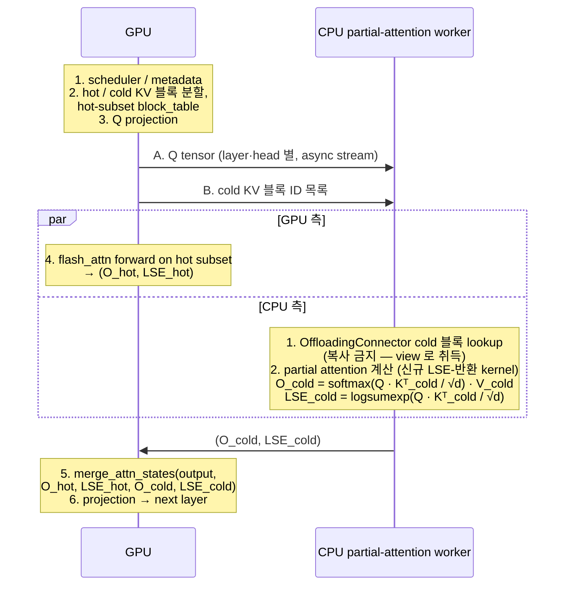

**↑ 부모**: [`shadow_assists/README.md`](../../README.md) · **↓ 자식**: [`PLN_001`](PLN_001.md) · [`TSK_001`](TSK_001.md) · [`TSK_002`](TSK_002.md) · [`TSK_003`](TSK_003.md) · [`TST_001`](TST_001.md) · [`TST_002`](TST_002.md) · [`TST_003`](TST_003.md) · [`TST_004`](TST_004.md)

---

# IDE_006 — Cold-KV CPU Partial Attention

| 항목 | 값 |
|---|---|
| ID | `IDE_006` |
| 상태 | `재정의` (1차 정의 기각 → 2차 정의. 최신 재정의 커밋: `8f50eeb2a4`) |
| 분류 | 선행 연구 적용 축 (독자 기여 지점 포함) |
| 근거 등급 | C |
| 현재 workload (128/128) 기여 | 0 (cold KV 자체가 발생하지 않음) |
| 장기 가치 성격 | long-context workload 전환 시 + vLLM CPU attention backend 위에 올릴 신규 partial-attention worker 와 cold-tier offloading 의 결합 |
| 상위 문서 | [`shadow_assists/README.md` §3.2](../../README.md) |
| ID 넘버링 출처 | [`shadow_assists/id_registry.md`](../../id_registry.md) |

> **용어 주의**: 본 문서는 **vLLM CPU attention backend (`vllm/v1/attention/backends/cpu_attn.py`)** 와 그 위에 올릴 **신규 CPU partial-attention worker / kernel** 조합을 전제로 한다. 별칭은 "worker-side CPU compute path". 이 외의 표기 (예: "CPU engine") 는 쓰지 않는다.

> **디렉토리 단계 주의**: 본 디렉토리 (`shadow_assists/features/IDE_006/`) 의 현 단계는 **IDE 상세 + PLN/TSK 명세 (pre-FEA)** 다. `README.md` (IDE_006 spec) 와 함께 `PLN_001.md`, `TSK_001.md`, `TSK_002.md` 가 **평탄 배치** (별도 하위 디렉토리 미사용). CLAUDE.md Method 가 정의한 feature 디렉토리 구조 (`CLAUDE.md` / `task.md` / `test.md` / test 코드) 는 **`FEA_###` 진입 시점에 별도 디렉토리로 보강** 한다.

---

## 1. TL;DR

- **무엇을 하는가**: KV 캐시가 GPU HBM 을 넘어 CPU DRAM 으로 내려간 상태(cold tier)에서, cold 블록을 GPU 로 재적재하지 않고 **CPU 측 신규 partial-attention worker 가 그 블록에 대한 partial attention 을 직접 계산** 하여 `(partial_output, LSE)` 만 GPU 로 올려 보낸다. GPU 는 hot KV 의 partial 결과와 CPU partial 결과를 **online softmax merge** 로 합산해 최종 attention output 을 만든다.
- **왜 이 포크에서 가능한가**: vLLM 의 **CPU attention backend** 경로 위에 **신규 LSE-반환 partial-attention kernel** 을 올리고, 업스트림에서 상속된 **cold-tier offload 경로 (LMCache / OffloadingConnector)** 와 결합한다. 이 **결합 지점** 이 독자 기여.
- **무엇이 아닌가 (1차 정의 기각 포인트)**: "CPU DRAM 을 KV 저장소로 쓰는 기능" 자체는 이미 vLLM 업스트림 + 본 포크에 들어와 있다. 그것의 신규 구현은 IDE_006 의 범위가 아니다.

---

## 2. 배경 — 왜 재정의되었는가

### 2.1 · 1차 정의 (기각)

1차 정의는 "CPU-side Cold KV staging" 이었다. InfiniGen / LMCache / Mooncake 를 인용하며 "hot KV 는 GPU, cold KV 는 CPU DRAM" 의 계층화를 신규 구현하자는 제안이었다.

문제는 본 포크의 실제 코드 상태를 확인한 결과 해당 기능이 이미 들어와 있었다는 것이다:

- `vllm/v1/kv_offload/` — CPU/worker/spec/medium 등 offload abstraction 을 이미 구비
- `vllm/distributed/kv_transfer/kv_connector/v1/offloading_connector.py` — cold-tier offloading connector 본체
- `vllm/distributed/kv_transfer/kv_connector/v1/lmcache_integration/` — LMCache 바인딩 (≈ 수 kLOC)
- 동 디렉토리의 `lmcache_connector.py`, `lmcache_mp_connector.py`, `mooncake/`, `flexkv_connector.py`, `simple_cpu_offload_connector.py` 등 cold-tier 연결 레이어 다수

기본값은 비활성이지만 `--kv-transfer-config` 로 켜지는 **운영 결정** 수준이지, 이 포크에서 "새로 구현할" 기능이 아니다. 업스트림과 중복되는 연구·구현은 본 포크의 차별점이 되지 못하므로 1차 정의는 기각.

### 2.2 · 2차 정의의 핵심 전환

> "CPU 를 KV **저장소**로 쓰는" 것은 이미 있다. 본 포크가 할 일은 CPU 를 KV **연산자**로 쓰는 것이다.

LMCache / OffloadingConnector 가 CPU DRAM 에 내려 둔 cold KV 블록 위에서, GPU 재적재 경로를 타지 않고 **vLLM CPU attention backend 상의 신규 partial-attention worker 가 직접 partial attention 을 계산**한 뒤 그 결과를 GPU 의 online softmax merge 에 합류시키는 구도로 재정의한다. `ideation_20260421.md` §2 의 "독자 기여 지점" 축에 부합하도록 좁게 잡았다.

---

## 3. 개념 정의

### 3.1 · 한 줄 정의

> **vLLM native cold-tier offloading 에 의해 이미 CPU DRAM 으로 내려간 KV 블록을, GPU 로 reload 없이 CPU partial-attention worker 가 partial attention 으로 소비하고, vLLM 내부의 LSE merge 경로로 합산하는 구조.**

### 3.2 · 구성 요소와 역할

| 구성 요소 | 역할 | 구현 위치 (기존/신규) |
|---|---|---|
| LMCache / OffloadingConnector | cold KV 블록을 CPU DRAM 에 유지 | **기존 (업스트림 상속)** |
| GPU attention (flash_attn backend) | **hot subset** 에 대한 partial attention + 최종 merge | **기존 경로 재사용** (단, hot-subset 제한용 block_table / attention metadata 신규 통합 필요 — §6) |
| CPU partial-attention worker | cold KV 블록에 대한 partial attention (Q·Kᵀ softmax V + **LSE 산출**) | **신규 kernel + 신규 호출 경로**. 기존 `vllm/v1/attention/backends/cpu_attn.py` 의 `forward()` (`:261-293`) 는 output 만 채우고 **LSE 를 반환하지 않으므로 as-is 재사용 불가** |
| partial 결과 전송 채널 | GPU→CPU 로 Q, CPU→GPU 로 `(partial_output, LSE)` | **신규**. layer 내부 critical path 에 위치하므로 async stream / overlap 설계 필요 (§8 리스크 vii) |
| merge 경로 | `merge_attn_states` 로 hot/cold partial 합산 | **기존 재사용** |

---

## 4. 수학적 근거 — Partial Attention 과 Online Softmax Merge

### 4.1 · 표준 attention 의 partition 정리

표준 softmax attention 은 key 집합을 임의로 분할(partition)해도 **LSE-rescaling** ([arXiv 2501.01005 §2.2](https://arxiv.org/abs/2501.01005); vLLM 내부 `merge_attn_states` 의 docstring 이 명시 인용하는 표준 출처) 으로 수치 동치 결과를 만들 수 있다. KV 블록 집합을 hot set `H` 와 cold set `C` 로 나누면:

```
s_H = Q · K_Hᵀ / √d,    P_H = softmax(s_H),    O_H = P_H · V_H,    m_H = max(s_H),    l_H = sum(exp(s_H - m_H))
s_C = Q · K_Cᵀ / √d,    P_C = softmax(s_C),    O_C = P_C · V_C,    m_C = max(s_C),    l_C = sum(exp(s_C - m_C))
```

최종 attention output 은 두 부분 결과의 LSE 기반 가중 평균으로 복원된다:

```
m  = max(m_H, m_C)
α_H = exp(m_H - m),   α_C = exp(m_C - m)
O  = (α_H · l_H · O_H + α_C · l_C · O_C) / (α_H · l_H + α_C · l_C)
LSE = m + log(α_H · l_H + α_C · l_C)
```

즉 GPU 와 CPU 가 각자 계산한 `(O_*, LSE_*)` 만 서로에게 넘기면 어느 쪽이든 final output 을 복원할 수 있다. 본 아이디어는 이 복원을 GPU 쪽에서 한다.

### 4.2 · vLLM 내부의 동일 경로 재사용

vLLM 은 이미 "prefix + suffix" 형태의 partial attention 합산을 내부 경로로 가지고 있다:

- `csrc/attention/merge_attn_states.cu` — CUDA 커널 본체
- `vllm/v1/attention/ops/merge_attn_states.py` — Python wrapper
- `vllm/v1/attention/backends/flash_attn.py:967` — context 와 query 의 partial attention 결과를 LSE merge 하는 호출부
- `vllm/v1/attention/backends/flash_attn.py:1214` — prefix / suffix partial 을 LSE merge 하는 호출부

본 아이디어의 "CPU partial" 은 위 경로의 "prefix partial" 과 **동일한 수학적 역할**을 한다. 따라서 **merge 커널을 새로 만들 필요는 없다**. 다만 hot/cold partition 을 scheduler · attention metadata 에 반영하는 통합 작업과 LSE 를 산출하는 CPU 측 신규 kernel 은 §6 에서 보는 대로 필요하다.

### 4.3 · GQA (Grouped-Query Attention) 처리

Qwen2.5-7B 등의 GQA 레이아웃은 Q head 수(예: 32) 와 KV head 수(예: 4) 가 다르다. cold 블록을 CPU 에서 attention 계산할 때 KV head broadcast 를 어느 시점에 수행하는지에 따라 CPU 메모리 대역폭·연산량이 크게 바뀐다.

- 옵션 A — K/V 를 KV-head 단위로 CPU 에 저장 (compact) + CPU 에서 broadcast 후 연산
- 옵션 B — CPU 에서 Q-head 단위로 미리 expand 된 버퍼를 유지 (메모리 희생, 연산 단순)

진입 조건 (d) 에서 GQA 동작 확인을 명시한 이유. PLN 단계에서 옵션 선택.

---

## 5. 시스템 구조

### 5.1 · Data Flow (decode step 1 회)



> 이 흐름은 **layer 단위 critical path 에 개입**한다. Q projection 후부터 merge 이전까지가 단일 layer 의 내부 구간이므로, CPU 측 왕복 전체 (Q 전송 + CPU partial + partial 결과 전송) 를 GPU hot attention 과 **얼마나 overlap 할 수 있는지가 본 아이디어의 net-win 을 좌우**한다. 단순 "CPU idle 활용" 이 아니라는 점을 §8 리스크 vii 에서 별도 항목으로 다룬다.

### 5.2 · Owner / Layout 계약 (미정 — PLN 에서 고정)

OffloadingConnector 가 내려 둔 CPU tensor 의 소유권·레이아웃은 attention 커널의 입력으로 바로 쓰일 수 있을 만큼 고정되어 있지 않다. 최소 다음이 PLN 단계에서 결정되어야 한다:

- cold 블록의 dtype (원본 vs Q8 등 양자화 포맷)
- paged layout 유지 여부 (vLLM block 단위 KV layout 과의 호환)
- lifetime — connector 가 swap-in/out 을 결정하는 동안 CPU partial-attention worker 가 view 를 안전하게 잡아 두는 방법 (refcount / lease / copy-on-demand)
- head dim 과 num_kv_heads 의 CPU 쪽 표현 (GQA §4.3 연계)

리스크 (iii) 로 명시.

### 5.3 · 자원 경합 매트릭스 (IDE_001/002/004 와의 충돌)

CPU partial-attention worker 가 수행할 연산과 동일 CPU 코어·메모리 대역을 놓고 다른 CPU 후보 작업들과 경합할 수 있다. 진입 조건 (e) — 다음 매트릭스의 결정이 있어야 함:

| CPU 작업 | phase (GPU 관점) | IDE_006 과의 관계 |
|---|---|---|
| scheduler + metadata (`IDE_001`) | step 경계 | 시간 분리. 동 step 내 동시 실행 없음 |
| prefill-assist (`IDE_002`) | prefill | decode 에서의 IDE_006 과 시간 분리 |
| background compile (`IDE_003`) | 임의 (저우선) | 선점 가능. IDE_006 우선 |
| sublayer burst (`IDE_004`) | attention vs linear | attention phase 의 CPU 작업 슬롯을 IDE_006 이 먼저 점유 |

---

## 6. vLLM 내부 연계 지점과 **필요한 신규 통합 작업**

### 6.1 · 확인된 경로

| 구성 | 경로 | 역할 |
|---|---|---|
| LSE merge kernel (CUDA) | `csrc/attention/merge_attn_states.cu` | partial output + LSE 합산 본체 |
| LSE merge (Python wrapper) | `vllm/v1/attention/ops/merge_attn_states.py` | 호출부에서 사용하는 wrapper |
| merge 호출 예 1 | `vllm/v1/attention/backends/flash_attn.py:967` | context / query partial 합산 |
| merge 호출 예 2 | `vllm/v1/attention/backends/flash_attn.py:1214` | prefix / suffix partial 합산 |
| 기존 CPU attention backend | `vllm/v1/attention/backends/cpu_attn.py:261-293` | `forward()` 가 output 만 반환, **LSE 미반환** |
| KV offload abstraction | `vllm/v1/kv_offload/` | cold-tier 계층 구조 (`cpu/`, `worker/`, `spec.py`, `reuse_manager.py` 등) |
| cold-tier connector | `vllm/distributed/kv_transfer/kv_connector/v1/offloading_connector.py` | CPU DRAM 으로의 블록 이동 주체 |
| offloading worker 단일 KV group assert | `vllm/v1/kv_offload/worker/cpu_gpu.py:138-139` | `assert len(kv_cache_groups_data_refs) == 1` — 초기 범위 제한 근거 |
| FP8 KV cache 미지원 (CPU backend) | `vllm/v1/attention/backends/cpu_attn.py:250-251` | `raise NotImplementedError("FP8 KV cache is unsupported in CPU_ATTN")` |
| LMCache 통합 | `vllm/distributed/kv_transfer/kv_connector/v1/lmcache_integration/` | LMCache 바인딩 |

### 6.2 · 수정 범위의 현실적 규모

> **merge 커널 (`merge_attn_states`) 은 재사용** 한다. 그러나 **hot/cold partition metadata 와 CPU partial attention 호출 경로는 신규 통합이 필요하다**. 구체적으로 다음 네 축의 변경이 들어간다:

1. **scheduler / attention metadata 측** — hot KV block 목록과 cold KV block 목록을 분리 전달. 기존 block_table 은 "어느 layer 가 어느 block 을 읽는가" 를 가정하고 있으므로, hot subset 으로 제한하는 block_table 또는 hot/cold 양쪽을 구별하는 metadata 확장이 필요.
2. **flash_attn backend 호출부** — 기존 호출은 "전체 KV" 를 전제로 한다. hot subset 전용 호출 경로를 추가하거나, 입력 block_table 을 hot subset 으로 한정하는 계약을 세워야 한다. prefix/suffix merge 는 이미 쓰이므로 호출 시그니처 자체는 친숙.
3. **CPU partial-attention kernel 신규 구현** — 기존 `cpu_attn.py` 의 `forward()` 는 `output` 만 채우고 LSE 를 반환하지 않는다 (`:261-293`). **LSE-반환 버전의 CPU partial-attention kernel 을 신규로 작성**해야 한다. AVX-512 / AMX 경로 선택은 PLN 단계.
4. **OffloadingConnector worker 경로의 초기 범위 한정** — `kv_offload/worker/cpu_gpu.py:138-139` 의 `assert len(kv_cache_groups_data_refs) == 1` 이 남아 있으므로, 초기 지원은 **단일 KV group** 으로 묶는 것이 안전하다. 다중 group / MLA / Mamba / sliding window 로의 확장은 본 IDE 의 후속 작업으로 분리.

따라서 본 아이디어는 **"어느 파일도 손대지 않는" 수준의 변경이 아니다**. 난도는 merge 커널 재사용으로 낮아지지만, scheduler·metadata·attention 호출 경로·CPU kernel 네 곳에 걸친 통합이 필요하다. `CLAUDE.md` Objective/Constraint (GPU-only 결과와 동일) 는 merge 경로가 수치적으로 흡수하되, 결과의 일치 여부는 §8 의 tolerance 기준으로 판정한다.

---

## 7. 선행 연구 비교와 독자 기여 위치

| 연구 | 축 | IDE_006 과의 경계 |
|---|---|---|
| [NEO (arXiv 2411.01142)](https://arxiv.org/abs/2411.01142) / [OpenReview umgy9tWBLA](https://openreview.net/forum?id=umgy9tWBLA) | asymmetric GPU/CPU pipeline, attention compute + KV state 의 CPU offload | vLLM native OffloadingConnector / LMCache cold-tier lifecycle 및 기존 LSE merge path 와의 통합은 다루지 않음 |
| [CachedAttention (USENIX ATC'24)](https://prongs1996.github.io/assets/pdf/CachedAttention.pdf) | 다계층 KV reuse | "저장·재사용" 초점이며, CPU 에서의 attention 연산을 직접 다루지 않음 |
| [InfiniGen (arXiv 2406.19707)](https://arxiv.org/abs/2406.19707) | KV selective prefetch | cold KV 를 GPU 로 가져옴. 본 아이디어는 가져오지 않음 |
| [LMCache (arXiv 2510.09665)](https://arxiv.org/abs/2510.09665) | KV 공유 캐시 | CPU 저장 / GPU 재호출. CPU 에서의 attention 연산은 범위 밖 |
| [Mooncake (arXiv 2407.00079)](https://arxiv.org/abs/2407.00079) | disaggregated KV | 저장·전송 아키텍처. CPU attention compute 는 범위 밖 |

### 7.1 · 독자 기여 (좁게 재정의)

> **vLLM native cold-tier offloading (LMCache / OffloadingConnector) 에 이미 내려간 KV 를 GPU reload 없이 CPU 에서 partial attention (LSE-반환) 으로 소비하고, vLLM 내부 LSE merge 경로로 합산하는 구조** 는 공개 연구·상용 시스템에서 직접 대응이 확인되지 않았다. ("CPU 에서 attention 을 하는" 연구는 있지만 vLLM 의 native cold-tier 계층 위에서, 그리고 기존 merge 경로의 재사용으로 성립하는 구체 조합은 없다.)

이 경계 밖으로 주장을 넓히지 않는다. (X / B1 / B2 / B3 실패의 반복 방지.)

---

## 8. 리스크와 완화

| # | 리스크 | 심각도 | 완화 방향 |
|---|---|---|---|
| i | partial attention merge 결과가 GPU-only 결과와 정확히 일치하지 않을 수 있음. FlashAttention 경로의 **비결정성** 으로 bitwise 일치는 비현실적 | 높음 | PLN 단계에서 `rtol/atol` 기준값을 수치 공차로 명시적으로 합의. `CLAUDE.md` Constraint("GPU-only 결과와 달라져서는 안 됨") 의 운영 해석으로, 기각 기준 tolerance 를 고정. 비교 대상은 GPU-only eager / FlashAttention 두 경로 모두 |
| ii | CPU partial-attention worker throughput + (Q 전송 + partial 전송) 비용이 GPU full-reload + full-attention 대비 **net win 인 sweet spot 이 좁을 수 있음** | 높음 | PLN microbench 에서 context length × cold ratio × batch size 의 2D sweep. net-win 영역 면적이 일정 이하이면 IDE_006 기각 |
| iii | OffloadingConnector 가 저장한 CPU tensor 를 attention 커널 입력으로 **안전하게 복원할 layout / owner 계약이 미정** | 중간 | §5.2 의 네 항목을 PLN 에서 고정. connector 측 변경 최소화를 목표로 read-only view 기반 설계 우선 |
| iv | GQA 에서 K/V head broadcast 를 어디서 하느냐에 따라 CPU 성능이 크게 달라짐 | 중간 | PLN 에서 옵션 A/B 벤치. 선택 근거를 문서화 |
| v | 다른 CPU 후보 작업 (IDE_001/002/003/004) 과의 코어·대역 경합 | 중간 | §5.3 자원 매트릭스로 우선순위 고정. IDE_004 의 attention phase CPU 슬롯은 IDE_006 이 우선 |
| vi | long-context workload 가 운영에 실제로 들어오지 않으면 기여 0 | 낮음 (기각 사유는 아님) | 장기 가치로 분류. 진입 조건 (a) 충족 전까지는 PLN 단계에서 멈춤 |
| vii | **mid-layer synchronization — layer 내부 critical path 에 CPU 통신·계산이 끼어든다**. Q projection 직후 `GPU→CPU Q` 전송 → CPU partial attention → `CPU→GPU (O, LSE)` 전송 → merge 가 layer 내부에서 직렬화되면 GPU hot-attention 시간을 가리지 못하고 **순 지연이 된다**. "CPU idle 활용" 을 넘어선 GPU critical-path 개입임에 유의 | 높음 | PLN 에서 `Q transfer + CPU partial + (O, LSE) transfer` 의 end-to-end 시간을 GPU hot-attention 시간과 비교. async H2D/D2H + 전용 CUDA stream 분리, Q chunk 의 파이프라인 hiding 가능성을 측정. overlap 불가 시 IDE_006 기각 |

---

## 9. 진입 조건 (측정 가능 기준)

CLAUDE.md 원칙에 따라 숫자로 진입·기각 판정.

| 조건 | 내용 | 판정 주체 |
|---|---|---|
| (a) | long-context workload (≥ 8K) 로의 실제 전환. `shadow_assists/README.md` §3.2 와 정합 | 운영 / profile |
| (b) | CPU partial-attention worker 의 attention throughput 측정 (tokens/s, context-length 별) 이 PLN 에서 정한 최소 임계 이상 | PLN microbench |
| (c) | partial attention merge 결과가 **사전 정의된 tolerance(rtol/atol)** 내에서 GPU-only 결과와 일치 | PLN verification |
| (d) | GQA (Qwen2.5-7B: Q heads 32 / KV heads 4) 에서 K/V split + head broadcast 가 CPU 경로에서 정상 동작 | PLN microbench |
| (e) | IDE_001/002/004 와 충돌하지 않는 CPU 작업 **priority / conflict matrix** 가 정의되어 있음 | 설계 의사결정 |
| (f) | **초기 지원 범위 제한 (scope lock)**: **BF16/FP16 KV**, **non-FP8**, **non-MLA**, **full attention** (non-sliding-window, non-Mamba/HMA), **단일 KV group** (decoder-only). 근거: `vllm/v1/attention/backends/cpu_attn.py:250-251` (FP8 미지원), `vllm/v1/kv_offload/worker/cpu_gpu.py:138-139` (single-group assert) | 설계 의사결정 |
| (g) | `Q transfer → CPU partial → (O, LSE) transfer → merge` 의 end-to-end 시간이 GPU hot-attention 시간과 **overlap 가능** (리스크 vii) | PLN profile |

위 조건 중 하나라도 충족 실패 시 PLN/FEA 로 진입하지 않는다. 특히 (f) 와 (g) 는 "구현 착수 전" 결정·확인이 필요한 게이트.

---

## 10. 현재 workload 기여와 가치 성격

- **현재 (128/128)** — 기여 0. cold KV 자체가 발생하지 않는다. 본 디렉토리의 작업은 "지금 이득" 을 만들지 않는다.
- **장기** — long-context 전환 + worker-side CPU 연산 가용 시간이 partial-attention 에 충분히 남는 구간에서만 작동. 본 포크의 **worker-side CPU compute path** 차별점과 결합되는 유일한 지점 중 하나.

따라서 IDE_006 은 **"지금 구현" 이 아니라 "지금 설계 산출물을 남겨 두는" 아이디어** 다. Phase 0 profile 과 별도로, long-context workload 전환 시점의 **곧바로 쓸 수 있는 PLN 후보군** 을 미리 적재하는 용도.

---

## 11. 다음 단계 — 파생 ID 계획

진입 조건 (a) 가 발생한 후 `shadow_assists/id_registry.md` 의 해당 prefix "다음 부여 번호" 를 가져와 **구현 흐름** 순서 (PLN → TSK → TST → FEA) 로 적재한다.

| 단계 | ID | 제목 | 상태 |
|---|---|---|---|
| 1 | [`PLN_001`](PLN_001.md) | Cold-KV CPU Partial Attention PoC 플랜 | `대기` (문서 적재 완료. (a) long-context 전환 후 `활성`) |
| 2 | [`TSK_001`](TSK_001.md) | LSE-반환 CPU partial-attention kernel 구현 | `대기` (PLN 임계 충족 후) |
| 3 | [`TSK_002`](TSK_002.md) | scheduler / attention metadata 의 hot/cold partition 통합 | `대기` (`TSK_001` 후속) |
| 4 | [`TSK_003`](TSK_003.md) | **prod SIMD kernels** (AVX-512 + AMX C++) | `대기` (Phase 2 prod 사용자 직접) |
| 5 | [`TST_001`](TST_001.md) | TSK_001 dev kernel 정확도 (A · B(i) · C) | `활성` (Phase 1 dev — 통과) |
| 6 | [`TST_004`](TST_004.md) | TSK_003 prod SIMD cross-check (B(ii) AVX-512 + B(iii) AMX) | `대기` (`TSK_003` 후) |
| 7 | [`TST_003`](TST_003.md) | e2e 통합 정확도 (D-i + D-ii) | `대기` (`TSK_002` 후) |
| 8 | [`TST_002`](TST_002.md) | throughput / overlap profile | `대기` (다른 TST 통과 후) |
| 9 | `FEA_###` | 통합 기능 (`feat/ide006-cold-kv-cpu-partial-attention` 브랜치) | 미할당 |

각 ID 의 상세 명세는 위 표의 링크 (`PLN_001.md`, `TSK_001.md`, `TSK_002.md`) 가 단일 출처. 미할당 ID 들은 PLN 결과에 따라 발급. CLAUDE.md ID Rule 8 (본문 사용은 id_registry 갱신 이후) 준수.

---

## 12. Open Questions (PLN 착수 전 명시화 필요)

1. `rtol / atol` 의 운영 후보값. FlashAttention 경로의 기본 수치 오차를 먼저 재며, 그 이상을 허용할지 말지.
2. LMCache / OffloadingConnector 가 보유한 CPU tensor 를 수정 없이 attention 입력으로 쓸 수 있는가, 아니면 "view 어댑터" 레이어가 필요한가.
3. GQA head broadcast 를 CPU 쪽에서 할 때 L2/L3 cache working set 이 실제로 메모리 대역 bound 를 피하는가.
4. hot / cold 분할 기준을 layer 별로 독립 결정할지, request 전체에서 균일하게 할지.
5. speculative decode / spec draft (`IDE_005`) 와 동 시점에 진행될 경우의 자원 경합.
6. Q chunk 파이프라이닝으로 critical-path hiding 이 가능한가. 가능한 chunk 크기는? (리스크 vii)

---

## 13. References

### vLLM / 본 포크

- `vllm/v1/kv_offload/` (cold-tier 추상화)
- `vllm/v1/kv_offload/worker/cpu_gpu.py:138-139` (단일 KV group assert — 초기 scope 근거)
- `vllm/distributed/kv_transfer/kv_connector/v1/offloading_connector.py`
- `vllm/distributed/kv_transfer/kv_connector/v1/lmcache_integration/`
- `vllm/v1/attention/backends/cpu_attn.py:250-251` (FP8 KV 미지원), `:261-293` (forward — LSE 미반환)
- `vllm/v1/attention/ops/merge_attn_states.py`
- `vllm/v1/attention/backends/flash_attn.py:967`, `:1214`
- `csrc/attention/merge_attn_states.cu`

### 외부 논문 / 자료

- NEO — asymmetric GPU/CPU pipeline, attention + KV state CPU offload: [arXiv 2411.01142](https://arxiv.org/abs/2411.01142) · [OpenReview umgy9tWBLA](https://openreview.net/forum?id=umgy9tWBLA)
- CachedAttention — 다계층 KV reuse: [USENIX ATC'24 PDF](https://prongs1996.github.io/assets/pdf/CachedAttention.pdf)
- InfiniGen — KV selective prefetch: [arXiv 2406.19707](https://arxiv.org/abs/2406.19707)
- LMCache — KV 공유 캐시: [arXiv 2510.09665](https://arxiv.org/abs/2510.09665)
- Mooncake — disaggregated KV: [arXiv 2407.00079](https://arxiv.org/abs/2407.00079)

### 상위 / 관련 문서

- [`shadow_assists/README.md`](../../README.md) (§3.2 Cold-KV CPU Partial Attention, §VII Trace Tree)
- [`shadow_assists/id_registry.md`](../../id_registry.md)
- `super_power/ideation/cpu_idle_acceleration_ideation_20260421.md` (IDE 전체의 상위 ideation)

---

## 14. Change Log

| 날짜 | 변경 | 사유 |
|---|---|---|
| 2026-04-25 | 본 README 초안 작성 | IDE_006 2차 정의 기준 상세 설계 문서 적재. 파생 ID 생성은 진입 조건 (a) 충족 후 |
| 2026-04-25 | TST_003 신규 적재 (책임 분리) | TST_001 의 단계 D (e2e 통합 정확도) 가 TSK_002 의존이라 TSK_001 단독 검증과 책임이 섞여 있던 것을 분리 — 신규 [`TST_003`](TST_003.md) 발급 + TST_001 의 D 섹션 일괄 제거. (1) §11 표 step 5 = `TST_003` (e2e 정확도, D-i + D-ii) 신규 행 + step 6 = `TST_002` (throughput) 이동 + step 7 = `FEA_###`. (2) 최상단/최하단 nav 자식 목록에 `TST_003` 추가. (3) TST_001 의 검증 대상은 `TSK_001` 단독, TST_003 은 `TSK_001 + TSK_002` 통합 e2e. |
| 2026-04-25 | TST_001 / TST_002 적재 반영 | (1) 최상단/최하단 nav 의 자식 목록에 `TST_001` / `TST_002` 추가. (2) §11 표의 step 4·5 generic `TST_###` 행을 적재된 [`TST_001`](TST_001.md) / [`TST_002`](TST_002.md) 링크로 갱신. step 4 = "정확도 검증 (KVViewAdapter / kernel cross-check / wrapper dispatch / e2e)", step 5 = "throughput / overlap profile". 상태 모두 `대기`. |
| 2026-04-25 | §11 표 PLN_001 상태 정합 | id_registry / PLN_001 본문은 `대기` 인데 §11 표만 `활성 (적재 완료)` 로 stale. `대기 (문서 적재 완료. (a) long-context 전환 후 활성)` 으로 통일. |
| 2026-04-25 | 디렉토리 단계 박스 갱신 (issue 7) | "현재 README.md 만 존재" 표기가 평탄화 후 stale. `README.md` + `PLN_001.md` + `TSK_001.md` + `TSK_002.md` 평탄 배치 명시로 갱신. |
| 2026-04-25 | 이론·계획 재검증 반영 | (1) §5.1 Data Flow 를 ASCII art → Mermaid sequenceDiagram 으로 변환 (CLAUDE.md Ground RULE 신규 항목 "Diagram 은 ascii 가 아닌 Mermaid …" 충족). (2) §4.1 에 LSE-rescaling 표준 출처 [arXiv 2501.01005 §2.2](https://arxiv.org/abs/2501.01005) 인용 추가 — vLLM 내부 `merge_attn_states` docstring 이 명시 인용하는 표준 출처와 정합. (3) §11 파생 ID 생성 순서를 `PLN → TSK → TST → FEA` 의 자연스러운 구현 흐름으로 재배열 (이전: PLN → TST → TST → TSK → TSK → FEA). 코드 인용 라인 번호 (cpu_attn.py:251/261, kv_offload/worker/cpu_gpu.py:139, flash_attn.py:967/1214) 는 재 grep 결과 모두 현 코드와 일치 — 변경 없음. |
| 2026-04-25 | 잔존 표현 정리 | 본 README 와 상위 README 양쪽에서 잔존하던 deprecated 가설/식별자 관련 표현·인용을 모두 제거 (식별자 prefix 가 코드에 남아 있더라도 문서에서 이름으로 노출하지 않음). 본문 중립화. |
| 2026-04-25 | 추가 검토 반영 (정합성) | (1) NEO 비교 문구에서 근거가 약한 표현 제거 — 안전한 표현 "vLLM native OffloadingConnector / LMCache cold-tier lifecycle 및 기존 LSE merge path 와의 통합은 다루지 않음" 으로 교체. (2) 출처 불명확한 "FastDecode 계열" 행 §7 표에서 제거. (3) §11 step 2 의 비교 대상 표기를 "IDE_006 hot/cold split path" 로 명확화. (4) 디렉토리 단계 주의 박스 추가 — features/IDE_006/ 가 pre-FEA 아이디어 상세 단계임을 명시 (CLAUDE.md / task.md / test.md 부재는 의도된 단계). |
| 2026-04-25 | 검토 반영 개정 | (1) "CPU engine / CPU compute engine" 표기 제거 — "vLLM CPU attention backend" / "CPU partial-attention worker" / "worker-side CPU compute path" 로 교체. (2) §6 "어느 하나도 수정 전제로 하지 않는다" 문장을 현실에 맞게 조정 — merge 커널은 재사용하되 scheduler / attention metadata / attention backend 호출 경로 / 신규 LSE-반환 CPU kernel 의 네 축 통합이 필요함을 명시. (3) 기존 `cpu_attn.py:261-293` 의 `forward()` 가 LSE 를 반환하지 않아 as-is 재사용 불가임을 §3.2·§6 에 반영. (4) 진입 조건 (f) 초기 scope 잠금 (BF16/FP16, non-FP8, non-MLA, full attention, 단일 KV group) 과 (g) overlap 가능성 추가. 근거: `cpu_attn.py:250-251`, `kv_offload/worker/cpu_gpu.py:138-139`. (5) 리스크 vii (mid-layer synchronization — layer 내부 critical path 에 CPU 통신·계산이 직렬화되면 순 지연) 신설. |
| (이전) | `shadow_assists/README.md` §3.2 재정의 (commit `8f50eeb2a4`) | 1차 정의 "Cold KV staging" 이 업스트림 중복이라 기각, CPU partial attention 으로 재정의 |

---

**↑ 부모**: [`shadow_assists/README.md`](../../README.md) · **↓ 자식**: [`PLN_001`](PLN_001.md) · [`TSK_001`](TSK_001.md) · [`TSK_002`](TSK_002.md) · [`TSK_003`](TSK_003.md) · [`TST_001`](TST_001.md) · [`TST_002`](TST_002.md) · [`TST_003`](TST_003.md) · [`TST_004`](TST_004.md)
