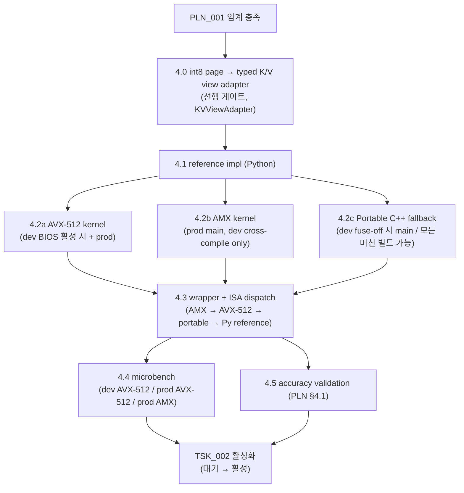

**↑ 부모**: [`PLN_001`](PLN_001.md) · **→ 다음 형제**: [`TSK_002`](TSK_002.md) · **↟ 조부**: [`IDE_006`](README.md)

---

# TSK_001 — LSE-반환 CPU partial-attention kernel 구현

| 항목 | 값 |
|---|---|
| ID | `TSK_001` |
| 상태 | `활성` (Phase 1 — dev 가능 단계 진행 중. 4.0 KVViewAdapter / 4.1 Python reference / 4.2c portable C++ / 4.3 wrapper. 4.2a AVX-512 BIOS-on / 4.2b AMX 는 Phase 2 사용자 진행) |
| 부모 PLN | [`PLN_001`](PLN_001.md) (Cold-KV CPU Partial Attention PoC 플랜) |
| 조부 IDE | [`IDE_006`](README.md) |
| 자매 TSK | [`TSK_002`](TSK_002.md) |
| 목적 | cold KV 블록에 대한 partial attention 을 **LSE 와 함께** 반환하는 CPU 측 신규 kernel 을 구현. 기존 `cpu_attn.py:261` `forward()` 를 교체하지 않고 **별도 entry point** 로 추가 |
| 후속 | [`TSK_002`](TSK_002.md) (scheduler / attention metadata 통합) 가 본 kernel 을 호출 |
| ID 넘버링 출처 | [`shadow_assists/id_registry.md`](../../id_registry.md) |

> **단계 주의**: PLN 임계 충족 후의 **구현 작업 단위 (pre-FEA)**. 코드 변경은 `feat:ide006-cold-kv-cpu-partial-attention` 브랜치 (FEA 단계) 에서 시작하되, kernel 단독 microbench 검증은 본 TSK 범위 내에서 완료. `task.md` / `test.md` 는 FEA 디렉토리 (`FEA_###/` 미할당 상태) 가 가질 자리이며, 본 파일이 작업 명세를 담는다.

---

## 1. TL;DR

- **무엇을 만드는가**: Q (BF16/FP16) + cold K/V (paged) → `(O_cold, LSE_cold)` 를 반환하는 CPU partial-attention 함수.
- **어디에 두는가**: `vllm/v1/attention/backends/cpu_attn.py` 에 `forward_partial_with_lse(...)` 신규 메서드 + `vllm/v1/attention/ops/` 에 wrapper. 기존 `forward()` 는 무수정.
- **무엇이 아닌가**: scheduler / attention metadata 통합은 본 TSK 범위가 아니고 **`TSK_002`** 가 담당.

---

## 2. 사전 조건

- `PLN_001` 의 §4.1 (accuracy), §4.4 (GQA 옵션) 결과로 **kernel 시그니처와 데이터 레이아웃이 결정** 되어 있어야 함.
- `PLN_001` 의 §3 scope lock 유지: BF16/FP16, non-FP8, non-MLA, full attention, 단일 KV group.
- **하드웨어 두 단계** (CLAUDE.md `# Hardware Targets` + PLN_001 §3 Phase 1/2 와 정합):
    - dev (RTX 3090 + Core i9-12900KF): wrapper cpuid dispatch 결과에 따라 AVX-512 (BIOS-on 시) 또는 portable (fuse-off 시) 직접 실행 + AMX cross-compile / 단위 테스트만
    - prod (Xeon Sapphire Rapids 이상 + H100 × 8): **AVX-512 + AMX 둘 다 native 실행 / 본격 throughput sweep**
- **CPU 가속 경로**: AVX-512 와 AMX **둘 다 메인**. AMX 는 prod 타깃의 native ISA 로, 후순위·deferred 가 아님.

---

## 3. 인터페이스 설계 (초안 — `PLN_001` 결과로 확정)

```python
def forward_partial_with_lse(
    # --- query 측 (variable length, batch>1 지원) ---
    query: torch.Tensor,              # CPU [num_tokens, num_q_heads, head_dim], BF16/FP16
    cu_seqlens_q: torch.Tensor,       # [num_seqs+1], int32 — query CSR 경계
                                      #   query[cu_seqlens_q[i]:cu_seqlens_q[i+1]] = seq i 의 query 토큰
    query_positions: torch.Tensor,    # [num_tokens], int32 — 각 token 의 절대 KV position
                                      #   (causal mask 경계 결정용)
    seq_lens_total: torch.Tensor,     # [num_seqs], int32 — 시퀀스별 전체 KV 길이 (cold + hot)
    # --- cold KV 측 (canonical int8 page → typed view) ---
    cold_kv_cache: torch.Tensor,      # CPU [num_blocks, page_size_in_bytes], int8
                                      #   vllm/v1/kv_offload/spec.py:51 의 CanonicalKVCaches data tensor
    cold_kv_view: KVViewAdapter,      # int8 page → BF16/FP16 K/V typed view 어댑터
                                      #   §4.0 산출물. layer 별 head_dim/num_kv_heads/page_size_bytes 보유
    cold_block_ids: torch.Tensor,     # [num_seqs, max_cold_blocks_per_seq], int32
                                      #   각 시퀀스의 cold block index (canonical tensor 인덱스)
    cold_block_lens: torch.Tensor,    # [num_seqs], int32 — 시퀀스별 유효 cold block 수
    block_size: int,                  # paged KV block size (token 단위)
    # --- 연산 파라미터 ---
    softmax_scale: float,             # 1 / sqrt(head_dim)
    causal: bool = True,              # decode = True (모든 query 가 자신의 position 까지 attend)
) -> tuple[torch.Tensor, torch.Tensor]:
    """
    Returns:
        O_cold:   [num_tokens, num_q_heads, head_dim], BF16/FP16
        LSE_cold: [num_q_heads, num_tokens], float32  # merge_attn_states 가 요구하는 layout
                                                       # NUM_HEADS = num_q_heads (GQA 의 query-head 단위)
    """
```

> `LSE_cold` 의 shape `[num_q_heads, num_tokens]` 는 `merge_attn_states` (`vllm/v1/attention/ops/merge_attn_states.py:32-37`) 의 `prefix_lse / suffix_lse` 와 호환. GQA 환경에서 `NUM_HEADS` 차원은 **query head 수** (KV head 수가 아님).

GQA 옵션 (PLN_001 §4.4) 결과에 따라 옵션 A (KV-head 압축 + broadcast) 또는 옵션 B (Q-head expand) 로 내부 구현 분기.

> **KV 데이터 접근 계약**: `cold_kv_cache` 는 vLLM canonical 표현인 `(num_blocks, page_size_in_bytes) int8` (참조: `vllm/v1/kv_offload/spec.py:51`). 본 kernel 은 raw int8 buffer 를 직접 읽지 않고 `cold_kv_view: KVViewAdapter` 를 통해 BF16/FP16 K/V 로 typed view 를 얻는다. adapter 자체는 §4.0 단계에서 만든다.

---

## 4. 구현 단계

| 단계 | 산출물 | 검증 |
|---|---|---|
| **4.0 int8 page → typed K/V view adapter** (선행 게이트) | `KVViewAdapter` 구현 — `(num_blocks, page_size_in_bytes) int8` (vLLM canonical, `kv_offload/spec.py:51`) → BF16/FP16 K/V typed view. layer 별 `head_dim`, `num_kv_heads`, `page_size_bytes` 정보를 받아 `(num_blocks, num_kv_heads, head_dim_per_kv)` 또는 동등 layout 의 view 를 생성. zero-copy view 가 가능한지, 아니면 lazy 재배열이 필요한지를 결정 (`PLN_001 §5 owner/layout 계약` 과 연계) | adapter 단독 unit test (canonical int8 ↔ typed view round-trip 무손실) |
| 4.1 Reference impl (Python torch ops) | `cpu_partial_reference.py` — 느리지만 수치 정확. §4.0 adapter 사용. flash_attn 의 단일 prefix attention 결과와 비교 | accuracy unit test |
| **4.2a C++ AVX-512 kernel** (dev BIOS 활성 시 + prod 항상) | `csrc/cpu/partial_attention_avx512.cpp` — paged layout + softmax_scale + causal mask + online LSE. variable-length batch 지원 (cu_seqlens_q + seq_lens_total). 12900KF 의 AVX-512 fuse-off 시에는 4.2c 로 자동 dispatch | scalar reference 와 BF16 tolerance 일치 |
| **4.2b C++ AMX kernel** (prod 머신 native, dev 는 cross-compile / 단위 테스트만) | `csrc/cpu/partial_attention_amx.cpp` — `Tdpbf16ps` 기반 BF16 matmul tile 활용. tile (16×32 BF16) → tile (16×16 FP32) accumulate 패턴으로 `Q·Kᵀ` 와 `P·V` 가속. paged layout + causal mask + online LSE. dev 에서는 빌드 + scalar fallback 동등성 검증, prod 에서 정확도/throughput 본격 측정 | dev: 단위 테스트 통과, prod: AVX-512 결과와 BF16 tolerance 일치 + throughput 우위 |
| **4.2c Portable C++ fallback kernel** (dev 정식 fallback — 모든 머신에서 동작) | `csrc/cpu/partial_attention_portable.cpp` — 순수 C++ 로 `-O3 -ftree-vectorize` 의 auto-vectorization 에 맡김 (가용 ISA 가 AVX2 / NEON 등 무엇이든 컴파일러가 활용). AVX-512 fuse-off 된 dev 12900KF 에서 main path. paged layout + causal mask + online LSE. AVX-512 / AMX 결과의 **C++ 측 정확성 reference** 도 겸함 | 4.1 Python reference 와 BF16 tolerance 일치. dev iteration 속도 (>> Python reference) |
| 4.3 PyTorch wrapper / Python 진입점 | `vllm/v1/attention/backends/cpu_attn.py` 에 `forward_partial_with_lse` 추가, `vllm/v1/attention/ops/cpu_partial_attention.py` 에 user-facing wrapper. **dispatch 정책 (cpuid 기반 ISA 감지)**: AMX 가용 → 4.2b, AVX-512 가용 → 4.2a, **그 외 (12900KF AVX-512 fuse-off / 일반 PC / ARM 등) → 4.2c portable**, 디버깅 모드 → 4.1 Python reference | import 가능, e2e smoke |
| 4.4 Microbench | PLN_001 §4.2 throughput sweep 의 CPU 측 결과 채움. **dev (RTX 3090 + 12900KF)** 에서는 wrapper dispatch 결과의 dev SIMD baseline (AVX-512 BIOS-on / portable fuse-off), **prod (Xeon SPR+ + H100×8)** 에서는 AVX-512 + AMX 측 결과를 분리 누적 (PLN_001 §4.2 의 dev/prod 세 set 정합). variable-length batch 도 sweep 차원에 포함 | net-win 영역 식별 |
| 4.5 Accuracy validation | reference impl vs AVX-512 path. dense / GQA 두 경로 모두. batch>1 + variable length 케이스 포함 | rtol/atol 합의값 (PLN §4.1 산출) 통과 |

§4.0 adapter 가 미정인 상태에서는 §4.1 이후의 kernel 설계를 확정할 수 없다 (raw int8 page 를 어떻게 K/V 로 해석하는지가 인덱싱·SIMD layout·메모리 stride 모두에 영향). PLN_001 §5 owner/layout 계약과 §4.0 결과는 **공동 게이트**. 각 단계 산출물은 `PLN_001_TSK_001_NN_*.md` 형태로 `IDE_006/` 디렉토리에 평탄 적재 또는 본 README 의 §9 References 가 가리키는 코드 경로에 누적.

---

## 5. 변경 파일 (예상 — PLN 결과로 변동 가능)

| 파일 | 변경 내용 | 비고 |
|---|---|---|
| `vllm/v1/attention/ops/kv_view_adapter.py` (신규) | `KVViewAdapter` — int8 page (`kv_offload/spec.py:51`) ↔ BF16/FP16 typed K/V view | §4.0 산출물, kernel 진입점이 의존 |
| `vllm/v1/attention/backends/cpu_attn.py` | `forward_partial_with_lse` 메서드 추가. 기존 `forward()` 무수정 | `:261` `forward` 시그니처 보존 |
| `vllm/v1/attention/ops/cpu_partial_attention.py` (신규) | Python-facing wrapper. **dispatch: `cpuid` 검출 → AMX 가용 → AMX path / AVX-512 가용 → AVX-512 path / 그 외 → portable C++ path / 디버깅 모드 → Python reference**. variable-length batch 지원 | merge_attn_states wrapper 와 동일 패턴. dispatch 4 단계 = §4.3 단일 출처 |
| `csrc/cpu/partial_attention_avx512.cpp` (신규) | AVX-512 커널 본체. `cu_seqlens_q` + `query_positions` 기반 causal mask 처리 | 기본 빌드 플래그 **`-mavx512f`** (FP32 path 만으로 빌드 가능, AVX-512 가용 머신 어디서나 실행). **BF16 native instruction (`vdpbf16ps` 등)** 은 별도 subpath 또는 **runtime cpuid 게이팅** (`avx512_bf16` 가용 시) — dev 12900KF 의 BF16 fuse 가능성에 안전. prod 에서 BF16 subpath 자동 활성. 빌드 시스템 (`setup.py` / `CMakeLists.txt`) 등록 필요 |
| **`csrc/cpu/partial_attention_amx.cpp`** (신규, prod 메인) | AMX 커널 본체. `Tdpbf16ps` 활용한 tile-based matmul. `Q·Kᵀ` 와 `P·V` 가속 | `-mamx-tile -mamx-bf16` 빌드 플래그. dev 에서는 unit test 만, prod 에서 native 실행 |
| **`csrc/cpu/partial_attention_portable.cpp`** (신규, **dev 정식 fallback / C++ reference**) | 순수 C++ partial attention (intrinsics 미사용). `-O3 -ftree-vectorize` 로 컴파일러 auto-vectorization 에 맡김. dev 12900KF (AVX-512 fuse-off / AMX 미지원) 의 main path. AVX-512 / AMX 결과의 C++ 측 정확성 reference 겸용 | x86 / ARM / 임의 머신에서 빌드 가능. 빌드 플래그 ISA-agnostic |

`vllm/core.py`·`vllm/v1/engine/*` 는 건드리지 않는다 (CLAUDE.md 원칙).

---

## 6. 검증

### 6.1 단독 검증 (TSK 단위)

- accuracy (4 경로 cross-check): (i) Python reference (4.1) vs portable C++ (4.2c), (ii) portable vs AVX-512 (4.2a), (iii) portable vs AMX (4.2b, prod 머신). 모든 pair 에서 max abs diff < `atol` / max rel diff < `rtol` (PLN_001 §4.1 결정 값). portable 이 C++ 측 reference 역할 → SIMD 경로들의 numerical correctness 게이트.
- throughput: PLN_001 §4.2 의 (context length × cold ratio × CPU 코어) sweep 결과 누적.

### 6.2 통합 검증 (TST 단위 — `TSK_002` 후 진행)

- [`TST_001`](TST_001.md) (정확도 검증) — KVViewAdapter / kernel 4 경로 cross-check / wrapper dispatch / e2e 4 단계.
- [`TST_002`](TST_002.md) (throughput / overlap profile) — net-win 영역 + critical path 측정.

---

## 7. 의존성·일정



본 TSK 가 종료되어야 `TSK_002` (scheduler/metadata 통합) 가 본 kernel 의 진입점을 wiring 할 수 있음.

---

## 8. Open Questions

1. **AVX-512 + AMX 둘 다 메인 경로**: 본 TSK 가 두 SIMD 경로를 모두 구현. dev 머신 (12900KF) 은 AMX hardware 미지원이므로 AMX 코드는 dev 에서 cross-compile + 단위 테스트만, native 실행과 throughput 측정은 prod 머신 (Xeon Sapphire Rapids 이상) 에서. AMX 의 `Tdpbf16ps` tile (16×32 BF16) 가 `Q·Kᵀ` / `P·V` 두 matmul 중 어느 단계에 더 친화적인지는 PLN_001 §9 Q7 + 본 TSK 의 §4.4 microbench 에서 확정. 빌드 dispatch (cpuid 기반 ISA 감지) 는 §4.3 wrapper 의 책임.
2. **paged layout 변환 비용**: OffloadingConnector 가 보유한 cold KV 가 GPU paged layout 그대로일 경우, CPU SIMD 친화 layout 으로 lazy 재배열할지, on-the-fly 인덱싱으로 끝낼지 — `PLN_001/05_owner_layout_contract.md` 결과 참조.
3. **softmax_scale 정밀도**: 외부에서 float 으로 전달 vs 내부 계산. flash_attn 호출부 (`flash_attn.py:967`) 와 일관성 맞추기.
4. **online LSE 누적의 수치 안정성**: BF16 직접 누적 vs float32 누적 후 BF16 캐스팅. PLN §4.1 tolerance 결과에 따라 결정.

---

## 9. References

### 부모·연계 문서

- 부모 PLN: [`PLN_001`](PLN_001.md)
- 조부 IDE 상세: [`IDE_006`](README.md)
- 자매 TSK: [`TSK_002`](TSK_002.md)
- ID 넘버링 출처: [`shadow_assists/id_registry.md`](../../id_registry.md)

### 코드 인용

- `vllm/v1/attention/backends/cpu_attn.py:261-293` — 기존 `forward()` (LSE 미반환). 무수정 유지
- `vllm/v1/attention/ops/merge_attn_states.py:9-47` — LSE 시그니처 ([arXiv 2501.01005 §2.2](https://arxiv.org/abs/2501.01005))
- `vllm/v1/attention/backends/flash_attn.py:967`, `:1214` — 기존 prefix/suffix LSE merge 호출 패턴 (참고용)

---

## 10. Change Log

| 날짜 | 변경 | 사유 |
|---|---|---|
| 2026-04-25 | TSK_001 초안 | PLN_001 §8 분기 중 "임계 충족 → TSK 착수" 경로의 첫 작업으로 적재. 인터페이스 / 단계 / 변경 파일 / 검증 / 의존성을 명세. PLN 결과로 인터페이스 일부 조정 가능. |
| 2026-04-25 | 디렉토리 평탄화 | 별도 디렉토리 (`PLN_001/TSK_001/`) 제거, `IDE_006/TSK_001.md` 단일 파일로 이동. 부모/조부/sibling 네비게이션을 최상단·최하단에 추가. 모든 상대 경로 갱신. |
| 2026-04-25 | 정합성 보정 (issue 5·6) | (5) 인터페이스에 batch>1 / variable length / causal 정보 추가 — `cu_seqlens_q`, `query_positions`, `seq_lens_total`, `causal` 필드. (6) cold KV 데이터 표현이 vLLM canonical `(num_blocks, page_size_in_bytes) int8` (`kv_offload/spec.py:51`) 임을 명시하고 § 4.0 단계 "int8 page → typed K/V view adapter" 를 선행 게이트로 추가. 변경 파일 목록에 `vllm/v1/attention/ops/kv_view_adapter.py` 신규 항목 추가. |
| 2026-04-25 | Mermaid §7 의존성 그래프 갱신 | §4 단계 표에 추가된 4.0 KVViewAdapter 노드가 Mermaid 그래프에 누락되었던 것 보정. P → A0 (4.0) → R (4.1) → ... 로 선행 게이트 명시. 종단 노드 "TSK_002 착수" → "TSK_002 활성화 (대기 → 활성)" 으로 통일. |
| 2026-04-25 | AMX 메인 경로 격상 + dev/prod 머신 분리 | CLAUDE.md 신규 `# Hardware Targets` + PLN_001 §3 Phase 1/2 와 정합. (1) §2 사전 조건에 dev (RTX 3090 + 12900KF, AMX 미지원) / prod (Xeon SPR+ + H100 × 8, AVX-512 + AMX native) 두 단계 명시. AVX-512 와 AMX **둘 다 메인 경로** 선언. (2) §4 단계 표의 "4.2 AVX-512 kernel" 을 4.2a (AVX-512, dev + prod) / 4.2b (AMX, prod main) 두 경로로 분할. wrapper (§4.3) 에 cpuid 기반 ISA dispatch 명시. (3) §5 변경 파일에 `csrc/cpu/partial_attention_amx.cpp` 신규 추가, wrapper dispatch 정책 갱신, AVX-512 빌드 플래그 (`-mavx512f -mavx512bf16`) 와 AMX 빌드 플래그 (`-mamx-tile -mamx-bf16`) 명시. (4) §7 Mermaid 의존성 그래프를 K1 (AVX-512) / K2 (AMX) 두 경로로 분기. (5) §8 Open Q1 의 "AMX 후속 작업으로 분리" 표현을 "AVX-512 + AMX 둘 다 메인 경로" 로 갱신. |
| 2026-04-25 | Portable C++ fallback 정식화 | dev 머신 (12900KF) 의 AVX-512 fuse-off / AMX 미지원 시 main path 가 Python reference (4.1) 로 떨어지면 dev iteration 속도 부족. 따라서 (1) §4 단계에 **4.2c Portable C++ fallback kernel** 신설 (`-O3 -ftree-vectorize` auto-vectorization, 모든 머신 빌드 가능, AVX-512/AMX 결과의 C++ 측 reference 겸용). (2) 기존 §5 변경 파일의 `partial_attention_reference.cpp` (선택) 행을 `partial_attention_portable.cpp` (필수) 로 격상. (3) §4.3 wrapper dispatch 정책을 `AMX → AVX-512 → portable → Python reference` 4 단계 fallback 으로 명시. (4) §7 Mermaid 에 K3 (portable) 분기 추가. PLN_001 §4.2 throughput sweep 의 "경로" 차원도 dev fallback 정합 갱신. |
| 2026-04-25 | 정밀화 (P2) | §4 단계 표의 "4.4 Microbench" 항목에 dev/prod 머신 분리 명시 — dev 에서는 AVX-512 / portable 측, prod 에서는 AVX-512 + AMX 측 결과를 분리 누적. PLN_001 §4.2 의 dev/prod 세 set 정합과 일관. |
| 2026-04-25 | 후속 정밀화 4 항목 | (1) §5 변경 파일 표의 wrapper dispatch 설명을 4 단계 (AMX → AVX-512 → portable → Python reference) 로 정정 (이전: 3 단계 stale). (2) AVX-512 빌드 플래그를 `-mavx512f -mavx512bf16` → `-mavx512f` 중심 + BF16 native instruction 은 runtime cpuid 게이팅 / 별도 subpath 로 분리 (dev fuse 가능성 안전). (3) §6.1 accuracy 검증을 `reference vs AVX-512` 단일 → 4 경로 cross-check (Python reference vs portable / portable vs AVX-512 / portable vs AMX) 로 확장. portable 이 C++ 측 reference 역할 명시. (4) §4.4 Microbench 의 dev 측 표기를 "AVX-512 / portable" → "wrapper dispatch 결과의 dev SIMD baseline (AVX-512 BIOS-on / portable fuse-off)" 로 일반화. |
| 2026-04-25 | TST_001 / TST_002 link 갱신 | §6.2 통합 검증 항목의 TST 인용을 적재된 [`TST_001`](TST_001.md) / [`TST_002`](TST_002.md) 링크 + 단계 설명 (4 단계 / throughput·overlap) 으로 정합. |
| 2026-04-25 | 정밀화 (dev 단정 제거) | §2 사전 조건의 dev 행이 "AVX-512 직접 실행" 으로 단정되어 있던 것을 "wrapper cpuid dispatch 결과에 따라 AVX-512 (BIOS-on 시) 또는 portable (fuse-off 시)" 로 갱신. 다른 섹션의 fuse-off fallback 표현과 일관. |
| 2026-04-25 | Phase 1 dev 진행 시작 — 상태 활성화 | TSK_001 상태 `대기` → `활성 (Phase 1 dev)`. Phase 1 가능 단계 (4.0 KVViewAdapter / 4.1 Python reference / 4.2c portable C++ / 4.3 wrapper) 본 워크스테이션 자동 iteration 으로 진행. 4.2a AVX-512 BIOS-on / 4.2b AMX 는 Phase 2 사용자 직접 진행. id_registry 도 동일 갱신. |

---

**↑ 부모**: [`PLN_001`](PLN_001.md) · **→ 다음 형제**: [`TSK_002`](TSK_002.md) · **↟ 조부**: [`IDE_006`](README.md)
