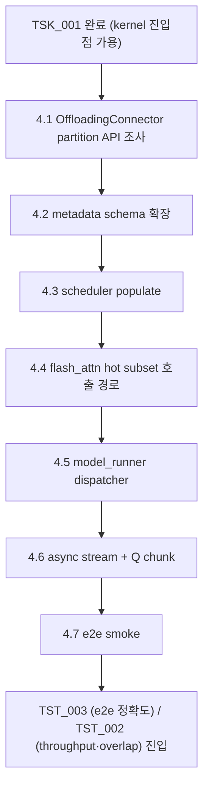

**↑ 부모**: [`PLN_001`](PLN_001.md) · **← 이전 형제**: [`TSK_001`](TSK_001.md) · **↟ 조부**: [`IDE_006`](README.md)

---

# TSK_002 — scheduler / attention metadata 의 hot/cold partition 통합

| 항목 | 값 |
|---|---|
| ID | `TSK_002` |
| 상태 | `활성` (Phase 1 dev — §4.2~§4.5 + §4.6 stream 분리 dev 검증 완료. Phase 2 prod — overlap 효과 정량 측정 진행 중. 회귀 fix 누적: per-seq 필터 / dispatch 캐싱 / device-mismatch / cold-path firing breadcrumb — 자세한 흐름은 [`PLN_001_TSK_002_02_overlap_fix_log.md`](PLN_001_TSK_002_02_overlap_fix_log.md)) |
| 부모 PLN | [`PLN_001`](PLN_001.md) |
| 조부 IDE | [`IDE_006`](README.md) |
| 자매 TSK | [`TSK_001`](TSK_001.md) (선행) |
| 선행 | [`TSK_001`](TSK_001.md) — LSE-반환 CPU partial-attention kernel 진입점 필요 |
| 목적 | OffloadingConnector 가 분류한 hot/cold 분할을 **scheduler 와 attention metadata 에 노출** 하여, GPU flash_attn 은 hot subset 만 처리하고 CPU `TSK_001` kernel 이 cold 블록을 처리하도록 wiring. 두 partial 결과는 `merge_attn_states` 로 합산 |
| 후속 | [`TST_003`](TST_003.md) (e2e 통합 정확도) · [`TST_002`](TST_002.md) (throughput / overlap) · `FEA_###` (통합 기능) |
| ID 넘버링 출처 | [`shadow_assists/id_registry.md`](../../id_registry.md) |

> **단계 주의**: 본 TSK 는 vLLM 의 scheduler / attention metadata / flash_attn 호출부를 **수정** 한다. `vllm/core.py` 는 건드리지 않는다는 CLAUDE.md 원칙은 유지. 변경은 `feat/ide006-cold-kv-cpu-partial-attention` 브랜치에서 진행하되, 활성화는 `--kv-transfer-config` + 옵션 flag 가 모두 충족될 때만 (기본 비활성).

---

## 1. TL;DR

- **무엇을 만드는가**: OffloadingConnector 의 hot/cold partition 정보를 attention metadata 에 노출 → scheduler 가 hot block_table 과 cold block IDs 를 함께 전달 → flash_attn backend 는 hot subset 으로 호출, CPU `forward_partial_with_lse` (TSK_001) 가 cold 처리 → `merge_attn_states` 로 두 partial 합산.
- **decode 우선**: prefill chunked attention 의 hot/cold 합산은 후속 작업으로 분리 (decode-only first).

---

## 2. 사전 조건

- `TSK_001` 완료 — kernel 진입점 (`forward_partial_with_lse`) 사용 가능.
- `PLN_001` §5 owner/layout 계약 결정 — connector view 사용 패턴 (refcount / lease / copy-on-demand) 고정.
- `PLN_001` §4.3 overlap profile 결과 — async stream / Q chunking 정책의 유효 chunk 크기 결정.

---

## 3. 변경 범위 — 4 축

`IDE_006` README §6.2 의 4 축 중 **(1) scheduler / attention metadata 측**, **(2) flash_attn backend 호출부** 가 본 TSK 범위. 나머지 (3) CPU kernel 은 `TSK_001`, (4) OffloadingConnector worker scope lock 은 PLN/TSK 레벨 결정 (코드 변경 거의 없음, 진입 조건 (f) 로 잠금).

### 3.1 · attention metadata 확장

기존 `AttentionMetadata` 에 다음 필드 추가:

| 필드 | 타입 | 의미 |
|---|---|---|
| `hot_block_table` | `Tensor [num_seqs, max_hot_blocks]` | flash_attn 가 읽을 hot KV block ID |
| `cold_block_ids` | `Tensor [num_seqs, max_cold_blocks]` | CPU kernel 이 읽을 cold KV block ID |
| `cold_block_lens` | `Tensor [num_seqs]` | 시퀀스별 유효 cold block 수 |
| `enable_hot_cold_split` | `bool` | 비활성 시 기본 경로 |

`enable_hot_cold_split=False` 가 기본값 → 기존 동작 그대로.

### 3.2 · scheduler 측 populate

> **주의 — 단정 금지**: 본 절의 설계는 §4.1 "OffloadingConnector partition API survey" 결과 **이전에는 확정하지 않는다**. 현재 `vllm/v1/kv_offload/abstract.py:94` 의 `OffloadingManager.lookup` (class 정의는 `:92`, docstring `:99-110`) 은 "**앞에서부터 연속으로 offloaded 된 block 수**" (prefix-only contiguous count) 만 반환하고, `prepare_load()` 가 offloaded block 접근 spec 을 만든다. 즉 **임의의 hot/cold 분할 set 을 즉시 얻는 API 가 보장되지 않는다**. 따라서 가능한 분할 형태가 (a) prefix-suffix 모델 (cold = prefix, hot = suffix) 만 지원, (b) connector worker 내부 상태를 노출하는 신규 hook 필요, (c) scheduler 측에서 별도 추적 자료구조를 두는 것 중 어떤 것이 현실적인지를 §4.1 가 결정한다.

§4.1 결과에 따라 scheduler populate 의 구체 방법이 정해진다 (예: prefix-suffix 만 지원하면 metadata 필드도 단순화 가능).

### 3.3 · flash_attn backend 의 hot subset 호출

`vllm/v1/attention/backends/flash_attn.py:967`, `:1214` 의 prefix/suffix merge 호출 패턴이 이미 부분 attention 호출부를 가지고 있음. 본 TSK 는 다음 추가:

- 입력 block_table 을 `hot_block_table` 로 좁히는 새 호출 경로
- 결과 `(O_hot, LSE_hot)` 을 model_runner 로 노출 (기존 호출은 final output 만 반환)

### 3.4 · model_runner 의 dispatcher

`vllm/v1/worker/model_runner.py` 의 forward 에 다음 분기:

```
if attn_metadata.enable_hot_cold_split:
    O_hot, LSE_hot = flash_attn_forward(query, hot_kv, hot_block_table, return_lse=True)
    O_cold, LSE_cold = cpu_partial_attention(query.cpu(), cold_kv, cold_block_ids, ...)  # async stream
    O_cold_gpu, LSE_cold_gpu = transfer_to_gpu(O_cold, LSE_cold)  # async H2D
    merge_attn_states(output, O_hot, LSE_hot, O_cold_gpu, LSE_cold_gpu)
else:
    # 기존 경로
```

> **ISA dispatch 위임**: 위 `cpu_partial_attention(...)` 호출 내부에서 ISA 분기 (`AMX → AVX-512 → portable → Python reference`) 는 wrapper 가 자동 처리. 본 TSK 는 wrapper 만 호출하고 **ISA 분기 코드를 직접 작성하지 않는다**. dispatch 정책의 단일 출처: [`TSK_001`](TSK_001.md) §4.3.

CUDA stream 분리 + Q chunking 은 PLN_001 §4.3 결과로 결정된 정책에 따름.

---

## 4. 구현 단계

| 단계 | 산출물 | 검증 | 상태 |
|---|---|---|---|
| **4.1 OffloadingConnector partition API survey (선행 게이트)** | `PLN_001_TSK_002_01_partition_api_survey.md` — 현 abstraction (`kv_offload/abstract.py:94` `lookup`, `prepare_load`) 이 어떤 분할 형태를 노출 가능한지 정리. (a) prefix-suffix 모델 / (b) 신규 hook / (c) scheduler-side 추적 자료구조 중 채택 안을 결정. **이 결과가 나오기 전 §4.2 이후 단계는 설계 확정 금지** | survey 문서가 채택 안 + 그 안에서의 metadata schema 형태를 명시 | 완료 |
| 4.2 AttentionMetadata schema 확장 | `vllm/v1/attention/backends/utils.py` 등 | `enable_hot_cold_split=False` 시 기존 동작 무변경 | 완료 |
| 4.3 scheduler populate | `vllm/v1/core/sched/...` | unit test: hot+cold 합집합이 전체 KV 와 일치 | 완료 |
| 4.4 flash_attn hot subset 호출 경로 | `vllm/v1/attention/backends/flash_attn.py` 의 `hot_cold_attention()` | flash_attn return_lse 옵션 동작 | 완료 |
| 4.5 model_runner dispatcher | `vllm/v1/worker/model_runner.py` | e2e smoke (Qwen2.5-7B + 짧은 프롬프트) | 완료 |
| **4.6 async stream / Q chunk pipelining** | dedicated CUDA stream (`_get_cold_path_stream`) + 비동기 D2H/H2D + cold path GPU 영역 stream-wrap. ``VLLM_COLD_KV_DISABLE_OVERLAP`` opt-out env. Q chunk pipelining 은 1차 stream 분리 효과 측정 후 결정 | overlap 측정으로 PLN §4.3 가설 재검증 — prod monitor.csv 의 GPU/CPU util 변화 + bench.json throughput | **dev 검증 완료** (130 passed, 152 skipped) / **prod 측정 진행 중** |
| 4.7 e2e accuracy + smoke | `eval/envs/ide006_cold_kv_split_on_long_ctx.env` + `run_prod_simd_verify.sh` / `run_prod_cold_verify.sh` wrapper 로 cold path 발화 + 정상 종료 확인 | bench.json 의 텍스트 출력이 baseline 과 의미 동치 | **dev pytest 130 passed** / **prod cold_verify @ b3407a3bd9: 50/50 success, cold path 40 회 발화** / D-i / D-ii 풀 비교는 [`TST_003`](TST_003.md) 별도 |
| (정합성 회귀 fix 누적) — §4.4–§4.6 구현 중 발견된 prod 회귀 처리 | per-seq 필터링 (`hot_cold_attention` 의 cold-path 진입 시 cold-block 보유 seq 의 row 만 CPU 로 보냄), dispatch 캐싱 (`select_isa_path` / `cpuinfo` 모듈-level 1 회 캐시), device-mismatch fix (각 텐서의 실제 device 보고 index_select), q_len cap default OFF (escape hatch only), cold-path firing breadcrumb (per-process 첫 5 회만 stderr) | 모두 dev 회귀 테스트로 닫음 (특히 `test_hot_cold_split_mixed_device_inputs` 가 prod topology 그대로 재현). prod simd_verify / cold_verify 회차에서 회귀 없음 확인 | **완료** ([`PLN_001_TSK_002_02_overlap_fix_log.md`](PLN_001_TSK_002_02_overlap_fix_log.md) 에 흐름 기록) |

---

## 5. 변경 파일 (예상)

| 파일 | 변경 |
|---|---|
| `vllm/v1/attention/backends/utils.py` 또는 metadata 정의 모듈 | `hot_block_table`, `cold_block_ids`, `cold_block_lens`, `enable_hot_cold_split` 필드 추가 |
| `vllm/v1/attention/backends/flash_attn.py` | hot subset 호출 경로 + `return_lse` 옵션 분기 |
| `vllm/v1/core/sched/scheduler.py` | OffloadingConnector partition → metadata populate (실제 경로 grep 으로 확인됨) |
| `vllm/v1/worker/model_runner.py` | dispatcher 분기 + async stream 관리 |
| `vllm/v1/attention/ops/cpu_partial_attention.py` (TSK_001 산출물) | 본 TSK 가 호출 |

`vllm/core.py` · `vllm/v1/engine/*` 는 무수정.

---

## 6. 검증

### 6.1 단독 (TSK 단위)

- e2e smoke: `eval/envs/ide006_cold_kv.env` 기반 + `enable_hot_cold_split=True` 활성. 첫 step 이 정상 진행 (crash 없음).
- attention metadata snapshot: hot + cold block 합집합 == 전체 KV (분할 정확성).

### 6.2 통합 (TST 단위)

- [`TST_003`](TST_003.md) (e2e 통합 정확도): `eval/run.sh envs/ide006_cold_kv.env` (split on) 의 출력이 `eval/run.sh envs/vllm_original.env` (split off) 의 출력과 PLN §4.1 tolerance 내 일치 (D-i token divergence + D-ii logprob/PPL diff). 본 TSK 의 핵심 통합 검증.
- [`TST_002`](TST_002.md) (throughput / overlap): split on/off 의 throughput 차이가 PLN §4.2 net-win 영역 안에 있고, overlap 부등식 (PLN §4.3) 충족.
- [`TST_001`](TST_001.md) (kernel 정확도) 는 TSK_001 단독 검증 — 본 TSK 와 분리.

---

## 7. 의존성·일정



---

## 8. Open Questions

1. **OffloadingConnector partition extraction**: 외부에 노출된 함수가 있는지, 아니면 connector worker 내부 상태를 새 hook 으로 빼야 하는지 — `PLN_001_TSK_002_01_partition_api_survey.md` 에서 결정 (§4.1 산출물).
2. **flash_attn 의 return_lse**: 기존 path 들이 LSE 를 반환하는지, 아니면 별도 옵션 추가 필요한지 — `:967`, `:1214` 호출부의 시그니처 확인.
3. **dispatcher 위치**: `model_runner.py` 의 어느 hook 이 attention forward 직전인지 — vLLM v1 의 layered structure 조사.
4. **async stream owner**: model_runner 가 stream 을 보유할지, attention backend 가 보유할지. 다른 async 경로 (KV prefetch 등) 와의 충돌 방지.
5. **prefill 처리**: 본 TSK 는 decode 우선. prefill 의 hot/cold 분할은 의미가 다름 (대부분 fresh KV) — 후속 TSK 로 분리할지 보류 결정.

---

## 9. References

### 부모·연계 문서

- 부모 PLN: [`PLN_001`](PLN_001.md)
- 조부 IDE 상세: [`IDE_006`](README.md)
- 선행 TSK: [`TSK_001`](TSK_001.md)
- ID 넘버링 출처: [`shadow_assists/id_registry.md`](../../id_registry.md)

### 코드 인용

- `vllm/v1/attention/backends/flash_attn.py:967`, `:1214` — 기존 LSE merge 호출 패턴 (재사용 대상)
- `vllm/v1/attention/ops/merge_attn_states.py` — Python wrapper. 본 TSK 가 그대로 호출
- `vllm/v1/kv_offload/worker/cpu_gpu.py:138-139` — 단일 KV group assert (initial scope lock)
- `vllm/distributed/kv_transfer/kv_connector/v1/offloading_connector.py` — partition 정보의 출처

---

## 10. Change Log

| 날짜 | 변경 | 사유 |
|---|---|---|
| 2026-04-25 | TSK_002 초안 | TSK_001 의 kernel 진입점을 vLLM 모델 forward path 에 wiring 하기 위해 scheduler / attention metadata / flash_attn backend / model_runner 의 4 곳을 수정. decode-first. 활성화 flag (`enable_hot_cold_split`) 비활성 시 기존 동작 무변경. |
| 2026-04-25 | 디렉토리 평탄화 | 별도 디렉토리 (`PLN_001/TSK_002/`) 제거, `IDE_006/TSK_002.md` 단일 파일로 이동. 부모/조부/sibling 네비게이션을 최상단·최하단에 추가. |
| 2026-04-25 | 정합성 보정 (issue 4) | OffloadingConnector partition 획득의 단정적 표현 제거. `kv_offload/abstract.py:92` `lookup()` 이 **prefix-only contiguous offloaded block count** 만 반환하는 사실 명시 (`abstract.py:92` 직접 인용). §3.2 에 "단정 금지" 주의 박스 + §4.1 partition API survey 를 **선행 게이트** 로 격상 (이 결과 전 §4.2~ 후속 단계 설계 확정 금지). 분할 형태 후보 (prefix-suffix 모델 / 신규 hook / scheduler-side 추적) 명시. |
| 2026-04-25 | 자체 검증 잔여 보정 | §5 변경 파일 표의 `vllm/v1/core/sched/scheduler.py` 옆 hedge 표현 "(또는 v1 sched 위치)" 제거. `find` 결과 해당 경로가 **실제 존재** 함을 확인했으므로 hedge 불필요. |
| 2026-04-25 | 산출물 명명 통일 | §8 Open Questions 의 산출물 인용을 `04_partition_api_survey.md` (PLN-deliverable namespace 와 충돌하는 stale 표기) → `PLN_001_TSK_002_01_partition_api_survey.md` (§4.1 산출물 명, TSK_001 의 `PLN_001_TSK_001_NN_*` 패턴과 일관) 으로 통일. |
| 2026-04-25 | 정밀화 (P1·P3) | (P1) `vllm/v1/kv_offload/abstract.py:92` 인용 (§3.2 단정 금지 박스, §4.1) 을 `:94` (실제 `def lookup` 시작) 로 정정. class 정의 `:92` / docstring `:99-110` 부연 명시. (P3) §3.4 dispatcher pseudocode 직후에 "**ISA dispatch 위임**" 주석 박스 추가 — `cpu_partial_attention(...)` 내부의 ISA 분기 (AMX → AVX-512 → portable → Python reference) 는 wrapper (TSK_001 §4.3) 가 자동 처리하며 본 TSK 가 ISA 분기 코드를 직접 작성하지 않는다는 점을 명시. |
| 2026-04-25 | TST_001 / TST_002 link 갱신 | meta header 후속, §6.2 통합 검증, §7 Mermaid 종단 노드의 TST 인용을 적재된 [`TST_001`](TST_001.md) / [`TST_002`](TST_002.md) 링크 + 단계 설명으로 정합. |
| 2026-04-27 | 상태 `대기` → `활성`, §4 단계 표 진행 상태 컬럼 추가 | TSK_001 완료 후 본 TSK 가 활성화되어 §4.2~§4.5 + §4.6 의 stream 분리 dev 검증까지 끝남. prod 측정 진행 중. 회귀 fix 누적 (per-seq 필터링 / dispatch 캐싱 / device-mismatch / cold-path firing breadcrumb / q_len cap default OFF) 은 별도 노트 [`PLN_001_TSK_002_02_overlap_fix_log.md`](PLN_001_TSK_002_02_overlap_fix_log.md) 로 분리. |

---

**↑ 부모**: [`PLN_001`](PLN_001.md) · **← 이전 형제**: [`TSK_001`](TSK_001.md) · **↟ 조부**: [`IDE_006`](README.md)
