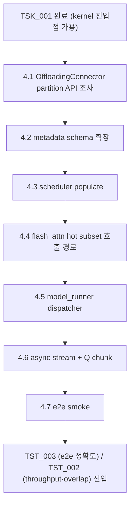

**↑ 부모**: [`PLN_001`](PLN_001.md) · **← 이전 형제**: [`TSK_001`](TSK_001.md) · **↟ 조부**: [`IDE_006`](README.md)

---

# TSK_002 — scheduler / attention metadata 의 hot/cold partition 통합

| 항목 | 값 |
|---|---|
| ID | `TSK_002` |
| 상태 | `활성` (Phase 1 dev — §4.2~§4.5 + §4.6 stream 분리 dev 검증 완료. Phase 2 prod — overlap 효과 정량 측정 진행 중. 회귀 fix 누적: per-seq 필터 / dispatch 캐싱 / device-mismatch / cold-path firing breadcrumb — 자세한 흐름은 [`PLN_001_TSK_002_02_overlap_fix_log.md`](PLN_001_TSK_002_02_overlap_fix_log.md)) |
| 부모 PLN | [`PLN_001`](PLN_001.md) |
| 조부 IDE | [`IDE_006`](README.md) |
| 자매 TSK | [`TSK_001`](TSK_001.md) (선행) |
| 선행 | [`TSK_001`](TSK_001.md) — LSE-반환 CPU partial-attention kernel 진입점 필요 |
| 목적 | OffloadingConnector 가 분류한 hot/cold 분할을 **scheduler 와 attention metadata 에 노출** 하여, GPU flash_attn 은 hot subset 만 처리하고 CPU `TSK_001` kernel 이 cold 블록을 처리하도록 wiring. 두 partial 결과는 `merge_attn_states` 로 합산 |
| 후속 | [`TST_003`](TST_003.md) (e2e 통합 정확도) · [`TST_002`](TST_002.md) (throughput / overlap) · `FEA_###` (통합 기능) |
| ID 넘버링 출처 | [`shadow_assists/id_registry.md`](../../id_registry.md) |

> **단계 주의**: 본 TSK 는 vLLM 의 scheduler / attention metadata / flash_attn 호출부를 **수정** 한다. `vllm/core.py` 는 건드리지 않는다는 CLAUDE.md 원칙은 유지. 변경은 `feat/ide006-cold-kv-cpu-partial-attention` 브랜치에서 진행하되, 활성화는 `--kv-transfer-config` + 옵션 flag 가 모두 충족될 때만 (기본 비활성).

---

## 1. TL;DR

- **무엇을 만드는가**: OffloadingConnector 의 hot/cold partition 정보를 attention metadata 에 노출 → scheduler 가 hot block_table 과 cold block IDs 를 함께 전달 → flash_attn backend 는 hot subset 으로 호출, CPU `forward_partial_with_lse` (TSK_001) 가 cold 처리 → `merge_attn_states` 로 두 partial 합산.
- **decode 우선**: prefill chunked attention 의 hot/cold 합산은 후속 작업으로 분리 (decode-only first).

---

## 2. 사전 조건

- `TSK_001` 완료 — kernel 진입점 (`forward_partial_with_lse`) 사용 가능.
- `PLN_001` §5 owner/layout 계약 결정 — connector view 사용 패턴 (refcount / lease / copy-on-demand) 고정.
- `PLN_001` §4.3 overlap profile 결과 — async stream / Q chunking 정책의 유효 chunk 크기 결정.

---

## 3. 변경 범위 — 4 축

`IDE_006` README §6.2 의 4 축 중 **(1) scheduler / attention metadata 측**, **(2) flash_attn backend 호출부** 가 본 TSK 범위. 나머지 (3) CPU kernel 은 `TSK_001`, (4) OffloadingConnector worker scope lock 은 PLN/TSK 레벨 결정 (코드 변경 거의 없음, 진입 조건 (f) 로 잠금).

### 3.1 · attention metadata 확장

기존 `AttentionMetadata` 에 다음 필드 추가:

| 필드 | 타입 | 의미 |
|---|---|---|
| `hot_block_table` | `Tensor [num_seqs, max_hot_blocks]` | flash_attn 가 읽을 hot KV block ID |
| `cold_block_ids` | `Tensor [num_seqs, max_cold_blocks]` | CPU kernel 이 읽을 cold KV block ID |
| `cold_block_lens` | `Tensor [num_seqs]` | 시퀀스별 유효 cold block 수 |
| `enable_hot_cold_split` | `bool` | 비활성 시 기본 경로 |

`enable_hot_cold_split=False` 가 기본값 → 기존 동작 그대로.

### 3.2 · scheduler 측 populate

> **주의 — 단정 금지**: 본 절의 설계는 §4.1 "OffloadingConnector partition API survey" 결과 **이전에는 확정하지 않는다**. 현재 `vllm/v1/kv_offload/abstract.py:94` 의 `OffloadingManager.lookup` (class 정의는 `:92`, docstring `:99-110`) 은 "**앞에서부터 연속으로 offloaded 된 block 수**" (prefix-only contiguous count) 만 반환하고, `prepare_load()` 가 offloaded block 접근 spec 을 만든다. 즉 **임의의 hot/cold 분할 set 을 즉시 얻는 API 가 보장되지 않는다**. 따라서 가능한 분할 형태가 (a) prefix-suffix 모델 (cold = prefix, hot = suffix) 만 지원, (b) connector worker 내부 상태를 노출하는 신규 hook 필요, (c) scheduler 측에서 별도 추적 자료구조를 두는 것 중 어떤 것이 현실적인지를 §4.1 가 결정한다.

§4.1 결과에 따라 scheduler populate 의 구체 방법이 정해진다 (예: prefix-suffix 만 지원하면 metadata 필드도 단순화 가능).

### 3.3 · flash_attn backend 의 hot subset 호출

`vllm/v1/attention/backends/flash_attn.py:967`, `:1214` 의 prefix/suffix merge 호출 패턴이 이미 부분 attention 호출부를 가지고 있음. 본 TSK 는 다음 추가:

- 입력 block_table 을 `hot_block_table` 로 좁히는 새 호출 경로
- 결과 `(O_hot, LSE_hot)` 을 model_runner 로 노출 (기존 호출은 final output 만 반환)

### 3.4 · model_runner 의 dispatcher

`vllm/v1/worker/model_runner.py` 의 forward 에 다음 분기:

```
if attn_metadata.enable_hot_cold_split:
    O_hot, LSE_hot = flash_attn_forward(query, hot_kv, hot_block_table, return_lse=True)
    O_cold, LSE_cold = cpu_partial_attention(query.cpu(), cold_kv, cold_block_ids, ...)  # async stream
    O_cold_gpu, LSE_cold_gpu = transfer_to_gpu(O_cold, LSE_cold)  # async H2D
    merge_attn_states(output, O_hot, LSE_hot, O_cold_gpu, LSE_cold_gpu)
else:
    # 기존 경로
```

> **ISA dispatch 위임**: 위 `cpu_partial_attention(...)` 호출 내부에서 ISA 분기 (`AMX → AVX-512 → portable → Python reference`) 는 wrapper 가 자동 처리. 본 TSK 는 wrapper 만 호출하고 **ISA 분기 코드를 직접 작성하지 않는다**. dispatch 정책의 단일 출처: [`TSK_001`](TSK_001.md) §4.3.

CUDA stream 분리 + Q chunking 은 PLN_001 §4.3 결과로 결정된 정책에 따름.

> **decode-only 제약 + reload-fallback (2026-04-27 정책 전환)**: cold path 는 `q_len == 1` (pure decode) row 만 허용한다. prefill chunk 가 cold block 을 보유하면 cold-side 비용이 `chunk_size × cold_kv_len` 곱으로 누적되어 prod heavy workload 가 사실상 정지한다.
>
> 1차 정책 (§4.5b, 본 commit) — `hot_cold_attention` 시작부 fail-closed `RuntimeError`. 코드 진입 자체를 차단하는 정확한 방어선이지만 prefill+cold workload 자체를 *처리 불가능* 하게 만든다.
>
> 2차 정책 (§4.5c, follow-up land) — reload-fallback. **prefill 영역의 cold blocks 는 vLLM 의 native reload mechanism (`update_state_after_alloc()` @ `scheduler.py:247-292`) 이 prefill admission 시점에 GPU 로 가져와서** standard hot FA 가 처리. 본 IDE 는 prefill 을 처리하지 않음 (README §3.4 표 — prefill-assist 는 IDE_002, §9 (f) decode-first scope lock 과 정합). **§4.5b 의 fail-closed 는 진정한 방어선** 으로 격하 — §4.5c mask 가 누락되거나 새 routing path 가 추가될 때만 발동.

---

## 4. 구현 단계

| 단계 | 산출물 | 검증 | 상태 |
|---|---|---|---|
| **4.1 OffloadingConnector partition API survey (선행 게이트)** | `PLN_001_TSK_002_01_partition_api_survey.md` — 현 abstraction (`kv_offload/abstract.py:94` `lookup`, `prepare_load`) 이 어떤 분할 형태를 노출 가능한지 정리. (a) prefix-suffix 모델 / (b) 신규 hook / (c) scheduler-side 추적 자료구조 중 채택 안을 결정. **이 결과가 나오기 전 §4.2 이후 단계는 설계 확정 금지** | survey 문서가 채택 안 + 그 안에서의 metadata schema 형태를 명시 | 완료 |
| 4.2 AttentionMetadata schema 확장 | `vllm/v1/attention/backends/utils.py` 등 | `enable_hot_cold_split=False` 시 기존 동작 무변경 | 완료 |
| 4.3 scheduler populate | `vllm/v1/core/sched/...` | unit test: hot+cold 합집합이 전체 KV 와 일치 | 완료 |
| 4.4 flash_attn hot subset 호출 경로 | `vllm/v1/attention/backends/flash_attn.py` 의 `hot_cold_attention()` | flash_attn return_lse 옵션 동작 | 완료 |
| 4.5 model_runner dispatcher | `vllm/v1/worker/model_runner.py` | e2e smoke (Qwen2.5-7B + 짧은 프롬프트) | 완료 |
| **4.5b decode-only gate (fail-closed, fail-fast)** | `hot_cold_attention` 시작부 (hot FA 호출 *전*) 에서 `max_num_cold_blocks > 0` 이면 metadata D2H (cu_query_lens / num_cold_blocks 의 O(num_seqs) ≤ 1 KB) 후 `q_len > 1 + cold-bearing` seq 검출 시 ``RuntimeError`` raise. hot FA 가 호출되기 전에 raise 하므로 heavy prefill 도 fail-fast (이전 회귀: hot FA 후 raise → 수십 ms 낭비). hot-only silent fallback 금지 (correctness violation). 회귀 테스트: `test_hot_cold_split_prefill_with_cold_fails_closed`, `test_hot_cold_split_decode_only_gate_matrix` (5 parametrized), `test_decode_only_gate_fires_before_hot_fa_launch` (FA call count == 0 검증). **§4.5c land 후 본 gate 는 *defensive guard* 로 격하** — 정상 흐름에서는 발동하지 않고, mask 누락 / 새 routing path 추가 등 *bug* 시에만 발동 | dev pytest 통과 — fail-fast contract 가드됨 | 완료 |
| **4.5c reload-fallback (정책 전환 — 2026-04-27 사용자 결정)** | §4.5b 의 fail-closed 를 reload-fallback 으로 전환하여 prefill+cold workload 가 진행 가능하게 만든다. **두 단계 알고리즘**: (1) routing — `vllm/v1/worker/gpu_model_runner.py` 의 `_mask_prefill_cold_blocks()` module-level helper 가 `num_cold_blocks_np` 만든 직후 host-side 에서 `q_len > 1` 인 seq 의 entry 를 0 으로 mask. IDE_006 cold path 는 prefill seq 에 firing 안 함, mixed batch 의 decode seq 는 firing 보존. (2) **reload completion sync** — `vllm/v1/kv_offload/worker/cpu_gpu.py:transfer_async` 끝부분에서 load 인 경우 (`not self.gpu_to_cpu`) `torch.cuda.current_stream().wait_event(end_event)` 한 줄 추가. transfer 가 별도 stream 에서 진행되는 동안 default stream 의 forward kernel 이 그 transfer 끝까지 wait — vLLM 의 `wait_for_layer_load(...)` 가 `pass` no-op (`offloading_connector.py:118-119`) 인 race 를 명시적으로 닫음. store 일 때는 emit 안 함 (kernel 이 CPU dest 를 read 안 하므로 sync 불필요). **prefill seq 의 cold blocks 는 vLLM `update_state_after_alloc()` 의 native reload 가 transfer_async 로 spec 화 → 본 sync 로 default stream 이 transfer 완료를 wait → standard hot FA 가 정확한 cold KV 를 read** (README §3.4 prefill-assist=IDE_002 + §9 (f) decode-first scope lock 정합, §5.1 GPU/CPU overlap throughput 가치 보존). | 회귀 테스트 — (a) helper 단위 8 cases (`test_prefill_cold_mask.py`). (b) routing 통합 3 cases (`test_mixed_prefill_decode_routing.py`): mixed batch / all-prefill / §4.5b defensive guard. (c) **sync 검증 4 cases** (`tests/v1/kv_offload/test_reload_sync.py`): load 시 wait_event emit 단위, store 시 emit 안 함 (비대칭 contract), slow load + default stream read 가 transfer 후 값 read (positive race-evoke), wait_event no-op simulation 시 race deterministic 발생 (negative — fix 의 contribution 입증). dev pytest 누계 **195 passed, 153 skipped** (helper +8, routing +3, sync +4) | **완료** |
| **4.6 cold-path GPU/CPU overlap (sync issue + stream 분리 + scatter buf race fix)** | (1) dedicated CUDA stream (`_get_cold_path_stream`) + 비동기 D2H/H2D + cold-path GPU 작업을 cold_stream 위에서 hot FA 와 overlap. ``VLLM_COLD_KV_DISABLE_OVERLAP`` opt-out env. (2) **scatter buffer 재사용** (`_COLD_SCATTER_BUFS`, key=`(dev_idx, num_q_heads, head_dim, output_dtype, lse_dtype)`) — 매 layer call 의 32 MB zero/full 제거. (3) **cross-call buffer race fix** (2026-04-27): cache entry 에 `last_merge_event` 슬롯 추가, merge 직후 default-stream 에 record + 다음 호출의 cold-stream write 직전 `wait_event`. legacy default stream 의 implicit sync 에 의존하지 않음. (4) **prewarm hook** (`OffloadingConnector` worker init 직후 `cpu_partial_attention.prewarm()` 호출로 첫 호출 ~1 s warmup 회피). (5) **CPU 호출은 sync — async submit 제거** (2026-04-27 b-revert): 이전 `forward_partial_with_lse_async` + `_ASYNC_EXECUTOR` 는 같은 함수 내에서 곧바로 `result()` 로 await 했으므로 cross-layer overlap 이 없는 dead code. 같은-layer hot FA / cold CPU overlap 은 GPU kernel async launch 로 이미 가능. NEO-style cross-layer pipeline 은 model_runner.forward 의 layer-async refactor 가 선행되어야 — 본 TSK 범위 밖 | overlap 측정으로 PLN §4.3 가설 재검증 — prod monitor.csv 의 GPU/CPU util + bench.json throughput. race fix white-box: `test_after_first_call_records_merge_event` (cache entry 의 4번째 슬롯이 `torch.cuda.Event`). race evoke 회귀: `test_two_consecutive_hot_cold_calls_no_sync_in_between` (non-default stream + slow_merge monkeypatch — dev legacy default stream 환경에서는 reliably evoke 안 되지만 prod / per-thread default 에서 즉시 노출) | **dev 검증 완료** (180 passed, 153 skipped — async revert 로 -7, fail-fast +1, race fix +2, scatter buf event +2) / **prod 측정 진행 중** |
| 4.7 e2e accuracy + smoke | `eval/envs/ide006_cold_kv_split_on_long_ctx.env` + `run_prod_simd_verify.sh` / `run_prod_cold_verify.sh` wrapper 로 cold path 발화 + 정상 종료 확인 | bench.json 의 텍스트 출력이 baseline 과 의미 동치 | **dev pytest 130 passed** / **prod cold_verify @ b3407a3bd9: 50/50 success, cold path 40 회 발화** / D-i / D-ii 풀 비교는 [`TST_003`](TST_003.md) 별도 |
| (정합성 회귀 fix 누적) — §4.4–§4.6 구현 중 발견된 prod 회귀 처리 | per-seq 필터링 (`hot_cold_attention` 의 cold-path 진입 시 cold-block 보유 seq 의 row 만 CPU 로 보냄), dispatch 캐싱 (`select_isa_path` / `cpuinfo` 모듈-level 1 회 캐시), device-mismatch fix (각 텐서의 실제 device 보고 index_select), q_len cap default OFF (escape hatch only), cold-path firing breadcrumb (per-process 첫 5 회만 stderr) | 모두 dev 회귀 테스트로 닫음 (특히 `test_hot_cold_split_mixed_device_inputs` 가 prod topology 그대로 재현). prod simd_verify / cold_verify 회차에서 회귀 없음 확인 | **완료** ([`PLN_001_TSK_002_02_overlap_fix_log.md`](PLN_001_TSK_002_02_overlap_fix_log.md) 에 흐름 기록) |

### §4.5c land 위치 — 옵션 비교 + X4 선택 근거

| 옵션 | 위치 | 동작 | 평가 |
|---|---|---|---|
| X1 | `hot_cold_attention` 시작부 (§4.5b gate 자리) | prefill+cold seq 발견 시 batch 전체를 hot FA only 로 force | **batch 단위 routing** — 같은 batch 의 decode seq 도 IDE_006 path 잃음. mixed batch throughput 손해 |
| X2 | scheduler `build_connector_meta()` (`scheduler.py:945-959`, `PLN_001_TSK_002_01` Decision 5 위치) | scheduler 가 chunked-prefill 식별 후 prefill seq 의 `num_cold_blocks=0` populate | host-side 결정 통일적. 그러나 chunked-prefill 식별 로직을 그 자리에 추가해야 — Decision 5 의 *populate point* 책임 외 작업 |
| X3 | `model_runner.py` dispatcher 의 `enable_hot_cold_split` 분기 직전 | batch 를 prefill/decode 서브배치로 split → 각각 standard FA / `hot_cold_attention` | model_runner.forward 의 큰 refactor + Decision 3 ("flash_attn 측 cascade variant") 의 layering 어긋남 |
| **X4 ✓** | worker `FlashAttentionMetadataBuilder.build()` 끝부분 | `cu_query_lens` × `num_cold_blocks` join 으로 `q_len > 1` seq 의 `num_cold_blocks` 를 0 mask | seq 별 routing — mixed batch decode seq IDE_006 path 보존. Decision 5 의 *worker 측 최종 packing* 자리 직접 정합. 변경 범위 한 함수 끝부분. multi-worker 동기화 자동 |

**X4 선택 근거**

1. **문서 정합** — `PLN_001_TSK_002_01` Decision 5 가 "metadata 자체는 worker 측 `FlashAttentionMetadataBuilder.build()` 가 *최종 packing*" 을 명시. mask 한 줄 추가가 본문 그대로의 흐름.
2. **데이터 가용성** — `q_len > 1 + num_cold_blocks > 0` 의 join 을 위해 `cu_query_lens` 와 `num_cold_blocks` 가 *동시 존재하는 유일한 위치* 가 worker 측 metadata builder 끝부분.
3. **변경 범위** — 한 함수 끝부분에 join + mask 한 블록. `hot_cold_attention` 의 `max_num_cold_blocks==0` fast path 가 그 결과를 자연 처리.
4. **회귀 위험 최소** — `num_cold_blocks` 한 필드만 mask, 부수 효과 없음. scheduler 단계 변경 없음.
5. **Multi-worker 동기화** — TP 의 모든 worker 가 같은 입력 metadata 를 받으므로 join 결과 자동 동일.

**§4.5b 와의 layering** — X4 land 후 정상 흐름에서 prefill+cold seq 의 `num_cold_blocks` 가 항상 0 으로 mask 되므로 §4.5b 의 RuntimeError 는 발동하지 않는 게 정상. mask 누락 / 새 routing path 추가 등 *코드 bug* 시에만 발동하는 *defensive guard* 로 의미가 격하됨. 두 정책은 layering 으로 공존.

---

## 5. 변경 파일 (예상)

| 파일 | 변경 |
|---|---|
| `vllm/v1/attention/backends/utils.py` 또는 metadata 정의 모듈 | `hot_block_table`, `cold_block_ids`, `cold_block_lens`, `enable_hot_cold_split` 필드 추가 |
| `vllm/v1/attention/backends/flash_attn.py` | hot subset 호출 경로 + `return_lse` 옵션 분기 |
| `FlashAttentionMetadataBuilder.build()` (위 metadata 모듈 안) | **§4.5c 신규** — `cu_query_lens` × `num_cold_blocks` join 으로 `q_len > 1` seq 의 `num_cold_blocks` 를 0 mask. prefill seq 의 IDE_006 cold path 진입을 차단하고 vLLM native reload 경로로 routing |
| `vllm/v1/core/sched/scheduler.py` | OffloadingConnector partition → metadata populate (실제 경로 grep 으로 확인됨) |
| `vllm/v1/worker/model_runner.py` | dispatcher 분기 + async stream 관리 |
| `vllm/v1/attention/ops/cpu_partial_attention.py` (TSK_001 산출물) | 본 TSK 가 호출 |

`vllm/core.py` · `vllm/v1/engine/*` 는 무수정.

---

## 6. 검증

### 6.1 단독 (TSK 단위)

- e2e smoke: `eval/envs/ide006_cold_kv.env` 기반 + `enable_hot_cold_split=True` 활성. 첫 step 이 정상 진행 (crash 없음).
- attention metadata snapshot: hot + cold block 합집합 == 전체 KV (분할 정확성).
- **fail-closed 회귀** (§4.5b): `tests/v1/cpu_partial_attention/test_hot_cold_attention_phase3b.py`
    - `test_hot_cold_split_prefill_with_cold_fails_closed` — prefill chunk + cold-bearing seq 가 들어오면 RuntimeError
    - `test_hot_cold_split_decode_only_gate_matrix` (5 cases) — q_len ∈ {2, 3, 8, 16}, cold ratio 다양화에서 모두 fail-closed
    - `test_hot_cold_split_decode_only_gate_fires_in_sync_path` — async opt-out (`VLLM_PARTIAL_ATTN_DISABLE_ASYNC=1`) 환경에서도 동일 raise
- **async equivalence** (§4.6): `test_hot_cold_split_async_matches_sync` — `_ASYNC_EXECUTOR` 경로의 출력이 sync 경로와 비트 동일
- **§4.6 보조 메커니즘 단위 회귀** (회귀 root cause 가 silent 로 재발 방지):
    - `tests/v1/cpu_partial_attention/test_cold_scatter_buf_cache.py` (12 cases) — `_COLD_SCATTER_BUFS` cache key 5 차원 분리 / no-shrink / dirty_idx 기록 / grow 시 reset / multi-config coexistence. cuda:0 vs cuda:1 분리는 multi-GPU 전용 skipif
    - `tests/v1/cpu_partial_attention/test_async_executor.py` (5 cases) — sync fallback (env opt-out) 의 done future / kernel exception 의 future propagation / executor lazy + reuse / async 가 worker thread, sync 가 main thread 에서 실행
    - `tests/v1/cpu_partial_attention/test_prewarm.py` (6 cases) — idempotency / `_NUMA_PIN_DONE` 세팅 / `select_isa_path` 트리거 / AMX hw 미가용 (i9-12900KF) 시 `_ensure_amx_permission_once` skip / AMX kernel 가용 시 prctl 1 회 호출 / 이미 pin done 이면 NUMA 호출 skip
    - `tests/v1/kv_offload/test_numa_aware.py` (21 cases) — TSK_004 산출물. `_partition_node_cpus_for_rank` 의 TP=1 / TP=2 / TP=4 single-node / TP=8 dual-socket 56 cores / uneven remainder / oversubscription / empty cpus / rank-not-on-node guard. `_resolve_local_numa_node` 의 GPU NUMA → round-robin → None 우선순위. `bind_worker_to_local_numa` / `pin_threads_to_local_numa` idempotency + libnuma 미설치 silent + OSError silent + 다중 rank same-node partition

### 6.2 통합 (TST 단위)

- [`TST_003`](TST_003.md) (e2e 통합 정확도): `eval/run.sh envs/ide006_cold_kv.env` (split on) 의 출력이 `eval/run.sh envs/vllm_original.env` (split off) 의 출력과 PLN §4.1 tolerance 내 일치 (D-i token divergence + D-ii logprob/PPL diff). 본 TSK 의 핵심 통합 검증.
- [`TST_002`](TST_002.md) (throughput / overlap): split on/off 의 throughput 차이가 PLN §4.2 net-win 영역 안에 있고, overlap 부등식 (PLN §4.3) 충족.
- [`TST_001`](TST_001.md) (kernel 정확도) 는 TSK_001 단독 검증 — 본 TSK 와 분리.

---

## 7. 의존성·일정



---

## 8. Open Questions

1. **OffloadingConnector partition extraction**: 외부에 노출된 함수가 있는지, 아니면 connector worker 내부 상태를 새 hook 으로 빼야 하는지 — `PLN_001_TSK_002_01_partition_api_survey.md` 에서 결정 (§4.1 산출물).
2. **flash_attn 의 return_lse**: 기존 path 들이 LSE 를 반환하는지, 아니면 별도 옵션 추가 필요한지 — `:967`, `:1214` 호출부의 시그니처 확인.
3. **dispatcher 위치**: `model_runner.py` 의 어느 hook 이 attention forward 직전인지 — vLLM v1 의 layered structure 조사.
4. **async stream owner**: model_runner 가 stream 을 보유할지, attention backend 가 보유할지. 다른 async 경로 (KV prefetch 등) 와의 충돌 방지.
5. **prefill 처리**: 본 TSK 는 decode 우선. prefill 의 hot/cold 분할은 의미가 다름 (대부분 fresh KV) — 후속 TSK 로 분리할지 보류 결정.

---

## 9. References

### 부모·연계 문서

- 부모 PLN: [`PLN_001`](PLN_001.md)
- 조부 IDE 상세: [`IDE_006`](README.md)
- 선행 TSK: [`TSK_001`](TSK_001.md)
- ID 넘버링 출처: [`shadow_assists/id_registry.md`](../../id_registry.md)

### 코드 인용

- `vllm/v1/attention/backends/flash_attn.py:967`, `:1214` — 기존 LSE merge 호출 패턴 (재사용 대상)
- `vllm/v1/attention/ops/merge_attn_states.py` — Python wrapper. 본 TSK 가 그대로 호출
- `vllm/v1/kv_offload/worker/cpu_gpu.py:138-139` — 단일 KV group assert (initial scope lock)
- `vllm/distributed/kv_transfer/kv_connector/v1/offloading_connector.py` — partition 정보의 출처

---

## 10. Change Log

| 날짜 | 변경 | 사유 |
|---|---|---|
| 2026-04-25 | TSK_002 초안 | TSK_001 의 kernel 진입점을 vLLM 모델 forward path 에 wiring 하기 위해 scheduler / attention metadata / flash_attn backend / model_runner 의 4 곳을 수정. decode-first. 활성화 flag (`enable_hot_cold_split`) 비활성 시 기존 동작 무변경. |
| 2026-04-25 | 디렉토리 평탄화 | 별도 디렉토리 (`PLN_001/TSK_002/`) 제거, `IDE_006/TSK_002.md` 단일 파일로 이동. 부모/조부/sibling 네비게이션을 최상단·최하단에 추가. |
| 2026-04-25 | 정합성 보정 (issue 4) | OffloadingConnector partition 획득의 단정적 표현 제거. `kv_offload/abstract.py:92` `lookup()` 이 **prefix-only contiguous offloaded block count** 만 반환하는 사실 명시 (`abstract.py:92` 직접 인용). §3.2 에 "단정 금지" 주의 박스 + §4.1 partition API survey 를 **선행 게이트** 로 격상 (이 결과 전 §4.2~ 후속 단계 설계 확정 금지). 분할 형태 후보 (prefix-suffix 모델 / 신규 hook / scheduler-side 추적) 명시. |
| 2026-04-25 | 자체 검증 잔여 보정 | §5 변경 파일 표의 `vllm/v1/core/sched/scheduler.py` 옆 hedge 표현 "(또는 v1 sched 위치)" 제거. `find` 결과 해당 경로가 **실제 존재** 함을 확인했으므로 hedge 불필요. |
| 2026-04-25 | 산출물 명명 통일 | §8 Open Questions 의 산출물 인용을 `04_partition_api_survey.md` (PLN-deliverable namespace 와 충돌하는 stale 표기) → `PLN_001_TSK_002_01_partition_api_survey.md` (§4.1 산출물 명, TSK_001 의 `PLN_001_TSK_001_NN_*` 패턴과 일관) 으로 통일. |
| 2026-04-25 | 정밀화 (P1·P3) | (P1) `vllm/v1/kv_offload/abstract.py:92` 인용 (§3.2 단정 금지 박스, §4.1) 을 `:94` (실제 `def lookup` 시작) 로 정정. class 정의 `:92` / docstring `:99-110` 부연 명시. (P3) §3.4 dispatcher pseudocode 직후에 "**ISA dispatch 위임**" 주석 박스 추가 — `cpu_partial_attention(...)` 내부의 ISA 분기 (AMX → AVX-512 → portable → Python reference) 는 wrapper (TSK_001 §4.3) 가 자동 처리하며 본 TSK 가 ISA 분기 코드를 직접 작성하지 않는다는 점을 명시. |
| 2026-04-25 | TST_001 / TST_002 link 갱신 | meta header 후속, §6.2 통합 검증, §7 Mermaid 종단 노드의 TST 인용을 적재된 [`TST_001`](TST_001.md) / [`TST_002`](TST_002.md) 링크 + 단계 설명으로 정합. |
| 2026-04-27 | 상태 `대기` → `활성`, §4 단계 표 진행 상태 컬럼 추가 | TSK_001 완료 후 본 TSK 가 활성화되어 §4.2~§4.5 + §4.6 의 stream 분리 dev 검증까지 끝남. prod 측정 진행 중. 회귀 fix 누적 (per-seq 필터링 / dispatch 캐싱 / device-mismatch / cold-path firing breadcrumb / q_len cap default OFF) 은 별도 노트 [`PLN_001_TSK_002_02_overlap_fix_log.md`](PLN_001_TSK_002_02_overlap_fix_log.md) 로 분리. |
| 2026-04-27 | §4.5 정책 결정 — **decode-only gate, fail-closed for prefill+cold** | prod heavy workload (100×14336 prefill chunks + KV pool overflow) 에서 prefill chunk 가 cold block 을 보유하면 cold path 에 보내는 비용이 chunk_size × cold_kv_len 곱으로 누적되어 *극도로* 느려지는 현상이 확인. 사용자 정책 결정: cold path 는 **q_len==1 (pure decode) 만** 허용. q_len > 1 + cold-bearing seq 가 들어오면 hot-only 우회는 silent correctness violation (CLAUDE.md "결과 값이 달라져서는 안됨" 위반) 이므로 **금지**, 대신 명시적 ``RuntimeError`` 로 **fail-closed**. ``vllm/v1/attention/backends/flash_attn.py:hot_cold_attention`` 에서 ``need_cold_seq_ids`` 결정 직후 `q_len > 1` seq 발견 시 raise. 회귀 테스트: ``test_hot_cold_split_prefill_with_cold_fails_closed``. |
| 2026-04-27 | follow-up — **GPU reload fallback 조사** 등록 | prefill+cold 조합을 GPU 로 reload (cold blocks 를 H2D 로 다시 GPU KV 에 적재 후 GPU FA 가 처리) 가능 여부 조사. vLLM 의 OffloadingConnector / LMCache 가 prefill admission 시점에 cold blocks 를 GPU 로 끌어올 수 있는지, 그 hook 이 어디에 있는지 코드 조사. 조사 결과로 fail-closed → reload-fallback 으로 정책 전환 여부 결정. |
| 2026-04-27 | 본문 동기화 — §3.4 / §4 / §6 에 §4.5b decode-only gate + §4.6 async/scatter/prewarm 반영 | 그동안 Change Log 만 갱신되어 본문이 stale 했던 부분 보정. §3.4 dispatcher 절 끝에 "decode-only 제약 (fail-closed)" 박스 추가. §4 구현 단계 표에 §4.5b row 신설 (회귀 테스트 3 종 인용) + §4.6 row 에 NEO-style async issue / scatter buffer 재사용 / prewarm hook 추가 + async equivalence 테스트 (`test_hot_cold_split_async_matches_sync`) 인용. §6.1 에 fail-closed 회귀 4 종 + async equivalence 테스트 명시. dev pytest 누계 138 passed, 152 skipped 로 갱신. fail-closed 가드의 운영 spec 은 [`TST_003`](TST_003.md) §1.2 / §6 에 D-iii 로 흡수 (별도 TST 발행 안 함). |
| 2026-04-27 | §4.6 보조 메커니즘 단위 회귀 4 파일 추가 — scatter buf cache / async executor / prewarm / NUMA partition | phase3b 의 외부 contract 회귀 외에 **내부 mechanism** 의 단위 가드가 비어 있던 부분을 채움. (1) `_COLD_SCATTER_BUFS` cache key 5 차원 분리 — 이전에 num_q_heads/head_dim 누락으로 `index_copy_ slice shape` 가 터진 회귀의 silent 재발 방지. (2) `forward_partial_with_lse_async` 의 future 예외 전파 / sync fallback / lazy executor reuse — kernel raise 시 silent swallow 방지. (3) `prewarm()` idempotency + AMX hw 부재 시 prctl skip — dev (i9-12900KF) 환경에서도 SIGILL 회피 검증. (4) `_partition_node_cpus_for_rank` 의 TP=8 dual-socket 56 cores / uneven remainder / oversubscription 수학 — prod 에서 한 번 폭발한 libgomp EAGAIN incident 의 root cause 단위 가드. dev pytest 누계 **182 passed, 153 skipped** (+44, +1 skip 은 multi-GPU 전용). |
| 2026-04-27 | 사용자 5 항 지적 반영 — race fix / fail-fast / async revert (b 옵션) | 사용자가 코드 inspection 으로 식별한 5 가지 사안에 대응. **(1) cross-call buffer race**: `_COLD_SCATTER_BUFS` cache entry 를 4-tuple `(out_buf, lse_buf, dirty_idx, last_merge_event)` 로 확장. merge 직후 default stream 에 event 를 record + 다음 호출의 cold-stream write 직전 `wait_event` 로 차단. legacy default stream 의 implicit sync 에 의존하지 않음 — PyTorch per-thread default 또는 prod stream policy 에서도 견고. **(2) async submit 완전 revert**: `forward_partial_with_lse_async` / `_ASYNC_EXECUTOR` / `_get_async_executor` / `_ASYNC_OVERLAP_DISABLED` / `VLLM_COLD_KV_DISABLE_OVERLAP` env / flash_attn 의 `_PARTIAL_ASYNC_DISABLED` 모두 제거. 같은 함수 내 submit→result 패턴은 thread overhead 만 추가하는 dead code 였음 (cross-layer overlap 은 model_runner.forward refactor 필요). 이제 sync `forward_partial_with_lse` 직접 호출. **(3) fail-closed gate 위치**: `hot_cold_attention` 시작부 (hot FA 호출 전) 로 이동. metadata D2H (≤ 1 KB) 비용은 받아들이고 heavy prefill 의 silent multi-second 지연을 fail-fast 로 전환. 회귀 `test_decode_only_gate_fires_before_hot_fa_launch` 가 FA call count == 0 으로 보증. **(4) untracked tests**: 본 commit 으로 stage. **(5) race 가시화 통합 테스트**: `test_two_consecutive_hot_cold_calls_no_sync.py` 신규 — non-default stream + slow_merge monkeypatch 로 race 유도. dev legacy default stream 환경에서는 reliably evoke 안 되지만 (한계 명시), white-box `test_after_first_call_records_merge_event` 가 fix 의 메커니즘 자체를 검증 (cache entry 의 4번째 슬롯에 `torch.cuda.Event` record). dev pytest 누계 **180 passed, 153 skipped** (async revert -7, fail-fast +1, race fix white-box +2, scatter buf event slot +2). |
| 2026-04-27 | §4.5c reload-fallback 정책 전환 (사용자 결정) — 문서 land | TSK_002 §10 follow-up "GPU reload fallback 조사" 의 결과 반영. **조사 결론**: vLLM 의 `update_state_after_alloc()` (`scheduler.py:247-292`) 가 prefill admission 시 `prepare_load(offload_keys)` + `GPULoadStoreSpec(...)` 로 cold→GPU reload 를 spec 화하는 native 메커니즘이 *이미* 존재. 별도 hook 신설 불필요. **사용자 결정** (2026-04-27): fail-closed → reload-fallback 정책 전환 (옵션 A). **land 위치 X4** (`FlashAttentionMetadataBuilder.build()` 끝부분, `PLN_001_TSK_002_01` Decision 5 의 worker 측 최종 packing 자리 정합) — 옵션 X1~X4 비교 + X4 선택 근거는 §4 표 직후 별도 단락. §4.5b decode-only gate 는 *defensive guard* 로 의미 격하 (mask 누락 / 새 routing path 추가 등 bug 시에만 발동). §3.4 박스 + §4 표 §4.5c row + §5 변경 파일 표 동기화. 본 commit 은 *문서 land 만* — 코드 변경 (`FlashAttentionMetadataBuilder.build()` 의 mask 추가 + 회귀 테스트) 은 다음 commit. |
| 2026-04-27 | §4.5c 코드 land — sub-option W1 (caller host-side mask) | X4 의 두 sub-option (build() device-mask vs caller host-numpy-mask) 중 W1 채택. 효율 근거: `gpu_model_runner.py:2229` 영역에서 `num_cold_blocks_np` 가 numpy 로 만들어지고 `cu_q_cpu` / `seq_lens_np` 가 *이미 host* 에 존재 — 그 자리에서 `q_len > 1 + cold > 0` 식별 + in-place mask + `max_cold_per_req` 갱신이 모두 host 에서 끝나서 D2H sync 없음 (W2 의 build() device-mask 는 `num_cold_blocks.max()` D2H 1 회 발생). 신규 module-level helper `_mask_prefill_cold_blocks(num_cold_blocks_np, cu_q_cpu, num_reqs)` 추가 — caller 가 한 줄로 호출. (a) 단위 회귀 `test_prefill_cold_mask.py` 8 cases (decode-only / prefill-only / mixed batch / boundary q_len=1·2 / zero reqs / padding 슬롯 / 100 req decode-only fast path). dev pytest 누계 188 passed (+8). |
| 2026-04-27 | §4.5c 통합 회귀 추가 — mask + hot_cold_attention 의 *진짜 동작* 검증 | 단위 테스트가 helper 의 입출력 패턴만 검증한다는 사용자 지적에 따라 통합 회귀 추가. `test_mixed_prefill_decode_routing.py` 3 cases: (a) **mixed batch** (prefill+decode 모두 cold-bearing) — mask → hot_cold_attention → ground truth (full attention) 와 BF16 5e-3 tolerance 내 일치. §4.5c 의 본 motivation 인 decode seq 의 cold path 보존 + prefill seq 의 routing 분리가 numerically 작동함을 입증. (b) **all-prefill batch** — mask 후 모두 0 → `max_num_cold_blocks==0` fast path → ground truth 일치. cold path 자체가 bypass 됨. (c) **§4.5b defensive guard** — mask *누락* 시 hot_cold_attention 이 여전히 RuntimeError 로 막아줌. §4.5b 와 §4.5c 의 layering 이 살아있음. dev pytest 누계 **191 passed, 153 skipped** (+3). |
| 2026-04-27 | §4.5c reload completion sync 추가 — mask 만으로는 race 미해결 | 사용자 지적: mask 만 적용하면 prefill seq 의 hot FA 가 cold 영역의 GPU block 을 read 하는데, 그 cold blocks 의 reload 가 *forward 완료 전에 끝났다는 보장이 없음*. 조사 결과 `OffloadingConnector.wait_for_layer_load(...)` 가 `pass` no-op (`offloading_connector.py:118-119`), `cpu_gpu.py:transfer_async` 의 transfer 가 별도 stream pool 에서 진행되며 load 일 때는 default stream 과 sync 안 함 (`cpu_gpu.py:256-258` 의 `wait_stream` 은 store 일 때만). 즉 vLLM 자체가 reload 와 forward 의 race window 가 열려 있음 — IDE_006 와 무관한 일반 정확성 문제. **알고리즘 변경**: `transfer_async` 끝에 load 인 경우 `torch.cuda.current_stream().wait_event(end_event)` 한 줄 추가. transfer end_event 를 default stream 에 wait_event 로 emit → 그 후 enqueue 된 모든 default-stream kernel (attention layer 들) 이 자연 wait. store 는 비대칭 (emit 안 함) — kernel 이 CPU dest 를 read 안 함. **검증** 4 cases (`tests/v1/kv_offload/test_reload_sync.py`): (1) load wait_event emit 단위, (2) store emit 안 함, (3) slow load + read 가 transfer 후 값 read (positive — race window 를 열어둔 상태에서 sync 가 forward 차단), (4) wait_event no-op simulation 시 race 가 deterministic 하게 발생 (negative — fix 의 contribution 입증). dev pytest 누계 **195 passed, 153 skipped** (+4). |

---

**↑ 부모**: [`PLN_001`](PLN_001.md) · **← 이전 형제**: [`TSK_001`](TSK_001.md) · **↟ 조부**: [`IDE_006`](README.md)
