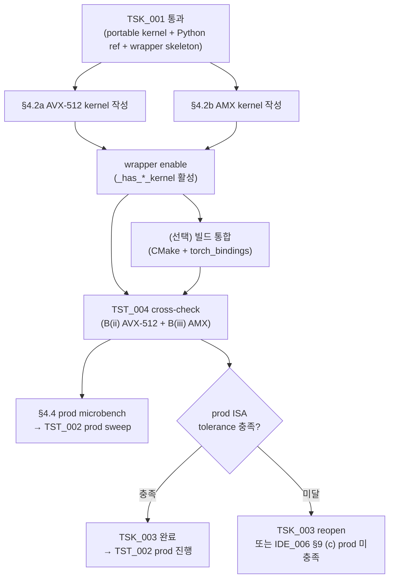

**↑ 부모**: [`PLN_001`](PLN_001.md) · **← 선행**: [`TSK_001`](TSK_001.md) · **↟ 조부**: [`IDE_006`](README.md) · **검증 게이트**: [`TST_004`](TST_004.md)

---

# TSK_003 — prod SIMD kernels (AVX-512 + AMX C++)

| 항목 | 값 |
|---|---|
| ID | `TSK_003` |
| 상태 | `활성` (Phase 1 dev — kernel 작성·컴파일·dispatch wiring 완료. Phase 2 prod — TST_004 cross-check **152 passed** @ `eval/results/20260427_044407_Intel_Xeon_Platinum_8480+x2_H100_80GB_HBM3x8_simd_verify`. throughput sweep 은 [`TST_002`](TST_002.md) 단계 대기) |
| 부모 PLN | [`PLN_001`](PLN_001.md) |
| 조부 IDE | [`IDE_006`](README.md) |
| 선행 TSK | [`TSK_001`](TSK_001.md) (portable C++ + Python reference + wrapper skeleton — algorithm baseline) |
| 검증 게이트 | [`TST_004`](TST_004.md) (portable vs AVX-512 + portable vs AMX cross-check) |
| 매핑 IDE_006 진입 조건 | (c) tolerance 의 prod ISA 측 충족 |
| 후속 | `TSK_002` 진입 시점에 wrapper enable 활성. `TST_002` (throughput) 가 prod sweep 에서 본 TSK 결과 사용 |
| ID 넘버링 출처 | [`shadow_assists/id_registry.md`](../../id_registry.md) |

> **단계 주의 (개정)**: 본 TSK 는 원래 prod 머신에서 사용자가 직접 작성·빌드·검증하기로 정의됐으나, 사용자 요청에 따라 **kernel 작성·컴파일·dispatch wiring 까지를 dev (12900KF + RTX 3090) 에서 완료** 했다. dev 는 AMX hardware 미지원 + AVX-512 BIOS fuse-off 가능성이라 native 실행이 불가하므로, `_has_avx512_kernel()` / `_has_amx_kernel()` 의 cpuid 게이트가 dev 의 JIT load 자체를 차단해 static-init SIGILL 을 회피한다 (자세한 정책은 §4.3). prod 측은 동일 cpuid 게이트가 자동 활성되어 컴파일·dispatch 가 첫 호출에 일어나며, 정확도는 `TST_004` cross-check 가 portable kernel 결과와 BF16 round-off tolerance 내 비교로 검증한다. dev 에서는 portable C++ kernel ([`TSK_001`](TSK_001.md) §4.2c) 이 여전히 algorithm + numerical 의 reference 역할이며, `TST_001` 회귀 (93/93 통과) + `TST_004` 자동 skipif (cpuid 게이트 False 시) 를 만족한다.

---

## 1. 목적과 범위

### 1.1 · 목적

prod 타깃 (Sapphire Rapids+ + H100×8) 의 native ISA 인 **AVX-512** 와 **AMX** 를 활용한 CPU partial-attention C++ kernel 을 두 종 작성·빌드하고, [`TSK_001`](TSK_001.md) 의 portable kernel 결과와 BF16 tolerance 내 numerical agreement 를 [`TST_004`](TST_004.md) 로 검증한다.

### 1.2 · 범위

| 단계 | 내용 |
|---|---|
| **§4.2a AVX-512 kernel** | `csrc/cpu/partial_attention_avx512.cpp` 작성. portable kernel 의 hot loop (head_dim dot product) 을 `_mm512_*` intrinsics 로 교체. 기본 `-mavx512f`, BF16 native `vdpbf16ps` 는 별도 subpath / runtime cpuid 게이팅 (dev BIOS 가능성 보호) |
| **§4.2b AMX kernel** | `csrc/cpu/partial_attention_amx.cpp` 작성. `Tdpbf16ps` tile (16×32 BF16) 활용. `Q·Kᵀ` / `P·V` 두 matmul 을 tile-based 로 재구성. tile config (`_tile_loadconfig`) thread 별 처리 |
| **wrapper enable** | [`TSK_001`](TSK_001.md) 의 `vllm/v1/attention/ops/cpu_partial_attention.py` 의 `_has_avx512_kernel()` / `_has_amx_kernel()` / `_try_load_avx512()` / `_try_load_amx()` / `_call_avx512(...)` / `_call_amx(...)` 추가 |
| **빌드 통합** | (선택, 권장) `cmake/cpu_extension.cmake:351` source list 에 두 cpp 등록 + `csrc/cpu/torch_bindings.cpp` 의 `TORCH_LIBRARY_EXPAND(...)` 에 op define + vLLM rebuild. JIT load 만으론 production 비활성 |
| **§4.4 prod microbench** | TST_002 §4.2 의 prod AVX-512 + AMX throughput sweep 의 CPU 측 결과 채움 |

### 1.3 · 비범위

- algorithm 자체 (partial attention + LSE merge) — `TSK_001` 에서 정의됨, 본 TSK 는 ISA 만 교체
- e2e 통합 (vLLM forward path 에 wiring) — `TSK_002` 가 담당
- e2e 정확도 — `TST_003` 가 담당 (kernel ISA 무관)
- multi-GPU / TP > 1 — FEA 단계

---

## 2. 사전 조건

- [`TSK_001`](TSK_001.md) Phase 1 dev 통과 — portable kernel + Python reference 가 algorithm + numerical baseline 으로 가용
- [`TST_001`](TST_001.md) A·B(i)·C 통과 (87 pytest)
- prod 머신 사양 확인 (Step 0 of `eval/run_prod_smoke.sh` 안내):
    - CPU: Xeon Sapphire Rapids 이상 (`amx_bf16`, `amx_tile`, `avx512bf16` 보유)
    - 컴파일러: GCC 11+ 또는 Clang 13+ (`-mamx-tile -mamx-bf16` 지원)
    - vLLM editable install
- [`PLN_001`](PLN_001.md) §3 Scope Lock 유지 (BF16/FP16, non-FP8, non-MLA, full attention, 단일 KV group)

---

## 3. 인터페이스

[`TSK_001`](TSK_001.md) §3 의 `forward_partial_with_lse(...)` 시그니처 그대로 따름. 본 TSK 는 **인터페이스 불변, 내부 ISA 만 교체**. wrapper dispatch (`cpu_partial_attention.py` §4.3) 가 cpuid 결과로 자동 선택.

---

## 4. 구현 단계

| 단계 | 산출물 | 검증 |
|---|---|---|
| **4.2a AVX-512 C++ kernel** | `csrc/cpu/partial_attention_avx512.cpp` | TST_004 단계 B(ii) (portable vs AVX-512) |
| **4.2b AMX C++ kernel** | `csrc/cpu/partial_attention_amx.cpp` | TST_004 단계 B(iii) (portable vs AMX) |
| **wrapper enable** | `cpu_partial_attention.py` 의 `_has_avx512_kernel()` / `_has_amx_kernel()` `True` 활성 + `_call_avx512`/`_call_amx` 추가 | TST_001 단계 C 의 prod-non-cascade 갱신 |
| **빌드 통합** | CMake source list + torch_bindings op define + vLLM rebuild | `python -c "import vllm._C; vllm._C.ops.forward_partial_with_lse_avx512(...)"` 정상 호출 |
| **§4.4 prod microbench** | TST_002 의 prod throughput sweep 결과 (`PLN_001_TST_002_01_throughput_sweep_results.md` 의 prod set) | net-win 영역 측정 |

### 4.1 AVX-512 kernel 핵심 패턴

portable 의 hot loop 을 다음으로 교체:

```cpp
// Before (portable):
float dot = 0.0f;
for (int64_t d = 0; d < head_dim; ++d) {
  dot += static_cast<float>(query_a[t][h][d]) * static_cast<float>(k_ptr[d]);
}

// After (AVX-512 BF16 native, head_dim % 32 == 0):
__m512 acc = _mm512_setzero_ps();
for (int64_t d = 0; d < head_dim; d += 32) {
  __m512bh q_bh = (__m512bh)_mm512_loadu_si512(&query_a[t][h][d]);
  __m512bh k_bh = (__m512bh)_mm512_loadu_si512(&k_ptr[d]);
  acc = _mm512_dpbf16_ps(acc, q_bh, k_bh);
}
float dot = _mm512_reduce_add_ps(acc);
```

또는 BF16 native 미가용 시 BF16→FP32 변환 후 `_mm512_fmadd_ps` 사용. cpuid 기반 runtime gating.

### 4.2 AMX kernel 핵심 패턴

`Q·Kᵀ` / `P·V` matmul 을 tile (16×32 BF16) 단위로 처리. `_tile_loadconfig` 로 tile config 초기화 후 `_tile_dpbf16ps` 로 누적. vLLM 의 기존 `csrc/cpu/cpu_attn_amx.hpp` 의 tile config / dispatcher 패턴 참고 권장.

### 4.3 wrapper 활성화 (Python 측)

```python
# cpu_partial_attention.py 갱신:
def _has_avx512_kernel() -> bool:
    _try_load_avx512()
    return _AVX512_MOD is not None

def _has_amx_kernel() -> bool:
    _try_load_amx()
    return _AMX_MOD is not None

def _call_avx512(**kwargs) -> tuple[Tensor, Tensor]:
    # mirror _call_portable, dispatch to _AVX512_MOD.forward_partial_with_lse_avx512(...)

def _call_amx(**kwargs) -> tuple[Tensor, Tensor]:
    # mirror _call_portable, dispatch to _AMX_MOD.forward_partial_with_lse_amx(...)
```

`forward_partial_with_lse(...)` 의 dispatch 분기에서 `NotImplementedError` raise 부분을 `_call_avx512` / `_call_amx` 로 교체.

---

## 5. 변경 파일

| 파일 | 변경 |
|---|---|
| `csrc/cpu/partial_attention_avx512.cpp` (신규) | AVX-512 kernel 본체. 빌드 플래그 `-O3 -mavx512f` (+ 선택 `-mavx512bf16` for BF16 native subpath) |
| `csrc/cpu/partial_attention_amx.cpp` (신규) | AMX kernel 본체. 빌드 플래그 `-O3 -mamx-tile -mamx-bf16` |
| `vllm/v1/attention/ops/cpu_partial_attention.py` (갱신) | `_has_avx512_kernel`/`_has_amx_kernel` `False` → `True`, `_try_load_*`/`_call_*` 함수 추가 |
| `cmake/cpu_extension.cmake` (선택, 정식 통합) | source list 에 두 cpp 등록 |
| `csrc/cpu/torch_bindings.cpp` (선택, 정식 통합) | op define + impl |

---

## 6. 검증 (TST_004 게이트)

[`TST_004`](TST_004.md) 가 본 TSK 의 검증 단위. 통과 기준:

| 단계 | 기준 |
|---|---|
| TST_004 B(ii) portable vs AVX-512 | 모든 sweep cell 에서 `max_abs_diff < atol`, `max_rel_diff < rtol` (PLN_001 §4.1 결정값) |
| TST_004 B(iii) portable vs AMX | 동일 tolerance |
| TST_001 단계 C (갱신, prod 측) | non-cascade dispatch 에서 PORTABLE/AVX-512/AMX 셋의 결과가 tolerance 내 일치 |

미달 시:
- AVX-512 kernel 결함 → 4.2a reopen
- AMX kernel 결함 → 4.2b reopen
- 모든 path 미달 시 IDE_006 §9 (c) prod 측 미충족 → IDE_006 기각 후보

---

## 7. 의존성·일정



§4.2a 와 §4.2b 는 병렬 작업 가능. wrapper enable 은 둘 다 완료 후. 빌드 통합은 선택 (정식 release 전 권장).

---

## 8. Open Questions

1. **AVX-512 BF16 native 의 dev BIOS-on 동작**: 12900KF BIOS 활성 시 `vdpbf16ps` 호출 가능한지 확인. fuse-off 면 FP32 변환 path 만 dev 검증.
2. **AMX tile 재구성의 GQA 영향** (PLN_001 §9 Q7 와 정합): head_dim=128 / num_kv_heads=4 / q_per_kv=8 (Qwen2.5-7B Q=32) 의 tile 경계 효율. tile 단일 사용? 두 tile 사용?
3. **portable vs AVX-512 의 numerical 차이 source**: BF16 native vs FP32 변환 의 reduction 순서 차이가 tolerance 안에 들어오는지 — TST_004 sweep 의 첫 cell 결과로 결정.
4. **빌드 통합 타이밍**: JIT 으로 검증 통과 후 정식 통합? 또는 처음부터 정식 build path? 정식 통합은 vLLM 풀빌드 시간이 큼 (~수십 분).

---

## 9. References

### 부모·연계 문서

- 부모 PLN: [`PLN_001`](PLN_001.md)
- 조부 IDE 상세: [`IDE_006`](README.md)
- 선행 TSK: [`TSK_001`](TSK_001.md) (algorithm + portable reference)
- 검증 게이트: [`TST_004`](TST_004.md)
- 자매 TST: [`TST_002`](TST_002.md) (throughput — 본 TSK 결과 prod sweep 측)
- ID 넘버링 출처: [`shadow_assists/id_registry.md`](../../id_registry.md)

### 코드 인용

- `csrc/cpu/cpu_attn_amx.hpp` — vLLM 기존 AMX dispatcher / tile config 패턴 참고
- `csrc/cpu/cpu_arch_macros.h` — ISA 검출 매크로
- `vllm/v1/attention/ops/cpu_partial_attention.py` — wrapper (TSK_001 산출물)
- `csrc/cpu/partial_attention_portable.cpp` — algorithm reference (TSK_001 산출물)
- AVX-512 BF16 spec: [Intel Intrinsics Guide — `_mm512_dpbf16_ps`](https://www.intel.com/content/www/us/en/docs/intrinsics-guide/index.html)
- AMX spec: Intel ISA Reference Vol 2, Chapter "AMX-TILE / AMX-BF16"

---

## 10. Change Log

| 날짜 | 변경 | 사유 |
|---|---|---|
| 2026-04-25 | TSK_003 초안 작성 | TSK_001 의 §4.2a (AVX-512) / §4.2b (AMX) sub-step 을 별도 TSK 로 분리. dev (TSK_001) / prod (TSK_003) 책임 분리 + 1:1 검증 매핑 (TST_001 / TST_004). 선행 = TSK_001. 검증 게이트 = TST_004. prod 머신 (Xeon SPR+ + H100×8) 에서 사용자 직접 작성·빌드·검증. |

---

**↑ 부모**: [`PLN_001`](PLN_001.md) · **← 선행**: [`TSK_001`](TSK_001.md) · **↟ 조부**: [`IDE_006`](README.md) · **검증 게이트**: [`TST_004`](TST_004.md)
