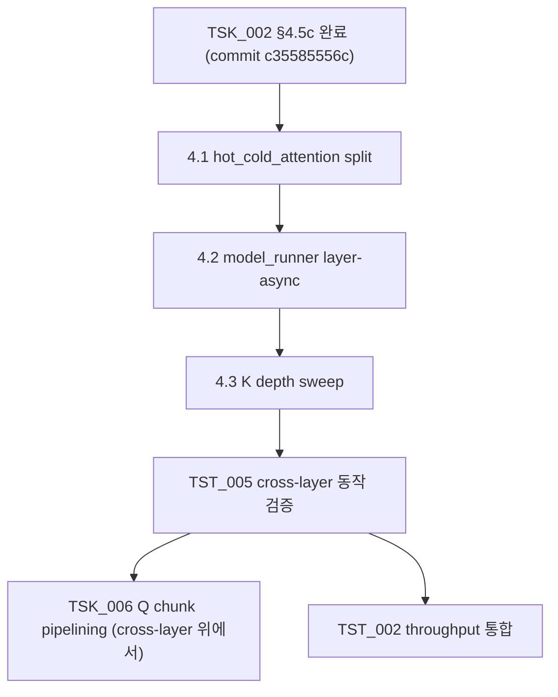

**↑ 부모**: [`PLN_001`](PLN_001.md) · **← 이전 형제**: [`TSK_002`](TSK_002.md) · [`TSK_003`](TSK_003.md) · [`TSK_004`](TSK_004.md) · **↟ 조부**: [`IDE_006`](README.md)

---

# TSK_005 — Cross-layer pipeline parallelism (layer-async forward)

| 항목 | 값 |
|---|---|
| ID | `TSK_005` |
| 상태 | `대기` (사전 조사 완료 — README §8 vii / §9 (g) / §12 Q6 + TSK_002 §10 Change Log 2026-04-27 deferred) |
| 부모 PLN | [`PLN_001`](PLN_001.md) |
| 조부 IDE | [`IDE_006`](README.md) |
| 자매 TSK | [`TSK_002`](TSK_002.md) (선행 — §4.5c 완료 후 본 TSK 활성), [`TSK_006`](TSK_006.md) (후속 — chunk pipelining) |
| 선행 | `TSK_002` §4.5c 완료 (`commit c35585556c`) |
| 목적 | layer N 의 cold CPU work 와 layer N+1 의 hot FA work 의 **cross-layer overlap** 을 land 하여 README §5.1 의 GPU/CPU overlap 가치를 *layer 간* 으로 확장. 100 req heavy workload 의 매 layer 직렬 누적 비용을 겹쳐 줄임 — NEO 논문 핵심 의도 |
| 후속 | [`TST_005`](TST_005.md) (cross-layer 동작 검증), [`TSK_006`](TSK_006.md) (Q chunk pipelining 은 cross-layer 위에서) |
| ID 넘버링 출처 | [`shadow_assists/id_registry.md`](../../id_registry.md) |

> **사전 조사 출처** (사용자 요구 — *내 멋대로 만들지 말 것*):
> - README §5.1 Data Flow: "CPU 측 왕복 전체 (Q 전송 + CPU partial + partial 결과 전송) 를 GPU hot attention 과 얼마나 overlap 할 수 있는지가 본 아이디어의 net-win 을 좌우"
> - README §8 risk vii: "mid-layer synchronization — layer 내부 critical path 에 CPU 통신·계산이 끼어든다 ... overlap 불가 시 IDE_006 기각"
> - README §9 진입 조건 (g): "Q transfer → CPU partial → (O, LSE) transfer → merge 의 end-to-end 시간이 GPU hot-attention 시간과 overlap 가능"
> - README §12 Open Q6: "Q chunk 파이프라이닝으로 critical-path hiding 이 가능한가. 가능한 chunk 크기는?"
> - TSK_002 §10 Change Log 2026-04-27 (async revert): "NEO-style cross-layer pipeline 은 model_runner.forward 의 layer-async refactor 가 선행되어야 — 본 TSK 범위 밖"

---

## 1. TL;DR

- **무엇을 하는가**: `model_runner.forward` 의 layer-sequential 호출을 *layer-async* 로 재구조화. layer N 의 cold path 결과를 layer N 의 merge 가 아니라 *future buffer* 에 stash, layer N+1 의 GPU prep 이 진행되는 동안 layer N 의 cold CPU 가 background 에서 진행 → 다음 await 시점까지 cross-layer 로 overlap.
- **왜 필요한가**: 본 commit 까지의 같은-layer overlap (GPU async launch 로 hot FA / cold CPU 가 layer 안에서 겹침) 만으로는 100 req heavy 의 매 layer 직렬 누적 비용 (80 layers × N steps × Q D2H/CPU compute/H2D) 을 줄이지 못함. layer 간 겹침이 진짜 throughput 가치의 본체.

---

## 2. 사전 조건

- `TSK_001` 완료 (kernel)
- `TSK_002` §4.5c 완료 (routing + sync) — 본 commit `c35585556c`
- `TSK_003` Phase 1 dev (SIMD)
- `TSK_004` Phase 1 dev (NUMA)

---

## 3. 변경 범위

### 3.1 · 흐름 변경

```
[현재 — layer-sequential]
  for layer in model.layers:
      hot_FA, cold_CPU = layer.attention(...)  # 같은-layer overlap
      await(cold_CPU); merge; layer-end

[목표 — layer-async]
  pending_cold: dict[layer_idx, Future] = {}
  for layer_idx, layer in enumerate(model.layers):
      if layer_idx > 0 and (layer_idx - K) in pending_cold:
          # K-stage 지연 await — cross-layer overlap window
          O_cold, LSE_cold = pending_cold.pop(layer_idx - K).result()
          merge_attn_states(...layer N-K...)
      hot_FA = layer.attention.hot(...)         # 즉시 launch (async)
      pending_cold[layer_idx] = issue_cold_async(...)
```

K = pipeline depth (1 layer 지연 = K=1, 깊을수록 더 큰 overlap window 단 buffer 메모리 ↑).

### 3.2 · 변경 파일 (예상)

| 파일 | 변경 |
|---|---|
| `vllm/v1/worker/gpu_model_runner.py` | layer iteration 흐름의 cross-layer await/issue 로직 |
| `vllm/v1/attention/backends/flash_attn.py` | `hot_cold_attention` 의 cold path 를 *지연 await* 형태로 분리 — `hot_cold_attention_issue()` + `hot_cold_attention_consume()` 두 단계로 split |
| `vllm/v1/attention/ops/cpu_partial_attention.py` | 이전에 revert 한 `forward_partial_with_lse_async` 를 다시 도입 (단 caller 흐름이 cross-layer 에서 재사용) |

### 3.3 · K (pipeline depth) 결정

README §12 Q6 가 "가능한 chunk 크기는?" 으로 deferred. 본 TSK 에서 microbench (TST_005) 로 결정. 1 부터 시작, depth 가 깊을수록 buffer 메모리 (per-layer (O_cold, LSE_cold) 누적) 가 늘어나므로 trade-off.

---

## 4. 구현 단계

| 단계 | 산출물 | 검증 |
|---|---|---|
| 4.1 hot_cold_attention split (issue / consume) | `vllm/v1/attention/backends/flash_attn.py` | 단위: issue 가 future 반환, consume 이 await 후 merge |
| 4.2 model_runner layer-async iteration | `vllm/v1/worker/gpu_model_runner.py` | 단위: K=1 일 때 layer N+1 forward 시점에 layer N future 가 in-flight (CUDA event timeline) |
| 4.3 K depth sweep | TST_005 microbench | K ∈ {1, 2, 3, 4} 의 throughput / memory 비교 |
| 4.4 e2e accuracy (TST_003 회귀) | 기존 TST_003 | cross-layer 후에도 D-ii 통과 |
| 4.5 prod throughput (TST_002 통합) | 사용자 prod 측정 | 사용자 100 req heavy 시나리오의 격차 좁힘 입증 |

---

## 5. 검증 — `TST_005`

자세한 spec 은 [`TST_005`](TST_005.md). 핵심:

- **단순 입출력 검증 아님** — CUDA event timeline 으로 *layer N cold work 가 layer N+1 hot FA 와 시간적 overlap* 됨을 직접 측정.
- baseline (TSK_005 비활성, 같은-layer overlap 만) 대비 cold path 총 wall time 감소 입증.
- README §9 진입 조건 (g) 의 *overlap 가능* 게이트가 본 TSK 결과로 충족 또는 미충족 결정.

---

## 6. 의존성·일정



---

## 7. Open Questions

1. K (pipeline depth) 의 적정값 — README §12 Q6 답으로 산출
2. cold path 결과의 buffer 메모리 budget — K × (num_layers × num_tokens × num_q_heads × head_dim × 2 byte BF16) 이 GPU memory 한계 안에 들어가는지
3. layer N 의 cold 결과가 layer N+K 에서 await 될 때 *KV view lifetime* 보장 — OffloadingConnector 가 그 사이 cold blocks 를 evict 하지 않도록 lock

---

## 8. References

### 부모·연계 문서

- 부모 PLN: [`PLN_001`](PLN_001.md)
- 조부 IDE 상세: [`IDE_006`](README.md) §5.1 / §8 vii / §9 (g) / §12 Q6
- 선행 TSK: [`TSK_002`](TSK_002.md) §10 Change Log 2026-04-27 (async revert)
- 후속: [`TSK_006`](TSK_006.md), [`TST_005`](TST_005.md)
- ID 넘버링 출처: [`shadow_assists/id_registry.md`](../../id_registry.md)

### 코드 인용 (예상 변경 위치)

- `vllm/v1/worker/gpu_model_runner.py` (layer iteration 흐름)
- `vllm/v1/attention/backends/flash_attn.py:hot_cold_attention` (issue/consume split)
- `vllm/v1/attention/ops/cpu_partial_attention.py` (async issue 재도입 — TSK_002 §10 b-revert 의 reverse)

---

## 9. Change Log

| 날짜 | 변경 | 사유 |
|---|---|---|
| 2026-04-28 | TSK_005 신규 발행 | 사용자 지시 (2026-04-28) — IDE_006 성능 향상 로드맵 작성. 사전 조사된 출처 (README §8 vii / §9 (g) / §12 Q6 + TSK_002 §10 Change Log 2026-04-27 의 deferred 항목) 기반으로 cross-layer pipeline parallelism TSK 신규. id_registry 의 "다음 부여 번호: TSK_005" 가져와 발급 후 TSK_006 으로 +1. |

---

**↑ 부모**: [`PLN_001`](PLN_001.md) · **← 이전 형제**: [`TSK_002`](TSK_002.md) · [`TSK_003`](TSK_003.md) · [`TSK_004`](TSK_004.md) · **↟ 조부**: [`IDE_006`](README.md)
