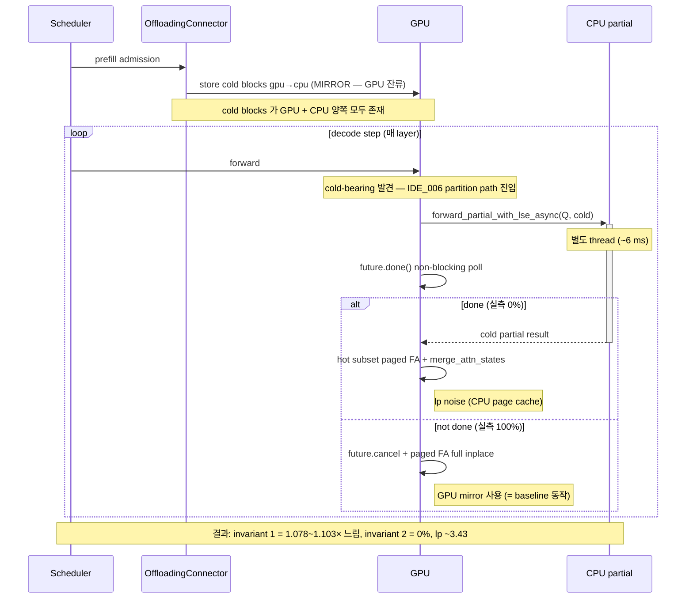
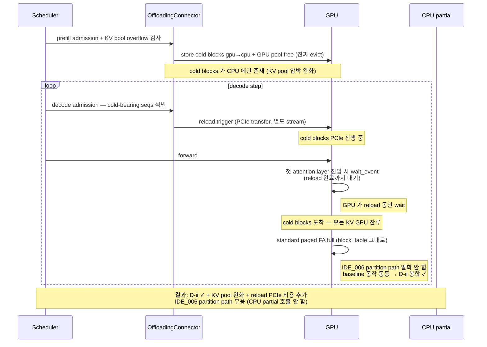
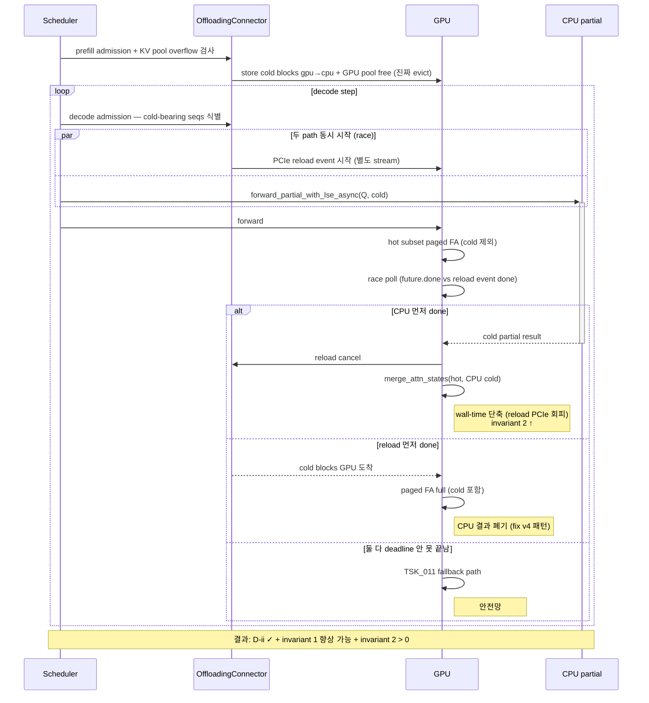

**↑ 부모**: [`PLN_001`](PLN_001.md) · **← 이전 형제**: [`TSK_011`](TSK_011.md) · **↟ 조부**: [`IDE_006`](README.md) · **검증 게이트**: [`TST_012`](TST_012.md)

---

# TSK_012 — Decode-time cold-blocks GPU reload + 진짜 evict 정책 + IDE_006 race

| 항목 | 값 |
|---|---|
| ID | `TSK_012` |
| 상태 | `대기 (계획 land — 2026-04-29 사용자 결정 후 본문 재작성. Phase 1 / Phase 2 단계적 진행)` |
| 부모 PLN | [`PLN_001`](PLN_001.md) |
| 조부 IDE | [`IDE_006`](README.md) |
| 선행 | [`TSK_011`](TSK_011.md) (fallback 안전망 + sweep 결과의 발견) · [`TSK_009`](TSK_009.md) fix v4 (non-blocking dispatch) · [`TSK_005`](TSK_005.md) 기각 (Q dependency dilemma 로 cross-layer 영역 폐기, IDE_006 의 진짜 가치 영역 = 본 TSK 임을 입증) |
| 목적 | **(Phase 1 D-ii 봉합)** TSK_011 sweep 의 lp ~3.43 발산 해소. **(Phase 2 진짜 evict + IDE_006 race)** cold blocks 가 진짜 GPU evict 되어 CPU partial 이 *reload 의 진짜 대체* 로 활용되는 IDE_006 의 *유일한 가치 영역* 정착 |
| 검증 게이트 | [`TST_012`](TST_012.md) |

---

## 1. TL;DR

- **Phase 1**: cold blocks 를 *진짜 GPU evict* (mirror → swap) + decode 시점 reload trigger 추가. attention 은 standard hot FA 가 모든 KV 처리. IDE_006 partition path *발화 안 함*. **D-ii 봉합** ✓ + KV pool 압박 완화.
- **Phase 2**: Phase 1 위에 **CPU partial vs PCIe reload race** 추가. `TSK_009` fix v4 의 non-blocking poll 위에 reload event 도 같이 검사. faster wins. CPU 빠른 영역에서 *reload PCIe 비용 회피* → wall-time 단축. **invariant 2 (CPU 활용)** > 0 가능.

> **`TSK_005` 가 기각된 이유 (2026-04-29) 와 본 TSK 의 의미**:
> `Q dependency + GPU 가 진짜 Q 가지면 CPU 결과 무용` dilemma 로 cross-layer 영역 폐기. CPU partial 이 *진짜 가치* 있는 영역 = cold blocks 가 *GPU 에서 진짜 free 되어 GPU 가 cold attention 못 하는* 시점 = reload 가 *필수* 인 시점. 그 시점에 CPU partial 이 *reload 의 대체* 로만 의미. 이게 본 TSK 의 Phase 2.

---

## 2. 발급 배경 (TSK_011 sweep 결과)

`TSK_011` §4.5 prod sweep (2026-04-28):

| 시나리오 | fallback # | worst_lp | worst_ppl | d_ii |
|---|---|---|---|---|
| 비활성 (cold-tier ON, IDE_006 OFF) | 0 | 3.428 | 0.2423 | 8/30 |
| deadline=100ms (fallback 100%) | 40 | 3.429 | 0.2299 | 9/30 |
| deadline=1000ms (fallback 0%) | 0 | 3.428 | 0.2423 | 8/30 |

→ partition / fallback 두 path *모두 cold KV 를 CPU page cache* 에서 가져옴. baseline (cold-tier OFF, 모든 KV GPU paged) 와 *ULP-level 차이* 가 logprob 에 누적 → lp ~3.43 발산. **fallback 만으로는 D-ii 봉합 불가능**.

근본 원인 = vLLM 의 cold-tier 가 *mirror* (gpu→cpu store 만, GPU 잔류) 정책. cold blocks 의 GPU/CPU 사본 사이의 BF16 noise 누적이 attention 결과 분포에 영향.

---

## 3. 두 framing 의 sequence diagram

### 3.1 · 현재 (TSK_012 land 전, fix v4 적용 상태)

### 3.2 · Phase 1 — D-ii 봉합 only (cold 진짜 evict + decode reload, IDE_006 발화 안 함)

### 3.3 · Phase 2 — 진짜 evict + IDE_006 race (CPU partial 이 reload 대체)

---

## 4. Phase 1 / Phase 2 단계 비교

| 영역 | Phase 1 (D-ii 봉합 only) | Phase 2 (진짜 evict + race) |
|---|---|---|
| cold blocks 위치 | CPU only (GPU evict) | CPU only (GPU evict) |
| KV pool 압박 | 완화 ✓ | 완화 ✓ |
| decode reload trigger | 항상 발화 | race 의 한 path |
| IDE_006 partition path 발화 | 발화 안 함 | 발화 (race 의 다른 path) |
| CPU partial 호출 | 호출 안 함 | 호출 (race) |
| GPU FA 호출 | 1회 (standard paged FA full) | 1회 (race 결과에 따라 hot subset 또는 full) |
| D-ii 봉합 | YES ✓ | YES ✓ |
| invariant 1 (속도) | reload PCIe 비용으로 약간 증가 | race 로 향상 가능 (CPU 빠른 영역) |
| invariant 2 (CPU 활용) | 0% | > 0% 가능 |
| TSK_009 fix v4 코드 | dead (호출 안 됨) | 활용 (race 의 non-blocking poll) |
| TSK_011 fallback path | dead (예외 안전망만) | 재활용 (race 의 *둘 다 못 끝남* 분기) |

---

## 5. 변경 범위

### 5.1 · 사전 조사 (Phase 0)

| 단계 | 산출물 |
|---|---|
| 0.1 hook 영역 조사 — `OffloadingConnectorScheduler` lifecycle 의 decode admission 시점 / cold blocks 진짜 evict 정책 가능 여부 / KVCacheManager 통합 영역 | `PLN_001_TSK_012_01_reload_hook_survey.md` |
| 0.2 evict 정책의 vLLM upstream 영향 — review / approval 영역 식별 | survey 본문 |

### 5.2 · Phase 1 (D-ii 봉합 only) 변경 파일

| 파일 | 변경 |
|---|---|
| `vllm/v1/kv_offload/spec.py` | offload spec 에 `evict_after_store: bool` 추가 (현재 mirror only → 진짜 evict 옵션) |
| `vllm/v1/kv_offload/worker/cpu_gpu.py` | `transfer_async` 의 gpu→cpu store 후 GPU pool 의 cold blocks free (KVCacheManager 와 통합) |
| `vllm/distributed/kv_transfer/kv_connector/v1/offloading/scheduler.py` | `update_state_after_alloc()` 또는 별도 hook — *decode admission 시점* cold-bearing seqs 의 cold blocks reload spec 생성 |
| `vllm/v1/kv_offload/worker/cpu_gpu.py` 또는 `vllm/v1/worker/gpu_model_runner.py` | reload completion sync — `wait_event` 패턴을 decode 영역으로 확장 (`§4.5c` 의 prefill 영역 패턴 재사용) |
| `vllm/v1/attention/backends/flash_attn.py` | `forward()` 의 dispatcher — Phase 1 모드에서 `enable_hot_cold_split = False` 강제 (또는 `max_num_cold_blocks_host = 0` zero out) — partition path 자체 우회 |

### 5.3 · Phase 2 (race 통합) 추가 변경

| 파일 | 변경 |
|---|---|
| `vllm/v1/attention/backends/flash_attn.py` | `hot_cold_attention` 의 race 분기 land — TSK_009 fix v4 의 non-blocking poll 위에 reload event 도 같이 검사. faster wins (3 way race: CPU done / reload done / deadline 미도달) |
| (재활용) `_fallback_full_fa_paged` | TSK_011 의 fallback path 가 race 의 *둘 다 deadline 안 못 끝남* 분기로 재활용 |

---

## 6. 구현 단계

| 단계 | 산출물 | 검증 |
|---|---|---|
| 0.1 | hook 영역 조사 (Phase 0) | PLN-deliverable |
| 1.1 | cold blocks 진짜 evict 정책 (`evict_after_store` flag) | unit — store 후 GPU pool 에서 free 확인 |
| 1.2 | decode admission reload trigger | unit — decode step 에 reload spec 생성 |
| 1.3 | reload completion sync (decode) | unit — race window 닫힘 |
| 1.4 | dispatcher 우회 (Phase 1 — partition path 발화 안 함) | unit — `max_num_cold_blocks_host = 0` 이면 hot_cold_attention 진입 자체 안 함 |
| 1.5 | TST_012 Phase 1 — prod 회차 | D-ii 봉합 입증 (`worst_max_abs_logprob ≤ 0.5`) |
| 2.1 | race 분기 — `hot_cold_attention` 의 3 way poll | unit — CPU done / reload done / deadline 분기 |
| 2.2 | TSK_011 fallback path 의 race 통합 | unit — `_fallback_full_fa_paged` 호출 패턴 |
| 2.3 | TST_012 Phase 2 — prod 회차 | invariant 1 / invariant 2 / D-ii 동시 측정 |

---

## 7. 검증 — `TST_012`

자세한 spec 은 [`TST_012`](TST_012.md). 핵심:

- **Phase 1**: D-ii 봉합 입증 (`worst_max_abs_logprob ≤ 0.5`, ppl_relative_diff tolerance 안)
- **Phase 2**: invariant 1 (C/B ≤ 1.0 또는 향상) + invariant 2 (CPU 활용 merged % > 0) + D-ii 동시 측정

회차 환경: `TSK_009` validation wrapper 재사용 (`run_prod_tsk009_validation.sh`) — 100 prompts × Llama-3.3-70B + TP=8 + 3 시나리오 (input_heavy / output_heavy / equal). KV pool overflow 발현 영역 (1.22M tokens 초과).

---

## 8. References

### 부모·연계 문서

- 부모 PLN: [`PLN_001`](PLN_001.md)
- 조부 IDE: [`IDE_006`](README.md)
- 선행 TSK: [`TSK_011`](TSK_011.md), [`TSK_009`](TSK_009.md) fix v4
- 후속 TST: [`TST_012`](TST_012.md)
- 기각 reference: [`TSK_005`](TSK_005.md) (Q dependency dilemma — IDE_006 의 진짜 가치 영역이 본 TSK 의 Phase 2 임을 입증)

### sweep / 측정 결과 출처

- TSK_011 sweep (`eval/results/20260428_041131_*_quick_tst003`, `..._042424_*`, `..._025616_*`) — D-ii 발산 입증
- TSK_009 fix v4 validation (`eval/results/20260429_043734_*_tsk009_validation/`) — invariant 1/2 측정 baseline

### 코드 인용

- `vllm/v1/kv_offload/spec.py` (offload spec)
- `vllm/v1/kv_offload/worker/cpu_gpu.py:198~298` (transfer_async + reload event)
- `vllm/distributed/kv_transfer/kv_connector/v1/offloading/scheduler.py` (admission lifecycle)
- `vllm/v1/attention/backends/flash_attn.py:hot_cold_attention` (race 분기 영역)

---

## 9. Change Log

| 날짜 | 변경 | 사유 |
|---|---|---|
| 2026-04-28 | TSK_012 신규 발행 | TSK_011 §4.5 prod sweep (2026-04-28) 에서 fallback 만으로 D-ii 봉합 불가능 입증 — fallback path / partition path 모두 같은 cold KV source (CPU page cache) 사용. 진짜 D-ii 봉합은 *decode 시점 cold→GPU reload* 영역으로 분리 필요. 사용자 결정 (B 갈래) 반영. id_registry "다음 부여 번호: TSK_012" 가져와 발급 후 TSK_013 으로 +1 |
| 2026-04-29 | **본문 재작성 — Phase 1 / Phase 2 단계 + sequence diagram + 진짜 evict 정책 명시** | 사용자 결정 (2026-04-29) — TSK_005 기각 후 IDE_006 의 진짜 가치 영역 = 본 TSK 의 Phase 2 (cold blocks 진짜 evict + IDE_006 race). 직전 본문 (2026-04-28) 의 *D-ii 봉합 only* framing 만으로는 IDE_006 partition path 가 무용 — Phase 1 / Phase 2 단계 분리. (1) §1 TL;DR 두 단계 명시 (2) §3 sequence diagram 3 개 (현재 fix v4 / Phase 1 / Phase 2) 추가 (3) §4 두 단계 비교 표 (4) §5 변경 파일 — Phase 1 (cold blocks 진짜 evict 정책 + decode reload trigger + dispatcher 우회) / Phase 2 (race 분기 추가) (5) §6 구현 단계 — Phase 0 사전 조사 → 1.1~1.5 (Phase 1) → 2.1~2.3 (Phase 2) (6) §8 References — TSK_005 기각 / TSK_009 fix v4 / TSK_011 sweep cross-link. **TSK_005 와의 결합** — TSK_005 의 cross-layer 영역이 fundamental Q dependency dilemma 로 폐기됐고, 그 대안 = 본 TSK 의 Phase 2 (cold blocks 진짜 evict 시점에서만 CPU partial 이 reload 의 진짜 대체로 의미). |

---

**↑ 부모**: [`PLN_001`](PLN_001.md) · **← 이전 형제**: [`TSK_011`](TSK_011.md) · **↟ 조부**: [`IDE_006`](README.md) · **검증 게이트**: [`TST_012`](TST_012.md)
