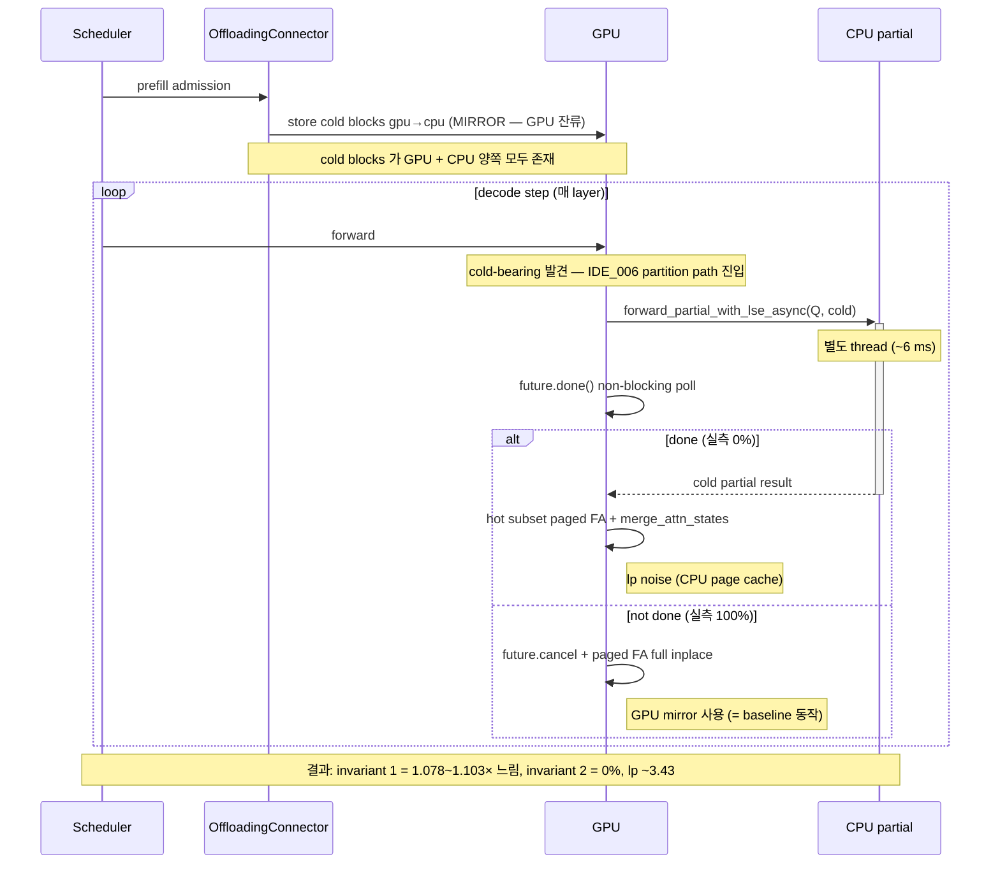
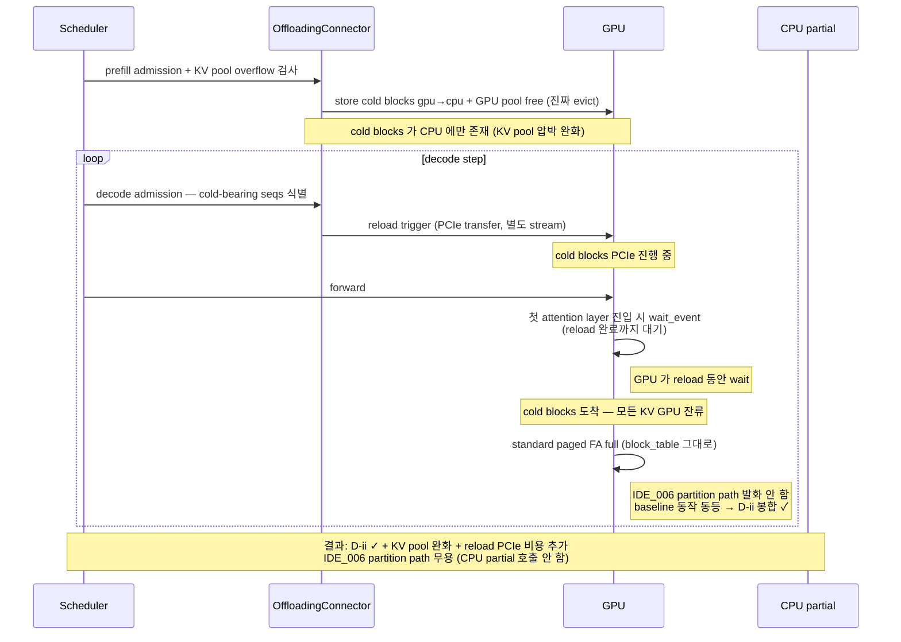

**↑ 부모**: [`PLN_001`](PLN_001.md) · **← 이전 형제**: [`TSK_011`](TSK_011.md) · **↟ 조부**: [`IDE_006`](README.md) · **검증 게이트**: [`TST_012`](TST_012.md)

---

# TSK_012 — Decode-time cold-blocks GPU reload + 진짜 evict 정책

| 항목 | 값 |
|---|---|
| ID | `TSK_012` |
| 상태 | `기각 (2026-05-02 — NEO 의 request 단위 exclusive ownership (TSK_015) 이 본 TSK 의 cold-blocks 단위 evict + reload 메커니즘을 흡수. NEO 식 적용 후 본문 폐기)` |
| 부모 PLN | [`PLN_001`](PLN_001.md) |
| 조부 IDE | [`IDE_006`](README.md) |
| 선행 | [`TSK_011`](TSK_011.md) (sweep 결과로 fallback 만의 D-ii 봉합 불가능 입증) · [`TSK_009`](TSK_009.md) fix v4 (non-blocking dispatch) · [`TSK_005`](TSK_005.md) 기각 (Q dependency dilemma 로 cross-layer 영역 폐기) |
| 목적 | TSK_011 sweep 의 lp ~3.43 발산 해소 — cold blocks 를 *진짜 GPU evict* (mirror → swap) + decode 시점 reload trigger 추가. attention 은 standard hot FA 가 모든 KV 처리. IDE_006 partition path *발화 안 함*. **D-ii 봉합** ✓ + KV pool 압박 완화 |
| 검증 게이트 | [`TST_012`](TST_012.md) |

---

## 1. TL;DR

cold blocks 를 *진짜 GPU evict* (mirror → swap) + decode 시점 reload trigger 추가. attention 은 standard hot FA 가 모든 KV 처리. IDE_006 partition path *발화 안 함*. D-ii 봉합 ✓ + KV pool 압박 완화.

> **`TSK_005` 기각 (2026-04-29) 후 본 TSK 의 위치**:
> `Q dependency + GPU 가 진짜 Q 가지면 CPU 결과 무용` dilemma 로 cross-layer 영역 폐기. 본 TSK 는 *D-ii 봉합* 의 fundamental 메커니즘 — cold KV source 자체를 baseline 과 일치시키는 (CPU page cache 가 아닌 GPU paged cache 로 reload) 영역. invariant 2 (CPU 활용 향상) 는 본 TSK 의 목표 영역 *밖* — IDE_006 partition path 자체가 발화 안 함.

> **per-request wall-time 차원**:
> 본 TSK 는 vanilla cold-tier (mirror) 보다 *항상 느림* — reload PCIe 비용이 추가되기 때문. 단 *throughput-per-time* / *capacity* 차원에서는 KV pool overflow 영역 (큰 모델 + 끝없는 traffic) 에서 가치 가능 — vanilla mirror 가 reject/preempt 하는 영역에서 본 TSK 의 진짜 evict 가 capacity 확장. 측정 영역으로 입증 필요.

---

## 2. 발급 배경 (TSK_011 sweep 결과)

`TSK_011` §4.5 prod sweep (2026-04-28):

| 시나리오 | fallback # | worst_lp | worst_ppl | d_ii |
|---|---|---|---|---|
| 비활성 (cold-tier ON, IDE_006 OFF) | 0 | 3.428 | 0.2423 | 8/30 |
| deadline=100ms (fallback 100%) | 40 | 3.429 | 0.2299 | 9/30 |
| deadline=1000ms (fallback 0%) | 0 | 3.428 | 0.2423 | 8/30 |

→ partition / fallback 두 path *모두 cold KV 를 CPU page cache* 에서 가져옴. baseline (cold-tier OFF, 모든 KV GPU paged) 와 *ULP-level 차이* 가 logprob 에 누적 → lp ~3.43 발산. **fallback 만으로는 D-ii 봉합 불가능**.

근본 원인 = vLLM 의 cold-tier 가 *mirror* (gpu→cpu store 만, GPU 잔류) 정책. cold blocks 의 GPU/CPU 사본 사이의 BF16 noise 누적이 attention 결과 분포에 영향.

---

## 3. Sequence diagram

### 3.1 · 현재 (TSK_012 land 전, fix v4 적용 상태)

### 3.2 · 본 TSK 적용 후 (cold 진짜 evict + decode reload, IDE_006 발화 안 함)

---

## 4. 비교 — 현재 vs 본 TSK

| 영역 | 현재 (fix v4 land) | 본 TSK 적용 후 |
|---|---|---|
| cold blocks 위치 | GPU + CPU mirror | CPU only (GPU evict) |
| KV pool 압박 | 누적 (mirror 가 GPU 점유) | 완화 ✓ |
| decode reload trigger | 없음 | 항상 발화 |
| IDE_006 partition path 발화 | 발화 (실측 100% dropped) | 발화 안 함 |
| CPU partial 호출 | 호출 (실측 결과 폐기) | 호출 안 함 |
| GPU FA 호출 | 1회 (paged FA full inplace) | 1회 (standard paged FA full) |
| D-ii 봉합 | 불가능 (lp ~3.43) | YES ✓ |
| invariant 1 (속도) | 1.078~1.103× 느림 | reload PCIe 비용으로 약간 증가 (per-request) |
| invariant 2 (CPU 활용) | 0% | 0% (목표 영역 밖) |
| capacity (수용 request 수) | mirror 로 제한 | 진짜 evict 로 확장 가능 |

---

## 5. 변경 범위

### 5.1 · 사전 조사 (Phase 0)

| 단계 | 산출물 |
|---|---|
| 0.1 hook 영역 조사 — `OffloadingConnectorScheduler` lifecycle 의 decode admission 시점 / cold blocks 진짜 evict 정책 가능 여부 / KVCacheManager 통합 영역 | `PLN_001_TSK_012_01_reload_hook_survey.md` |
| 0.2 evict 정책의 vLLM upstream 영향 — review / approval 영역 식별 | survey 본문 |
| 0.3 vLLM 의 mirror 정책 의 KV pool overflow 동작 — preemption / reject / partial-evict 중 어떤 것? capacity 차원 가치 영역 확정 | survey 본문 |

### 5.2 · 변경 파일

| 파일 | 변경 |
|---|---|
| `vllm/v1/kv_offload/spec.py` | offload spec 에 `evict_after_store: bool` 추가 (현재 mirror only → 진짜 evict 옵션) |
| `vllm/v1/kv_offload/worker/cpu_gpu.py` | `transfer_async` 의 gpu→cpu store 후 GPU pool 의 cold blocks free (KVCacheManager 와 통합) |
| `vllm/distributed/kv_transfer/kv_connector/v1/offloading/scheduler.py` | `update_state_after_alloc()` 또는 별도 hook — *decode admission 시점* cold-bearing seqs 의 cold blocks reload spec 생성 |
| `vllm/v1/kv_offload/worker/cpu_gpu.py` 또는 `vllm/v1/worker/gpu_model_runner.py` | reload completion sync — `wait_event` 패턴을 decode 영역으로 확장 (`§4.5c` 의 prefill 영역 패턴 재사용) |
| `vllm/v1/attention/backends/flash_attn.py` | `forward()` 의 dispatcher — 본 TSK 적용 시 `enable_hot_cold_split = False` 강제 (또는 `max_num_cold_blocks_host = 0` zero out) — partition path 자체 우회 |

---

## 6. 구현 단계

| 단계 | 산출물 | 검증 |
|---|---|---|
| 0.1 | hook 영역 조사 (Phase 0) | PLN-deliverable |
| 0.3 | mirror 정책의 KV pool overflow 동작 조사 | survey — capacity 가치 영역 확정 |
| 1.1 | cold blocks 진짜 evict 정책 (`evict_after_store` flag) | unit — store 후 GPU pool 에서 free 확인 |
| 1.2 | decode admission reload trigger | unit — decode step 에 reload spec 생성 |
| 1.3 | reload completion sync (decode) | unit — race window 닫힘 |
| 1.4 | dispatcher 우회 (partition path 발화 안 함) | unit — `max_num_cold_blocks_host = 0` 이면 hot_cold_attention 진입 자체 안 함 |
| 1.5 | TST_012 — prod 회차 | D-ii 봉합 입증 (`worst_max_abs_logprob ≤ 0.5`) + capacity (수용 request 수) 측정 |

---

## 7. 검증 — `TST_012`

자세한 spec 은 [`TST_012`](TST_012.md). 핵심:

- D-ii 봉합 입증 (`worst_max_abs_logprob ≤ 0.5`, ppl_relative_diff tolerance 안)
- reload event timeline (forward 진입 시 reload 완료 비율 ≥ 90%)
- throughput tradeoff (per-request wall-time = vanilla + reload PCIe 비용)
- (선택) capacity — KV pool overflow 영역에서 vanilla 대비 동시 in-flight request 수

회차 환경: TSK_011 sweep 환경 재사용 (`run_prod_quick_tst003.sh` — Llama-3.3-70B + TP=8, max-prompts=30, logprobs=1) + (선택) TSK_009 validation 환경 (capacity 측정용).

---

## 8. References

### 부모·연계 문서

- 부모 PLN: [`PLN_001`](PLN_001.md)
- 조부 IDE: [`IDE_006`](README.md)
- 선행 TSK: [`TSK_011`](TSK_011.md), [`TSK_009`](TSK_009.md) fix v4
- 후속 TST: [`TST_012`](TST_012.md)
- 기각 reference: [`TSK_005`](TSK_005.md) (Q dependency dilemma)

### sweep / 측정 결과 출처

- TSK_011 sweep (`eval/results/20260428_041131_*_quick_tst003`, `..._042424_*`, `..._025616_*`) — D-ii 발산 입증
- TSK_009 fix v4 validation (`eval/results/20260429_043734_*_tsk009_validation/`) — invariant 1/2 측정 baseline (본 TSK 와 직교)

### 코드 인용

- `vllm/v1/kv_offload/spec.py` (offload spec)
- `vllm/v1/kv_offload/worker/cpu_gpu.py:198~298` (transfer_async + reload event)
- `vllm/distributed/kv_transfer/kv_connector/v1/offloading/scheduler.py` (admission lifecycle)
- `vllm/v1/attention/backends/flash_attn.py:hot_cold_attention` (dispatcher 우회 영역)

---

## 9. Change Log

| 날짜 | 변경 | 사유 |
|---|---|---|
| 2026-04-28 | TSK_012 신규 발행 | TSK_011 §4.5 prod sweep (2026-04-28) 에서 fallback 만으로 D-ii 봉합 불가능 입증 — fallback path / partition path 모두 같은 cold KV source (CPU page cache) 사용. 진짜 D-ii 봉합은 *decode 시점 cold→GPU reload* 영역으로 분리 필요. 사용자 결정 (B 갈래) 반영. id_registry "다음 부여 번호: TSK_012" 가져와 발급 후 TSK_013 으로 +1 |
| 2026-04-29 | 본문 재작성 — Phase 1 / Phase 2 단계 + sequence diagram + 진짜 evict 정책 명시 | 사용자 결정 (2026-04-29) — TSK_005 기각 후 IDE_006 의 진짜 가치 영역 = 본 TSK. Phase 1 (D-ii 봉합 only) / Phase 2 (race) 단계 분리. (이후 Phase 2 제거로 단일 단계화 — 다음 entry 참조) |
| 2026-04-29 | **Phase 2 (진짜 evict + IDE_006 race) 제거 — 단일 단계 본문으로 정리** | 사용자 결정 (2026-04-29 후속) — Phase 2 측정 데이터 (TSK_009 fix v4 6 회차) 가 *vanilla 대비 항상 느림* 입증. race 메커니즘이 cold blocks 진짜 evict 위에 추가되어도 PCIe reload 비용을 회피하는 *CPU 빠른 영역* 자체가 fundamental 작음 (PCIe Gen4 16 GB/s × 32 KB cold block = 0.002 ms vs CPU partial 6.4 ms). 즉 race 의 CPU win 영역은 *극단적으로 큰 cold blocks (10000+ blocks)* 만 — 일반 workload 에서 발현 불가. (1) §1 TL;DR 에서 Phase 1 / Phase 2 framing 제거 (2) §3 sequence diagram 의 Phase 2 race 다이어그램 제거 (3) §4 비교 표 단일화 (현재 vs 본 TSK) (4) §5 변경 파일 — Phase 2 race 분기 영역 제거 (5) §6 구현 단계 — 2.1~2.3 (race) 제거. Phase 1 의 1.5 가 검증 종착점 (6) §7 검증 — Phase 2 invariant 1/2 측정 영역 제거. *D-ii 봉합 + reload timeline + throughput tradeoff* 가 본 TSK 의 검증 차원. invariant 2 (CPU 활용) 는 본 TSK 의 목표 영역 *밖* 명시. (7) capacity 차원 영역 추가 — vanilla mirror 의 KV pool overflow 동작 (preemption / reject) 대비 본 TSK 의 진짜 evict 가 capacity 확장 가능한 영역으로 가치 명시. 단 측정으로 입증 필요. |

---

**↑ 부모**: [`PLN_001`](PLN_001.md) · **← 이전 형제**: [`TSK_011`](TSK_011.md) · **↟ 조부**: [`IDE_006`](README.md) · **검증 게이트**: [`TST_012`](TST_012.md)
