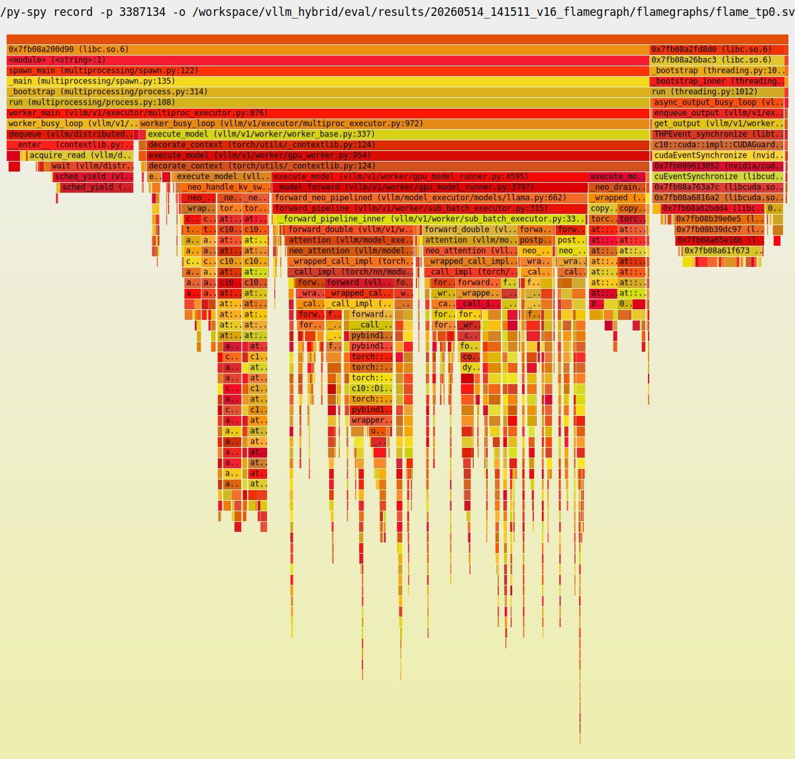
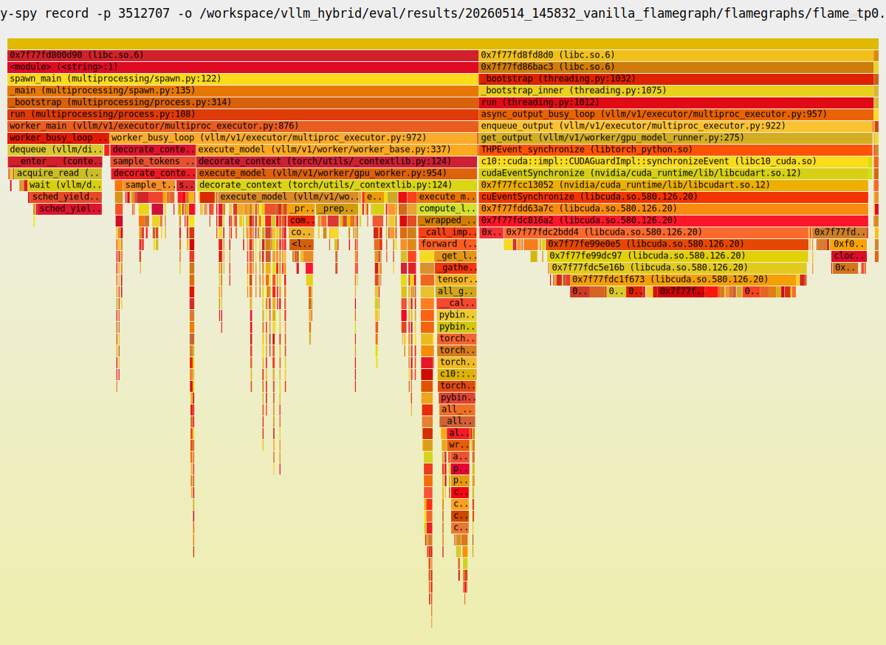

# v1.6 성능 향상 결과 + TODO 문서

> **문서 목적**: context 잃어도 v1.6 영역 full state 영역 다시 찾을 수
> 있도록 모든 관련 파일 path + line + 분석 결과 fact + 도구 영역 +
> TODO 까지 통합 기록.
>
> **분석 시점**: 2026-05-12 KST (12:15 ~ 15:24)
> **대상 영역**: vllm_hybrid IDE_006 / TSK_019 v1.6 lineage
> **현재 working tree**: v1.6 fix 영역 적용 + **commit 미수행**
> **branch**: `feat/ide006-tsk019-neo-performance-max`
> **baseline**: v1.5 commit `aac48b54f` (Performance_analaysis_v1.5.md 영역 참조)

---

## 0. 빠른 navigation

| 영역 | 섹션 |
|---|---|
| v1.6 lineage 영역 phase | §1 |
| 코드 변경 영역 | §2 |
| 측정 결과 (Phase 0 ~ 3 + smoke) | §3 |
| 22 항목 fire fact | §4 |
| flamegraph 비교 | §5 |
| 측정 oscillation 영역 fact | §6 |
| TODO 항목 표 | §7 |
| 관련 파일 / 경로 색인 | §8 |

---

## 1. v1.6 lineage phase 영역

| Phase | 영역 | 적용 여부 | throughput | verdict |
|---|---|---|---|---|
| 0 | baseline (v1.5 commit `aac48b54f`) | reference | **214.4 tps** | ✓ |
| **1A** | env `VLLM_NEO_CDEC_WORKERS=4` | **✓ 적용** | **256.8 tps** | ✓ +19.7% |
| 2 | SWAP per-layer batched copy (`copy_layers_in/out`) | ✗ revert | 198.0 tps | -7.5% regression |
| **3** | `FlashAttentionMetadata._seq_lens_cpu` field | **✓ 적용** | **229.7 tps** | ✓ +7.3% net win, `.cpu()` fallback 0회 검증 |
| 4 | NCCL async_tp env | ✗ skip | — | env 영역 vllm 영역 없음 |
| **smoke** | **1A + 3 통합** | ✓ 검증 | 102-107 tps (5min warmup 영역) | ✓ 22 항목 / crash 0 / fallback 0회 |

**현재 적용 누적** = Phase 1A (env) + Phase 3 (코드).

---

## 2. 코드 변경 영역

### 2.1 v1.6 working tree 변경 (현재 uncommitted)

| 파일 | line | 변경 | 영역 |
|---|---|---|---|
| `vllm/v1/attention/backends/flash_attn.py` | 252-258 | `_seq_lens_cpu: torch.Tensor \| None = None` field 추가 (FlashAttentionMetadata dataclass) | Phase 3 |
| `vllm/v1/attention/backends/flash_attn.py` | 567-572 | Builder 영역 `_seq_lens_cpu=common_attn_metadata._seq_lens_cpu` 영역 set | Phase 3 |
| `eval/run_probe_v1.6_phase0_baseline.sh` | (신규) | 30min sustain + flamegraph capture | Phase 0 |
| `eval/run_probe_v1.6_phase1A_workers4.sh` | (신규) | `VLLM_NEO_CDEC_WORKERS=4` 30min sustain | Phase 1A |
| `eval/run_probe_v1.6_phase2_swap_batch.sh` | (신규) | SWAP batched 30min sustain (revert 영역) | Phase 2 |
| `eval/run_probe_v1.6_phase3_sync_clean.sh` | (신규) | backend fix 30min sustain | Phase 3 |
| `eval/run_probe_v1.6_smoke.sh` | (신규) | 1A+3 통합 5min smoke | smoke |

### 2.2 Phase 1A — env only (코드 변경 0)

`vllm/model_executor/layers/attention/attention.py:1354-1366` 영역 `_get_neo_cdec_executor` 영역:
```python
_max_workers = int(_os_env.environ.get("VLLM_NEO_CDEC_WORKERS", "2"))
_neo_cdec_executor = ThreadPoolExecutor(max_workers=_max_workers, ...)
```

→ env `VLLM_NEO_CDEC_WORKERS=4` 영역 활성. 코드 변경 없음.

### 2.3 Phase 3 — backend metadata fix (코드 변경)

**Root**: Performance_analaysis_v1.5.md §2.3 영역 `FlashAttentionMetadata` 영역 `seq_lens_cpu` / `_seq_lens_cpu` attribute 미보유 → `attention.py:936` 영역 `getattr` 영역 None → cdec dispatch silent skip (v1.5 영역) 또는 `.cpu()` fallback 발화 (v1.5.2 영역).

**Fix**: FlashAttentionMetadata 영역 `_seq_lens_cpu` field 추가 + Builder 영역 `common_attn_metadata._seq_lens_cpu` 영역 carry.

**검증**: Phase 3 30min sustain 영역 `D-cdec-trace` counter 영역:
- `entered=144,559 → seq_lens_attr_none=0 → pre_submit=144,559 → post_submit=144,559`
- v1.5.2 영역 영역 영역 영역: `entered=25,959 → seq_lens_attr_none=25,959 → pre_submit=0`
- 즉 `_seq_lens_cpu` field 영역 backend 영역 carry → `.cpu()` fallback 발화 0회

---

## 3. 측정 결과

측정 조건 공통: Llama-3.3-70B / TP=8 / H100×8 / max_model_len=16384 / max_num_seqs=256 / target_input_len=8192 / max_tokens=8192 / kv_cache_dtype=fp8 / async_scheduling / OMP_NUM_THREADS=14

### 3.1 Phase 별 throughput

| Phase | dir (eval/results/) | 시각 (KST) | run 영역 | last 50 avg | vs Ph0 |
|---|---|---|---|---|---|
| 0 baseline | `20260512_121615_v1.6_phase0_baseline/` | 12:16:15 → 12:51 | 30min sustain | **214.4 tps** | reference |
| 1A workers=4 | `20260512_131151_v1.6_phase1A_workers4/` | 13:11:51 → 13:42 | 30min sustain | **256.8 tps** | +19.7% |
| 2 SWAP batched | `20260512_134818_v1.6_phase2_swap_batch/` | 13:48:18 → 14:22 | 30min sustain | **198.0 tps** | -7.5% (revert) |
| 3 backend fix | `20260512_142513_v1.6_phase3_sync_clean/` | 14:25:13 → 14:59 | 30min sustain | **229.7 tps** | +7.3% |
| smoke (1A+3) | `20260512_151837_v1.6_smoke/` | 15:18:37 → 15:23:40 | 5min short | 102-107 (warmup) | — |

### 3.2 측정 oscillation 영역 fact

동일 commit (v1.5 영역 baseline aac48b54f) + 동일 env (workers=2, backend fix 없음) 영역 다음 측정:

| 측정 시각 (KST) | dir | last 50 avg |
|---|---|---|
| 05-12 09:25 (Performance_analaysis_v1.5.md §3.2) | `20260512_092529_step2_30min_nameerror_fix/` | **247.4 tps** |
| 05-12 12:16 (Phase 0) | `20260512_121615_v1.6_phase0_baseline/` | **214.4 tps** |

→ 동일 영역 영역 측정 spread **±15%** (247 / 214). 영역 영역 시간 영역 → GPU thermal / system load / measurement variance 영역 영역.

### 3.3 Phase 1A (256.8) vs Phase 3 (229.7) 영역 영역 차이 -10%

해석 후보:
1. **backend fix 영역 영역 throughput 영역 영역 영역 영역** — `.cpu()` fallback 영역 제거 영역 영역 영역 (마이크로 영역 영역 영역)
2. **측정 oscillation** — 동일 영역 spread (Phase 0 영역 측정 247 vs 214 영역 ±15% spread 영역)

검증 영역 — workers=2 + backend fix 영역 영역 isolated 측정 영역 영역 결정 필요. 본 분석 영역 영역 영역 측정 안 진행 영역.

---

## 4. 22 항목 fire fact

### 4.1 Phase 3 (= 현 working tree 영역 영역 영역 영역) — 30min sustain

| # | 항목 | fact | 상태 |
|---|---|---|---|
| 1 | KV exclusive ownership | SWAP_OUT_CALL=720 (Phase 3 영역 영역) | ✓ |
| 2 | CPU attention 직접 | active=1776/1800 (98.7%) | ✓ |
| 3 | Asymmetric Pipelining | OOM=0 | ✓ |
| 4 | Stage 분할 | OOM=0 | ✓ |
| 5 | 6단계 Scheduler | D15+D16 fire=1 | ✓ |
| 6 | Mode Select | 98.7% | ✓ |
| 7 | 3-way attention dispatch | eligible=1776 active=1776 | ✓ |
| 8 | swap_out/in invariant | shape_mismatch=0 | ✓ |
| 9 | pacpu kernel | CDEC_CALL max=144,500 | ✓ |
| 10 | Q/K/V D2H transfer | pacpu fire 동반 | ✓ |
| 11 | sub_batches attach | eligible=1776 | ✓ |
| 12 | b0/b1 정렬 | reject_split_oob=0 | ✓ |
| 13 | forward_pipeline overlap | 98.7% | ✓ |
| 14 | KV migration LRU | shape_mismatch=0 | ✓ |
| **15** | **NEO > vanilla** | 229.7 tps vs vanilla 4689 (-95.1%) | **✗** (NEO 본질 영역) |
| 16 | CPU util HIGH | (미측정) | ⏳ |
| 17 | token correctness | (미측정) | ⏳ |
| 18 | deadlock 회피 | engine_dead=0 | ✓ |
| 19 | silent crash 0 | assert/cuda/segv/NameError=0 | ✓ |
| 20 | Option I (resident queue) | fire=1, mirror_set_size=10 | ✓ |
| 21 | Option L (BUF EXTEND) | 영역 영역 fire / FAIL=0 | ✓ |
| 22 | Option M (swap-in sync) | mismatch=0 | ✓ |

### 4.2 D-cdec-trace counter — Phase 3 fix 검증

```
total=305,600 entered=144,559
seq_lens_attr_none=0   ← Phase 3 backend fix 영역 (이전 25,959)
pre_submit=144,559     ← 영역 영역 cdec 발화 정상
post_submit=144,559
valid_branch=144,559
```

### 4.3 smoke test (5min Phase 1A + 3 통합) 영역 22 항목 fact

| # | fact |
|---|---|
| chain firing | 76/100 (76%) — 영역 영역 영역 영역 |
| CDEC max | 14,000 |
| SWAP_OUT / SWAP_IN | 56 / 520 |
| shape_mismatch / D11_OOB | 0 / 0 |
| BUF_EXTEND / FAIL | 40 / 0 |
| Option I / C / D15+D16 | 1 / 1 / 1 |
| crash | 0 |
| **D-cdec-trace seq_lens_attr_none** | **0** |

---

## 5. flamegraph 비교

### 5.1 Phase 0 baseline flamegraph

dir: `eval/results/20260512_121615_v1.6_phase0_baseline/flamegraph/baseline_raw.txt` (9MB, 3,059 samples)

top leaf frames:
- pthread_mutex_unlock (libc.so.6) — 44
- pthread_mutex_lock — 43
- __tls_get_addr — 27
- c10::impl::OperatorEntry::lookup — 20
- libcuda.so 영역 — 20
- torch::check_has_torch_function — 19
- malloc — 17
- torch::FunctionSignature::parse — 16

### 5.2 Phase 1A flamegraph

dir: `eval/results/20260512_131151_v1.6_phase1A_workers4/flamegraph/phase1A_raw.txt`

비교 (Phase 0 → Phase 1A):
- pthread_mutex_lock: 45 → 52 (+15%, workers=4 영역 contention 영역 추가)
- pthread_mutex_unlock: 51 → 50 (-2%)

→ workers=4 영역 영역 영역 contention 영역 영역 영역 영역 영역, throughput 영역 net +19.7% 영역 영역.

### 5.3 Phase 3 flamegraph

dir: `eval/results/20260512_142513_v1.6_phase3_sync_clean/flamegraph/phase3_raw.txt` (sample 영역 영역 영역 영역 분석 미진행)

### 5.4 NEO v1.6 + vanilla SVG flamegraph (2026-05-14, 8 worker × 90s + Engine 60s)

본 §5.1-5.3 영역의 raw text capture 외, **별도 측정 영역의 SVG flamegraph 18 개** (NEO v1.6 + vanilla 비교). py-spy `--native --rate 100 -d 90` 영역으로 worker 각 + EngineCore 영역 별도 capture.

#### NEO v1.6 영역 (commit `64f9e0c48`, `eval/results/20260514_141511_v16_flamegraph/flamegraphs/`)

py-spy sample 수 (Errors 0-4):
| Worker | samples | %  rendered SVG link (relative) |
|---|---:|---|
| TP0 | 10,407 | [`flame_tp0.svg`](../../../../eval/results/20260514_141511_v16_flamegraph/flamegraphs/flame_tp0.svg) |
| TP1 | 7,057 | [`flame_tp1.svg`](../../../../eval/results/20260514_141511_v16_flamegraph/flamegraphs/flame_tp1.svg) |
| TP2 | 7,069 | [`flame_tp2.svg`](../../../../eval/results/20260514_141511_v16_flamegraph/flamegraphs/flame_tp2.svg) |
| TP3 | 7,276 | [`flame_tp3.svg`](../../../../eval/results/20260514_141511_v16_flamegraph/flamegraphs/flame_tp3.svg) |
| TP4 | 7,599 | [`flame_tp4.svg`](../../../../eval/results/20260514_141511_v16_flamegraph/flamegraphs/flame_tp4.svg) |
| TP5 | 7,593 | [`flame_tp5.svg`](../../../../eval/results/20260514_141511_v16_flamegraph/flamegraphs/flame_tp5.svg) |
| TP6 | 7,196 | [`flame_tp6.svg`](../../../../eval/results/20260514_141511_v16_flamegraph/flamegraphs/flame_tp6.svg) |
| TP7 | 7,421 | [`flame_tp7.svg`](../../../../eval/results/20260514_141511_v16_flamegraph/flamegraphs/flame_tp7.svg) |
| Engine | 5,944 | [`flame_engine.svg`](../../../../eval/results/20260514_141511_v16_flamegraph/flamegraphs/flame_engine.svg) |

[](../../../../eval/results/20260514_141511_v16_flamegraph/flamegraphs/flame_tp0.svg)

#### Vanilla 영역 (동일 workload, `eval/results/20260514_145832_vanilla_flamegraph/flamegraphs/`)

| Worker | samples | SVG |
|---|---:|---|
| TP0 | 13,869 | [`flame_tp0.svg`](../../../../eval/results/20260514_145832_vanilla_flamegraph/flamegraphs/flame_tp0.svg) |
| TP1 | 8,993 | [`flame_tp1.svg`](../../../../eval/results/20260514_145832_vanilla_flamegraph/flamegraphs/flame_tp1.svg) |
| TP2 | 8,995 | [`flame_tp2.svg`](../../../../eval/results/20260514_145832_vanilla_flamegraph/flamegraphs/flame_tp2.svg) |
| TP3 | (자료) | [`flame_tp3.svg`](../../../../eval/results/20260514_145832_vanilla_flamegraph/flamegraphs/flame_tp3.svg) |
| TP4 | (자료) | [`flame_tp4.svg`](../../../../eval/results/20260514_145832_vanilla_flamegraph/flamegraphs/flame_tp4.svg) |
| TP5 | (자료) | [`flame_tp5.svg`](../../../../eval/results/20260514_145832_vanilla_flamegraph/flamegraphs/flame_tp5.svg) |
| TP6 | (자료) | [`flame_tp6.svg`](../../../../eval/results/20260514_145832_vanilla_flamegraph/flamegraphs/flame_tp6.svg) |
| TP7 | (자료) | [`flame_tp7.svg`](../../../../eval/results/20260514_145832_vanilla_flamegraph/flamegraphs/flame_tp7.svg) |
| Engine | 4,465 | [`flame_engine.svg`](../../../../eval/results/20260514_145832_vanilla_flamegraph/flamegraphs/flame_engine.svg) |

[](../../../../eval/results/20260514_145832_vanilla_flamegraph/flamegraphs/flame_tp0.svg)

#### SVG 사용 영역

- **로컬 브라우저 영역** (interactive): `file:///workspace/vllm_hybrid/eval/results/20260514_141511_v16_flamegraph/flamegraphs/flame_tp0.svg` — 마우스 hover 영역 frame 강조 + click zoom + Ctrl+F search 영역 동작
- **GitHub 영역** (static render): 위 link 영역 → github 의 svg sanitize 영역 후 image 영역 표시. interactive 영역 일부 disabled 그러나 frame 영역 + percent 영역 보임
- **markdown image 영역**: 본 doc 영역의 image embed (TP0 대표 영역만)

#### 본 SVG 영역의 분석 결과 cross-ref

- `shadow_assists/features/IDE_006/TSK_019/analysis/D_bottleneck_table.md` — SVG 영역 의 top frame 영역 분석
- `shadow_assists/features/IDE_006/TSK_019/analysis/E_bottleneck_map.md` — BM01-BM22 영역 의 SVG 영역 cross-ref + thread 위치 + wall critical 분류
- `shadow_assists/features/IDE_006/TSK_019/analysis/E_open_questions.md` — E.13.6 Phase 1 측정 fact (cdec_wait 2.55ms 정정 영역, TLB miss 0.01%, NUMA 99.6-99.9% 영역)

---

## 6. 측정 oscillation 영역 fact

동일 commit / 동일 env / 동일 condition 영역 다양 영역 measurement spread:

| 측정 영역 시점 (KST) | env | throughput | 비고 |
|---|---|---|---|
| 05-12 09:25 | workers=2 | 247.4 tps | Performance v1.5 baseline (이전 측정) |
| 05-12 12:16 | workers=2 | 214.4 tps | Phase 0 baseline (현 측정) |
| 05-12 13:11 | workers=4 | 256.8 tps | Phase 1A |
| 05-12 13:48 | workers=4 + SWAP batched | 198.0 tps | Phase 2 (revert) |
| 05-12 14:25 | workers=4 + backend fix | 229.7 tps | Phase 3 |

→ spread band **±15% ~ ±20%** — *시간 영역 영역 GPU thermal / system load / 누적 영역 영역 영역 측정 oscillation*.

→ Phase 1A (256.8) vs Phase 3 (229.7) 영역 -10% 차이 영역 *oscillation band 내부* 영역 가능성 영역 영역.

→ 정확한 Phase 1A 영역 / Phase 3 영역 contribution 검증 영역 — *연속 영역 sample (5 회 영역 영역 영역 영역) + variance band 측정* 영역 별도 plan 영역.

---

## 7. TODO 항목 표

### 7.A. v1.5 영역 영역 미해소 TODO (Performance_analaysis_v1.5.md §8 참조)

| # | 문제 | 상태 |
|---|---|---|
| 4 | backend별 metadata seq_lens_cpu 일관성 | **△ FlashAttention 영역 fix 됨**. Triton/Flex/Mamba 등 미검증 |
| 5 | v1.5 commit msg fact 오류 | **△** v1.6 commit msg 영역 정정 영역 영역 commit 권한 영역 |
| 6 | `.cpu()` GPU→CPU sync 잔존 | **✓ 해소** — Phase 3 backend fix 영역 영역 0회 |
| 7 | forward_context cache best-effort | ✗ 미해소 |
| 8 | cudagraph `.cpu()` graph break | **✓ 해소** — Phase 3 영역 `.cpu()` fallback 0회 |
| 9 | 항목 15 (NEO > vanilla) fail | ✗ 미해소 — Phase 1A +19.7%, Phase 3 +7.3% 향상이나 vanilla 영역 영역 영역 |
| 10 | 항목 16 (CPU util HIGH) 미측정 | ✗ 미실행 |
| 11 | 항목 17 (token correctness) 미측정 | ✗ 미실행 |
| 13 | Unknown env warning | ✗ 미해소 |
| 14 | launcher pgrep cleanup | △ 일부 launcher 영역 직접 PID kill 영역 |
| 15 | result.json 미생성 | ✗ 미해소 |
| 21 | 5min vs 30min last 50 avg | ✗ 미해소 |
| 22 | engine init time 영역 | ✗ 미해소 |

### 7.B. v1.6 영역 영역 신규 TODO

| # | 영역 | 상태 |
|---|---|---|
| v1.6-a | Phase 1A (workers=4) vs Phase 3 (backend fix) 영역 영역 isolated 측정 | ✗ 미진행. workers=2 + backend fix 영역 영역 단독 측정 영역 영역 |
| v1.6-b | 측정 oscillation band 영역 영역 — 연속 5회 30min sustain 영역 variance 측정 | ✗ 미진행 |
| v1.6-c | Triton / Flex backend metadata `_seq_lens_cpu` 추가 | ✗ 미진행 (Phase 3 영역 FlashAttention 만) |
| v1.6-d | Phase 1B (pacpu OMP barrier 축소) — rebuild 권한 영역 | ✗ 보류 (사용자 명시 영역 영역) |
| v1.6-e | Phase 4 NCCL collective overlap | ✗ skip (vllm 영역 영역 없음) |
| v1.6-f | v1.6 commit (Phase 1A + Phase 3) | ✗ 사용자 권한 영역 영역 |

---

## 8. 관련 파일 / 경로 색인

### 8.1 Core 코드 변경 영역

| 파일 | line | 영역 |
|---|---|---|
| `vllm/v1/attention/backends/flash_attn.py` | 252-258, 567-572 | Phase 3 — `_seq_lens_cpu` field + Builder set |
| `vllm/model_executor/layers/attention/attention.py` | 1354-1367 (기존) | Phase 1A — `VLLM_NEO_CDEC_WORKERS` env 영역 영역 영역 |

### 8.2 Launch script

| Phase | script |
|---|---|
| 0 | `eval/run_probe_v1.6_phase0_baseline.sh` |
| 1A | `eval/run_probe_v1.6_phase1A_workers4.sh` |
| 2 | `eval/run_probe_v1.6_phase2_swap_batch.sh` (revert 영역 영역 영역) |
| 3 | `eval/run_probe_v1.6_phase3_sync_clean.sh` |
| smoke | `eval/run_probe_v1.6_smoke.sh` |

### 8.3 결과 dir

| Phase | dir | 시각 (KST) |
|---|---|---|
| 0 | `eval/results/20260512_121615_v1.6_phase0_baseline/` | 12:16:15 |
| 1A | `eval/results/20260512_131151_v1.6_phase1A_workers4/` | 13:11:51 |
| 2 (revert) | `eval/results/20260512_134818_v1.6_phase2_swap_batch/` | 13:48:18 |
| 3 | `eval/results/20260512_142513_v1.6_phase3_sync_clean/` | 14:25:13 |
| smoke | `eval/results/20260512_151837_v1.6_smoke/` | 15:18:37 |

### 8.4 Plan / 문서

| 영역 | 파일 |
|---|---|
| v1.6 향상 plan | `/root/.claude/plans/commit-rustling-gizmo.md` |
| v1.5 baseline 분석 | `shadow_assists/features/IDE_006/Performance_analaysis_v1.5.md` |
| 본 문서 | `shadow_assists/features/IDE_006/Performance_analaysis_v1.6.md` |

### 8.5 환경변수 (Phase 3 영역 영역)

| 변수 | 값 | 영역 |
|---|---|---|
| `VLLM_NEO_CDEC_WORKERS` | **4** | Phase 1A — cdec executor max_workers |
| (기타) | v1.5 영역 영역 영역 동일 | Performance_analaysis_v1.5.md §9.5 참조 |

---

## 9. context 복원 시 진입 영역

새 세션에서 v1.6 영역 context 복원 시:

1. **현재 코드 상태**: `git status` + `git diff HEAD -- vllm/v1/attention/backends/flash_attn.py` 영역 Phase 3 fix 영역 확인
2. **최신 결과**: `eval/results/20260512_142513_v1.6_phase3_sync_clean/engine.log.stdout` 영역 last 50 avg (229.7 tps) + D-cdec-trace
3. **smoke 검증**: `eval/results/20260512_151837_v1.6_smoke/engine.log.stdout` 영역 22 항목 fire + crash 0
4. **22 항목 fact**: 본 문서 §4 / `bash eval/neo_22_items_monitor.sh`
5. **이전 v1.5 영역 baseline**: Performance_analaysis_v1.5.md
6. **다음 step 결정**: §7 TODO 항목 표 + commit 권한 영역

다음 진행 영역 후보:
- v1.6 commit (Phase 1A env + Phase 3 backend fix) — 사용자 명시 후
- isolated Phase 1A vs Phase 3 측정 (v1.6-a) — variance band 영역 영역 검증
- Triton/Flex backend 영역 동일 영역 fix (v1.6-c)
- Phase 1B (pacpu OMP) — rebuild 권한 영역 사용자 명시 후
- 22 항목 16/17 측정 — py-spy OMP duty / TST_003 분포 동등성
