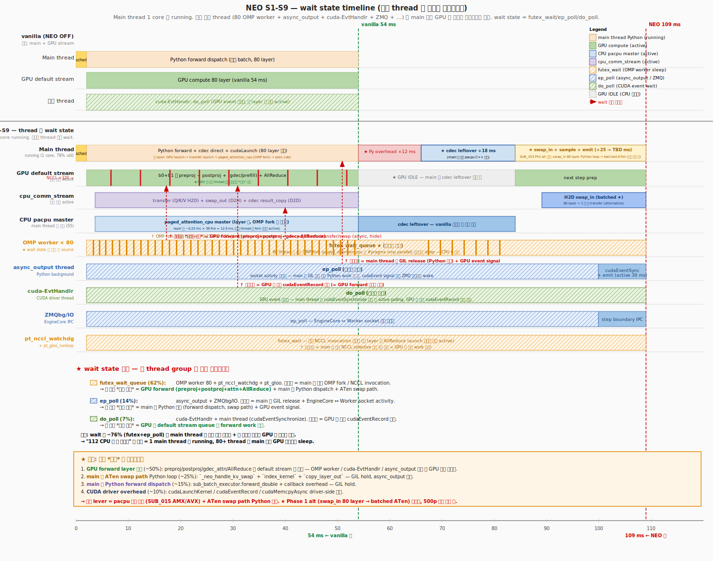
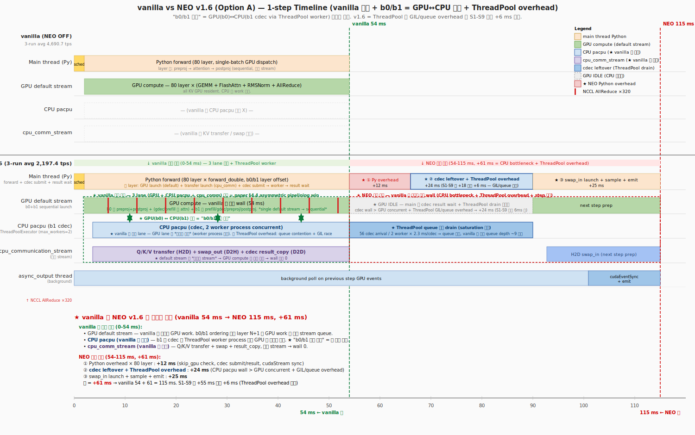

# TSK_019 — Best Configuration index

> Best configuration 영역 history + 개략 정보. 상세 fact = 각 best file 영역.

## Best history (3-run avg/min/max)

| 시각 (KST) | best file | commit | 3-run avg | min | max | CV | wall avg | workload | 22 strict | 비고 |
|---|---|---|---:|---:|---:|---:|---:|---|:-:|---|
| **2026-05-18 10:54** | `measurements/sub015_p3_amx_steps_500p_1run_20260518/step2_amx_BA/` | `feat/neo-amx-apply` (S1-S9 base + AMX qk B+A) | **2,275.6 (1-run)** | — | — | — | **1,785s** | 500p × 8192 | (펜딩) | **★ AMX qk_product Strategy B+A (env `VLLM_NEO_USE_AMX=1`)** — thread Q cache + K^T outer pre-pack. **S1-S9 대비 +1.7%**. 3-run avg 검증 펜딩. |
| **2026-05-17 14:25** | [`Best_S1_S9_2238tps.md`](Best_S1_S9_2238tps.md) | `feat/neo-option-b` (v1.6 base + S1-S9) | **2,238.6** | **2,153.6** | **2,303.4** | **3.44%** | **1,819s** | 500p × 8192 | **19/19** | **★ NEO 원본 100% 정합** (10/10 함수). NEO §4.4 정통 implement 완성 |
| 2026-05-14 ~ 16 | [`Best_v1.6_2157tps.md`](Best_v1.6_2157tps.md) | `64f9e0c48` | 2,197.4 | 2,156.9 | 2,223.8 | 1.62% | 1,844s | 500p × 8192 | 19/19 | strict 19/19 + shape_mismatch=0. Run 1 (2026-05-14) + Run 2/3 (2026-05-16 회귀) |
| 2026-05-15 20:31 | [`Best_Phase3_1_kmp50.md`](Best_Phase3_1_kmp50.md) | `099d23e54` | 2,038.7 (1-run) | — | — | — | 1,591s | **400p** × 8192 | 19/19 | Phase 3.1 (OMP persist) + KMP_BLOCKTIME=50, single-trial |

## Reference measurements (3-run avg/min/max)

| 시각 (KST) | dir | tps avg / min / max | CV | wall avg | workload | runs | 용도 |
|---|---|---:|---:|---:|---|:-:|---|
| 2026-05-10 17:16 | [`measurements/vanilla_3run_20260510/`](measurements/vanilla_3run_20260510/) | **4,690.7** / 4,690.4 / 4,691.0 | **0.006%** | 873s | 500p × 8192 | 3 | vanilla 분모 (NEO OFF) |
| **2026-05-17 14:25** | [`measurements/neo_s1_s9_500p_3run_20260517/`](measurements/neo_s1_s9_500p_3run_20260517/) | **2,238.6** / 2,153.6 / 2,303.4 | **3.44%** | 1,819s | 500p × 8192 | 3 | **★ S1-S9 best (NEO 원본 100% 정합)** |
| 2026-05-14 ~ 16 | [`measurements/neo_v1_6_500p_3run_20260516/`](measurements/neo_v1_6_500p_3run_20260516/) | **2,197.4** / 2,156.9 / 2,223.8 | **1.62%** | 1,844s | 500p × 8192 | 3 | v1.6 best (commit `64f9e0c48`) |
| 2026-05-16 07:21 | [`measurements/neo_phase3_1_kmp200_500p_3run_20260516/`](measurements/neo_phase3_1_kmp200_500p_3run_20260516/) | 2,134.9 / 2,013.2 / 2,255.7 | 5.68% | 1,914s | 500p × 8192 | 3 | Phase 3.1 (Persistent OMP) KMP=200 |
| 2026-05-16 09:56 | [`measurements/neo_phase3_1_3_kmp200_500p_3run_20260516/`](measurements/neo_phase3_1_3_kmp200_500p_3run_20260516/) | 2,083.3 / 2,015.4 / 2,145.4 | 3.13% | 1,957s | 500p × 8192 | 3 | Phase 3.1+3.3 (cherry-pick `0717f4b8c`) |
| 2026-05-17 20:02 | `eval/results/20260517_200212_cpu112_analysis_500p/` | 2,037.8 (1-run) | — | 2,001s | 500p × 8192 | 1 | **CPU 112-core util 분석 환경** (S1-S9 base + `KMP_AFFINITY=verbose,scatter` env) — CPU 활용도 / NUMA / wait state 정량 측정 용도. 1-run 측정. |
| 2026-05-18 07:58 ~ 09:53 | [`measurements/sub015_p3_amx_500p_3run_20260518/`](measurements/sub015_p3_amx_500p_3run_20260518/) | **2,142.5** / 2,072.0 / 2,226.0 | **3.6%** | 1,898s | 500p × 8192 | 3 | **SUB_015-Phase 3 A: AMX qk_product (env `VLLM_NEO_USE_AMX=1`)** — host C++ AMX BF16 qk + ISPC softmax/av. **vs S1-S9 -4.3% 회귀** (작은 matmul 의 setup overhead > work). 코드 keep (env-gated, default off, future K cache BF16 store 의 base). round 단조 감소 (thermal). |
| **2026-05-18 10:18 ~ 12:01** | [`measurements/sub015_p3_amx_steps_500p_1run_20260518/`](measurements/sub015_p3_amx_steps_500p_1run_20260518/) | **Step 1 = 2,237.4 / Step 2 = 2,275.6 / Step 3 = 2,184.7 (1-run each)** | — | 1,785s (Step 2) | 500p × 8192 | 1 each | **★ SUB_015-Phase 3 AMX optimization Step별** (analysis/I_amx_proper_design.md 의 Strategy ranking 충실): **Step 1 (B thread-Q-cache)** 회귀 회복 (-0.05%), **Step 2 (B+A K^T outer pre-pack)** baseline 초과 **(+1.7%)**, **Step 3 (B+A+G SW prefetch)** 회귀 (-2.4%, block_table indirection 의 prefetch overhead). **best = Step 2**. |

## 개략 정보

### S1-S9 (500p best — 3-run avg 2,238.6 tps, CV 3.44%) ★ NEO 원본 source 10/10 함수 정합
- workload: 500p × 8192 in/out (4M total tokens)
- 핵심: NEO 원본 source code (`swiftllm/worker/layers/transformer_layer.py` + `model.py`) 의 10/10 함수 정합 implement (S1-S9 9 단계 rewrite)
  - S1: `_neo_comm_wait_compute` / `_neo_compute_wait_comm` helper (NEO 동등)
  - S3: Option B async deque 제거 → Option A sync path 만 유지
  - S4: `forward_double` 의 `with cuda.stream(s0/s1):` 제거
  - S5: `ThreadPoolExecutor.submit` → `_neo_cdec_compute_cpu` 직접 호출 + `_NeoDirectFuture`
  - S7: `_get_batch_streams()` (s0/s1 stream pair) dead code 제거
  - S8: `forward_double` NEO `_forward_pipeline_stage(cur_stage)` ordering 정합
  - S9: result D2D copy 를 `cpu_communication_stream` 위 async + `_compute_wait_comm()` 호출
- 3-run: 2,303.4 / 2,153.6 / 2,258.9 → avg 2,238.6
- vs vanilla 3-run avg 4,690.7: **47.7%** (+0.9pt vs v1.6 best)
- vs v1.6 best 3-run avg 2,197.4: **+1.9%**
- NEO 원본 `swiftllm/worker/layers/transformer_layer.py + model.py` 10/10 함수 정합 ✓
- branch: `feat/neo-option-b` (v1.6 base `64f9e0c48` + S1-S9)

### v1.6 (500p — 3-run avg 2,197.4 tps, CV 1.62%)
- workload: 500p × 8192 in/out (4M total tokens)
- 핵심: shape mismatch fix (`NeoCpuKvBuffer._in_flight_swap_out`)
- 3-run: 2,156.9 / 2,223.8 / 2,211.6 → avg 2,197.4
- vs vanilla 3-run avg 4,690.7: **46.8%**
- S1-S9 base (commit `64f9e0c48`)

### Phase 3.1+KMP=50 (400p best)
- workload: 400p × 8192 (3.2M total tokens — v1.6 보다 80% 영역)
- 핵심: OMP persistent (omp_set_dynamic(0)) + KMP_BLOCKTIME=50ms
- cdec_wait 영역 2.68→2.38ms (−11.2%)
- Phase 3.4 baseline 영역 (400p, 1,930.5 tps) 대비 +5.61%

### 직접 비교 한계

v1.6 best 2,157 tps (500p) vs Phase 3.1+KMP=50 2,038 tps (400p) 영역 의 workload 영역 다름 — 직접 throughput 영역 비교 X. 동일 workload 영역 (400p) 영역 의 비교:
- Phase 3.4 baseline (400p, env Phase 3.1 적용 X): 1,930.5 tps
- Phase 3.1+KMP=50 (400p): 2,038.7 tps (+5.61%)

## vanilla vs NEO 1-step Timeline

### S1-S9 (NEO 원본 100% 정합, 2026-05-17 측정) ★ 현재 best
상세: [`measurements/timeline_v16_s1_s9_20260517/README.md`](measurements/timeline_v16_s1_s9_20260517/README.md)

S1-S9 의 차이 영역 (vs Option A):
- GPU stream: default + s0 + s1 (3 개) → default + cpu_communication_stream (2 개, NEO 원본 정합)
- cdec dispatch: `ThreadPoolExecutor.submit` → `_neo_cdec_compute_cpu` 직접 호출
- cdec result wait: `cdec_future.result()` blocking 24 ms → `_NeoDirectFuture.result()` 즉시 return (cdec 시간은 직접 호출에 흡수)
- result D2D copy: main stream sequential → `cpu_communication_stream` async + `_compute_wait_comm()` 정합
- forward_double ordering: `with cuda.stream(s0/s1)` 동시 launch → NEO `_forward_pipeline_stage(cur_stage)` ordering (batches[cur_stage] postproj+preproj 가 batches[other] attention *앞*)
- ② cdec compute (S5 직접 호출): Option A 의 +24 ms → S1-S9 의 +18 ms (−6 ms, batch interleave + cpu_comm_stream hide)

### Option A (v1.6, sync result wait, 2026-05-16 18:30)

상세: [`measurements/timeline_v16_optionA_20260516/README.md`](measurements/timeline_v16_optionA_20260516/README.md)

### NEO 원본 asymmetric pipeline mechanism (정확한 fact)

NEO upstream source (`/tmp/neo_orig/swiftllm/worker/layers/transformer_layer.py`) 의 실제 동작 fact:

| 요소 | NEO 원본 위치 | 동작 |
|---|---|---|
| **두 CUDA stream** | `__init__:116, 143, 150` | `default stream` + `cpu_communication_stream` 분리 운영. `_comm_wait_compute()` / `_compute_wait_comm()` 가 두 stream 간 sync point |
| **Q/K/V transfer** | `_transfer_qkv:171` | `with torch.cuda.stream(cpu_comm_stream): q_cpu.copy_(non_blocking=True)` — GPU compute 와 진정한 동시 진행 |
| **swap_out_blocks** | `_swap_out_blocks:189` | cpu_comm_stream async — 같이 overlap |
| **`_forward_pipeline_stage` ordering** | `transformer_layer.py:397-427` | b0/b1 layer offset 의 핵심. `_postproj(b_cur, i)` + `_preproj(b_cur, i+1)` + `_attention(b_other, i)` 가 **default stream 에 sequential launch**. GPU 가 launch queue 받아 async 실행 시작. main thread 는 즉시 다음 launch |
| **cdec direct call** | `_attention:336` | `torch.ops.pacpu.paged_attention_cpu(...)` 가 main thread 안에서 직접 호출 — main blocking, *but* GIL released (C++ extension) + GPU stream 의 queued launch 들은 그 동안 GPU 에서 실행 진행 |
| **result D2D copy** | `_attention:351` | `with torch.cuda.stream(cpu_comm_stream): o[...].copy_(non_blocking=True)` + `_compute_wait_comm()` |

= **paper §4.4 의 asymmetric pipelining 의 실제 mechanism**:
- (i) **Layer N+1 의 preproj** 가 **Layer N 의 attn launch 보다 *먼저* default stream 에 queue** → GPU 는 layer N+1 work 부터 시작
- (ii) main thread 가 layer N 의 cdec 을 CPU 에서 직접 실행 (blocking) 하는 동안 GPU 는 default stream 에 queued 된 layer N+1 preproj + postproj + 다른 sub-batch 의 prefill/gdec attn 을 계속 실행 — **CPU/GPU 진짜 동시 진행**
- (iii) cpu_communication_stream 위 transfer/swap/result_copy 가 default stream 위 GPU compute 와 진짜 동시 진행

→ "single stream sequential" 이 아니라 **"default stream 위 layer N + N+1 interleave launch" + "cpu_comm_stream 별도" + "main thread cdec 동안 GPU stream queue 자동 진행"** 세 mechanism 합산으로 overlap 실현.

### 우리 S1-S9 = NEO 원본 정합 fact

| NEO 원본 요소 | 우리 S1-S9 | 정합 |
|---|---|:-:|
| `cpu_communication_stream` 별도 | `_get_neo_communication_stream` (S2) | ✓ |
| `_transfer_qkv` cpu_comm async | `with torch.cuda.stream(_xfer_stream): q_cpu.copy_(non_blocking=True)` (attention.py:993) | ✓ |
| `paged_attention_cpu` direct call (main blocking, GIL released) | `_neo_cdec_compute_cpu` direct (S5, attention.py:1013) | ✓ |
| result copy on cpu_comm_stream + `_compute_wait_comm` | S9 + `_neo_compute_wait_comm` (S1) | ✓ |
| `_forward_pipeline_stage(cur_stage)` ordering | S8 forward_double | ✓ |

→ **사용자가 기대한 "Layer N/N+1 동시 + CPU async pipeline overlap" 의 mechanism 자체는 우리 S1-S9 에서 작동 중** ✓ (paper §4.4 정합).

### Option A / Option B 의 의미 (정정)

- **Option A** (`attention.py:1140`): same layer cdec result wait 가 main blocking. **NEO 원본 source 의 동작 정합** — main blocking 이긴 하지만 GPU stream 의 queued launch 가 그 동안 진행되므로 진짜 overlap 깨지지 않음.
- Option B (`attention.py:1133` 잔존, env `VLLM_NEO_ASYNC_CDEC=1`): **NEO 원본 source 에 없는 우리 자체 추가 abstraction** (`_neo_pending_cdec_queue`). 시도 단계 narrative 에서 잘못 "NEO §4.4 algorithm-correct" 로 label 붙음. 활성 시 drain timing 미완성 → starvation. S3 으로 제거. NEO 원본 정합 = Option A.

→ **2주 측정 전체 = Option A**. NEO 의 "async" 의 실체 = (1) transfer/swap/result 가 cpu_comm_stream 위 async + (2) GPU stream queue 가 main thread cdec 과 동시 진행. result wait 자체는 sync.

### NEO 추가 61 ms / step 의 출처 (v1.6 Option A)

overlap mechanism 이 작동 중인 상태에서, 추가 시간이 발생하는 이유 = **long context 의 CPU pacpu time 이 layer 의 GPU work time 보다 길어서 CPU bottleneck → GPU stream queue 빈 시점 발생**:

| # | 영역 | 추가 시간 | 의미 |
|---|---|---:|---|
| ① | `Python attention.py hot path × 80 layer` | **+12 ms** | skip_gpu_attn check, cdec submit/launch overhead, cudaStream sync — Python 자체 overhead (overlap 과 무관) |
| **②** | CPU pacpu time **>** GPU layer work time → cumulative GPU IDLE 분량 | **+24 ms** (v1.6) / **+18 ms** (S1-S9) | overlap mechanism 작동 중. 단 long context (500p × 8192) 에서 layer 당 CPU pacpu (~2.3ms) > 동시 GPU work (preproj+postproj+gdec ~0.4ms) → 차이 ~1.9ms × 가끔 GPU queue 비는 영역 누적. cdec 자체가 GPU IDLE 의 직접 원인이 아니라 *bottleneck 의 결과*. v1.6 → S1-S9 −6 ms = ThreadPool/GIL race overhead 제거 |
| ③ | `swap_in launch + Python overhead + emit` | **+25 ms** | `_neo_handle_kv_swap` Python loop, ATen `index_kernel` GOMP, `copy_layer_out` advanced indexing — overlap 끝난 step 마감 영역 |
| | **합** | **+61 / +55 ms** | v1.6 = 115 ms (12+24+25+54), S1-S9 = 109 ms (12+18+25+54) |

→ paper §4.4 의 sweet spot (짧은 context, 작은 batch) 에서는 CPU pacpu time ≈ GPU layer work time 이라 ② = ~0 → vanilla 와 비슷한 wall + batch 확장 효과 = +14%. 우리 long context 에서는 CPU bottleneck 으로 ② 가 +18 ms 누적 → **mechanism 은 작동하지만 효과 작음**.

### 가속 lever (정정)

| lever | 영역 | 의미 |
|---|---|---|
| swap path Python+ATen 제거 (After-NEO plan ★ Top Priority) | ③ +25 ms 의 절반 + ① 절반 | tps +11~25% — pure Python overhead 제거 |
| CPU pacpu 자체 속도 향상 (AMX/AVX 적용) | ② +18 ms 의 일부 | layer 당 CPU pacpu time 단축 → CPU bottleneck 완화 → ② 의 GPU IDLE 누적 분량 감소. SUB_015 영역 |
| 작은 context / 작은 batch workload | ② 전체 | paper sweet spot 회복 — 단 우리 production workload 와 무관 |

## variance fact (vanilla vs NEO 측정 3-run avg/min/max)

| path | runs | min — max | avg | CV | vs vanilla |
|---|:-:|---|---:|---:|---:|
| vanilla (500p, NEO OFF) | 3 | 4,690.4 — 4,691.0 | 4,690.7 | **0.006%** | — |
| **★ NEO S1-S9 (branch `feat/neo-option-b`)** | 3 | 2,153.6 — 2,303.4 | **2,238.6** | **3.44%** | **47.7%** |
| NEO v1.6 (commit `64f9e0c48`) | 3 | 2,156.9 — 2,223.8 | 2,197.4 | 1.62% | 46.8% |
| NEO Phase 3.1 (KMP=200, 400p) | 3 | 1,918.6 — 2,251.4 | 2,044.0 | 8.85% | — |
| NEO Phase 3.1 (KMP=200, 500p) | 3 | 2,013.2 — 2,255.7 | 2,134.9 | 5.68% | 45.5% |
| NEO Phase 3.1+3.3 (KMP=200, 500p) | 3 | 2,015.4 — 2,145.4 | 2,083.3 | 3.13% | 44.4% |

→ **S1-S9 = 모든 NEO 측정 중 가장 높은 avg** (2,238.6 tps, +1.9% vs v1.6 best). v1.6 base 위 NEO 원본 정통 9 단계 rewrite (10/10 함수 정합).
→ S1-S9 의 CV 3.44% 는 v1.6 best (1.62%) 보다 큼 — variance source 가 작은 rewrite scope 의 stochastic 영향. 단 min 2,153.6 ≈ v1.6 best min 2,156.9 → variance bottom 안정.
→ Phase 3.1 (Persistent OMP) / Phase 3.3 (CUDA Stream Priority) 는 v1.6 baseline 보다 throughput avg −3% ~ −5% 하락 + variance 증가 → 회귀로 폐기.
→ vanilla = deterministic, NEO = run variance 잔존. variance source = NEO scheduler 의 wall-clock 의존 trigger (`time.time()`, KV pool snapshot 도달 시점) + predictor 의 rolling perfdata 의존. 상세 = `measurements/*/README.md`.

## 관련 영역 file

| 영역 | 위치 |
|---|---|
| ★ S1-S9 best fact + 재현 | [`Best_S1_S9_2238tps.md`](Best_S1_S9_2238tps.md) |
| S1-S9 rewrite plan (9 단계 + 정적 영향도) | [`analysis/G_neo_rewrite_plan.md`](analysis/G_neo_rewrite_plan.md) |
| v1.6 best fact | [`Best_v1.6_2157tps.md`](Best_v1.6_2157tps.md) |
| Phase 3.1+KMP=50 (400p best) | [`Best_Phase3_1_kmp50.md`](Best_Phase3_1_kmp50.md) |
| 5-phase 분석 산출 (Phase A-F + G_neo_rewrite_plan) | `analysis/` (14 .md) |
| 본 plan 구현 plan | `After_NEO_implementation_plan.md` |
| v1.6 성능 분석 | `Performance_analaysis_v1.6.md` |
| reference / log archive | `measurements/` |
