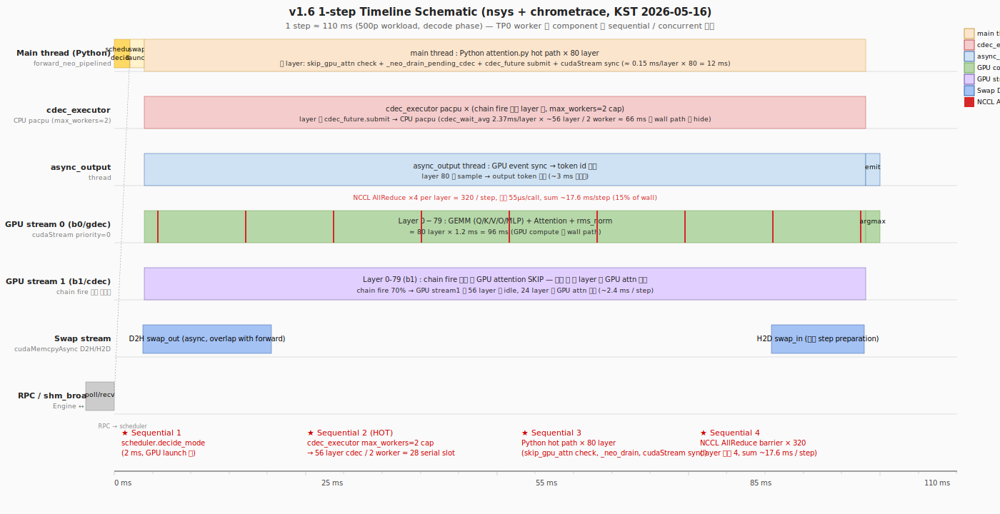

# TSK_019 — Best Configuration index

> Best configuration 영역 history + 개략 정보. 상세 fact = 각 best file 영역.

## Best history (3-run avg/min/max)

| 시각 (KST) | best file | commit | 3-run avg | min | max | CV | wall avg | workload | 22 strict | 비고 |
|---|---|---|---:|---:|---:|---:|---:|---|:-:|---|
| 2026-05-14 ~ 16 | [`Best_v1.6_2157tps.md`](Best_v1.6_2157tps.md) | `64f9e0c48` | **2,197.4** | 2,156.9 | 2,223.8 | **1.62%** | 1,844s | 500p × 8192 | 19/19 | strict 19/19 + shape_mismatch=0. Run 1 (2026-05-14) + Run 2/3 (2026-05-16 회귀) |
| 2026-05-15 20:31 | [`Best_Phase3_1_kmp50.md`](Best_Phase3_1_kmp50.md) | `099d23e54` | 2,038.7 (1-run) | — | — | — | 1,591s | **400p** × 8192 | 19/19 | Phase 3.1 (OMP persist) + KMP_BLOCKTIME=50, single-trial |

## Reference measurements (3-run avg/min/max)

| 시각 (KST) | dir | tps avg / min / max | CV | wall avg | workload | runs | 용도 |
|---|---|---:|---:|---:|---|:-:|---|
| 2026-05-10 17:16 | [`measurements/vanilla_3run_20260510/`](measurements/vanilla_3run_20260510/) | **4,690.7** / 4,690.4 / 4,691.0 | **0.006%** | 873s | 500p × 8192 | 3 | vanilla 분모 (NEO OFF) |
| 2026-05-14 ~ 16 | [`measurements/neo_v1_6_500p_3run_20260516/`](measurements/neo_v1_6_500p_3run_20260516/) | **2,197.4** / 2,156.9 / 2,223.8 | **1.62%** | 1,844s | 500p × 8192 | 3 | v1.6 best (commit `64f9e0c48`) |
| 2026-05-16 07:21 | [`measurements/neo_phase3_1_kmp200_500p_3run_20260516/`](measurements/neo_phase3_1_kmp200_500p_3run_20260516/) | 2,134.9 / 2,013.2 / 2,255.7 | 5.68% | 1,914s | 500p × 8192 | 3 | Phase 3.1 (Persistent OMP) KMP=200 |
| 2026-05-16 09:56 | [`measurements/neo_phase3_1_3_kmp200_500p_3run_20260516/`](measurements/neo_phase3_1_3_kmp200_500p_3run_20260516/) | 2,083.3 / 2,015.4 / 2,145.4 | 3.13% | 1,957s | 500p × 8192 | 3 | Phase 3.1+3.3 (cherry-pick `0717f4b8c`) |

## 개략 정보

### v1.6 (500p best — 3-run avg 2,197.4 tps, CV 1.62%)
- workload: 500p × 8192 in/out (4M total tokens)
- 핵심: shape mismatch fix (`NeoCpuKvBuffer._in_flight_swap_out`)
- 3-run: 2,156.9 / 2,223.8 / 2,211.6 → avg 2,197.4
- vs vanilla 3-run avg 4,690.7: **46.8%**
- 본 plan 의 모든 NEO 측정 중 best

### Phase 3.1+KMP=50 (400p best)
- workload: 400p × 8192 (3.2M total tokens — v1.6 보다 80% 영역)
- 핵심: OMP persistent (omp_set_dynamic(0)) + KMP_BLOCKTIME=50ms
- cdec_wait 영역 2.68→2.38ms (−11.2%)
- Phase 3.4 baseline 영역 (400p, 1,930.5 tps) 대비 +5.61%

### 직접 비교 한계

v1.6 best 2,157 tps (500p) vs Phase 3.1+KMP=50 2,038 tps (400p) 영역 의 workload 영역 다름 — 직접 throughput 영역 비교 X. 동일 workload 영역 (400p) 영역 의 비교:
- Phase 3.4 baseline (400p, env Phase 3.1 적용 X): 1,930.5 tps
- Phase 3.1+KMP=50 (400p): 2,038.7 tps (+5.61%)

## v1.6 1-step Timeline (Sequential bottleneck 식별)

상세: [`measurements/timeline_v16_20260516/README.md`](measurements/timeline_v16_20260516/README.md)

측정: nsys profile + py-spy chrometrace (KST 2026-05-16, v1.6 commit `64f9e0c48` 회귀, 100p × 8192).

**Sequential bottleneck 4 영역** (붉은 ★):
1. `scheduler.decide_mode + sub_batch attach` (~ 2 ms / step, 1.8%)
2. **`cdec_executor max_workers=2` cap** — chain fire 56 layer / 2 worker = 28 serial slot
3. **`Python attention.py hot path × 80 layer`** (~ 12 ms / step, ~11%)
4. **`NCCL AllReduce` barrier × 320 / step** (~ 17.6 ms / step, ~16%)

→ After-NEO plan 의 ★ Top Priority (swap KV manipulation Python+ATen 제거 ≈ wall 의 ~20%) 와 정합.

## variance fact (vanilla vs NEO 측정 3-run avg/min/max)

| path | runs | min — max | avg | CV | vs vanilla |
|---|:-:|---|---:|---:|---:|
| vanilla (500p, NEO OFF) | 3 | 4,690.4 — 4,691.0 | 4,690.7 | **0.006%** | — |
| **NEO v1.6 (commit `64f9e0c48`)** | 3 | 2,156.9 — 2,223.8 | **2,197.4** | **1.62%** | **46.8%** |
| NEO Phase 3.1 (KMP=200, 400p) | 3 | 1,918.6 — 2,251.4 | 2,044.0 | 8.85% | — |
| NEO Phase 3.1 (KMP=200, 500p) | 3 | 2,013.2 — 2,255.7 | 2,134.9 | 5.68% | 45.5% |
| NEO Phase 3.1+3.3 (KMP=200, 500p) | 3 | 2,015.4 — 2,145.4 | 2,083.3 | 3.13% | 44.4% |

→ **v1.6 가 모든 NEO 측정 중 가장 높은 avg + 가장 낮은 CV**. Phase 3.1 (Persistent OMP) / Phase 3.3 (CUDA Stream Priority) 가 v1.6 baseline 보다 throughput **avg −3% ~ −5% 하락** + variance 증가.
→ vanilla = deterministic, NEO = run variance 잔존. variance source = NEO scheduler 의 wall-clock 의존 trigger (`time.time()`, KV pool snapshot 도달 시점) + predictor 의 rolling perfdata 의존 → chain fire 가 sweet spot vs sub-optimal 평형으로 분기. v1.6 의 CV 1.62% 는 Phase 3.1/3.3 가 *오히려* 새 stochastic source 도입했음 시사. 상세 = `measurements/*/README.md`.

## 관련 영역 file

| 영역 | 위치 |
|---|---|
| 5-phase 분석 산출 (Phase A-F) | `analysis/` (13 .md) |
| 본 plan 구현 plan | `After_NEO_implementation_plan.md` |
| v1.6 성능 분석 | `Performance_analaysis_v1.6.md` |
| reference / log archive | `measurements/` |
