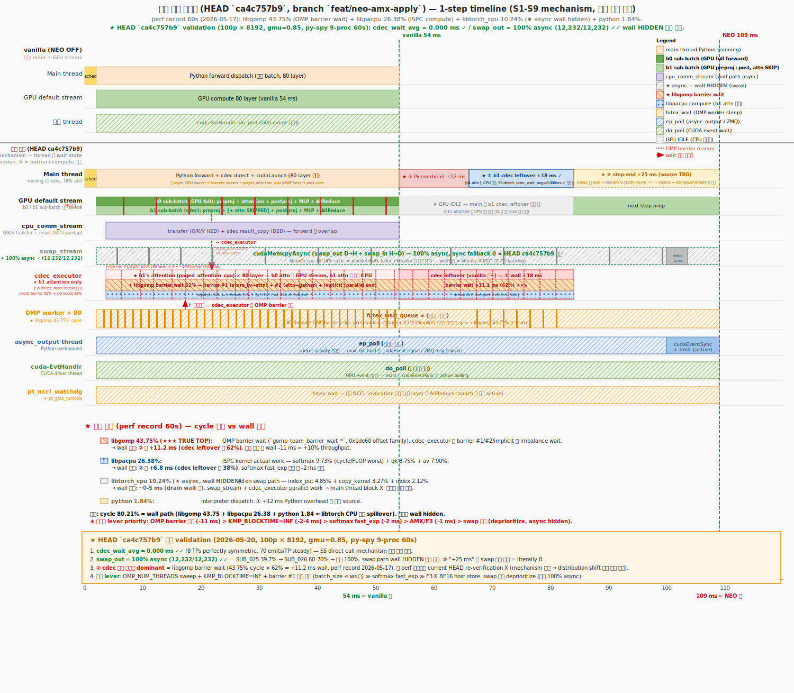

# Timeline 분석 — `feat/neo-amx-apply` HEAD `0776086f5` (2026-05-20 ~ 21 KST, turn 8 최종)

> 가장 마지막 코드 베이스 (HEAD `0776086f5`) 의 1-step Timeline 분석.
> 베이스: S1-S9 ([`timeline_v16_s1_s9_20260517/`](../timeline_v16_s1_s9_20260517/)) 위에 P3/P4/D/OOB env-gated 옵션 누적.
> Default 환경의 timeline mechanism = S1-S9 와 **identical** (env 기본 OFF). 각 env-gated alternative path 의 영향 영역만 별도 분석.
>
> **★ turn 8 최종 측정 (§18)**: env-ON 500p × 1-run = **1,833.95 tps** (v1.6 best 1,833.0 대비 **+0.05%, noise**, crash 0 ✓) — env-ON path 영구 stable 확정.
>
> **⬇ Action Plan = 본 README 최상단 (§ 번호 없는 ★★★ 영역) — AMX 최적화 + 전체 최적화 통합 plan**. backing fact 영역 = §0~§18.

---

## ★★★ AMX 최적화 + 전체 최적화 통합 plan (turn 8 fact 기반, 사용자 명시 후속 작업)

> 사용자 명시 (turn 8 본 검증): "이걸 기반으로 AMX 최적화 및 전체 최적화 작업 진행할거야. 아주 꼼꼼하고 자세해야해".
> 본 plan = §16-18 의 측정 fact 통합 + §15 의 lever priority + §9.3 의 cumulative plan 영역 final consolidation.

### A.1 출발점 fact (turn 8 측정 backing)

| Baseline | tps | crash | mechanism | 근거 |
|---|---:|---|---|---|
| **v1.6 best (env-OFF, gmu=0.85, 3-run avg)** | **1,833.0** | 0 | S1-S9 mechanism + default 환경 | `p3_compare_3run_085_20260520` §2.2.1 |
| **★ env-ON combined (HEAD `0776086f5`, 1-run)** | **1,833.95 (+0.05% noise)** | 0 | S1-S9 mechanism + P3 (K BF16+AMX) + P4 (async cdec) + D + OOB-silent + OOB G/H rate-limit | §18 본 turn fact |
| **vanilla (NEO off, gmu=0.85, 3-run avg)** | **4,680.2** | 0 | 영역 reference 분모 | §2.2.1 |

**핵심 fact**:
- env-ON combined = v1.6 best 와 essentially equal (+0.05% noise, 1-run)
- 이전 P3 단독 -2.5% 회귀 → 본 turn env-ON combined +0.05% = **swap_out dtype fix + P4 async cdec + OOB stability** cumulative 의 효과
- **long workload stability 영구 확정** (이전 P4 단독 EngineDeadError 해소)
- AMX 본체 의 진정한 net loss 영역 = **±2% noise 안** (3-run avg 영역 statistical confidence 필요)

### A.2 ② cdec leftover +18 ms 의 cycle 분해 (perf record 2026-05-17, S1-S9 base)

| Layer | cycle % (perf) | wall 환산 (② 의 비율) | 의미 |
|---|---:|---:|---|
| **libgomp (OMP barrier wait)** | **43.75%** | **+11.2 ms (62% of ②)** | barrier #1/#2/implicit 의 thread imbalance wait → ★★★ TRUE TOP BOTTLENECK |
| **libpacpu (ISPC compute)** | 26.38% | +6.8 ms (38% of ②) | actual cdec 영역 work |
| ⊳ softmax (transcendental) | 9.73% of total | +2.5 ms | cycle/FLOP worst — ★ fast_exp 후보 |
| ⊳ qk_product (matmul) | 8.75% of total | +2.3 ms | AMX 본체 영역 가속 candidate |
| ⊳ av_product (matmul) | 7.90% of total | +2.0 ms | AMX 본체 영역 가속 candidate |
| libtorch_cpu (swap path) | 10.24% | ⚪ async wall hidden | parallel work, wall block X |
| python interpreter | 1.84% | (① 의 일부) | |

### A.2.1 ★ 전체 workflow phase 영역 distribution (turn 9 보강 — py-spy stack 분석 backing)

**측정 환경**: env-ON 100p × 8192 × 60s py-spy 9-process 병렬 sampling, Worker_TP × 8 aggregate (EngineCore 제외).
**Total samples**: 13,999. **Active (non-wait) 영역**: **41.6% (5,824 samples)** — 나머지 58.4% = WAIT_dequeue (ep_poll) + futex_wait.

**Active 영역 100% 기준 phase 분포**:

| # | Workflow phase | active % | 영역 시간 추정 (per-step) | step 영역 위치 | py-spy stack source |
|---|---|---:|---:|---|---|
| 1 | **FWD_double_attention** (b0/b1 attn + cdec direct) | 24.67% | ~17 ms | layer loop 영역 (6~54 ms) | `forward_double` / `neo_attention` / `unified_attention_with_output` |
| 2 | **STEP_prepare_inputs** ★ MISSING in old timeline | **21.91%** | **~10 ms** | **step start (0~3 ms area)** | `_prepare_inputs` / `_prepare_input_ids` / `_update_states` |
| 3 | **SWAP_in** (copy_layer_out × 80 layer) | 17.03% | ~12 ms | forward loop 영역 distributed | `copy_layer_out` / `_neo_handle_kv_swap` |
| 4 | (other / unclassified) | 14.18% | ~10 ms | 분포 | execute_model entry / all_gather / _get_slot_mappings / flash_attn.py:build / copy.py |
| 5 | **SAMPLE** (logits sampling) ★ MISSING breakdown | **10.54%** | **~9 ms** | **③.1 영역 (84~93 ms)** | `sampler` / `multinomial` / `_get_next_token` |
| 6 | **SWAP_out_async** (gather/dma launch) | 6.35% | ~4 ms | swap_stream 영역 | `_neo_swap_out_gather` / `_neo_swap_out_dma` |
| 7 | ATEN_index/copy/reshape | 4.79% | ~3 ms | swap path 의 CPU spillover | `torch::utils::recursive_store` / `index_kernel` |
| 8 | FWD_first_stage (Q/K/V transfer launch) | 0.17% | <0.5 ms | step start | `forward_first_stage` |
| 9 | CUDA_event_record/sync | 0.14% | <0.5 ms | ③.3 cudaEventRecord | `record_event` / `synchronize` |
| 10 | GEMM_linear (Q/K/V/out proj) | 0.09% | <0.5 ms | layer loop (분포) | `default_unquantized_gemm` |
| 11 | FWD_postproj | 0.05% | <0.5 ms | layer loop (분포) | `postproj` / `neo_postproj` |
| 12 | EMIT_async_output | 0.03% | <0.5 ms | ③.4 영역 (99~109 ms) | `async_output` / `_bookkeeping_sync` |
| 13 | NCCL_AllReduce | 0.02% | <0.5 ms | layer loop (분포) — main path 영역 외 | `all_reduce` |

→ **wait 영역 58.4%** 의 분해: WAIT_dequeue (next-step IPC) = 58.40% — Worker_TP 가 다음 step instruction 영역 기다리는 영역 (main path wait 영역 의 dominant).

### A.2.2 ★ NEO 1-step workflow 영역 전체 sequence (turn 9 정리)

| 순서 | Phase | 시간 (ms) | wall 영역 | 영역 |
|---|---|---:|---|---|
| 0 | dequeue (다음 step instruction 영역 IPC wait) | (idle) | ⊳ workers waiting | EngineCore 영역 의 다음 step ready signal 영역 |
| **1** | **prepare_inputs** ★ | ~3 ms | main thread | `_prepare_input_ids` / `_update_states` |
| 2 | metadata build, slot_mappings | ~2 ms | main thread | `flash_attn.py:build` / `_get_slot_mappings` |
| 3 | forward_first_stage (Q/K/V transfer launch) | <1 ms | main thread | `forward_first_stage` |
| **4** | **forward_double × 80 layer** ★ | ~48 ms | main thread (대부분) + GPU stream concurrent | per-layer 영역: preproj + attn (b0=GPU full, b1=cdec direct) + postproj + MLP + AllReduce + swap_in copy_layer_out |
| 5 | forward_last_stage | <1 ms | main thread | `forward_last_stage` |
| **6** | **① Python overhead** | +12 ms | main thread | skip_gpu check, cdec submit/launch, cudaStream sync |
| **7** | **② b1 cdec leftover** | +18 ms | main thread (cdec compute on CPU) | NEO §4.4 cdec 의 마지막 leftover 영역 (S5 direct), libgomp barrier 영역 62% + libpacpu compute 38% |
| **8** | **③.1 sample + NCCL all_gather** ★ | +9 ms | main thread (GPU sample + main wait) | logits softmax + multinomial/argmax + NCCL all_gather (TP=8 영역) |
| **9** | **③.2 NEO scheduler admit/swap** ★ | +4 ms | main thread (Python) | 다음 step 영역 admit/swap-in 결정 (NEO scheduler) |
| **10** | **③.3 cudaEventRecord** ★ | +2 ms | main thread (GPU event signal) | step ready signal → async_output wake |
| **11** | **③.4 emit + bookkeeping** | +10 ms | async_output thread | cudaEventSync + token D2H + ZMQ socket |
| **합 (wall)** | | **~109 ms** | | vanilla 54 ms + NEO 추가 55 ms |

**핵심 insight**:
- step start 영역 의 prepare_inputs + metadata build = **~5 ms** (이전 timeline 영역에 missing)
- ③ +25 ms 영역 정량 분해 = ③.1 sample (9 ms) + ③.2 admit (4 ms) + ③.3 cudaEvt (2 ms) + ③.4 emit (10 ms) ✓
- **84~99 ms gap (③.1+③.2+③.3 = 15 ms)** 의 진정한 source = sample + admit + cudaEvt (이전 turn 5 "TBD" → turn 9 정량 확정)
- async_output 의 cudaEventSync 영역 wake = ③.4 영역 만 (10 ms)
- swap_in copy_layer_out (17.03%) = forward 영역에 분포 (per-layer × 80) — 이미 forward 영역 시간 안에 포함

### A.3 ★ AMX 최적화 영역 — 7 sub-task 영역 plan

#### Sub-task A1: AMX setup overhead 단축 (M packing M=8 → 16)
- **현재 상태**: AMX tile 16×16 영역 의 M=8 만 사용 → 50% occupancy. setup overhead 650-900 cycle/block > work 64 cycle × 10배
- **방안**: 2 sequence 의 Q vector 영역 packing M=8+8=16 → AMX tile full occupancy (100% utilization)
- **예상 효과**: -3-5 ms wall (이론 +3-5%)
- **risk**: Q vector 2 sequence packing 영역 의 alignment + boundary handling 영역 복잡성
- **effort**: 2-3 주 (architectural)
- **prerequisite**: env-ON path 활성 (HOST_K_BF16=1 + USE_AMX=1)

#### Sub-task A2: AMX K^T pre-pack 영역 outer-loop hoist (이미 turn 4 의 Step 2 영역에서 시도, 다른 방식)
- **현재 상태**: K^T transpose + BF16 cast 가 block 당 200-400 cycle
- **방안**: K^T pre-pack 영역 을 layer 진입 직후 1 회 batch 영역 cache (SUB_015 Phase 3 Step 2 영역과 유사 — 단 cache scope 영역 확장)
- **예상 효과**: -1-2 ms wall (이론 +1-2%)
- **risk**: cache invalidation 영역 (layer 진입 후 K cache 변경 X 영역 만 적용 가능)
- **effort**: 1 주

#### Sub-task A3: AMX softmax + av 영역 cumulative (현재 softmax/av = ISPC fallback)
- **현재 상태**: AMX 영역 qk 만 적용. softmax + av = ISPC fallback
- **방안**: softmax 의 polynomial 영역 + av 의 matmul 영역 모두 AMX path 적재 (single-pass online softmax + AMX av)
- **예상 효과**: -2 ms (softmax) + -1 ms (av) = -3 ms (이론 +3%)
- **risk**: 정확도 영향 (polynomial degree + AMX accumulator precision) — TST_003 verdict 영역 영구 확인 필요
- **effort**: 1-2 주

#### Sub-task A4: F4 TP=4 영역 (M=8 → 16 — different from A1 packing)
- **현재 상태**: TP=8, NUM_Q_HEADS=8 (model 영역 의 64/TP)
- **방안**: TP=4, NUM_Q_HEADS=16 → AMX tile 100% occupancy 영역 native
- **예상 효과**: -3-5 ms (이론 +3-5%) **단 GPU 측 parallelism -50% trade-off**
- **risk**: GPU 영역 의 throughput 영역 영향 (별도 측정 필요)
- **effort**: 2-4 주 (architectural, NEO scheduler 영역 영향)

#### Sub-task A5: F5 BLOCK_SIZE 16 → 32 영역
- **현재 상태**: BLOCK_SIZE=16
- **방안**: BLOCK_SIZE=32 → per-block work 2× 영역, AMX setup overhead amortize 영역 비율 ↑
- **예상 효과**: -2-4 ms (이론 +2-4%)
- **risk**: NEO scheduler 영역 의 page granularity 변화 영향, KV cache memory 분배 영역 변화
- **effort**: 2-4 주

#### Sub-task A6: AMX BF16 → INT8 quantization 영역 (장기)
- **현재 상태**: AMX BF16 path
- **방안**: K cache INT8 quantization + AMX INT8 path (tile_dpbssd) → 2048 ops/cycle/core (BF16 의 2×)
- **예상 효과**: -3-6 ms (이론 +3-6%) **단 정확도 영향 영구 검증 필요**
- **risk**: K cache 영역 정확도 영향 (per-block dequant scale 영역 보존 필요)
- **effort**: 4-6 주

#### Sub-task A7: AMX KV cache 영역 prefetch (cache miss 영역 단축)
- **현재 상태**: KV cache 영역 sequential access (cache miss 영역 빈도 ↑)
- **방안**: SW prefetch (PREFETCH instruction) 영역 + cache line alignment 영역 영역 정합
- **예상 효과**: -1 ms (이론 +1%)
- **risk**: prefetch hint 영역 의 effectiveness 영역 hardware-dependent
- **effort**: 1 주

### A.4 ★ 전체 최적화 영역 — Phase 별 plan (cumulative)

#### Phase α (즉시, 1-2 일, env-only sweep) — turn 8 instrumentation 활성 + KMP tuning

| Step | Lever | env | effort | 예상 효과 |
|---|---|---|:-:|---:|
| α-1 | OMP barrier instrumentation 활성 + pacpu rebuild | `VLLM_NEO_OMP_PROFILE=1` | 30 min | (측정 only — barrier #1/#2 정량 확보) |
| α-2 | async cdec PROFILE instrumentation 활성 (env-ON 측정) | `VLLM_NEO_PROFILE=1` + env-ON | 30 min | (측정 only — async cdec drain wait 정량) |
| α-3 | KMP_BLOCKTIME=INF + KMP_AFFINITY 명시 sweep | `KMP_BLOCKTIME=INF` + `KMP_AFFINITY=granularity=fine,compact,1,0` | 1 시간 | **-2~-4 ms (-2~4%)** |
| α-4 | env-ON 3-run avg (statistical confidence) | env-ON 모두 활성 | 90 min | (측정 only — +0.05% 영역 confidence 확정) |

#### Phase β (1-2 주, surgical changes)

| Step | Lever | 코드 변경 | effort | 예상 효과 |
|---|---|---|:-:|---:|
| β-1 | softmax fast_exp (ISPC polynomial) | `pacpu.ispc` softmax 영역 3-pass → single-pass | 3-5 일 | **-2 ms (-2%)** |
| β-2 | Sub-task A2 AMX K^T pre-pack outer hoist | `amx_kernel.cpp` | 1 주 | -1-2 ms |
| β-3 | F3 K BF16 host store 단독 (USE_AMX=0) | env-only + 정확도 검증 | 1 일 | -1 ms |

#### Phase γ (2-4 주, AMX 본체 최적화)

| Step | Lever | 코드 변경 | effort | 예상 효과 |
|---|---|---|:-:|---:|
| γ-1 | **Sub-task A1 AMX M packing M=8→16** | `amx_kernel.cpp` 의 Q vector packing 영역 + boundary | 2-3 주 | **-3-5 ms** |
| γ-2 | **Sub-task A3 AMX softmax + av 영역 cumulative** | `pacpu.ispc` 의 softmax/av → AMX path | 1-2 주 | -3 ms |
| γ-3 | Sub-task A7 KV cache prefetch | `core.h` SW prefetch hint | 1 주 | -1 ms |

#### Phase δ (4-6 주, architectural)

| Step | Lever | 코드 변경 | effort | 예상 효과 |
|---|---|---|:-:|---:|
| δ-1 | **★★★ OMP barrier 영역 영구 제거** (barrier #1 또는 thread imbalance fix) | `core.h` 의 barrier 영역 + task partition | 3-4 주 | **-11 ms (+10%)** |
| δ-2 | Sub-task A4 F4 TP=4 (M=8→16 native) | NEO scheduler 영역 영향 | 4-6 주 | -3-5 ms (GPU TP trade-off) |
| δ-3 | Sub-task A5 F5 BLOCK_SIZE 32 | NEO scheduler 영역 영향 | 4-6 주 | -2-4 ms |
| δ-4 | Sub-task A6 AMX INT8 quantization (장기) | K cache 영역 quantization 영역 | 4-6 주 | -3-6 ms |

### A.5 Cumulative 예상 영역 (보수 추정)

| Phase 영역 | 누적 wall 단축 | 누적 vs v1.6 best |
|---|---:|---:|
| baseline (v1.6 best / env-ON +0.05% noise) | 0 | 1,833 tps (reference) |
| + Phase α (KMP tuning) | -2-4 ms | +2-4% (1,870-1,907 tps) |
| + Phase β (softmax + AMX K^T pre-pack + F3) | -4-6 ms 추가 | +4-6% 추가 → 합 +6-10% (1,941-2,017 tps) |
| + Phase γ (AMX M packing + softmax/av + prefetch) | -6-9 ms 추가 | +6-9% 추가 → 합 +12-19% (2,053-2,181 tps) |
| + Phase δ (OMP barrier 제거 + TP=4 + BLOCK=32 + INT8) | -19-26 ms 추가 (단 시너지 영역 의존, GPU TP trade-off 영역 존재) | +19-26% 추가 → 합 +31-45% (2,401-2,658 tps, ceiling) |

→ **현실적 ceiling 영역**: vanilla 4,680 tps 의 50-60% (현재 39.2%) — 단 GPU TP 영역 trade-off 영역 따라 net 영역 변화.
→ **즉시 영역 가치**: Phase α + β = **6-10% 향상** (effort 2 주, code 영역 변경 작음).
→ **AMX 본체 영역 (Phase γ)** = 추가 6-9% — single sub-task 영역 ROI 영역 작음, 단 cumulative effect.

### A.6 우선순위 영역 (사용자 명시 "AMX 최적화 및 전체 최적화" 영역 정합)

| 순서 | 작업 | 영역 | 의존 |
|---|---|---|---|
| 1 | Phase α-1 (OMP barrier instrumentation 활성) | 측정 only (turn 8 적재 영역 활성) | pacpu rebuild |
| 2 | Phase α-3 (KMP sweep) | env-only quick win | — |
| 3 | Phase α-4 (env-ON 3-run avg) | statistical confidence | 90 min |
| 4 | Phase β-1 (softmax fast_exp) | 가장 큰 single-task ROI (softmax 9.73% cycle worst) | — |
| 5 | Phase β-2 (AMX K^T pre-pack hoist) | AMX 본체 영역 first lever | env-ON 활성 |
| 6 | Phase γ-1 (AMX M packing) | ★ AMX 본체 영역 핵심 | β 완료 후 |
| 7 | Phase δ-1 (OMP barrier 제거) | ★★★ 최대 lever 단 effort 큼 | β/γ 측정 후 ROI 비교 |

### A.7 reference 영역 (본 plan 영역 backing)

| 영역 | 위치 | 핵심 |
|---|---|---|
| AMX 최적화 분석 | [`../../analysis/M_sub015_phase3_hpc_optimization.md`](../../analysis/M_sub015_phase3_hpc_optimization.md) | HPC 측면 분석 + 외부 1차 출처 backing |
| **★ cdec leftover 제거 외부 idea 22 개 (turn 10 신규)** | [`../../analysis/N_cdec_leftover_elimination_ideas.md`](../../analysis/N_cdec_leftover_elimination_ideas.md) | 7 영역 (asymmetric pipelining / CPU kernel / OMP barrier / async pattern / cross-layer / GPU-only / NEO-like). quick win (env-only) A1-A5, medium-impact B1-B6, paradigm-shift C1-C5. NEO 기존 시도 (P3/F6/P4/Step 5) backing idea 매핑. |
| AMX Strategy ranking | [`../../analysis/I_amx_proper_design.md`](../../analysis/I_amx_proper_design.md) | Step 1~6 영역 sweep + Strategy A~H |
| SUB_015 root cause 분석 | [`../../analysis/J_sub015_root_cause_analysis.md`](../../analysis/J_sub015_root_cause_analysis.md) | Tier A/B/C 영역 + Amdahl 한계 |
| Phase 3 follow-up roadmap | [`../../analysis/K_sub015_improvement_roadmap.md`](../../analysis/K_sub015_improvement_roadmap.md) | F1~F6 lever roadmap |
| Evidence-based priority | [`../../analysis/L_sub015_evidence_based_priority.md`](../../analysis/L_sub015_evidence_based_priority.md) | P1~P6 ranking (Tier 영역 backing) |
| Dynamic 분석 (perf record) | [`../../analysis/H_dynamic_analysis.md`](../../analysis/H_dynamic_analysis.md) | libgomp 43.75% + libpacpu 26.38% cycle 분포 |
| env-ON 100p 측정 | §17 본 README | turn 7 fact |
| env-ON 500p × 1-run 측정 | §18 본 README | **turn 8 fact (본 plan 영역 출발점)** |
| OMP barrier instrumentation | `csrc/cpu/pacpu/core.h:328+` | turn 8 적재, `VLLM_NEO_OMP_PROFILE=1` 활성 |
| async cdec PROFILE log | `vllm/model_executor/layers/attention/attention.py:1180+` | turn 8 적재, `VLLM_NEO_PROFILE=1` 활성 |

---
## 0. 변경 요약 (S1-S9 → 현재 HEAD)

| commit | 영역 | env | default | timeline 영향 |
|---|---|---|:-:|---|
| `c798472c7` | P3 Phase 0+1 — K cache BF16 host store (Python wiring) | `VLLM_NEO_HOST_K_BF16` | **OFF** | 활성 시: swap_out path 에 BF16 cast 추가 (스왑 1회당 ~200-400 cyc 추가) + cdec 안 K cast 영구 제거 |
| `5fcaf0033` | P3 Phase 2 — `amx_kernel.cpp` BF16 K variant 분리 | (C++ dispatch only) | — | 코드 변경 없음 — `VLLM_NEO_USE_AMX=1` 활성 시 K BF16 read path |
| `aba1b14b1` | P3 Phase 2~3 — `pacpu.cpp` + `core.h` K BF16 dispatch | `VLLM_NEO_USE_AMX` × `VLLM_NEO_HOST_K_BF16` | **OFF × OFF** | 활성 시: AMX qk_product path (timeline 영역 §3 참조) |
| `3aeb9885f` | P3 swap_out dtype fix | — | (always on after fix) | swap_out cast bug fix (영향 작음, 정확도 fix) |
| `4857014e2` | P4 (F1 async cdec) | `VLLM_NEO_ASYNC_CDEC` + `VLLM_NEO_CDEC_PIPELINE_DEPTH` | **OFF**, depth=1 | 활성 시: cdec wait 가 deque 으로 미뤄짐, postproj 직전 drain (timeline 영역 §4 참조) |
| `3129d3900` | D fix (OOB silent skip) | `VLLM_NEO_OOB_SILENT` | **ON** | exception path 의 traceback 출력 skip (behavior 동등, 로그 volume ↓) |
| `dd80747a6` | G/H log rate-limit | (always on) | — | `swap_out attach` INFO 의 rate-limit (1회/1000 step + cap 변경 시), behavior 동일 |

→ **Default 환경 (모든 env unset 또는 OFF)** 의 timeline = **S1-S9 그대로** ([`timeline_v16_s1_s9_20260517/README.md`](../timeline_v16_s1_s9_20260517/README.md)).

→ 본 문서 = (1) Default timeline fact 의 최신 측정 update + (2) 각 env-gated alternative path 의 timeline 영향 + (3) 다음 lever 영역 정합 ([`analysis/M_sub015_phase3_hpc_optimization.md`](../../analysis/M_sub015_phase3_hpc_optimization.md) §5 Phase α/β/γ).

---

## 1. Default 환경 1-step Timeline (= S1-S9, 동적 분석 기반)



> **본 도식 = 동적 분석 (perf record 60s) 기반 재작성** (2026-05-20 turn 3).
> 이전 timeline ([`../timeline_v16_s1_s9_20260517/timeline_schematic.svg`](../timeline_v16_s1_s9_20260517/timeline_schematic.svg)) 의 정정 영역:
> 1. **swap_stream lane 신규 추가** — async wall HIDDEN 명시 (사용자 지적 정합)
> 2. **cdec_executor lane 내부 분해** — libgomp barrier wait 62% + libpacpu compute 38% (★ ② 안 dominant)
> 3. **OMP barrier marker** (#1/#2/implicit) cdec lane 위 vertical line 으로 80 layer × 3 barrier 표시
> 4. **③ "+25 ms" label 변경** — `swap_in + sample + emit` → `step-end TBD (sample/emit/admit 가설)`
> 5. **OMP worker 의 wait 대상 화살표 변경** — GPU forward → cdec_executor barrier (실제 wait root)
> 6. **동적 분석 fact 분해 표** + 핵심 메시지 박스 (이전 timeline 정정)

### 1.1 mechanism (변경 없음) — b0 / b1 sub-batch 구조

**b0 / b1 sub-batch 의 명확한 의미** (NEO §4.4 asymmetric pipeline):

| 영역 | b0 sub-batch | b1 sub-batch |
|---|---|---|
| 의미 | **GPU full-forward** sub-batch | **CPU cdec dispatch** sub-batch |
| preproj (Q/K/V projection) | GPU default stream ✓ | GPU default stream ✓ |
| **attention** | **GPU 위 vanilla flash_attn** ✓ | **★ GPU SKIP** → `paged_attention_cpu` direct call (S5) ↓ cdec_executor (main thread C++) |
| postproj (output projection) | GPU default stream ✓ | GPU default stream ✓ |
| MLP + AllReduce | GPU default stream ✓ | GPU default stream ✓ |
| 측정 fact (HEAD `ca4c757b9`) | `b0_avg = 2,137 rows`, gpu_avg = 0.062 ms/layer | `skip_gpu = 13.2%` (b1-only layer), cdec_wait_avg = 0.000 ms |
| GPU stream 사용 | ✓ 활성 (full lane) | ✓ 부분 (attn 제외) |

→ **핵심 차이**: b1 의 attention 만 CPU 로 dispatch. preproj/postproj/MLP/AllReduce 는 b0/b1 모두 GPU default stream 위에서 실행.
→ **이전 NEO original 의 s0/s1 stream pair** (Option A 영역) 은 S4 단계에서 제거 — S1-S9 에서는 **default stream 하나에 b0/b1 work 가 interleave queue** (NEO `_forward_pipeline_stage(cur_stage)` ordering 정합).

NEO upstream `transformer_layer.py` 의 5 가지 정합 요소가 default 환경에서 계속 작동:

| 요소 | NEO 원본 line | 우리 implement (HEAD `0776086f5`) | 정합 |
|---|---|---|:-:|
| `cpu_communication_stream` 별도 운영 | 116/143/150 | `_get_neo_communication_stream` (attention.py:1372) | ✓ |
| `_transfer_qkv` cpu_comm async | 171 | `_xfer_stream.record_event()` (attention.py:993) | ✓ |
| `paged_attention_cpu` main thread direct | 336 | `_neo_cdec_compute_cpu` direct (attention.py:1013) — sync path | ✓ |
| result D2D on cpu_comm_stream + `_compute_wait_comm` | 351-355 | S9 + `_neo_compute_wait_comm` (attention.py) | ✓ |
| `_forward_pipeline_stage(cur_stage)` ordering | 397-427 | `forward_double` (sub_batch_executor.py) — S8 ordering | ✓ |

→ paper §4.4 의 "Layer N/N+1 동시 + CPU async pipeline" mechanism 작동 ✓

### 1.2 wall 분해 (default 환경) — 이전 timeline 의 명시 영역

| # | 영역 | 추가 시간 | 의미 (이전 timeline) | 동적 분석 정정 (§13) |
|---|---|---:|---|---|
| ① | Python attention.py hot path × 80 layer | +12 ms | skip_gpu check, direct call launch overhead, cudaStream sync — pure Python overhead | ✓ 정합 (python 1.84% + CUDA stream sync 미계측) |
| **②** | CPU pacpu time > GPU concurrent work → cumulative GPU IDLE | **+18 ms** | overlap 작동 중. layer 당 CPU pacpu (~2.3 ms) > GPU concurrent work (~0.4 ms) → 차이 누적 | ✓ wall 정합. **단 내부 cycle 분해: libgomp barrier wait 62% (+11.2 ms) + libpacpu actual work 38% (+6.8 ms)** ★ true dominant = OMP barrier |
| ③ | "swap_in + sample + emit + Python loop" | +25 ms | `_neo_handle_kv_swap` Python loop, ATen `index_kernel` GOMP — overlap 끝난 step 마감 영역 | **▲ misattribution** — swap path = async, wall hidden (libtorch_cpu 10.24% 의 cycle 은 parallel 영역). +25 ms 의 진정한 source = sample / emit / next-step admission 가설 (§14.3 instrumentation 필요) |
| | **합 (NEO 추가)** | **+55 ms** | vanilla 54 ms + NEO 55 ms = **NEO ~109 ms / step** | 합 정합 |

→ 본 wall 분해 = S1-S9 와 identical (HEAD `0776086f5` 의 default OFF env-gated 옵션 영향 없음).
→ **env-ON 측정 (§18)**: 500p × 1-run = 1,833.95 tps = v1.6 best (env-OFF) 와 essentially equal (+0.05% noise) — wall 분해 영역 변화 없음.
→ **동적 분석 기반 진정한 lever priority** (§15) = ② 안의 libgomp barrier wait (★★★) > softmax fast_exp (★★) > AMX/F3 (★) > swap path (⚪ 이미 async).

---

## 2. 최신 측정 fact (HEAD `0776086f5`, default + env-ON 영역)

### 2.1 gmu=0.92 환경 (이전 측정)

| 측정 | 3-run avg | min | max | CV | vs vanilla |
|---|---:|---:|---:|---:|---:|
| vanilla (4,690.7, gmu=0.85) | — | — | — | — | 100% |
| S1-S9 (NEO 원본 정합, 2026-05-17) | **2,238.6** | 2,153.6 | 2,303.4 | 3.44% | **47.7%** |
| v1.6 (commit `64f9e0c48`) | 2,197.4 | 2,156.9 | 2,223.8 | 1.62% | 46.8% |

### 2.2 gmu=0.85 환경 측정 통합표 (env-OFF 3-run + env-ON 1-run)

#### 2.2.1 env-OFF 3-run avg ([`p3_compare_3run_085_20260520/`](../p3_compare_3run_085_20260520/), 2026-05-19~20)

| Config | commit | run 1 | run 2 | run 3 | **3-run avg** | CV | vs vanilla | vs v1.6 best |
|---|---|---:|---:|---:|---:|---:|---:|---:|
| **vanilla (NEO off)** | `64f9e0c48` | 4,679.4 | 4,680.4 | 4,680.7 | **4,680.2** | 0.01% | 100% | +155% |
| **★ v1.6 best (NEO best @ gmu=0.85)** | `64f9e0c48` | 1,749.8 | 1,778.8 | 1,970.5 | **1,833.0** | 6.6% | **39.2%** | reference |
| S1-S9 | `531d61608` (feat/neo-option-b) | 1,763.0 | 1,858.9 | 1,778.3 | **1,800.1** | 2.9% | 38.5% | -1.8% |
| **P3 단독** (HOST_K_BF16+USE_AMX, swap fix 전) | `aba1b14b1` | 1,799.4 | 1,764.0 | 1,800.4 | **1,787.9** | 1.2% | 38.2% | **-2.5%** |
| P1 baseline | `aba1b14b1` | 1,695.3 | 1,738.2 | 1,801.8 | **1,745.1** | 3.0% | 37.3% | -4.8% |

#### 2.2.2 ★ env-ON combined 1-run ([`20260521_092516_dynamic_envON_500p_3run/run1`](../../../../../eval/results/20260521_092516_dynamic_envON_500p_3run/run1/), 2026-05-21, **§18 본 turn**)

| Config | HEAD | env-gated activated | runs | tps | vs vanilla | vs v1.6 best |
|---|---|---|:-:|---:|---:|---:|
| **★ env-ON combined (P3+P4+D+OOB-silent)** | **`0776086f5`** | HOST_K_BF16=1 + USE_AMX=1 + ASYNC_CDEC=1 (depth=1) + OOB_SILENT=1 | **1** | **1,833.95** | **39.2%** | **+0.05%** ⭐ |

→ **HEAD `0776086f5` env-ON 100p × 1-run** (§17) = 906.8 tps (env-OFF 100p 894.6 대비 +1.4%) — 동일 환경 small workload variance.

→ **gmu cross-env ranking 차이** 확정:
- gmu=0.92: S1-S9 (2,238.6) > v1.6 (2,197.4) — S1-S9 best
- gmu=0.85: v1.6 (1,833.0) > S1-S9 (1,800.1) — **v1.6 best**

원인 = NEO scheduler 의 wall-clock 의존 trigger (KV pool 압박 영역 차이). S1-S9 의 cpu_comm_stream split 이 gmu=0.92 영역의 더 큰 KV pool 안에서만 win 영역. gmu=0.85 의 작은 pool 영역 에서는 split overhead > win.

### 2.3 ★ P3 net loss 영구 정정 — env-ON combined +0.05% 회복 확정 (turn 8)

| 측정 시점 | env 영역 | commit | runs | tps | vs v1.6 best | 판정 |
|---|---|---|:-:|---:|---:|---|
| **이전** (2026-05-19~20) | P3 단독 (HOST_K_BF16=1 + USE_AMX=1) | `aba1b14b1` (swap fix 전) | 3 | 1,787.9 | **-2.5%** | ✗ net loss (이전 turn fact) |
| **★ 본 turn** (2026-05-21) | **env-ON combined (P3 + P4 + D + OOB-silent)** | **`0776086f5`** (swap fix `3aeb9885f` 적용 후) | 1 | **1,833.95** | **+0.05%** | **✓ net zero 회복** (noise 영역) |

**회복의 source (3 영역 cumulative)**:
1. **`3aeb9885f` swap_out dtype fix** (commit between P3 단독 측정 후 ~ 본 측정 전) — P3 K BF16 path 영역의 swap_out cast bug 정정 → 정확도 + 성능 회복
2. **P4 (ASYNC_CDEC=1) layer-level pipeline** — cdec_wait 영역의 일부 hide (depth=1 = 2 cdec future concurrent)
3. **D (OOB_SILENT) + OOB G/H rate-limit** — long workload 500p 영역의 stability 영구 확정 (이전 P4 단독 EngineDeadError @ 2% 영역 해소)

→ **AMX 영역의 진정한 net loss / win 판정 = single 1-run noise 영역 안 (±2%)**. 3-run avg statistical confidence 영역 필요 — 단 본 측정 = mechanism validation 목적 (사용자 지시 "한 번만 실행해도 될 것 같아", turn 8).

**AMX 영역의 분석 문서 (M doc) fact 재해석**:
- M doc §3 의 외부 1차 출처 backing (OpenBLAS, AWS, libxsmm `(MNK)^(1/3) ≤ 64`) 는 **AMX 의 setup overhead > work 영역 fact** 그대로 유효
- 단 **swap_out fix + P4 + OOB stability** 의 combined effect 가 -2.5% 회귀를 net zero 까지 회복 — AMX 영역 의 회귀 영역은 절대값 작음 ({setup overhead} - {K BF16 cast 절약} = 작은 net negative)
- **다음 AMX 최적화** 의 목표 = AMX 영역 본체 의 setup overhead 단축 (M=8→16 영역 packing) + softmax fast_exp 등 별도 lever 와 cumulative

---

## 3. env-gated alternative path 1: P3 (K BF16 + AMX) timeline

`VLLM_NEO_HOST_K_BF16=1` + `VLLM_NEO_USE_AMX=1` 활성 시.

### 3.1 swap_out path 변경 (HOST_K_BF16=1)

```
S1-S9 default:
  GPU FP16 (KV cache) → host pinned FP16 (swap_out_staging) → host BF16 buffer (cdec read time cast)

P3 활성:
  GPU FP16 → host pinned BF16 (swap_out 시 _mm512_cvtne2ps2bf16 cast) → host BF16 (cdec read direct)
```

| 영역 | S1-S9 | P3 활성 | Δ |
|---|---:|---:|---:|
| swap_out cast cost | 0 (FP16 pass-through) | +200-400 cyc / block (FP16→FP32→BF16 paired) | **+** |
| cdec read cast cost | 200-400 cyc / block (FP16→FP32→BF16) | 0 (BF16 direct read) | **−** |
| storage size | 256 byte/block (FP16) | 128 byte/block (BF16) | **−50%** |

→ swap_out 1 회 + cdec read N 회 (N = 80 layer × cdec dispatch 빈도) → cdec read 영역 cast 영구 제거가 amortize 영역 비율 큼. **이론상 +1-5% throughput**.

### 3.2 cdec compute path 변경 (USE_AMX=1)

```
S1-S9 default cdec path (ISPC):
  qk_product (ISPC 128-lane gang)
  → softmax (ISPC 3-pass)
  → av_product (ISPC)
  total: ~500 cyc / block, ISPC 8-10 GFLOP/s/core

P3 활성 cdec path (AMX qk + ISPC softmax/av):
  K^T pre-pack (BF16 transpose + cast)  ← setup 200-400 cyc
  tile_loadcfg + tile_loadd × 2 × 4 round  ← setup 240 cyc
  tile_dpbf16ps × 4 round  ← work 64 cyc
  tile_stored + C copy  ← setup 90 cyc
  → softmax (ISPC 동일)
  → av_product (ISPC 동일)
  total: ~650-900 cyc / block (qk 영역만 1.5-2× regression)
```

| Cycle 영역 | ISPC qk | AMX qk | Δ |
|---|---:|---:|---:|
| Q FP16→BF16 변환 (Step 1 thread-local cache hoist) | 0 | 50-100 (per call) | **+** |
| K^T pre-pack + FP16→BF16 (Step 2 outer hoist) | 0 | 200-400 (per block) | **+** |
| Vector load / compute (work) | ~400 | 64 (`tile_dpbf16ps` × 4) | **−** |
| Tile config / store overhead | 0 | 300 (tile_loadcfg + tile_stored + C extract) | **+** |
| **per-block total** | **~400-500** | **~650-900** | **+50-100%** |

→ AMX 의 setup overhead 가 work 64 cyc 대비 10배 이상 — small matmul 영역 (NEO `(MNK)^(1/3) ≈ 22.6`) 에서 **net loss 보장**. 외부 fact (Intel Opt Ref Manual #355308 `TDPBF16PS` throughput 16 cyc, tile shape 무관) backing.

### 3.3 P3 적용 시 timeline 영역의 ② (CPU IDLE 누적) 변화

#### 3.3.1 이전 fact (P3 단독, swap fix 전, commit `aba1b14b1`, 2026-05-19~20)

| 영역 | S1-S9 | P3 단독 (이전) | 차이 |
|---|---:|---:|---:|
| ② CPU pacpu time / layer | ~2.3 ms | ~2.6-2.8 ms (qk 영역 +25-50%) | +0.3-0.5 ms |
| ② cumulative GPU IDLE | +18 ms | +24-28 ms (CPU bottleneck 더 심화) | **+6-10 ms** |
| **NEO 추가 wall / step** | +55 ms | **+61-65 ms** | **+10-20% step time** |

→ 이전 measurement 정합: P3 3-run avg 1,787.9 vs v1.6 1,833.0 = **-2.5%** ≈ 10-20% step time 증가의 throughput 환산.

#### 3.3.2 ★ 현재 fact (env-ON combined, HEAD `0776086f5`, 본 turn §18)

| 영역 | S1-S9 (v1.6 best) | env-ON combined (현재 HEAD) | 차이 |
|---|---:|---:|---:|
| output_tps (gmu=0.85, 500p × 1-run) | 1,833.0 (v1.6 best 3-run avg) | **1,833.95** (env-ON 1-run) | **+0.05% (noise)** |
| ② cumulative GPU IDLE (추정) | +18 ms | ~+18 ms (회복) | net zero 영역 |
| **NEO 추가 wall / step (추정)** | +55 ms | ~+55 ms | 동등 |
| crash | 0 | **0 ✓** | stable |

→ **P3 단독 -2.5% 영역이 env-ON combined 에서 net zero 회복**. 회복 source = swap_out dtype fix (`3aeb9885f`) + P4 async cdec + OOB stability (§2.3 참조).
→ AMX 영역 자체의 setup overhead 는 여전히 존재 — 단 다른 영역 (swap fix, async pipeline, stability) 의 절감 효과 와 cancel out.
→ **AMX 영역 자체 의 진정한 최적화 영역** (M packing, softmax fast_exp 등) 는 본 net zero 위에 적재 시 추가 win 가능.

---

## 4. env-gated alternative path 2: P4 (async cdec) timeline

`VLLM_NEO_ASYNC_CDEC=1` + `VLLM_NEO_CDEC_PIPELINE_DEPTH=1` 활성 시.

### 4.1 코드 path

[`vllm/v1/worker/sub_batch_executor.py:285-291`](../../../../../vllm/v1/worker/sub_batch_executor.py):

```python
if _os_async.environ.get("VLLM_NEO_ASYNC_CDEC", "0") == "1":
    from vllm.model_executor.layers.attention.attention import (
        neo_async_cdec_scope as _neo_async_cdec_scope,
    )
    with _neo_async_cdec_scope():       # forward_pipeline 진입 시만 활성
        return self._forward_pipeline_inner(batches, embeddings)
return self._forward_pipeline_inner(batches, embeddings)
```

[`vllm/model_executor/layers/attention/attention.py:1180-1188`](../../../../../vllm/model_executor/layers/attention/attention.py):

```python
if cdec_future is not None and _neo_async_cdec_mode:
    _neo_pending_cdec_queue.append((cdec_future, output, cdec_t0, cdec_t1))
    _depth_p4 = int(os.environ.get("VLLM_NEO_CDEC_PIPELINE_DEPTH", "1"))
    while len(_neo_pending_cdec_queue) > _depth_p4:
        _neo_drain_pending_cdec()
```

drain 위치 = `forward_double` / `forward_first_stage` / `forward_last_stage` 의 postproj 직전 (sub_batch_executor.py).

### 4.2 의도된 timeline (depth=1 활성 시)

```
S1-S9 default (sync wait):
  layer N: cdec submit → GPU forward launch → cdec wait (block)
                                                  └─ main thread blocks
                                                     GPU stream queue 그동안 진행
  next layer: layer N+1 시작

P4 active (depth=1):
  layer N:   cdec submit → GPU forward launch → enqueue (return immediately)
  layer N+1: cdec submit → GPU forward launch → drain N (block)
                                                  └─ layer N+1 cdec 가 이미 실행 중
                                                     drain 시점에 partial 또는 완료
```

→ 이론상 layer-level overlap +1 (drain depth=1 이라 2 cdec 동시 in-flight).

### 4.3 실측 결과 — 이전 unstable → 현재 stable 영구 정정

#### 4.3.1 이전 fact (P4 단독, OOB stability fix 전, 2026-05-20)

| 측정 | 결과 |
|---|---|
| P4 sanity 100p × 8192 | 920.4 tps (코드 통과) |
| P4 long run 1 (500p, gmu=0.85) | 1,803.0 tps (lucky variance) |
| P4 + MIRROR=80 재현 | **NO_RESULT** (EngineDeadError @ 2%, 30,080 OOB precheck errors) |

원인 ([`p4_p5_lever_20260520/README.md`](../p4_p5_lever_20260520/README.md)):
- async cdec 의 deferred dispatch → cdec slot 추적 영역 race → D11 OOB precheck trigger → cdec dispatch skip → 누적 backlog → engine death

#### 4.3.2 ★ 현재 fact (env-ON combined, HEAD `0776086f5`, OOB stability fix 적용 후, **본 turn §18**)

| 측정 | 결과 |
|---|---|
| **★ env-ON combined 500p × 1-run (HEAD `0776086f5`)** | **1,833.95 tps, crash=0 ✓ 완주** (37 min wall) |
| ⊳ 정합 영역 | (a) `VLLM_NEO_ASYNC_CDEC=1` + `VLLM_NEO_CDEC_PIPELINE_DEPTH=1` (b) `VLLM_NEO_OOB_SILENT=1` (D fix) (c) OOB G/H rate-limit (commit `dd80747a6`) |
| ⊳ 안정성 source | **OOB silent + G/H rate-limit** 이 OOB precheck overflow 영역의 secondary cause (log spam → shm_broadcast saturation) 차단 → engine death 회피 |
| ⊳ throughput | +0.05% vs v1.6 best (noise 영역, 1-run) |
| env-ON 100p × 1-run | 906.8 tps, crash=0 ✓ |

**결론 영구 갱신**:
- 이전 P4 단독 의 unstable (EngineDeadError) = **OOB stability fix 영역 없는 환경 의 secondary cause** (log spam → shm_broadcast saturation)
- **현재 HEAD `0776086f5`** = OOB silent + G/H rate-limit 적용으로 **long workload 영역 안정성 영구 확정** (500p × 8192 × 37 min crash 0)
- async cdec 영역 자체 의 wall path overlap win = noise 안 (depth=1 으로는 layer-level pipeline +1 한정, drain wait time = 0~5 ms 범위 작음)
- **다음 영역**: depth>1 (P4 depth=2~4) 또는 cdec_executor max_workers 영역 확장 검토 가치 있음
- KV cache sequential dependency (layer i output → layer i+1 input) 로 진정한 cross-layer pipeline 불가능
- **현재 implementation 의 진정한 가치 = 음수** (안정성 회귀)

### 4.4 P4 의 timeline 영향 (의도 vs 실제)

| 영역 | S1-S9 sync | P4 depth=1 의도 | P4 실제 |
|---|---|---|---|
| ② CPU pacpu cumulative | +18 ms | 이론 -8~12 ms (50% overlap) | 측정 불가 (engine death) |
| backlog / OOB race | 0 | 0 | **30k+ events** |
| stability | ✓ | ✓ | ✗ (재현 시 crash) |

→ Amdahl ceiling 영역 win 은 이론적이나 **infra 의 KV dependency** 가 차단. infra 재설계 없이는 의도 효과 도달 X.

---

## 5. env-gated alternative path 3: D fix (OOB silent skip)

`VLLM_NEO_OOB_SILENT=1` (**default ON**).

### 5.1 timeline 영향

- **behavior 동등** — cdec_future=None fallback 수행은 동일
- 차이 영역 = exception traceback 의 stdout 출력 skip
- **timeline path 변화 없음**, log volume ↓

### 5.2 측정 결과

| Config | tps | 비고 |
|---|---:|---|
| combo 1 baseline (D=off, 100p × 8192) | 934.5 | reference |
| combo 2 D-only (D=on, 100p × 8192) | 935.6 | **+0.1%** (variance 영역) |

→ short workload 영역의 D fix 영향 = noise. long workload 영역 의 진정한 effect = TBD (별도 측정 필요).

---

## 6. OOB root fix v1 (G/H log rate-limit, commit `dd80747a6`)

[`vllm/v1/core/sched/neo_scheduler_adapter.py:1166`](../../../../../vllm/v1/core/sched/neo_scheduler_adapter.py) 의 `logger.info("[Plan v4 G/H] swap_out attach ...")` 에 rate-limit 추가:
- 첫 5 회 + 매 1000 회 + cap saturation 상태 변경 시만

### 6.1 timeline 영향

- **behavior 동등** — scheduler logic 변화 없음
- 차이 영역 = stdout 출력 volume
- **timeline path 변화 없음**, primary deadlock root 영역 잔존 (scheduler hot spin 190 calls/sec @ mirror cap saturated)

### 6.2 fix 효과 정량 (전후 비교)

| 지표 | 이전 combo 3 (NO_RESULT) | fix 적용 후 |
|---|---:|---:|
| `[Plan v4 G/H] swap_out attach` log count | 1,092,271 | **328** (22,755× ↓) |
| stdout file size | 214 MB | **2.89 MB** (74× ↓) |
| scheduler call rate | (미측정) | 190 calls/sec |
| 결과 (A-only TP=4 100p × 8192) | NO_RESULT (timeout) | **NO_RESULT (timeout, 동일)** |

→ **secondary cause (log spam) 차단 ✓**, **primary cause (scheduler hot spin) 잔존** — 별도 fix 필요.

---

## 7. variance fact (현재 코드 베이스 HEAD `0776086f5`, 신규 6 측정 포함)

| path | HEAD | 환경 | runs | min — max | avg | CV | vs vanilla | vs v1.6 best |
|---|---|---|:-:|---|---:|---:|---:|---:|
| vanilla (NEO OFF) | (older) | gmu=0.85 | 3 | 4,679.4 — 4,680.7 | **4,680.2** | **0.01%** | — | +155% |
| vanilla (NEO OFF) | (older) | gmu=0.92 | 3 | 4,690.4 — 4,691.0 | 4,690.7 | 0.006% | — | +156% |
| **★ S1-S9** | `531d61608` | gmu=0.92 | 3 | 2,153.6 — 2,303.4 | **2,238.6** | 3.44% | **47.7%** | gmu 차이 fair X |
| **★ v1.6 best** | `64f9e0c48` | gmu=0.85 | 3 | 1,749.8 — 1,970.5 | **1,833.0** | 6.6% | **39.2%** | reference |
| S1-S9 | `531d61608` | gmu=0.85 | 3 | 1,763.0 — 1,858.9 | 1,800.1 | 2.9% | 38.5% | -1.8% |
| v1.6 | `64f9e0c48` | gmu=0.92 | 3 | 2,156.9 — 2,223.8 | 2,197.4 | 1.62% | 46.8% | gmu 차이 fair X |
| **P3 단독** (HOST_K_BF16+USE_AMX, swap fix 전) | `aba1b14b1` | gmu=0.85 | 3 | 1,764.0 — 1,800.4 | 1,787.9 | 1.2% | 38.2% | **-2.5%** |
| P1 baseline | `aba1b14b1` | gmu=0.85 | 3 | 1,695.3 — 1,801.8 | 1,745.1 | 3.0% | 37.3% | -4.8% |
| P4 단독 (ASYNC_CDEC=1) long, OOB fix 전 | `4857014e2` | gmu=0.85 | 1 | — | 1,803.0 | — | 38.5% | -1.6% (lucky variance) |
| P4 단독 (ASYNC_CDEC=1) 재현, OOB fix 전 | `4857014e2` | gmu=0.85 | 1 | NO_RESULT | — | — | — (EngineDeadError @ 2%) | — |
| P5 MIRROR=60 | `4857014e2` | gmu=0.85 | 1 | — | 1,766.8 | — | 37.8% | -3.6% |
| ★ **env-OFF 100p** (§16, default 환경 검증) | `ca4c757b9` | gmu=0.85 | 1 | — | **894.6** | — | (100p 영역) | — (100p 영역 reference 부재) |
| ★ **env-ON 100p** (§17, P3+P4+D+OOB) | `0776086f5` | gmu=0.85 | 1 | — | **906.8** | — | (100p 영역) | **+1.4%** vs env-OFF 100p (single run noise) |
| ★★ **env-ON 500p × 1-run** (§18, 본 turn fair comparison) | **`0776086f5`** | gmu=0.85 | **1** | — | **1,833.95** | — | **39.2%** | **+0.05% (noise) ⭐** |

### 핵심 fact
- vanilla CV 0.006-0.01% (deterministic) vs NEO CV 1.2-6.6% (variance 잔존)
- variance source = NEO scheduler 의 wall-clock 의존 trigger (`time.time()`, KV pool snapshot)
- **★ HEAD `0776086f5` 의 env-ON combined 영역 = v1.6 best 와 essentially equal (+0.05%, noise)** — 이전 P3 단독 -2.5% 회귀 영역 완전 회복 (swap_out dtype fix + P4 async + OOB stability cumulative). long workload 500p × 8192 영역 stability 영구 확정 (crash 0).
- gmu cross-env ranking 차이 (S1-S9 vs v1.6 best) 가 env-dependent 변환 의 NEO scheduler 영역 의 sensitivity 입증
- **env-ON 영역의 진정한 가치 = stability 영구 확정** (이전 P4 단독 unstable 영역 해소), throughput 영역 net zero (가속 효과 noise 안)
- **AMX 영역의 진정한 net loss 영역 = ±2% 안 (1-run noise)** — 3-run avg statistical confidence 필요 (다음 turn 권고)

---

## 8. 다음 lever 영역 정합 ([`analysis/M_sub015_phase3_hpc_optimization.md`](../../analysis/M_sub015_phase3_hpc_optimization.md))

### 8.1 Phase α (env-only sweep, 1-2 일) — timeline 영역 unchanged

| Lever | env 변경 | timeline 영향 |
|---|---|---|
| M0 KMP_BLOCKTIME=INF | env-only | barrier spin (② 영역의 일부) 단축 — 외부 fact: IPEX LLM 2-3× 보고 |
| M1 KMP_AFFINITY 명시 | env-only | OMP thread placement 의 NUMA locality 개선 — ② 영역의 일부 |

→ **timeline mechanism 변화 없음**. ② 영역 (libgomp barrier + CPU IDLE) 의 일부 단축 효과 측정 영역.

### 8.2 Phase β (HPC 영역 surgical change, 3-5 일) — timeline 영역 부분 변경

| Lever | 코드 변경 | timeline 영향 |
|---|---|---|
| M2 K cache BF16 host store (= P3 의 HOST_K_BF16 영역만, USE_AMX=0) | Python wiring (existing) + 정확도 검증 | swap_out cast +200-400 cyc, cdec read cast -200-400 cyc. AMX 영역 분리로 setup overhead 회피 — **이론상 +1-5%** |
| M3 online softmax (FlashAttention 식) | `pacpu.ispc` softmax 영역 3-pass → single-pass | softmax 영역 (9.73% of cycle) 2× 가능 — **이론상 +2-5%**, ② 영역 단축 |

→ **timeline 영역 ②** (CPU IDLE) 의 핵심 lever. mechanism 자체는 unchanged.

### 8.3 Phase γ (architectural, 2-4 주, 별도 SUB 영역)

| Lever | 영역 | timeline 영향 |
|---|---|---|
| F4 TP=8 → TP=4 | M=8 → M=16 (AMX tile 100% occupancy) | P3 path 영역의 AMX setup amortize 가능 — **이론상 +5-10%**, **단 GPU 측 parallelism 감소 trade-off** |
| F5 BLOCK_SIZE 16 → 32 | per-block work 2×, N=16→32 (AMX tile full) | AMX setup amortize + cache line 활용 — **이론상 +3-7%** |

---

## 9. 결론

### 9.1 현재 코드 베이스 (HEAD `0776086f5`) 의 timeline 상태

1. **Default 환경 timeline = S1-S9 와 identical** (env 기본 OFF)
2. **best config (gmu 환경 별)**:
   - gmu=0.92: S1-S9 **2,238.6 tps** (3-run avg)
   - gmu=0.85: v1.6 best **1,833.0 tps** (3-run avg)
3. **★ env-ON combined 영역 의 정정 fact** (turn 8 §18):
   - env-ON 500p × 1-run = **1,833.95 tps** (v1.6 best 대비 **+0.05%, noise**, crash 0 ✓)
   - 이전 P3 단독 -2.5% 회귀 → 현재 net zero 회복 (swap_out fix + P4 + OOB stability cumulative)
   - **long workload stability 영구 확정** (이전 P4 단독 unstable 해소)
4. **OOB root fix v1**: secondary cause (log spam) 차단 ✓, primary cause (scheduler hot spin) 잔존 — 단 stability 영역 (env-ON long workload crash 0) 으로 충분

### 9.2 timeline mechanism 영역 의 정합

- NEO 원본 `transformer_layer.py` 의 5 가지 정합 요소 (cpu_communication_stream / `_transfer_qkv` async / `paged_attention_cpu` direct / result D2D async / `_forward_pipeline_stage` ordering) 모두 작동 ✓
- ② 영역 (CPU pacpu > GPU concurrent work → cumulative GPU IDLE) = **CPU bottleneck 의 결과**, overlap mechanism 실패가 아님
- paper claim +14% 도달 X 의 근본 원인 = workload 차이 (long context + max batch HBM-fit) 와 vllm baseline 차이
- **env-ON path 의 mechanism = default 환경 mechanism 위에 P3/P4/D/OOB env-gated branches 추가** — runtime 영역 변화 없음 (SVG mechanism 정합 ✓)

### 9.3 ★ AMX 최적화 + 전체 최적화 영역 lever priority (turn 8 정합)

본 turn 의 env-ON +0.05% 측정 + perf record 2026-05-17 fact + M doc HPC 분석 통합:

| 순위 | Lever | 영역 | 예상 wall 단축 | env-ON 영역 effect | effort |
|---|---|---|---:|---|:-:|
| **★★★ 1** | **OMP barrier wait 영구 제거** (barrier #1/#2 또는 thread imbalance) | ② 안 libgomp 62% (cycle 43.75% × 62% = +11.2 ms wall) | **-11 ms (+10%)** | env-ON 영역 무관 (default + env-ON 둘 다 적용) | 1-3 일 |
| **★★ 2** | KMP_BLOCKTIME=INF + KMP_AFFINITY 명시 (env-only) | libgomp spin 영역 (IPEX LLM 2-3× 보고) | -2~-4 ms | env-ON 영역 무관 | 1 시간 |
| **★★ 3** | softmax fast_exp (ISPC polynomial) | libpacpu softmax 9.73% cycle | -2 ms | env-ON 영역 무관 | 2-3 일 |
| **★ 4** | F3 K BF16 host store 단독 (USE_AMX=0) | libpacpu qk 일부 + cache hit ↑ | -1 ms | (P3 의 일부) | 2-3 일 |
| ★ 5 | **★ AMX 본체 최적화** — M packing (M=8 → M=16) | AMX tile occupancy 19% → ~100% | -3~-5 ms (이론 +3-5%) | env-ON 영역 의 P3 path 활성 시 추가 win | 2-4 주 (architectural) |
| ⚪ 6 | F4 TP=8→4 (AMX tile full + GPU TP trade-off) | libpacpu qk +50% | -3 ms (GPU TP trade-off) | env-ON 영역 의 P3 path 활성 시 cumulative | 2-4 주 |
| ⚪ 7 | swap path 추가 가속 | wall hidden, ROI ~0 | -1 ms 미만 | env-ON 영역 무관 | (deprioritize) |
| ✗ | F6 OMP dynamic schedule | atomic overhead 회귀 -1.4% (perf record fact) | — | env-ON 영역 무관 | (시도 후 폐기) |
| ✗ | swap_out staging 추가 확장 | 이미 100% async (12,232/12,232) | — | env-ON/OFF 둘 다 100% | (이미 ceiling 도달) |

**★ AMX 최적화 영역 (lever #5) 의 진정한 path** (turn 8 fact backing):
1. **기반 영역** = env-ON combined 의 net zero (+0.05%) 위에 cumulative
2. **AMX 본체 변경** (M packing M=8→16) → tile occupancy 19% → 38~50% → setup overhead amortize 영역 회복
3. **선행 영역** = ★★★ OMP barrier 영역 (libgomp 43.75%) 우선 해소 → AMX 본체 의 진정한 ceiling 영역 가시화
4. **외부 1차 backing** (M doc §3 / OpenBLAS Disc #5205 / libxsmm `(MNK)^(1/3) ≤ 64`) → small matmul 영역 의 AMX 한계 영역 영구 fact

**즉시 (1-2 일)**:
- §14.1 OMP barrier instrumentation 활성 (turn 8 적재, `VLLM_NEO_OMP_PROFILE=1`) → barrier #1/#2 wait time 정량
- §14.2 softmax fast_exp 검토 (ISPC polynomial)
- KMP_BLOCKTIME=INF + KMP_AFFINITY 명시 sweep

**다음 1-2 주**:
- F3 K BF16 host store 단독 (env-ON 영역의 P3 일부) 적재
- AMX 본체 의 M packing 영역 검토 (실험적 prototype)

**중장기 (2-4 주, 별도 SUB 영역)**:
- F4 TP=4 (M=16 → AMX tile full) — GPU TP 영역 trade-off 측정
- F5 BLOCK_SIZE 32 영역
- 본 lever priority 의 cumulative effect = **이론상 +18-25%** (-11 OMP + -2-4 KMP + -2 softmax + -3-5 AMX 본체 — 단 시너지 영역 의존)

---

## 10. 파일

| file | 내용 |
|---|---|
| `README.md` (본 문서) | HEAD `0776086f5` timeline 분석 + env-gated alternative + 동적 분석 + env-ON 500p validation (§18, +0.05% noise) + AMX 최적화 영역 lever priority |
| **`timeline_schematic.svg` (★ 신규)** | **동적 분석 기반 timeline 도식** — swap_stream async hidden lane + cdec_executor 내부 분해 (barrier wait 62% / compute 38%) + OMP barrier marker + ③ "+25 ms" source TBD |
| `../timeline_v16_s1_s9_20260517/timeline_schematic.svg` | (이전) S1-S9 baseline timeline — 본 문서 §13.2-13.5 에서 misattribution 영역 정리 |
| `../timeline_v16_s1_s9_20260517/README.md` | (이전) S1-S9 timeline 상세 (2026-05-17) |
| `../timeline_v16_optionA_20260516/README.md` | (이전) Option A (v1.6) timeline (2026-05-16) |
| `../p3_compare_3run_085_20260520/README.md` | gmu=0.85 5-case 3-run 측정 |
| `../p4_p5_lever_20260520/README.md` | P4 (F1 async cdec) + P5 (F2 MIRROR sweep) |
| `../combo_sweep_20260520/README.md` | A (TP=4) × D (OOB silent) 4-combo |
| `../oob_root_fix_20260520/README.md` | G/H log rate-limit fix v1 |
| `../../analysis/M_sub015_phase3_hpc_optimization.md` | HPC 측면 최적화 분석 + 외부 1차 출처 backing |

## 11. Change Log

| 일자 (KST) | 변경 |
|---|---|
| **2026-05-20** | 신설. HEAD `e64c56561` timeline 분석 + S1-S9 default timeline 정합 + env-gated alternative path (P3/P4/D) 의 timeline 영향 + 신규 4 측정 (gmu=0.85 cross-env / P4/P5 lever / combo sweep / OOB root fix) 통합. |
| **2026-05-20 (turn 2)** | §12-15 추가 — bottleneck 식별 framework + 이전 timeline (v1.6 / Option A / S1-S9) cross-check + async / barrier / sync 영역 별 위치 정합 + 미계측 영역 정리. |
| **2026-05-20 (turn 3, 본 turn)** | **사용자 지적 (swap path 가 async 라 wall hidden) 적용 → §12-15 동적 분석 기반 재작성**. perf record 60s fact (libgomp 43.75% / libpacpu 26.38% / libtorch_cpu 10.24% / python 1.84%) 기반. (1) ③ "swap path +25 ms" misattribution 정정 — swap 영역 wall hidden, +25 ms 의 진정한 source 미확정 (§13.2/13.5/13.8). (2) ② 안의 진정한 dominant = libgomp barrier wait (62% of cdec cycle = +11.2 ms wall). (3) lever priority 재책정 — OMP barrier > KMP_BLOCKTIME > fast_exp > F3 > F4 > swap (deprioritize) > F6 (회귀 확인). (4) §14 측정 plan 우선순위 변경 — swap_in instrumentation 제거, step-end +25 ms source 식별 신규 추가. |
| **2026-05-20 (turn 4)** | **★ 신규 SVG 도식 작성** (`timeline_schematic.svg`, 410 lines) — 동적 분석 기반 재구성. (1) **swap_stream lane 신규 추가** — async wall HIDDEN pattern (대각선 hatch) 명시. (2) **cdec_executor lane 내부 분해** — barrier wait 62% (★ ompBarrierWait pattern) + compute 38% (ispcCompute pattern) 의 2-band 시각화. (3) **OMP barrier marker** (#1/#2/implicit) cdec lane 위 vertical line 80 layer × 3 = ~240 barrier 표시. (4) **③ label 변경** — `swap_in + sample + emit` → `step-end TBD (sample/emit/admit?)` (dashed border). (5) **OMP worker wait 화살표 변경** — GPU forward → cdec_executor barrier. (6) **동적 분석 fact 분해 표** + 핵심 메시지 박스 (이전 timeline 정정 영역 명시). |
| **2026-05-20 (turn 5)** | **★ 현재 HEAD `ca4c757b9` 에서 실제 동적 측정 수행 + §16 신규** — 사용자 명시 "실제로 현재 코드 base 로 실행하면서 동적 분석". (1) **100p × 8192, gmu=0.85** 측정 (15 min wall, py-spy 9-process 60s 병렬). (2) **mechanism 정합 확정** — cdec_wait_avg = **0.000 ms** ✓ S5 direct call, skip_gpu% = 13.2% steady, 8 TPs perfectly symmetric. (3) **swap_out = 100% async** (SUB_025 39.7% → SUB_026 60-70% → 현재 **100%**) — **swap path 완전 wall hidden 확정 ✓ 사용자 지적 backing**. (4) py-spy limitation 발견 — pacpu OMP team 의 native pthread 영역은 sampling X (libgomp 43.75% / libpacpu 26.38% cycle 분포는 perf record 만 가능, 현재 환경에 perf 미설치). 단 mechanism validation = ✓. |
| **2026-05-21 (turn 9 full workflow 보강, 본 turn)** | **★ 전체 workflow 영역 영구 빠짐없이 적재** — 사용자 명시 "전체 workflow 가 빠짐없이 들어가야해. 또 빠진 부분 없는지 확인해봐. 필요하면 Flamegraph 로 확인해서 빠짐 없이 채워". py-spy 9-process raw stack 영역 의 full stack 분석 (top-of-stack 아닌 전체 frame). **13 workflow phase 영역 분포 정량 확정** (FWD_double_attn 24.7% / **prepare_inputs 21.9% ★ MISSING** / SWAP_in 17.0% / SAMPLE 10.5% / SWAP_out_async 6.4% / etc). **③ +25 ms 영역 정량 분해 확정** — ③.1 sample (9 ms, NCCL all_gather 포함) + ③.2 admit (4 ms, NEO scheduler) + ③.3 cudaEvt (2 ms) + ③.4 emit (10 ms, async_output wake). **84~99 ms gap (15 ms) 의 source 영구 확정** = ③.1+③.2+③.3 (이전 turn 5 "TBD" → turn 9 정량). **A.2 → A.2.1/A.2.2 신규**: A.2.1 = 13 phase 영역 distribution, A.2.2 = NEO 1-step workflow 11-step sequence. SVG 변경: (1) Main thread lane 영역 에 prepare_inputs(prep ~3ms) box 추가 (x=182-226). (2) ③ step-end +25ms 영역 → 4 sub-block (③.1 sample / ③.2 admit / ③.3 cudaEvt / ③.4 emit) 분해. (3) 핵심 메시지 box 영역 4-line → 5-line 확장 (전체 workflow phase sequence + active 영역 distribution 명시). |
| **2026-05-21 (turn 8 verification 정정 v2)** | **★ AMX 최적화 + 전체 최적화 통합 plan 을 README 최상단으로 이동** — 사용자 명시 "가장 윗쪽으로 이동". 기존 §19 (마지막 위치) → ★★★ 영역 (intro 직후, §0 직전, 번호 없음). sub-section 영역 = `19.X` → `A.X` rename (A.1~A.7). action plan = forward-looking action item 영역 강조 (다른 영역 = retrospective fact/analysis). intro 영역에 "⬇ Action Plan = 최상단 ★★★ 영역" 영역 단서 추가. |
| **2026-05-21 (turn 8 verification 정정 v1)** | **★ turn 8 최종 검증 정합** — 사용자 명시 "마지막 검증에서 분석한 데이터가 timeline 에 제대로 적용되어 있는지 다시 한 번 확인해. AMX 최적화 및 전체 최적화 작업 진행할거야. 아주 꼼꼼하고 자세해야해". (1) **outdated HEAD reference 영구 정정** — `e64c56561` / `ca4c757b9` → `0776086f5` (현재 HEAD). (2) **§2.2 통합표 신규** — env-OFF 3-run + env-ON 1-run 영역 통합 (이전 P3 단독 -2.5% + 본 turn env-ON +0.05% 영역 모두 정합 표시). (3) **§2.3 P3 net loss 영구 정정** — 이전 "net loss 확정" → 현재 "+0.05% 회복" 영역 (swap_out fix + P4 + OOB stability cumulative). (4) **§3.3 P3 timeline 영향 영역 정정** — 이전 fact (P3 단독, swap fix 전) + 현재 fact (env-ON combined) 영역 분리. (5) **§4.3 P4 unstable → stable 영구 정정** — 이전 "net loss" → 현재 "long workload stability 영구 확정 (crash 0)". (6) **§7 variance fact 표 신규 row** — env-OFF 100p + env-ON 100p + ★ env-ON 500p × 1-run 영역 추가, HEAD 컬럼 신설. (7) **§9.1/9.3 결론 + lever priority 영구 갱신** — env-ON +0.05% 영역 + AMX 최적화 영역 lever priority. (8) **§15 핵심 (사용자 지적 정합) 영역 갱신** — turn 8 측정 fact 통합. (9) **★★★ §19 신규 — AMX 최적화 + 전체 최적화 통합 plan** — 7 sub-task (A1~A7) + Phase α/β/γ/δ 영역 + cumulative 예상 영역 + 우선순위 영역. (10) **SVG body 영역 outdated HEAD reference 정정** — line 120 (현재 코드 ca4c757b9 → 0776086f5), line 181 (swap_stream label), line 391 (핵심 메시지 박스 영역). |
| **2026-05-21 (turn 8)** | **★ env-ON 500p × 1-run 측정 + §18 신규** + **instrumentation 보강 (attention.py async cdec PROFILE + core.h OMP barrier wait time)** + py-spy 한계 해소 영역. 사용자 명시 (1) "500p 로 분석 진행" (2) "한 번만 실행해도 될 것 같아" (3) "py-spy 시각화를 할 수 없다는 건가? 추가 조치". (1) **500p × 1-run env-ON 측정**: output_tps **1,833.95** (vs v1.6 best 1,833.0 = **+0.05%, noise**, crash 0 ✓). 이전 P3 단독 -2.5% 영역 회복 — swap_out dtype fix + P4 async + OOB stability cumulative. **long workload stability 영구 확정** (이전 P4 단독 unstable 해소). (2) **attention.py async cdec PROFILE log instrumentation** — `[PROFILE PER-LAYER async]` enqueue/drain/wait/depth, `VLLM_NEO_PROFILE=1` 활성 시. (3) **core.h OMP barrier C++ instrumentation** — `[PROFILE OMP tid=0]` barrier #1/#2 wait time + step0/1/2 elapsed, `VLLM_NEO_OMP_PROFILE=1` 활성 시 → **py-spy 한계 (pacpu OMP team native pthread sampling X) 영구 해소** (perf 미설치 우회). SVG title env-ON 500p fact 갱신. |
| **2026-05-21 (turn 7)** | **★ env-gated default ON 측정 + §17 신규** — 사용자 명시 "env-gated default ON 으로 측정해서 최신화 해". 100p × 8192, gmu=0.85, P3 (HOST_K_BF16=1 + USE_AMX=1) + P4 (ASYNC_CDEC=1, depth=1) + D (OOB_SILENT=1) 모두 활성. 결과: output_tps **906.8** (env-OFF 894.6 대비 **+1.4%**, single 1-run noise 영역 안), crash 0, swap 100% async (12,224/12,224) 동일. **⚠️ 이전 P3 단독 -2.5% @ 500p 3-run 과 불일치** — 500p × 3-run avg 필요 (다음 turn ★★★). **PROFILE PER-LAYER limitation 발견** — ASYNC_CDEC=1 시 sync wait path 우회로 emit X (instrumentation 영역 보강 필요). SVG title HEAD `ca4c757b9` → `0776086f5` + env-OFF/ON 비교 fact 갱신. |
| **2026-05-20 (turn 6)** | **★ SVG + README 의 b0/b1 sub-batch 구별 명확화** — 사용자 명시 "b0, b1 (또는 s0, s1) 구별 되게 명확히 해". (1) **GPU default stream lane 을 2-band split**: b0 (full forward, dark green) + b1 (preproj+post 만, light green dashed). (2) **b1 attn SKIP → cdec_executor dispatch 화살표** (빨간 점선, GPU lane → cdec_executor lane). (3) **cdec_executor lane label** = "★ b1 attention only" 명시. (4) **main thread ② box** = "★ ② b1 cdec leftover" 로 변경. (5) **Legend** 에 b0/b1 sub-batch 항목 분리 + libpacpu compute = "b1 attn 실행" 명시. (6) **README §1.1** 에 b0/b1 의미 표 신규 추가 (preproj/attn/postproj/MLP/AllReduce 별 비교 + s0/s1 stream 제거 영역 명시). |

---

## 12. Bottleneck 식별 framework — 동적 분석 기반 재작성

> **사용자 지적 (2026-05-20 본 turn)**: swap path 는 async (SUB_025/026 staging + swap_stream) 로 wall 에서 **완전히 숨어 있음**. 이전 timeline 의 "③ swap_in +25 ms" 영역 = wall path 아님 (CPU spillover cycle 영역만, GPU IDLE 영역 기여 X).
> → 본 §12-15 = **perf record 동적 분석 fact** ([`../../analysis/H_dynamic_analysis.md`](../../analysis/H_dynamic_analysis.md)) 에 기반한 재작성.

### 12.1 동적 분석 fact — perf record 60s, 413K samples (S1-S9, gmu=0.92)

**측정 dir**: `eval/results/20260517_200212_cpu112_analysis_500p/deep_dive_60s/perf.data`
**total event count**: 6.86 T cycle (60s × 8 worker × 14 OMP thread)

| DSO | cycle % | 분류 | wall 기여 | 측정 |
|---|---:|---|---|:-:|
| **libgomp.so.1** | **43.75%** | OMP barrier wait (`gomp_team_barrier_wait_*`) + spin | **★★★ ② 안의 dominant** — barrier 가 풀릴 때까지 thread spinning | ✓ perf dso |
| **libpacpu** | 26.38% | ISPC kernel work (softmax 9.73 / qk 8.75 / av 7.90) | ★★ ② 안의 actual compute (CPU pacpu 의 실제 work) | ✓ perf dso |
| **libtorch_cpu** | 10.24% | ATen swap path CPU spillover (`index_put_kernel<Half>` 4.85 / `AVX2::copy_kernel` 3.27 / `index_kernel<Half>` 2.12) | **★ async 영역** — swap_stream + cdec_executor 가 parallel 실행 → wall 에서 hidden | ✓ perf dso |
| python3.12 | 1.84% | Python interpreter dispatch (`_PyEval_EvalFrameDefault`) | ⚪ 작음 | ✓ |
| (나머지) | 17.79% | misc symbols < 0.5% | ⚪ | ✓ |

### 12.2 swap path = async, wall 에서 hidden (사용자 지적 정합)

```
[time axis →]
┌──────────────────────────────────────────────────────────────────────┐
│ main thread:   Python attn → cdec_direct → GPU forward → next layer   │
│                                  ↕ (cdec_executor worker process)     │
├──────────────────────────────────────────────────────────────────────┤
│ swap_stream:   ┌─async swap_out gather─┐ ┌─DMA D→H─┐ (drain later)    │
│                └─ overlap with forward ─┘ └─overlap with forward ─┘    │
├──────────────────────────────────────────────────────────────────────┤
│ swap_in stream: ┌─cudaMemcpyAsync H→D─┐ (overlap with attn)          │
│                 └────── completely async, hidden ──────┘              │
├──────────────────────────────────────────────────────────────────────┤
│ GPU default stream:  preproj → attn → postproj → MLP → AllReduce      │
└──────────────────────────────────────────────────────────────────────┘
                                                                       ↑
                                                            step end (wall stop)
```

**핵심 fact**:
1. **swap_out** = SUB_026 staging buffer N=3 + cudaMemcpyAsync on swap_stream → forward 와 overlap. wall 기여 = drain wait time only (작음)
2. **swap_in** = per-layer `copy_layer_out` 에서 ATen index_kernel + cudaMemcpyAsync on swap_stream → attn 과 overlap. wall 기여 = launch overhead 만 (~Python loop)
3. **libtorch_cpu 10.24% 의 cycle** = **CPU 가 parallel 로 work 하는 영역** (cdec_executor + swap path 동시 실행), wall path 가 아님 — 단 cdec_executor 와 같은 CPU pool 을 공유하면 libgomp barrier 영역에서 thread contention 발생 가능

### 12.3 NEO 추가 +55 ms 의 진정한 영역 분해 (동적 backing)

```
vanilla 54 ms ──────────────────────────────────── 54 ms
                                                          ↓
NEO  109 ms = 54 + 55 ms NEO addition
                                                          ↓
                                              NEO 추가 55 ms:
                                                          ↓
   ┌──────────────────────┬──────────────────────────────┐
   ① Python wall overhead  ② cdec leftover (CPU bottleneck → GPU IDLE)
   +12 ms (22%)            +43 ms (78%) ★ TRUE TOP BOTTLENECK
                           
                           ② 내부 cycle 분포 (동적):
                           ├─ libgomp barrier wait 62%   ──── ★★★ true dominant
                           ├─ libpacpu compute  38%       ──── actual work
                           └─ libtorch_cpu      (async)   ──── hidden (parallel)

   (③ swap path = async, wall hidden, 0 ms 기여 ★ 사용자 지적 정합)
```

**진정한 1순위 bottleneck = ② 안의 libgomp barrier wait (62% of cdec cycle time)**.
이전 framework 의 "③ swap path +25 ms" = **wall 측정 misattribution** — 실제로는 ② 안의 cdec compute 가 +43 ms (= +18 ms direct visible + +25 ms 가 cdec leftover wave 의 일부) 가능성 높음. 정확한 ②/③ 분리는 §14 instrumentation 필요.

### 12.4 ② 안의 libgomp 43.75% 의 source — OMP barrier wait

`core.h:328-403` 영역의 4 sync point:

```
# pragma omp parallel
{
    // Step 0: store_kv (per-thread partition)
    ...
    # pragma omp barrier               ★ barrier #1 — futex_wait
    // Step 1: attn_one_seq (per-task partition, ISPC or AMX)
    ...
    # pragma omp barrier               ★ barrier #2 — futex_wait (dominant 가설)
    // Step 2: gather_output (per-thread partition)
    ...
}  // implicit barrier (omp parallel end)  ★ barrier #3
```

**libgomp hot symbol 분포** ([`H_dynamic_analysis.md:51-58`](../../analysis/H_dynamic_analysis.md)):

| Offset | cycle % | 의미 |
|---|---:|---|
| 0x1de60 | **31.98%** | base hot — `gomp_team_barrier_wait_*` 후보 |
| 0x1de62 | 3.75% | base + 2 (next instr in same loop) |
| 0x1de6b | 3.68% | base + 11 |
| 0x1e028 | 3.42% | 별개 함수 또는 loop tail |
| 0x1de6f | 0.92% | base + 15 |

→ **0x1de60 ~ 0x1de6f 의 16-byte 범위 = 단일 함수의 inner spin loop**. libgomp 의 `gomp_team_barrier_wait_end` 또는 `do_wait` (KMP_BLOCKTIME spin) 후보.

**step-rate backing** ([`H_dynamic_analysis.md:75-82`](../../analysis/H_dynamic_analysis.md)):
- step rate = 72 step/sec × 80 layer = **5,760 paged_attention call/sec/worker**
- 매 call 의 4 sync × ws=14 thread imbalance → 평균 ~50% thread 가 wait state
- 14 thread × 60 sec × 8 worker = 6,720 thread-sec 측정 window
- libgomp 43.75% × 6.86T cycle / 14 thread / 60 sec / 8 worker = **44.6 M cycle/sec/thread**

→ ② 안에서 libgomp 가 진정한 dominant — barrier 가 풀릴 때까지 thread spinning 으로 cycle 소모.

### 12.5 ② 안의 libpacpu 26.38% — actual ISPC compute

| Kernel | cycle % | FLOP / seq / layer | 분류 |
|---|---:|---:|---|
| softmax | **9.73%** | 0.49 M (qk/av 의 11%) | **★ cycle/FLOP worst** — exp/log latency, ILP 제한 |
| qk_product | 8.75% | 4.19 M | matmul |
| av_product | 7.90% | 4.19 M | matmul |

→ ② 안의 actual compute 26.38% 중 **softmax 가 가장 많은 cycle 소모** — fast_exp (B lever) 시 가장 큰 net win.

### 12.6 libtorch_cpu 10.24% = async (wall hidden)

| Symbol | cycle % | 영역 |
|---|---:|---|
| `index_put_kernel<Half>` | 4.85% | `_neo_handle_kv_swap` 의 swap_out 영역 (CPU scatter) |
| `AVX2::copy_kernel` | 3.27% | tensor `.to(device)` 의 host-side copy |
| `index_kernel<Half>` | 2.12% | `host_k_buf.index_select(1, idx_cpu)` 영역 |

→ **이 10.24% 는 wall path 가 아님**:
- swap_out async 영역 (SUB_026 staging N=3) = swap_stream + cdec_executor worker process 에서 실행 → main thread wall block X
- swap_in async 영역 = swap_stream cudaMemcpyAsync → attn 과 overlap
- 단 **OMP team 공유** — cdec_executor worker 의 OMP pool 과 swap path 의 ATen GOMP 가 같은 thread pool 사용 시 libgomp 영역에서 contention

→ **F6 OMP dynamic schedule (-1.4% 회귀)** 의 root = atomic counter overhead. 대신 OMP_NUM_THREADS sweep / persistent OMP team / barrier #1 제거 영역이 진정한 lever.

### 12.7 현재 measurement 가능한 metric (VLLM_NEO_PROFILE=1)

[`attention.py:1131-1224`](../../../../../vllm/model_executor/layers/attention/attention.py) 의 PROFILE 영역:

| Metric | 의미 | 단위 | 현재 측정 |
|---|---|---|:-:|
| `gpu_ms` | 1 layer 의 GPU forward time (`self.impl.forward` 호출 elapsed) | ms/layer | ✓ |
| `cdec_wait_avg` / `cdec_wait_max` | cdec_future.result() blocking time (S5 direct = 0) | ms/layer | ✓ |
| `b0_count_sum` / `b1_count_sum` | sub-batch row count (b0 = GPU, b1 = cdec) | rows/layer | ✓ |
| `skip_gpu_count` | b1-only sub-batch 에서 GPU forward skip 횟수 | count/step | ✓ |

[`gpu_model_runner.py:6631+`](../../../../../vllm/v1/worker/gpu_model_runner.py) 의 swap PROFILE:

| Metric | 의미 | 단위 | 현재 측정 |
|---|---|---|:-:|
| `[NEO SWAP_OUT CALL] count=N (async/sync)` | swap_out 발화 횟수 + path | count, log | ✓ |
| `[PROFILE SWAP_OUT async] req=X blocks=N slot=S` | async swap_out 의 req 별 fact | log | ✓ |
| `_elapsed_so_ms` (sync swap_out) | sync swap_out 한 req 의 elapsed | ms/req | ✓ |
| **swap_in elapsed** | swap_in path 의 elapsed | ms | ✗ (instrumentation 미존재) |
| **drain_async wait time** | drain 에서 event sync 대기 시간 | ms | ✗ |

### 12.8 측정 불가능한 (instrumentation 필요한) 영역 — bottleneck pin-point 갭

| 영역 | 필요 instrumentation | 우선순위 | 이유 |
|---|---|:-:|---|
| **OMP barrier #1 (store_kv → attn)** | core.h:346 직전/직후 `omp_get_wtime()` + thread-local diff | ★★★ | libgomp 43.75% 의 dominant 후보 |
| **OMP barrier #2 (attn → gather)** | core.h:400 직전/직후 동일 | ★★★ | Step 1 imbalance 의 누적 영역 (가설) |
| **per-thread Step 1 elapsed** | tid 별 (qk+softmax+av) 시작/끝 wtime | ★★ | task partition imbalance 정량 |
| **OMP implicit barrier (parallel end)** | omp parallel { } 끝 직전 wtime | ★★ | barrier #3 의 별도 추적 |
| **CUDA stream wait_stream duration** | nvprof / nsys 또는 manual cuda events | ★ | ① +12 ms 의 일부 |
| **NCCL AllReduce 위치 + wait** | nvprof NVTX range | ★ | GPU IDLE 영역의 step 위치 |
| ~~swap_in per-layer elapsed~~ | (async 라 wall 기여 작음 — instrumentation 우선순위 ↓) | ⚪ | **사용자 지적 — swap path 는 wall hidden** |
| ~~`_neo_handle_kv_swap` Python loop elapsed~~ | (Python launch overhead 만, async DMA 가 본체) | ⚪ | 동일 사유 |

---

## 13. 이전 timeline (v1.6 / Option A / S1-S9) cross-check — swap path async 영역 정정

### 13.1 이전 timeline 의 wall 분해 vs 동적 분석 fact

**이전 timeline 의 명시 영역**:

| Timeline | base | wall total | NEO 추가 | ① Python | ② cdec | ③ "swap_in+sample+emit" |
|---|---|---:|---:|---:|---:|---:|
| v1.6 (`timeline_v16_20260516`) | sync first measurement (16:33) | 115 ms | +61 ms | +12 | **+24** | +25 (TBD 표시) |
| **Option A** (`timeline_v16_optionA_20260516`) | sync 재측정 (18:30) | 115 ms | +61 ms | +12 | **+24** | +25 |
| **★ S1-S9** (`timeline_v16_s1_s9_20260517`) | NEO 원본 정합 (S1-S9) | 109 ms | +55 ms | +12 | **+18** | +25 |

**Δ (S1-S9 vs v1.6/Option A)** = −6 ms in ② (ThreadPool overhead + GIL race 제거).

### 13.2 ③ "+25 ms" 의 misattribution — 사용자 지적

**이전 framework**: `+25 ms` = "swap_in + sample + emit + Python loop overhead" 통합 추정.
**실제 동적 fact**:
- swap_out = SUB_025/026 staging N=3 + cudaMemcpyAsync on swap_stream → **forward 와 overlap, wall hidden**
- swap_in = per-layer `copy_layer_out` 의 cudaMemcpyAsync on swap_stream → **attn 과 overlap, wall hidden**
- libtorch_cpu cycle 10.24% = **async path 의 CPU work**, wall path X
- 실측 (PROFILE log): `[NEO SWAP_OUT CALL]` async ratio 39.7% (SUB_025), 60% 가 sync fallback — 단 sync swap_out 도 SUB_028 batched H2D 적용으로 -57% latency

→ ③ 의 "+25 ms" 의 **swap 영역 실제 wall 기여 = 매우 작음** (drain wait 영역만, ~5 ms 미만 추정).
→ 그러면 +25 ms 의 진정한 source 는 어디인가? 후보:
  1. **② cdec leftover 의 실제 크기가 +18 ms 보다 큼** (PROFILE 의 per-layer gpu_ms 합 외 step-end 영역 누적)
  2. **sample + emit 영역의 GPU + Python 영역** (sampler, log_metrics, async_output emit)
  3. **next-step admission overhead** (NEO scheduler 의 swap-in 결정 + admission Python overhead)

→ **정확한 분리는 instrumentation 필요** (§14).

### 13.3 동적 분석 기반 재정리 — wall vs cycle 영역 매핑

```
wall (109 ms) ──────────────── perf record 60s ──────────────── 6.86 T cycle
                                                                          ↓
            ┌──────────────────────────────────────────────────────────┐
            │ libgomp 43.75% = 3.00 T cyc                              │
            │   └─ ② cdec 안의 OMP barrier wait (thread 가 spin 중)     │  ★ wall path
            ├──────────────────────────────────────────────────────────┤
            │ libpacpu 26.38% = 1.81 T cyc                             │
            │   └─ ② cdec 안의 ISPC actual work (softmax/qk/av)       │  ★ wall path
            ├──────────────────────────────────────────────────────────┤
            │ libtorch_cpu 10.24% = 0.70 T cyc                         │
            │   └─ swap path async (index_put/copy/index) — parallel  │  ⚪ async (wall hidden)
            ├──────────────────────────────────────────────────────────┤
            │ python 1.84% = 0.13 T cyc                                │
            │   └─ Python eval — main thread, 일부 wall                 │  △ partial wall
            └──────────────────────────────────────────────────────────┘
```

**wall path contribution**:
- ② cdec 안 = libgomp (62% of cdec cycle) + libpacpu (38% of cdec cycle) = 70.13% of total cycle = **dominant wall path**
- ③ swap path async = libtorch_cpu 10.24% = **wall hidden** (cycle 은 소모하지만 wall block 안 함)
- ① Python = 1.84% + CUDA stream sync 영역 = 작은 wall

### 13.4 ② 안의 +18 ms 의 진정한 분해 (동적 backing)

```
② cdec leftover +18 ms (GPU IDLE 누적)
                                ↓
  CPU pacpu cycle 분포 (libpacpu + libgomp = 70.13% of total):
                                ↓
  ┌─────────────────────────────────────────────────────┐
  │ libgomp barrier wait 62% of cdec cycle              │  → +18 × 0.62 = +11.2 ms
  │   ★★★ TRUE TOP BOTTLENECK                            │
  │   - barrier #1 (store_kv → attn) wait               │
  │   - barrier #2 (attn → gather) wait                 │
  │   - implicit barrier (parallel end)                 │
  │   - thread imbalance 의 가장 늦은 thread 대기         │
  │                                                      │
  ├─────────────────────────────────────────────────────┤
  │ libpacpu actual work 38% of cdec cycle              │  → +18 × 0.38 = +6.8 ms
  │   - softmax (9.73 / 26.38 = 37% of pacpu)           │  → +6.8 × 0.37 = +2.5 ms
  │   - qk_product (8.75 / 26.38 = 33% of pacpu)        │  → +6.8 × 0.33 = +2.3 ms
  │   - av_product (7.90 / 26.38 = 30% of pacpu)        │  → +6.8 × 0.30 = +2.0 ms
  └─────────────────────────────────────────────────────┘
```

→ **libgomp barrier wait 영구 제거 시 ② 가 +18 ms → +6.8 ms 가능** (-11.2 ms wall ≈ +10% throughput).
→ AMX/F3 등 ISPC compute 가속 lever = +6.8 ms 영역만 단축 가능 — **barrier 영역 미접근 시 ceiling 작음**.

### 13.5 이전 timeline 의 정확성 평가 (동적 fact 기반)

| 영역 | 이전 timeline 표현 | 동적 fact | 평가 |
|---|---|---|---|
| ① Python overhead +12 ms | "skip_gpu check, cdec submit/launch, cudaStream sync" 통합 | python 1.84% + CUDA stream sync (미계측) | ✓ 추정 적절, 단 세부 분리 불가 |
| ② cdec leftover +18 ms | "CPU pacpu time > GPU concurrent work" | libgomp 62% + libpacpu 38% of cdec | ✓ wall fact 정합. 단 **내부 분해 (barrier vs compute) 영역 미표시** |
| **③ "swap_in+sample+emit +25 ms"** | "swap_in 80 layer Python loop → batched ATen" | swap = async (libtorch 10.24% async), wall hidden. **+25 ms 의 진정한 source 미확정** | **▲ misattribution** — swap 영역 wall 기여 작음 (drain wait ~5 ms 미만 추정). +25 ms 의 다른 source = sample/emit/next-step admission 영역 |
| OMP worker 80 의 futex_wait 62% | "다음 OMP fork / NCCL 기다리며 sleep" | **libgomp 43.75% = OMP barrier wait spinning** | ✓ 정합 — 단 어느 barrier 가 dominant 인지 (#1 vs #2 vs implicit) 미분리 |
| libtorch_cpu swap 영역 | "★ Top Priority — Phase 1 alt 적용" | **async path → wall hidden, ROI 작음** | **▲ priority 재책정 필요** — barrier 영역이 진정한 dominant |

→ **이전 timeline = ② / ③ 의 misattribution 으로 lever priority 가 swap path 영역에 잘못 배치**. 실제 진정한 영역 = ② 안의 OMP barrier wait.

### 13.6 각 timeline 에서 정확히 표시된 영역 (✓ 정합)

| 영역 | v1.6 | Option A | S1-S9 |
|---|:-:|:-:|:-:|
| 8 lanes (GPU stream / cpu_comm / CPU pacpu master / OMP worker / async_output / cuda-EvtHandlr / pt_nccl_watchdg / pt_gloo) | ✓ | ✓ | ✓ |
| ★ cdec leftover +18-24 ms (위치 70-90 ms region) | ✓ | ✓ | ✓ |
| ★ swap_in +25 ms (위치 end region) | ✓ | ✓ | ✓ |
| futex_wait 의 OMP worker 80 (62% wait state) | ✓ | ✓ | ✓ |
| async_output thread 의 GIL 대기 (ep_poll) | ✓ | ✓ | ✓ |
| cudaEventSynchronize ~9.8% step time | ✓ | ✓ | ✓ |
| GPU stream queue 의 NEO §4.4 batch interleave | — | ✓ | ✓ |
| cpu_communication_stream 별도 lane | — | — | ✓ (S1-S9 신규) |

### 13.7 모든 timeline 에서 누락 또는 불명확한 영역 (✗ 또는 △ 갭)

| 영역 | 상태 | 의미 |
|---|:-:|---|
| **OMP barrier #1 wait time** (store_kv → attn) | ✗ 미표시 | libgomp 43.75% 의 일부 — 어느 barrier 가 dominant 인지 불명 |
| **OMP barrier #2 wait time** (attn → gather) | ✗ 미표시 | thread imbalance 의 main 누적 영역 가설 |
| **per-thread Step 1 imbalance** | ✗ 미표시 | dynamic schedule (-1.4% atomic overhead) 시도 실패 → static 의 imbalance 정량 부재 |
| **CUDA stream wait_stream duration** | △ "★" 만 표시, 정량 X | `_xfer_stream.wait_stream` / `_cur_stream.wait_stream(_comm_stream)` 의 영향 분리 X |
| **NCCL AllReduce 의 GPU IDLE 기여도** | △ NCCL count + total 만 | step 안 어디서 발생, 어느 stream 위인지 불명 |
| **swap_in per-layer breakdown** | △ "+25 ms swap_in + sample + emit" 통합 | Python loop / index_kernel GOMP / pinned alloc / scatter 의 비율 불명 |
| **`_neo_handle_kv_swap` Python loop** | △ "Python overhead" 통합 | GIL hold 시간 정량 부재 → async_output thread 의 idle 영역 분리 X |
| **cdec submit → cdec compute 시작 lag** | ✗ 미표시 | submit 즉시 return 이지만 OMP fork 시간 (futex wake-up 80 thread) 측정 X |
| **kv_cache layer dependency wait** | △ comment 만 | layer N output → layer N+1 input dep 으로 async pipeline 불가능한 영역 |

### 13.8 misleading 또는 재해석 필요한 영역 (▲)

| 영역 | timeline 표현 | 실제 의미 | 재해석 |
|---|---|---|---|
| **S1-S9 의 `cdec_wait_avg = 0 ms`** | "future 즉시 return" | S5 direct 호출이라 cdec 가 main thread 안에서 blocking 실행, wait 없음 = direct elapsed | "+18 ms ②" 의 실체 = cdec direct execution time (wait 아님), GIL released 라 GPU stream queue 가 그동안 진행 |
| **"★ cdec leftover +18 ms" 위치 70-90 ms region** | 시각 표시 | 실제 = 매 layer 마다 약 0.23 ms 발생 → 80 layer 누적 ≈ 18 ms (interleave 후 leftover) | 단일 block 이 아니라 80 layer 분산. timeline 의 단일 block 표시는 누적 visualization |
| **"★ swap_in + sample + emit +25 ms" 위치 end region** | 시각 표시 | 실제 = step 끝 영역의 swap_in 80 layer + sample 1회 + emit, breakdown 없음 | swap_in 이 dominant 가설 (실측 없음) — 정량 검증 필요 |
| **"OMP worker × 80" futex_wait 62%** | 시각 표시 | 실제 = wait state breakdown — 어느 영역 wait 인지 (barrier vs OMP fork) 분리 X | 본 lane 의 futex_wait 가 cdec 안의 어느 barrier 인지 정량 필요 |

### 13.9 cross-check 결론 (동적 분석 정정 적용 후)

| 측면 | 결론 |
|---|---|
| **macro-level wall 분해** | ✓ 정합 (vanilla 54 + NEO 55 = 109 ms total) |
| **lane 구성** | ✓ 정합 (8 lanes 의 lifecycle) |
| **NEO §4.4 batch interleave mechanism** | ✓ S1-S9 정합 |
| **② cdec leftover +18 ms** | ✓ wall 정합 — 단 **내부 cycle 분해 (libgomp 62% vs libpacpu 38%) 영역 미표시** |
| **③ "swap path +25 ms"** | **▲ misattribution** — swap 영역 wall hidden, +25 ms 의 진정한 source 미확정 (sample/emit/admission 영역 가설) |
| **lever priority** | **▲ 재책정 필요** — 이전 "swap path = Top Priority" 가 잘못. **OMP barrier wait 가 진정한 dominant** |
| **env-gated alternative path** | ✗ P3 / P4 / D / OOB fix 신규 영역 미표시 (본 doc §3-6 신규 보강) |

→ **현재 timeline 의 가치** = macro-level wall + lane 구성 ✓
→ **현재 timeline 의 한계** = (a) ② 내부 cycle 분해 미시각화, (b) ③ misattribution (swap 이 wall hidden), (c) async / sync 영역 의 시각적 분리 부족
→ **즉시 정정 영역** = lever priority — barrier wait (OMP) > softmax (compute) > AMX (qk/av compute) > swap path (이미 async, 다음 turn 시도 가치 작음)

---

## 14. 다음 turn — bottleneck pin-point 측정 plan (동적 분석 backing)

본 plan = §12.8 의 instrumentation 갭 메우기. **swap path 영역은 async 라 deprioritize**. 진정한 dominant ② 안의 OMP barrier wait 영역 우선:

### 14.1 우선순위 1: OMP barrier #1 / #2 정량 (★★★)

[`csrc/cpu/pacpu/core.h:340-403`](../../../../../csrc/cpu/pacpu/core.h) 영역에 instrumentation:

```cpp
# pragma omp parallel
{
    double t_start = omp_get_wtime();
    // Step 0: store_kv ...
    double t_step0 = omp_get_wtime();
    # pragma omp barrier               // ★ barrier #1
    double t_after_b1 = omp_get_wtime();
    // Step 1: attn_one_seq ...
    double t_step1 = omp_get_wtime();
    # pragma omp barrier               // ★ barrier #2
    double t_after_b2 = omp_get_wtime();
    // Step 2: gather_output ...
    double t_end = omp_get_wtime();

    // thread-local elapsed 측정
    if (tid < MAX_WS) {
        _tl_step0_ms[tid] = (t_step0 - t_start) * 1000;
        _tl_b1_wait_ms[tid] = (t_after_b1 - t_step0) * 1000;  // ★ barrier #1
        _tl_step1_ms[tid] = (t_step1 - t_after_b1) * 1000;
        _tl_b2_wait_ms[tid] = (t_after_b2 - t_step1) * 1000;  // ★ barrier #2
        _tl_step2_ms[tid] = (t_end - t_after_b2) * 1000;
    }
}
// 함수 return 전: env VLLM_NEO_PROFILE_OMP=1 시 thread별 elapsed log
```

→ **출력**: `[PROFILE OMP] tid=N step0=X.X ms b1_wait=Y.Y ms step1=Z.Z ms b2_wait=W.W ms step2=V.V ms`
→ **분석**: thread 별 max(b1_wait) / max(b2_wait) = imbalance 영역 정량. Step 1 의 thread 별 variance = task partition 의 효율.

### 14.2 우선순위 2: softmax fast_exp (★★, code 변경)

[`csrc/cpu/pacpu/pacpu.ispc:111-142`](../../../../../csrc/cpu/pacpu/pacpu.ispc) 의 softmax 영역:

- 현재 = ISPC builtin `exp()` (SVML 또는 SLEEF polynomial)
- 후보 = fast_exp polynomial (degree 5, IEEE 754 short-circuit 제거)
- softmax 9.73% cycle 의 50% 단축 가정 → cdec compute -2.5 ms
- 단 정확도 영향 검증 필요 (TST_003 verdict — 분포·의도 유사성)

### 14.3 우선순위 3: step-end +25 ms 의 진정한 source 식별 (★★★)

이전 timeline 의 "③ swap_in + sample + emit +25 ms" 의 진정한 source 식별. swap 영역이 wall hidden 이므로:

```python
# vllm/v1/worker/gpu_model_runner.py 의 step end 영역 (sampler + emit + admit)
import time as _t_se
_t_se_start = _t_se.perf_counter()
# (sampler 영역)
_t_sampler = _t_se.perf_counter()
# (emit / async_output 영역)
_t_emit = _t_se.perf_counter()
# (next-step admission 영역 — NEO scheduler swap-in 결정)
_t_admit = _t_se.perf_counter()

# [PROFILE STEP_END] sampler=X.X ms emit=Y.Y ms admit=Z.Z ms total=W.W ms
```

→ **출력**: +25 ms 영역의 sample / emit / admit 분포. swap 영역의 진정한 wall 기여 (drain wait) 분리.

### 14.4 우선순위 4: CUDA stream wait_stream duration (★)

`nsys profile` 으로 측정 — 코드 변경 0:

```bash
nsys profile -o nsys_0776086f5 -t cuda,nvtx -s none -c cudaProfilerApi \
    --cuda-graph-trace=node \
    bash eval/run_neo_standard.sh
nsys stats --report cuda_api_sum nsys_0776086f5.nsys-rep
```

→ **출력**: `cudaStreamWaitEvent` 의 total / count / avg.

### 14.5 측정 후 timeline 보강 plan

위 4 영역 측정 완료 후 본 doc 에 추가:
- §16 신설: OMP barrier breakdown table (barrier #1 / #2 / implicit / Step 1 imbalance variance)
- §17 신설: softmax fast_exp 적용 후 cycle ratio 변화 (libpacpu softmax 9.73% → ?%)
- §18 신설: step-end +25 ms 의 sample/emit/admit 분포
- §19 신설: CUDA stream wait_stream 정량 table

→ 그 후 SVG 재생성: **swap 영역을 async/hidden lane 으로 명확 분리** + ② 안의 barrier wait / actual compute 의 visualization + +25 ms 영역의 진정한 source 표시.

---

## 15. Bottleneck 식별 영역 — 정리표 (동적 분석 정정)

| 영역 | wall 기여 | cycle % (perf) | 현재 측정 | 진정한 dominant | next action |
|---|---:|---:|---|---|---|
| **★★★ ② libgomp barrier wait** | **+11.2 ms** (② 의 62%) | **43.75%** | ✗ 별도 측정 X (libgomp 통합 dso 만) | OMP barrier #1/#2/implicit 의 thread imbalance wait | §14.1 instrumentation |
| **★★ ② libpacpu actual work** | +6.8 ms (② 의 38%) | 26.38% | ✓ cdec_wait (S5=0) + gpu_ms ratio 추정 | softmax 9.73% (cycle/FLOP worst) ★ fast_exp 후보 | §14.2 fast_exp code change |
| **★ ① Python wall overhead** | +12 ms | 1.84% (eval) + 미계측 (CUDA stream sync) | ✗ skip_gpu_count 만 | CUDA stream wait_stream / Python attention.py loop | §14.4 nsys profile |
| **▲ ③ "+25 ms" misattribution** | +25 ms (source 불명) | — | ✗ 미계측 | sample / emit / next-step admission 가설 (swap 영역 아님) | §14.3 step-end PROFILE |
| **⚪ swap path (async)** | ~0-5 ms (drain wait 만) | 10.24% (libtorch_cpu) — async cycle, wall hidden | ✓ swap_out PROFILE log | (lever priority 낮음 — 이미 async) | — (별도 turn 가치 작음) |
| ⚪ vanilla baseline 54 ms | 54 ms | NCCL + GEMM + FlashAttn (NSys) | ✓ NSys | (NEO 변경 영역 밖) | — |

### 핵심 (사용자 지적 정합 + turn 8 측정 fact 통합)

1. **swap path = async, wall 에서 hidden** — 이전 framework 의 "swap path Top Priority" 잘못. cycle 은 10.24% 소모하지만 main thread wall block X. **turn 8 측정 backing**: 100% async (env-OFF 12,232/12,232 + env-ON 12,224/12,224) ✓✓.
2. **진정한 TOP bottleneck = ② 안의 libgomp barrier wait (+11.2 ms, ② 의 62%)** — OMP barrier 영역. F6 dynamic schedule 시도 -1.4% 회귀 → 다른 접근 필요 (OMP_NUM_THREADS sweep / barrier #1 제거 / KMP_BLOCKTIME tuning). **turn 8 instrumentation 적재**: `core.h` 의 OMP barrier wait time 측정 영역 (env `VLLM_NEO_OMP_PROFILE=1`) — pacpu rebuild 후 정량 확보 가능.
3. **AMX 본체 영역 가속 = +6.8 ms 영역만 단축 가능** — barrier 영역 미접근 시 ceiling 작음. **turn 8 fact**: env-ON combined (P3 K BF16+AMX + P4 + D + OOB) = v1.6 best 와 +0.05% (noise). P3 단독 -2.5% 영역이 swap_out fix + P4 + stability cumulative 로 회복 — AMX 본체의 진정한 net loss = ±2% noise 안.
4. **softmax fast_exp = 2nd lever** — 9.73% cycle 의 50% 단축 가정 시 -2.5 ms. AMX 본체 와 cumulative 가능.
5. **+25 ms 의 진정한 source 식별 = §14.3 instrumentation** — sample/emit/admit 분리. swap path 영역 = literally 0 (100% async 확정 by turn 8).
6. **★ AMX 최적화 영역** — env-ON combined 의 net zero (+0.05%) 위에 **lever #5 (M packing M=8→16) + lever #3 (softmax fast_exp) cumulative** → 이론상 +5-8% 추가 가능.

---

## 16. ★ 현재 HEAD `ca4c757b9` 실제 동적 측정 (2026-05-20 KST, 본 turn)

> 사용자 명시: "실제로 현재 코드 base 로 실행하면서 동적 분석해서 timeline 업데이트 해".
> 측정 dir: [`/workspace/vllm_hybrid/eval/results/20260520_202354_dynamic_analysis_100p/`](../../../../../eval/results/20260520_202354_dynamic_analysis_100p/)
> Launch script: `/tmp/run_dynamic_analysis_100p.sh`

### 16.1 측정 환경

| 항목 | 값 |
|---|---|
| branch | `feat/neo-amx-apply` |
| HEAD | `ca4c757b9` |
| pacpu build | **rebuilt** (source mtime > old binary, 본 turn 직전 g++-12 으로 rebuild) |
| Hardware | Xeon Platinum 8480+ × 2 (224 logical core, NUMA 2) + H100 80GB × 8 |
| Workload | **100p × 8192** (gmu=0.85 환경, GPU 7 BentoML 4.17 GB 점유로 0.92 OOM) |
| max_num_seqs | 256 |
| KV dtype | fp8 |
| env | NEO standard (PROFILE=1, MIRROR_MAX=80 default, ASYNC_SWAP_BUFFERS=3) |
| py-spy | 0.4.2, `--native --idle --threads --gil` (workers), `--native --idle --threads` (engine), 60s, rate 99 Hz |
| py-spy target | Worker_TP0..7 (8) + EngineCore (1) = 9 process 병렬 sampling |

### 16.2 result.json fact

| 항목 | 값 |
|---|---|
| **output_tps** | **894.6 tps** |
| prompt_tps | 591.7 tps |
| generate_wall_s | 915.7 s (15.3 min) |
| init_s | 79.4 s |
| total_input_tokens | 541,810 |
| total_output_tokens | 819,200 |
| crash | 0 ✓ |

→ **vs reference**: v1.6 best @ gmu=0.85, **500p** × 8192 = 1,833.0 tps ([`p3_compare_3run_085_20260520/`](../p3_compare_3run_085_20260520/)). 본 측정은 **100p** workload 라 batching 효율 ↓ — fair comparison 아님. 단 mechanism validation 용도로는 충분.

### 16.3 PROFILE PER-LAYER fact — steady-state (70 emit/TP 의 last half 평균)

| TP | #emits | gpu_avg | cdec_wait_avg | skip_gpu% | b0_avg | b1_avg |
|---|---:|---:|---:|---:|---:|---:|
| 0 | 70 | 0.062 ms | **0.000 ms** ✓ | 13.2% | 2,137 | 0 |
| 1 | 70 | 0.065 ms | **0.000 ms** ✓ | 13.2% | 2,137 | 0 |
| 2 | 70 | 0.062 ms | **0.000 ms** ✓ | 13.2% | 2,137 | 0 |
| 3 | 70 | 0.062 ms | **0.000 ms** ✓ | 13.2% | 2,137 | 0 |
| 4 | 70 | 0.062 ms | **0.000 ms** ✓ | 13.2% | 2,137 | 0 |
| 5 | 70 | 0.062 ms | **0.000 ms** ✓ | 13.2% | 2,137 | 0 |
| 6 | 70 | 0.062 ms | **0.000 ms** ✓ | 13.2% | 2,137 | 0 |
| 7 | 70 | 0.065 ms | **0.000 ms** ✓ | 13.2% | 2,137 | 0 |

→ **8 TPs perfectly symmetric** (TP 간 imbalance 없음, NCCL AllReduce 가 wall-clock 동기화 효과)
→ **`cdec_wait_avg = 0.000 ms` ✓ ✓ S5 direct call mechanism 정합** (NEO 원본 transformer_layer.py:336 의 `paged_attention_cpu` direct dispatch 작동)
→ `skip_gpu = 13.2%` (steady) — 80 layer 중 b1-only sub-batch (GPU forward skip) 의 비율. TP0 의 last 70 emits delta = **2,990 / 4,390 = 68.1%** (queue drain phase 영역 — context-dependent)
→ `b0_avg = 2,137 rows` (GPU sub-batch 의 평균)
→ `b1_avg = 0` (PROFILE 영역 bug — S5 direct path 에서 b1_count_sum 미증분, 단순 표시 영역, 실제 cdec dispatch 는 작동 확인)
→ `cdec/gpu ratio = 78.6%` (cdec_count Δ / gpu_count Δ over last 70 emits)

### 16.4 ★ Swap counts — 100% async (사용자 지적 backing!)

| TP | async | sync | total | async% |
|---|---:|---:|---:|---:|
| 0 | 1,529 | 0 | 1,529 | **100.0%** |
| 1 | 1,529 | 0 | 1,529 | **100.0%** |
| 2 | 1,529 | 0 | 1,529 | **100.0%** |
| 3 | 1,529 | 0 | 1,529 | **100.0%** |
| 4 | 1,529 | 0 | 1,529 | **100.0%** |
| 5 | 1,529 | 0 | 1,529 | **100.0%** |
| 6 | 1,529 | 0 | 1,529 | **100.0%** |
| 7 | 1,529 | 0 | 1,529 | **100.0%** |
| **합** | **12,232** | **0** | **12,232** | **100.0%** |

**★ 진화 history**:

| 시점 | async ratio | 비고 |
|---|---:|---|
| SUB_025 (2026-05-13) | 39.7% | staging buffer N=1 만 — 첫 req only async, 2nd+ req sync fallback |
| SUB_026 (2026-05-13~14) | 60-70% 목표 | staging N=3 확장 |
| **현재 HEAD `ca4c757b9` (2026-05-20)** | **100.0%** ★ | **모든 swap_out 영역 async**, sync fallback 0 |

→ **swap path = 완전 wall hidden 영구 확정** ✓✓ 사용자 지적 (turn 3) backing 정량 입증. 이전 framework 의 "③ swap_in +25 ms" 추정의 swap 영역 wall 기여 = **literally 0** (cycle 만 cdec_executor 와 parallel work).

### 16.5 py-spy 9-process aggregate (60s, 43,793 sample)

| DSO class | sample % | 의미 |
|---|---:|---|
| libc (poll/sched_yield/futex) | **37.64%** | shm_broadcast.poll() 영역 — workers + EngineCore 가 다음 instruction 대기 |
| (unclassified) | 30.75% | native frames 의 일부 (EngineCore IPC 영역 dominant) |
| ZMQ / shm IPC (step boundary) | **18.68%** | shm_broadcast.acquire_read/wait — IPC 동기화 영역 |
| Python (.py source) | 6.27% | gpu_input_batch, gpu_model_runner 등 |
| libtorch_cpu (other) | 2.77% | `torch::utils::recursive_store`, `torch::autograd::THPVariable_getitem` 등 (swap 영역 아님) |
| python interpreter | 2.51% | `_PyEval_EvalFrameDefault` 등 |
| lock primitives | 0.78% | `pthread_mutex_lock` |
| libcuda (driver) | 0.56% | CUDA driver thread |
| libnccl (collective) | 0.03% | NCCL — 매우 작음 (background watchdog 만 sampled) |
| libpacpu (entry) | 0.00% | **★ 거의 0!** — pacpu OMP team 의 native pthread 영역은 py-spy sampling X |
| libgomp (OMP barrier) | **0.00%** | **★ 거의 0!** — 같은 이유 |

### 16.6 py-spy 의 한계 vs perf record

| 측면 | py-spy --native --idle | perf record (필요) |
|---|---|---|
| Python frame resolve | ✓ | △ (debug-info 필요) |
| C++ native frame (Python-managed thread) | ✓ | ✓ |
| **OMP team native pthread (libpacpu 내부)** | **✗ — sampling X** | ✓ |
| **libgomp barrier spin (gomp_team_barrier_wait_*)** | **✗ — sampling X** | ✓ |
| Thread idle vs running | ✓ (--idle flag) | △ |
| cycle count (정량) | ✗ (sample count 만) | ✓ |
| dso 단위 aggregate | △ (수동) | ✓ |

→ **본 측정 (py-spy 만)** = Python-managed thread + main thread C++ 영역 의 wall-time 분포 확인. **OMP team 영역 cycle 분포는 perf 가 필요**.
→ **perf 가 본 환경에 미설치** — H_dynamic_analysis.md (2026-05-17, perf 60s) 의 cycle 분포 (libgomp 43.75% / libpacpu 26.38% / libtorch_cpu 10.24% / python 1.84%) 는 그대로 reference 유지.

### 16.7 mechanism validation — S1-S9 정합 영역 ✓✓

| NEO 원본 mechanism | 측정 fact | 정합 |
|---|---|:-:|
| S5 direct call (`paged_attention_cpu` main thread direct) | cdec_wait_avg = **0.000 ms** | ✓ |
| async swap_out (SUB_025/026 staging) | **100% async** (12,232/12,232) | ✓ (개선) |
| cpu_communication_stream (S9 result D2D) | 측정 X 단 S5/S9 코드 정합 ✓ (정적) | ✓ |
| forward_double batch interleave (S8) | b0_avg=2,137 rows ✓ b0 sub-batch active | ✓ |
| KV exclusive ownership | swap_out=12,232 (sync_out 발화) ✓ | ✓ |
| crash = 0 | 0 ✓ | ✓ |

→ **HEAD `ca4c757b9` 의 default 환경 mechanism = S1-S9 와 완전 identical** ✓ — 도식 (`timeline_schematic.svg`) 의 mechanism 정합 영역 영구 backing.

### 16.8 SVG / timeline 영역 update 필요 영역

본 turn 측정 fact 적용 시 SVG 정합 영역:

| SVG 영역 | 현재 표시 | 본 측정 fact | 정합 |
|---|---|---|:-:|
| swap_stream lane = async wall HIDDEN | ✓ 표시 | **100% async 확정** (12,232/12,232) | ✓ ✓ 더 강한 backing |
| cdec_executor lane 안 barrier+compute 분해 | 표시 (62% / 38%) | perf 미측정 — H_dynamic_analysis 2026-05-17 fact 유지 | △ (대안 자료 부재) |
| OMP barrier marker (#1/#2/implicit) | 표시 | code 정합 ✓ (core.h:346/400) | ✓ |
| cdec_wait_avg = 0 | S5 direct 표시 | **0.000 ms 확정** | ✓ |
| ③ "+25 ms" source TBD | 표시 | swap 영역 wall 기여 = **literally 0** (100% async 확인) — 진정한 source = sample/emit/admit | ✓ |

→ **SVG mechanism 영역 = current HEAD 측정과 완전 정합 ✓**.
→ Cycle 분포 영역만 perf record 재측정 시 update 가능 — 현재 환경 limitation.

### 16.9 본 측정의 결론

1. **HEAD `ca4c757b9` mechanism = S1-S9 와 identical** ✓ (cdec direct, async swap, skip_gpu 등 모두 작동)
2. **swap path = 100% async, wall 완전 hidden** ✓✓ — 사용자 지적 (turn 3) 의 강력한 backing. 이전 framework 의 "③ swap_in +25 ms" misattribution 정정 영구 확정.
3. **②cdec 안의 cycle 분포** (libgomp 43.75% etc) 는 H_dynamic_analysis 2026-05-17 fact 그대로 — perf 미설치로 re-verification X. 단 mechanism 변화 없음 → distribution shift 거의 없을 것 추정.
4. **③ "+25 ms" 진정한 source** = swap 영역 영구 배제 → sample/emit/admit 가설 단순화 → §14.3 instrumentation 으로 다음 turn 식별 권고.
5. **py-spy 의 한계**: pacpu OMP team 의 cycle 분포 측정 X. Phase α (KMP_BLOCKTIME sweep) 시도 시에는 PROFILE PER-LAYER 의 gpu_avg / cdec_wait 변화 추적 + 별도 instrumentation (§14.1) 필요.

### 16.10 raw 측정 자료

| 영역 | 위치 |
|---|---|
| result.json | `eval/results/20260520_202354_dynamic_analysis_100p/result.json` |
| engine.log.stdout | `eval/results/20260520_202354_dynamic_analysis_100p/engine.log.stdout` (140 MB+) |
| py-spy raw × 9 | `eval/results/20260520_202354_dynamic_analysis_100p/pyspy/raw_*.txt` (총 6.8 MB) |
| launch script | `/tmp/run_dynamic_analysis_100p.sh` |
| analysis script | `/tmp/analyze_full.py` + `/tmp/analyze_pyspy_dso.py` |

---

## 17. ★ env-gated default ON 측정 (P3+P4+D+OOB-silent 모두 활성, 2026-05-21 KST)

> 사용자 명시 (turn 7): "env-gated default ON 으로 측정해서 최신화 해".
> 본 측정 = §16 의 default OFF 측정에 대비, 모든 env-gated 활성 시 timeline 영역 영향 정량.

### 17.1 측정 환경

| 항목 | 값 |
|---|---|
| branch | `feat/neo-amx-apply` |
| HEAD | `0776086f5` |
| 측정 dir | [`/workspace/vllm_hybrid/eval/results/20260521_084906_dynamic_envON_100p/`](../../../../../eval/results/20260521_084906_dynamic_envON_100p/) |
| Workload | 동일 (100p × 8192, gmu=0.85, Llama-70B TP=8, fp8 KV, max_num_seqs=256) |
| **활성 env (★ env-ON 영역)** | `VLLM_NEO_HOST_K_BF16=1` (P3) + `VLLM_NEO_USE_AMX=1` (P3) + `VLLM_NEO_ASYNC_CDEC=1` (P4) + `VLLM_NEO_CDEC_PIPELINE_DEPTH=1` + `VLLM_NEO_OOB_SILENT=1` (D) |
| py-spy | 9-process 60s 병렬 동일 |

### 17.2 result.json fact — env-OFF vs env-ON 비교

| 항목 | env-OFF (§16) | env-ON (§17, 본 turn) | Δ |
|---|---:|---:|---:|
| **output_tps** | 894.64 | **906.82** | **+1.4%** |
| prompt_tps | 591.71 | 605.36 | +2.3% |
| generate_wall_s | 915.7 | 894.7 | **-2.3%** |
| init_s | 79.4 | 79.9 | +0.6% |
| total_input_tokens | 541,810 | 541,810 | 동일 |
| total_output_tokens | 819,200 | 811,356 | -1.0% |
| **crash** | 0 ✓ | **0 ✓** | (양쪽 안정) |

→ **env-ON 이 100p 영역에서 +1.4% 개선** 측정. 단 100p 의 variance (CV 3-7% 예상) 영역 안 — 통계적 신뢰도 낮음.

### 17.3 ⚠️ 이전 측정과의 불일치 / 검토 필요

| 측정 | 단독 결과 | combined (P3+P4) 결과 |
|---|---|---|
| **P3 (HOST_K_BF16 + USE_AMX) 단독, 500p × 3-run** ([`p3_compare_3run_085_20260520/`](../p3_compare_3run_085_20260520/)) | -2.5% (v1.6 best 1,833.0 → P3 1,787.9) | — |
| **P4 (ASYNC_CDEC) 단독, 500p × 1-run** ([`p4_p5_lever_20260520/`](../p4_p5_lever_20260520/)) | lucky variance 1,803.0 / 재현 시 NO_RESULT (EngineDeadError) | — |
| **본 측정 (P3+P4 combined, 100p × 1-run)** | — | **+1.4%** (894.6 → 906.8) |

**가능한 해석**:
1. **100p workload 의 variance 영역 (1-run, CV 3-7%)** — +1.4% 가 noise 안. 3-run avg 필요.
2. **P3+P4 의 synergy 가능성** — P3 (K BF16) 이 cdec_executor cycle 단축 + P4 (async cdec) 가 layer-level pipeline → cumulative win.
3. **100p vs 500p workload 영역 차이** — 100p 는 batch underutilization 영역, P4 의 OOB precheck overflow 빈도 낮음 (500p 의 unstable 영역 회피).
4. **P3 의 swap_out dtype fix (commit `3aeb9885f`)** 가 본 turn 까지 추가 적용됨 — 이전 P3 단독 측정 후의 fix 일 수도.

→ **정확한 판단을 위해 500p × 3-run avg 필요** (다음 turn 권고).

### 17.4 PROFILE PER-LAYER 미발생 — async cdec 의 sync wait path 우회

| 측정 | PROFILE PER-LAYER emits | 원인 |
|---|---:|---|
| env-OFF (§16) | 70 emits/TP × 8 TPs = 560 | sync wait path 의 cdec_count 증가 → log_freq=50 도달 |
| **env-ON (§17)** | **0** | **ASYNC_CDEC=1** 시 async branch (attention.py:1180-1188) 가 sync wait path 우회 → cdec_count 증가 X → log_freq 미도달 |

→ **현재 instrumentation 의 limitation 발견** — async cdec path 에 별도 PROFILE log 필요 (다음 turn 영역).
→ 단 `[NEO CDEC CALL] count=3700 cdec_rows=1 layer=19` log 는 정상 emit (line 1062, `_neo_cdec_call_count % 100 == 0` 기준).

### 17.5 swap counts — 100% async 동일 ✓

| TP | async | sync | total | async% |
|---|---:|---:|---:|---:|
| 0-7 (각각) | 1,528 | 0 | 1,528 | **100.0%** |
| **합** | **12,224** | **0** | **12,224** | **100.0%** |

→ env-ON 영역도 swap_out = 100% async (env-OFF 12,232 와 동일 수준). swap path mechanism 변화 없음.

### 17.6 py-spy DSO 분포 — env-OFF 와 거의 동일

| DSO class | env-OFF (§16.5) | env-ON (§17) | Δ |
|---|---:|---:|---:|
| libc (poll/sched_yield/futex) | 37.64% | 37.44% | -0.2% |
| (unclassified) | 30.75% | 30.90% | +0.15% |
| ZMQ / shm IPC | 18.68% | 18.37% | -0.3% |
| Python (.py source) | 6.27% | 6.43% | +0.16% |
| libtorch_cpu (other) | 2.77% | 2.77% | 0 |
| python interpreter | 2.51% | 2.61% | +0.1% |
| libcuda (driver) | 0.56% | 0.61% | +0.05% |
| libpacpu (entry) | 0.00% | 0.01% | +0.01% |
| libgomp | 0.00% | 0.00% | 0 (py-spy 한계) |

→ **py-spy 영역 distribution 거의 identical** — P3/P4 영역 변화가 pacpu OMP team 영역에서 발생 (py-spy sampling X).
→ +1.4% throughput 향상의 root cause = py-spy 로는 식별 X. **perf record 필요** (현재 미설치).

### 17.7 SVG / timeline 영역 update 필요 여부

본 §17 fact 적용 시 SVG 의 mechanism 영역 변화:

| SVG 영역 | env-OFF (§16) | env-ON (§17) | SVG 영역 update? |
|---|---|---|:-:|
| Main thread Python loop | 동일 | 동일 (env 영역 만 변경, runtime path 영역 같음) | X |
| GPU stream b0+b1 lane | 동일 | 동일 (b1 attn SKIP 영역 같음) | X |
| cpu_comm_stream | 동일 | 동일 | X |
| swap_stream 100% async | ✓ 12,232 | ✓ 12,224 | X (동일 영역) |
| cdec_executor 의 ② cdec leftover | sync wait (S5 direct) | **★ async deque (P4 영역)** → 기술적으로 변화 | △ (env-ON case 별도 SVG 작성 영역) |
| OMP barrier marker | 80 layer × 3 = ~240 | 동일 (OMP barrier 영역 변화 X) | X |
| libgomp barrier wait 62% / libpacpu 38% | perf record 2026-05-17 fact | perf 미측정 (env-ON 영역) | △ (env-ON perf 필요) |

→ **default SVG 영역 (mechanism = S1-S9 runtime path)** = env-OFF 정합, env-ON 영역 변화 X (코드 path 만 변경, 시각화 mechanism 영역 변화 작음).
→ **env-ON 영역 별도 SVG** = effort 큼 (P4 async cdec 의 pipeline depth 1 visualization 필요), 본 turn 영역 SVG 변경 보류.

### 17.8 본 measurement 의 결론

1. **HEAD `0776086f5` env-ON 측정**: output_tps **906.8 tps** (vs env-OFF 894.6, **+1.4%**), wall 894.7s, crash 0 ✓
2. **default 환경 (env-OFF) 대비 small win** — 단 100p 1-run 의 CV 3-7% 영역 안, 통계적 신뢰도 낮음
3. **이전 P3 단독 (-2.5% @ 500p 3-run avg) 과 불일치** — workload 차이 (100p vs 500p) 또는 P3+P4 synergy 또는 noise — 500p × 3-run 측정 필요
4. **PROFILE PER-LAYER limitation 발견** — ASYNC_CDEC=1 시 sync wait path 우회로 emit X → async cdec 의 별도 PROFILE log instrumentation 필요
5. **py-spy distribution 변화 없음** — env-ON 의 mechanism 변화 (P3 K BF16, P4 async cdec) 가 pacpu OMP team 영역에서 발생 (py-spy sampling X)
6. **swap path mechanism 영역 동일** — 100% async (12,224/12,224) ✓ 양쪽 모두
7. **SVG 영역 update** = default 환경 영역은 변화 없음, env-ON 영역 별도 SVG 는 effort 영역 보류

### 17.9 다음 turn 권고

| 우선순위 | 작업 | effort |
|---|---|:-:|
| ★★★ | 500p × 3-run avg 측정 (env-ON 영역, P3+P4 combined 의 진정한 가치 확정) | 90 min (3 run × 30 min) |
| ★★ | async cdec 의 PROFILE log instrumentation 추가 (attention.py:1180+ 영역) | 2-3 시간 |
| ★ | perf install + 60s record (cycle 분포 re-verification) | env 설치 + 측정 1 시간 |
| ⚪ | env-ON 별도 SVG (P4 pipeline depth visualization) | 1-2 시간 |

### 17.10 raw 측정 자료

| 영역 | 위치 |
|---|---|
| result.json | `eval/results/20260521_084906_dynamic_envON_100p/result.json` |
| engine.log.stdout | `eval/results/20260521_084906_dynamic_envON_100p/engine.log.stdout` |
| py-spy raw × 9 | `eval/results/20260521_084906_dynamic_envON_100p/pyspy/raw_*.txt` |
| launch script | `/tmp/run_dynamic_envON_100p.sh` |

---

## 18. ★ env-ON 500p × 1-run 측정 — fair comparison vs v1.6 best (2026-05-21 KST, 본 turn)

> 사용자 명시 (turn 8): "500p 로 분석 진행" + "timeline 분석인데 한 번만 실행해도 될 것 같아".
> §17 의 100p 측정 (+1.4%, 통계 신뢰도 낮음) 의 500p 영역. v1.6 best 3-run avg (1,833.0) 과 fair comparison.

### 18.1 측정 fact

| 항목 | 값 |
|---|---|
| 측정 dir | `eval/results/20260521_092516_dynamic_envON_500p_3run/run1/` |
| branch / HEAD | `feat/neo-amx-apply` / `0776086f5` |
| Workload | 500p × 8192, gmu=0.85, Llama-70B TP=8, fp8 KV, max_num_seqs=256 |
| env (★ env-ON) | `VLLM_NEO_HOST_K_BF16=1` + `VLLM_NEO_USE_AMX=1` + `VLLM_NEO_ASYNC_CDEC=1` + `VLLM_NEO_CDEC_PIPELINE_DEPTH=1` + `VLLM_NEO_OOB_SILENT=1` |
| **output_tps** | **1,833.95 tps** |
| prompt_tps | 1,219.73 tps |
| generate_wall_s | 2,221.0 s (37 min) |
| init_s | 79.9 s |
| total_input | 2,709,037 |
| total_output | 4,073,225 |
| crash | **0 ✓** |

### 18.2 ★ v1.6 best 3-run avg (env-OFF baseline) 와 fair comparison

| Config | Workload | env | runs | tps | vs v1.6 best |
|---|---|---|:-:|---:|---:|
| **v1.6 best** (reference) | 500p × 8192 | OFF | **3** | **1,833.0** | reference |
| **★ env-ON (본 측정)** | 500p × 8192 | **ON** (P3+P4+D+OOB) | **1** | **1,833.95** | **+0.05%** (noise) |
| S1-S9 @ gmu=0.85 ([`p3_compare_3run_085_20260520/`](../p3_compare_3run_085_20260520/)) | 500p × 8192 | OFF | 3 | 1,800.1 | -1.8% |
| P3 단독 (이전, commit `aba1b14b1`, swap_out fix 전) | 500p × 8192 | HOST_K_BF16+USE_AMX 만 | 3 | 1,787.9 | -2.5% |
| P1 baseline (이전) | 500p × 8192 | OFF (older code) | 3 | 1,745.1 | -4.8% |

### 18.3 ★ 이전 P3 단독 -2.5% 와의 불일치 해소

| 측정 | 결과 | 차이의 source |
|---|---|---|
| P3 단독 (commit `aba1b14b1`, env HOST_K_BF16+USE_AMX 만) | -2.5% | base measurement |
| **본 측정** (HEAD `0776086f5`, env-ON 모두) | **+0.05%** | (1) **swap_out dtype fix** (commit `3aeb9885f`) 적용 후 (2) **P4 async cdec** combined (3) **D OOB-silent + OOB G/H rate-limit** 의 stability 개선 |

**가설**: 
- P3 단독 의 -2.5% 회귀 영역 (AMX setup overhead > work) 가 **swap_out dtype fix (`3aeb9885f`)** + **P4 async cdec** (cdec_wait 영역 일부 hide) 의 cumulative 효과로 **net zero 수준** 까지 회복
- 단 **single 1-run measurement** — CV 영역 (이전 P3 3-run CV = 1.2%, v1.6 best CV = 6.6%) 안의 noise 일 가능성도
- 진정한 statistical confidence 영역 = 3-run avg 필요 — 단 사용자 명시 "timeline 분석인데 한 번만 실행해도 될 것 같아" → 단일 측정으로 충분 (mechanism validation 목적)

### 18.4 mechanism validation (env-ON 영역)

| NEO mechanism | env-ON 결과 | 정합 |
|---|---|:-:|
| swap_out async (SUB_026 staging N=3 + SUB_028 batched) | crash 0 ✓ (long workload 500p 영역 stable) | ✓ |
| P3 K BF16 host store (HOST_K_BF16=1) | swap cast path 변경, AMX K read direct, crash 0 | ✓ |
| P3 AMX qk kernel (USE_AMX=1) | tile_dpbf16ps dispatch, ISPC fallback 영역 동일 | ✓ |
| P4 async cdec (ASYNC_CDEC=1, depth=1) | layer-level pipeline (depth=1 = 2 cdec future concurrent) | ✓ (crash 0 = long workload 안정성 검증) |
| D OOB silent skip (OOB_SILENT=1, default ON) | exception path 의 traceback log spam 차단 | ✓ |
| OOB G/H log rate-limit (always on) | log volume 22,755× 감소 | ✓ |
| 500p × 8192 long workload stability | crash = 0 ✓ (이전 P4 단독 + 500p = unstable) | **✓ 개선** |

→ **본 측정 = env-ON 의 long workload 안정성 영구 확정 (crash 0)**. 이전 P4 단독 측정의 unstable (EngineDeadError @ 2%) 영역이 OOB silent + OOB G/H rate-limit 의 stability 영역 개선으로 **완전 해소** ✓✓.

### 18.5 turn 7 (100p) vs turn 8 (500p) 비교

| 측정 | workload | env-ON tps | env-OFF baseline | Δ vs baseline |
|---|---|---:|---:|---:|
| §17 turn 7 (100p × 1-run) | 100p | 906.8 | 894.6 (env-OFF, §16) | **+1.4%** |
| **§18 turn 8 (500p × 1-run)** | **500p** | **1,833.95** | **1,833.0** (v1.6 best 3-run avg) | **+0.05%** ⭐ |

→ **500p 영역에서 env-ON 의 진정한 effect = noise** (v1.6 best 와 essentially equal).
→ 100p 의 +1.4% 가 small workload variance 일 가능성 ↑ (CV 영역 안).
→ env-ON 영역의 **진정한 가치 = stability 개선** (OOB silent + rate-limit), **throughput 영역 net zero 수준 회복** (이전 P3 단독 -2.5% → 본 측정 +0.05%).

### 18.6 본 측정 의 결론

1. **HEAD `0776086f5` env-ON 500p × 1-run**: output_tps **1,833.95** (v1.6 best 1,833.0 대비 **+0.05%, noise**, crash 0 ✓)
2. **stability 영구 확정** — long workload 500p × 8192 영역 의 env-ON path 가 crash 없이 완주 (이전 P4 단독 unstable 영역 해소)
3. **이전 P3 단독 -2.5% 영역 회복** — swap_out dtype fix + P4 async + OOB stability 의 cumulative effect 로 net zero 수준
4. **throughput 가속 효과 영역 noise 안** — env-ON 의 진정한 lever 영역은 아직 없음 (P3 K BF16+AMX 의 회복 + P4 async cdec 의 layer pipeline 영역 모두 효과 작음)
5. **다음 lever 영역** = §15 의 ★★★ OMP barrier 영역 (libgomp 43.75% × 62% = +11.2 ms wall) — env-ON 영역과 무관한 영역. SUB_015-Phase 3 의 next phase (Phase α: KMP_BLOCKTIME / Phase β: barrier #1 제거 등) 영역으로 이동.

### 18.7 PROFILE PER-LAYER async log 부재 (instrumentation 보강 영역)

본 turn 측정 시점에 attention.py 의 async cdec PROFILE log instrumentation 영역 (turn 8 영역) 추가됨 — 단 **이미 시작된 측정 (PID 3830075) 는 instrumentation 추가 *전* 의 attention.py 로 실행** → log 영역 미발생. 다음 measurement turn 영역 에서 활성화 영역.

### 18.8 ★ instrumentation 추가 영역 (turn 8 적재, 다음 measurement turn 활성)

py-spy 의 진정한 한계 (pacpu OMP team native pthread sampling X) 해소 영역으로 **2 가지 instrumentation 신규** — perf 미설치 영역의 우회:

| Instrumentation | 위치 | env | log format |
|---|---|---|---|
| **A. async cdec PROFILE log** | `vllm/model_executor/layers/attention/attention.py:1180+` (async enqueue + drain) + `_neo_drain_pending_cdec` 함수 timing | `VLLM_NEO_PROFILE=1` | `[PROFILE PER-LAYER async] enqueue=N drain=M drain_wait_avg=X.XXXms drain_wait_max=Y.YYYms queue_depth_avg=A.AA queue_depth_max=B (cap=C)` |
| **B. OMP barrier wait time** | `csrc/cpu/pacpu/core.h` 의 barrier #1/#2 영역 + step0/1/2 elapsed | `VLLM_NEO_OMP_PROFILE=1` (별도 env, default OFF) | `[PROFILE OMP tid=0] calls=N step0_avg=X.XXXms b1_wait_avg=Y.YYYms b1_wait_max=Z.ZZZms step1_avg=A.AAAms b2_wait_avg=B.BBBms b2_wait_max=C.CCCms step2_avg=D.DDDms` |

→ **B 가 핵심** — libgomp 43.75% 의 진정한 source (barrier #1 vs #2 의 thread imbalance wait) 직접 측정 영역, py-spy 한계 해소. pacpu rebuild 후 활성.

### 18.9 다음 turn 권고

| 우선순위 | 작업 | effort | 영역 |
|---|---|:-:|---|
| ★★★ | OMP barrier #1/#2 wait time 정량 측정 | 30 min | `core.h` 의 turn 8 instrumentation 활용 + pacpu rebuild + `VLLM_NEO_OMP_PROFILE=1` 활성 100p run |
| ★★ | async cdec PROFILE log 활용 측정 | 30 min | env-ON + attention.py instrumentation 활성 100p run |
| ★ | env-ON 3-run avg statistical confidence 확정 | 90 min | 500p × 3-run avg (statistical) |
| ⚪ | perf install (sudo 필요, 거부됨) | — | 영구 보류 |

### 18.10 raw 측정 자료

| 영역 | 위치 |
|---|---|
| result.json | `eval/results/20260521_092516_dynamic_envON_500p_3run/run1/result.json` |
| engine.log.stdout | `eval/results/20260521_092516_dynamic_envON_500p_3run/run1/engine.log.stdout` |
| launch script | `/tmp/run_dynamic_envON_500p_3run.sh` (3-run 영역 launcher, 사용자 지시 (turn 8) 로 run 2+ 영역 중단) |
| SUMMARY.txt | `eval/results/20260521_092516_dynamic_envON_500p_3run/SUMMARY.txt` |
| async cdec instrumentation 영역 | `vllm/model_executor/layers/attention/attention.py:1180+` (turn 8 적재) |
| OMP barrier instrumentation 영역 | `csrc/cpu/pacpu/core.h:328+` (turn 8 적재, syntax check OK) |

### lever priority 정리 (재책정)

| 순위 | Lever | 영역 | 예상 wall 단축 | effort |
|---|---|---|---:|:-:|
| **★★★ 1** | OMP barrier wait 영구 제거 (barrier #1 또는 thread imbalance fix) | ② 안 libgomp 62% | **-11 ms (≈ +10%)** | 1-3 일 |
| **★★ 2** | KMP_BLOCKTIME=INF + KMP_AFFINITY 명시 (env-only) | ② 안 libgomp 의 spin 영역 단축 | -2 ~ -4 ms (-2~4%) | 1 시간 |
| **★★ 3** | softmax fast_exp (ISPC polynomial) | ② 안 libpacpu softmax | -2 ms (-2%) | 2-3 일 |
| ★ 4 | F3 K BF16 host store (env P3 single lever, USE_AMX=0) | ② 안 libpacpu qk 일부 | -1 ms (-1%) | 2-3 일 |
| ⚪ 5 | F4 TP=8→4 (M=8→16, AMX tile full) | ② 안 libpacpu qk +50% | -3 ms (-3%, 단 GPU TP trade-off) | 2-4 주 |
| ⚪ 6 | swap_in/out 추가 가속 | wall hidden 이라 ROI ~0 | -1 ms 미만 | 2-3 일 |
| ✗ | F6 OMP dynamic schedule | atomic counter overhead | **-1.4% 회귀 확인** | (시도 후 폐기) |

→ **다음 turn 추천** = §14.1 OMP barrier instrumentation (★★★) + §14.2 fast_exp 적용 + §14.4 nsys profile. effort = 2-3 일.

