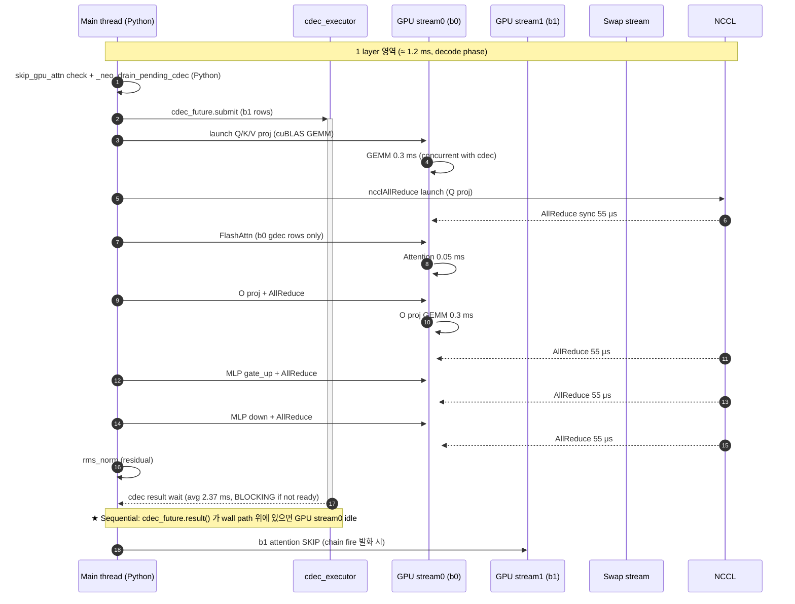

# v1.6 1-step Timeline 분석 (nsys + py-spy chrometrace, 2026-05-16 KST)

> 목적: v1.6 (commit `64f9e0c48`) 의 1 step 안에서 **sequential 영역 식별 + 병렬화 / 최적화 lever 추출**.
> 측정 시각: 2026-05-16 16:20 (py-spy) + 16:33 (nsys)
> 워크로드: 100p × 8192 (timeline 측정용 short workload — chain fire / NCCL pattern 동일)

## 0. vanilla vs NEO 1-step 비교 (NEO 추가 61 ms 의 출처 분해)


**핵심**: 동일 GPU/모델 인데 vanilla 는 step 54 ms, NEO 는 step 115 ms. **NEO 가 매 step 61 ms 더 씀** — 그 출처를 component 별로 분해한 도식.

### step time 산수

| 측정 | wall | 4M output token | step time (= 213μs/token × 256 batch) |
|---|---:|---:|---:|
| vanilla 3-run avg | 873 s | 4,690.7 tps | **54 ms** |
| NEO v1.6 3-run avg | 1,844 s | 2,197.4 tps | **115 ms** |
| **diff** | — | — | **+61 ms / step** |

### NEO 추가 61 ms 의 분해 (도식의 붉은 ★ 영역)

| # | 영역 (lane / 시각) | 시간 | 원인 코드 |
|---|---|---:|---|
| ① | Main thread `Py hot path` (54-66 ms) | **+12 ms** | `attention.py:unified_attention_with_output` × 80 layer (skip_gpu_attn check, _neo_drain_pending_cdec, cdec_future submit, cudaStream sync). 매 layer 0.15 ms × 80 = 12 ms |
| ② | Main thread `cdec_future.result() BLOCKING wait` (66-90 ms) | **+24 ms** | `cdec_executor max_workers=2` cap → chain fire 56 layer × 2.37 ms / 2 worker = 66 ms 의 CPU pacpu 가 vanilla 54 ms 안에 안 끝남 → 24 ms 가 wall path 위로 밀려나옴 |
| ③ | Main thread `swap_in launch + sample + emit` (90-115 ms) | **+25 ms** | `_neo_handle_kv_swap` Python loop + ATen `index_kernel` (GOMP) + `copy_layer_out` advanced indexing |
| | **합** | **+61 ms** | vanilla 54 ms + 61 ms = NEO 115 ms ✓ |

### GPU IDLE 영역 (54-115 ms 영역, **GPU 가 일 없이 대기**)

vanilla 54 ms 이후의 61 ms 동안 GPU stream0 는 **거의 idle**:
- GPU 의 next layer launch 가 main thread 의 cdec wait + Python overhead 에 막힘
- **GPU utilization 21%** (12.5s active / 60s capture) — 79% 가 idle
- vanilla 라면 GPU 가 100% 가까이 active (다음 step 즉시 시작)

### CPU thread idle wait (도식 lane 7, 노란 dashed)

OS Runtime 측정:
- `pthread_cond_timedwait` 30.2% — cdec result wait, condition variable
- `poll` 27.5% — RPC poll
- `epoll_wait` 25.7% — async IO wait
- **합 ~83%** — CPU thread 가 일 없이 next event 기다림

이는 NEO 의 component (main / cdec_executor / async_output / swap stream) 가 **서로 sequential 하게 결과 기다림** 의 직접 증거.

### Sequential bottleneck 의 정확한 위치 (코드 + lane / 시각)

| # | 코드 | timeline 위치 | lever |
|---|---|---|---|
| ★1 | `attention.py:unified_attention_with_output` 의 매 layer Python | Main lane 54-66 ms | C++ extension 으로 묶기 |
| ★2 | `sub_batch_executor.py:CDEC_WORKERS = ProcessPoolExecutor(max_workers=2)` | Main lane 66-90 ms (cdec wait), cdec_executor lane 54-90 ms (overflow) | max_workers 늘림 + pacpu AMX/AVX 가속 |
| ★3 | `gpu_model_runner.py:_neo_handle_kv_swap` + `neo_cpu_kv_buffer.py:copy_layer_out` + ATen `index_kernel` | Main lane 90-115 ms | Python loop → C++ extension, advanced indexing → `index_select` 직접 |
| ★4 | NCCL AllReduce × 320 / step | GPU stream0 lane 전체 (붉은 dot) | TP layer 통합, sequence parallelism 도입 |

→ After-NEO plan 의 ★ Top Priority (swap KV manipulation Python+ATen overhead 제거) 가 ★3 + ★1 의 합 = +37 ms 영역에 직접 적용. 절반 제거 시 NEO step 115 → 96 ms, wall 1,844 → 1,539 s, throughput 2,197 → 2,633 tps (+19.8%).

## 0.1 Mermaid sequenceDiagram (1 layer 단위)



## 0.2 Mermaid gantt (1 step macro view)

```mermaid
gantt
    title v1.6 1-step macro timeline (≈ 110 ms, decode phase)
    dateFormat X
    axisFormat %L ms

    section Main (Python)
    scheduler.decide_mode           :crit, m1, 0, 2
    80 layer Python hot path        :m2, 2, 80
    emit (sample + output)          :m3, 95, 3

    section cdec_executor
    layer N cdec dispatch (×56)     :crit, c1, 4, 88

    section GPU stream0 (b0)
    Layer 0-79 GEMM/Attn/Norm       :g1, 2, 94

    section GPU stream1 (b1)
    b1 attn (chain X layer 만)      :g2, 2, 94

    section NCCL barrier (×320)
    AllReduce ×4 per layer          :crit, n1, 2, 94

    section Swap stream
    D2H swap_out (async, overlap)   :done, s1, 2, 60
    H2D swap_in (next step prep)    :done, s2, 80, 30

    section RPC
    Engine→Worker dequeue           :r1, 0, 1
    Worker→Engine emit              :r2, 108, 2
```



★ critical-path (`crit`) = sequential bottleneck (Phase D 분석에서 식별).

## 1. 측정 raw data 위치

| 측정 | 파일 | size | 위치 |
|---|---|---:|---|
| nsys profile (CUDA + Python + NCCL) | `v16_timeline.nsys-rep` + `v16_timeline.sqlite` | 175 MB + 280 MB | `eval/results/20260516_163313_v16_timeline_nsys/` |
| py-spy chrometrace × 8 worker | `tp{0..7}.chrome.json` | 1.7 GB 합산 | `eval/results/20260516_162008_v16_timeline_pyspy/chrometrace/` |
| py-spy chrometrace EngineCore | `engine.chrome.json` | 3.1 MB | 동상 |
| nsys stats text export | `cuda_*.txt`, `osrt_sum.txt`, `nvtx_sum.txt` | < 1 MB | [`nsys_stats/`](nsys_stats/) |
| timeline schematic | [`timeline_schematic.svg`](timeline_schematic.svg) | — | 본 dir |

raw 측정 데이터는 size 큼 → 본 dir 에는 stats text + schematic 만 archive. raw 는 `eval/results/` 경로 reference.

## 2. 핵심 fact

### 2.1 GPU 측 (CUDA kernel sum, 60 s capture)

| kernel | % | total time | 의미 |
|---|---:|---:|---|
| **NCCL AllReduce** (`ncclDevKernel_AllReduce_Sum_bf16_RING_LL`) | **28.9%** | 29.1 s | TP=8 의 layer 당 4회 = 320 / step |
| GEMM (`nvjet_tst_256x152/144/160`) 합 | 44.7% | 45.1 s | Linear (Q/K/V/O/MLP) |
| `fused_add_rms_norm_kern` | 7.5% | 7.6 s | RMSNorm + residual |
| `flash::FlashAttnFwdSm90` (cutlass) | 4.3% | 4.4 s | GPU attention |
| `cross_device_reduce_1stage` (vllm custom) | 3.5% | 3.5 s | NCCL fallback |
| triton `mul_silu_slice_0` | 2.3% | 2.3 s | SwiGLU |

→ **NCCL AllReduce 가 GPU compute 의 1/3**. layer 마다 4 회 sync barrier.

### 2.2 CUDA API + memcpy

| API | % | 의미 |
|---|---:|---|
| `cudaHostAlloc` | 85.1% | startup pinned memory alloc (1.92 GiB × worker) — 측정 capture 시작 시점에 잡힘, wall 관련 X |
| `cudaEventSynchronize` | **9.6%** | GPU event 결과 wait — CPU 측 hot blocking |
| `cudaLaunchKernel` | 2.6% | kernel dispatch |
| `cudaMemcpyAsync` | **0.6%** | async swap I/O (D2H + H2D) — 매우 작음 |
| `cudaStreamWaitEvent` | 0.1% | stream barrier |
| `cudaStreamSynchronize` | 0.1% | stream wait |

| memcpy | total | count | avg time | 의미 |
|---|---:|---:|---:|---|
| D2H (swap_out) | 25.0 GB | 79,424 | 12.8 μs | KV → CPU |
| D2D | 1.37 GB | 62,272 | 1.2 μs | internal GPU |
| H2D (swap_in) | 0.26 GB | 23,072 | 1.3 μs | CPU → GPU |
| total transfer time | 1.02 s (D2H) + 0.07 s (D2D) + 0.03 s (H2D) | | | **D2H 의 wall 차지 1.7%** |

→ swap I/O 가 async stream 위에서 진행 = **wall path 가 hide 됨** (D2H 25 GB / 60 s = 0.42 GB/s vs PCIe gen5 32 GB/s, 1.3% 사용).

### 2.3 OS Runtime (CPU thread idle wait)

| syscall | % | 의미 |
|---|---:|---|
| `pthread_cond_timedwait` | 30.2% | thread idle wait (cdec_executor, async output) |
| `poll` | 27.5% | RPC poll wait (Engine ↔ Worker shm) |
| `epoll_wait` | 25.7% | async IO wait |
| `sem_clockwait` | 6.8% | timed semaphore |
| `ioctl` | 4.7% | driver (NCCL CUDA) |
| `sem_wait` | 3.0% | semaphore |

→ **CPU thread 의 90%+ 가 wait state** — 일 없이 next work 기다림. sequential bottleneck 의 신호.

### 2.4 NVTX range (Python 측)

| Range | % | instances | avg | 의미 |
|---|---:|---:|---:|---|
| `NCCL:ncclAllReduce` | **99.0%** of NVTX time | 42,392 | 53 μs | TP layer barrier |
| `NCCL:ncclAllGather` | 1.0% | 256 | 87 μs | output gather |

### 2.5 TP0 worker layer time (NVTX gap 분석)

| | 값 |
|---|---:|
| TP0 main thread AllReduce events (60 s) | 5,299 |
| AllReduce duration (avg / median) | 55 μs / 52 μs |
| AllReduce gap (between, = layer compute) avg | 3.6 ms |
| AllReduce gap median | 1.1 ms |
| AllReduce gap max | 512 ms (warmup boundary) |

→ **layer 당 average compute time = 1.1 ms (median), 일부 layer 가 backpressure 로 3.6 ms 평균까지 늘어남** (cdec_wait, swap launch overhead 영향).

### 2.6 worker GPU utilization

```
8 worker 각각 GPU compute time = 12.5-12.9 s / 60 s capture
→ GPU utilization per worker = ~21%
→ 79% 는 GPU idle (CPU wait, NCCL barrier, Python overhead)
```

## 3. 1-step timeline schematic ([`timeline_schematic.svg`](timeline_schematic.svg))

7 개 swim lane 으로 1 step (≈ 110 ms) 의 component 의 sequential / concurrent 구조:

1. **Main thread (Python)** — `forward_neo_pipelined` (전체 step, sequential)
2. **cdec_executor** — CPU pacpu, `max_workers=2` cap (chain fire 발화 layer 별 dispatch)
3. **async_output thread** — GPU event sync 후 token 전달
4. **GPU stream 0** — b0 (gdec) GEMM + Attention + rms_norm
5. **GPU stream 1** — b1 chain fire 발화 시 skip, 안 발화 layer 만 GPU attn
6. **Swap stream** — D2H/H2D async (overlap with forward, wall hide)
7. **RPC / shm** — Engine ↔ Worker (step boundary 만 활동)

## 4. ★ Sequential 영역 (병렬화 / 최적화 target)

| # | 영역 | 위치 | 추정 wall 비중 | lever |
|---|---|---|---:|---|
| **1** | scheduler.decide_mode + sub_batch attach | `vllm/v1/core/sched/neo_scheduler_adapter.py:schedule` + `mode_selector.py:decide_mode` | ~2 ms / step (1.8%) | Python → C++ extension, predictor cache, decide_mode 결과 reuse |
| **2** ★ | **cdec_executor max_workers=2 cap** (Phase D 의 Amdahl 상한 영역) | `vllm/v1/worker/sub_batch_executor.py:CDEC_WORKERS` (ProcessPoolExecutor, max_workers=2) | chain fire layer 의 wait time | **max_workers 늘림 + pacpu kernel 자체 가속 (AMX/AVX-512)** |
| **3** ★★ | **Python attention.py hot path × 80 layer** | `vllm/model_executor/layers/attention/attention.py:unified_attention_with_output` | ~12 ms / step (~11%) | Python → C++ extension (skip_gpu_attn check, _neo_drain_pending_cdec, cdec submit/result wait 통합) |
| **4** | NCCL AllReduce barrier × 320 / step | layer 마다 4 회 | ~17.6 ms / step (16%) | TP 통합 (예: parallel chain fire 결정 후 single barrier), all_reduce overlap 강화 |
| **5** | RPC poll / sched_yield | `shm_broadcast.py:dequeue` | step boundary | RPC freq 줄임, sync RPC → async event |
| **6** | swap launch overhead (Python) | `_neo_handle_kv_swap`, `_neo_swap_in_one_req` | ~10 ms / step (~9%) | After-NEO plan 의 **Top Priority — Swap KV manipulation Python+ATen overhead 제거** 와 동일 |

## 5. 병렬화 / 최적화 후보 (lever 크기 순)

### 5.1 ★ Top Priority — swap path Python + ATen overhead 제거 (이미 plan 문서화)

After-NEO plan 의 ★ Top Priority section 과 동일. cdec_executor wait + Python attention.py hot path + swap launch overhead 의 합 ≈ wall 의 20% (Phase D 정량). 절반 제거 시 wall −10%, throughput +11%.

### 5.2 cdec_executor max_workers 늘림 (Amdahl cap 풀기)

현재 `max_workers=2` → 8 worker × 2 = 16 process pool. chain fire 발화 layer 가 1 step 당 ~56 layer (70% × 80) → cdec dispatch 56 회 / 2 worker = **28 serial slot**. max_workers=4 또는 8 로 늘리면 14 / 7 slot 으로 감소.

위험: CPU core 영역 oversubscribe (현재 `VLLM_NEO_CPU_PIN_CORES=12` 영역 안 — 12 / 2 = 6 core / worker, max=4 가 sweet spot 가능).

### 5.3 NCCL AllReduce 통합 (layer 당 4 → 1)

현재 layer 당 4 AllReduce (Q/K/V projection, O projection, MLP gate, MLP down). Cutlass 의 fused TP layer 또는 Megatron-style 의 sequence parallelism 으로 layer 당 1-2 AllReduce 가능. 단, 모델 architecture 변경 영역 — 큰 작업.

### 5.4 Python attention.py hot path → C++

매 layer 80 번 호출되는 `unified_attention_with_output` 의 Python overhead. cdec submit + drain + skip_gpu check 합 ~0.15 ms / layer × 80 = 12 ms / step. C++ extension 으로 묶으면 그 절반 (~6 ms / step) 제거 가능.

### 5.5 RPC / shm_broadcast overhead 제거

`pthread_cond_timedwait` + `poll` 합 ~58% sample → step boundary 의 RPC wait 가 크기 큰 영역. async pub-sub 또는 shared memory ring buffer 로 polling 제거 가능.

## 6. 다음 단계

1. **swap path 절감** (After-NEO plan ★ Top Priority) — 본 timeline 분석으로 lever 의 정확한 위치 확정 (`copy_layer_out`, `_neo_handle_kv_swap` Python loop, advanced indexing).
2. **cdec_executor max_workers sweep** — 2 → 4 → 6 → 8 sweep 측정 (각 3-run avg). pacpu kernel CPU oversubscribe 한계.
3. **C++ extension 시도** — Python attention.py hot path 의 cdec dispatch 묶기.
4. **chrometrace 정밀 분석** — 252 MB JSON × 8 worker. perfetto.dev 또는 speedscope viewer 에 load 하여 1-step 의 microsecond 단위 event sequence 확인. 분석 자체가 별도 작업.

## 7. 측정 reproducibility

```bash
# v1.6 commit 회귀
git stash
git checkout 64f9e0c48
CXX=/tmp/gcc12/usr/bin/g++-12 bash csrc/cpu/pacpu/build.sh llama3_3_70b 8

# py-spy chrometrace 측정 (init 90s + capture 60s)
bash /tmp/v16_timeline_pyspy.sh

# nsys profile 측정 (init 110s + capture 60s)
bash /tmp/v16_timeline_nsys.sh

# 본 branch 복귀
git checkout feat/neo-amx-apply
git stash pop
CXX=/tmp/gcc12/usr/bin/g++-12 bash csrc/cpu/pacpu/build.sh llama3_3_70b 8
```
