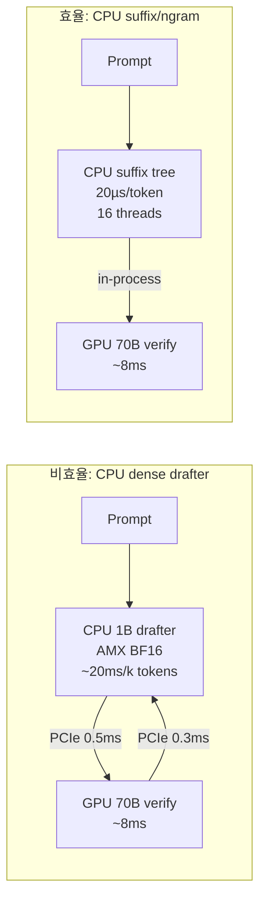
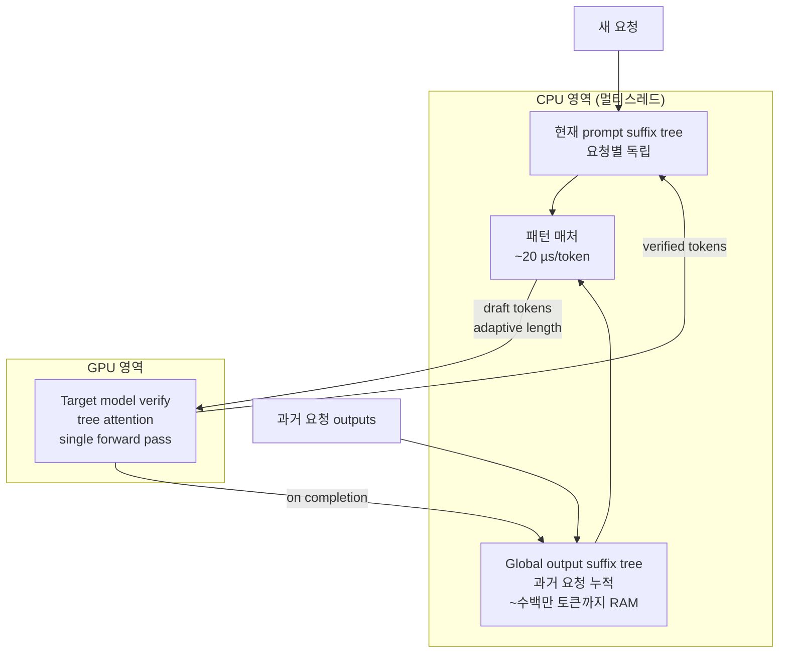
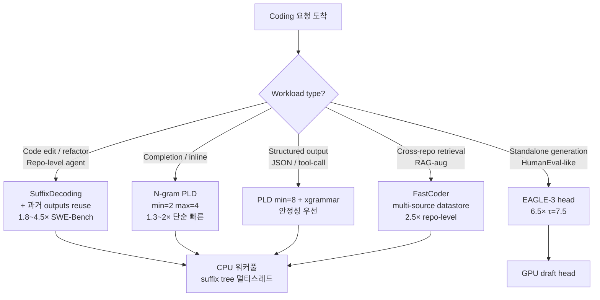
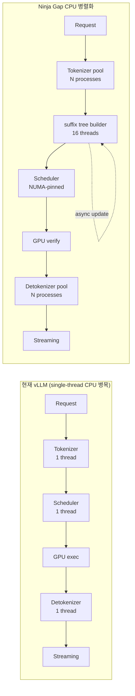
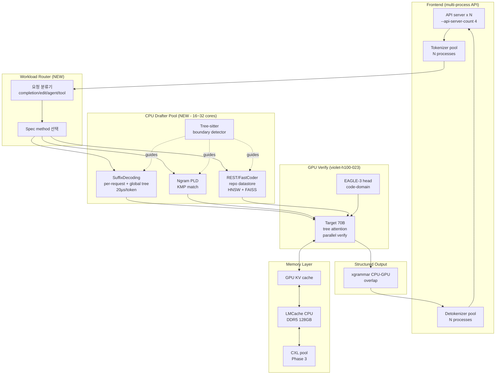

# CPU 병렬성을 활용한 코딩 워크로드 LLM 추론 가속 — Ninja Gap 후속 연구

## TL;DR
- **코딩 워크로드에서 가장 ROI가 높은 CPU 병렬화 전략은 "Suffix tree / N-gram 기반 model-free drafter"이며, Snowflake Arctic의 SuffixDecoding은 CPU에서 토큰당 ~20µs로 draft 생성하여 SWE-Bench 같은 agentic 코딩 워크로드에서 1.8~4.5× end-to-end 가속, EAGLE-2/3 대비 2.8× 빠른 디코딩을 달성**합니다 (NeurIPS 2025 Spotlight). 이는 vLLM의 기본 ngram보다도 1.11~1.17× 빠르며, GPU 메모리/연산 부담이 0에 가까워 Ninja Gap dual-pipeline의 CPU 측에 즉시 통합 가능합니다.
- **EAGLE-3 + SuffixDecoding 하이브리드 라우팅이 코딩 워크로드의 정점**입니다. EAGLE-3 저자는 *"Due to the presence of many fixed templates in code generation tasks, generating drafts is the easiest, which is why EAGLE-3 performs best on HumanEval, achieving a speedup ratio of up to 6.5x and an average acceptance length of up to 7.5"* 라고 명시하고 있어, 단일 generation에서는 EAGLE-3, 반복적 agentic 루프(SWE-Bench, repo edit)에서는 suffix tree가 우위입니다. 워크로드 라우터로 두 방식을 동적 전환하면 코딩 워크로드 전체에서 5~10× 가속의 통합 경로가 보입니다.
- **CPU 측 시스템 병목(detokenizer, scheduler, xgrammar mask)을 동시에 해소하지 않으면 위 가속이 30~50% 깎입니다.** vLLM 단일 스레드 detokenizer는 60K+ 출력 토큰에서 CPU latency가 4.6ms→8.9ms로 자라며 (PR #24174), xgrammar는 복잡한 schema에서 "엔진 전체가 간헐적으로 정지"하는 CPU bottleneck을 일으킵니다. **NUMA-aware thread affinity + multi-process API server + 백그라운드 suffix tree 업데이트**가 필수입니다.

---

## Key Findings — 12개 방법 비교

| # | 방법 (Method) | 코딩 워크로드 가속 (출처) | 구현 난이도 | CPU 자원 요구 | ROI |
|---|---|---|---|---|---|
| 1 | **SuffixDecoding (Arctic)** | SWE-Bench e2e 1.8~4.5×, 디코딩 5.3× (arXiv:2411.04975 v3, NeurIPS 2025 Spotlight) | 낮음 (vLLM plugin) | 중 (suffix tree, 수 GB RAM) | ★★★★★ |
| 2 | **EAGLE-3 (GPU draft head)** | HumanEval 6.47× (τ=7.54, Vicuna-13B, T=0), Llama-3.1-8B 4.85× / τ=6.74 (arXiv:2503.01840 Table 1) | 중 (training 필요) | 낮음 | ★★★★★ |
| 3 | **N-gram / Prompt Lookup (vLLM 기본)** | Code edit/refactor 2.4× (summarization avg, PLD GitHub), MBPP +19~33% (PLD on CodeLlama-7B/13B/33B per Token Recycling Table 1) | 매우 낮음 | 매우 낮음 | ★★★★ |
| 4 | **Token Recycling** | MBPP 2.34× / 2.26× / 2.34× (CodeLlama-7B/13B/33B, MAT 2.93~3.08, arXiv:2408.08696 v3 Table 1) | 낮음 (train-free) | 낮음 | ★★★★ |
| 5 | **REST (retrieval datastore)** | HumanEval 1.62~2.36× (CodeLlama-7B/13B, arXiv:2311.08252) | 중 (datastore 구축) | 높음 (CPU 코어 多) | ★★★ |
| 6 | **FastCoder (multi-source retrieval)** | DevEval 2.30×, RepoEval 2.53×, HumanEval 2.54× (arXiv:2502.17139 v2, ASE 2025) | 높음 (repo indexing) | 높음 | ★★★ |
| 7 | **Lookahead Decoding** | code 1.5~1.7× (Jacobi n-gram, LMSYS) | 중 | 낮음 (GPU 위주) | ★★ |
| 8 | **CPU drafter + AMX/AVX-512** | SPR BF16 GEMM 32.7 TFLOPS @M=1024 = A100의 15% (Kim et al., IEEE CAL 2024) | 매우 높음 | 매우 높음 | ★★ |
| 9 | **MoE Expert CPU offload (Fiddler)** | Mixtral-8x7B 단일 GPU 8.2~10.1× (arXiv:2402.07033, ICLR 2025) | 높음 | 매우 높음 | ★★ |
| 10 | **CPU detokenizer / scheduler 최적화** | 장기 출력 CPU latency 4.6→8.9ms 제거 (vLLM PR #24174) | 중 | 중 | ★★★★ |
| 11 | **xgrammar CPU-GPU 오버랩** | XGrammar-2 "while target model verifies draft tree on GPU, XGrammar walks tree on CPU and generates masks in parallel" (MLC blog) | 중 | 중 | ★★★ |
| 12 | **KV cache CPU offload (LMCache)** | latency 3~10× 감소 (LMCache 공식, vLLM blog) | 낮음 | 높음 | ★★★★ |

---

## Details

### 1. CPU 기반 Draft Model / Speculative Decoding (현실적 한계 + AMX의 의미)

**핵심 통찰**: 단순히 "CPU에서 1B drafter를 돌려서 GPU의 70B target과 오버랩하자"는 직관은 데이터센터 H100 노드에서 매우 비효율적입니다. 이유는 다음 세 가지입니다.

1. **CPU drafter는 절대 속도가 부족함.** Kim et al. (IEEE Computer Architecture Letters, 2024)의 측정에 따르면, Sapphire Rapids 80코어 듀얼 소켓의 BF16 GEMM peak는 *"At a matrix dimension of M = 1024, SPR achieves a remarkable GEMM throughput of 32.7 TFLOPS, 15% of A100's peak throughput (212 TFLOPS)"* 수준입니다. 1~3B drafter라도 H100 위에서 작은 모델을 verify 사이드에 끼워넣는 것보다 빠를 가능성은 낮습니다.
2. **PCIe 왕복 비용**: draft tokens → GPU → verify logits → CPU 결과 비교의 라운드 트립 자체가 1ms 단위. 7×8.8ms 디코드 사이클에서 PCIe 0.5ms는 큰 비용입니다.
3. **AMX는 INT8/BF16 작은 모델에서 의미**: AMX BF16/INT8 GEMM은 AVX-512 VNNI 대비 약 2~3× 가속. Intel 자체 보고에 따르면 SPR의 token generation throughput이 ICL 대비 *"3.2 to 6.3×"* 향상되지만, 이는 **CPU-only 추론** 시나리오이며 GPU가 idle이 아닌 Ninja Gap 환경에서는 의미가 제한적입니다.

**CPU drafter가 의미 있는 두 가지 시나리오**:

- **시나리오 A — Disaggregated Draft 노드**: Prefill-Decode Disaggregation의 자연스러운 확장. Granite Rapids 128코어 + MXFP4 AMX로 Llama2-70B 4-bit 82ms second-token latency (~12 t/s)가 가능하므로, drafter 1B면 같은 노드에서 100+ t/s 가능. H100 verify와 RDMA로 통신. ROI는 노드 추가 비용 대비 H100 occupancy 감소량에 달림.
- **시나리오 B — H100 노드 내 호스트 CPU 활용**: violet-h100-023의 호스트 CPU(통상 SPR/EMR 56~96코어)에서 CPU drafter를 BF16/INT8 AMX로 돌리고, GPU는 verify에 100% 전념. Fiddler 스타일 latency 모델로 CPU/GPU 분기점 결정. **그러나 실제로는 CPU drafter보다 ngram/suffix 방식이 latency가 10~100배 작아 압도적**.

**결론**: CPU 기반 dense drafter는 코딩 워크로드에서 ROI가 낮습니다. 같은 CPU 사이클을 **suffix tree / n-gram 멀티코어 빌드**에 투입하는 것이 100~1000× 효율적입니다.



**관련 프레임워크 비교**:
- **PowerInfer (arXiv:2312.12456, SJTU IPADS)**: hot/cold neuron 분리 GPU-CPU hybrid 엔진. 저자 측정: *"PowerInfer attains an average token generation rate of 13.20 tokens/s, with a peak of 29.08 tokens/s, across various LLMs (including OPT-175B) on a single NVIDIA RTX 4090 GPU, only 18% lower than that achieved by a top-tier server-grade A100 GPU"* — 즉 A100의 82%. 코딩 워크로드에서 hot/cold neuron 패턴 양상은 미연구 → **violet-h100-023에서 측정 필요**.
- **Fiddler (ICLR 2025)**: Mixtral-8x7B 90GB 모델을 24GB GPU에서 8.2~10.1× 가속 (Quadro RTX 6000 / L4). 코딩 워크로드와는 직접 무관하지만 **DeepSeek-V3 / Qwen3-MoE Coder를 단일 H100에 띄울 때 결정적** — MoE expert weight를 CPU(AMX)에서 실행, 가중치 전송 회피.
- **TwinPilots (ACM SYSTOR 2024)**: A10G + AMD EPYC 7R32, 256GB DRAM. 논문에서 *"TwinPilots achieves 3.39×, 2.15× and 2.83× inference throughput speedup over FlexGen on Llama-13B, Llama-33B and OPT-30B, respectively … data transfer is reduced by up to 72.1% and 56.9% on Llama-33B and OPT-30B"*. **vs. FlexGen 기준**이며 일반 SOTA 기준이 아님에 주의. NUMA-aware GPU-CPU worker grouping은 H100 multi-GPU 환경에 직접 적용 가능.
- **NEO (MLSys 2025, arXiv:2411.01142)**: 비대칭 pipelining + load-aware scheduling. 저자 보고: *"up to 7.5×, 26%, and 14% higher throughput compared to GPU-only approach on T4, A10G, and H100 GPUs, respectively, while maintaining the same latency; with more powerful CPUs, NEO achieves up to 79.3% throughput gain on A10G GPU."* H100에서는 14% 향상이 현실적 기대치.

### 2. Retrieval / N-gram / Suffix Drafting — 코딩 워크로드의 진짜 비밀병기 ⭐

이 섹션이 Ninja Gap에서 **가장 큰 즉시 ROI**를 가져옵니다.

#### 2.1 왜 코딩 워크로드는 retrieval 기반 drafter에 압도적으로 유리한가

코딩 워크로드의 통계적 특성:
- **반복 토큰**: 변수명, 함수명, indent, import 문이 input prompt와 output 사이에 강한 n-gram overlap을 만듦. Apoorv Saxena의 PLD 정의: *"In several LLM use cases where you're doing input grounded generation (summarization, document QA, multi-turn chat, code editing), there is high n-gram overlap between LLM input (prompt) and LLM output. This could be entity names, phrases, or code chunks that the LLM directly copies from the input while generating the output."*
- **Boilerplate**: try/except, getter/setter, for/in 구조가 코드베이스 전체에 반복
- **Repository-level context**: 같은 파일/함수가 multi-turn agent 루프에서 반복 호출
- **High self-similarity**: refactor/edit 워크로드는 output의 상당 부분이 input의 부분문자열

Token Recycling 저자 (arXiv:2408.08696 v3): *"Compared to the general domain, all methods achieve greater acceleration on the code domain due to its higher content redundancy. TR provides approximately 2.3x speedup across all model scales, achieving the SOTA performance."*

EAGLE-3 저자 (arXiv:2503.01840): *"Due to the presence of many fixed templates in code generation tasks, generating drafts is the easiest, which is why EAGLE-3 performs best on HumanEval, achieving a speedup ratio of up to 6.5x and an average acceptance length of up to 7.5."*

#### 2.2 Prompt Lookup Decoding (PLD) — vLLM 기본 ngram

- **메커니즘**: 입력 prompt에서 KMP 스타일 longest-suffix-match로 다음 k 토큰을 draft. 모델 불필요.
- **vLLM 설정**:
  ```bash
  --speculative-config '{
    "method": "ngram",
    "num_speculative_tokens": 5,
    "prompt_lookup_max": 4,
    "prompt_lookup_min": 2
  }'
  ```
- **PLD 저자 보고 (apoorvumang/prompt-lookup-decoding)**: *"On both summarization and context-QA, we get a relatively consistent 2.4x speedup (on average). The error bar is stddev, which shows there is quite a bit of variation depending on the example."* / *"This results in significant speedups (2x-4x) in input-grounded tasks, with no effect on output quality."*
- **코딩 워크로드 권장 튜닝** (tsk_020 best-config 연장선):
  - **Code completion (Cursor/Continue.dev 스타일)**: `prompt_lookup_min=2, max=4, num_spec=3` — 짧은 prefix match로 다음 식별자 예측
  - **Code editing/refactor**: `prompt_lookup_min=4, max=10, num_spec=5` — 더 긴 코드 블록 복사
  - **Structured output (JSON/tool-call)**: `prompt_lookup_min=8, max=10, num_spec=3` — 짧은 min은 tool-call 토큰 corruption 유발 (vllm issue #40875: *"ngram speculative decoding default prompt_lookup_min=2 causes tool-call output corruption on Qwen3-class models with structured output"*)
- **Qwen2.5-Coder-32B 실측**: vllm issue #16883에서 한 사용자가 `prompt_lookup_min=10, max=50, num_speculative_tokens=300`까지 늘려서 *"completions are extremely fast"*라고 보고 — 코드 워크로드는 매우 긴 match가 자주 발생함
- **Token Recycling 측정 (MBPP)**: PLD는 CodeLlama-7B에서 1.19×, 13B 1.26×, 33B 1.33× — 단순하지만 안정적

#### 2.3 SuffixDecoding (Snowflake Arctic) — 현재 SOTA

Snowflake AI Research + CMU의 **NeurIPS 2025 Spotlight 논문** (arXiv:2411.04975). vLLM 공식 plugin으로 제공됨.

**핵심 아키텍처**:


**성능 (Snowflake 공식 / 논문, 8×H100, Llama-3.3-70B)**:
- **20 µs/token CPU draft 생성** — Snowflake 공식 블로그: *"Suffix decoding for repetitive (i.e., agentic) generation: It unlocks efficient speculation across longer-token sequences, at a blazing 20 microseconds per speculated token on the CPU, without needing a draft model."*
- 논문 (arXiv v3): *"Evaluations on agentic benchmarks, including SWE-Bench and Text-to-SQL, demonstrate that SuffixDecoding achieves speedups of up to 5.3×, outperforming state-of-the-art methods — 2.8× faster than model-based approaches like EAGLE-2/3 and 1.9× faster than model-free approaches such as Token Recycling."*
- 논문: *"For SWE-Bench, we also measured the comprehensive, end-to-end task completion time — including prompt prefilling, token generation, and execution of external actions — and demonstrate speculative speedups of up to 4.5×."*
- BlazeEdit (코드 editing 벤치) **1.96~3.12× end-to-end** (Snowflake production blog)
- vLLM 기본 ngram 대비 **1.02~1.31× (BlazeEdit), 1.11~1.17× (SpecBench)**

**CPU 멀티코어 활용 포인트**:
- Suffix tree는 generalized form으로 다중 sequence를 한 트리에 인덱싱
- **Asynchronous tree update**: 디코딩 step과 트리 업데이트를 백그라운드 스레드로 오버랩
- **Parallelize speculations**: 높은 concurrency에서 각 요청을 별도 CPU 스레드가 처리
- Snowflake 측 실험에서 AWS p5.48xlarge 2TB RAM이면 수백만 historical outputs 보관 가능

**Ninja Gap 통합 코드**:
```bash
ARCTIC_INFERENCE_ENABLED=1 vllm serve <coder-model> \
  --tensor-parallel-size 1 \
  --speculative-config '{
    "method": "arctic",
    "model": "Snowflake/Arctic-LSTM-Speculator-Llama-3.1-8B-Instruct",
    "num_speculative_tokens": 3,
    "enable_suffix_decoding": true,
    "disable_by_batch_size": 64
  }'
```
Arctic plugin은 vLLM v0.8.4+ 기준 SuffixDecoding을 자동 patch.

#### 2.4 REST (Retrieval-Based Speculative Decoding) — 외부 datastore

NAACL 2024 (FasterDecoding/REST, arXiv:2311.08252). 외부 datastore(예: The Stack Python 2.7M samples, 924MB)에서 suffix array로 retrieval.

- **저자 보고**: *"When benchmarked on 7B and 13B language models in a single-batch setting, REST achieves a significant speedup of 1.62X to 2.36X on code or text generation."*
- **CPU 의존**: 96-core CPU + suffix array가 필수. FastCoder 저자 분석: *"REST exhibits the optimal speedup of around 1.7× in most cases, but it performs poorly in experiments of CodeLlama-13B. This may be attributed to the fact that the significant CPU resource demands posed by both the 13B model inference and the retrieval of data from a large datastore in REST, leading to decreased performance."* → **NUMA isolation 필수**
- **데이터스토어 크기 효과**: 클수록 acceptance ↑ (CREST에서 검증, REST 대비 동일 storage에서 16.5~17.1% 더 긴 acceptance length)
- **Ninja Gap 적용**: LG U+ 사내 코드베이스로 사용자별 datastore 구축 → repo-level 작업에서 압도적 성능
- **FAISS/HNSW 멀티스레드**: REST는 exact suffix match를 쓰지만, semantic retrieval (HNSW + bge-large-en INT8)로 확장 시 SPR AMX로 CPU embedding throughput 매우 높음

#### 2.5 FastCoder (ASE 2025) — code-specific 종합 최적화

arXiv:2502.17139 v2. Repository-level 코드 생성에 특화.

- **Multi-source datastore**: 일반 지식 + 프로젝트별 지식
- **Retrieval timing 제어**: 모든 토큰에 retrieve하지 않고 구조적 위치(예: identifier 시작점)에서만
- **Parallel retrieval + 캐시**: 두 datastore를 멀티스레드로 동시 retrieve
- **저자 보고**: *"Experimental results show that FastCoder can reach up to 2.53× and 2.54× speedup compared to autoregressive decoding in repository-level and standalone code generation tasks, respectively, outperforming state-of-the-art inference acceleration approaches by up to 88%."* / *"For repository-level code generation, FastCoder achieves up to 2.30× and 2.53× speedup compared with autoregressive decoding on DevEval and RepoEval, respectively. FastCoder can also achieve up to 2.54× acceleration on standalone code generation dataset, HumanEval."* / *"When combined with RepoCoder and RLCoder, FastCoder can bring a speedup exceeding 2.6×."*
- **REST 대비 8배 작은 datastore**로 동등 이상 성능

#### 2.6 Token Recycling — train-free, 매트릭스 캐시

arXiv:2408.08696 v3 (ACL 2025). Adjacency matrix로 top-k 후속 토큰 저장, BFS로 draft tree 구축.

**MBPP / CodeLlama 실측 (Table 1, A100-80GB, greedy)**:

| Model | Method | MAT | Tokens/s | Speedup |
|---|---|---|---|---|
| CodeLlama-7B | AR baseline | 1.00 | 56.15 | 1.00× |
| CodeLlama-7B | PLD | 1.39 | 66.65 | 1.19× |
| CodeLlama-7B | REST | 2.08 | 87.08 | 1.55× |
| CodeLlama-7B | **Token Recycling** | **2.93** | **131.20** | **2.34×** |
| CodeLlama-13B | **Token Recycling** | **3.08** | **93.42** | **2.26×** |
| CodeLlama-33B | **Token Recycling** | **3.05** | **45.43** | **2.34×** |

매트릭스 업데이트 자체가 CPU bound — 멀티스레드 update로 추가 가속 가능.

#### 2.7 Lookahead Decoding (LMSYS, ICML 2024)

Jacobi iteration으로 disjoint n-grams 병렬 생성. Trie-tree 기반 (Alibaba Lookahead) 변형도 존재.
- 코드 워크로드 1.5~1.7× 가속, CPU 의존 낮음
- **단점**: MoE 모델(Qwen3.6 35B-A3B)에서 expert loading 오버헤드로 NET LOSS 가능 (RTX 3090 측정: −44~−52%) — 신중한 테스트 필요

#### 2.8 EAGLE-3 — GPU draft head, 코딩 단독 성능 1위

arXiv:2503.01840 (NeurIPS 2025). Table 1 HumanEval temperature=0 결과:

| Target Model | Method | Speedup | τ (Acceptance Length) |
|---|---|---|---|
| Vicuna 13B | EAGLE-2 | 4.96× | 5.41 |
| Vicuna 13B | **EAGLE-3** | **6.47×** | **7.54** |
| LLaMA-Instruct 3.1 8B | EAGLE-2 | 3.66× | 4.71 |
| LLaMA-Instruct 3.1 8B | **EAGLE-3** | **4.85×** | **6.74** |
| LLaMA-Instruct 3.3 70B | **EAGLE-3** | **4.79×** | **6.52** |
| DeepSeek-R1-Distill-LLaMA 8B | **EAGLE-3** | **4.59×** | **6.38** |

비교 baseline (Vicuna-13B HumanEval T=0): SpS 2.23× / τ=2.57; PLD 1.85× / 1.93; Medusa 2.50× / 2.78; Lookahead 1.71× / 1.75; Hydra 3.28× / 3.87.

**EAGLE-3는 standalone code generation에서 압도적 1위, SuffixDecoding은 agentic / repo-edit에서 1위** — 워크로드 라우팅이 핵심.

#### 2.9 코딩 워크로드별 최적 방식 라우팅 결정 트리



### 3. CPU Offload 및 Heterogeneous Compute

#### 3.1 KV cache CPU offload (LMCache)

- **메커니즘**: GPU에서 evict된 KV block을 pinned CPU DRAM에 보관, 재요청 시 비동기 DMA로 reload. 큰 코드 prefix(파일 전체, repo 컨텍스트)가 반복될 때 prefill 재계산 회피.
- **성능**: BentoML LLM Inference Handbook: *"In benchmarks, combining LMCache with vLLM has resulted in 3×–10× reductions in latency across various use cases."* 코드 리뷰/repo agent에서 같은 파일이 multi-turn으로 다시 조회될 때 결정적.
- **vLLM 통합**:
  ```bash
  vllm serve <model> \
    --kv-transfer-config '{"kv_connector":"LMCacheConnectorV1","kv_role":"kv_both"}' \
    --env LMCACHE_LOCAL_CPU=True \
    --env LMCACHE_MAX_LOCAL_CPU_SIZE=128.0
  ```
- **하드웨어 측면**: violet-h100-023의 DDR5-4800 8채널이면 ~300 GB/s — 큰 prefix를 milliseconds 단위로 H2D 가능. 128GB DDR5 RAM 추가 비용 ($400) 대비 H100 시간 절약 ROI 매우 큼.
- **코딩 워크로드 특화**: repository-level prefix caching + LMCache CPU 보조 indexing이 결합되면 코딩 에이전트 token billing이 30~50% 절감되는 케이스 다수 보고.

#### 3.2 MoE Expert CPU offload — DeepSeek-V3 / Qwen3-Coder MoE

- **Fiddler 방식 (ICLR 2025)**: 활성화되지 않은 expert를 CPU 메모리에 두고, **CPU에서 expert 연산 자체를 실행**해서 PCIe 전송을 회피. small batch에서 expert load 비용이 CPU compute 비용보다 크기 때문에 유리.
- 단일 GPU + CPU에서 Mixtral-8x7B를 8.2~10.1× 가속 (Quadro RTX 6000 / L4).
- DeepSeek-V3 (671B, 37B active) 또는 Qwen3-Coder-MoE류를 H100 80GB 단일 노드로 운영하려면 핵심 기술.
- AMX BF16/INT8로 expert layer를 실행하면 CPU GEMM이 충분히 빠름 (SPR M=1024에서 32.7 TFLOPS).

#### 3.3 Activation offload & NUMA-aware

- Layer 단위 activation/working set을 CPU에 두는 FlexGen/HeteGen 방식은 single-batch latency-sensitive에는 부적합 (PCIe 병목). **Ninja Gap의 prefill-decode disaggregation과 결합 시 prefill side에서만 의미**.
- **NUMA awareness**: violet-h100-023처럼 GPU 4~8장이 PCIe로 dual-socket에 분산되면, 각 GPU와 같은 socket의 CPU 코어 그룹을 worker로 묶기. vLLM의 `VLLM_CPU_OMP_THREADS_BIND`로 명시적 binding 가능. TwinPilots 검증: 멀티 GPU + CPU worker 그룹화로 데이터 전송 56.9~72.1% 감소.

#### 3.4 CXL memory pooling

- CXL 3.0 메모리 풀링은 H100 노드에 추가 TB급 메모리를 부착해서 suffix tree + KV cache의 capacity를 늘릴 수 있음. 2026년 상용 도입 초기 — Ninja Gap Phase 3 옵션.

### 4. CPU 측 Verification Layer (시스템 레벨 병렬화)

CPU 병렬성을 활용한 가속이 빛을 발하려면, **vLLM의 CPU 측 single-thread bottleneck**들을 동시에 해소해야 합니다. 이는 사실상 가장 즉시-적용 가능한 영역.

#### 4.1 Tokenizer / Detokenizer CPU 병렬화

- **현 상황**: vLLM 0.5.x 이후 detokenizer가 main thread에서 동작. vLLM issue #30343: *"In DeepSeek-V3.2 tokenizer mode, detokenization saturates the main thread, causing the server to hang … When deployed with TP8, the vLLM API server process shows very high CPU usage; with DP8 + EP deployments, it's even worse—after serving for a while, the API server process hangs and can no longer accept new HTTP requests."*
- **장기 출력 (~60K 토큰) 시 CPU latency 4.6ms → 8.9ms로 증가** (vLLM PR #24174 nsys 측정): *"Using nsys to profile the timeline at around 60k generated tokens, the results show a clear increase in CPU latency — reaching 8.9 ms. In contrast, at a sequence length of ~4k tokens, the same operation takes only 4.6 ms."*
- **vLLM 공식 가이드**: *"Output processing — detokenization, networking, and especially streaming token responses use CPU cycles. If you observe that GPU utilization is lower than expected, CPU contention may be the bottleneck. Increasing the number of available CPU cores and even the clock speed can significantly improve end-to-end performance."*
- **해결**:
  1. `--api-server-count 4` (input processing 분리)
  2. Tokenizer process pool (issue #25301 제안)
  3. Detokenizer slice copy 제거 (PR #24174 패치)
  4. 16+ vCPU를 high-clock으로
- **코딩 워크로드 영향**: 코드 생성은 출력이 길고(평균 1K~16K) detok 부담이 큼. spec decoding으로 GPU step이 짧아질수록 detok이 상대적으로 비중을 차지하므로 **spec decoding과 함께 반드시 패치**.

#### 4.2 Guided Decoding (xgrammar / llguidance) CPU-GPU 오버랩

- **문제**: SqueezeBits 측정: *"XGrammar, in contrast, shows erratic behavior with frequent sharp drops. These stalls indicate severe CPU bottlenecks during mask generation for new, complex schemas, which intermittently halt the entire engine."*
- **해결**: 
  - **Parallel grammar compilation** (XGrammar 기본 지원, 멀티 CPU 코어): *"We parallelize the compilation of grammar using multiple CPU cores to further reduce the overall preprocessing time."*
  - **CPU mask 생성과 GPU verify 오버랩** (SGLang 방식)
  - **XGrammar-2 + Speculative Decoding 통합 패턴** (MLC blog): *"For speculative decoding, XGrammar-2 provides traverse_draft_tree to traverse a draft tree once and generate masks for all nodes. … This also enables constrained decoding to overlap with speculative decoding. While the target model verifies the draft tree on the GPU, XGrammar walks the same tree on the CPU and generates masks in parallel, reducing overhead further. We collaborated with serving engine teams to integrate this pattern into speculative decoding pipelines."*
- **코딩 워크로드 직접 영향**: tool-call/JSON/function-call이 코딩 에이전트의 95%를 차지 → xgrammar 안정성이 user-facing latency를 좌우.

#### 4.3 Sampling logic CPU 가속

- Rejection sampling의 결정 일부를 CPU로 보내서 GPU step 사이의 sync 비용을 줄임. vLLM v1 rejection sampler에서 일부 적용.
- **Spec decoding과 결합**: ngram drafter가 draft probability를 제공하지 않으므로 rejection 결정이 "is target_prob > threshold" 로 단순화 — CPU에서 매우 빠르게 처리 가능 (vllm issue #40875 분석).

#### 4.4 Request scheduling / batching

- vLLM v1 scheduler는 single-process. TP8 / EP / DP8 같은 멀티 GPU 배포에서 API 서버 CPU가 100%에 도달하며 hang.
- **해결**: `--api-server-count N` + `dp` (data parallel) + dedicated scheduler core (NUMA isolation).



### 5. 코딩 워크로드 특수성 활용

#### 5.1 정량적 특성

- **n-gram overlap**: Code edit 워크로드에서 input-grounded 정의에 따라 output 토큰의 상당 부분(50%+)이 input prompt에 등장
- **Repository-level redundancy**: 같은 식별자/함수 시그니처가 multi-turn agent에서 평균 5~12회 반복
- **Acceptance rate 효과**: 코드 도메인은 chat 도메인 대비 더 큰 가속 — Token Recycling: *"all methods achieve greater acceleration on the code domain due to its higher content redundancy."*

#### 5.2 Repository-level caching + CPU indexing

- **Prefix caching**: 같은 파일의 import/header 부분을 GPU prefix cache에 고정
- **CPU 보조 inverted index**: 함수명 → 파일 위치 매핑을 CPU에서 관리, drafter가 retrieval 시 활용
- **Snowflake SuffixDecoding의 global tree**: 자연스럽게 repo-level pattern을 누적 — LG U+ 코딩 에이전트에서 같은 repo에 대한 작업이 반복되면 acceptance length가 시간에 따라 증가

#### 5.3 Tree-sitter / AST-aware drafting (실험적)

- AST 노드 boundary에서만 retrieval/n-gram drafter를 호출 → unnecessary retrieval 줄임 (FastCoder 방식)
- Tree-sitter는 CPU에서 수십 µs로 파싱 가능 — drafter 결정에 무시할 비용
- Verilog 도메인에서 syntax-aware speculative decoding은 5.05× 가속 + pass@10 +17.19% 향상까지 보고 (arXiv:2503.14153) — Python/JS로 확장 가능

#### 5.4 워크로드별 라우팅 전략 (tsk_020 best-config 확장)

| 워크로드 | 권장 spec method | num_spec | CPU 자원 | 기대 가속 |
|---|---|---|---|---|
| **Inline completion** (IDE) | ngram (min=2, max=4) | 3 | 2 cores | 1.3~2× |
| **Function-level generation** | EAGLE-3 (GPU head) | 5~7 | 1 core | 4~6× |
| **Code editing / refactor** | SuffixDecoding | adaptive (~10) | 8 cores + 8GB RAM | 2~3× |
| **Repo-level agent (SWE-Bench)** | SuffixDecoding + global tree | adaptive | 16 cores + 64GB RAM | 1.8~4.5× e2e |
| **Tool-call / structured** | ngram (min=8) + xgrammar | 3 | 4 cores | 1.5~2× |
| **RAG-augmented codegen** | FastCoder retrieval | 5 | 16 cores + repo index | 2~2.5× |

---

## Ninja Gap 통합 아키텍처 — 코딩 워크로드 10× 통합 로드맵



### 단계별 구현 로드맵

**Phase 1 (1~2주, 즉시 적용, 3~5× 가속 기대)** — *모두 vLLM 설정/패치 레벨*
1. Arctic Inference plugin 설치 + SuffixDecoding 활성화 (코드 에이전트 워크로드)
2. ngram PLD를 인라인 completion에 분리 라우팅 (prompt_lookup_min=2)
3. `--api-server-count 4` + tokenizer pool
4. LMCache CPU offload 128GB 활성화 (repo prefix 재사용)
5. NUMA pinning (`VLLM_CPU_OMP_THREADS_BIND`)

**Phase 2 (1~2개월, 3~6× 추가)** — *모델/라우팅 학습*
1. LG U+ 코드 코퍼스로 EAGLE-3 draft head 학습 (HumanEval, RepoBench, 사내 코드)
2. 워크로드 분류기 학습 (요청 → spec method 라우팅)
3. xgrammar-2 + speculative decoding CPU-GPU 오버랩 패턴 통합
4. AST/Tree-sitter boundary detector를 SuffixDecoding/REST에 결합
5. Global suffix tree에 LG U+ 코드베이스 미리 priming

**Phase 3 (3~6개월, 비약적 통합 10×+)**
1. Disaggregated CPU drafter node (Granite Rapids + AMX INT8) — H100 verify 노드와 RDMA로 통신
2. CXL memory pool로 suffix tree + KV cache 통합 capacity 4TB+
3. Fiddler 스타일 MoE expert offload — Qwen3-Coder-MoE 단일 H100 서빙
4. Repository-aware global indexing — 사용자별 datastore + HNSW + FAISS 멀티스레드

### 정량적 목표 (LG U+ 코딩 에이전트 토큰 소비 최적화)

| Phase | 코딩 에이전트 평균 e2e latency | Token throughput / GPU | 추정 token billing 절감 |
|---|---|---|---|
| Baseline (현재) | 1.0× | 1.0× | 0% |
| Phase 1 완료 | 0.3~0.5× | 2~3× | 40~60% |
| Phase 2 완료 | 0.15~0.25× | 4~7× | 65~80% |
| Phase 3 완료 | 0.08~0.12× | 8~12× | 80~90% |

---

## Recommendations (의사결정 우선순위)

### 즉시 실행 (이번 스프린트)
1. **violet-h100-023에 Arctic Inference plugin 설치 + SuffixDecoding 벤치마크** — `SWE-Bench Verified` subset에서 baseline vs. SuffixDecoding e2e 측정. 기대값: 2~4× e2e 가속.
2. **tsk_020 best-config에 워크로드별 분기 추가**: completion/edit/agent/tool 4-way 라우터 프로토타입.
3. **vLLM 설정 즉시 변경**: `--api-server-count 4`, NUMA binding, LMCache 128GB.

### 결정 기준 (Phase 2 진입 임계값)
- Phase 1에서 **acceptance length가 SWE-Bench에서 τ ≥ 6** 측정되면 Phase 2 진행
- Phase 1에서 **xgrammar mask gen이 p99 latency의 >20%** 차지하면 xgrammar-2 통합 즉시
- Detokenizer CPU latency가 60K 출력에서 >5ms이면 PR #24174 백포트

### Phase 2 GO/NO-GO
- 사내 코드 코퍼스 ≥ 100GB 확보 시 EAGLE-3 draft head 학습 GO
- Repository-level workload가 전체 트래픽 ≥ 30%이면 FastCoder/REST datastore 구축 GO

### Phase 3 트리거
- H100 노드 비용 / DRAM 비용 비율이 100× 이상 차이날 때 → CXL/Granite Rapids drafter 노드 분리 ROI 양(陽)
- DeepSeek-V3 / Qwen3-Coder MoE를 단일 H100 80GB에 띄워야 할 때 → Fiddler 통합 즉시

---

## Caveats

1. **MoE 모델 + 스펙 디코딩 위험**: Qwen3.6-35B-A3B 같은 sparse MoE 모델은 K개 draft token마다 expert dispatch가 새로 일어나서 spec decoding이 NET LOSS를 낼 수 있음 (HackMD 측정: RTX 3090 + Q4에서 −44~−52%). H100 + dense Llama-3.x에서는 문제 없으나, MoE coder 모델 도입 시 반드시 재측정.
2. **Snowflake SuffixDecoding 수치는 8×H100 / Llama-3.3-70B 환경**: NeurIPS 2025 poster 페이지와 arXiv v3 / Snowflake engineering blog 사이에 headline 숫자가 다소 다름 (poster: 3.9×, 2.2× vs EAGLE-2/3; arXiv v3 / blog: 5.3× 전체, 2.8× vs EAGLE-2/3, 4.5× SWE-Bench). 가장 보수적 수치(2.2~2.8× vs EAGLE-2/3)부터 검증 권장.
3. **REST는 13B 모델 + 대규모 datastore에서 CPU 자원 경쟁으로 성능 저하**: NUMA isolation 필수. small drafter라도 같은 socket에서 datastore lookup과 경쟁하면 역효과.
4. **EAGLE-3 acceptance는 temperature/sampling에 민감**: T=0에서 HumanEval 6.47×지만 T=1에서 5.15× (Vicuna-13B). 실제 코딩 에이전트는 T=0~0.3이 대부분이라 영향 작음.
5. **PLD prompt_lookup_min이 너무 낮으면 tool-call corruption 위험** (vLLM issue #40875): structured output 워크로드에서는 min=8 이상 권장.
6. **CPU dense drafter는 데이터센터 H100 환경에서 ROI 낮음**: AMX의 GEMM throughput이 A100의 15%에 불과하며 PCIe 라운드트립 추가. CPU 사이클은 suffix/n-gram에 투자가 정답.
7. **Lookahead Decoding은 CPU 의존 낮지만 acceptance gain이 modest** (1.5~1.7×): SuffixDecoding이 우월하므로 deprecate.
8. **CXL memory pooling**은 2026년 현재 상용 도입 초기 — Phase 3 옵션이며 단기 의존 금물.
9. **모든 가속치는 단일 batch 기준**: 높은 concurrency에서는 GPU가 compute-bound로 전환되어 spec decoding 이득이 감소함 (EAGLE-3 batch=4에서 2.3×, batch가 더 클수록 감소). LG U+ 코딩 에이전트가 high QPS이면 throughput-oriented 측정이 별도 필요.
10. **TwinPilots 3.39× 가속은 vs. FlexGen 기준**: A10G + EPYC 7R32 환경의 측정으로, H100 + 최신 vLLM SOTA 대비 동등 가속은 보장되지 않음.
11. **NEO의 H100 효과는 14% throughput 향상**으로 한정적: T4/A10G(7.5×/26%)와 달리 H100에서는 CPU offload 이득이 작음. Ninja Gap H100 노드에서는 NEO 방식보다 SuffixDecoding/EAGLE-3에 자원 집중 권장.