# IDE_022 — AGSD realistic-workload + decision-regret evaluation

> **parent backlog**: [`README.md`](README.md) (TSK_020 / SUB_072)
> **선행 idea**: [`IDE_012_workload_aware_gating_poc.md`](IDE_012_workload_aware_gating_poc.md) (SUB_076 classifier first-pass)
> **자식 SUB**: TBD (본 idea 진입 결정 후 신설)
> **발견**: 2026-05-29, AGSD gating 평가 방법론 재검토
> **priority**: ★★ (현 AGSD 결과의 evaluation validity 직결)
> **status**: 활성 (계획)

---

## 1. fact — 현재 AGSD 평가의 두 약점

### 1.1 분류기 자체 — regex pattern matching 의 한계

현 [SUB_076](../planning/SUB_076_workload_aware_gating_classifier.md) 분류기는 prompt 에 다음 rule 적용:

| feature | extractor | 판정 |
|---|---|---|
| ` def ` / ` class ` count | regex | ≥ 1 → code 지표 |
| triple-backtick \`\`\` count | regex | ≥ 2 → code 지표 |
| `import ` / `from ` count | regex | ≥ 2 → code 지표 |
| `<\|system\|>` / `<\|user\|>` tag | regex | ≥ 1 → chat 지표 |

→ 다음 같은 실제 prompt 에서 **brittle**:
- "Explain what this function does: …" (code 블록 없이 자연어로만 설명 요청) → sonnet 분류, 실제론 code-like 응답
- "Here's my chat with the model: `def foo()` …" (chat 인용에 code 포함) → code 오분류
- multi-turn 의 후반부 turn (chat-tag 없는 raw text 입력) → sonnet 으로 분류
- 한국어/일본어 등 비영문 prompt → top-20 영문 단어 빈도 룰 자동 실패

### 1.2 평가 workload — 분류기 룰과 같은 분포

[SUB_076](../planning/SUB_076_workload_aware_gating_classifier.md) §2 의 평가셋:
- sonnet 500 × 3 (SUB_044/047)
- chat 500 (SUB_071)
- code 500 (SUB_071)

→ 모두 본 fork 내 builder 가 합성한 것. **분류기 룰 (`def`/```/chat-tag) 이 잘 hit 되도록 만들어진 prompt 분포** → macro accuracy 1.000 은 자명한 결과 (in-distribution test).

또한 §1.4 의 production mix scenario (M1/M2/M3) 도 같은 3-bucket 의 비율 조합일 뿐 — 분포 shift 없음.

### 1.3 metric 선택의 misalignment

분류기의 실제 목적은 **"label 을 맞히기"** 가 아니라 **"throughput/latency 가 최선이 되는 spec method 를 고르기"** 입니다. label accuracy 가 1.000 이어도 oracle 대비 method 선택이 잘못되면 router 가 의미 없습니다. 반대로 label 이 부정확해도 throughput regret 이 작으면 production 에선 OK.

→ 현 SUB_076 은 metric 자체가 production decision 과 misaligned.

---

## 2. 본 idea — 두 축의 평가 재설계

### 2.1 workload — 합성 3-bucket → 실 trace 로 교체

다음 5 개 실 데이터셋을 main eval corpus 로 채택:

| 데이터셋 | 라이선스 | 사이즈 | 특성 | 다운로드 |
|---|---|---|---|---|
| **LMSYS-Chat-1M** | LMSYS Chat-1M (gated, agree-to-license) | 1M conversation | Chatbot Arena 실 user 입력. 25 model 응답 포함. category 메타데이터 (영어/code/창작 등) 자체 분류 제공. multi-turn. | [huggingface.co/datasets/lmsys/lmsys-chat-1m](https://huggingface.co/datasets/lmsys/lmsys-chat-1m) |
| **WildChat-1M** | AI2 Impact License (research) | 1M conversation | GPT-3.5/4 실 user 로그 (Hugging Face Space 수집). toxic / multilingual / NSFW 마스킹. country/state 메타데이터. | [huggingface.co/datasets/allenai/WildChat-1M](https://huggingface.co/datasets/allenai/WildChat-1M) |
| **ShareGPT (RyokoAI 90K)** | CC0 / 사용자 공유 | ~90K conversation | ShareGPT browser extension 으로 수집된 GPT 대화. multi-turn 비율 높음. code/chat mix 가 자연스러움. | [huggingface.co/datasets/RyokoAI/ShareGPT52K](https://huggingface.co/datasets/RyokoAI/ShareGPT52K) |
| **LiveCodeBench** | MIT | 800+ problem | LeetCode/AtCoder/CodeForces 실 문제 (시간 stamped, contamination-free). code generation + execution test. | [huggingface.co/datasets/livecodebench/code_generation_lite](https://huggingface.co/datasets/livecodebench/code_generation_lite) |
| **SWE-Bench Lite** | MIT | 300 issue | GitHub 실제 issue + PR diff. repo context 포함 long-context. | [huggingface.co/datasets/princeton-nlp/SWE-bench_Lite](https://huggingface.co/datasets/princeton-nlp/SWE-bench_Lite) |

**보조 (cross-check / 분포 보강용)**:

| 데이터셋 | 용도 | 다운로드 |
|---|---|---|
| **Chatbot Arena Conversations** | 33K human-preference 쌍, LMSYS-Chat-1M 의 sibling | [huggingface.co/datasets/lmsys/chatbot_arena_conversations](https://huggingface.co/datasets/lmsys/chatbot_arena_conversations) |
| **OASST1** | 161K message tree, 자원자 작성 (in-the-wild 와는 다른 분포) | [huggingface.co/datasets/OpenAssistant/oasst1](https://huggingface.co/datasets/OpenAssistant/oasst1) |
| **MT-Bench** | 80 multi-turn 평가용 prompt | [huggingface.co/datasets/lmsys/mt_bench_human_judgments](https://huggingface.co/datasets/lmsys/mt_bench_human_judgments) |
| **HumanEval** | 164 small Python 문제 (in-distribution code baseline) | [huggingface.co/datasets/openai/openai_humaneval](https://huggingface.co/datasets/openai/openai_humaneval) |
| **Aya Dataset** | 65 언어 human-curated multilingual prompt | [huggingface.co/datasets/CohereForAI/aya_dataset](https://huggingface.co/datasets/CohereForAI/aya_dataset) |

→ **main eval = LMSYS-Chat-1M + WildChat-1M + ShareGPT + LiveCodeBench + SWE-Bench Lite** (실 user / 실 code-task / 자연 mix).
→ 본 fork 의 sonnet/chat/code 500p × 3 셋은 **builder/calibration 용으로만 강등**. 본 corpus 에서 분류기 fitting → 위 5개 셋에서 cross-corpus eval.

### 2.2 metric — accuracy → **decision regret**

분류기의 정답은 "label" 이 아니라 "throughput-optimal method 선택" 입니다. 따라서:

**oracle 측정 (1회, 고정 비용)**:
- 각 prompt p 에 대해 candidate method 집합 M = {vanilla, ngram, suffix, trident-core} 전부 실행
- 각 method m 에서 측정: `tps(p, m)`, `latency(p, m)`, `accept_rate(p, m)`, `peak_mem(p, m)`
- oracle 선택: `m*(p) = argmax_m tps(p, m)` (혹은 latency / regret budget 별 다중 oracle)

**classifier evaluation (재현 가능, GPU 없이도)**:
- 분류기 c 가 prompt p 에 대해 선택한 method `c(p)` 와 `m*(p)` 의 차이
- **regret(p, c) = tps(p, m*(p)) − tps(p, c(p))** ≥ 0
- 분류기 성능 지표:
  - **mean regret** (분포 전체의 평균 손해)
  - **regret CDF** (분포 형태 — fat-tail 여부)
  - **p99 regret** (worst-case 보장)
  - **% prompts with regret = 0** (oracle 일치율)
  - **fraction of prompts where c(p) is *worst* method** (catastrophic mis-route 율)

→ "rule 이 단순해도 regret 작으면 OK", "embedding-based 분류기여도 oracle 대비 손해가 크면 실패" 가 깔끔히 분리됩니다.

### 2.3 candidate 분류기 — 비교 sweep

| 분류기 | 설명 | 학습 데이터 필요? |
|---|---|---|
| **C0: current regex** (SUB_076) | baseline, 룰 그대로 | X |
| **C1: extended regex** | + 자연어 markdown / 한국어 / chat-history 패턴 추가 | X (수동 룰) |
| **C2: bag-of-words + LR** | scikit-learn LogReg, TF-IDF top-1k | LMSYS 의 5-10K subset |
| **C3: distilled MiniLM head** | `sentence-transformers/all-MiniLM-L6-v2` (22M param, CPU-friendly) + 3-class head | LMSYS subset (5-10K) |
| **C4: oracle upper-bound** | label = 각 prompt 의 실측 best method (cheat) | (regret = 0 by construction, ceiling) |

각 분류기 = 같은 corpus 에서 동일 prompt 에 대해 regret 측정. C0~C3 의 regret 곡선이 C4 (=0) 에 얼마나 가까운지가 "classifier quality" 의 정의.

---

## 3. 실험 계획

### 3.1 phase 분할

| phase | 목적 | 머신 | 비용 |
|---|---|---|---|
| **P0: data prep** | 위 5 corpus 다운로드, dedup, length filter (≥32 tok, ≤4096 tok), sampling (각 corpus 2000 prompt 균일 stratified) | dev (CPU only) | ~수 GB 디스크, 1-2 시간 |
| **P1: oracle measurement** | 2000 × 5 corpus = 10000 prompt × 4 method = 40000 generation. **prod (H100×8) 필수** | prod (Xeon SPR + H100×8) | 4 method × 단일 prompt p50 ~2 s × 10000 = ~80 GPU·시간 (Llama-70B TP=8 기준). 작게 시작하려면 corpus 당 500 prompt → 20 GPU·시간. |
| **P2: classifier sweep (offline replay)** | C0~C3 학습 + 4 corpus 에 대한 regret 계산. **GPU 불필요** (oracle table 으로 replay) | dev (CPU only) | 분류기 학습 < 1 시간, regret 계산 < 1 분 |
| **P3: production validation** | best classifier 1 개 + (oracle, always-on, always-off) baseline 을 LMSYS hold-out 으로 e2e 측정 | prod | 4 config × 1000 prompt × p50 2 s = 2.2 GPU·시간 |

### 3.2 step-by-step

**P0 — data prep (dev, CPU)**

```bash
# 1. install
pip install datasets

# 2. download (gated 데이터셋은 huggingface-cli login 후)
python -c "
from datasets import load_dataset
load_dataset('lmsys/lmsys-chat-1m', split='train').to_parquet('data/lmsys.parquet')
load_dataset('allenai/WildChat-1M', split='train').to_parquet('data/wildchat.parquet')
load_dataset('RyokoAI/ShareGPT52K', split='train').to_parquet('data/sharegpt.parquet')
load_dataset('livecodebench/code_generation_lite', split='test').to_parquet('data/livecodebench.parquet')
load_dataset('princeton-nlp/SWE-bench_Lite', split='test').to_parquet('data/swebench.parquet')
"

# 3. 각 corpus 에서 첫 user turn 만 추출, length filter, stratified sample
#    → corpus 당 2000 prompt (총 10000)
#    → metadata 저장: corpus name, original length, language(LMSYS/WildChat 자체 제공), ...
```

**P1 — oracle measurement (prod, GPU)**

각 prompt p, 각 method m ∈ {vanilla, ngram cap=8, suffix spec32, trident-core} 에 대해:
- 동일 SamplingParams (temperature=0, max_tokens=512, seed=42)
- 동일 vLLM build, 동일 모델 (Llama-3.3-70B TP=8)
- 측정값: `tps_decode`, `tps_e2e`, `accept_rate` (spec method), `peak_mem`, `wall_s`

→ 결과: `oracle_table.parquet` (`prompt_id` × `method` × metric)

**P2 — classifier sweep (dev, CPU, replay)**

```python
# C0~C3 정의
classifiers = {
    'C0_regex': RegexClassifier(),  # SUB_076 룰
    'C1_regex_extended': ExtendedRegexClassifier(),
    'C2_tfidf_lr': TfidfLogReg(train_on=lmsys_train_subset),
    'C3_minilm': MinilmHead(base='sentence-transformers/all-MiniLM-L6-v2',
                            train_on=lmsys_train_subset),
}

# regret 계산 (GPU 없이, oracle_table 만으로)
for c_name, c in classifiers.items():
    for p in eval_prompts:
        m_picked = c.predict(p)         # classifier 선택
        m_star   = oracle[p].argmax()    # oracle 선택
        regret[c_name, p] = oracle[p][m_star] - oracle[p][m_picked]

# report: mean / p50 / p99 / CDF / catastrophic-rate
```

**P3 — production validation (prod, GPU, e2e)**

best classifier (C2 or C3) + (always-vanilla, always-best-by-oracle, current C0) baseline 을 LMSYS hold-out 2000 prompt 에 대해 router 모드로 e2e 측정. SUB_094/095 와 동일 multi-instance setup 재사용.

### 3.3 지표 보고 양식

corpus × classifier × metric matrix:

| corpus | classifier | mean regret (tps) | p99 regret | regret=0 율 | catastrophic 율 | e2e tps (P3) |
|---|---|---|---|---|---|---|
| LMSYS-Chat-1M | C0 (current) | … | … | … | … | … |
| LMSYS-Chat-1M | C3 (MiniLM) | … | … | … | … | … |
| WildChat-1M | C0 | … | … | … | … | — |
| WildChat-1M | C3 | … | … | … | … | — |
| … (× 5 corpus × 4 classifier) | | | | | | |

→ 최종 production 권장: P3 e2e tps 1 위 + p99 regret < threshold.

---

## 4. accept gate / kill condition

### 4.1 accept condition

본 idea 진입을 정당화하려면 P1 결과가 다음 중 하나 충족:
- 실 corpus 에서 **C0 (현 regex) 의 mean regret > 5%** of best method tps → 현 분류기가 실 trace 에서 실제로 손해
- C0 의 catastrophic rate (=worst method 선택) **> 10%** of prompts → 분류기가 종종 backward
- 그 외 in-distribution accuracy 1.000 인데 cross-corpus regret 가 0 에 가까운 경우 → 룰이 의외로 robust, 진입 불필요

### 4.2 kill condition

- P1 oracle 측정 결과 method 간 차이가 prompt-level 에서 < 5% (=어차피 누구를 골라도 비슷) → AGSD 가치 자체가 약함, 분류기 정교화 무의미
- C2/C3 의 regret 가 C0 대비 유의하게 개선되지 않음 (예: > 80% prompt 에서 동일 선택) → 룰 분류기로 sufficient, 비용 큰 학습형 무의미

---

## 5. risk & open question

| risk | mitigation |
|---|---|
| LMSYS / WildChat **gated dataset** (HuggingFace 동의 필요) | research use 동의 후 다운로드. 본 fork 공개 시엔 prompt 본문 미공개, hash + oracle metric 만 공유 |
| oracle 측정 비용 (~20-80 GPU·시간) | corpus 당 500-1000 prompt 만으로 시작. method 도 vanilla/ngram/suffix 3개로 축소 가능 |
| 다국어 prompt 비율 (LMSYS/WildChat ~30% 비영어) | per-language regret 분해 보고. 분류기 입력 단계에서 language tag (langdetect) feature 추가 |
| SUB_094/095 의 기존 3-mix 결과와 평가 metric 변경 → 비교 불가 | regret metric 과 별도로 기존 "3-mix avg tps" 도 병행 보고 (backward-compat) |
| oracle 의 stochastic noise (seed 의존) | seed 3 회 run + median tps 사용 |

**open question**:
- corpus 별 prompt 분포가 다른데 (예: LiveCodeBench 는 거의 100% code) corpus 별 가중치를 어떻게 합산할지? → 일단 corpus 별 분리 보고, production 가중치는 LMSYS 분포 기준.
- multi-turn conversation 의 어느 turn 을 classifier 입력으로 쓸지? → 1차는 마지막 user turn 만. multi-turn aware 는 follow-up SUB.
- AGSD 가 LiveCodeBench / SWE-Bench Lite 에서 long-context 가 dominant 일 때 spec 자체가 동작 가능한지 (KV memory pressure)? → P1 oracle 측정 자체가 답을 줌.

---

## 6. 자식 SUB 후보 (id_registry 진입 시 신설)

| SUB 후보 | 내용 | effort |
|---|---|---|
| SUB-X1 (P0) | data prep + 5 corpus stratified sampling tool | 1-2 시간 (dev) |
| SUB-X2 (P1) | oracle measurement runner + table 생성 | 1-2 일 (prod GPU) |
| SUB-X3 (P2) | classifier sweep + regret replay tool + report 생성 | 1 일 (dev) |
| SUB-X4 (P3) | best classifier production e2e validation | 0.5 일 (prod GPU) |

---

## 7. 결과 (TBD)

본 idea 가 SUB 신설 후 측정 진행되면 결과를 본 §7 에 누적.

| 항목 | 결과 |
|---|---|
| P0 data prep | — |
| P1 oracle measurement | — |
| P2 classifier sweep regret | — |
| P3 production e2e | — |
| 본 fork 최종 결정 | — |

---

## 8. 분류기 CPU 병렬성 · 메모리 최적화 기법 조사 (papers + OSS, 2026-06-01)

> 본 절은 §2.3 candidate 분류기 (C0~C4) 의 **구현 backend** 와 **CPU 실행 효율** 을 보강하기 위한 외부 조사입니다. 분류기는 [`agsd_router.py`](../../../../vllm_config_perf/gating/agsd_router.py) 의 request critical path 위에 있어 (FastAPI + uvloop + ProcessPool), classify 가 곧 라우팅 지연의 일부가 됩니다. 따라서 "regret 을 줄이는 알고리즘" 과 "그 알고리즘을 CPU 에서 저지연·고처리량·저메모리로 돌리는 방법" 을 분리해 조사했습니다.
> **출처 규칙**: WebSearch/WebFetch 로 실제 확인한 출처만 인용했습니다. 확인 못 한 세부 수치는 "(미확인)" 표기. 인용 URL 은 §8.7 에 모았습니다.

### 8.1 조사 요약

현 [`workload_classifier.py`](../../../../vllm_config_perf/gating/workload_classifier.py) 는 Python `re` 모듈로 prompt 1 건당 5 개 regex 를 순차 `findall` 하고, batch 는 `ProcessPoolExecutor` 로 prompt-level 병렬화합니다 (GIL 회피용 process fan-out). 이 구조는 (1) Python `re` 의 backtracking 엔진이 SIMD 가속이 없고 pathological pattern 에 취약하며, (2) ProcessPool 이 prompt 직렬화·IPC·프로세스 기동 비용을 매 batch 마다 지불하고, (3) C2/C3 (TF-IDF·MiniLM) 도입 시 Python 객체 오버헤드와 vocab 테이블 cache miss 가 critical path 를 누른다는 한계가 있습니다. 조사 결과 (a) **다중 패턴 매칭의 SIMD/오토마타 가속** (Hyperscan/Vectorscan, RE2, Aho-Corasick/daachorse), (b) **GIL 회피 병렬화의 현대적 대안** (free-threaded Python 3.13, ONNX Runtime intra/inter-op thread pool), (c) **경량 학습형 분류기의 CPU 추론** (fastText, feature hashing + linear, ONNX Runtime / OpenVINO 로 INT8 양자화한 MiniLM), (d) **메모리 최적화** (Apache Arrow zero-copy columnar, mimalloc arena/thread-local heap) 를 묶으면, C0 룰 분류기는 거의 비용 없이 Vectorscan + Arrow 로, C2/C3 학습형 분류기는 ONNX Runtime INT8 로 라우터 지연 budget 안에 넣을 수 있다는 결론입니다. 모든 레버는 IDE_023 의 A2 (SIMD) / A4 (memory) / A5 (SMT) 와 직접 매핑됩니다 (§8.4).

### 8.2 인용 테이블

| 기법 | 종류 | 출처 (제목·연도) | 라이선스 | 분류기 적용 포인트 |
|---|---|---|---|---|
| **Hyperscan** | OSS + 논문 | Wang et al., "Hyperscan: A Fast Multi-pattern Regex Matcher for Modern CPUs", NSDI 2019; `intel/hyperscan` | BSD-3 (≤5.4), 이후 proprietary | C0/C1 regex 다중 패턴을 한 번에 SIMD 스캔 |
| **Vectorscan** | OSS | `VectorCamp/vectorscan` (Hyperscan 5.4 fork) | BSD-3 | Hyperscan proprietary 전환 회피 + ARM/AVX-512 |
| **RE2** | OSS | `google/re2` (Cox, 2006~), DFA 기반 | BSD-3 | C0/C1 regex 를 선형시간·ReDoS-safe 로 |
| **Aho-Corasick (daachorse)** | OSS + 논문 | Kanda et al., "Engineering faster double-array Aho-Corasick automata", arXiv:2207.13870 (2022); `daac-tools/daachorse` | MIT/Apache-2.0 (dual) | keyword 다중 매칭 (import/def/chat-tag) 단일 패스 |
| **fastText** | OSS + 논문 | Joulin et al., "Bag of Tricks for Efficient Text Classification", arXiv:1607.01759 (2016, EACL'17); `facebookresearch/fastText` | BSD (MIT 계열) | C2 대체 — n-gram hashing + linear, CPU-only 초고속 |
| **Feature hashing (hashing trick)** | 논문 | Weinberger et al., "Feature Hashing for Large Scale Multitask Learning", ICML 2009; Freksen et al., arXiv:1805.08539 (2018) | (이론) | C2 vocab 테이블 제거 → 메모리·cache 절감 |
| **ONNX Runtime** | OSS | `microsoft/onnxruntime` (intra/inter-op thread pool, dynamic INT8) | MIT | C3 MiniLM 의 CPU 추론·양자화·스레드 풀 |
| **OpenVINO** | OSS | Intel Distribution of OpenVINO Toolkit 2024.x (release notes) | Apache-2.0 | C3 대안 — AVX2/AVX-512/AMX native INT8 |
| **Free-threaded CPython 3.13** | OSS/구현 | CPython 3.13 (2024-10) `--disable-gil` (PEP 703) | PSF | ProcessPool → true thread parallel classify |
| **Apache Arrow** | OSS | `apache/arrow`, Columnar Format spec | Apache-2.0 | prompt batch zero-copy columnar, dictionary 인코딩 |
| **mimalloc** | OSS | `microsoft/mimalloc` (thread-local heap "theap", arena) | MIT | classify worker 의 alloc 경합·fragmentation 감소 |
| **simdjson** | OSS + 논문 | Langdale & Lemire, "Parsing Gigabytes of JSON per Second", VLDB J. 28(6), 2019; `simdjson/simdjson` | Apache-2.0 | 라우터 inbound JSON payload SIMD 파싱 |
| **GIL 제거 HW/에너지** | 논문 | "Unlocking Python's Cores: Hardware Usage and Energy Implications of Removing the GIL", arXiv:2603.04782 (2026) | (논문) | free-threaded 채택 시 코어/에너지 trade-off 근거 |

### 8.3 기법별 상세 ((a) 기법 / (b) 메커니즘 / (c) AGSD 분류기 적용 / (d) 효과·비용 / (e) 출처)

#### 8.3.1 Hyperscan / Vectorscan — 다중 패턴 SIMD regex
- **(a)** Intel Hyperscan: 수만 개 정규식을 동시에 스캔하는 고성능 multi-pattern 매처. **Vectorscan** 은 Hyperscan 5.4 의 BSD fork (Intel 이 5.4 이후 proprietary 전환했기 때문에 OSS 경로는 Vectorscan 권장).
- **(b)** "hybrid automata" — 패턴을 NFA/DFA 컴포넌트로 분해하고 SIMD (SSSE3 이상, AVX-512 옵션) 로 문자 클래스·literal prefilter 를 벡터화. 입력을 한 번 통과하며 모든 패턴을 동시에 평가.
- **(c)** C0/C1 의 5 개 (확장 시 수십 개) regex (`<\|system\|>`, `^\s*import`, `^\s*#`, py-keyword alternation, ```` ``` ````) 를 **하나의 컴파일된 Hyperscan DB** 로 묶어 prompt 당 단일 패스 스캔. 현재는 패턴마다 별도 `findall` 5 회. count 기반 판정이라 Hyperscan 의 match-callback 에서 패턴별 hit count 만 집계하면 동일 로직 재현.
- **(d)** 효과: Snort 실트래픽에서 8.7× 처리량 (논문). 분류기에서는 패턴 수가 늘수록 (C1 확장 룰) 이득이 커짐. 비용: C/C++ 라이브러리 + Python 바인딩 (`python-hyperscan`) 의존성, 컴파일된 DB 워밍업, prefilter 가 약한 짧은 prompt 에선 이득 작음.
- **(e)** NSDI 2019 (USENIX); `github.com/intel/hyperscan`; `github.com/VectorCamp/vectorscan`; Phoronix (proprietary 전환 보도).

#### 8.3.2 RE2 — 선형시간 DFA regex (ReDoS-safe)
- **(a)** Google 의 C++ regex 라이브러리. backtracking 대신 Thompson NFA→DFA.
- **(b)** 입력 길이에 **선형** 인 매칭 보장 (`s = s->next[c]`). 메모리 budget 안에서 동작하고 untrusted input 에 안전 (catastrophic backtracking 없음).
- **(c)** C0/C1 을 Python `re` (backtracking) 에서 RE2 (`google-re2` Python 바인딩) 로 교체. 다국어/긴 prompt (LMSYS/WildChat 30% 비영어, SWE-Bench long-context) 에서 pathological 패턴에도 worst-case 보장.
- **(d)** 효과: p99 classify latency 의 fat-tail 제거 (라우터 SLA 보호). Hyperscan 만큼 다중패턴 빠르진 않지만 단일 패턴/안전성 우선 시 적합. 비용: Python regex 의 일부 기능 (backreference 등) 미지원 — 현 룰은 전부 RE2 호환.
- **(e)** `github.com/google/re2`; RE2 (software) Wikipedia.

#### 8.3.3 Aho-Corasick / daachorse — keyword 다중 매칭
- **(a)** 다수의 고정 keyword/literal 을 한 패스로 찾는 오토마타. **daachorse** = double-array 압축 구현 (Rust), `aho-corasick` (BurntSushi) = SIMD prefilter 포함 Rust.
- **(b)** trie + failure link 로 모든 keyword 를 선형시간 동시 탐색. daachorse 는 상태당 12 byte 의 double-array 로 cache-friendly (675K 패턴 사전에서 aho-corasick 대비 3.0–5.2× 빠르고 메모리 56–60% 절감).
- **(c)** C0 의 keyword 성 피처 (`import `, `from `, `def`, `class`, chat-tag literal) 는 정규식이 아니라 **고정 문자열 집합** 이라 Aho-Corasick 가 더 적합. regex 가 정말 필요한 패턴 (`^\s*#`) 만 RE2/Hyperscan 으로 분리.
- **(d)** 효과: cache miss 감소 (IDE_023 A4), 상수시간 상태 전이. 비용: Rust 바인딩 (`pyo3`) 또는 Python `pyahocorasick` (C 확장). regex 대비 표현력 제한.
- **(e)** Kanda et al., arXiv:2207.13870; `github.com/daac-tools/daachorse`; `github.com/BurntSushi/aho-corasick`.

#### 8.3.4 fastText + feature hashing — C2 의 고속 backend
- **(a)** fastText: n-gram bag + 선형 분류기 (hierarchical softmax). feature hashing: vocab map 없이 hash 로 토큰→인덱스.
- **(b)** char/word n-gram 을 hashing trick 으로 고정 크기 벡터에 매핑 (vocab 테이블 제거), 단일 행렬곱 + softmax. CPU-only 로 10 억 단어를 멀티코어 CPU 에서 10 분 내 학습 가능 (저자 주장).
- **(c)** §2.3 의 **C2 (TF-IDF + LogReg)** 를 fastText/hashing 으로 대체. LMSYS 5–10K subset 으로 sonnet/chat/code 3-class supervised. 추론은 prompt 당 hashing + 1 matmul → 수 μs 급. ProcessPool 없이 in-process 가능.
- **(d)** 효과: TF-IDF 의 거대한 vocab dict (cache 비우호) 제거 → 메모리·latency 절감 (IDE_023 A4). regret 측면에서 n-gram 이 regex 보다 분포 robust (§1.1 의 brittle case 완화 기대). 비용: 학습 데이터 필요, hash 충돌 (Freksen 2018 이 충돌 영향 이론 분석 — 충분한 차원에서 무시 가능).
- **(e)** Joulin et al., arXiv:1607.01759; Weinberger et al., ICML 2009; Freksen et al., arXiv:1805.08539; `github.com/facebookresearch/fastText`.

#### 8.3.5 ONNX Runtime — C3 MiniLM 의 CPU 추론·양자화·스레드 풀
- **(a)** Microsoft 의 cross-platform 추론 엔진. dynamic INT8 양자화 + intra-op/inter-op thread pool.
- **(b)** **intra-op** thread pool 이 단일 연산 (matmul) 내부를 코어별 병렬화 (`intra_op_num_threads`, 코어 affinitize), **inter-op** 가 `ORT_PARALLEL` 모드에서 그래프 노드 간 병렬화. dynamic INT8 양자화로 transformer CPU 추론 1.5–3× 가속 (DistilBERT 사례 p50 9 ms / p99 <50 ms, <100 MB).
- **(c)** §2.3 의 **C3 (MiniLM all-MiniLM-L6-v2 22M + 3-class head)** 를 ONNX 로 export → dynamic INT8 → ONNX Runtime CPU. 라우터는 ProcessPool 대신 ORT 자체 thread pool 로 batch 추론. thread spinning 옵션으로 latency↔CPU 전력 trade-off 조절.
- **(d)** 효과: MiniLM 을 라우터 지연 budget (현 regex classify ~0.26 ms/prompt, §2.1.3) 에 근접시킬 잠재력 (INT8 단일 추론 수~수십 ms → batch 화 필요). 비용: 모델 파일·warmup, batch 안 하면 per-prompt 수 ms 가 regex 대비 비쌈 → regret 이득이 이를 정당화해야 함 (§2.2 regret 으로 판정).
- **(e)** `github.com/microsoft/onnxruntime` (Thread management 문서); Hugging Face Optimum / Sentence Transformers efficiency 문서.

#### 8.3.6 OpenVINO — C3 의 Intel-native 대안 (AVX-512/AMX)
- **(a)** Intel 추론 toolkit. 2024.x 부터 AVX2/AVX-512 에서 FC 레이어 dynamic INT8 기본 활성, AMX 1st-token 가속.
- **(b)** Intel HW 백엔드 (AVX-512 VNNI, AMX) 에 직접 매핑되는 graph compile + INT8/INT4 weight compression.
- **(c)** prod 타깃이 Xeon (IDE_023 의 EMR 8570) 이므로, C3 MiniLM 을 OpenVINO 로 돌리면 AMX/AVX-512 VNNI 를 분류기가 직접 사용 (IDE_023 A2 와 정확히 일치). dev (Alder Lake, AMX 없음) 에선 AVX-512 경로만, prod 에서 AMX 경로 검증.
- **(d)** 효과: prod Xeon 에서 ONNX Runtime 보다 Intel HW 활용도↑ 가능 (벤더 주장, 본 fork 미측정→미확인). 비용: Intel HW 종속, dev/prod 경로 분기.
- **(e)** Intel OpenVINO 2024.1–2024.5 release notes.

#### 8.3.7 Free-threaded CPython 3.13 — ProcessPool 대체
- **(a)** PEP 703 의 `--disable-gil` 빌드 (3.13, 2024-10 experimental, 이후 supported 로 격상).
- **(b)** GIL 제거로 다중 스레드가 진짜 병렬로 Python bytecode 실행. multi-thread CPU-bound 작업에서 큰 향상 보고 (한 벤치 +81.7% — 출처 매체, 본 fork 미검증). 단, 단일 스레드는 locking 오버헤드로 약간 느려질 수 있음.
- **(c)** [`agsd_router.py`](../../../../vllm_config_perf/gating/agsd_router.py) 의 `ProcessPoolExecutor(16)` 를 `ThreadPoolExecutor` 로 전환 → prompt 직렬화/IPC/프로세스 기동 비용 제거. classify 가 CPU-bound 라 free-threaded 빌드에서만 효과. regex/네이티브 라이브러리 (RE2/Hyperscan) 는 GIL 밖에서 도므로 free-threaded 아니어도 thread 풀로 이미 병렬 — free-threaded 는 순수 Python 피처 추출 경로에 의미.
- **(d)** 효과: classify batch 의 fan-out 오버헤드 제거, 메모리 footprint 감소 (프로세스당 인터프리터 복제 회피). 비용: free-threaded ABI 의 C 확장 호환성, 단일스레드 회귀, 아직 성숙 중. 코어/에너지 trade-off 는 arXiv:2603.04782 참조.
- **(e)** CPython 3.13 / PEP 703; Real Python "Free Threading and JIT"; arXiv:2603.04782 (2026).

#### 8.3.8 Apache Arrow — prompt batch zero-copy
- **(a)** 언어 독립 columnar in-memory format + zero-copy 공유.
- **(b)** 메타데이터만으로 deserialization (데이터 복사 없음), dictionary 인코딩 (반복 문자열 → 인덱스), SIMD-friendly 연속 레이아웃.
- **(c)** 라우터의 `batch_route` 가 받는 prompt list 를 Arrow `StringArray` 로 보관 → ProcessPool worker 로 pickle 복사 대신 shared memory / Arrow IPC 로 zero-copy 전달. tokenizer vocab 같은 반복 토큰은 dictionary 인코딩으로 메모리 절감.
- **(d)** 효과: batch 분류 시 IPC 직렬화 세금 제거 (IDE_023 A4), columnar 가 SIMD 피처 추출에 유리. 비용: Arrow 의존성, 작은 batch 엔 오버헤드, 현 ProcessPool 구조 변경 필요.
- **(e)** `arrow.apache.org` Columnar Format spec; `github.com/apache/arrow`.

#### 8.3.9 mimalloc — alloc 경합·fragmentation 감소
- **(a)** Microsoft 의 범용 할당자. thread-local heap ("theap") + arena.
- **(b)** 스레드마다 독립 heap, 거의 atomic 연산만으로 경합 최소화, bounded worst-case alloc time, 낮은 internal fragmentation. 벤치에서 jemalloc/tcmalloc 보다 우수 (저자 벤치, 본 fork 미검증).
- **(c)** classify worker (특히 fastText/MiniLM 의 임시 텐서, regex match 결과 리스트) 의 빈번한 소형 alloc 을 mimalloc 으로 `LD_PRELOAD` → 멀티 worker 환경 (ProcessPool/ThreadPool 16) 에서 malloc 경합·RSS 절감.
- **(d)** 효과: 멀티스레드 alloc 경합 감소 (IDE_023 A4/A5 와 정합), RSS 안정. 비용: drop-in `LD_PRELOAD` 이라 코드 변경 0, 단 측정으로 이득 확인 필요 (worst-case 메모리 +25% 가능).
- **(e)** `github.com/microsoft/mimalloc`; Microsoft Research mimalloc 블로그.

#### 8.3.10 simdjson — inbound payload SIMD 파싱
- **(a)** 초당 GB 급 fully-validating JSON 파서 (SIMD).
- **(b)** SIMD 벡터로 구조 토큰 식별, branch misprediction·data dependency 최소화. AVX2/AVX-512/NEON 지원.
- **(c)** 라우터의 `await req.json()` (OpenAI payload 파싱) 단계가 큰 chat payload (multi-turn, code 첨부) 에서 비용. `pysimdjson` 으로 prompt 텍스트 추출만 빠르게 → classify 이전 단계 가속.
- **(d)** 효과: 큰 payload 에서 파싱 latency 감소 (IDE_023 A2). 비용: 분류 자체보다 payload-heavy 일 때만 의미, 의존성 추가.
- **(e)** Langdale & Lemire, VLDB J. 28(6) 2019; `github.com/simdjson/simdjson`.

### 8.4 IDE_023 레버와의 연결 (A2 SIMD / A4 memory / A5 SMT)

분류기는 IDE_023 §1.3 의 HW lever 를 **request critical path 의 CPU 작업** 으로 직접 소비할 수 있는 첫 후보입니다.

```mermaid
flowchart TB
  subgraph A2["IDE_023 A2 — Compute SIMD (AVX-512 / AMX / VNNI)"]
    HS["Hyperscan / Vectorscan<br/>multi-pattern regex (SSSE3~AVX-512)"]
    SJ["simdjson<br/>payload 파싱 (AVX2/512)"]
    OV["OpenVINO MiniLM INT8<br/>AVX-512 VNNI + AMX"]
    ORT["ONNX Runtime INT8 matmul<br/>(intra-op SIMD)"]
  end
  subgraph A4["IDE_023 A4 — Memory hierarchy (cache / NUMA / alloc)"]
    DA["daachorse double-array<br/>12B/state, cache-friendly"]
    FH["feature hashing<br/>vocab 테이블 제거"]
    AR["Apache Arrow<br/>zero-copy columnar batch"]
    MI["mimalloc<br/>thread-local heap, low frag"]
  end
  subgraph A5["IDE_023 A5 — SMT pairing"]
    FT["free-threaded 3.13<br/>thread classify (GIL-free)"]
    ORTT["ONNX intra/inter-op<br/>thread pool affinity"]
  end
  C0["C0/C1 regex 분류기"] --> HS
  C0 --> DA
  C2["C2 hashing+linear (fastText)"] --> FH
  C3["C3 MiniLM head"] --> OV
  C3 --> ORT
  C3 --> ORTT
  ROUTER["agsd_router batch classify"] --> AR
  ROUTER --> MI
  ROUTER --> FT
  ROUTER --> SJ
```



- **A2 (SIMD)**: C0/C1 → Hyperscan/Vectorscan 의 SSSE3~AVX-512 매칭; C3 → OpenVINO 가 AVX-512 VNNI·AMX 를 직접 사용 (prod Xeon 8570 의 native ISA, IDE_023 §2.2 의 Peak_AVX512_BF16 / Peak_AMX 와 동일 HW). simdjson 의 payload 파싱도 A2.
- **A4 (memory)**: daachorse 12 byte/state (Mattson stack distance 관점에서 working set 축소, IDE_023 §2.4.6), feature hashing 의 vocab-free (LLC 압박 완화, §2.4.4 CMT), Arrow zero-copy (IPC 직렬화 제거), mimalloc (NUMA-aware thread-local heap → §2.4.1 first-touch binding 과 결합 가능).
- **A5 (SMT)**: free-threaded 3.13 thread classify + ONNX intra/inter-op thread pool 을 IDE_023 §2.5.2 의 hot/cold taxonomy 에 따라 SMT sibling 으로 배치 (classifier = "router 의 hot math", scheduler bookkeeping = cold sibling). ProcessPool→ThreadPool 전환이 전제.

### 8.5 권고 — 현 regex 분류기 대비 채택 우선순위 (저비용·고효과 순)

| 순위 | 변경 | 대상 후보 | 비용 | 기대 효과 | 근거 |
|---|---|---|---|---|---|
| **R1 (즉시)** | Python `re` → **RE2** (`google-re2`) | C0/C1 | 매우 낮음 (drop-in) | p99 classify fat-tail 제거, ReDoS-safe (다국어/long-context 안전) | §8.3.2 |
| **R2 (즉시)** | classify worker 에 **mimalloc** `LD_PRELOAD` | 전 후보 | 0 (코드 변경 없음) | 멀티 worker alloc 경합·RSS 감소 | §8.3.9 |
| **R3 (저비용)** | 다중 패턴을 **Vectorscan** 단일 DB 로 통합 | C0/C1 | 낮음 (C 바인딩) | 패턴 수 증가 (C1 확장 룰) 시 단일 패스, 처리량↑ | §8.3.1 |
| **R4 (중)** | **C2 backend = fastText / feature hashing** | C2 | 중 (학습 데이터) | TF-IDF vocab 제거 → 메모리·latency↓, n-gram robust → regret↓ | §8.3.4 |
| **R5 (중)** | **C3 = MiniLM INT8 on ONNX Runtime / OpenVINO** + ProcessPool→ORT thread pool | C3 | 중-높음 (모델·warmup) | regret 최저 후보, 단 batch 화 필수 | §8.3.5/8.3.6 |
| **R6 (실험)** | **free-threaded 3.13** + ThreadPool + **Arrow** zero-copy batch | 라우터 전체 | 높음 (런타임·구조 변경) | fan-out/IPC 세금 제거, A5 SMT 활용 | §8.3.7/8.3.8 |

→ C0~C3 (§2.3) 연결: **C0/C1 은 R1+R3 로 "거의 공짜로 더 빠르고 안전"**, **C2 는 R4 로 메모리·regret 동시 개선**, **C3 는 R5 로 prod Xeon 의 A2 (AVX-512/AMX) 를 분류기가 직접 소비**. R2 는 모든 후보 공통 무비용 개선이라 default 권장.
**핵심 권고 3가지**: (1) C0/C1 regex 를 RE2 (즉시) → 패턴 확장 시 Vectorscan 으로, (2) C2 를 fastText/feature-hashing 로 (vocab 제거 + regret robust), (3) C3 MiniLM 은 ONNX Runtime/OpenVINO INT8 로 batch 추론하여 prod Xeon 의 AVX-512 VNNI·AMX (IDE_023 A2) 에 직접 매핑.

### 8.6 미해결 / 추가 검증 필요 항목

- **classify latency 의 절대 budget**: 현 regex ~0.26 ms/prompt (§2.1.3 인용) 대비 RE2/Vectorscan/ONNX 각각의 실측 p50/p99 미확보. dev (Alder Lake) + prod (Xeon 8570) 양쪽에서 microbench 필요 (IDE_023 §3 timing framework 재사용).
- **MiniLM INT8 batch latency vs regret 이득**: §8.3.5 의 9 ms p50 은 외부 DistilBERT 사례 — all-MiniLM-L6-v2 + 3-class head + 본 prompt 분포에서 미확인. R5 채택은 §2.2 regret 측정으로만 정당화.
- **fastText/hashing 의 충돌 차원**: Freksen 2018 이론은 있으나 sonnet/chat/code 3-class 에서 필요한 hash 차원·n-gram 범위 미튜닝.
- **free-threaded 3.13 의 C 확장 호환**: RE2/Hyperscan/ONNX 바인딩이 free-threaded ABI 에서 동작/성능 회귀 없는지 미확인. "+81.7%" 등 수치는 외부 매체 주장 (본 fork 미검증).
- **OpenVINO vs ONNX Runtime 우열**: prod Xeon 8570 의 AMX 1st-token 가속이 분류기 같은 short-sequence·small-model 에서도 유효한지 미확인 (AMX 는 GEMM-bound 에 유리, 22M MiniLM 의 short seq 는 memory-bound 가능).
- **Hyperscan 라이선스**: 5.4 까지 BSD, 이후 Intel proprietary 전환 (Phoronix 보도) → OSS 채택 시 **Vectorscan** 으로 고정 권장.
- **OS-level mmap / NUMA-aware 배치**: §2 조사 범위의 "mmap zero-copy prompt" 와 NUMA-aware batch 는 분류기 단독보다 라우터+IDE_023 A4 통합 SUB 에서 다룰 항목 (본 절은 라이브러리 레버까지만 확인).

### 8.7 인용 URL (검증 완료, 2026-06-01)

- Hyperscan NSDI 2019: https://www.usenix.org/conference/nsdi19/presentation/wang-xiang , https://www.usenix.org/system/files/nsdi19-wang-xiang.pdf
- Hyperscan repo / 라이선스: https://github.com/intel/hyperscan ; proprietary 전환: https://www.phoronix.com/news/Intel-Hyperscan-Now-Proprietary
- Vectorscan: https://github.com/VectorCamp/vectorscan
- RE2: https://github.com/google/re2 ; https://en.wikipedia.org/wiki/RE2_(software)
- daachorse / 논문: https://github.com/daac-tools/daachorse ; https://arxiv.org/pdf/2207.13870 ; aho-corasick: https://github.com/BurntSushi/aho-corasick
- fastText: https://arxiv.org/abs/1607.01759 ; https://fasttext.cc/
- Feature hashing: (Weinberger et al. ICML 2009) https://en.wikipedia.org/wiki/Feature_hashing ; https://arxiv.org/abs/1805.08539
- ONNX Runtime threading: https://onnxruntime.ai/docs/performance/tune-performance/threading.html
- ONNX/Optimum MiniLM 양자화: https://www.philschmid.de/optimize-sentence-transformers ; https://sbert.net/docs/sentence_transformer/usage/efficiency.html
- OpenVINO 2024 release notes: https://www.intel.com/content/www/us/en/developer/articles/release-notes/openvino/2024-1.html (2024.1) , .../2024-5.html
- Free-threaded Python 3.13: https://realpython.com/python313-free-threading-jit/ ; GIL HW/에너지: https://arxiv.org/pdf/2603.04782
- Apache Arrow Columnar: https://arrow.apache.org/docs/format/Columnar.html ; https://github.com/apache/arrow
- mimalloc: https://github.com/microsoft/mimalloc ; https://microsoft.github.io/mimalloc/bench.html
- simdjson: https://simdjson.org/about/ ; https://github.com/simdjson/simdjson
