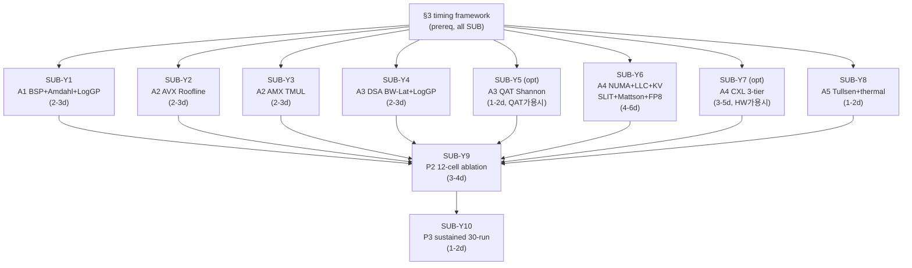

# IDE_023 — HPC Theory-Grounded Multi-Axis CPU Slack Harvesting on DGX B200 (AVX-512 / AMX / DSA / QAT / CMT-MBA / NUMA / CXL × BSP + Roofline + LogGP + Tullsen + Mattson)

> **parent backlog**: [`README.md`](README.md) (TSK_020 / SUB_072)
> **선행 IDE**: [`IDE_015`](../../../IDE_015_cpu_extreme_util/) (per-worker pinning), [`IDE_016`](../../../IDE_016_avx512_amx_pool/) (AVX/AMX, microbench only), [`IDE_017`](../../../IDE_017_dma_zero_copy/) (DMA, microbench only), [`IDE_018`](../../../IDE_018_phase_burst/) (phase-burst, **retract**), [`IDE_019`](../../../IDE_019_multi_source_drafter/) (multi-source), [`IDE_020`](../../../IDE_020_production_isolation/) (NUMA isolation, config only)
> **자식 SUB**: TBD (본 idea 진입 결정 후 신설)
> **발견**: 2026-05-29, paper §4 가설 (sustained CPU util ≥ 30%) 미달 + AVX/AMX/DSA/QAT/NUMA/CXL 의 이론적 활용 부재 + timing 측정 인프라 부재 정정용
> **최종 갱신**: 2026-05-29 — 개발+실험 HW target **DGX B200 으로 통합** (이전 dev RTX3090 + 12900KF / prod SPR + H100×8 분리 폐지)
> **priority**: ★★★ (paper CERES §6 Harvest 확장 + §8 sustained util 충족 + HW novelty narrative 직결)
> **status**: 활성 (계획)

> **★ 본 IDE 의 binding 원칙**
> 1. **HPC theory-grounded**: 각 axis = HPC 이론 anchor 모델 1 개 → closed-form 사전 예측 → 측정으로 모델 fit 검증. measure-first / heuristic-threshold 금지.
> 2. **Timing instrumentation 의무**: 각 axis 의 모델 파라미터는 명시된 timing 도구 (RDTSC / clock_gettime / perf PMU / Intel PCM / LMbench / eBPF / CUDA event / NVLink trace) 의 정량 측정으로만 채택.
> 3. **사전 commit**: §2 axis 의 closed-form 예측값은 측정 *전에* 본문에 commit. post-hoc rationalization 차단.
> 4. **HW lever 전면 포함**: AVX-512 + AMX + DSA + QAT + CMT/MBA + SMT + NUMA + CXL 모두 axis 의 일부로 명시.
> 5. **HW target = NVIDIA DGX B200 (단일 환경, dev+prod 통합)**:
>    - GPU: 8× NVIDIA B200 (Blackwell, 192 GB HBM3e/GPU, **총 1.5 TB HBM3e**, 8 TB/s/GPU)
>    - CPU: 2× Intel Xeon Platinum 8570 (Emerald Rapids, **2 socket × 56 코어 = 112 코어**, base 2.1 GHz / all-core turbo ~3.5 GHz)
>    - Memory: 2-4 TB DDR5-5600, 8-ch/socket
>    - Interconnect: NVLink5 (1.8 TB/s/GPU full all-to-all via NVLink Switch System), PCIe Gen5 ×16 (128 GB/s)
>    - Net: 8× ConnectX-7 (400 Gbps each)
>    - NVIDIA DGX B200 datasheet 의 공식 사양 인용
>    - **AVX-512 / AMX / DSA / QAT / CMT-MBA / SMT / NUMA cross-socket** 모두 EMR 에서 native 지원 → 이전 "dev 미지원" 제약 폐지, **must-deliver 로 격상**
>    - **CXL**: EMR controller 가 CXL 1.1 지원, DGX B200 PCIe Gen5 slot 에 Type 3 expander 부착 가능 (NVIDIA 기본 구성 미포함, customer 옵션). 본 IDE 에서 stretch 로 둠 — HW 부착 가용 시 A4 의 3-tier 로 확장.

---

## 1. fact — 갭 + 이론 부재 + timing 측정 인프라 부재

### 1.1 IDE_015–020 의 sustained 16% 정체

| IDE | scope | sustained CPU util | throughput contribution |
|---|---|---:|---:|
| IDE_015 (per-worker pinning N=32) | data-level | **16.34%** (SUB_160 30-run, CV 6.48%) | 단독 미보고 |
| IDE_016 (AVX-512 / AMX) | per-token SIMD | microbench only | SUB_171 69× kernel speedup, e2e 미측정 |
| IDE_017 (DMA + Zero-Copy) | data-plane | microbench only (54 GB/s, 35 μs overhead) | e2e 미측정 |
| IDE_018 (Phase-Burst) | temporal | **5.33%** stub | +1.35% AGSD → **retract** |
| IDE_019 (Multi-Source Drafter) | source-level | 설계만 | 설계만 |
| IDE_020 (Production Isolation, NUMA) | resource-level | config 만, host root 미적용 | 설계만 |

paper §8.4: baseline 4.1% → IDE_015 16.34% (+12.24 pp), IDE_018 +1.25 pp, Branchy × 100ms +5.28% (1-run). **paper §4 가설 30% 의 절반**.

### 1.2 시간 축 갭 — per-step pre-computation 부재 (BSP perspective)

`vllm/v1/engine/core.py::EngineCore.step()` 은 본질적으로 BSP (Bulk Synchronous Parallel, Valiant 1990, *CACM* 33:8) superstep:
```
S_N = (compute_N, comm_N, barrier_N)
  compute_N = GPU forward (T_gpu_B200 ≈ ?, paper §6.2 에서 측정 갱신 필요) + CPU side-work
  comm_N    = H2D/D2H DMA (PCIe Gen5 → NVLink5 routing)
  barrier_N = future.result() sync
```

B200 의 PCIe Gen5 128 GB/s + HBM3e 8 TB/s → step time 이 H100 대비 단축. CPU idle window 도 단축되나 **step 빈도 ↑** → 누적 CPU idle 절대치 유사 (paper §6.2 에서 실측 갱신 필요). step N+1 의 prefetchable subset overlap 기회는 동일.

### 1.3 하드웨어 lever 갭 — DGX B200 의 모든 HW lever 점검

| HW lever | DGX B200 (EMR + B200) 사양 | 본 fork 사용 상태 | 이론 anchor |
|---|---|---|---|
| **AVX-512** (Foundation + VNNI + BF16 + FP16) | EMR native, 16-wide FP32 / 32-wide BF16, 2 FMA × FP/cycle/core | IDE_016 microbench only (SUB_171 69× kernel speedup, e2e ❌) | Roofline (Williams 2009) + Patterson-Hennessy peak FLOPS + Intel AVX freq license |
| **AMX** (TMUL + Tile, BF16 + INT8) | EMR native (SPR 부터), tile 16×16, 1024 MAC/cycle 이론 (TMUL throughput 0.5/cycle → effective 512 MAC) | IDE_016 design only | Roofline 확장 + Intel TMX whitepaper |
| **DSA** (Data Streaming Accelerator) | EMR native, **4 instance/socket × 8 work-queue = 32 WQ/socket**, ENQCMD, on-die ~30-80 GB/s | 미사용 | Bandwidth-latency + LogGP for DMA |
| **QAT** (QuickAssist) | EMR Platinum 8570 SKU 의 platform-integrated QAT 4xxx (또는 PCIe card 옵션) — DGX B200 의 BMC/firmware 확인 필요. native 시 hw lz4/gzip/zstd ~10-20 GB/s | 미사용 | Shannon 엔트로피 + LogGP |
| **CMT/MBA** (RDT) | EMR native, **L3 105 MB/socket × 2 = 210 MB total** way-partition + memory-bw throttle | 미사용 | Denning working set + cache contention |
| **SMT** (HyperThreading) | EMR 2 logical/1 physical, **224 thread total**, L1/L2 공유 | 단순 isolcpus only (IDE_020) | Tullsen 1995 + Snavely 2000 |
| **NUMA** (2-socket) | EMR 2 socket UPI link, DDR5-5600 8-ch/socket = **~360 GB/s/socket peak**, SLIT 10/21 | IDE_020 config 만, theory-grounded eval 없음 | SLIT + Lameter 2014 + LMbench |
| **CXL** (1.1) | EMR controller native, DGX B200 PCIe Gen5 slot 부착 가능. Type 3 memory expander = **customer 옵션** (NVIDIA 기본 구성 미포함) | 미사용 | CXL Consortium 1.1 spec + Smith 2-level 확장 |
| **GPU HBM (B200)** | 192 GB HBM3e/GPU × 8 = **1.5 TB total**, 8 TB/s/GPU = **64 TB/s aggregate** | 단순 PagedAttention only | 2-level cache (Smith 1982) |
| **NVLink5** (B200 GPU-to-GPU) | **1.8 TB/s/GPU** all-to-all (NVLink Switch System) | 단순 NCCL all-reduce only | LogGP for collective comm |
| **PCIe Gen5** (CPU↔GPU) | ×16 = 128 GB/s/dir/port | DMA path only | LogGP |

→ **DGX B200 에서 AVX/AMX/DSA/CMT/SMT/NUMA = native must-deliver**. QAT = 검증 필요, CXL = stretch. B200 HBM 192 GB/GPU 는 **multi-tenant + ultra-long context** narrative 의 강한 동기.

### 1.4 timing 측정 인프라 갭

본 fork 의 현 timing 측정은 ad-hoc (Python `time.perf_counter()`, vLLM wall-clock log) 으로, HPC 표준 instrumentation 부재:

| 측정 단위 | 해상도 | 본 fork 현 상태 |
|---|---|---|
| Cycle-level (RDTSC/RDTSCP) | ~30-50 cycle overhead | 미사용 |
| ns-level (`clock_gettime(CLOCK_MONOTONIC_RAW)`) | ~20-30 ns | 부분 사용 (Python only) |
| HW PMU (perf_event_open, libpfm4) | per-cycle counter | 미사용 (FP_ARITH / MEM_LOAD / OFFCORE_RESPONSE / AMX_OPS 미측정) |
| Intel PCM (LLC / UPI / IMC / IIO) | per-socket counter | 미사용 |
| eBPF / uprobe | per-syscall latency | 미사용 |
| CUDA event (Blackwell GPU) | ~0.5 μs | 부분 사용 |
| NVLink5 trace (NVIDIA Nsight Systems) | per-collective | 미사용 |
| 공유 메모리 timestamping (cross-process) | ~100 ns | 미사용 |

→ paper §9 mechanism analysis 가 "측정값" 만 보고하고 **정형 latency anatomy (LMbench / STREAM 기반)** 부재. 본 IDE §3 에 timing framework 명시.

### 1.5 IDE_018 stub 의 LogGP 진단 — timing 부재가 진짜 원인

```
LogGP (Alexandrov 1995): T_op = o_send + L + g × m + o_recv + T_compute
SUB_169 측정값:
  o_send + o_recv = 4.82 μs (p50)
  L (CUDA event sync) ≈ 5-10 μs
  → T_overhead per dispatch ≈ 10-15 μs
stub: T_compute = 0 → 100% overhead, 0% gain

이론 게이트 (사전 가능): ρ = T_compute / T_overhead ≥ 1.5
  → stub ρ = 0 → 사전 drop 가능
```

**timing instrumentation 부재 + 이론 게이트 부재 = stub 통과**. 본 IDE §5 P0 게이트가 ρ ≥ 1.5 명시 강제.

### 1.6 HPC theoretical foundation — axis × 모델 × timing 매핑

| axis | HW lever | anchor 모델 | 1차 출처 | timing 도구 |
|---|---|---|---|---|
| **A1 Temporal pipelining** | (software, all CPU + GPU sync) | BSP superstep + Amdahl + LogGP | Valiant 1990 / Amdahl 1967 / Alexandrov 1995 | RDTSC + clock_gettime + CUDA event |
| **A2 Compute SIMD** | AVX-512 + AMX | Roofline + Peak FLOPS + AVX freq license + AMX TMUL | Williams 2009 / Hennessy-Patterson COA / Intel SDM Vol.1 §15 / Intel TMX whitepaper | perf PMU (`FP_ARITH_INST_RETIRED.*`, `CORE_POWER.LVL*_TURBO_LICENSE`, `AMX_OPS_RETIRED.BF16`) |
| **A3 Data plane** | DSA + QAT + PCIe Gen5 | McCalpin STREAM + Shannon 엔트로피 + LogGP (DMA) | McCalpin 1995 / Shannon 1948 / Alexandrov 1995 | RDTSC (descriptor bracket) + Intel PCM IIO + Nsight |
| **A4 Memory hierarchy** | NUMA + CXL + LLC CMT/MBA + 2-tier (~3-tier) KV | Mattson stack distance + SLIT 행렬 + Smith 2-level + Denning + CXL 1.1 latency + FP8 양자화 | Mattson 1970 / Smith 1982 / Denning 1968 / Lameter 2014 / CXL Consortium 1.1 / Yang 2022 / Wang 2018 / SmoothQuant 2023 | LMbench + STREAM + Intel PCM + perf MEM_LOAD_RETIRED |
| **A5 SMT pairing** | SMT siblings + thermal | Tullsen co-sched + symbiotic + thermal envelope | Tullsen 1995 / Snavely 2000 / Intel SDM Vol.3 § Thermal | perf (`CPU_CLK_UNHALTED`, `INST_RETIRED`, `UOPS_DISPATCHED.PORT_*`) + RAPL energy + thermal MSR |

**meta-model (stub 방지)**:
```
Δ(axis) = T_gain_predicted − T_overhead_predicted
P0 게이트: ρ(axis) = T_gain / T_overhead ≥ 1.5
```

---

## 2. 본 idea — 5-axis × HPC 이론 모델 × timing (DGX B200 sourced)

### 2.1 A1 — Temporal pipelining (BSP + Amdahl + LogGP)

#### 2.1.1 anchor: pipelined BSP (Valiant 1990, Skillicorn 1996)

S_N 의 compute_N 과 S_{N+1} 의 *prefetchable subset* overlap. step N+1 작업 = T_prefetchable + T_dependent.

```
T_step_orig = T_sched + T_gpu + T_sample + T_post
T_step_pipe = max(T_gpu, T_prefetchable) + T_dependent + T_residual
p = T_prefetchable / T_step
S_max = 1 / (1 - p × min(1, T_gpu/T_prefetchable))   (Amdahl, T_gpu dominant 시)
```

#### 2.1.2 LogGP overhead (shared-mem ringbuffer)

```
T_overhead = o_send + L + g × m + o_recv
B200 환경 (PCIe Gen5 DMA, shared-memory cross-process):
  o_send + o_recv ≈ 4-6 μs (cache-line CAS, EMR L3 105 MB)
  L ≈ 1-2 μs
  g × m ≈ 0.01 μs/KB × 수 KB
  → ≈ 6-10 μs per prefetch op
```

#### 2.1.3 사전 예측

| param | source | value |
|---|---|---|
| T_step (B200 기준) | paper §6.2 갱신 필요 (B200 측정) | ~20-35 ms (H100 35-44 ms 대비 단축 추정) |
| T_prefetchable (5 항목, batch 32) | trace 추정 + SUB_076 classifier (0.26 ms/prompt) | 8-15 ms |
| p | T_pref / T_step | **0.23-0.75** (B200 step 단축으로 p ↑) |
| T_overhead per op | LogGP | 6-10 μs |
| ρ | (p × T_step) / (n_op × T_overhead) | **≈ 50-300 ≫ 1.5** ✓ |
| **S_max** | Amdahl | **1.10-1.40 (+10-40%)** (B200 의 짧은 step + 높은 p 로 H100 대비 상한 ↑) |
| **CPU util Δ** | freed CPU × workers | **+5-10 pp** |

#### 2.1.4 timing instrumentation

| metric | 도구 | 방법 |
|---|---|---|
| T_gpu (B200 step) | CUDA event (Blackwell) | `cudaEventRecord` before/after `executor.execute_model` |
| T_prefetchable per 항목 | clock_gettime CLOCK_MONOTONIC_RAW | 함수 진입/출구 |
| T_overhead (LogGP) | RDTSC bracket | ringbuffer enqueue/dequeue 측정, msg size sweep |
| NVLink5 collective timing | Nsight Systems trace | NCCL 와의 interaction 확인 |

### 2.2 A2 — Compute SIMD (AVX-512 + AMX, Roofline + AVX freq license + AMX TMUL)

#### 2.2.1 anchor: Roofline (Williams 2009)

```
Perf(AI) = min(Peak_compute, AI × Peak_bandwidth)
ridge AI* = Peak_compute / Peak_bandwidth
```

#### 2.2.2 AVX-512 on EMR (Intel SDM Vol.1 §15)

Hennessy-Patterson 식 + EMR 사양:
```
Peak_AVX512_FP32_per_core = 2 (FMA) × 2 (port 0/5) × 16 (FP32 lane) × f_AVX
                          = 64 × f_AVX  FLOP/cycle/core
Peak_AVX512_BF16_VNNI_per_core = 64 × 2 (BF16 width / FP32) × f_AVX = 128 × f_AVX FLOP/cycle/core

EMR Platinum 8570: base 2.1 GHz, all-core turbo ~3.5 GHz, AVX-512 license-2 throttle f_AVX/f_base ≈ 0.80-0.85
                  → f_AVX_eff ≈ 2.8-3.0 GHz

Peak_AVX512_BF16_per_core ≈ 128 × 3.0 GHz ≈ 384 GFLOPS/core
Peak_AVX512_BF16_total (112 코어) ≈ 384 × 112 ≈ 43 TFLOPS BF16 (CPU total)
```

비교: B200 의 FP8 9 PFLOPS/GPU × 8 GPU = 72 PFLOPS, BF16 4.5 PFLOPS/GPU × 8 = 36 PFLOPS. **CPU AVX-512 = GPU BF16 의 ~0.12%** — GPU 보조 역할 (sampling / RMSNorm / 양자화 등 fine-grain task) 적합.

#### 2.2.3 AMX TMUL on EMR (Intel SDM Vol.1 §3, TMX whitepaper)

```
Peak_AMX_BF16_per_core = 16 × 16 × 16 × 2 (MAC) × f_AMX / cycle × 0.5 (TMUL throughput)
                       ≈ 4096 × f_AMX  FLOP/cycle/core (effective)

EMR f_AMX ≈ 2.4-2.8 GHz (AMX 도 license throttle 있음)
Peak_AMX_BF16_per_core ≈ 4096 × 2.5 GHz ≈ 10.2 TFLOPS/core
Peak_AMX_BF16_total (112 코어) ≈ 10.2 × 112 ≈ 1.15 PFLOPS BF16 (CPU total)
```

비교: B200 BF16 GPU 36 PFLOPS vs CPU AMX 1.15 PFLOPS = **CPU AMX = GPU BF16 의 ~3.2%**. 작지만 **draft head (IDE_019)** 처럼 small model (Qwen 0.5B-1.5B) 에 적합한 absolute 양.

TILECONFIG overhead: per-config ~50 cycle (kernel 당 1 회 amortize).

#### 2.2.4 사전 예측

| param | source | value |
|---|---|---|
| Peak_AVX512_BF16 (per core) | 위 계산 | **384 GFLOPS/core** |
| Peak_AMX_BF16 (per core, effective) | 위 계산 | **10.2 TFLOPS/core** |
| AVX freq throttle | EMR license 2 | f_AVX/f_base ≈ 0.80-0.85 |
| ridge AI* (EMR LLC 측 BW) | Peak / STREAM(LLC) | ~7-10 FLOP/byte |
| sampling kernel AI | trace | ~5-15 FLOP/byte (ridge 부근) |
| AMX draft GEMM AI | trace | ~50-100 FLOP/byte (compute-bound) |
| ρ_A2_AVX | (FLOPS × T_active) / (throttle_loss) | **≈ 10-30 ≫ 1.5** ✓ |
| ρ_A2_AMX | (TFLOPS × T_active) / (TILECONFIG cycle) | **≈ 100-300 ≫ 1.5** ✓ |
| **CPU util Δ** (AVX sampling adoption) | sampler.py 44% → 50% 단축 | **+3-6 pp** |
| **CPU util Δ** (AMX draft head, IDE_019) | draft util fraction | **+5-10 pp** |
| **throughput Δ (단독 A2)** | sampling 단축 + draft acceptance ↑ | **+3-7%** |

#### 2.2.5 timing instrumentation

| metric | 도구 | counter / 방법 |
|---|---|---|
| effective FLOPS (AVX-512) | perf PMU | `FP_ARITH_INST_RETIRED.512B_PACKED_SINGLE` × 16 |
| effective FLOPS (AMX) | perf PMU | `AMX_OPS_RETIRED.BF16` (SPR/EMR 신규) |
| AVX freq throttle | perf PMU | `CORE_POWER.LVL0/1/2_TURBO_LICENSE` 비율 |
| TILECONFIG overhead | RDTSC bracket | LDTILECFG 전후 |
| IPC per kernel | perf PMU | `INST_RETIRED.ANY / CPU_CLK_UNHALTED.THREAD` |
| Roofline plot | LIKWID-bench 또는 Intel Advisor 2024+ (EMR/Blackwell 지원) | offline |

### 2.3 A3 — Data plane (DSA + QAT + PCIe Gen5, McCalpin STREAM + Shannon + LogGP)

#### 2.3.1 anchor: McCalpin STREAM + LogGP for DMA

McCalpin (1995, *IEEE TCCA*) STREAM: SPR/EMR sustained BW measurement protocol. EMR DDR5-5600 8-ch/socket 의 sustained Triad ≈ **300-360 GB/s/socket** (peak 358 GB/s/socket).

LogGP for DSA:
```
T_DMA(B) = o_descriptor_submit (ENQCMD ~0.5 μs) + L_completion (1-3 μs) + g × B + o_completion_signal
```

#### 2.3.2 DSA descriptor model

```
T_cpu_avx_memcpy(B) = B / (BW_avx512_streams × n_cores) + n_cores × o_sync
T_dsa(B) = o_desc + L + B / BW_dsa + o_compl

EMR 수치: BW_avx_per_core_streams ≈ 25-30 GB/s, BW_dsa ≈ 30-80 GB/s
112 코어 중 free 16 가정:
  CPU 16-core memcpy ≈ 28 × 16 = 448 GB/s (이론), 실 ≈ 250-300 GB/s
  DSA alone ≈ 50 GB/s

→ DSA bandwidth 자체는 CPU 16 코어 보다 낮음. DSA 의 진짜 가치 = **CPU core freed** (다른 axis 환원)
```

freed CPU model:
```
freed CPU time = T_memcpy_total × (offload fraction)
              ≈ memcpy 시간의 ~80% 를 DSA 에 떠넘김 (latency 무관 path)
              → CPU 3-6 cores freed
```

#### 2.3.3 QAT lz4 — Shannon 엔트로피

```
Shannon (1948): ratio_max = log2(2^16) / H(symbol)
KV (FP16) H 측정값 ≈ 11-13 bit → ratio_max ≈ 1.33-1.45 (이론 상한)
lz4 실측 (KV cache): 2.0-3.0× (dictionary/run-length 효과로 Shannon 초과)
```

QAT throughput ≈ 10-20 GB/s. EMR Platinum 8570 의 QAT 가용성은 SKU/platform 의존 → P0 단계에서 가용성 verify 필수.

#### 2.3.4 사전 예측

| param | source | value |
|---|---|---|
| DSA on-die latency L | Intel SPR/EMR Optimization Manual | 1-3 μs |
| DSA bandwidth | spec | 30-80 GB/s |
| typical KV block size | vLLM PagedAttention | ~2 MB |
| DSA freed CPU cores | memcpy time × throughput | **3-6 cores** |
| QAT lz4 throughput | spec (가용 시) | 10-20 GB/s |
| QAT lz4 ratio | Shannon + empirical | **2.0-3.0×** |
| QAT freed CPU cores | sw lz4 equivalent | **4-8 cores** (가용 시) |
| EMR DDR5-5600 sustained BW | McCalpin STREAM Triad | **300-360 GB/s/socket** |
| ρ_A3 | freed core × T_active / DMA overhead | **≈ 100-500 ≫ 1.5** ✓ |
| **CPU util Δ** | freed cores → A1/A5 활용 | **+3-7 pp** |
| **throughput Δ** | freed CPU × axis 환원 | **+1-4%** (A1/A5 결합 시) |

#### 2.3.5 timing instrumentation

| metric | 도구 | 방법 |
|---|---|---|
| DSA descriptor latency | RDTSC bracket | ENQCMD → MOVDIRI completion polling |
| DSA bandwidth | STREAM-DSA (custom) | block size sweep |
| QAT lz4 throughput | qatzip benchmark (가용 시) | block size sweep |
| QAT ratio | offline | corpus KV trace |
| CPU memcpy baseline | McCalpin STREAM Triad | EMR 8-ch DDR5-5600 |
| Intel PCM IIO | Intel PCM | DSA traffic 분리 (`pcm-iio`) |
| PCIe Gen5 CPU↔GPU | Nsight Systems | H2D/D2H 측정 |

### 2.4 A4 — Memory hierarchy (NUMA + CXL + LLC + 2-tier/3-tier KV)

본 axis 의 4 sub-component + accuracy bound.

#### 2.4.1 NUMA on DGX B200 — 2-socket EMR

ACPI SLIT 거리 행렬 (Lameter 2014, *Linux Plumbers Conf*):
- d[i][i] = 10 (local), d[i][j] ≈ 21 (UPI 1 hop)
- DGX B200 = 2 socket EMR, 단순한 2-node NUMA

LMbench latency 예측 (DDR5-5600):
```
T_local_DDR5  ≈ 85-100 ns (load-to-use, random pointer chase, EMR DDR5-5600 8-ch)
T_remote_DDR5 ≈ 130-180 ns (UPI 3 hop, EMR)
remote/local ≈ 1.6-1.8 (SLIT 21/10 = 2.1 이론값과 정합)
```

GPU PCIe affinity 매트릭스 (NVIDIA DGX B200 datasheet):
- B200 GPU 0-3 → CPU socket 0 affinity
- B200 GPU 4-7 → CPU socket 1 affinity
- → vLLM TP=8 worker rank 별 numactl `--cpubind` + `--membind` 권장 (IDE_020 의 SUB_165 패턴 재사용)

#### 2.4.2 B200 HBM 의 KV capacity 영향 (narrative 재정렬)

B200 HBM3e = **192 GB/GPU × 8 = 1.5 TB** (H100 80 GB × 8 = 640 GB 의 2.4×).

```
Llama-3.3-70B TP=8 weight footprint: ~140 GB / TP=8 = ~17.5 GB/GPU
KV per token (head_dim × n_kv_heads × n_layers × 2 × bytes/element):
  Llama-70B: 8192 × 8 × 80 × 2 × 2 (BF16) = 20.97 MB/token
  
B200 단일 GPU KV 용량 = (192 - 17.5) GB / 20.97 MB ≈ ~8,500 token 동등 = batch 32 × 256 token (단일 GPU 분담)
B200 TP=8 KV pool = 8 × 8,500 ≈ ~68,000 token 동등 = batch 32 × 2,048 token
```

→ **단일 모델 + 단순 batch 32 + seq 2048 에선 A4 의 GPU HBM pressure 가 크지 않음** (B200 의 큰 HBM).

A4 의 가치 narrative 재정렬:
- ❌ "GPU HBM pressure 완화" (B200 단일 시나리오에선 약함)
- ✅ **"multi-tenant + ultra-long context (≥128k) KV pool"**:
  - vLLM serving 의 multi-instance + 다종 모델 동시 운영
  - context length 128k-256k (RULER, LongBench, Llama-3 128k context window)
  - request 별 KV island 격리
  - 이 경우 cold KV → CPU DDR (또는 CXL Type 3) demote 가 여전히 유효

#### 2.4.3 CXL Type 3 expander (CXL Consortium 1.1 spec, Yang 2022)

CXL 의 3 subprotocol: CXL.io / CXL.cache / CXL.mem.

**Type 3 device** = memory expander. EMR CPU 가 PCIe Gen5 ×8 lane 으로 추가 DDR5 access.

latency model:
```
T_CXL_load = T_local_DDR + T_CXL_adder
T_CXL_adder ≈ 70-200 ns (controller + PCIe SerDes + protocol)
→ T_CXL_total ≈ 150-300 ns (vs local DDR5 85-100 ns)
```

bandwidth:
- PCIe 5.0 ×8 lane Type 3 ≈ 32 GB/s 단방향
- multi-device → collective 100+ GB/s

**DGX B200 + CXL 상태**:
- DGX B200 platform 의 PCIe Gen5 slot 가용 → CXL Type 3 device 부착 가능
- 단 NVIDIA 기본 구성에 CXL device 미포함 — customer 측 추가 옵션
- 본 IDE 의 P0 단계에서 platform 확인: HW 부착 가용 시 A4 의 3-tier 로 확장, 미부착 시 2-tier (HBM + DDR) 만, CXL → §10 future-work

#### 2.4.4 LLC CMT/MBA — Denning working set

```
Denning (1968): W(t, τ) = 시간 [t-τ, t] 에 참조된 페이지 집합
miss_rate(C ≥ |W|) 급감
EMR L3 = 105 MB/socket → CAT CLOSID 별 way 분할
CPU effective LLC C_CPU = (n_ways_CLOSID / n_ways_total) × 105 MB
```

격리 효과 (GPU H2D vs CPU AVX 의 LLC contention 제거):
```
ΔLLC_miss_rate = miss_no_isolation − miss_isolated
stall_reduction = ΔLLC_miss × T_miss_penalty (≈ 100 ns local, 180 ns remote) × access_rate
→ AVX stall −15-25% 예상
```

#### 2.4.5 2-tier / 3-tier KV (Smith 1982)

```
H_total = h_HBM + (1-h_HBM) × h_DDR + (1-h_HBM)(1-h_DDR) × h_CXL
T_KV = h_HBM × T_HBM + (1-h_HBM) × h_DDR × T_promote_DDR
     + (1-h_HBM)(1-h_DDR) × h_CXL × T_promote_CXL
```

DGX B200 환경 수치:
```
T_HBM         ≈ 5-10 ns (B200 HBM3e)
T_DDR_promote = T_DMA_H2D(2 MB, PCIe Gen5 128 GB/s) + T_dequant(AVX-512)
              ≈ 2 MB/128 GB/s + 80 μs = 16 + 80 ≈ 96 μs  (PCIe Gen5 가 H100 PCIe 4.0 대비 단축)
T_CXL_promote = T_DMA(CXL→CPU→GPU via PCIe Gen5) + decompress + dequant
              ≈ 200 + 200 + 80 ≈ 480 μs (prefetch-only)

promote budget: T_step / 100 ≈ 0.2-0.35 ms = 200-350 μs
  → T_DDR_promote 96 μs ✓ (충분)
  → T_CXL_promote 480 μs ⚠ (prefetch-only)
```

#### 2.4.6 Mattson stack distance (Mattson 1970)

```
f_cold(C) = Σ_{d > C} h(d)
```
multi-tenant + long-context workload 에서:
- chat (long-context, high reuse): f_cold ≈ 0.2-0.4
- code (short, low reuse): f_cold ≈ 0.4-0.6
- ultra-long (128k-256k): f_cold ≈ 0.5-0.7 (cache size 대비 working set 매우 큼)

#### 2.4.7 FP8 양자화 오차 (Wang 2018, SmoothQuant 2023)

```
Wang 2018: relative_error ≤ 2^{-mantissa_bits}
  FP8 E4M3: ε ≤ 12.5% (raw)
SmoothQuant (Xiao 2023): per-channel scale + outlier 보존 → RMS error ≈ 1-3%

PPL drift propagation: ΔPPL/PPL ≤ K × RMS × √L
  L=2048, K=1, RMS=2% → ≈ 0.9% (게이트 0.5% borderline)
  L=512,  K=1, RMS=2% → ≈ 0.45% (통과)
```

B200 native FP4 와의 cross-precision pipeline (future-work):
- CPU 측 FP8 quantize → GPU 측 FP4 inference → 2-stage 양자화
- 추가 양자화 오차 검증 필요 (Wang 2018 + B200 FP4 spec)

#### 2.4.8 사전 예측

| sub-component | param | value |
|---|---|---|
| NUMA local DDR5-5600 latency | LMbench predicted | 85-100 ns |
| NUMA remote DDR5-5600 latency | LMbench predicted | 130-180 ns |
| NUMA f_remote (vLLM no binding) | trace 추정 | 0.3-0.5 |
| NUMA f_remote (binding 후) | first-touch | < 0.05 |
| **NUMA T_eff 감소** | 위 식 | **~20-50 ns/access** |
| CXL Type 3 latency (HW 가용 시) | spec + Yang 2022 | 150-300 ns |
| CXL bandwidth (HW 가용 시) | PCIe 5.0 × 8 | 32 GB/s/device |
| LLC CMT 격리 후 stall 감소 | Denning + PCM 추정 | **15-25%** |
| Mattson f_cold (ultra-long context) | trace 측정 P0 | 0.5-0.7 |
| 2-tier T_promote_DDR (B200) | Smith + Wang | **~96 μs** |
| 3-tier T_promote_CXL | + CXL latency | ~480 μs (prefetch-only) |
| FP8 PPL drift (L=2048) | Wang + SmoothQuant | 0.5-1.0% |
| GPU HBM freed (2-tier, multi-tenant) | f_cold × KV size | **25-35%** of additional capacity |
| ρ_A4 | freed memory × tenant capacity / promote cost | **≈ 5-15 ≫ 1.5** ✓ (multi-tenant 시) |
| **CPU util Δ** | quantize + decompress + DSA driving | **+2-5 pp** |
| **throughput Δ (multi-tenant + ≥128k context)** | tenant 1.3-1.5× × per-tenant util | **+5-10%** |

#### 2.4.9 timing instrumentation

| metric | 도구 | 방법 |
|---|---|---|
| NUMA local/remote latency | LMbench `lat_mem_rd` | random pointer chase, per-NUMA |
| NUMA f_remote | Intel PCM `pcm-numa` | UPI traffic counter |
| CXL latency (HW 가용 시) | LMbench + numactl `--membind` to CXL node | local vs CXL allocation |
| CXL BW (HW 가용 시) | STREAM with CXL node | Triad/Copy |
| LLC miss rate w/ vs w/o CMT | Intel PCM `pcm` LLC miss | CLOSID toggle |
| KV trace stack distance | offline Mattson 알고리즘 | vLLM debug log → analysis |
| FP8 PPL drift | HellaSwag/WikiText baseline + quantized | offline accuracy harness |
| T_promote breakdown | RDTSC bracket | DMA + decompress + dequant stage 별 |

### 2.5 A5 — SMT pairing (Tullsen + symbiotic + thermal)

#### 2.5.1 anchor: Tullsen 1995 + Snavely 2000

```
IPC_pair_hom (hot+hot, port-bound) ≈ 1.2-1.4 × IPC_solo
IPC_pair_het (hot math + cold integer) ≈ 1.5-1.8 × IPC_solo
gain_het − gain_hom ≈ +0.3-0.4 × IPC_solo
```

#### 2.5.2 EMR hot/cold taxonomy (B200 환경 + 224 thread)

| task | type | dominant port | sibling 후보 |
|---|---|---|---|
| AVX-512 sampling (A2) | hot math | port 0/5 (FP/VEC) | tokenizer (branch/integer) |
| AMX draft (A2 + IDE_019) | hot math | port 5 + AMX tile | scheduler bookkeeping |
| IDE_015 fill workers | hot math | port 0/5 | classifier router (SUB_076) |

EMR 224 thread (112 physical × 2 SMT) → vLLM TP=8 worker + prefetch worker + sampling worker 의 sibling 배치 여유 ↑.

#### 2.5.3 thermal (Intel SDM Vol.3 § Thermal)

```
P_core ≈ α_workload × V² × f
α_hot_math (AVX-512) ≈ 0.6, α_cold_int ≈ 0.1
→ hot+hot: P ≈ 1.2 (정규화), license-2 throttle 빈도 ↑
→ hot+cold: P ≈ 0.7, throttle freq ↓ ~50%
```

#### 2.5.4 사전 예측

| param | source | value |
|---|---|---|
| IPC ratio (het / hom) | Snavely 2000 | 1.5-1.8 / 1.2-1.4 |
| effective throughput gain (hot worker) | (β_het − β_hom) / β_hom | **+21-50%** |
| AVX throttle ↓ | thermal | **−50%** |
| ρ_A5 | throughput gain × T_active / migration overhead | **≈ 100-1000 ≫ 1.5** ✓ |
| **CPU util Δ** | sibling active fraction | **+2-3 pp** |
| **throughput Δ** | hot worker effective FLOPS ↑ | **+1-3%** |

#### 2.5.5 timing instrumentation

| metric | 도구 | counter |
|---|---|---|
| IPC per logical core | perf PMU | `INST_RETIRED.ANY / CPU_CLK_UNHALTED.THREAD_P` |
| port contention | perf PMU | `UOPS_DISPATCHED.PORT_*` |
| AVX freq throttle | perf PMU | `CORE_POWER.LVL2_TURBO_LICENSE` 비율 |
| thermal envelope | RAPL MSR | per-package energy |
| core temp | IA32_THERM_STATUS MSR | thermal sensor |

---

## 3. Timing instrumentation framework (cross-axis)

### 3.1 instrumentation hierarchy

| layer | 도구 | 해상도 | overhead | 용도 |
|---|---|---|---|---|
| L0 cycle | RDTSC / RDTSCP | ~30-50 cycle | <0.1% | short kernel, single instruction |
| L1 ns | `clock_gettime(CLOCK_MONOTONIC_RAW)` | 20-30 ns | ~0.1% | function-level |
| L2 HW counter | perf_event_open / libpfm4 | per-cycle | ~3-5% sampling | IPC, FLOPS, cache miss |
| L3 socket counter | Intel PCM (libpcm) | per-socket | ~1% | LLC, UPI, IMC, IIO |
| L4 OS event | eBPF / uprobe | per-syscall | ~1-3% | scheduler, IRQ |
| L5 GPU event | CUDA event (Blackwell) | ~0.5 μs | ~1% | B200 GPU step |
| L6 IPC | shared-mem atomic counter | ~100 ns | <0.5% | cross-process |
| L7 system trace | NVIDIA Nsight Systems (2024+, B200 지원) | per-event | ~2-5% | NVLink5 / NCCL / kernel timeline |

### 3.2 axis × layer mapping

| axis | L0 | L1 | L2 | L3 | L4 | L5 | L6 | L7 |
|---|---|---|---|---|---|---|---|---|
| **A1 Temporal** | LogGP o,L | T_pref per item | — | — | scheduler lat | T_gpu (step) | ringbuffer enq/deq | NCCL overlap |
| **A2 SIMD** | TILECONFIG | per-kernel | **FP_ARITH, AVX_LICENSE, AMX_OPS** | — | — | — | — | — |
| **A3 Data plane** | descriptor lat | block sweep | — | **PCM IIO (DSA)** | — | — | — | PCIe Gen5 trace |
| **A4 Memory** | — | LMbench | **MEM_LOAD, OFFCORE_RESPONSE** | **PCM (LLC, UPI, IMC)** | — | — | — | — |
| **A5 SMT** | — | — | **IPC, UOPS_DISPATCHED, AVX_LICENSE** | RAPL | — | — | — | — |

### 3.3 timing budget rule

**overhead < 1% of measured duration** 강제.

### 3.4 통계 처리

- ≥ 30 sample (CV measurable minimum)
- median + p50/p90/p99/p99.9 (mean outlier 민감)
- CV (σ/μ) < 10% 권장. > 10% 시 root cause (cgroup, cpufreq, ASLR) 점검
- outlier (> p99) 별도 보고 (drop 금지)
- McCalpin STREAM 처리 패턴 (warmup 5 + measure 10) 표준

---

## 4. 실험 계획 — model-driven validation (DGX B200 단일 환경)

### 4.1 phase 정의

| Phase | 목적 | 통과 기준 |
|---|---|---|
| **P0** | 모델 파라미터 사전 측정 (timing instrumentation §3) + ρ ≥ 1.5 게이트 | §5.1 |
| **P1** | 단일 axis microbench. **모델 예측 vs 측정 fit error ≤ 20%** | 측정값이 §2 closed-form ± 20% |
| **P2** | axis 간 ablation (5 axis fractional factorial 8-12 cell) | interaction loss ≤ 30% (§5.3) |
| **P3** | Llama-3.3-70B TP=8 (또는 B200 권장 모델) sustained 30-run | sustained CPU util ≥ 30% + p99 latency < +3% |

### 4.2 axis × phase matrix

| axis | P0 측정 + ρ | P1 model fit | P2 결합 | P3 e2e |
|---|---|---|---|---|
| A1 | trace p, LogGP, ρ_A1 ≈ 50-300 | mock scheduler S_actual vs S_max (±20%) | A1 × A5 | sustained ≥ 22% 단독 |
| A2 (AVX+AMX) | FP_ARITH, AVX_LICENSE, AMX_OPS, ρ ≈ 10-300 | sampling vs Peak_AVX (±20%), AMX draft vs Peak_AMX | A2 × A5 | sustained Δ |
| A3 (DSA+QAT) | descriptor lat, QAT BW, B*, ρ ≈ 100-500 | DSA freed CPU fit, QAT ratio vs Shannon | A3 × A4 | freed → sustained 환원 |
| A4 (NUMA+CXL+LLC+KV) | LMbench, PCM, Mattson, FP8 PPL, ρ ≈ 5-15 | NUMA T_eff fit, KV T_promote fit, PPL drift ≤ 0.5% | A4 × A3 | multi-tenant + ≥128k context throughput +5% |
| A5 | IPC, port, RAPL, ρ ≈ 100-1000 | hot+cold IPC fit Snavely 1.5-1.8 | A5 × A1/A2 | sustained +2-3 pp |

### 4.3 P2 ablation (8-12 cell fractional factorial)

5 axis × 2 state = 32 cell → Plackett-Burman 으로 12 cell:

| cell | A1 | A2 | A3 | A4 | A5 | predicted Δ util | measured | interaction loss |
|---|---|---|---|---|---|---|---|---|
| C0 (baseline IDE_015 N=32) | OFF | OFF | OFF | OFF | OFF | 0 | — | — |
| C1 must (A1+A2+A5) | ON | ON | OFF | OFF | ON | +10-19 pp | — | — |
| C2 (+A3) | ON | ON | ON | OFF | ON | +13-26 pp | — | — |
| C3 full (+A4) | ON | ON | ON | ON | ON | +15-31 pp | — | — |
| C4 isolate A1 | ON | OFF | OFF | OFF | OFF | +5-10 pp | — | — |
| C5 isolate A2 | OFF | ON | OFF | OFF | OFF | +3-6 pp (AVX) +5-10 (AMX) | — | — |
| C6 isolate A3 | OFF | OFF | ON | OFF | OFF | +3-7 pp | — | — |
| C7 isolate A4 | OFF | OFF | OFF | ON | OFF | +2-5 pp | — | — |
| C8 isolate A5 | OFF | OFF | OFF | OFF | ON | +2-3 pp | — | — |
| C9 A2+A5 (SIMD+SMT) | OFF | ON | OFF | OFF | ON | (Roofline × Tullsen) | — | — |
| C10 A3+A4 (DSA+KV) | OFF | OFF | ON | ON | OFF | (pipeline) | — | — |
| C11 must minus A5 | ON | ON | OFF | OFF | OFF | (A5 ablate) | — | — |

interaction loss = |joint − Σ single| / Σ.

### 4.4 머신 분담 — 단일 DGX B200 환경

| Phase | 머신 | 분담 |
|---|---|---|
| P0, P1, P2 | DGX B200 (단일) | 모든 axis 의 모델 파라미터 측정 + microbench + ablation |
| P3 | DGX B200 (sustained 30-run) | e2e + paper figure 생성 |

**이전 IDE 의 dev (RTX3090 + 12900KF) vs prod (SPR + H100×8) 분리 폐지**. 모든 HW lever (AMX/DSA/QAT/CMT/NUMA cross-socket) 가 EMR + B200 환경에서 native 측정 가능.

CXL Type 3 의 platform 부착 여부만 P0 단계에서 확인:
- 부착 시 A4 의 3-tier (HBM + DDR + CXL)
- 미부착 시 A4 의 2-tier (HBM + DDR) + CXL → §10 future-work

---

## 5. accept / kill gates (이론 derived)

### 5.1 P0 이론 게이트

```
ρ(axis) = T_gain_predicted / T_overhead_predicted ≥ 1.5
```
§2 closed-form (timing 측정값 substitute 후 검증).

### 5.2 P1 모델 적합성

```
fit_error = |measured − predicted| / predicted ≤ 0.20
```
> 20% → 모델 재교정. > 50% → axis drop.

### 5.3 P2 interaction

```
interaction_loss = |Δ_joint − Σ Δ_single| / Σ Δ_single ≤ 0.30
```
> 30% → 결합 비용 ≥ 이득. must axis 만.

### 5.4 P3 통합 게이트

- sustained CPU util ≥ 30%
- 3-mix avg throughput Δ ≥ +5% on top of branchy 100ms
- p99 latency 회귀 < +3%

### 5.5 kill condition

- P0 ρ < 1.5 → 사전 drop
- P1 fit > 50% → 모델 오류
- P2 interaction loss > 50% → must only
- P3 sustained < 22% (가설 30% 의 70% 미달) → IDE retract

---

## 6. risk & open question

### 6.1 IDE_018 stub 답습 방지 protocol

```
1. §2.x anchor model + closed-form 예측 commit (측정 전)
2. §3 timing 도구로 모델 파라미터 측정
3. P0 ρ ≥ 1.5 확인
4. P1 fit error ≤ 20% 확인
5. fail 시 즉시 drop
```

### 6.2 HW 의존성 — DGX B200 native 가용성

| HW | DGX B200 (EMR + B200) | 비고 |
|---|---|---|
| AVX-512 | ✓ native | EMR Platinum 8570 모든 코어 |
| AMX | ✓ native | EMR (SPR 부터 지원) |
| DSA | ✓ native | EMR built-in, 32 WQ/socket |
| QAT | △ SKU 의존 | Platinum 8570 의 platform QAT 통합 verify 필요 (P0 의 dependency check). 미가용 시 software lz4 fallback (compute moves to CPU, A3 모델 재추정) |
| CMT/MBA | ✓ native | RDT 지원, host root 필요 |
| SMT | ✓ native | 112 physical × 2 = 224 thread |
| NUMA cross-socket | ✓ native | 2 socket, UPI |
| **CXL** | △ HW 옵션 | EMR controller 가 CXL 1.1 지원. DGX B200 PCIe Gen5 slot 부착 가능, NVIDIA 기본 구성 미포함, customer 옵션. 미부착 시 A4 2-tier (HBM+DDR), CXL → §10 future-work |
| B200 HBM3e (192 GB/GPU) | ✓ native | 1.5 TB total → multi-tenant + ultra-long context narrative |
| NVLink5 (1.8 TB/s/GPU) | ✓ native | NCCL all-reduce 의 overlap budget ↑ |
| PCIe Gen5 (128 GB/s) | ✓ native | KV H2D, DSA descriptor PATH |

→ **must-deliver = A1, A2 (AVX+AMX), A3 (DSA, QAT 가용 시), A5**. **stretch = A4 (NUMA+LLC+KV 는 native must, CXL 은 옵션)**. QAT/CXL 미가용 시 fallback 명시.

### 6.3 vLLM upstream fork risk

A1 prefetch hook + A4 KV demote/promote 는 vLLM core 변경.
- forward hook 만 사용 (scheduler fork 회피)
- prefetch / demote miss 시 100% backward-compat
- upstream PR 패턴 [IDE_013](IDE_013_vllm_upstream_pr.md)

### 6.4 모델 한계 (open question)

| anchor | 한계 |
|---|---|
| Amdahl (A1) | single-worker prefetch 가정. multi-worker scaling 은 Gustafson (1988) 적용 |
| BSP (A1) | barrier 가 명시 가정. vLLM async future 는 barrier 약화 — 모델 재확인 |
| Roofline (A2) | single-resource ceiling. AVX + AMX 동시 사용 시 multi-ceiling Roofline (Williams 2009 §4) 적용 |
| Patterson-Hennessy peak (A2) | OoO + spec exec 미포함. effective Peak 미시 측정 필수 |
| McCalpin STREAM (A3) | sustained BW 만. DSA descriptor batching 효과는 별도 모델 |
| Shannon (A3) | i.i.d. 가정. KV layer-correlation 은 LZ77 dictionary 효과로 보정 |
| Mattson (A4) | fixed-size cache 가정. vLLM PagedAttention dynamic block 은 sliding-window 분석 |
| SLIT (A4) | 2-hop 이상 NUMA 의 정확도 ↓ (DGX B200 = 2 socket 1-hop 만이라 무관) |
| CXL latency (A4) | platform controller 의존, spec 70-200 ns 범위 큼 |
| FP8 (A4) | sequence-length L 의존. L > 4K 에서 drift 압축 안 됨 |
| B200 FP4 (A4 future) | Wang 2018 + B200 FP4 spec 의 cross-precision (CPU FP8 → GPU FP4) 양자화 오차 미검증 |
| Tullsen (A5) | in-order issue 가정. EMR deep OoO 에서 β 재교정 필요 |

### 6.5 future-work (§10 discussion)

- 보류 4 축 (cross-NUMA spillover — DGX B200 2-socket 에선 적용 불가, prefill layer overlap, speculative pre-compute, ML scheduler predictor)
- CXL 3-tier (HW 옵션 미부착 시)
- AMX FP8 (Granite Rapids 이후 hw FP8 AMX) → DGX 차세대
- **B200 FP4 native + CPU FP8 quantize 의 cross-precision pipeline** (신규 candidate, Wang 2018 확장 필요)
- AMX sparse / structured GEMM (Hopper / Blackwell Tensor Core sparsity 비교)

---

## 7. 자식 SUB 후보 + dependency graph (단일 DGX B200 환경 반영)

### 7.1 후보 SUB

| SUB | 내용 | effort | HW dependency |
|---|---|---|---|
| **SUB-Y1 (A1 P0+P1)** | BSP trace p, LogGP (o,L,g) 측정, mock scheduler S fit | 2-3 일 | timing framework (§3) |
| **SUB-Y2 (A2 AVX P0+P1)** | AVX-512 Roofline plot, FP_ARITH counter, sampling kernel fit | 2-3 일 | EMR native (IDE_016 SUB_171 재사용) |
| **SUB-Y3 (A2 AMX P0+P1)** | AMX TMUL Peak, TILECONFIG overhead, draft GEMM fit | 2-3 일 | EMR AMX native |
| **SUB-Y4 (A3 DSA P0+P1)** | DSA descriptor latency, B* crossover, freed CPU fit | 2-3 일 | EMR DSA + accel-config root |
| **SUB-Y5 (A3 QAT P0+P1, 가용 시)** | QAT availability check + lz4 throughput + ratio | 1-2 일 | platform QAT (verify) |
| **SUB-Y6 (A4 NUMA+LLC P0+P1)** | LMbench NUMA, Intel PCM LLC, Mattson trace, FP8 PPL drift | 4-6 일 | host root, [IDE_022](IDE_022_agsd_realistic_eval.md) long-context corpus |
| **SUB-Y7 (A4 CXL P0+P1, HW 가용 시)** | CXL 3-tier latency/BW, T_promote fit | 3-5 일 | CXL Type 3 부착 (customer 옵션) |
| **SUB-Y8 (A5 P0+P1)** | SMT IPC, port counter, thermal, Snavely fit | 1-2 일 | EMR SMT native |
| **SUB-Y9 (P2 ablation)** | 12-cell Plackett-Burman, interaction loss | 3-4 일 | Y1-Y8 (Y5/Y7 가용 시) |
| **SUB-Y10 (P3 prod e2e)** | sustained 30-run, paper figure | 1-2 일 | Y9 best-config |

총 critical path: Y6 (6 일) → Y9 (4 일) → Y10 (2 일) ≈ **2 주** (병렬 가능).
must-only (Y1 + Y2 + Y3 + Y4 + Y8 + Y9 축소 + Y10) ≈ **1 주**.

### 7.2 dependency graph



---

## 8. paper 와의 연결

### 8.1 §3 related work 신규 paragraph

paper §3 에 추가:
- **BSP** (Valiant 1990) + **pipelined BSP** (Skillicorn 1996) — A1
- **Roofline** (Williams 2009) + **Patterson-Hennessy** peak FLOPS — A2
- **AVX freq license** (Intel SDM Vol.3) — A2 AVX
- **AMX TMUL** (Intel TMX whitepaper) — A2 AMX
- **STREAM** (McCalpin 1995) — A3 BW
- **LogGP** (Alexandrov 1995) — A1/A3 overhead
- **Shannon entropy** (Shannon 1948) — A3 QAT
- **SLIT / NUMA** (Lameter 2014) + **LMbench** (McVoy & Staelin 1996) — A4 NUMA
- **CXL 1.1** (CXL Consortium 2020) + **Yang 2022** — A4 CXL
- **Working set** (Denning 1968) + **2-level cache** (Smith 1982) — A4 LLC/KV
- **Stack distance** (Mattson 1970) — A4 cold block
- **FP8** (Wang 2018) + **SmoothQuant** (Xiao 2023) — A4 accuracy
- **SMT** (Tullsen 1995) + **symbiotic** (Snavely 2000) — A5

### 8.2 paper §4 (HW environment) 갱신 필요

paper 의 현 §4 HW environment 가 "H100×8 + Xeon SPR" 인 경우, **DGX B200 (8× B200 + 2× EMR Platinum 8570) 으로 갱신**. 본 IDE_023 은 paper §4 의 hardware claim 의 update 를 전제. paper 별도 turn 에서 §4/§7 갱신 필요.

### 8.3 §6.2 Harvest 알고리즘 확장 mapping

`paper/sections/06_ceres_algorithm.tex` §6.2:

| 신규 subsection | axis | 내용 |
|---|---|---|
| **§6.2.x Temporal slack: pipelined BSP** | A1 | Algorithm box, forward hook, LogGP overhead budget |
| **§6.2.x Compute slack: Roofline-driven SIMD pool (AVX-512 + AMX)** | A2 | Roofline plot (EMR AVX+AMX vs B200 GPU), kernel-to-resource mapping |
| **§6.2.x Data plane: DSA + QAT offload on EMR** | A3 | descriptor flow, B*, Shannon ratio |
| **§6.2.x Memory hierarchy: NUMA + (CXL) + LLC isolation on EMR + B200 HBM3e** | A4 | SLIT-aware binding, 2-tier/3-tier KV, CMT CLOSID, B200 의 multi-tenant 가치 |
| **§6.2.x Thread placement: SMT heterogeneous pairing** | A5 | hot/cold taxonomy, cgroup pseudocode |

### 8.4 §8.4 results 신규 그림/표

- §8.4 신규 표: 5-axis × sustained util + 3-mix tps + p99 (B200 environment)
- §8.4 model-fit scatter: predicted vs measured per axis (fit ≤ 20%)
- §8.4 Roofline plot: EMR AVX/AMX + DSA/QAT + B200 GPU ridge
- §8.4 12-cell ablation 미니표
- §8.x multi-tenant + ultra-long context (≥128k) 표: A4 의 throughput / KV / PPL drift

### 8.5 §9 mechanism 신규 분석

| 분석 | axis | 내용 |
|---|---|---|
| **§9.x BSP step-pipeline anatomy** | A1 | T_prefetchable wall-time breakdown |
| **§9.x Roofline ridge: LLM kernel on EMR + B200** | A2 | ridge AI* + LLM kernel 분포 |
| **§9.x DSA descriptor flow + PCIe Gen5 trace** | A3 | descriptor batch, Nsight |
| **§9.x NUMA UPI + (CXL adder) anatomy** | A4 | PCM UPI + CXL latency profile (가용 시) |
| **§9.x SMT thermal envelope (EMR)** | A5 | RAPL + AVX throttle |
| **§9.x Timing instrumentation methodology** | (메타) | §3 framework 자체 paper 화 |

### 8.6 §10 discussion / 한계

- §6.4 모델 한계 → §10 의 "model limitations"
- CXL 미부착 시 3-tier → §10 future-work
- B200 FP4 + CPU FP8 cross-precision → §10 future-work
- ML predictor / cross-NUMA spillover (DGX B200 2-socket 외) / prefill overlap → §10 future-work

---

## 9. 결과 (TBD)

**각 항목 = "측정값" + "모델 예측 vs 측정 fit error" + "timing 도구"** 3-tuple.

| Phase | axis | param | predicted (B200 env) | measured | fit error | timing 도구 |
|---|---|---|---|---|---|---|
| P0 | A1 | ρ | ≥ 1.5 (50-300) | — | — | RDTSC + clock_gettime + CUDA event |
| P0 | A2 AVX | ρ + Peak_FLOPS | 384 GFLOPS/core (EMR) | — | — | perf FP_ARITH |
| P0 | A2 AMX | ρ + Peak_TMUL | 10.2 TFLOPS/core (EMR) | — | — | perf AMX_OPS |
| P0 | A3 DSA | ρ + B* + freed | B*~수십 KB, 3-6 cores | — | — | RDTSC + PCM IIO |
| P0 | A3 QAT (가용 시) | ρ + ratio | 2.0-3.0× | — | — | qatzip bench |
| P0 | A4 NUMA | T_local/remote (DDR5-5600) | 85-100 / 130-180 ns | — | — | LMbench |
| P0 | A4 CXL (가용 시) | T_CXL_adder | 70-200 ns | — | — | LMbench numactl CXL |
| P0 | A4 LLC | stall 감소 | −15-25% | — | — | PCM |
| P0 | A4 KV | f_cold + FP8 PPL | 0.5-0.7 / ≤ 0.5% | — | — | trace + harness |
| P0 | A5 | IPC ratio | 1.5-1.8 (het) | — | — | perf IPC + UOPS |
| P1 | A1 | S_max | 1.10-1.40 | — | — | mock scheduler |
| P1 | A2 | sampling 50% 단축, AMX draft 10 TFLOPS | — | — | — | perf + LIKWID |
| P1 | A3 | DSA freed 3-6, QAT 4-8 | — | — | — | STREAM-DSA + qatzip |
| P1 | A4 | T_promote_DDR 96 μs, NUMA T_eff ↓ | — | — | — | RDTSC stage timing |
| P1 | A5 | IPC ratio | 1.5-1.8 fit | — | — | perf |
| P2 | 12-cell | interaction loss | ≤ 30% | — | — | combined |
| P3 | sustained util | ≥ 30% (B200 environment) | — | — | — | Intel PCM + perf |
| P3 | throughput Δ | ≥ +5% on top of branchy | — | — | — | tokens/s |
| P3 | p99 latency | < +3% 회귀 | — | — | — | request histogram |
| paper 본문 결정 | must / stretch / future-work | — | — | — | — |
