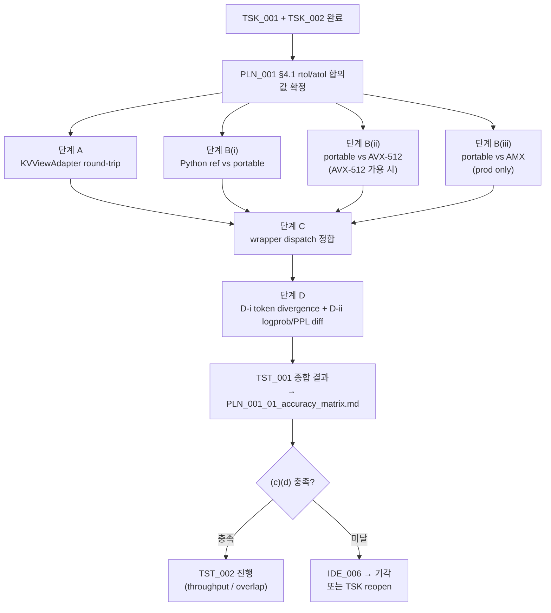

**↑ 부모**: [`PLN_001`](PLN_001.md) · **→ 다음 형제**: [`TST_002`](TST_002.md) · **↟ 조부**: [`IDE_006`](README.md) · **검증 대상**: [`TSK_001`](TSK_001.md) · [`TSK_002`](TSK_002.md)

---

# TST_001 — Cold-KV CPU Partial Attention 정확도 검증

| 항목 | 값 |
|---|---|
| ID | `TST_001` |
| 상태 | `대기` (`TSK_001` + `TSK_002` 완료 후 `활성`) |
| 부모 PLN | [`PLN_001`](PLN_001.md) |
| 조부 IDE | [`IDE_006`](README.md) |
| 자매 TST | [`TST_002`](TST_002.md) (throughput / overlap) |
| 검증 대상 | [`TSK_001`](TSK_001.md) (kernel) + [`TSK_002`](TSK_002.md) (scheduler / metadata) |
| 매핑 IDE_006 진입 조건 | **(c)** tolerance(rtol/atol) 내 GPU-only 결과 일치, **(d)** GQA (Q=32 / KV=4) head broadcast 정상 동작 |
| 후속 | [`TST_002`](TST_002.md) (병렬 진행 권장) · `FEA_###` (통합 기능) |
| ID 넘버링 출처 | [`shadow_assists/id_registry.md`](../../id_registry.md) |

> **단계 주의**: 본 파일은 PLN 임계 충족 후의 **검증 작업 단위 (pre-FEA)**. 실제 테스트 코드는 `tests/v1/cpu_partial_attention/` 하위에 작성. 결과 산출물 (raw JSON/CSV + 분석 md) 은 `IDE_006/` 디렉토리에 `PLN_001_TST_001_NN_*.md` 형태로 평탄 적재. PLN_001 §7 의 `PLN_001_01_accuracy_matrix.md` (PoC 의사결정 문서) 는 본 TST 의 산출물을 집계해 작성.

---

## 1. 목적과 범위

### 1.1 · 목적

[`TSK_001`](TSK_001.md) (LSE-반환 CPU partial-attention kernel) 와 [`TSK_002`](TSK_002.md) (scheduler / attention metadata 통합) 의 **수치 정확성** 을 다단계로 검증해, IDE_006 §9 진입 조건 **(c)(d)** 의 충족 여부를 결정한다.

- 충족 → IDE_006 진입 허용 (TST_002 throughput 결과와 함께 PLN_001 §8 판정 분기 입력)
- 1+ 미달 → IDE_006 기각 (PLN_001 §8 분기)

### 1.2 · 범위 (검증 매트릭스)

3 단계 검증 (좁은 단위 → 넓은 단위):

| 단계 | 대상 | 비교 | 매핑 TSK |
|---|---|---|---|
| **A. KVViewAdapter round-trip** | TSK_001 §4.0 산출물 | int8 page → typed view → 다시 raw → 무손실 | TSK_001 §4.0 |
| **B. Kernel cross-check (4 경로)** | TSK_001 §4.1·4.2a/b/c 의 Python reference / portable / AVX-512 / AMX | (i) Python ref vs portable, (ii) portable vs AVX-512, (iii) portable vs AMX | TSK_001 §4.5 |
| **C. Wrapper dispatch 정합** | TSK_001 §4.3 wrapper | `pytest.mark.parametrize` 로 ISA path 강제하여 dispatch 4 단계 (AMX → AVX-512 → portable → Python ref) 모두 동일 결과 | TSK_001 §4.3 |
| **D. End-to-end 정합** | TSK_002 통합 후 vLLM forward | `eval/envs/vllm_original.env` (split off) vs `eval/envs/ide006_cold_kv.env` (split on, `enable_hot_cold_split=True`) — 두 metric 분리: **D-i** generated token divergence (token id 만, greedy) + **D-ii** logprob/PPL diff (`SamplingParams(logprobs=N)` 수집 경로) | TSK_002 §4.7 |

### 1.3 · 비범위

- throughput / overlap 측정 — `TST_002` 가 담당
- multi-GPU / TP > 1 — FEA 단계
- prefill chunked attention — TSK_002 §8 Q5 의 deferred 항목 (decode-only first)

---

## 2. 사전 조건

- [`TSK_001`](TSK_001.md) §4.0 ~ §4.5 단계 완료. wrapper dispatch (§4.3) 가 4 경로 모두 호출 가능 상태.
- [`TSK_002`](TSK_002.md) §4.1 ~ §4.7 단계 완료. `enable_hot_cold_split=True` 옵션이 e2e 경로에서 동작.
- [`PLN_001`](PLN_001.md) §4.1 accuracy matrix 의 **rtol/atol 합의값** 결정 완료 — 본 TST 의 pass/fail 임계로 직접 사용.
- [`PLN_001`](PLN_001.md) §3 Scope Lock 유지: BF16/FP16, non-FP8, non-MLA, full attention, 단일 KV group, Qwen2.5-7B-Instruct.
- 하드웨어 두 단계 (CLAUDE.md `# Hardware Targets`):
    - dev (RTX 3090 + 12900KF): A·B(i)·B(ii AVX-512 BIOS-on 시)·C·D 실행. AMX path (B(iii)) 는 skip
    - prod (Xeon SPR+ + H100×8): A·B(i,ii,iii)·C·D 모두 실행

---

## 3. 검증 차원

### 3.1 · Sweep 차원 (단계 A·B·C·D 공통)

| 차원 | 값 |
|---|---|
| dtype | BF16, FP16 |
| context length | 512 (smoke), 2K, 8K (long-context 진입 후 main) |
| cold ratio | 0.0 (degenerate, hot-only — split 비활성 동등성 확인용), 0.25, 0.5, 0.75 |
| batch | 1, 2, 4 |
| variable length | 균등 / `cu_seqlens_q` 비균등 분포 |
| layout | dense (시뮬레이션) / GQA (Qwen2.5-7B Q=32 / KV=4) |
| ISA path (B 단계) | Python reference / portable / AVX-512 / AMX (prod only) |

### 3.2 · 단계 D (e2e) 의 prompt 셋

- 짧은 prompt (smoke): 1~2 sample, eval baseline 과 정합
- 긴 prompt (cold KV 실제 발생): context ≥ 8K, multi-turn 또는 large-prefix prompt
- 비결정성 회피: greedy (`temperature=0`, `top_p=1.0`, `seed` 고정)

---

## 4. 테스트 코드 구조

### 4.1 · 디렉토리 / 파일 배치

```
tests/v1/cpu_partial_attention/
├── conftest.py                          # 공통 fixture
├── test_kv_view_adapter.py              # 단계 A
├── test_kernel_correctness.py           # 단계 B (4 경로 cross-check)
├── test_wrapper_dispatch.py             # 단계 C
├── test_e2e_accuracy.py                 # 단계 D (eval/run.sh equivalent)
├── test_gqa_specific.py                 # GQA 옵션 A/B 특화 케이스
└── data/
    ├── golden_outputs_qwen25_7b.json    # GPU-only baseline 의 token sequence
    └── synthetic_kv_blocks.npz          # 단계 A·B 의 합성 입력
```

### 4.2 · 공통 fixture (`conftest.py`)

```python
@pytest.fixture(scope="session")
def model():
    """Qwen2.5-7B-Instruct 로딩. tests/v1/conftest.py 의 vllm_runner 와 정합."""
    ...

@pytest.fixture(params=["BF16", "FP16"])
def dtype(request): ...

@pytest.fixture(params=[512, 2048, 8192])
def context_length(request): ...

@pytest.fixture(params=[0.0, 0.25, 0.5, 0.75])
def cold_ratio(request): ...

@pytest.fixture
def isa_path_available():
    """cpuid 검출 — 현 머신에서 가용한 ISA path 목록 반환."""
    paths = ["python_ref", "portable"]
    if has_avx512(): paths.append("avx512")
    if has_amx():    paths.append("amx")
    return paths
```

### 4.3 · 단계별 테스트 함수 outline

#### 단계 A — `test_kv_view_adapter.py`

```python
def test_int8_page_to_typed_view_roundtrip(dtype, num_blocks, head_dim, num_kv_heads):
    """KVViewAdapter (TSK_001 §4.0) 의 zero-copy 또는 lazy-rearrange 가
    원본 int8 buffer 의 정보를 무손실로 노출함을 확인."""
    int8_pages = make_random_canonical_kv(num_blocks, head_dim, num_kv_heads, dtype)
    view = KVViewAdapter(int8_pages, head_dim, num_kv_heads, page_size_bytes)
    K, V = view.as_typed(dtype)
    assert K.shape == (num_blocks, num_kv_heads, block_size, head_dim)
    # roundtrip
    int8_pages_back = view.as_canonical()
    torch.testing.assert_close(int8_pages_back, int8_pages, rtol=0, atol=0)
```

#### 단계 B — `test_kernel_correctness.py`

```python
@pytest.mark.parametrize("layout", ["dense", "gqa_qwen25"])
def test_python_reference_vs_portable(dtype, context_length, cold_ratio, batch, layout):
    """B(i): Python reference (4.1) vs portable C++ (4.2c). 모든 머신."""
    Q, K_cold, V_cold, meta = make_inputs(...)
    O_ref, LSE_ref = python_reference_partial_attention(Q, K_cold, V_cold, meta)
    O_por, LSE_por = portable_partial_attention(Q, K_cold, V_cold, meta)
    torch.testing.assert_close(O_por, O_ref, rtol=RTOL, atol=ATOL)
    torch.testing.assert_close(LSE_por, LSE_ref, rtol=RTOL_LSE, atol=ATOL_LSE)

@pytest.mark.skipif(not has_avx512(), reason="AVX-512 unavailable")
def test_portable_vs_avx512(...):
    """B(ii): portable vs AVX-512 (4.2a). AVX-512 가용 머신만."""
    ...

@pytest.mark.skipif(not has_amx(), reason="AMX unavailable (prod only)")
def test_portable_vs_amx(...):
    """B(iii): portable vs AMX (4.2b). prod 머신만."""
    ...
```

#### 단계 C — `test_wrapper_dispatch.py`

```python
@pytest.mark.parametrize("forced_path", ["amx", "avx512", "portable", "python_ref"])
def test_wrapper_dispatch_consistency(forced_path, isa_path_available):
    """wrapper 의 dispatch 가 강제된 path 로 결과를 내고, 모든 path 결과가
    일치하는지 (tolerance 내) 확인."""
    if forced_path not in isa_path_available:
        pytest.skip(f"{forced_path} unavailable on current machine")
    O, LSE = forward_partial_with_lse(..., _force_path=forced_path)
    # 다른 가용 path 들과 cross-check
    for other in isa_path_available:
        if other == forced_path: continue
        O_other, LSE_other = forward_partial_with_lse(..., _force_path=other)
        torch.testing.assert_close(O, O_other, rtol=RTOL, atol=ATOL)
```

#### 단계 D — `test_e2e_accuracy.py`

E2E 정확도는 **두 metric 분리** (token id 만으로는 PPL 계산 불가하므로):

**D-i. Generated token divergence** — token id 비교 (greedy decoding, logprobs 수집 불필요)

```python
@pytest.mark.parametrize("prompt", LONG_CONTEXT_PROMPTS)
def test_e2e_token_divergence(prompt, model_with_hot_cold_split, model_baseline):
    """split on/off 의 generated token sequence 가 사전 합의된
    divergence 임계 이내인지 확인 (greedy, BF16 비결정성 허용)."""
    out_baseline = model_baseline.generate([prompt], greedy_params)  # logprobs 불필요
    out_split    = model_with_hot_cold_split.generate([prompt], greedy_params)
    n_div = count_token_divergence(out_baseline.token_ids, out_split.token_ids)
    assert n_div <= MAX_DIVERGING_TOKENS  # PLN §4.1 결정값
```

**D-ii. Logprob / PPL diff** — logprobs 수집 경로 (vLLM `SamplingParams(logprobs=N)`) 기반

```python
@pytest.mark.parametrize("prompt", LONG_CONTEXT_PROMPTS)
def test_e2e_logprob_diff(prompt, model_with_hot_cold_split, model_baseline):
    """split on/off 의 per-token logprob 분포가 tolerance 내 일치.
    PPL diff 도 logprobs 로부터 계산 가능."""
    sp = SamplingParams(temperature=0.0, max_tokens=N, logprobs=20)
    lp_baseline = model_baseline.generate([prompt], sp)[0].outputs[0].logprobs
    lp_split    = model_with_hot_cold_split.generate([prompt], sp)[0].outputs[0].logprobs
    assert max_logprob_abs_diff(lp_baseline, lp_split) < ATOL_LOGPROB
    assert ppl_rel_diff(lp_baseline, lp_split) < RTOL_PPL  # PLN §4.1 결정값
```

**구분 의도**: D-i 는 user-facing 출력 의 동등성 (greedy 생성 결과 자체), D-ii 는 internal logits 의 정확성 (수치 일치). D-ii 가 더 엄격하지만 logprobs 수집 비용 (sampling 시 상위 K 저장) 을 요구. 둘 다 실행하여 다른 각도로 정확성 검증.

### 4.4 · 테스트 helper (구현 측)

- `make_random_canonical_kv(...)` — `kv_offload/spec.py:51` canonical int8 page 형태로 합성 입력 생성
- `make_inputs(...)` — Q, K_cold, V_cold, attention metadata (cu_seqlens_q, query_positions, seq_lens_total) 일괄 생성
- `python_reference_partial_attention(...)` — TSK_001 §4.1 reference impl 호출
- `forward_partial_with_lse(..., _force_path=...)` — wrapper 의 ISA path 강제 옵션 (디버깅용 hidden flag)
- `count_token_divergence(token_ids_a, token_ids_b)` — **D-i 전용**. greedy decoding 의 token id sequence 두 개를 받아 발산하는 토큰 수 반환. logprobs 불필요
- `logprob_ppl_diff(logprobs_a, logprobs_b)` — **D-ii 전용**. `SamplingParams(logprobs=N)` 으로 수집된 per-token top-K logprobs 두 set 을 받아 `(max_abs_diff, ppl_relative_diff)` tuple 반환

---

## 5. 실행 / CI 통합

### 5.1 · 로컬 실행

```bash
# 전체
.venv/bin/python -m pytest tests/v1/cpu_partial_attention/ -v

# 단계별
.venv/bin/python -m pytest tests/v1/cpu_partial_attention/test_kv_view_adapter.py -v
.venv/bin/python -m pytest tests/v1/cpu_partial_attention/test_kernel_correctness.py -v
.venv/bin/python -m pytest tests/v1/cpu_partial_attention/test_wrapper_dispatch.py -v
.venv/bin/python -m pytest tests/v1/cpu_partial_attention/test_e2e_accuracy.py -v

# 결과 JSON / CSV 출력
.venv/bin/python -m pytest tests/v1/cpu_partial_attention/ \
    --junit-xml=results/TST_001_junit.xml \
    --json-report --json-report-file=results/TST_001.json
```

### 5.2 · CI 환경별 분기

| 환경 | 활성 단계 | skip |
|---|---|---|
| dev (12900KF) AVX-512 fuse-off | A · B(i) · C(portable·python_ref) · D | B(ii) AVX-512, B(iii) AMX, C(amx, avx512) |
| dev (12900KF) AVX-512 BIOS-on | A · B(i, ii) · C(portable·python_ref·avx512) · D | B(iii) AMX, C(amx) |
| prod (Xeon SPR+ + H100×8) | **모두** | 없음 |

`pytest.mark.skipif(not has_amx(), ...)` 등 ISA 가용성 마커로 자동 분기.

### 5.3 · 결과 누적 위치

- raw 결과: `tests/v1/cpu_partial_attention/results/TST_001/<hw_tag>_<timestamp>/`
- 분석 산출물: `shadow_assists/features/IDE_006/PLN_001_TST_001_NN_*.md`
- PLN 의사결정 문서 입력: `PLN_001_01_accuracy_matrix.md` 가 본 TST 의 결과를 집계

---

## 6. Pass / Fail 기준

| 단계 | 기준 | 미달 시 영향 |
|---|---|---|
| A | int8 page ↔ typed view round-trip 무손실 (rtol=0, atol=0) | TSK_001 §4.0 어댑터 결함 → TSK_001 reopen |
| B (i) Python ref vs portable | `max_abs_diff < atol`, `max_rel_diff < rtol` (PLN_001 §4.1 결정값) | portable kernel 결함 → TSK_001 4.2c reopen |
| B (ii) portable vs AVX-512 | 동일 tolerance | AVX-512 kernel 결함 → TSK_001 4.2a reopen |
| B (iii) portable vs AMX | 동일 tolerance (prod 머신) | AMX kernel 결함 → TSK_001 4.2b reopen |
| C wrapper dispatch | 모든 가용 path 결과가 tolerance 내 일치 | wrapper dispatch 결함 → TSK_001 4.3 reopen |
| D-i e2e token divergence | generated token id sequence 의 divergence 수가 `MAX_DIVERGING_TOKENS` 임계 이하 (greedy decoding 기준, BF16 비결정성 허용) | scheduler/metadata 통합 결함 → TSK_002 reopen |
| D-ii e2e logprob/PPL diff | per-token logprob 의 max abs diff < `ATOL_LOGPROB`, PPL relative diff < `RTOL_PPL` (logprobs 수집 경로 — `SamplingParams(logprobs=N)`) | 수치 정확성 결함 → IDE_006 §9 (c) 미충족 → IDE_006 기각 |

**전체 게이트**: A·B·C·D-i·D-ii 모두 통과해야 IDE_006 §9 (c) (정확도) + (d) (GQA) 충족 으로 간주. 1+ 단계 미달 시 PLN_001 §8 분기의 "임계 미달" 경로. D-i 와 D-ii 는 서로 다른 각도 (user-facing 출력 동등성 vs internal logits 수치 일치) 의 검증이므로 둘 다 통과 필수.

---

## 7. 산출물 (Deliverables)

| 파일 | 내용 |
|---|---|
| `PLN_001_TST_001_01_kv_view_adapter_results.md` | 단계 A 결과 |
| `PLN_001_TST_001_02_kernel_cross_check_results.md` | 단계 B (4 경로) 결과 |
| `PLN_001_TST_001_03_wrapper_dispatch_results.md` | 단계 C 결과 |
| `PLN_001_TST_001_04_e2e_accuracy_results.md` | 단계 D 결과 |
| raw JSON / CSV | `tests/v1/cpu_partial_attention/results/TST_001/<hw_tag>_<timestamp>/` |

각 분석 md 는 측정 환경 (dev / prod, ISA), pass/fail 매트릭스, 미달 cell 의 분석을 포함.

---

## 8. 의존성·일정



A·B·C 는 dev 머신에서 시작 가능 (B(iii) AMX 만 prod 대기). D 는 dev/prod 양쪽에서 실행 가능 (long-context prompt 가용 시).

---

## 9. Open Questions

1. **e2e tolerance 임계값 결정**: D-i 의 `MAX_DIVERGING_TOKENS` 와 D-ii 의 `ATOL_LOGPROB` / `RTOL_PPL` 운영 후보값 — `PLN_001_TST_001_04_e2e_accuracy_results.md` 의 첫 sweep 결과를 보고 PLN §4.1 산출과 합의.
2. **`_force_path=` 디버깅 옵션**: wrapper 에 hidden test flag 를 두는 것이 production code 를 오염시킬지, 아니면 environment variable (`VLLM_CPU_PARTIAL_FORCE_PATH=...`) 로 분리할지 — 구현 시점 결정.
3. **합성 입력 vs 실제 모델 KV**: 단계 A·B 는 합성 KV 로 빠르게 sweep 가능하지만, 실제 Qwen2.5-7B 의 KV 분포가 정확도 corner case 를 다르게 만들 수 있음 — 단계 D 결과로 보정 필요한지 평가.
4. **dev↔prod 결과 보간** ([PLN_001 §9 Q8](PLN_001.md) 와 정합): dev 의 portable / AVX-512 결과가 prod 의 동일 path 결과와 추세상 일관해야 함. 비일관 시 어느 환경의 결과를 final 로 채택할지.

---

## 10. References

### 부모·연계 문서

- 부모 PLN: [`PLN_001`](PLN_001.md)
- 조부 IDE 상세: [`IDE_006`](README.md)
- 검증 대상: [`TSK_001`](TSK_001.md), [`TSK_002`](TSK_002.md)
- 자매 TST: [`TST_002`](TST_002.md)
- ID 넘버링 출처: [`shadow_assists/id_registry.md`](../../id_registry.md)

### 코드 인용

- `vllm/v1/attention/backends/cpu_attn.py:261` (forward 시그니처, LSE 미반환)
- `vllm/v1/attention/ops/merge_attn_states.py:9-47` (LSE merge 시그니처)
- `vllm/v1/attention/backends/flash_attn.py:967`, `:1214` (기존 LSE merge 호출)
- `vllm/v1/kv_offload/spec.py:51` (canonical int8 page tensor)
- `vllm/v1/kv_offload/abstract.py:94` (`def lookup` — partition extraction 가능 형태)
- `eval/envs/vllm_original.env`, `eval/envs/ide006_cold_kv.env` (단계 D baseline)

### 외부 / 표준

- LSE-rescaling 표준 출처: [arXiv 2501.01005 §2.2](https://arxiv.org/abs/2501.01005)

---

## 11. Change Log

| 날짜 | 변경 | 사유 |
|---|---|---|
| 2026-04-25 | TST_001 초안 작성 | IDE_006 §11 step 4 의 정확도 검증 TST 로 적재. TSK_001 (kernel) + TSK_002 (scheduler/metadata) 의 4 단계 검증 (A KVViewAdapter / B 4-경로 kernel cross-check / C wrapper dispatch / D e2e) 매트릭스, 테스트 코드 구조 (`tests/v1/cpu_partial_attention/`), CI 환경별 분기 (dev / prod), pass/fail 기준, 산출물 (`PLN_001_TST_001_NN_*.md`) 명세. IDE_006 §9 (c)(d) 충족 게이트 역할. |
| 2026-04-25 | 정밀화 (e2e metric 분리) | §4.3 단계 D 와 §6 pass/fail 의 e2e 검증을 두 metric 으로 분리: **D-i** generated token divergence (token id 만 사용, greedy decoding 기준) 와 **D-ii** logprob/PPL diff (logprobs 수집 경로 — `SamplingParams(logprobs=N)`) — PPL 은 token id 만으로 계산 불가하므로 logits 수집이 필수. §9 Q1 의 tolerance 임계도 두 metric 별 분리 후보값으로 재정의. |
| 2026-04-25 | 정밀화 후속 (D-i/D-ii 정합 잔재 정리) | (1) §1.2 검증 매트릭스 표의 단계 D 행이 "출력 token sequence 가 tolerance 내 일치" 단일 metric 표기 → "D-i token divergence + D-ii logprob/PPL diff" 두 metric 으로 정합. (2) §8 Mermaid 의존성 그래프의 단계 D 노드 라벨도 "e2e token sequence" → "D-i token divergence + D-ii logprob/PPL diff" 로 정합. (3) §4.4 helper 의 단일 `sequences_match_within_tolerance(...)` (PPL diff 포함) 를 `count_token_divergence(...)` (D-i 전용, token id 만) 와 `logprob_ppl_diff(...)` (D-ii 전용, logprobs 기반 max abs / PPL relative) 두 helper 로 분리. PPL 이 logprobs 의존이므로 token-only helper 와 분리. |

---

**↑ 부모**: [`PLN_001`](PLN_001.md) · **→ 다음 형제**: [`TST_002`](TST_002.md) · **↟ 조부**: [`IDE_006`](README.md) · **검증 대상**: [`TSK_001`](TSK_001.md) · [`TSK_002`](TSK_002.md)
