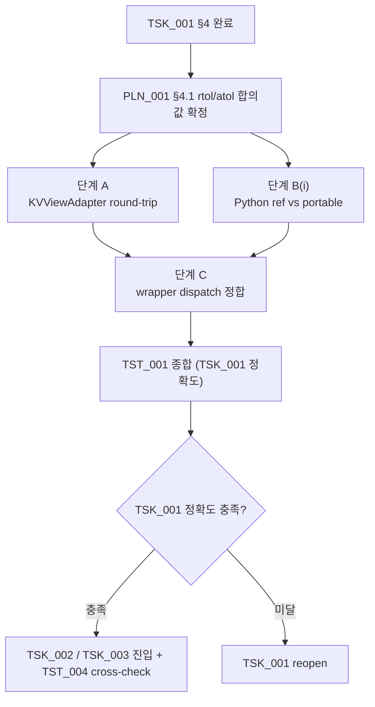

**↑ 부모**: [`PLN_001`](PLN_001.md) · **→ 다음 형제**: [`TST_002`](TST_002.md) · [`TST_003`](TST_003.md) · [`TST_004`](TST_004.md) · **↟ 조부**: [`IDE_006`](README.md) · **검증 대상**: [`TSK_001`](TSK_001.md)

---

# TST_001 — TSK_001 dev kernel 정확도 검증

| 항목 | 값 |
|---|---|
| ID | `TST_001` |
| 상태 | `활성 (Phase 1 dev — 통과)` |
| 부모 PLN | [`PLN_001`](PLN_001.md) |
| 조부 IDE | [`IDE_006`](README.md) |
| 자매 TST | [`TST_002`](TST_002.md) (throughput / overlap) · [`TST_003`](TST_003.md) (e2e 통합 정확도) · [`TST_004`](TST_004.md) (prod SIMD cross-check) |
| 검증 대상 | **[`TSK_001`](TSK_001.md) 단독** (KVViewAdapter + Python ref + portable C++ + wrapper) |
| 단계 | A KVViewAdapter round-trip · B(i) Python ref vs portable · C wrapper dispatch |
| **prod SIMD cross-check** | **본 TST 범위 밖** — [`TST_004`](TST_004.md) 가 담당 (B(ii) portable vs AVX-512 + B(iii) portable vs AMX) |
| **e2e 통합 정확도** | **본 TST 범위 밖** — [`TST_003`](TST_003.md) 가 담당 |
| 매핑 IDE_006 진입 조건 | (c) tolerance 의 dev kernel 측, (d) GQA head broadcast 동작 |
| ID 넘버링 출처 | [`shadow_assists/id_registry.md`](../../id_registry.md) |

> **단계 주의**: 본 파일은 PLN 임계 충족 후의 **검증 작업 단위 (pre-FEA)**. 실제 테스트 코드는 `tests/v1/cpu_partial_attention/` 하위에 작성. 결과 산출물 (raw JSON/CSV + 분석 md) 은 `IDE_006/` 디렉토리에 `PLN_001_TST_001_NN_*.md` 형태로 평탄 적재. PLN_001 §7 의 `PLN_001_01_accuracy_matrix.md` (PoC 의사결정 문서) 는 본 TST 의 산출물을 집계해 작성.

---

## 1. 목적과 범위

### 1.1 · 목적

[`TSK_001`](TSK_001.md) (LSE-반환 CPU partial-attention kernel + KVViewAdapter + wrapper) 의 **수치 정확성** 을 kernel 단위로 검증해, IDE_006 §9 진입 조건 **(c)(d) 의 kernel 측** 충족 여부를 결정한다.

- 충족 → TSK_001 단독 검증 통과 → TSK_002 통합 진입 허용
- 1+ 미달 → TSK_001 reopen 또는 IDE_006 기각

**e2e 통합 정확도** 는 [`TST_003`](TST_003.md) 이 담당 (TSK_002 의 vLLM forward 통합 후).

### 1.2 · 범위 (검증 매트릭스)

3 단계 검증 (모두 **TSK_001 단독** — dev kernel):

| 단계 | 대상 | 비교 | 매핑 TSK |
|---|---|---|---|
| **A. KVViewAdapter round-trip** | TSK_001 §4.0 산출물 | int8 page → typed view → 다시 raw → 무손실 | TSK_001 §4.0 |
| **B(i). Python ref vs portable** | TSK_001 §4.1 + §4.2c | Python reference 와 portable C++ kernel 의 numerical agreement (BF16 tolerance) | TSK_001 §4.5 |
| **C. Wrapper dispatch 정합** | TSK_001 §4.3 wrapper | `pytest.mark.parametrize` 로 ISA path 강제. Phase 1: AMX/AVX-512/portable 모두 cascade-to-portable 로 동일 결과. Phase 2: TSK_003 활성 후 non-cascade 검증 | TSK_001 §4.3 |

> **B(ii) portable vs AVX-512** 와 **B(iii) portable vs AMX** 는 [`TST_004`](TST_004.md) 가 담당 (TSK_003 검증).

### 1.3 · 비범위

- **prod SIMD cross-check (B(ii) AVX-512, B(iii) AMX)** — [`TST_004`](TST_004.md) 가 담당
- throughput / overlap 측정 — [`TST_002`](TST_002.md) 가 담당
- **e2e 통합 정확도 (TSK_002 후)** — [`TST_003`](TST_003.md) 가 담당 (D-i token divergence + D-ii logprob/PPL diff)
- multi-GPU / TP > 1 — FEA 단계
- prefill chunked attention — TSK_002 §8 Q5 의 deferred 항목 (decode-only first)

---

## 2. 사전 조건

- [`TSK_001`](TSK_001.md) §4.0 ~ §4.5 단계 완료. wrapper dispatch (§4.3) 가 4 경로 모두 호출 가능 상태 (또는 Phase 1 에서는 portable + Python ref 만 호출 가능, AMX/AVX-512 는 cascade-fallback).
- [`PLN_001`](PLN_001.md) §4.1 accuracy matrix 의 **rtol/atol 합의값** 결정 완료 — 본 TST 의 pass/fail 임계로 직접 사용.
- [`PLN_001`](PLN_001.md) §3 Scope Lock 유지: BF16/FP16, non-FP8, non-MLA, full attention, 단일 KV group, Qwen2.5-7B-Instruct.
- 하드웨어 두 단계 (CLAUDE.md `# Hardware Targets`):
    - dev (RTX 3090 + 12900KF): A·B(i)·C 실행. B(ii) 는 AVX-512 BIOS-on 시. B(iii) AMX 는 skip
    - prod (Xeon SPR+ + H100×8): A·B(i,ii,iii)·C 모두 실행

> [`TSK_002`](TSK_002.md) 완료는 본 TST 의 사전 조건이 **아니다** — kernel 단독 검증이라 TSK_001 만 의존. e2e 통합 정확도 ([`TST_003`](TST_003.md)) 가 TSK_002 의존을 흡수.

---

## 3. 검증 차원

### 3.1 · Sweep 차원 (단계 A·B·C 공통)

| 차원 | 값 |
|---|---|
| dtype | BF16, FP16 |
| context length | 512 (smoke), 2K, 8K (long-context 진입 후 main) |
| cold ratio | 0.0 (degenerate, hot-only — split 비활성 동등성 확인용), 0.25, 0.5, 0.75 |
| batch | 1, 2, 4 |
| variable length | 균등 / `cu_seqlens_q` 비균등 분포 |
| layout | dense (시뮬레이션) / GQA (Qwen2.5-7B Q=32 / KV=4) |
| ISA path (B(i) 단계) | Python reference / portable C++ (TSK_001 §4.1 + §4.2c) |

---

## 4. 테스트 코드 구조

### 4.1 · 디렉토리 / 파일 배치

```
tests/v1/cpu_partial_attention/
├── conftest.py                          # 공통 fixture
├── test_kv_view_adapter.py              # 단계 A
├── test_python_reference.py             # 단계 B(i) baseline (Python ref vs naive)
├── test_portable_cross_check.py         # 단계 B(i) portable C++ vs Python ref
├── test_wrapper_dispatch.py             # 단계 C
└── test_gqa_specific.py                 # GQA 옵션 A vs B 특화 (선택)
```

### 4.2 · 공통 fixture (`conftest.py`)

```python
@pytest.fixture(scope="session")
def model():
    """Qwen2.5-7B-Instruct 로딩. tests/v1/conftest.py 의 vllm_runner 와 정합."""
    ...

@pytest.fixture(params=["BF16", "FP16"])
def dtype(request): ...

@pytest.fixture(params=[512, 2048, 8192])
def context_length(request): ...

@pytest.fixture(params=[0.0, 0.25, 0.5, 0.75])
def cold_ratio(request): ...

@pytest.fixture
def isa_path_available():
    """cpuid 검출 — 현 머신에서 가용한 ISA path 목록 반환."""
    paths = ["python_ref", "portable"]
    if has_avx512(): paths.append("avx512")
    if has_amx():    paths.append("amx")
    return paths
```

### 4.3 · 단계별 테스트 함수 outline

#### 단계 A — `test_kv_view_adapter.py`

```python
def test_int8_page_to_typed_view_roundtrip(dtype, num_blocks, head_dim, num_kv_heads):
    """KVViewAdapter (TSK_001 §4.0) 의 zero-copy 또는 lazy-rearrange 가
    원본 int8 buffer 의 정보를 무손실로 노출함을 확인."""
    int8_pages = make_random_canonical_kv(num_blocks, head_dim, num_kv_heads, dtype)
    view = KVViewAdapter(int8_pages, head_dim, num_kv_heads, page_size_bytes)
    K, V = view.as_typed(dtype)
    assert K.shape == (num_blocks, num_kv_heads, block_size, head_dim)
    # roundtrip
    int8_pages_back = view.as_canonical()
    torch.testing.assert_close(int8_pages_back, int8_pages, rtol=0, atol=0)
```

#### 단계 B — `test_kernel_correctness.py`

```python
@pytest.mark.parametrize("layout", ["dense", "gqa_qwen25"])
def test_python_reference_vs_portable(dtype, context_length, cold_ratio, batch, layout):
    """B(i): Python reference (4.1) vs portable C++ (4.2c). 모든 머신."""
    Q, K_cold, V_cold, meta = make_inputs(...)
    O_ref, LSE_ref = python_reference_partial_attention(Q, K_cold, V_cold, meta)
    O_por, LSE_por = portable_partial_attention(Q, K_cold, V_cold, meta)
    torch.testing.assert_close(O_por, O_ref, rtol=RTOL, atol=ATOL)
    torch.testing.assert_close(LSE_por, LSE_ref, rtol=RTOL_LSE, atol=ATOL_LSE)

@pytest.mark.skipif(not has_avx512(), reason="AVX-512 unavailable")
def test_portable_vs_avx512(...):
    """B(ii): portable vs AVX-512 (4.2a). AVX-512 가용 머신만."""
    ...

@pytest.mark.skipif(not has_amx(), reason="AMX unavailable (prod only)")
def test_portable_vs_amx(...):
    """B(iii): portable vs AMX (4.2b). prod 머신만."""
    ...
```

#### 단계 C — `test_wrapper_dispatch.py`

```python
@pytest.mark.parametrize("forced_path", ["amx", "avx512", "portable", "python_ref"])
def test_wrapper_dispatch_consistency(forced_path, isa_path_available):
    """wrapper 의 dispatch 가 강제된 path 로 결과를 내고, 모든 path 결과가
    일치하는지 (tolerance 내) 확인."""
    if forced_path not in isa_path_available:
        pytest.skip(f"{forced_path} unavailable on current machine")
    O, LSE = forward_partial_with_lse(..., _force_path=forced_path)
    # 다른 가용 path 들과 cross-check
    for other in isa_path_available:
        if other == forced_path: continue
        O_other, LSE_other = forward_partial_with_lse(..., _force_path=other)
        torch.testing.assert_close(O, O_other, rtol=RTOL, atol=ATOL)
```

> **단계 D (e2e) 는 본 TST 범위 밖** — [`TST_003`](TST_003.md) 가 담당. test_e2e_accuracy.py 코드, helper (`count_token_divergence`, `logprob_ppl_diff`), prompt 셋, pass/fail 기준은 TST_003 본문 참조.

### 4.4 · 테스트 helper (구현 측)

- `make_random_canonical_kv(...)` — `kv_offload/spec.py:51` canonical int8 page 형태로 합성 입력 생성
- `make_inputs(...)` — Q, K_cold, V_cold, attention metadata (cu_seqlens_q, query_positions, seq_lens_total) 일괄 생성
- `python_reference_partial_attention(...)` — TSK_001 §4.1 reference impl 호출
- `forward_partial_with_lse(..., _force_path=...)` — wrapper 의 ISA path 강제 옵션 (디버깅용 hidden flag)

---

## 5. 실행 / CI 통합

### 5.1 · 로컬 실행

```bash
# 전체
/workspace/vllm_dev_prj/bin/python -m pytest tests/v1/cpu_partial_attention/ -v

# 단계별
/workspace/vllm_dev_prj/bin/python -m pytest tests/v1/cpu_partial_attention/test_kv_view_adapter.py -v
/workspace/vllm_dev_prj/bin/python -m pytest tests/v1/cpu_partial_attention/test_python_reference.py -v
/workspace/vllm_dev_prj/bin/python -m pytest tests/v1/cpu_partial_attention/test_portable_cross_check.py -v
/workspace/vllm_dev_prj/bin/python -m pytest tests/v1/cpu_partial_attention/test_wrapper_dispatch.py -v
```

### 5.2 · CI 환경별 분기

| 환경 | 활성 단계 | skip |
|---|---|---|
| dev (12900KF) | A · B(i) · C(cascade) — **TSK_001 단독** | B(ii)/B(iii) 는 TST_004 |
| prod (Xeon SPR+ + H100×8) | A · B(i) · C (TSK_003 활성 시 non-cascade) — TSK_001 측만 | B(ii)/B(iii) 는 TST_004 |

`pytest.mark.skipif(...)` 마커로 자동 분기. prod SIMD cross-check (B(ii)/B(iii)) 는 [`TST_004`](TST_004.md), e2e 는 [`TST_003`](TST_003.md) — 모두 별개 file.

### 5.3 · 결과 누적 위치

- raw 결과: `tests/v1/cpu_partial_attention/results/TST_001/<hw_tag>_<timestamp>/`
- 분석 산출물: `shadow_assists/features/IDE_006/PLN_001_TST_001_NN_*.md`
- PLN 의사결정 문서 입력: `PLN_001_01_accuracy_matrix.md` 가 본 TST + TST_003 의 결과를 집계

---

## 6. Pass / Fail 기준

| 단계 | 기준 | 미달 시 영향 |
|---|---|---|
| A | int8 page ↔ typed view round-trip 무손실 (rtol=0, atol=0) | TSK_001 §4.0 reopen |
| B(i) Python ref vs portable | `max_abs_diff < atol`, `max_rel_diff < rtol` (PLN_001 §4.1 결정값) | TSK_001 §4.2c reopen |
| C wrapper dispatch | 모든 가용 path 결과가 tolerance 내 일치 (Phase 1: cascade 정합 / Phase 2: TSK_003 활성 후 non-cascade 검증) | TSK_001 §4.3 reopen |

**전체 게이트** (TSK_001 단독): A·B(i)·C 모두 통과해야 IDE_006 §9 (c)(d) 의 dev kernel 측 충족. **prod SIMD cross-check** ([`TST_004`](TST_004.md)) 와 **e2e 통합 정확도** ([`TST_003`](TST_003.md)) 는 별도 TST 가 책임.

---

## 7. 산출물 (Deliverables)

| 파일 | 내용 |
|---|---|
| `PLN_001_TST_001_01_kv_view_adapter_results.md` | 단계 A 결과 |
| `PLN_001_TST_001_02_kernel_cross_check_results.md` | 단계 B (4 경로) 결과 |
| `PLN_001_TST_001_03_wrapper_dispatch_results.md` | 단계 C 결과 |
| raw JSON / CSV | `tests/v1/cpu_partial_attention/results/TST_001/<hw_tag>_<timestamp>/` |

> e2e 결과 (`PLN_001_TST_003_NN_*.md`) 는 [`TST_003`](TST_003.md) 가 담당.

각 분석 md 는 측정 환경 (dev / prod, ISA), pass/fail 매트릭스, 미달 cell 의 분석을 포함.

---

## 8. 의존성·일정



A·B(i)·C 모두 dev 머신에서 진행 (Phase 1). prod SIMD cross-check 는 [`TST_004`](TST_004.md), e2e 는 [`TST_003`](TST_003.md).

---

## 9. Open Questions

1. **`_force_path=` 디버깅 옵션**: wrapper 에 hidden test flag 를 두는 것이 production code 를 오염시킬지, 아니면 environment variable (`VLLM_CPU_PARTIAL_FORCE_PATH=...`) 로 분리할지 — 구현 시점 결정.
2. **합성 입력 vs 실제 모델 KV**: 단계 A·B 는 합성 KV 로 빠르게 sweep 가능하지만, 실제 Qwen2.5-7B 의 KV 분포가 정확도 corner case 를 다르게 만들 수 있음 — [`TST_003`](TST_003.md) 의 e2e 결과로 보정 필요한지 평가.
3. **dev↔prod 결과 보간** ([PLN_001 §9 Q8](PLN_001.md) 와 정합): dev 의 portable / AVX-512 결과가 prod 의 동일 path 결과와 추세상 일관해야 함. 비일관 시 어느 환경의 결과를 final 로 채택할지.

---

## 10. References

### 부모·연계 문서

- 부모 PLN: [`PLN_001`](PLN_001.md)
- 조부 IDE 상세: [`IDE_006`](README.md)
- 검증 대상: [`TSK_001`](TSK_001.md), [`TSK_002`](TSK_002.md)
- 자매 TST: [`TST_002`](TST_002.md)
- ID 넘버링 출처: [`shadow_assists/id_registry.md`](../../id_registry.md)

### 코드 인용

- `vllm/v1/attention/backends/cpu_attn.py:261` (forward 시그니처, LSE 미반환)
- `vllm/v1/attention/ops/merge_attn_states.py:9-47` (LSE merge 시그니처)
- `vllm/v1/attention/backends/flash_attn.py:967`, `:1214` (기존 LSE merge 호출)
- `vllm/v1/kv_offload/spec.py:51` (canonical int8 page tensor)
- `vllm/v1/kv_offload/abstract.py:94` (`def lookup` — partition extraction 가능 형태)
- `eval/envs/vllm_original.env`, `eval/envs/ide006_cold_kv.env` (단계 D baseline)

### 외부 / 표준

- LSE-rescaling 표준 출처: [arXiv 2501.01005 §2.2](https://arxiv.org/abs/2501.01005)

---

## 11. Change Log

| 날짜 | 변경 | 사유 |
|---|---|---|
| 2026-04-25 | TST_001 초안 작성 | IDE_006 §11 step 4 의 정확도 검증 TST 로 적재. TSK_001 (kernel) + TSK_002 (scheduler/metadata) 의 4 단계 검증 (A KVViewAdapter / B 4-경로 kernel cross-check / C wrapper dispatch / D e2e) 매트릭스, 테스트 코드 구조 (`tests/v1/cpu_partial_attention/`), CI 환경별 분기 (dev / prod), pass/fail 기준, 산출물 (`PLN_001_TST_001_NN_*.md`) 명세. IDE_006 §9 (c)(d) 충족 게이트 역할. |
| 2026-04-25 | 정밀화 (e2e metric 분리) | §4.3 단계 D 와 §6 pass/fail 의 e2e 검증을 두 metric 으로 분리: **D-i** generated token divergence (token id 만 사용, greedy decoding 기준) 와 **D-ii** logprob/PPL diff (logprobs 수집 경로 — `SamplingParams(logprobs=N)`) — PPL 은 token id 만으로 계산 불가하므로 logits 수집이 필수. §9 Q1 의 tolerance 임계도 두 metric 별 분리 후보값으로 재정의. |
| 2026-04-25 | 정밀화 후속 (D-i/D-ii 정합 잔재 정리) | (1) §1.2 검증 매트릭스 표의 단계 D 행이 "출력 token sequence 가 tolerance 내 일치" 단일 metric 표기 → "D-i token divergence + D-ii logprob/PPL diff" 두 metric 으로 정합. (2) §8 Mermaid 의존성 그래프의 단계 D 노드 라벨도 "e2e token sequence" → "D-i token divergence + D-ii logprob/PPL diff" 로 정합. (3) §4.4 helper 의 단일 `sequences_match_within_tolerance(...)` (PPL diff 포함) 를 `count_token_divergence(...)` (D-i 전용, token id 만) 와 `logprob_ppl_diff(...)` (D-ii 전용, logprobs 기반 max abs / PPL relative) 두 helper 로 분리. PPL 이 logprobs 의존이므로 token-only helper 와 분리. |
| 2026-04-25 | 책임 재구조화 (D 단계 → TST_003 분리) | TSK_001 단독 검증 (A·B·C) 과 TSK_002 통합 e2e 검증 (D-i / D-ii) 가 한 TST 에 묶여 있던 것을 분리. **본 TST_001 은 TSK_001 단독 책임** 으로 재정의. D 섹션 일괄 제거 (§1.1 목적 / §1.2 표 / §3.2 prompt 셋 / §4.3 코드 outline / §4.4 helper / §5.2 CI 분기 / §6 pass/fail / §7 deliverable / §8 Mermaid / §9 Open Q1). 신규 [`TST_003`](TST_003.md) 가 D 부분을 담당 + TSK_001 + TSK_002 통합 검증으로 책임 분리. 상태 `대기` → `활성 (Phase 1 dev — A · B(i) · C 통과)` 로 갱신 (실제 코드 + JIT 컴파일 + pytest 87 통과). |
| 2026-04-25 | Phase 1 dev 통과 milestone | Python KVViewAdapter (`vllm/v1/attention/ops/kv_view_adapter.py`) + Python reference (`vllm/v1/attention/ops/cpu_partial_attention.py`) + portable C++ JIT (`csrc/cpu/partial_attention_portable.cpp`) + wrapper dispatch 구현 완료. 87 pytest 통과 (단계 A 14 + B(i) baseline 13 + B(i) portable 26 + C 12 + cross-check 32). branch `feat/ide006-cold-kv-cpu-partial-attention` 위. |
| 2026-04-25 | TSK_003 분리에 따른 책임 축소 (B(ii)/B(iii) → TST_004 이관) | TSK 1:1 매핑 정비 — TSK_003 (prod SIMD) 신규 발급에 맞춰 본 TST_001 의 B(ii)/B(iii) 단계를 [`TST_004`](TST_004.md) 로 이관. 본 TST_001 = **TSK_001 단독 (A·B(i)·C)** 으로 축소. §1 헤더 표 (자매 TST 에 TST_004 추가, 검증 대상 TSK_001 단독 명시), §1.2 매트릭스 (B(i) 만), §1.3 비범위 (B(ii)/B(iii) 추가), §3.1 ISA path 단순화, §5.2 CI 환경별 분기 단순화, §6 pass/fail (B(i) + C 만), §8 Mermaid (B2/B3 노드 제거) 일괄 정리. |

---

**↑ 부모**: [`PLN_001`](PLN_001.md) · **→ 다음 형제**: [`TST_002`](TST_002.md) · [`TST_003`](TST_003.md) · [`TST_004`](TST_004.md) · **↟ 조부**: [`IDE_006`](README.md) · **검증 대상**: [`TSK_001`](TSK_001.md)
