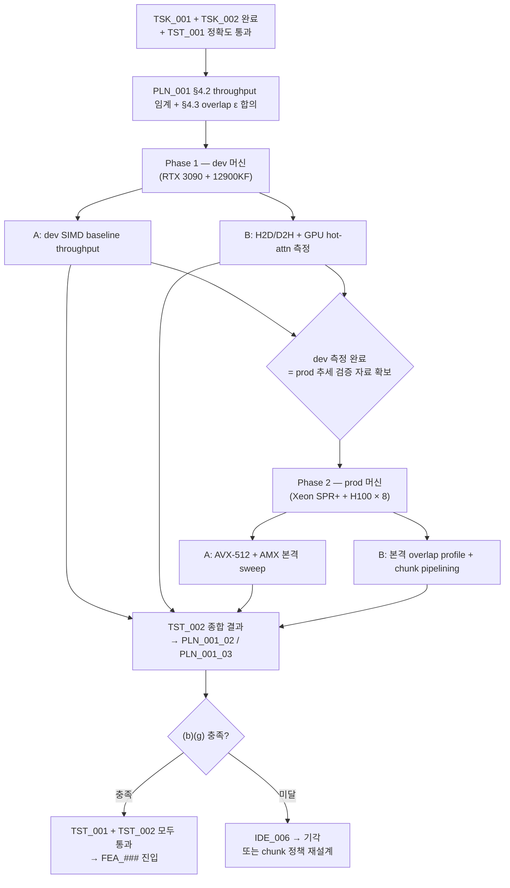

**↑ 부모**: [`PLN_001`](PLN_001.md) · **← 이전 형제**: [`TST_001`](TST_001.md) · **→ 다음 형제**: [`TST_003`](TST_003.md) · [`TST_004`](TST_004.md) · [`TST_005`](TST_005.md) · [`TST_006`](TST_006.md) · [`TST_007`](TST_007.md) · [`TST_008`](TST_008.md) · [`TST_009`](TST_009.md) · [`TST_010`](TST_010.md) · [`TST_011`](TST_011.md) · **↟ 조부**: [`IDE_006`](README.md) · **검증 대상**: [`TSK_001`](TSK_001.md) · [`TSK_002`](TSK_002.md)

---

# TST_002 — Cold-KV CPU Partial Attention throughput / overlap profile

| 항목 | 값 |
|---|---|
| ID | `TST_002` |
| 상태 | `대기` (`TSK_001` + `TSK_002` 완료 + [`TST_001`](TST_001.md) 정확도 통과 후 `활성` 권장) |
| 부모 PLN | [`PLN_001`](PLN_001.md) |
| 조부 IDE | [`IDE_006`](README.md) |
| 자매 TST | [`TST_001`](TST_001.md) (TSK_001 정확도) · [`TST_003`](TST_003.md) (e2e 정확도) · [`TST_004`](TST_004.md) (TSK_003 prod SIMD cross-check) |
| 검증 대상 | [`TSK_001`](TSK_001.md) (kernel) + [`TSK_002`](TSK_002.md) (scheduler / metadata) |
| 매핑 IDE_006 진입 조건 | **(b)** CPU partial-attention worker throughput 임계, **(g)** `Q transfer + CPU partial + (O,LSE) transfer` 가 GPU hot-attn 과 overlap 가능 |
| 후속 | `FEA_###` (통합 기능) — 정확도 + throughput + overlap 모두 통과 시 진입 |
| ID 넘버링 출처 | [`shadow_assists/id_registry.md`](../../id_registry.md) |

> **단계 주의**: 본 파일은 PLN 임계 충족 후의 **검증 작업 단위 (pre-FEA)**. 정확도 (TST_001) 가 깨진 상태에서 throughput 측정은 의미가 없으므로 TST_001 통과 후 진행 권장. 실제 측정 코드는 `tests/v1/cpu_partial_attention/perf/` 하위. 결과 산출물은 `IDE_006/` 디렉토리에 `PLN_001_TST_002_NN_*.md` 형태로 평탄 적재. PLN_001 §7 의 `PLN_001_02_throughput_sweep.md` / `PLN_001_03_overlap_profile.md` (PoC 의사결정 문서) 는 본 TST 의 산출물을 집계해 작성.

---

## 1. 목적과 범위

### 1.1 · 목적

[`TSK_001`](TSK_001.md) kernel + [`TSK_002`](TSK_002.md) 통합 경로의 **성능** 을 다단계로 측정해, IDE_006 §9 진입 조건 **(b)(g)** 의 충족 여부와 **net-win 영역** 을 결정한다.

- 모두 충족 → IDE_006 진입 허용 (TST_001 정확도와 함께 PLN_001 §8 분기 입력)
- 1+ 미달 → IDE_006 기각 (PLN_001 §8 분기)

### 1.2 · 범위 (검증 매트릭스)

2 종 측정:

| 단계 | 대상 | 산출 metric | 매핑 |
|---|---|---|---|
| **A. Throughput sweep** | TSK_001 의 partial attention kernel 단독 처리량 | `tokens/s · per-core efficiency · L2/L3 hit ratio` | IDE_006 §9 (b), PLN_001 §4.2, TSK_001 §4.4 |
| **B. Overlap profile** | TSK_002 통합 후 GPU hot-attn 과 CPU partial 의 wall-time overlap | `T_Q_transfer · T_CPU_partial · T_partial_transfer · T_GPU_hot_attn · T_merge` 분해 | IDE_006 §9 (g), PLN_001 §4.3 |

### 1.3 · 비범위

- 정확도 검증 — `TST_001` 가 담당
- multi-GPU / TP > 1 — FEA 단계
- prefill chunked attention — TSK_002 §8 Q5 의 deferred 항목

---

## 2. 사전 조건

- [`TSK_001`](TSK_001.md), [`TSK_002`](TSK_002.md) 모든 단계 완료.
- [`TST_001`](TST_001.md) 통과 — 정확도 깨진 상태에서 throughput 은 무의미.
- [`PLN_001`](PLN_001.md) §3 Scope Lock 유지.
- [`PLN_001`](PLN_001.md) §4.2 의 throughput 임계값 / §4.3 의 overlap 허용 마진 (ε) 사전 합의.
- 하드웨어 두 단계:
    - dev (RTX 3090 + 12900KF): A 의 dev SIMD baseline (AVX-512 BIOS-on / portable fuse-off) + B 의 H2D/D2H 측정 (CUDA stream 분리 검증). prod 결과의 추세 검증용 보조 자료.
    - prod (Xeon SPR+ + H100×8): A 의 AVX-512 + AMX 측 본격 sweep + B 의 본격 overlap 측정. **PLN_001 의 핵심 결과는 prod 머신에서 산출** (PLN_001 §6 Phase 2).

---

## 3. 검증 차원

### 3.1 · 단계 A — Throughput sweep 차원

| 차원 | 값 |
|---|---|
| context length | 2K, 4K, 8K, 16K, 32K |
| cold ratio | 0.25, 0.5, 0.75 |
| batch size | 1, 2, 4 |
| dtype | BF16, FP16 |
| layout | dense / GQA(Q=32, KV=4) |
| ISA path | dev SIMD baseline (AVX-512 BIOS-on / portable fuse-off) / prod AVX-512 / prod AMX |
| CPU 코어 수 | 1, 2, 4, 8 (prod 머신만) |
| OMP threads | 코어 수와 동일 (NUMA bind) |

### 3.2 · 단계 B — Overlap profile 측정 분해

| 구간 | 측정 도구 |
|---|---|
| `T_Q_transfer` (D2H, GPU → CPU Q 텐서) | `cudaEventRecord` 또는 nsys |
| `T_CPU_partial` (CPU kernel 실행) | `perf_counter_ns()` 또는 RDTSC |
| `T_partial_transfer` (H2D, CPU → GPU `(O, LSE)`) | `cudaEventRecord` |
| `T_GPU_hot_attn` (병렬 실행 중 GPU hot subset attention) | `cudaEventRecord` |
| `T_merge` (`merge_attn_states`) | `cudaEventRecord` |

검증할 가설 ([PLN_001 §4.3](PLN_001.md)):
```
T_Q_transfer + T_CPU_partial + T_partial_transfer  ≤  T_GPU_hot_attn + ε
```
ε = layer 당 허용 critical-path 추가시간 (PLN 사전 합의값).

### 3.3 · 추가 변수 — Q chunking / async stream

[PLN_001 §9 Q6](PLN_001.md) 의 Q chunk 파이프라이닝 변수:
- chunk 크기: 1, 2, 4, 8 query rows per chunk
- async stream 활성 / 비활성
- 두 전용 stream 분리 / 단일 stream

각 조합에서 overlap 부등식 충족 여부 측정.

---

## 4. 테스트 코드 구조

### 4.1 · 디렉토리 / 파일 배치

```
tests/v1/cpu_partial_attention/
├── perf/
│   ├── conftest.py                        # 측정 fixture (warmup, repeat, median)
│   ├── test_throughput_sweep.py           # 단계 A
│   ├── test_overlap_profile.py            # 단계 B
│   ├── test_chunk_pipelining.py           # 3.3 추가 변수
│   └── data/
│       ├── benchmark_inputs.py            # sweep 차원 generator
│       └── reporters.py                   # CSV / JSON / Mermaid bar chart 출력
└── results/TST_002/<hw_tag>_<timestamp>/  # raw 결과
```

### 4.2 · 측정 fixture (`perf/conftest.py`)

CPU-only kernel 시간 측정에 CUDA event 를 쓰면 부정확하므로 **timer 종류별로 fixture 분리**.

```python
@pytest.fixture
def cpu_perf_runner():
    """CPU-only 측정 — perf_counter_ns 사용 (단계 A 의 CPU partial kernel 단독)."""
    def _run(fn, *args, warmup=10, repeat=50, **kwargs):
        for _ in range(warmup):
            fn(*args, **kwargs)
        timings_ns = []
        for _ in range(repeat):
            t0 = time.perf_counter_ns()
            result = fn(*args, **kwargs)
            t1 = time.perf_counter_ns()
            timings_ns.append(t1 - t0)
        return statistics.median(timings_ns) / 1e6, result  # ms
    return _run

@pytest.fixture
def gpu_perf_runner():
    """GPU work 측정 — cudaEvent 사용 (단계 B 의 GPU hot-attn / merge / H2D-D2H)."""
    def _run(fn, *args, warmup=10, repeat=50, **kwargs):
        for _ in range(warmup):
            fn(*args, **kwargs)
        torch.cuda.synchronize()
        timings = []
        for _ in range(repeat):
            start = torch.cuda.Event(enable_timing=True)
            end = torch.cuda.Event(enable_timing=True)
            start.record()
            result = fn(*args, **kwargs)
            end.record()
            torch.cuda.synchronize()
            timings.append(start.elapsed_time(end))
        return statistics.median(timings), result  # ms
    return _run
```

단계 B 의 mixed (GPU + CPU 병렬) 측정에서는 두 timer 를 동시 운영 — `T_CPU_partial` 만 `cpu_perf_runner`, 나머지 (`T_Q_transfer` D2H, `T_partial_transfer` H2D, `T_GPU_hot_attn`, `T_merge`) 는 CUDA event.

### 4.3 · 단계별 테스트 함수 outline

#### 단계 A — `test_throughput_sweep.py`

```python
@pytest.mark.parametrize("ctx_len", [2048, 4096, 8192, 16384, 32768])
@pytest.mark.parametrize("cold_ratio", [0.25, 0.5, 0.75])
@pytest.mark.parametrize("batch", [1, 2, 4])
@pytest.mark.parametrize("isa_path", ["portable", "avx512", "amx"])
def test_cpu_partial_throughput(ctx_len, cold_ratio, batch, isa_path,
                                 cpu_perf_runner, isa_path_available):
    """CPU partial attention kernel 단독 throughput. CPU-only 라
    cpu_perf_runner (perf_counter_ns) 사용."""
    if isa_path not in isa_path_available:
        pytest.skip(f"{isa_path} unavailable")
    Q, K_cold, V_cold, meta = make_inputs(ctx_len, cold_ratio, batch)
    median_ms, _ = cpu_perf_runner(
        lambda: forward_partial_with_lse(Q, K_cold, V_cold, meta,
                                          _force_path=isa_path),
    )
    # 세 metric 분리 기록 (numerator 명확화):
    # (a) decoded_tokens/s : decode 의 user-facing 처리량 (= batch / time)
    #                       net-win 판정의 1 차 metric
    # (b) cold_kv_tokens_visited/s : kernel internal work
    #                                (= batch · ctx_len · cold_ratio / time)
    # (c) attention_bytes/s : HW utilization 보조
    #                        (= K/V bytes read + Q bytes read + O bytes written / time)
    metrics = compute_throughput_metrics(
        batch=batch, ctx_len=ctx_len, cold_ratio=cold_ratio,
        head_dim=128, num_kv_heads=4, dtype_bytes=2,
        median_ms=median_ms,
    )
    record_result(isa_path, ctx_len, cold_ratio, batch,
                  decoded_tokens_per_sec=metrics["decoded_per_s"],
                  cold_kv_tokens_per_sec=metrics["cold_kv_per_s"],
                  attention_bytes_per_sec=metrics["bytes_per_s"],
                  median_ms=median_ms)
```

비교 baseline (net-win 판정용):
```python
def test_gpu_full_reload_baseline(ctx_len, cold_ratio, batch, gpu_perf_runner):
    """GPU 가 cold KV 를 재적재 후 full attention. net-win 비교 baseline.
    GPU work 이므로 gpu_perf_runner (cudaEvent) 사용."""
    median_ms, _ = gpu_perf_runner(lambda: gpu_full_attention_with_reload(...))
    metrics = compute_throughput_metrics(...)  # 동일 3 metric
    record_result("gpu_full_reload", ctx_len, cold_ratio, batch,
                  **metrics, median_ms=median_ms)
```

> **net-win 판정의 1 차 metric 은 `decoded_tokens/s`** (user-facing). 다른 두 metric (`cold_kv_tokens_visited/s`, `attention_bytes/s`) 은 분석·디버깅 보조용. PLN_001 §4.2 의 net-win 영역 결정도 `decoded_tokens/s` 기준.

#### 단계 B — `test_overlap_profile.py`

```python
@pytest.mark.parametrize("ctx_len", [2048, 8192, 32768])
@pytest.mark.parametrize("cold_ratio", [0.5])
@pytest.mark.parametrize("async_stream", [True, False])
def test_overlap_breakdown(ctx_len, cold_ratio, async_stream,
                            cpu_perf_runner, gpu_perf_runner):
    """layer 1 회의 critical path 분해 측정 (mixed timer).
    T_CPU_partial 만 cpu_perf_runner 사용, 나머지는 gpu_perf_runner (cudaEvent)."""
    metrics = measure_layer_breakdown(
        ctx_len, cold_ratio, async_stream,
        cpu_runner=cpu_perf_runner,
        gpu_runner=gpu_perf_runner,
        events=["q_transfer", "cpu_partial", "partial_transfer",
                "gpu_hot_attn", "merge"],
    )
    record_overlap(ctx_len, cold_ratio, async_stream, metrics)
    # overlap 부등식 검증
    cpu_path = metrics["q_transfer"] + metrics["cpu_partial"] + metrics["partial_transfer"]
    overlap_ok = cpu_path <= metrics["gpu_hot_attn"] + EPSILON
    record_overlap_verdict(ctx_len, cold_ratio, async_stream, overlap_ok)
```

#### 3.3 단계 — `test_chunk_pipelining.py`

```python
@pytest.mark.parametrize("chunk_size", [1, 2, 4, 8])
def test_q_chunk_pipelining(chunk_size, cpu_perf_runner, gpu_perf_runner):
    """Q chunk 파이프라이닝의 hiding 효과 측정 (mixed timer — overlap_breakdown 과 동일)."""
    ...
```

### 4.4 · helper

- `make_inputs(...)` — TST_001 §4.4 와 공유. Q / cold KV 합성 입력
- `gpu_full_attention_with_reload(...)` — net-win 비교의 GPU-only baseline (cold KV 를 GPU 로 reload 후 standard attention)
- `measure_layer_breakdown(...)` — **mixed timer 기반** 구간 분해. `T_CPU_partial` 만 `cpu_perf_runner` (perf_counter_ns), 나머지 (`T_Q_transfer` D2H, `T_partial_transfer` H2D, `T_GPU_hot_attn`, `T_merge`) 는 `gpu_perf_runner` (cudaEvent). `cpu_runner` / `gpu_runner` 두 인자를 받아 각 event 에 적절한 timer 적용
- `record_result(...)` / `record_overlap(...)` — CSV / JSON 누적 reporter

---

## 5. 실행 / CI 통합

### 5.1 · 로컬 실행

```bash
# 전체
.venv/bin/python -m pytest tests/v1/cpu_partial_attention/perf/ -v

# 단계별
.venv/bin/python -m pytest tests/v1/cpu_partial_attention/perf/test_throughput_sweep.py -v \
    --hw-tag=$(hostname) --output-dir=results/TST_002/$(date +%Y%m%d_%H%M%S)
```

> `--hw-tag` / `--output-dir` 는 본 perf suite 가 자체 정의하는 custom option (`pytest_addoption` hook). pytest-benchmark 등 외부 의존은 사용하지 않는다 (의존 없이 fixture 기반 측정으로 처리).

### 5.2 · CI 환경별 분기

| 환경 | 활성 sweep | skip |
|---|---|---|
| dev (12900KF) | A: dev SIMD baseline 만 (BIOS 상태에 따름) / B: H2D/D2H + RTX 3090 측정 | A: AMX, prod-only sweep cells |
| prod (Xeon SPR+ + H100×8) | A: 모든 ISA path / B: 본격 overlap | 없음 |

### 5.3 · 결과 누적 위치

- raw 결과: `tests/v1/cpu_partial_attention/perf/results/TST_002/<hw_tag>_<timestamp>/`
- 분석 산출물: `shadow_assists/features/IDE_006/PLN_001_TST_002_NN_*.md`
- PLN 의사결정 문서 입력:
    - `PLN_001_02_throughput_sweep.md` ← 본 TST 단계 A
    - `PLN_001_03_overlap_profile.md` ← 본 TST 단계 B

---

## 6. Pass / Fail 기준

| 단계 | 기준 | 미달 시 영향 |
|---|---|---|
| A | 전체 sweep cell 중 net-win cell (즉 `T_GPU_full_reload + T_GPU_full_attn > T_Q_transfer + T_CPU_partial + T_partial_transfer + T_merge`, 1 차 metric `decoded_tokens/s` 기준) 의 **비율 또는 면적** 이 PLN_001 §4.2 사전 합의 임계 이상 | net-win 비율/면적 부족 → IDE_006 §9 (b) 미달 → IDE_006 기각 후보 |
| B | 어떤 chunk 크기 / async stream 설정에서 `T_Q_transfer + T_CPU_partial + T_partial_transfer ≤ T_GPU_hot_attn + ε` (PLN_001 §4.3 부등식) 충족 | overlap 불가 → IDE_006 §9 (g) 미달 → IDE_006 기각 후보 |
| 3.3 추가 | chunk 파이프라이닝이 hiding 효과를 측정 가능한 범위에서 제공 (의사결정 정보) | 결과에 따라 chunk 정책 결정 (FEA 단계) |

**전체 게이트**: A·B 모두 통과해야 IDE_006 §9 (b) (throughput) + (g) (overlap) 충족 으로 간주. 1+ 단계 미달 시 PLN_001 §8 분기의 "임계 미달" 경로.

---

## 7. 산출물 (Deliverables)

| 파일 | 내용 |
|---|---|
| `PLN_001_TST_002_01_throughput_sweep_results.md` | 단계 A — context × cold_ratio × batch × ISA path × 코어수 sweep 결과. dev / prod 두 set 분리 |
| `PLN_001_TST_002_02_overlap_profile_results.md` | 단계 B — `T_*` 분해 + overlap 부등식 충족 영역 |
| `PLN_001_TST_002_03_chunk_pipelining_results.md` | 3.3 — Q chunk 크기별 hiding 효과 |
| raw CSV / JSON | `tests/v1/cpu_partial_attention/perf/results/TST_002/<hw_tag>_<timestamp>/` |

각 분석 md 는 측정 환경, sweep 결과 (표 + Mermaid bar chart), net-win 영역 시각화, pass/fail 판정을 포함.

---

## 8. 의존성·일정



---

## 9. Open Questions

1. **net-win 영역 면적 임계**: PLN_001 §4.2 의 "net-win 영역 면적이 일정 이하이면 IDE_006 기각" 의 구체 임계 — `PLN_001_TST_002_01` 의 첫 sweep 결과를 본 후 결정.
2. **ε (overlap 허용 마진) 의 layer-당 단위**: layer 당 허용 critical-path 추가시간 (예: GPU hot-attn 의 5%) — PLN_001 사전 합의값.
3. **dev 결과의 추세 검증 의미**: dev 머신은 prod 의 진짜 throughput 을 예측 못 하지만, 대략적 추세 (context length 증가 시 net-win 영역 좁아지는 등) 가 prod 와 일관해야 한다는 가정 — 별도 검증 필요할지.
4. **AMX 의 sweep 차원 추가**: AMX `Tdpbf16ps` 의 tile (16×32 BF16) 친화 영역 (head_dim, batch 의 특정 조합) 이 별도 강한 net-win 을 보일지 — `PLN_001_TST_002_01` 에서 별도 cell 로 측정.
5. **CUDA stream 분리 비용**: 두 전용 stream 사용 시 GPU 측의 launch overhead 가 hiding 이득을 잠식할 가능성 — 측정 필요.

---

## 10. References

### 부모·연계 문서

- 부모 PLN: [`PLN_001`](PLN_001.md)
- 조부 IDE 상세: [`IDE_006`](README.md)
- 검증 대상: [`TSK_001`](TSK_001.md), [`TSK_002`](TSK_002.md)
- 자매 TST: [`TST_001`](TST_001.md) (TSK_001 정확도), [`TST_003`](TST_003.md) (e2e 정확도), [`TST_004`](TST_004.md) (TSK_003 prod SIMD)
- ID 넘버링 출처: [`shadow_assists/id_registry.md`](../../id_registry.md)

### 코드 인용

- `vllm/v1/attention/backends/flash_attn.py:967`, `:1214` (LSE merge 호출)
- `vllm/v1/attention/ops/merge_attn_states.py` (Python wrapper)
- `vllm/v1/kv_offload/abstract.py:94` (`def lookup` — partition 추출)
- `eval/envs/ide006_cold_kv.env` (e2e benchmark 환경)
- `eval/run.sh` (e2e benchmark 실행 entry)

### 외부 / 표준

- LSE-rescaling: [arXiv 2501.01005 §2.2](https://arxiv.org/abs/2501.01005)

---

## 11. Change Log

| 날짜 | 변경 | 사유 |
|---|---|---|
| 2026-04-25 | TST_002 초안 작성 | IDE_006 §11 step 5 의 throughput TST 로 적재. TSK_001 + TSK_002 통합 경로의 (A) throughput sweep / (B) overlap profile / (3.3) Q chunk pipelining 측정 매트릭스, 측정 코드 구조 (`tests/v1/cpu_partial_attention/perf/`), Phase 1 dev / Phase 2 prod 두 단계 일정, pass/fail 기준 (net-win 영역 + overlap 부등식), 산출물 (`PLN_001_TST_002_NN_*.md`) 명세. IDE_006 §9 (b)(g) 충족 게이트 역할. |
| 2026-04-25 | 정밀화 4 항목 | (1) §4.2 측정 fixture 를 `cpu_perf_runner` (perf_counter_ns, CPU-only) / `gpu_perf_runner` (cudaEvent, GPU work) 로 분리. CUDA event 가 CPU-only kernel 시간 측정에 부정확한 점 보정. 단계 B 의 mixed 측정에서는 두 timer 동시 운영 — `T_CPU_partial` 만 cpu, 나머지 (`T_Q_transfer` D2H / `T_partial_transfer` H2D / `T_GPU_hot_attn` / `T_merge`) 는 cudaEvent. (2) §4.3 throughput 의 numerator 모호성 제거 — `decoded_tokens/s` (user-facing, net-win 1차 metric) / `cold_kv_tokens_visited/s` (kernel internal) / `attention_bytes/s` (HW utilization) 세 metric 분리 기록. (3) §5.1 실행 명령에서 `--benchmark-only` (pytest-benchmark 의존) 제거 — 의존 추가 없이 fixture 기반 측정으로 처리. `--hw-tag` / `--output-dir` 만 self-defined custom option. (4) §6 pass/fail A 의 "모든 sweep 영역에서 ... 영역이 임계 이상" 자기 참조 표현을 "전체 sweep cell 중 net-win cell 의 비율/면적이 사전 합의 임계 이상" 으로 명확화. |
| 2026-04-25 | 정밀화 후속 (mixed timer 정합 잔재 정리) | (1) §4.3 단계 B `test_overlap_breakdown` 함수 인자 `perf_runner` → `cpu_perf_runner, gpu_perf_runner` 두 fixture 로 갱신. `measure_layer_breakdown` 호출에 `cpu_runner=`/`gpu_runner=` 명시 전달. (2) 3.3 단계 `test_q_chunk_pipelining` 함수 인자도 동일하게 두 fixture 로 갱신. (3) §4.4 helper 의 `measure_layer_breakdown(...)` 설명을 "CUDA event 기반" → "**mixed timer 기반**" 으로 정정 — `T_CPU_partial` 만 cpu_perf_runner, 나머지 cudaEvent. 두 인자 (`cpu_runner`/`gpu_runner`) 를 받는다는 점 명시. |
| 2026-04-25 | 자매 TST 갱신 (TSK_003/TST_004 분리 반영) | TSK↔TST 1:1 재매핑 (TSK_001↔TST_001 / TSK_003↔TST_004 / TSK_002→TST_003) 결과 — meta header / §10 자매 TST 항목에 [`TST_003`](TST_003.md) (e2e 정확도) + [`TST_004`](TST_004.md) (TSK_003 prod SIMD cross-check) 추가. 본 TST_002 의 검증 대상 / sweep / pass 기준은 변경 없음. |

---

**↑ 부모**: [`PLN_001`](PLN_001.md) · **← 이전 형제**: [`TST_001`](TST_001.md) · **→ 다음 형제**: [`TST_003`](TST_003.md) · [`TST_004`](TST_004.md) · [`TST_005`](TST_005.md) · [`TST_006`](TST_006.md) · [`TST_007`](TST_007.md) · [`TST_008`](TST_008.md) · [`TST_009`](TST_009.md) · [`TST_010`](TST_010.md) · [`TST_011`](TST_011.md) · **↟ 조부**: [`IDE_006`](README.md) · **검증 대상**: [`TSK_001`](TSK_001.md) · [`TSK_002`](TSK_002.md)
